# Rust工作区架构

<cite>
**本文档引用的文件**
- [Cargo.toml](file://Cargo.toml)
- [lib.rs](file://crates/iris/src/lib.rs)
- [main.rs](file://crates/iris-app/src/main.rs)
- [lib.rs](file://crates/iris-core/src/lib.rs)
- [runtime.rs](file://crates/iris-core/src/runtime.rs)
- [window.rs](file://crates/iris-core/src/window.rs)
- [lib.rs](file://crates/iris-gpu/src/lib.rs)
- [batch_renderer.rs](file://crates/iris-gpu/src/batch_renderer.rs)
- [file_watcher.rs](file://crates/iris-gpu/src/file_watcher.rs)
- [lib.rs](file://crates/iris-sfc/src/lib.rs)
- [template_compiler.rs](file://crates/iris-sfc/src/template_compiler.rs)
- [lib.rs](file://crates/iris-dom/src/lib.rs)
- [lib.rs](file://crates/iris-js/src/lib.rs)
- [lib.rs](file://crates/iris-layout/src/lib.rs)
- [QUICK-START.md](file://QUICK-START.md)
- [rust-toolchain.toml](file://rust-toolchain.toml)
</cite>

## 目录
1. [项目概述](#项目概述)
2. [工作区结构](#工作区结构)
3. [核心架构设计](#核心架构设计)
4. [模块详解](#模块详解)
5. [渲染流水线](#渲染流水线)
6. [热重载机制](#热重载机制)
7. [依赖关系分析](#依赖关系分析)
8. [性能特性](#性能特性)
9. [开发指南](#开发指南)
10. [总结](#总结)

## 项目概述

Iris Engine 是一个基于 Rust 和 WebGPU 的下一代无构建前端运行时系统。该项目采用工作区架构，将复杂的前端渲染栈分解为多个独立但相互协作的模块，实现了真正的零配置开发体验。

### 核心特性

- **零编译运行**：直接运行 .vue、.ts、.tsx 原始源码
- **毫秒级热更新**：实时响应文件变更
- **跨平台支持**：桌面原生和浏览器 Wasm 模式
- **硬件加速渲染**：基于 WebGPU 的高性能渲染
- **模块化架构**：清晰的职责分离和依赖管理

## 工作区结构

### 工作区配置

项目采用 Rust 工作区管理多个相关 crate，所有模块都位于 `crates/` 目录下：

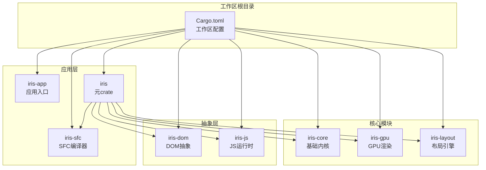

**图表来源**
- [Cargo.toml:1-29](file://Cargo.toml#L1-L29)
- [lib.rs:1-54](file://crates/iris/src/lib.rs#L1-L54)

### 模块组织原则

每个模块都遵循单一职责原则，通过清晰的边界进行解耦：

- **iris-core**：提供跨平台窗口管理、异步调度、内存池等基础能力
- **iris-gpu**：基于 WebGPU 的硬件渲染管线
- **iris-layout**：浏览器级布局和 CSS 引擎
- **iris-dom**：跨端 DOM/BOM 抽象与事件系统
- **iris-js**：JS 沙箱运行时（QuickJS + Vue3 runtime）
- **iris-sfc**：SFC/TS 即时转译层
- **iris-app**：应用入口点和热重载逻辑

**章节来源**
- [Cargo.toml:1-29](file://Cargo.toml#L1-L29)
- [lib.rs:1-54](file://crates/iris/src/lib.rs#L1-L54)

## 核心架构设计

### 分层架构模式

Iris Engine 采用了经典的分层架构，从底层硬件到上层应用形成清晰的层次结构：

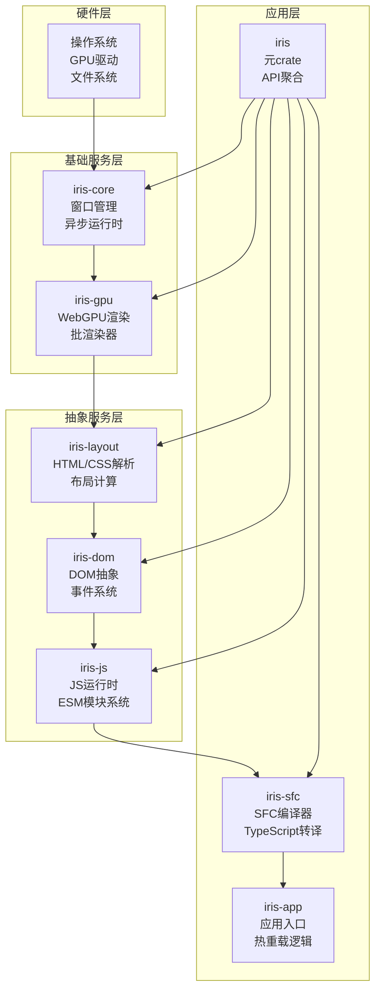

**图表来源**
- [lib.rs:42-53](file://crates/iris/src/lib.rs#L42-L53)
- [lib.rs:101-159](file://crates/iris-core/src/lib.rs#L101-L159)

### 初始化流程

系统采用自下而上的初始化策略，确保依赖关系正确建立：

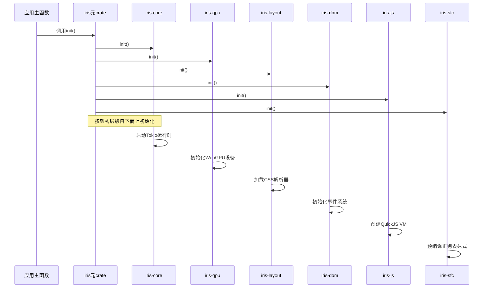

**图表来源**
- [lib.rs:42-53](file://crates/iris/src/lib.rs#L42-L53)
- [lib.rs:161-165](file://crates/iris-core/src/lib.rs#L161-L165)

**章节来源**
- [lib.rs:42-53](file://crates/iris/src/lib.rs#L42-L53)
- [lib.rs:161-165](file://crates/iris-core/src/lib.rs#L161-L165)

## 模块详解

### iris-core - 基础内核

iris-core 是整个系统的基石，提供了跨平台的基础能力：

#### 核心功能

- **异步运行时**：基于 Tokio 的多线程运行时，提供跨平台的异步任务调度
- **窗口管理**：桌面端基于 winit，提供统一的窗口创建和事件处理
- **应用生命周期**：定义了完整的应用生命周期回调接口

#### 关键组件

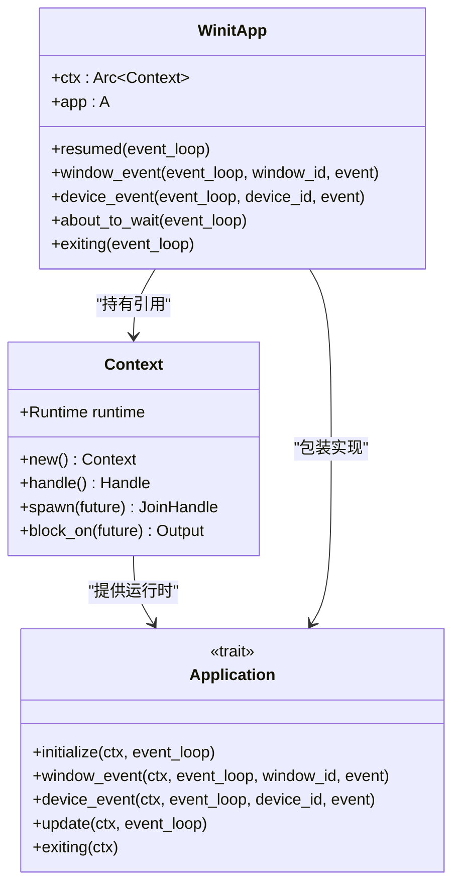

**图表来源**
- [lib.rs:13-56](file://crates/iris-core/src/lib.rs#L13-L56)
- [lib.rs:64-99](file://crates/iris-core/src/lib.rs#L64-L99)
- [lib.rs:101-159](file://crates/iris-core/src/lib.rs#L101-L159)

**章节来源**
- [lib.rs:13-56](file://crates/iris-core/src/lib.rs#L13-L56)
- [lib.rs:64-99](file://crates/iris-core/src/lib.rs#L64-L99)
- [lib.rs:101-159](file://crates/iris-core/src/lib.rs#L101-L159)

### iris-gpu - GPU渲染引擎

iris-gpu 提供了基于 WebGPU 的高性能渲染能力，实现了批渲染优化：

#### 批渲染系统

```mermaid
classDiagram
class BatchRenderer {
+Queue queue
+RenderPipeline render_pipeline
+Buffer vertex_buffer
+Buffer index_buffer
+Vec~BatchVertex~ vertices
+Vec~u16~ indices
+usize capacity
+f32 screen_width
+f32 screen_height
+submit(command)
+flush(render_pass)
+draw_count() usize
}
class BatchVertex {
+[f32; 2] position
+[f32; 4] color
+[f32; 2] uv
+desc() VertexBufferLayout
}
class DrawCommand {
<<enumeration>>
Rect {
f32 x
f32 y
f32 width
f32 height
[f32; 4] color
}
GradientRect {
f32 x
f32 y
f32 width
f32 height
[f32; 4] start_color
[f32; 4] end_color
bool horizontal
}
}
BatchRenderer --> BatchVertex : "使用"
BatchRenderer --> DrawCommand : "处理"
```

**图表来源**
- [batch_renderer.rs:87-100](file://crates/iris-gpu/src/batch_renderer.rs#L87-L100)
- [batch_renderer.rs:12-22](file://crates/iris-gpu/src/batch_renderer.rs#L12-L22)
- [batch_renderer.rs:52-85](file://crates/iris-gpu/src/batch_renderer.rs#L52-L85)

#### 渲染流程

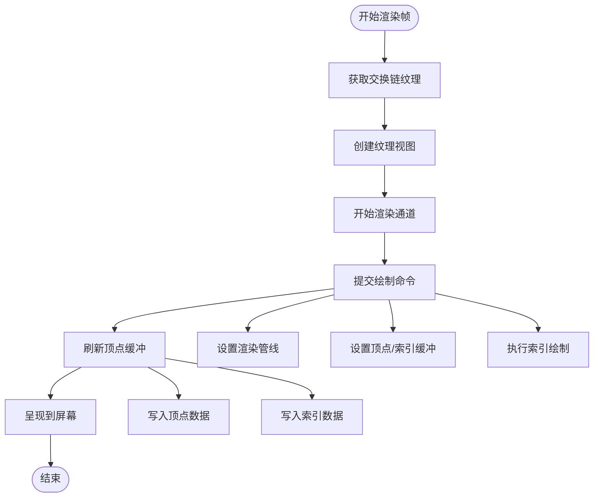

**图表来源**
- [lib.rs:386-487](file://crates/iris-gpu/src/lib.rs#L386-L487)
- [batch_renderer.rs:346-374](file://crates/iris-gpu/src/batch_renderer.rs#L346-L374)

**章节来源**
- [batch_renderer.rs:87-100](file://crates/iris-gpu/src/batch_renderer.rs#L87-L100)
- [lib.rs:386-487](file://crates/iris-gpu/src/lib.rs#L386-L487)

### iris-sfc - SFC编译器

iris-sfc 实现了 Vue SFC 的即时编译功能，支持零配置开发：

#### 编译架构

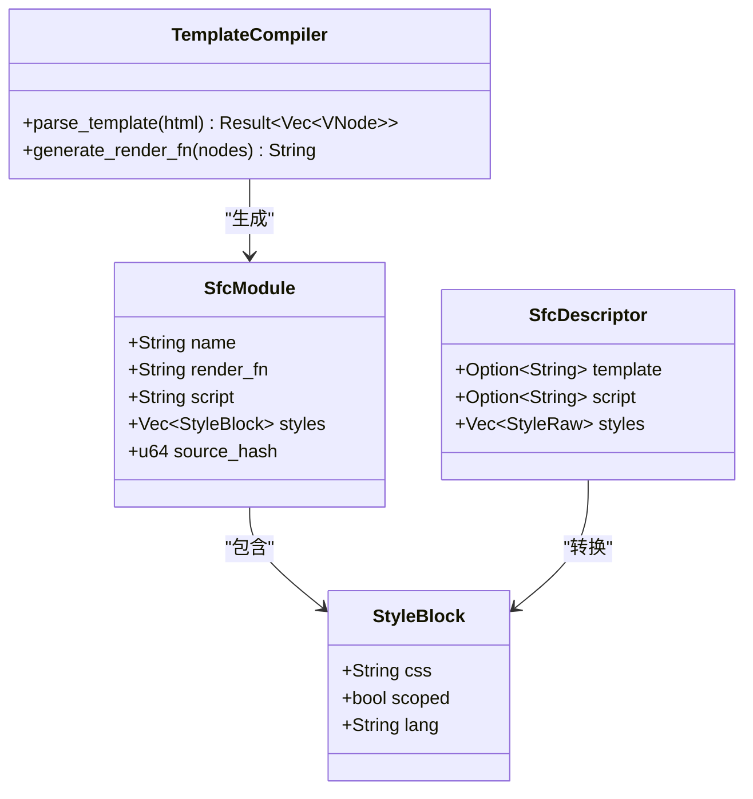

**图表来源**
- [lib.rs:36-60](file://crates/iris-sfc/src/lib.rs#L36-L60)
- [template_compiler.rs:9-28](file://crates/iris-sfc/src/template_compiler.rs#L9-L28)

#### 编译流程

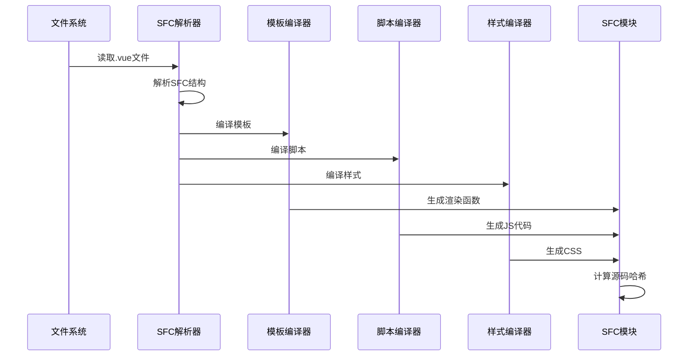

**图表来源**
- [lib.rs:161-209](file://crates/iris-sfc/src/lib.rs#L161-L209)
- [template_compiler.rs:65-86](file://crates/iris-sfc/src/template_compiler.rs#L65-L86)

**章节来源**
- [lib.rs:36-60](file://crates/iris-sfc/src/lib.rs#L36-L60)
- [lib.rs:161-209](file://crates/iris-sfc/src/lib.rs#L161-L209)
- [template_compiler.rs:65-86](file://crates/iris-sfc/src/template_compiler.rs#L65-L86)

### iris-app - 应用入口

iris-app 是面向开发者的最终入口点，实现了完整的热重载功能：

#### 热重载架构

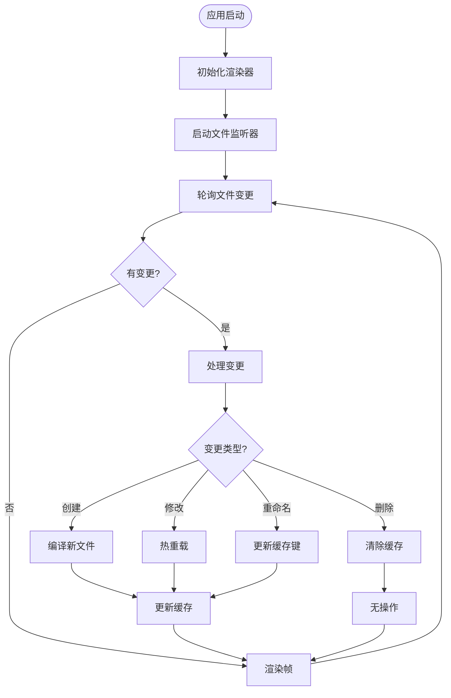

**图表来源**
- [main.rs:237-403](file://crates/iris-app/src/main.rs#L237-L403)

#### 缓存管理系统

```mermaid
classDiagram
class SfcModuleCache {
+PathBuf path
+SystemTime last_modified
+u64 cached_size
+SfcModuleState state
+new(path) SfcModuleCache
+get_file_info(path) (SystemTime, u64)
+is_modified() bool
+update() void
}
class SfcModuleState {
<<enumeration>>
Compiled
CompileError {
String error
SystemTime timestamp
}
}
class IrisApp {
+Option~Renderer~ renderer
+HashMap~PathBuf, SfcModuleCache~ sfc_cache
+Instant last_poll_time
+handle_sfc_hot_reload(changes)
+compile_and_cache_sfc(path)
+hot_reload_sfc(path)
}
IrisApp --> SfcModuleCache : "管理缓存"
SfcModuleCache --> SfcModuleState : "包含状态"
```

**图表来源**
- [main.rs:26-53](file://crates/iris-app/src/main.rs#L26-L53)
- [main.rs:124-132](file://crates/iris-app/src/main.rs#L124-L132)

**章节来源**
- [main.rs:237-403](file://crates/iris-app/src/main.rs#L237-L403)
- [main.rs:26-53](file://crates/iris-app/src/main.rs#L26-L53)

## 渲染流水线

### 完整渲染流程

Iris Engine 的渲染流水线经过精心设计，实现了高效的 GPU 资源管理和批处理优化：

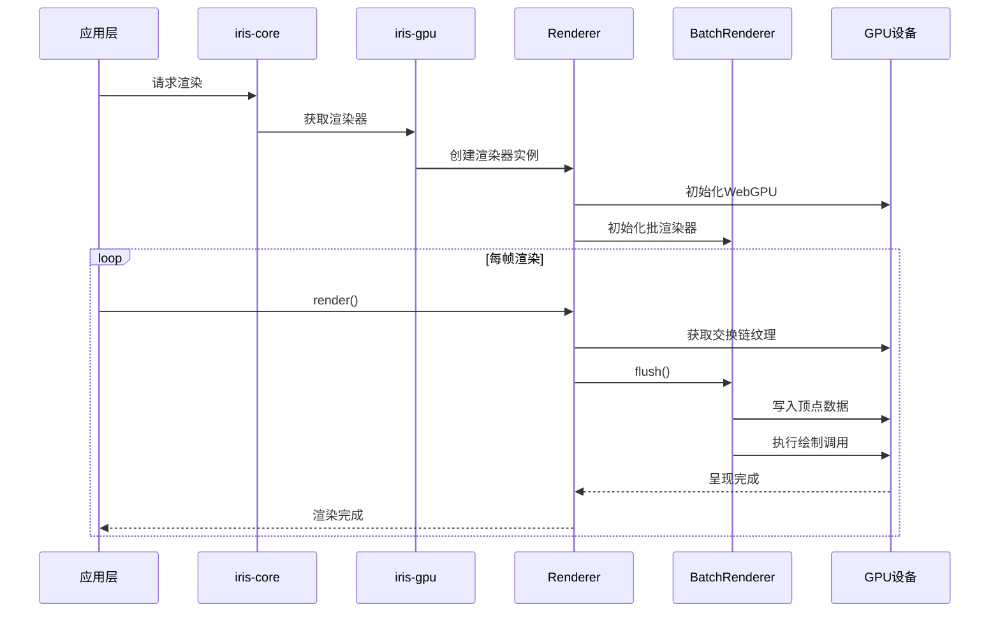

**图表来源**
- [lib.rs:386-487](file://crates/iris-gpu/src/lib.rs#L386-L487)
- [batch_renderer.rs:346-374](file://crates/iris-gpu/src/batch_renderer.rs#L346-L374)

### 批渲染优化

批渲染系统通过合并多次绘制调用为单次 GPU draw call，显著提升了渲染性能：

#### 性能指标

- **顶点缓冲区**：支持最多 1024 个矩形的批量渲染
- **索引缓冲区**：每个矩形使用 6 个索引，总计 6144 个索引
- **内存布局**：使用 bytemuck 实现零拷贝的内存布局
- **混合模式**：支持 Alpha 混合的正确处理

#### 渲染优化技术

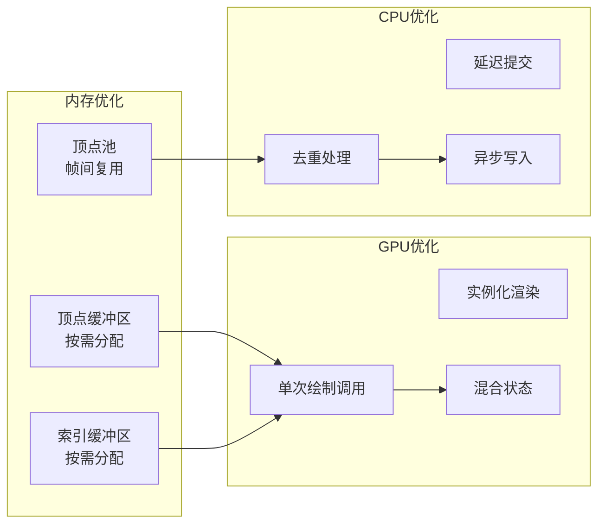

**图表来源**
- [batch_renderer.rs:176-202](file://crates/iris-gpu/src/batch_renderer.rs#L176-L202)
- [batch_renderer.rs:346-374](file://crates/iris-gpu/src/batch_renderer.rs#L346-L374)

**章节来源**
- [lib.rs:386-487](file://crates/iris-gpu/src/lib.rs#L386-L487)
- [batch_renderer.rs:176-202](file://crates/iris-gpu/src/batch_renderer.rs#L176-L202)

## 热重载机制

### 文件监听系统

Iris Engine 的热重载机制基于高效的文件监听和事件处理系统：

#### 文件监听架构

```mermaid
classDiagram
class FileWatcher {
-RecommendedWatcher _watcher
+Receiver~FileChange~ receiver
+WatcherConfig config
+Arc~AtomicBool~ channel_full_warned
+DebounceState debounce
+new(config) Result~FileWatcher~
+recv() Async~Option~FileChange~~
+try_recv() Option~FileChange~
+pending_events() usize
}
class WatcherConfig {
+PathBuf watch_path
+bool recursive
+Option~HashSet~String~~ extensions
+usize channel_capacity
+Duration debounce_delay
+new(path) WatcherConfig
+recursive(bool) WatcherConfig
+extensions(Vec~String~) WatcherConfig
+channel_capacity(usize) WatcherConfig
+debounce_delay(Duration) WatcherConfig
}
class FileChange {
<<enumeration>>
Created { PathBuf path }
Modified { PathBuf path }
Removed { PathBuf path }
Renamed { PathBuf from; PathBuf to }
+path() &PathBuf
+extension() Option~&str~
}
FileWatcher --> WatcherConfig : "使用配置"
FileWatcher --> FileChange : "产生事件"
WatcherConfig --> FileChange : "过滤条件"
```

**图表来源**
- [file_watcher.rs:172-187](file://crates/iris-gpu/src/file_watcher.rs#L172-L187)
- [file_watcher.rs:86-137](file://crates/iris-gpu/src/file_watcher.rs#L86-L137)
- [file_watcher.rs:42-84](file://crates/iris-gpu/src/file_watcher.rs#L42-L84)

#### 事件处理流程


**图表来源**
- [main.rs:237-403](file://crates/iris-app/src/main.rs#L237-L403)
- [file_watcher.rs:483-510](file://crates/iris-gpu/src/file_watcher.rs#L483-L510)

**章节来源**
- [file_watcher.rs:172-187](file://crates/iris-gpu/src/file_watcher.rs#L172-L187)
- [main.rs:237-403](file://crates/iris-app/src/main.rs#L237-L403)

## 依赖关系分析

### 模块依赖图

Iris Engine 的模块依赖关系清晰明确，遵循了依赖倒置原则：

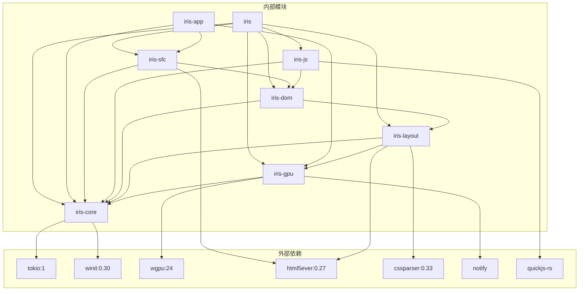

**图表来源**
- [Cargo.toml:13-28](file://Cargo.toml#L13-L28)

### 依赖管理策略

项目采用工作区级别的依赖管理，确保所有模块使用一致的版本：

- **内部依赖**：通过路径依赖确保版本一致性
- **外部依赖**：通过工作区级别定义统一版本
- **特性开关**：支持条件编译和平台特定功能

**章节来源**
- [Cargo.toml:13-28](file://Cargo.toml#L13-L28)

## 性能特性

### 渲染性能优化

Iris Engine 在多个层面实现了性能优化：

#### 内存优化

- **零拷贝布局**：使用 bytemuck 实现 GPU 数据的零拷贝传输
- **缓冲区复用**：批渲染器中的顶点和索引缓冲区按需分配和复用
- **异步写入**：通过 GPU 队列异步写入缓冲区数据

#### CPU 性能

- **预编译正则表达式**：SFC 编译器使用 LazyLock 优化正则表达式性能
- **防抖机制**：文件监听器内置防抖，避免频繁触发
- **事件去重**：同一文件的多次变更只保留最后一次

#### GPU 性能

- **批处理渲染**：将多个绘制调用合并为单次 GPU 调用
- **混合状态优化**：正确配置 Alpha 混合状态
- **资源复用**：渲染管线和缓冲区在应用生命周期内复用

### 性能监控

系统集成了完整的性能监控机制：

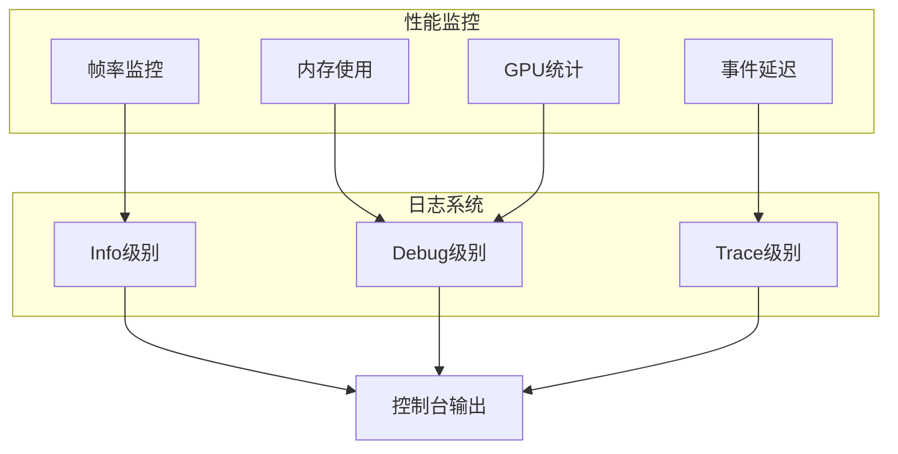

**章节来源**
- [lib.rs:18-34](file://crates/iris-sfc/src/lib.rs#L18-L34)
- [file_watcher.rs:40-41](file://crates/iris-gpu/src/file_watcher.rs#L40-L41)

## 开发指南

### 环境配置

#### Rust 工具链

项目使用稳定的 Rust 工具链，支持 Wasm 目标：

```toml
[toolchain]
channel = "stable"
components = ["rustfmt", "clippy"]
targets = ["wasm32-unknown-unknown"]
```

#### 开发工具

- **格式化**：使用 rustfmt 保持代码风格一致
- **静态分析**：使用 clippy 发现潜在问题
- **测试**：提供完整的单元测试和集成测试

### 常用开发命令

```bash
# 运行 SFC 编译器测试
cargo test -p iris-sfc template_compiler::tests

# 运行演示程序
cargo run -p iris-sfc --example sfc_demo

# 构建项目
cargo build -p iris-sfc

# 运行所有测试
cargo test
```

### 调试技巧

#### 日志配置

系统支持灵活的日志配置，可以通过环境变量控制日志级别：

```bash
# 设置日志级别
export RUST_LOG="info,iris_gpu::file_watcher=debug"

# 运行应用
cargo run
```

#### 性能分析

- **火焰图**：使用 perf 或 cargo-flamegraph 分析性能瓶颈
- **内存分析**：使用 valgrind 或 heaptrack 检测内存泄漏
- **GPU 分析**：使用 RenderDoc 或 gfxreplay 分析 GPU 性能

**章节来源**
- [QUICK-START.md:30-44](file://QUICK-START.md#L30-L44)
- [rust-toolchain.toml:1-5](file://rust-toolchain.toml#L1-L5)

## 总结

Iris Engine 代表了现代前端运行时系统的发展方向，通过 Rust 的内存安全性和 WebGPU 的硬件加速能力，实现了真正意义上的零配置开发体验。

### 主要优势

1. **架构清晰**：模块化设计使得每个组件职责明确，易于维护和扩展
2. **性能卓越**：批渲染、异步处理和资源复用确保了最佳性能表现
3. **开发友好**：零编译、热重载和完善的调试工具大大提升了开发效率
4. **跨平台**：统一的 API 支持桌面原生和浏览器环境

### 技术创新

- **即时编译**：SFC 编译器支持零配置运行，无需预编译步骤
- **智能缓存**：基于文件修改时间和大小的智能缓存机制
- **高效渲染**：批渲染系统将多次绘制调用优化为单次 GPU 调用
- **热重载**：完整的文件监听和热重载机制，支持毫秒级响应

### 未来发展方向

1. **完整 TypeScript 支持**：集成专业的 TypeScript 编译器
2. **WebGPU 扩展**：利用 WebGPU 的高级特性实现更丰富的渲染效果
3. **模块化加载**：实现按需加载和模块热替换
4. **性能监控**：提供更详细的性能分析和优化建议

Iris Engine 为 Rust 生态系统中的前端开发提供了一个全新的解决方案，它不仅技术先进，更重要的是为开发者提供了前所未有的开发体验。