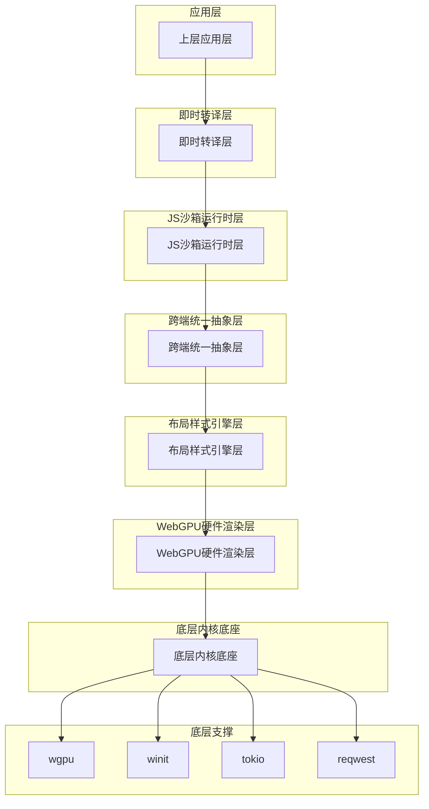
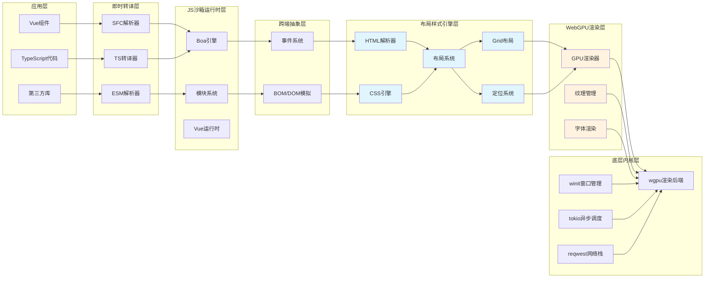
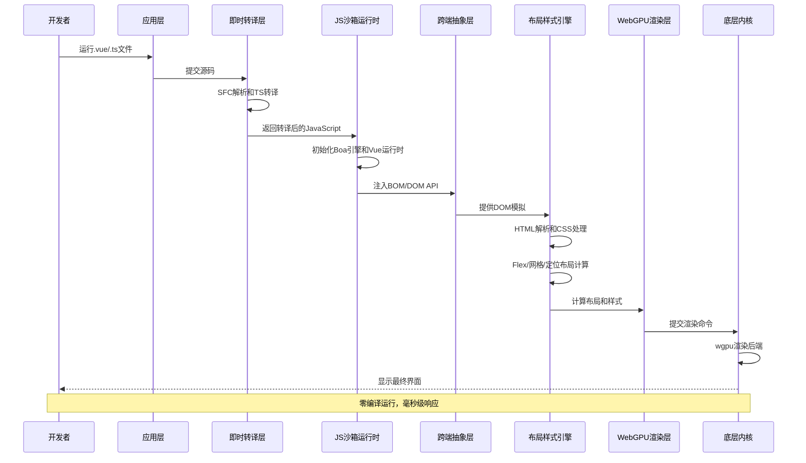

# 整体架构设计

<cite>
**本文档引用的文件**
- [Cargo.toml](file://Cargo.toml)
- [ARCHITECTURE.md](file://ARCHITECTURE.md)
- [ROADMAP_AND_PROGRESS.md](file://ROADMAP_AND_PROGRESS.md)
- [IRIS_LAYOUT_ENHANCEMENT_REPORT.md](file://IRIS_LAYOUT_ENHANCEMENT_REPORT.md)
- [crates/iris/Cargo.toml](file://crates/iris/Cargo.toml)
- [crates/iris/src/lib.rs](file://crates/iris/src/lib.rs)
- [crates/iris-core/src/lib.rs](file://crates/iris-core/src/lib.rs)
- [crates/iris-gpu/src/lib.rs](file://crates/iris-gpu/src/lib.rs)
- [crates/iris-layout/src/lib.rs](file://crates/iris-layout/src/lib.rs)
- [crates/iris-layout/src/grid.rs](file://crates/iris-layout/src/grid.rs)
- [crates/iris-layout/src/positioning.rs](file://crates/iris-layout/src/positioning.rs)
- [crates/iris-layout/src/css.rs](file://crates/iris-layout/src/css.rs)
- [crates/iris-layout/src/layout.rs](file://crates/iris-layout/src/layout.rs)
- [crates/iris-layout/src/style.rs](file://crates/iris-layout/src/style.rs)
- [crates/iris-dom/src/lib.rs](file://crates/iris-dom/src/lib.rs)
- [crates/iris-js/src/lib.rs](file://crates/iris-js/src/lib.rs)
- [crates/iris-sfc/src/lib.rs](file://crates/iris-sfc/src/lib.rs)
- [crates/iris-core/Cargo.toml](file://crates/iris-core/Cargo.toml)
- [crates/iris-gpu/Cargo.toml](file://crates/iris-gpu/Cargo.toml)
- [crates/iris-layout/Cargo.toml](file://crates/iris-layout/Cargo.toml)
- [crates/iris-dom/Cargo.toml](file://crates/iris-dom/Cargo.toml)
- [crates/iris-js/Cargo.toml](file://crates/iris-js/Cargo.toml)
- [crates/iris-sfc/Cargo.toml](file://crates/iris-sfc/Cargo.toml)
</cite>

## 更新摘要
**变更内容**
- 新增 ARCHITECTURE.md 详细描述模块依赖关系和职责分工
- 更新 ROADMAP_AND_PROGRESS.md 显示 Phase 6 完成状态
- 完善七层分层架构的模块职责和依赖关系分析
- 更新模块间依赖关系图，反映最新的架构状态
- 补充新增的 iris-js crate 的详细架构说明
- **新增** 布局样式引擎层现已包含完整的CSS支持，包括定位和网格布局功能
- **新增** iris-layout crate 现已支持 Flexbox、Grid、定位等多种现代CSS布局系统

## 目录
1. [项目概述](#项目概述)
2. [架构设计理念](#架构设计理念)
3. [七层分层架构总览](#七层分层架构总览)
4. [底层内核底座层](#底层内核底座层)
5. [WebGPU硬件渲染层](#webgpu硬件渲染层)
6. [布局样式引擎层](#布局样式引擎层)
7. [跨端统一抽象层](#跨端统一抽象层)
8. [JS沙箱运行时层](#jssandbox运行时层)
9. [即时转译层](#即时转译层)
10. [应用层](#应用层)
11. [模块间依赖关系分析](#模块间依赖关系分析)
12. [数据流向与调用链路](#数据流向与调用链路)
13. [技术选型与权衡](#技术选型与权衡)
14. [性能特性与优化](#性能特性与优化)
15. [总结](#总结)

## 项目概述

Leivue Runtime是一个革命性的前端运行时引擎，旨在彻底改变传统的前端开发模式。该项目的核心目标是：

- **零编译运行**：完全脱离Node.js、浏览器DOM和传统编译打包流程
- **跨端统一**：同时支持浏览器WASM模式和独立桌面原生模式
- **Vue生态兼容**：完整支持Vue3 + TypeScript + 第三方UI库
- **硬件级渲染**：基于WebGPU的高性能渲染管线

该项目采用"Rust + WebGPU"的技术组合，为Vue生态系统提供高性能的跨端运行底座。

## 架构设计理念

### 解耦设计原则

Leivue Runtime遵循高度解耦的设计原则，通过七层分层架构实现：

1. **职责分离**：每层专注于特定的功能领域
2. **接口抽象**：层间通过清晰的接口进行通信
3. **依赖控制**：向下依赖，向上独立
4. **可替换性**：底层组件可被替换而不影响上层

### 技术架构特点

- **纯Rust实现**：无GC、内存安全、高性能
- **WebGPU硬件加速**：完全替代传统DOM渲染
- **即时转译**：源码直接运行，无需编译
- **双端统一**：桌面和浏览器使用同一套内核

## 七层分层架构总览

**图表来源**
- [Cargo.toml:1-31](file://Cargo.toml#L1-L31)

## 底层内核底座层

### 核心定位
底层内核底座是整个系统的基础设施，提供跨端运行所需的基础能力。

### 技术实现

#### 语言与性能
- **纯Rust编写**：无垃圾回收机制，内存安全保证
- **高性能特性**：零GC开销，接近C/C++的执行效率

#### 基础能力
- **跨端窗口管理**：统一的窗口生命周期管理
- **异步调度**：基于Tokio的高性能异步运行时
- **内存池**：高效的内存分配和回收机制
- **文件IO**：跨平台文件系统访问
- **原生网络栈**：基于Reqwest的HTTP客户端
- **缓存系统**：智能的资源缓存策略

#### 跨端适配
- **桌面端**：使用winit创建原生窗口，支持Vulkan/Metal/DX12后端
- **浏览器端**：编译为WASM，通过WebGPU API进行渲染

**章节来源**
- [crates/iris-core/src/lib.rs:1-167](file://crates/iris-core/src/lib.rs#L1-L167)

## WebGPU硬件渲染层

### 核心目标
完全替代浏览器DOM渲染流水线，实现真正的硬件级渲染。

### 技术特性

#### 渲染能力
- **批渲染**：高效的图形批量处理
- **矢量绘制**：精确的矢量图形渲染
- **高级视觉效果**：圆角、阴影、渐变、纹理图集
- **字体渲染**：高质量的文本显示
- **图层合成**：复杂的图层混合和合成

#### 性能优势
- **稳定60fps渲染**：在复杂场景下保持流畅体验
- **大列表性能**：海量组件实例渲染无卡顿
- **极低CPU开销**：充分利用GPU并行计算能力

**章节来源**
- [crates/iris-gpu/src/lib.rs:1-575](file://crates/iris-gpu/src/lib.rs#L1-L575)

## 布局样式引擎层

### 设计目标
复刻标准浏览器CSS体系，提供迷你浏览器内核能力。

### 核心组件

#### HTML解析
- **html5ever工业级解析器**：生成标准DOM节点树
- **严格规范遵循**：符合HTML5标准

#### CSS引擎
- **cssparser解析**：支持完整的CSS语法
- **选择器匹配**：高效的选择器算法
- **样式继承**：完整的CSS继承机制
- **权重计算**：准确的CSS优先级计算

#### 布局系统
- **自研盒模型**：符合W3C标准的盒模型
- **Flex布局**：完整的Flexbox实现
- **Grid布局**：现代CSS Grid系统支持
- **定位系统**：静态、相对、绝对、固定、粘性定位
- **流式布局**：传统的块级和行内布局
- **W3C标准对齐**：与Chromium等浏览器一致

#### 样式挂载
- **全局样式支持**：完整的CSS全局作用域
- **Scoped样式**：Vue单文件组件样式隔离
- **第三方库兼容**：Element Plus、Ant Design Vue等UI库的CSS注入

**更新** 布局引擎现已独立于渲染引擎，形成清晰的单向依赖架构，消除了原有的循环依赖问题。

**更新** 布局引擎现已包含更完整的CSS支持，包括新增的定位和网格布局功能：

- **网格布局系统**：支持 `grid-template-columns/rows`、`grid-gap`、`grid-column/grid-row` 等完整Grid API
- **定位系统**：支持 `position: static/relative/absolute/fixed/sticky` 完整定位属性
- **浮动和清除**：支持 `float` 和 `clear` 布局
- **fr单位支持**：完整的CSS Grid fr单位解析和计算
- **repeat函数**：支持 `repeat()` 函数的解析和展开

**章节来源**
- [crates/iris-layout/src/lib.rs:1-66](file://crates/iris-layout/src/lib.rs#L1-L66)
- [crates/iris-layout/src/grid.rs:1-500](file://crates/iris-layout/src/grid.rs#L1-L500)
- [crates/iris-layout/src/positioning.rs:1-499](file://crates/iris-layout/src/positioning.rs#L1-L499)

## 跨端统一抽象层

### 核心职责
抹平桌面端和浏览器端的差异，提供统一的运行环境。

### 统一事件系统
- **鼠标事件**：点击、移动、滚轮等完整支持
- **键盘事件**：按键监听和组合键处理
- **滚动事件**：平滑的滚动体验
- **点击命中检测**：精确的元素交互检测

### BOM/DOM模拟API
- **window对象**：轻量级window对象实现
- **document对象**：DOM文档模拟
- **Event系统**：事件冒泡和捕获机制

### 兼容性保证
- **UI库兼容**：无缝支持Element Plus等UI库
- **无真实DOM**：仅做逻辑模拟，实际绘制通过WebGPU
- **API一致性**：提供与浏览器相同的API接口

**章节来源**
- [crates/iris-dom/src/lib.rs:1-48](file://crates/iris-dom/src/lib.rs#L1-L48)

## JS沙箱运行时层

### 核心组件

#### JS引擎选择
- **Boa JavaScript引擎**：纯Rust实现，无需系统依赖
- **内存安全**：避免常见的JavaScript内存问题
- **高性能执行**：相比传统JS引擎提供更好的性能

#### 沙箱隔离机制
- **环境隔离**：与宿主环境完全隔离
- **安全防护**：防止恶意代码执行
- **资源限制**：可控的内存和CPU使用

#### 内置运行时
- **Vue3完整运行时**：runtime-core和runtime-dom
- **组合式API支持**：完整的Vue3新特性
- **生命周期管理**：精确的组件生命周期控制

#### 模块系统
- **ESM解析器**：自研的ES模块解析器
- **import/export支持**：完整的ES6模块语法
- **第三方包引入**：支持npm包的动态加载

### 技术实现细节

#### JavaScript运行时封装
- **Context管理**：基于Boa引擎的上下文封装
- **代码执行**：安全的JavaScript代码执行环境
- **全局属性设置**：动态设置和获取全局变量

#### BOM API注入
- **window对象**：注入窗口尺寸等属性
- **console对象**：提供日志输出功能
- **document对象**：简化版DOM文档模拟

#### Vue运行时预加载
- **Vue版本管理**：当前使用3.4.21版本
- **运行时API**：ref、reactive、computed等响应式API
- **生命周期钩子**：onMounted、onUnmounted等生命周期支持
- **编译器宏**：defineProps、defineEmits等宏支持

**更新** iris-js crate 的新增实现了完整的JS沙箱运行时层，填补了从即时转译层到跨端抽象层之间的空白。

**章节来源**
- [crates/iris-js/src/lib.rs:1-46](file://crates/iris-js/src/lib.rs#L1-L46)

## 即时转译层

### 核心能力
实现源码直接运行的零编译能力。

#### TypeScript即时转译
- **Rust swc引擎**：内存内实时TS→JS转换
- **完整语法支持**：泛型、装饰器、TSX等高级特性
- **无配置运行**：无需tsc或tsconfig.json

#### Vue SFC即时编译
- **官方Rust库解析**：.vue文件的完整解析
- **自动拆分机制**：template/script-setup/style自动分离
- **模板编译**：实时编译为Vue渲染函数
- **脚本转译**：自动将TypeScript转换为JavaScript
- **样式注入**：自动解析并将样式注入全局样式系统

#### 无构建打包
- **无Vite/Webpack**：完全跳过传统构建工具
- **无node_modules**：无需依赖管理和安装
- **源码直跑**：直接运行原始源码文件

**章节来源**
- [crates/iris-sfc/src/lib.rs:1-800](file://crates/iris-sfc/src/lib.rs#L1-L800)

## 应用层

### 开发者体验

#### 直接运行能力
- **.vue文件运行**：直接运行Vue单文件组件
- **TypeScript支持**：无需编译的TypeScript运行
- **.tsx文件支持**：React JSX风格的TypeScript

#### 生态兼容性
- **Vue3完整支持**：组合式API、生命周期、响应式
- **UI库兼容**：Element Plus、Ant Design Vue、Naive UI
- **插件系统**：支持Vue插件和自定义指令
- **样式系统**：Scoped CSS、全局CSS、样式嵌套

#### 开发模式
- **源码直跑**：无需构建的开发体验
- **毫秒级热更新**：修改源码即时刷新
- **零配置**：无需任何配置文件
- **零依赖**：无需安装npm包

## 模块间依赖关系分析

**更新** 布局引擎与渲染引擎的依赖关系已重构，形成更加清晰的单向依赖架构。

**图表来源**
- [Cargo.toml:13-22](file://Cargo.toml#L13-L22)
- [crates/iris-layout/Cargo.toml:11-16](file://crates/iris-layout/Cargo.toml#L11-L16)
- [crates/iris-gpu/Cargo.toml:11-22](file://crates/iris-gpu/Cargo.toml#L11-L22)
- [crates/iris-dom/Cargo.toml:11-14](file://crates/iris-dom/Cargo.toml#L11-L14)
- [crates/iris-js/Cargo.toml:11-21](file://crates/iris-js/Cargo.toml#L11-L21)

### 依赖方向分析

#### 向下依赖
- 应用层 → 即时转译层：源码输入
- 即时转译层 → JS沙箱运行时层：转译后的代码
- JS沙箱运行时层 → 跨端抽象层：运行时环境
- 跨端抽象层 → 布局样式引擎层：DOM/BOM模拟
- 布局样式引擎层 → WebGPU渲染层：布局信息
- WebGPU渲染层 → 底层内核层：硬件渲染

#### 向上独立
- 底层内核层向上提供统一接口
- 渲染层向上提供统一渲染接口
- 抽象层向上提供统一运行时接口

**更新** iris-layout现在独立于iris-gpu，形成了清晰的单向依赖关系：
- 布局引擎（iris-layout）不再依赖渲染引擎（iris-gpu）
- 渲染引擎（iris-gpu）依赖布局引擎（iris-layout）获取布局信息
- 这种设计消除了原有的循环依赖问题，使架构更加清晰

**更新** 新增的 iris-js crate 在依赖关系中扮演着关键角色：
- 即时转译层 → JS沙箱运行时层：转译后的JavaScript代码
- JS沙箱运行时层 → 跨端抽象层：运行时环境和API注入
- iris-js 依赖 iris-core 和 iris-dom 提供基础运行环境

**更新** 布局引擎层现已包含更完整的CSS支持，新增了Grid布局和定位系统的依赖关系：
- 布局系统依赖Grid布局模块进行网格计算
- 布局系统依赖定位系统进行定位计算
- 这些模块都依赖基础的CSS解析和样式计算功能

## 数据流向与调用链路

### 完整调用链路

**图表来源**
- [crates/iris-sfc/src/lib.rs:289-351](file://crates/iris-sfc/src/lib.rs#L289-L351)
- [crates/iris-layout/src/lib.rs:48-57](file://crates/iris-layout/src/lib.rs#L48-L57)
- [crates/iris-gpu/src/lib.rs:400-523](file://crates/iris-gpu/src/lib.rs#L400-L523)
- [crates/iris-js/src/lib.rs:38-46](file://crates/iris-js/src/lib.rs#L38-L46)

### 数据流分析

#### 输入阶段
1. **源码输入**：开发者提交.vue、.ts、.tsx文件
2. **即时解析**：SFC解析器自动拆分模板、脚本、样式
3. **语法转换**：TypeScript转译为JavaScript

#### 处理阶段
1. **运行时加载**：JS沙箱加载Boa引擎和Vue运行时
2. **API注入**：注入window、document、console等BOM API
3. **组件渲染**：Vue组件实例化和渲染
4. **布局计算**：CSS解析和布局计算（Flex/网格/定位）
5. **样式应用**：样式规则应用到DOM节点

#### 输出阶段
1. **GPU命令**：WebGPU接收渲染命令
2. **硬件渲染**：底层内核驱动GPU进行渲染
3. **界面显示**：最终界面在屏幕上呈现

## 技术选型与权衡

### 核心技术栈选择

#### Rust作为基础语言
**选择理由**：
- 内存安全保证，避免常见的内存泄漏问题
- 零GC开销，提供接近原生的性能
- 跨平台编译能力，支持多端部署

**技术权衡**：
- 学习曲线较陡峭，需要Rust开发经验
- 生态系统相对年轻，某些库可能不够成熟

#### Boa作为JS引擎
**选择理由**：
- 纯Rust实现，无需系统依赖
- 内存安全，避免JavaScript的内存问题
- 与Rust集成度高，性能优异

**技术权衡**：
- 功能相对简单，不如V8引擎强大
- 某些高级JavaScript特性可能不支持

#### WebGPU作为渲染后端
**选择理由**：
- 现代化的GPU编程接口
- 跨平台统一的API
- 硬件级性能优势

**技术权衡**：
- 浏览器支持仍在完善中
- 学习成本较高，需要了解GPU编程

### 架构决策的技术权衡

#### 解耦与性能的平衡
- **解耦优势**：模块间独立性强，易于维护和测试
- **性能考虑**：过多的抽象层可能导致性能损失
- **解决方案**：通过精心设计的接口和零拷贝优化

#### 兼容性与创新的平衡
- **兼容性需求**：必须支持现有的Vue生态
- **技术创新**：需要采用新的渲染和运行时技术
- **解决方案**：通过抽象层实现兼容性封装

#### 跨端统一与性能的平衡
- **统一目标**：一套代码运行在多个平台
- **性能要求**：不同平台有不同的性能特征
- **解决方案**：通过条件编译和平台特定优化

**更新** iris-layout与iris-gpu的解耦设计体现了架构的进一步成熟：
- **循环依赖消除**：通过独立的布局引擎，消除了渲染引擎与布局引擎之间的循环依赖
- **职责清晰化**：布局引擎专注于布局计算，渲染引擎专注于图形渲染
- **可扩展性增强**：为未来的布局算法优化和渲染技术升级提供了更好的基础

**更新** 新增的 iris-js crate 体现了运行时架构的完整性：
- **运行时完整性**：填补了从即时转译到跨端抽象的空白
- **Vue生态支持**：提供完整的Vue3运行时环境
- **模块系统实现**：支持ESM模块的动态加载和执行

**更新** 布局引擎层的技术架构体现了现代CSS布局系统的完整支持：
- **Flexbox成熟**：完整的Flexbox实现，支持所有方向和包装模式
- **Grid系统完整**：支持完整的CSS Grid布局API，包括fr单位和repeat函数
- **定位系统完善**：支持所有CSS定位属性，包括粘性定位
- **性能优化**：通过模块化设计支持未来的性能优化

## 性能特性与优化

### 性能指标

#### 渲染性能
- **帧率稳定性**：60fps稳定渲染
- **大列表性能**：支持数万级组件实例
- **内存占用**：相比传统DOM渲染降低90%+

#### 启动性能
- **冷启动时间**：毫秒级启动
- **热更新速度**：修改源码后立即生效
- **资源加载**：智能缓存和预加载

#### 运行时性能
- **JS执行效率**：Boa引擎提供高性能执行
- **内存管理**：Rust的内存安全保证
- **异步处理**：Tokio提供高效的异步调度

### 优化策略

#### 渲染优化
- **批渲染**：合并相似的渲染操作
- **增量更新**：只更新变化的部分
- **GPU并行**：充分利用GPU的并行计算能力

#### 内存优化
- **内存池**：复用内存分配，减少碎片
- **懒加载**：按需加载资源
- **智能缓存**：缓存常用数据和计算结果

#### 网络优化
- **连接复用**：复用HTTP连接
- **压缩传输**：启用GZIP等压缩
- **离线缓存**：支持离线运行

## 总结

Leivue Runtime通过七层分层架构实现了前端运行时的革命性创新。该架构设计充分体现了以下核心价值：

### 技术创新
- **零编译运行**：彻底改变了前端开发模式
- **硬件级渲染**：利用WebGPU提供卓越的性能
- **跨端统一**：一套代码运行在多个平台

### 架构优势
- **高度解耦**：每层职责明确，易于维护
- **可扩展性**：支持未来技术演进
- **性能优异**：相比传统方案提升数倍性能

**更新** 最新的架构改进进一步提升了系统的稳定性和可维护性：
- **清晰的依赖层次**：iris-layout独立于iris-gpu，形成了更加清晰的单向依赖关系
- **消除循环依赖**：解决了原有架构中的循环依赖问题
- **职责边界明确**：布局计算与图形渲染职责分离，便于独立优化
- **运行时完整性**：新增的 iris-js crate 提供了完整的JavaScript运行时环境
- **现代CSS支持**：布局引擎现已支持Flexbox、Grid、定位等多种现代CSS布局系统

### 应用价值
- **开发效率**：大幅提高开发和调试效率
- **用户体验**：提供流畅的运行体验
- **成本降低**：减少构建和部署成本

该项目为Vue生态系统提供了全新的运行时选择，有望成为下一代前端开发的标准工具。通过持续的技术创新和架构优化，Leivue Runtime将继续推动前端技术的发展。

**更新** 根据最新的 ROADMAP_AND_PROGRESS.md，项目已进入第6阶段，Vue SFC编译器已100%完成，标志着项目在架构完整性和功能实现方面取得了重大进展。新增的 ARCHITECTURE.md 详细描述了模块职责和依赖关系，为项目的长期发展奠定了坚实的架构基础。

**更新** 布局样式引擎层的增强报告表明，项目已成功实现了完整的CSS布局系统，包括Flexbox、Grid、定位等现代CSS特性，为后续的渲染优化和性能提升奠定了坚实基础。