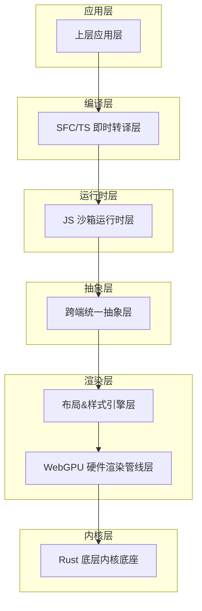
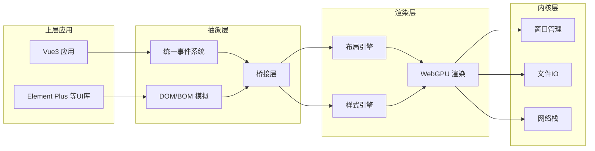
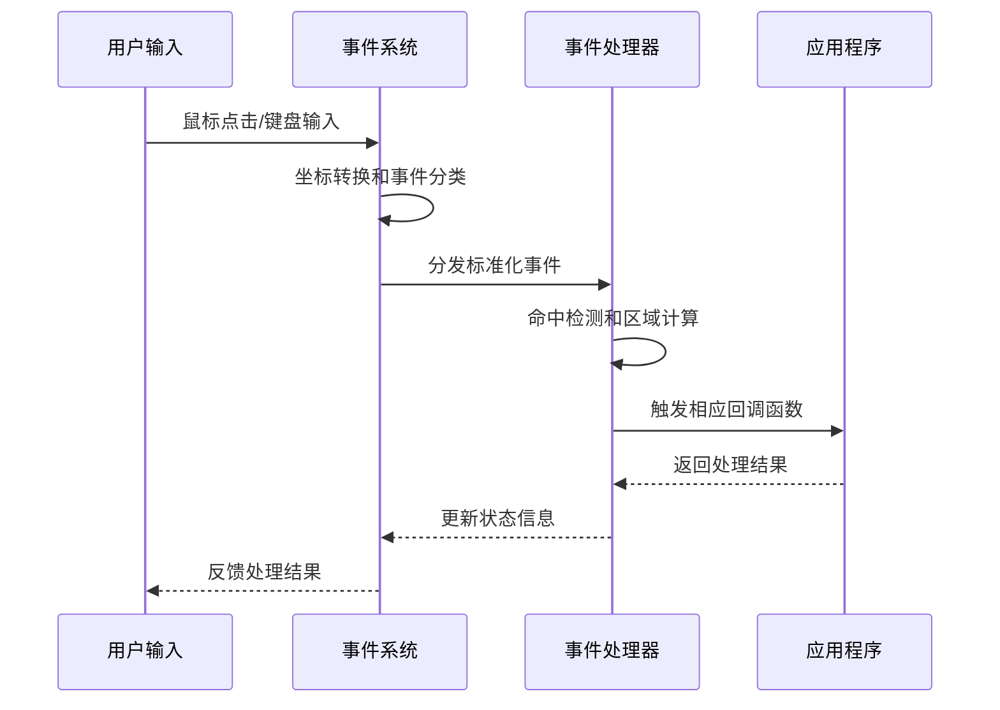
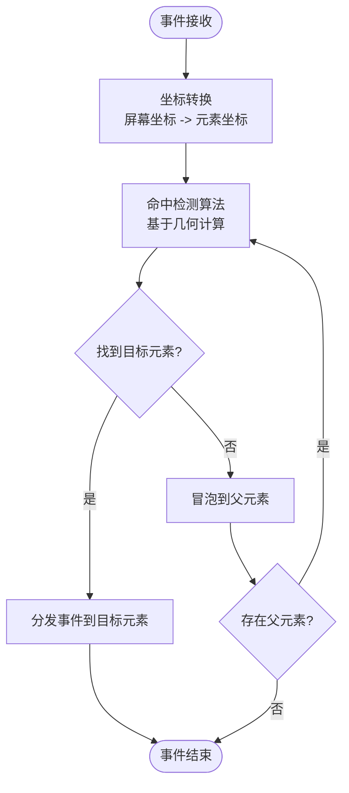
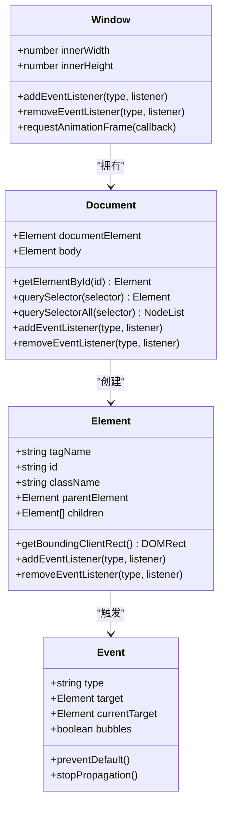
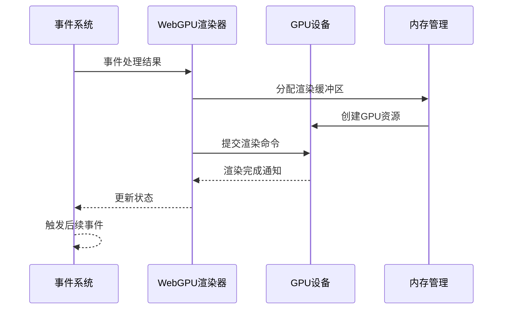
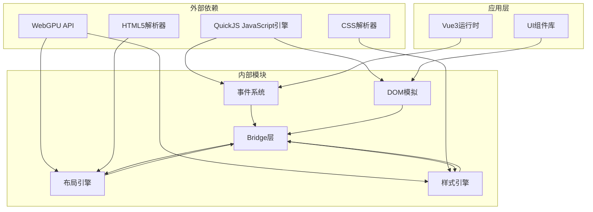

# 跨端抽象层

<cite>
**本文档引用的文件**
- [doc.txt](file://doc.txt)
- [todo.txt](file://todo.txt)
</cite>

## 目录
1. [引言](#引言)
2. [项目结构](#项目结构)
3. [核心组件](#核心组件)
4. [架构概览](#架构概览)
5. [详细组件分析](#详细组件分析)
6. [依赖关系分析](#依赖关系分析)
7. [性能考虑](#性能考虑)
8. [故障排除指南](#故障排除指南)
9. [结论](#结论)

## 引言

Leivue Runtime是一个基于Rust和WebGPU的下一代无构建前端运行时引擎。该项目的核心目标是提供一套完全脱离传统浏览器DOM渲染流水线的高性能跨端解决方案，能够直接运行Vue3 + TypeScript代码，并完全兼容Element Plus、Ant Design Vue等主流UI组件库。

跨端抽象层作为整个系统架构中的关键中间层，承担着抹平不同运行环境差异的重要职责。它通过统一的事件系统和轻量级的BOM/DOM模拟API，为上层应用提供了与传统浏览器环境一致的编程体验，同时为底层WebGPU渲染层提供了必要的数据接口。

## 项目结构

基于项目文档的描述，Leivue Runtime采用七层分层架构设计，每层都有明确的职责分工：

**图表来源**
- [doc.txt:7-22](file://doc.txt#L7-L22)

**章节来源**
- [doc.txt:7-22](file://doc.txt#L7-L22)

## 核心组件

跨端抽象层作为连接上层应用和底层渲染的关键桥梁，主要包含以下核心组件：

### 统一事件系统

跨端抽象层实现了完整的统一事件系统，能够处理多种类型的用户交互事件：

- **鼠标事件**：支持点击、双击、移动、按下、释放等完整鼠标交互
- **键盘事件**：支持按键按下、释放、输入等键盘操作
- **滚动事件**：支持垂直和水平滚动，以及滚动位置检测
- **点击命中检测**：基于坐标计算的精确点击区域识别

### BOM/DOM模拟API

为了确保第三方UI库的无缝兼容，抽象层提供了轻量级的BOM/DOM模拟实现：

- **Window对象**：提供窗口尺寸、焦点状态等基本属性
- **Document对象**：提供DOM节点查询、事件监听等核心方法
- **Event对象**：支持标准事件类型和事件传播机制

### 无真实DOM逻辑模拟

抽象层采用"无真实DOM"的策略，通过逻辑模拟替代传统的DOM操作，所有实际绘制都通过WebGPU渲染层完成。

**章节来源**
- [doc.txt:41-45](file://doc.txt#L41-L45)

## 架构概览

跨端抽象层在整个系统架构中扮演着承上启下的关键角色，它需要同时满足上层应用的浏览器环境API需求和底层渲染层的性能要求。

**图表来源**
- [doc.txt:16-22](file://doc.txt#L16-L22)

## 详细组件分析

### 统一事件系统设计

统一事件系统是跨端抽象层的核心组件之一，它需要处理来自不同输入设备的事件并将其转换为上层应用可理解的格式。

#### 事件处理流程

**图表来源**
- [doc.txt:42](file://doc.txt#L42)

#### 点击命中检测机制

点击命中检测是事件系统中的关键技术，它需要准确识别用户点击的具体元素：

**图表来源**
- [doc.txt:42](file://doc.txt#L42)

### BOM/DOM模拟API实现

为了确保第三方UI库的兼容性，跨端抽象层提供了轻量级的BOM/DOM模拟实现。

#### 模拟API架构

**图表来源**
- [doc.txt:43](file://doc.txt#L43)

#### 与WebGPU渲染层的协作

跨端抽象层与WebGPU渲染层之间建立了紧密的协作关系，通过事件驱动的方式实现数据传递：

**图表来源**
- [doc.txt:45](file://doc.txt#L45)

**章节来源**
- [doc.txt:41-45](file://doc.txt#L41-L45)

## 依赖关系分析

跨端抽象层在系统架构中处于关键位置，它需要协调多个层次之间的依赖关系。

**图表来源**
- [doc.txt:23-50](file://doc.txt#L23-L50)

**章节来源**
- [doc.txt:23-50](file://doc.txt#L23-L50)

## 性能考虑

跨端抽象层在设计时充分考虑了性能优化，特别是在事件处理和渲染协作方面：

### 事件处理性能优化

- **事件批处理**：将多个连续事件合并处理，减少上下文切换开销
- **坐标缓存**：缓存元素的几何信息，避免重复计算
- **事件队列管理**：使用高效的事件队列实现，支持优先级处理

### 渲染协作优化

- **零拷贝传输**：通过内存映射实现数据在抽象层和渲染层之间的高效传输
- **异步渲染**：利用WebGPU的异步特性，避免阻塞主线程
- **资源池管理**：复用GPU资源，减少资源分配和销毁开销

## 故障排除指南

### 常见问题及解决方案

#### 事件处理异常

**问题症状**：用户交互无响应或响应延迟

**可能原因**：
- 事件坐标转换错误
- 命中检测算法失效
- 事件分发链路中断

**解决步骤**：
1. 检查事件坐标的转换逻辑
2. 验证命中检测算法的准确性
3. 确认事件分发链路的完整性

#### 渲染性能问题

**问题症状**：界面卡顿或帧率不稳定

**可能原因**：
- GPU资源分配不当
- 渲染命令过多
- 内存泄漏

**解决步骤**：
1. 分析GPU资源使用情况
2. 优化渲染命令的批量处理
3. 检查内存管理逻辑

**章节来源**
- [doc.txt:65-97](file://doc.txt#L65-L97)

## 结论

Leivue Runtime的跨端抽象层代表了前端运行时技术的一个重要发展方向。通过统一事件系统和轻量级DOM模拟API，它成功地解决了传统浏览器环境与现代GPU渲染技术之间的兼容性问题。

该抽象层的设计体现了几个关键特点：

1. **架构解耦**：通过清晰的分层设计，实现了各组件间的松耦合
2. **性能优先**：采用逻辑模拟和GPU直连的方式，最大化渲染性能
3. **生态兼容**：通过标准API模拟，确保与现有Vue生态的无缝集成
4. **跨端统一**：为桌面和浏览器两种运行环境提供一致的编程体验

随着项目的进一步发展，跨端抽象层将继续演进，为构建高性能、跨平台的前端应用提供坚实的基础。