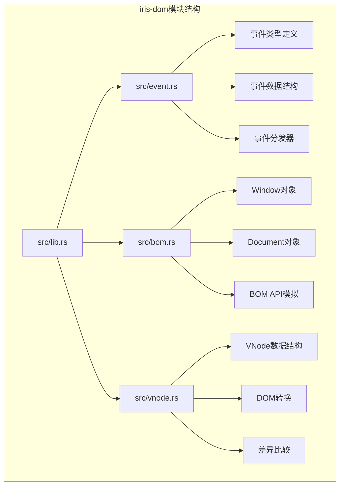
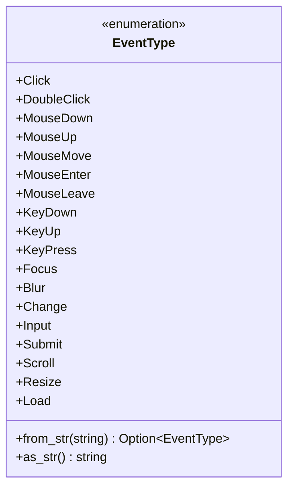
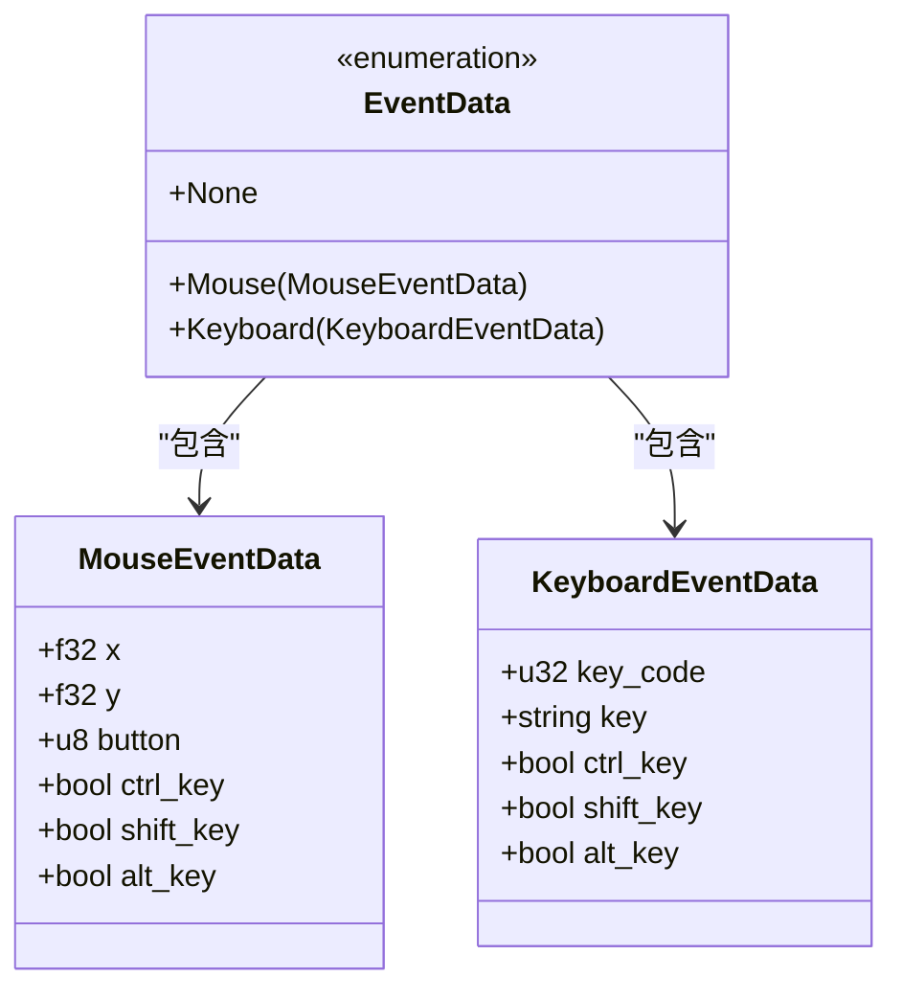
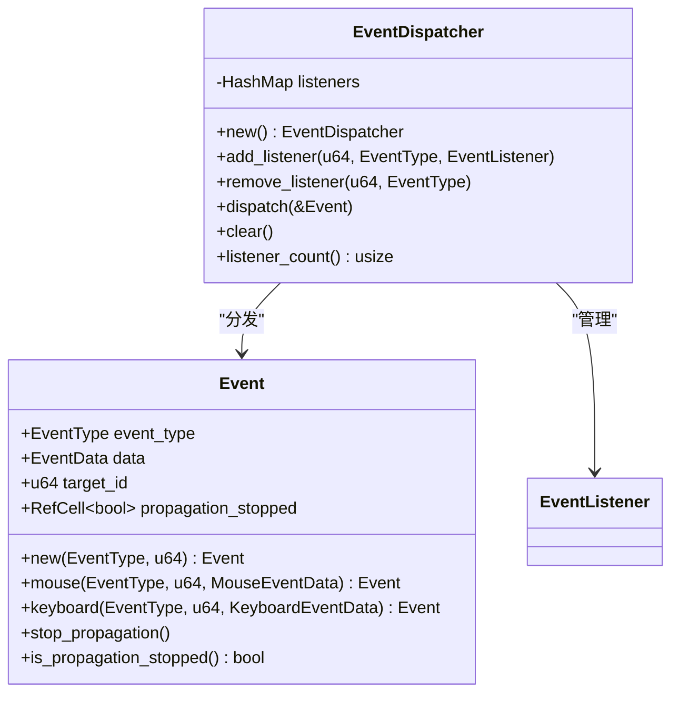
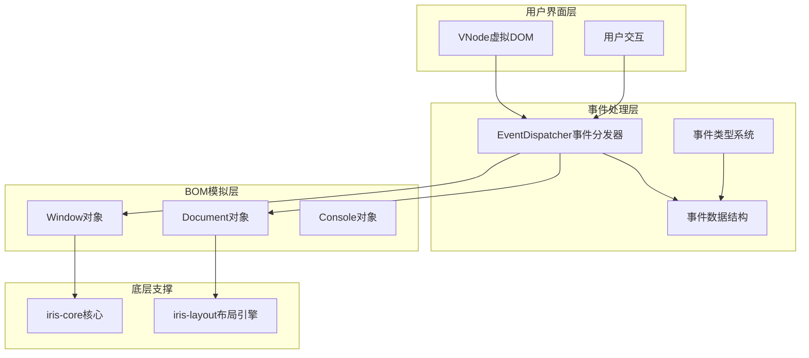
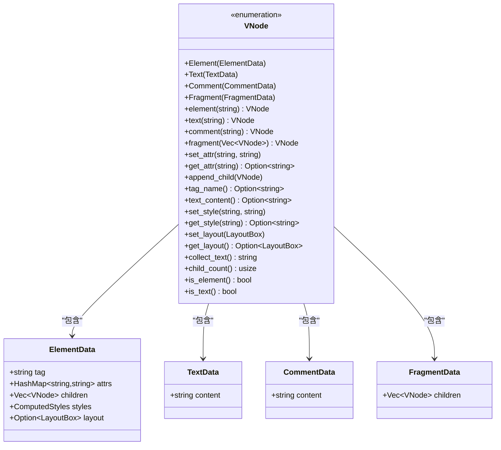
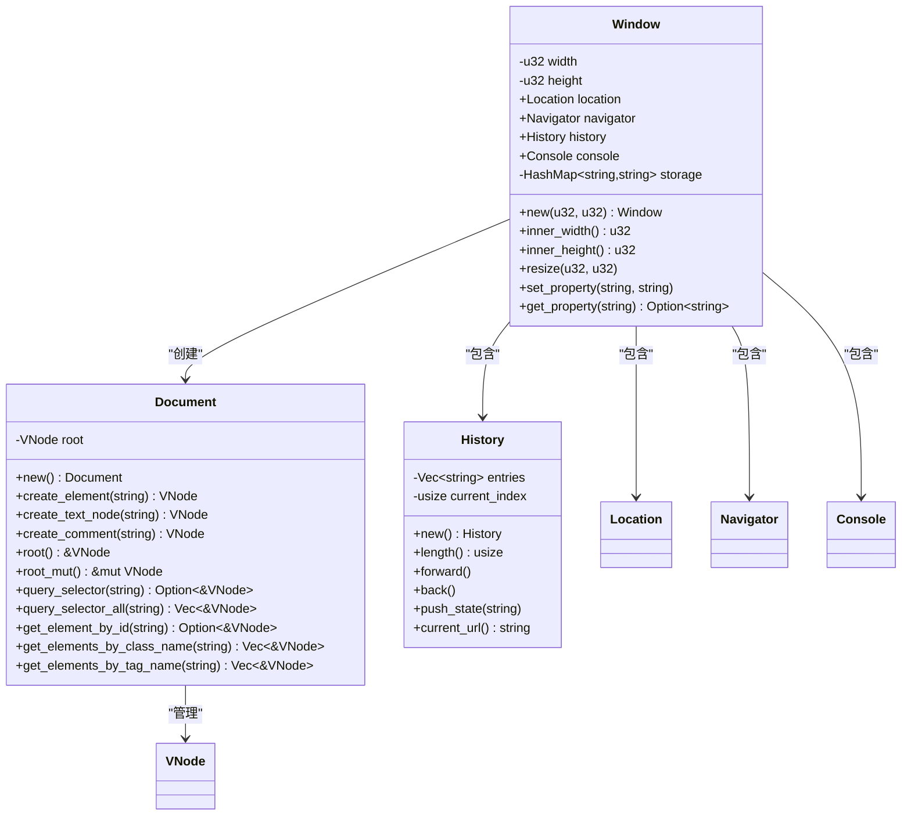
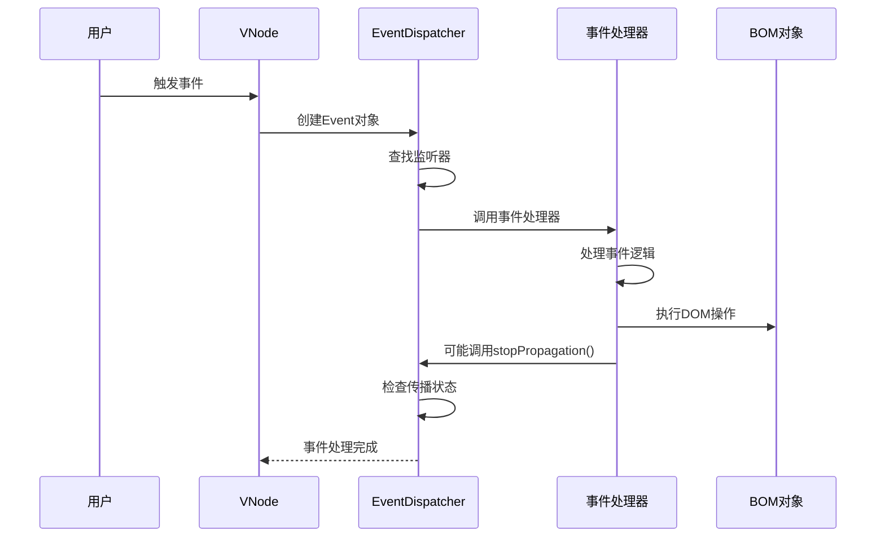
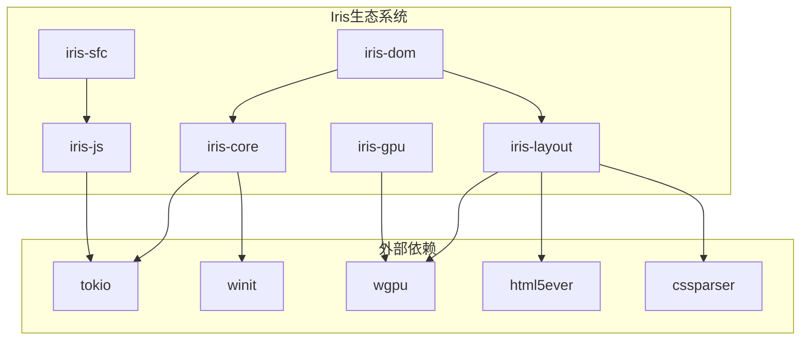

# iris-dom事件系统

<cite>
**本文档引用的文件**
- [lib.rs](file://crates/iris-dom/src/lib.rs)
- [event.rs](file://crates/iris-dom/src/event.rs)
- [bom.rs](file://crates/iris-dom/src/bom.rs)
- [vnode.rs](file://crates/iris-dom/src/vnode.rs)
- [Cargo.toml](file://crates/iris-dom/Cargo.toml)
- [lib.rs](file://crates/iris-core/src/lib.rs)
- [lib.rs](file://crates/iris-layout/src/lib.rs)
- [Cargo.toml](file://Cargo.toml)
</cite>

## 目录
1. [简介](#简介)
2. [项目结构](#项目结构)
3. [核心组件](#核心组件)
4. [架构概览](#架构概览)
5. [详细组件分析](#详细组件分析)
6. [依赖关系分析](#依赖关系分析)
7. [性能考虑](#性能考虑)
8. [故障排除指南](#故障排除指南)
9. [结论](#结论)

## 简介

iris-dom事件系统是Iris跨平台框架中的核心组件，提供统一的事件处理机制，抹平了浏览器与桌面原生环境之间的差异。该系统采用虚拟DOM（VNode）作为事件目标，结合轻量级BOM/DOM模拟API，实现了完整的事件生命周期管理。

系统的主要特点包括：
- 统一的事件类型系统（鼠标、键盘、滚动、表单等）
- 轻量级的事件分发器
- 虚拟DOM事件绑定机制
- BOM API模拟（Window/Document）
- 无真实DOM，仅做逻辑模拟，实际绘制通过WebGPU

## 项目结构

iris-dom位于crates/iris-dom目录下，采用模块化设计，主要包含以下核心模块：

**图表来源**
- [lib.rs:1-48](file://crates/iris-dom/src/lib.rs#L1-L48)
- [event.rs:1-414](file://crates/iris-dom/src/event.rs#L1-L414)
- [bom.rs:1-465](file://crates/iris-dom/src/bom.rs#L1-L465)
- [vnode.rs:1-454](file://crates/iris-dom/src/vnode.rs#L1-L454)

**章节来源**
- [lib.rs:1-48](file://crates/iris-dom/src/lib.rs#L1-L48)
- [Cargo.toml:1-14](file://crates/iris-dom/Cargo.toml#L1-L14)

## 核心组件

### 事件类型系统

事件系统支持多种标准浏览器事件类型：

**图表来源**
- [event.rs:8-107](file://crates/iris-dom/src/event.rs#L8-L107)

### 事件数据结构

系统提供了专门的事件数据结构来封装不同类型的数据：

**图表来源**
- [event.rs:109-143](file://crates/iris-dom/src/event.rs#L109-L143)

### 事件分发器

事件分发器是系统的核心组件，负责管理事件监听器和事件分发：

**图表来源**
- [event.rs:203-280](file://crates/iris-dom/src/event.rs#L203-L280)

**章节来源**
- [event.rs:1-414](file://crates/iris-dom/src/event.rs#L1-L414)

## 架构概览

iris-dom事件系统采用三层架构设计：

**图表来源**
- [lib.rs:8-12](file://crates/iris-dom/src/lib.rs#L8-L12)
- [lib.rs:39-47](file://crates/iris-dom/src/lib.rs#L39-L47)

系统的工作流程如下：

1. **事件生成**：用户交互触发事件（鼠标点击、键盘输入等）
2. **事件封装**：将原始事件数据封装为Event对象
3. **事件分发**：EventDispatcher根据目标节点ID和事件类型查找监听器
4. **事件处理**：调用注册的事件处理器
5. **传播控制**：支持事件冒泡和停止传播
6. **BOM交互**：通过Window和Document对象进行DOM操作

## 详细组件分析

### 虚拟DOM与事件绑定

VNode系统提供了完整的DOM树结构，支持事件绑定和管理：

**图表来源**
- [vnode.rs:10-211](file://crates/iris-dom/src/vnode.rs#L10-L211)

### BOM API模拟

系统提供了完整的BOM API模拟，包括Window、Document和History对象：

**图表来源**
- [bom.rs:152-367](file://crates/iris-dom/src/bom.rs#L152-L367)

### 事件生命周期

事件系统遵循标准的DOM事件生命周期：

**图表来源**
- [event.rs:254-269](file://crates/iris-dom/src/event.rs#L254-L269)

**章节来源**
- [vnode.rs:1-454](file://crates/iris-dom/src/vnode.rs#L1-L454)
- [bom.rs:1-465](file://crates/iris-dom/src/bom.rs#L1-L465)

## 依赖关系分析

iris-dom事件系统依赖于其他Iris核心组件：

**图表来源**
- [Cargo.toml:13-30](file://Cargo.toml#L13-L30)
- [Cargo.toml:11-14](file://crates/iris-dom/Cargo.toml#L11-L14)

### 核心依赖说明

1. **iris-core**：提供异步运行时和平台能力
2. **iris-layout**：提供HTML解析、CSS解析和布局计算
3. **tokio**：异步运行时支持
4. **winit**：窗口管理
5. **wgpu**：WebGPU图形渲染

**章节来源**
- [lib.rs:1-167](file://crates/iris-core/src/lib.rs#L1-L167)
- [lib.rs:1-38](file://crates/iris-layout/src/lib.rs#L1-L38)

## 性能考虑

### 事件处理优化

1. **监听器查找优化**：使用HashMap进行O(1)的监听器查找
2. **事件传播控制**：通过RefCell实现内部可变性，避免不必要的克隆
3. **内存管理**：使用Rc智能指针减少内存分配
4. **批量处理**：支持多个监听器的批量调用

### 虚拟DOM优化

1. **差异比较算法**：高效的VNode差异比较，最小化DOM更新
2. **样式缓存**：ComputedStyles缓存计算结果
3. **布局优化**：LayoutBox缓存布局信息
4. **文本收集**：递归文本收集优化

### BOM对象优化

1. **延迟初始化**：BOM对象按需创建
2. **内存池**：历史记录使用Vec进行内存优化
3. **属性存储**：HashMap存储全局属性，支持快速查找

## 故障排除指南

### 常见问题及解决方案

#### 事件未触发
1. **检查监听器注册**：确认事件监听器已正确注册到目标节点
2. **验证事件类型**：确保使用的事件类型与目标元素兼容
3. **检查传播状态**：确认事件没有被提前停止传播

#### 内存泄漏
1. **清理监听器**：定期调用`remove_listener`或`clear`方法
2. **检查闭包捕获**：避免闭包捕获大量数据
3. **监控监听器数量**：使用`listener_count`监控内存使用

#### 性能问题
1. **批量更新**：合并多个事件处理操作
2. **避免频繁重绘**：使用节流和防抖技术
3. **优化DOM操作**：减少不必要的DOM查询和修改

**章节来源**
- [event.rs:271-280](file://crates/iris-dom/src/event.rs#L271-L280)
- [vnode.rs:179-192](file://crates/iris-dom/src/vnode.rs#L179-L192)

## 结论

iris-dom事件系统是一个设计精良的跨平台事件处理框架，具有以下优势：

1. **统一性**：提供跨浏览器和桌面平台的一致事件体验
2. **轻量化**：无真实DOM，仅做逻辑模拟，性能优异
3. **可扩展性**：模块化设计，易于扩展新的事件类型和处理逻辑
4. **类型安全**：完整的类型系统和编译时检查
5. **性能优化**：针对虚拟DOM和事件处理进行了专门优化

该系统为Iris框架提供了坚实的事件处理基础，支持现代Web应用的各种交互需求，同时保持了良好的性能和可维护性。