# iris-dom浏览器对象模型(BOM)

<cite>
**本文档引用的文件**
- [lib.rs](file://crates/iris-dom/src/lib.rs)
- [bom.rs](file://crates/iris-dom/src/bom.rs)
- [event.rs](file://crates/iris-dom/src/event.rs)
- [vnode.rs](file://crates/iris-dom/src/vnode.rs)
- [lib.rs](file://crates/iris-core/src/lib.rs)
- [lib.rs](file://crates/iris-layout/src/lib.rs)
- [dom.rs](file://crates/iris-layout/src/dom.rs)
- [style.rs](file://crates/iris-layout/src/style.rs)
- [Cargo.toml](file://Cargo.toml)
- [Cargo.toml](file://crates/iris-dom/Cargo.toml)
</cite>

## 更新摘要
**变更内容**
- 新增现代DOM API方法：remove_child、insert_before、replace_child、clone_node等
- 增强computed_styles()功能，支持从style属性解析CSS样式
- 扩展DOM节点操作能力，提供更完整的DOM API兼容性
- 新增现代API方法：append、prepend、contains、child_count、has_children等

## 目录
1. [简介](#简介)
2. [项目结构](#项目结构)
3. [核心组件](#核心组件)
4. [架构概览](#架构概览)
5. [详细组件分析](#详细组件分析)
6. [依赖关系分析](#依赖关系分析)
7. [性能考虑](#性能考虑)
8. [故障排除指南](#故障排除指南)
9. [结论](#结论)

## 简介

iris-dom是Iris跨平台引擎中的浏览器对象模型(BOM)抽象层，旨在抹平浏览器与桌面原生环境的差异。该项目提供了统一的事件系统和轻量级的BOM/DOM模拟API，包括window、document、Event等核心对象，但不包含真实的DOM，所有绘制都通过WebGPU进行。

**更新** 该模块现已集成了现代DOM API方法，包括remove_child、insert_before、replace_child、clone_node等标准DOM操作方法，以及增强的computed_styles()功能，能够解析元素的style属性并返回计算后的样式。

该模块的核心目标是：
- 提供跨端统一的BOM API模拟
- 实现轻量级的事件系统
- 支持虚拟DOM操作
- 与布局引擎无缝集成
- 提供现代化的DOM API兼容性

## 项目结构

iris-dom位于Rust工作区中，采用模块化设计，主要包含以下核心模块：

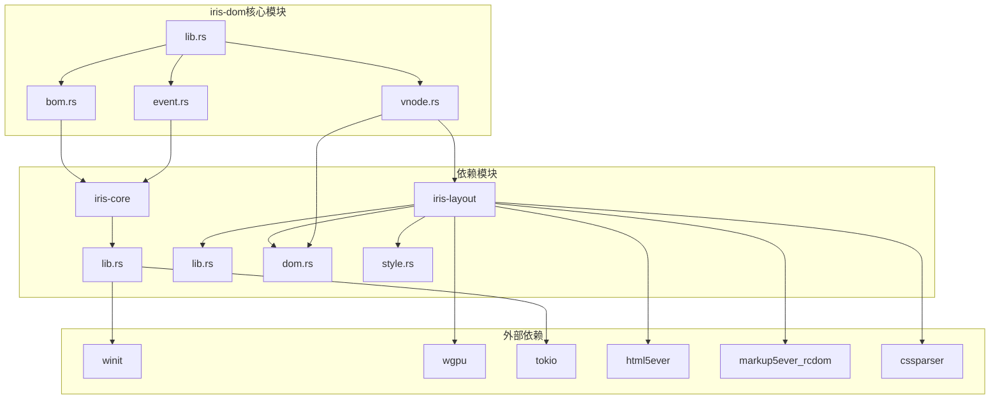

**图表来源**
- [lib.rs:1-48](file://crates/iris-dom/src/lib.rs#L1-L48)
- [Cargo.toml:1-30](file://Cargo.toml#L1-L30)

**章节来源**
- [lib.rs:1-48](file://crates/iris-dom/src/lib.rs#L1-L48)
- [Cargo.toml:1-30](file://Cargo.toml#L1-L30)

## 核心组件

iris-dom由三个核心组件构成，每个组件都有明确的职责分工：

### 1. 虚拟DOM节点(VNode)
负责UI元素的声明式描述和操作，支持元素、文本、注释和Fragment节点类型。

### 2. 事件系统
提供统一的事件注册、分发和处理机制，支持鼠标、键盘、焦点等多种事件类型。

### 3. 浏览器对象模型(BOM)
模拟浏览器环境中的window、document等全局对象，提供BOM API的轻量级实现。

**更新** 现在还集成了现代DOM API，提供完整的DOM节点操作能力，包括标准的DOM方法和增强的样式处理功能。

**章节来源**
- [vnode.rs:1-454](file://crates/iris-dom/src/vnode.rs#L1-L454)
- [event.rs:1-414](file://crates/iris-dom/src/event.rs#L1-L414)
- [bom.rs:1-465](file://crates/iris-dom/src/bom.rs#L1-L465)

## 架构概览

iris-dom采用分层架构设计，各组件之间通过清晰的接口进行交互：

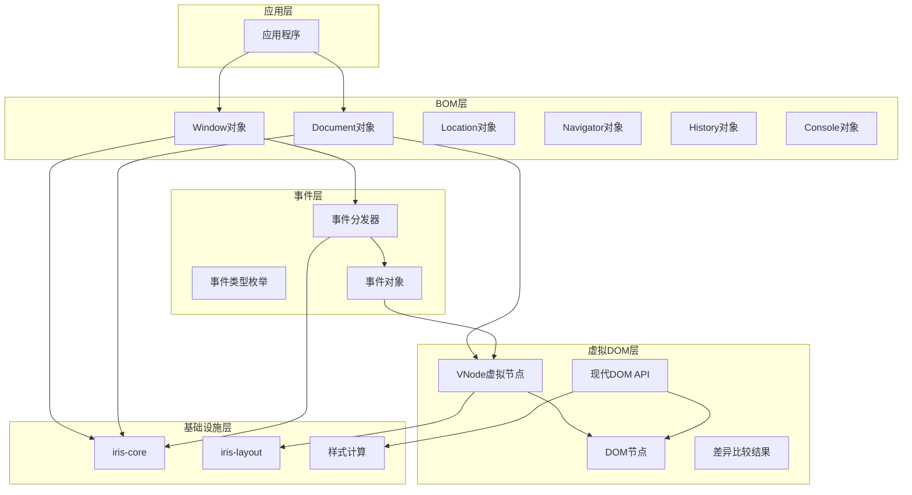

**图表来源**
- [lib.rs:8-12](file://crates/iris-dom/src/lib.rs#L8-L12)
- [bom.rs:152-221](file://crates/iris-dom/src/bom.rs#L152-L221)
- [event.rs:203-280](file://crates/iris-dom/src/event.rs#L203-L280)
- [vnode.rs:10-43](file://crates/iris-dom/src/vnode.rs#L10-L43)

## 详细组件分析

### 虚拟DOM节点系统

VNode系统是iris-dom的核心数据结构，提供了完整的虚拟DOM实现：

#### VNode数据结构

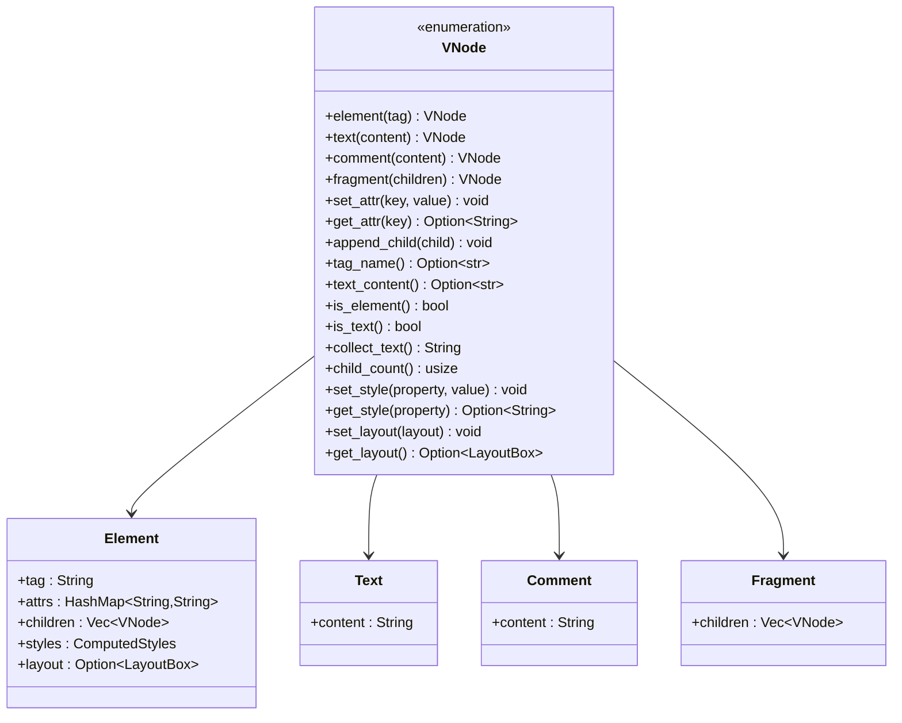

**图表来源**
- [vnode.rs:10-43](file://crates/iris-dom/src/vnode.rs#L10-L43)

#### 差异比较算法

VNode系统实现了高效的差异比较算法，用于优化UI更新：

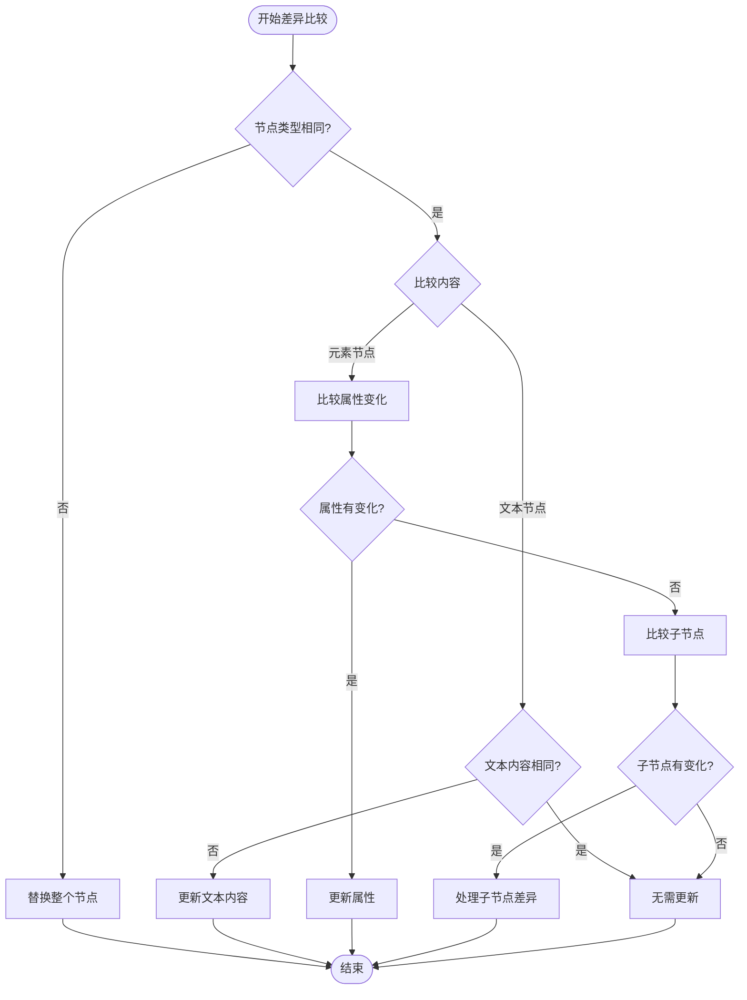

**图表来源**
- [vnode.rs:285-359](file://crates/iris-dom/src/vnode.rs#L285-L359)

**章节来源**
- [vnode.rs:45-211](file://crates/iris-dom/src/vnode.rs#L45-L211)
- [vnode.rs:285-359](file://crates/iris-dom/src/vnode.rs#L285-L359)

### 事件系统

事件系统提供了完整的事件生命周期管理：

#### 事件类型体系

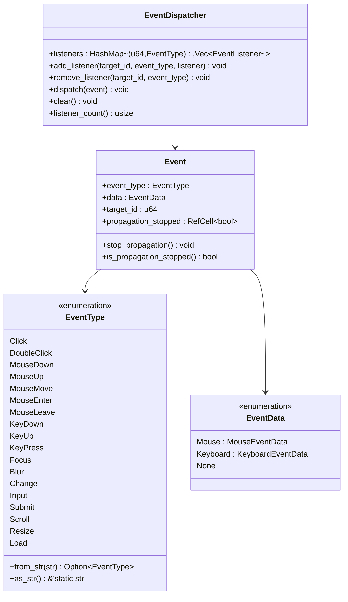

**图表来源**
- [event.rs:8-107](file://crates/iris-dom/src/event.rs#L8-L107)
- [event.rs:145-198](file://crates/iris-dom/src/event.rs#L145-L198)
- [event.rs:203-280](file://crates/iris-dom/src/event.rs#L203-L280)

#### 事件分发流程

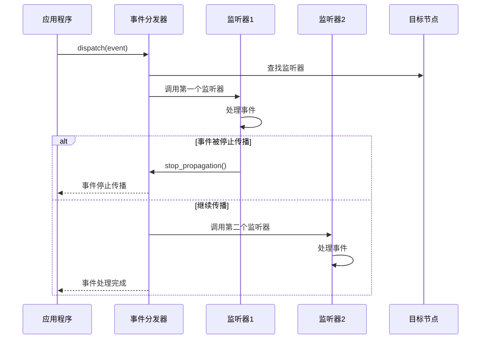

**图表来源**
- [event.rs:254-269](file://crates/iris-dom/src/event.rs#L254-L269)

**章节来源**
- [event.rs:8-107](file://crates/iris-dom/src/event.rs#L8-L107)
- [event.rs:145-198](file://crates/iris-dom/src/event.rs#L145-L198)
- [event.rs:203-280](file://crates/iris-dom/src/event.rs#L203-L280)

### 浏览器对象模型(BOM)

BOM系统模拟了浏览器环境中的全局对象：

#### Window对象

```mermaid
classDiagram
class Window {
+width : u32
+height : u32
+location : Location
+navigator : Navigator
+history : History
+console : Console
+storage : HashMap~String,String~
+new(width, height) Window
+inner_width() u32
+inner_height() u32
+resize(width, height) void
+set_property(key, value) void
+get_property(key) Option~&String~
}
class Location {
+href : String
+protocol : String
+hostname : String
+port : String
+pathname : String
+search : String
+hash : String
+new(url) Location
}
class Navigator {
+user_agent : String
+platform : String
+language : String
+on_line : bool
+default() Navigator
}
class History {
+entries : Vec~String~
+current_index : usize
+new() History
+length() usize
+forward() void
+back() void
+push_state(url) void
+current_url() &str
}
class Console {
+log(message) void
+warn(message) void
+error(message) void
+info(message) void
+time(label) void
+time_end(label) void
}
Window --> Location
Window --> Navigator
Window --> History
Window --> Console
```

**图表来源**
- [bom.rs:152-221](file://crates/iris-dom/src/bom.rs#L152-L221)
- [bom.rs:8-40](file://crates/iris-dom/src/bom.rs#L8-L40)
- [bom.rs:42-64](file://crates/iris-dom/src/bom.rs#L42-L64)
- [bom.rs:66-115](file://crates/iris-dom/src/bom.rs#L66-L115)
- [bom.rs:117-150](file://crates/iris-dom/src/bom.rs#L117-L150)

#### Document对象

Document对象提供了DOM操作API：

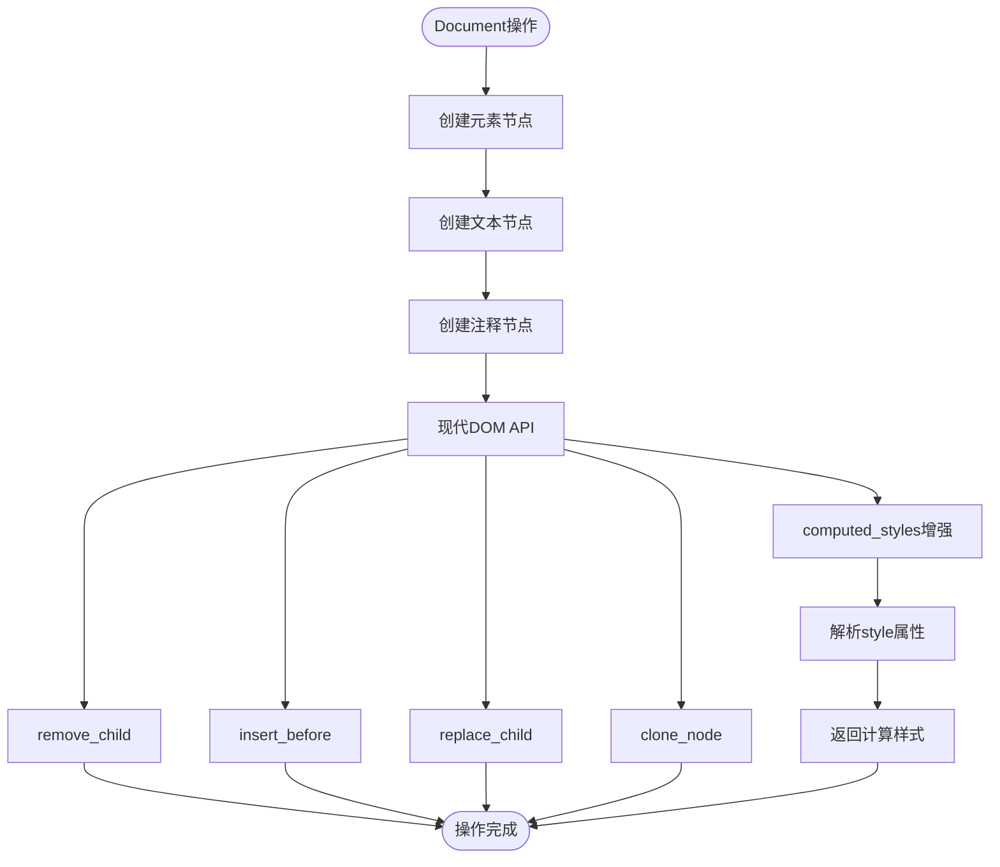

**图表来源**
- [bom.rs:223-367](file://crates/iris-dom/src/bom.rs#L223-L367)

**章节来源**
- [bom.rs:152-221](file://crates/iris-dom/src/bom.rs#L152-L221)
- [bom.rs:223-367](file://crates/iris-dom/src/bom.rs#L223-L367)

### 现代DOM API增强

**新增** iris-dom现在集成了完整的现代DOM API，提供标准的DOM节点操作方法：

#### DOM节点操作方法

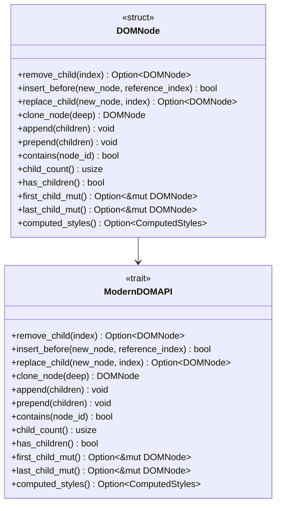

**图表来源**
- [dom.rs:123-238](file://crates/iris-layout/src/dom.rs#L123-L238)
- [dom.rs:253-289](file://crates/iris-layout/src/dom.rs#L253-L289)
- [dom.rs:337-370](file://crates/iris-layout/src/dom.rs#L337-L370)
- [dom.rs:413-452](file://crates/iris-layout/src/dom.rs#L413-L452)

#### computed_styles()功能增强

**更新** computed_styles()方法现在能够解析元素的style属性并返回计算后的样式：

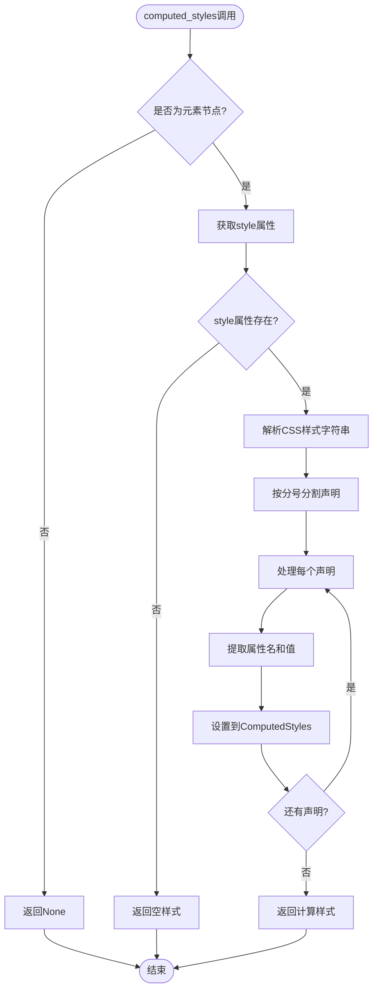

**图表来源**
- [dom.rs:413-452](file://crates/iris-layout/src/dom.rs#L413-L452)

**章节来源**
- [dom.rs:123-238](file://crates/iris-layout/src/dom.rs#L123-L238)
- [dom.rs:253-289](file://crates/iris-layout/src/dom.rs#L253-L289)
- [dom.rs:337-370](file://crates/iris-layout/src/dom.rs#L337-L370)
- [dom.rs:413-452](file://crates/iris-layout/src/dom.rs#L413-L452)

## 依赖关系分析

iris-dom的依赖关系体现了清晰的分层架构：

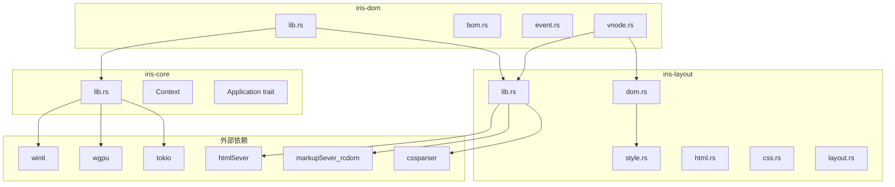

**图表来源**
- [lib.rs:39-41](file://crates/iris-dom/src/lib.rs#L39-L41)
- [lib.rs:1-167](file://crates/iris-core/src/lib.rs#L1-L167)
- [lib.rs:1-38](file://crates/iris-layout/src/lib.rs#L1-L38)

**章节来源**
- [lib.rs:39-41](file://crates/iris-dom/src/lib.rs#L39-L41)
- [lib.rs:1-167](file://crates/iris-core/src/lib.rs#L1-L167)
- [lib.rs:1-38](file://crates/iris-layout/src/lib.rs#L1-L38)

## 性能考虑

### 虚拟DOM优化策略

1. **差异比较算法**：通过类型检查和属性比较减少不必要的更新
2. **增量更新**：只更新发生变化的部分，避免全量重绘
3. **内存管理**：使用Clone语义的VNode，便于在不同线程间传递

### 事件系统优化

1. **监听器管理**：使用HashMap快速定位事件监听器
2. **传播控制**：通过RefCell实现内部可变性，避免不必要的所有权转移
3. **异步处理**：结合iris-core的Tokio运行时实现异步事件处理

### 渲染性能

1. **WebGPU集成**：所有绘制操作通过WebGPU进行，充分利用现代GPU性能
2. **批处理渲染**：与iris-gpu模块协作实现高效的图形批处理
3. **内存池**：利用iris-core的内存池优化频繁的对象分配

**更新** 现代DOM API的引入带来了额外的性能考量：
- **样式解析缓存**：computed_styles()的结果可以缓存以避免重复解析
- **批量操作优化**：append和prepend方法支持批量子节点操作，减少多次遍历
- **节点克隆优化**：clone_node方法支持深度克隆，但需要注意内存使用

## 故障排除指南

### 常见问题及解决方案

#### 1. 事件未触发
- 检查事件监听器是否正确注册
- 确认事件类型和目标节点ID匹配
- 验证事件传播是否被意外停止

#### 2. DOM查询失败
- 确认选择器语法正确
- 检查节点是否存在且已添加到DOM树中
- 验证属性值是否与预期一致

#### 3. 现代DOM API异常
- **remove_child失败**：确认子节点索引有效且节点存在
- **insert_before失败**：检查参考索引是否在有效范围内
- **replace_child返回None**：验证要替换的索引是否超出范围
- **computed_styles返回None**：确认节点是元素节点且具有style属性

#### 4. 性能问题
- 检查差异比较算法的使用情况
- 监控内存使用情况，避免内存泄漏
- 优化事件处理逻辑，避免阻塞主线程
- **批量操作优化**：使用append和prepend替代多次单个操作

**章节来源**
- [event.rs:282-414](file://crates/iris-dom/src/event.rs#L282-L414)
- [bom.rs:369-465](file://crates/iris-dom/src/bom.rs#L369-L465)
- [vnode.rs:361-454](file://crates/iris-dom/src/vnode.rs#L361-L454)
- [dom.rs:724-938](file://crates/iris-layout/src/dom.rs#L724-L938)

## 结论

iris-dom浏览器对象模型提供了一个完整而高效的跨平台UI抽象层。通过精心设计的模块化架构，它成功地：

1. **统一了跨端差异**：通过BOM API模拟，为开发者提供一致的编程体验
2. **实现了高性能渲染**：结合WebGPU和虚拟DOM技术，确保优秀的渲染性能
3. **提供了完整的事件系统**：支持多种事件类型的统一处理机制
4. **保持了良好的扩展性**：清晰的接口设计便于功能扩展和维护
5. **集成了现代DOM API**：提供标准的DOM操作方法，增强开发体验和兼容性

**更新** 最新的DOM API增强使得iris-dom更加接近真实浏览器的DOM行为，特别是：
- **完整的节点操作**：remove_child、insert_before、replace_child、clone_node等标准方法
- **增强的样式处理**：computed_styles()能够解析style属性并返回计算样式
- **现代API支持**：append、prepend、contains、child_count等现代DOM方法
- **更好的开发体验**：与传统DOM API保持一致，降低学习成本

该模块作为Iris引擎的重要组成部分，为构建跨平台应用程序奠定了坚实的基础。其设计理念和实现方式为其他类似项目提供了有价值的参考。