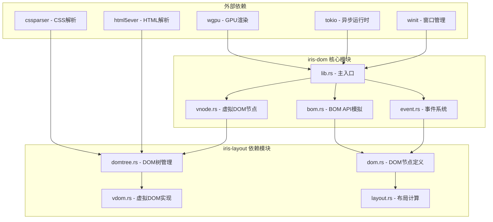
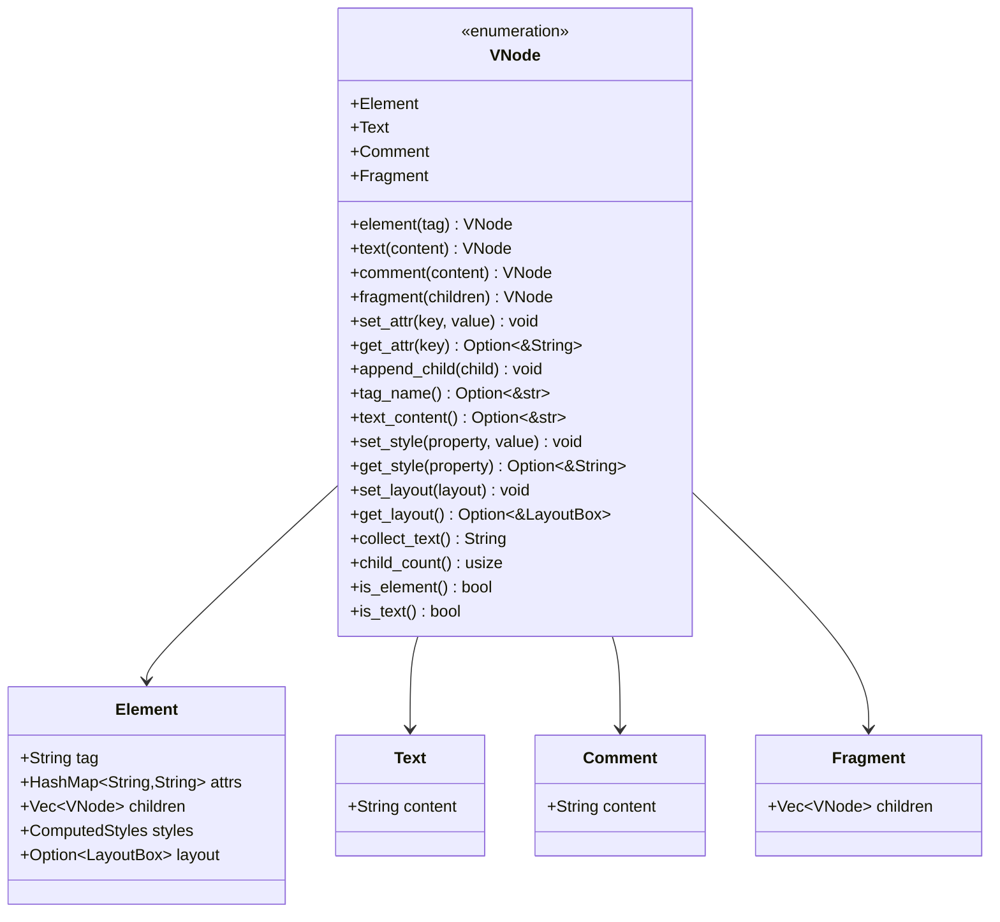
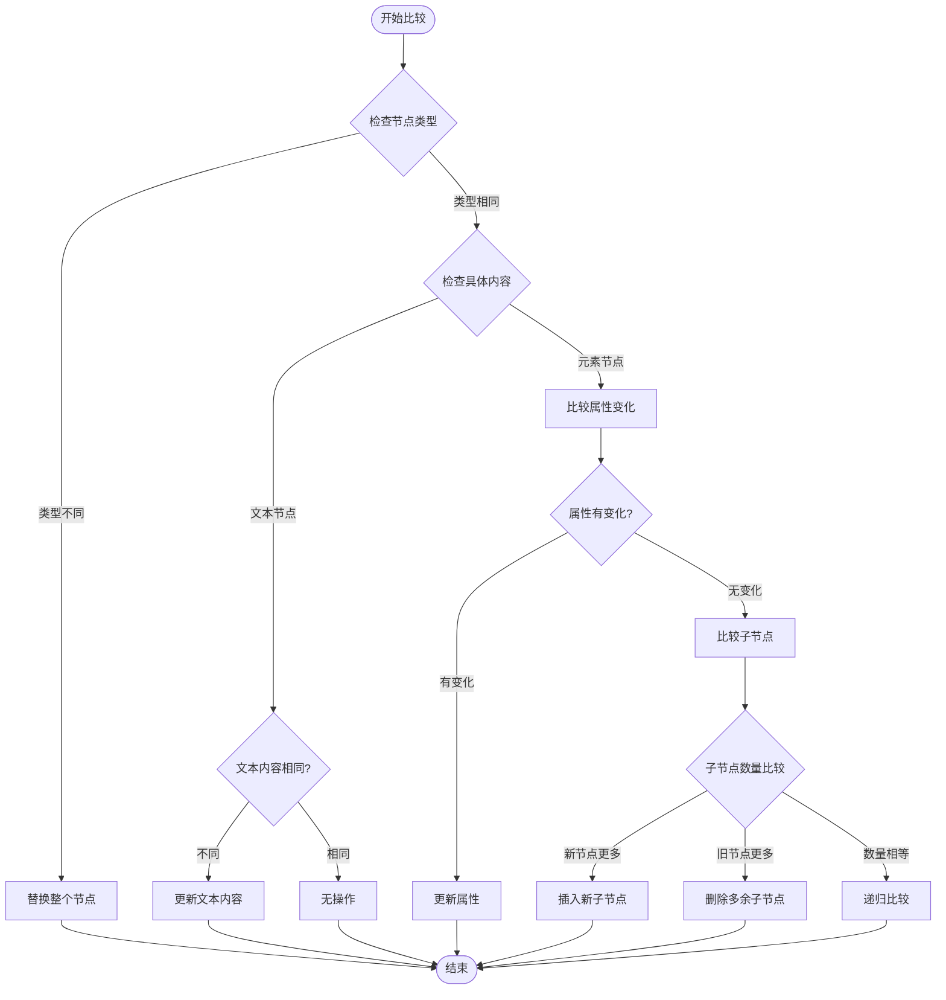
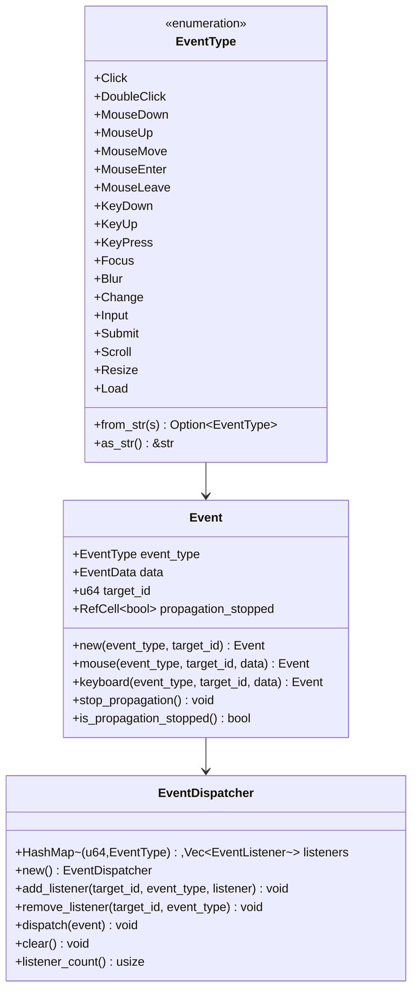
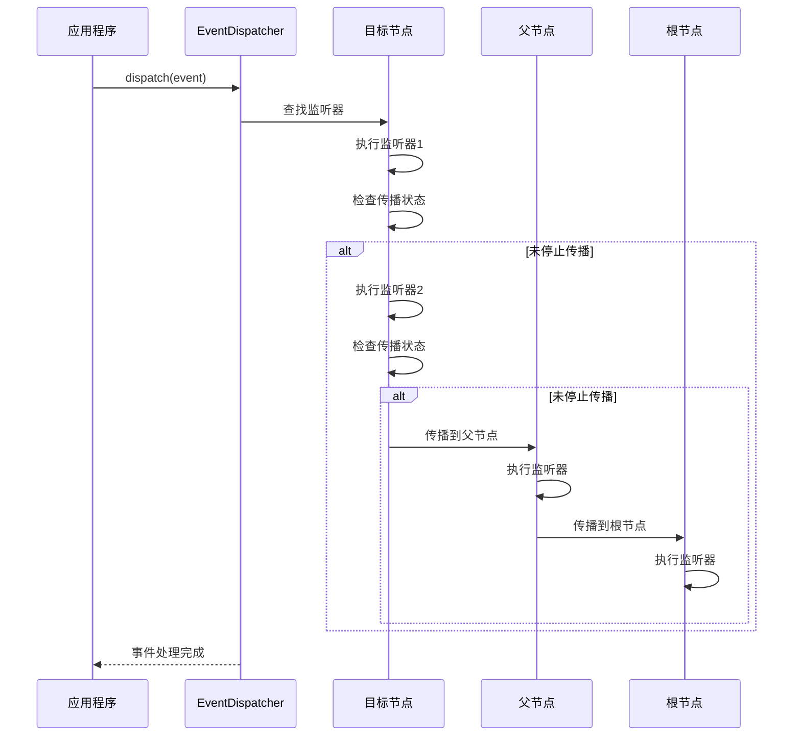
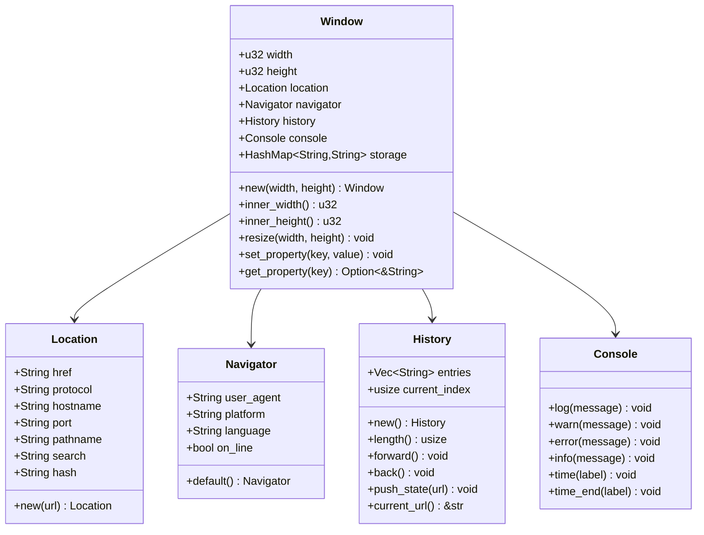
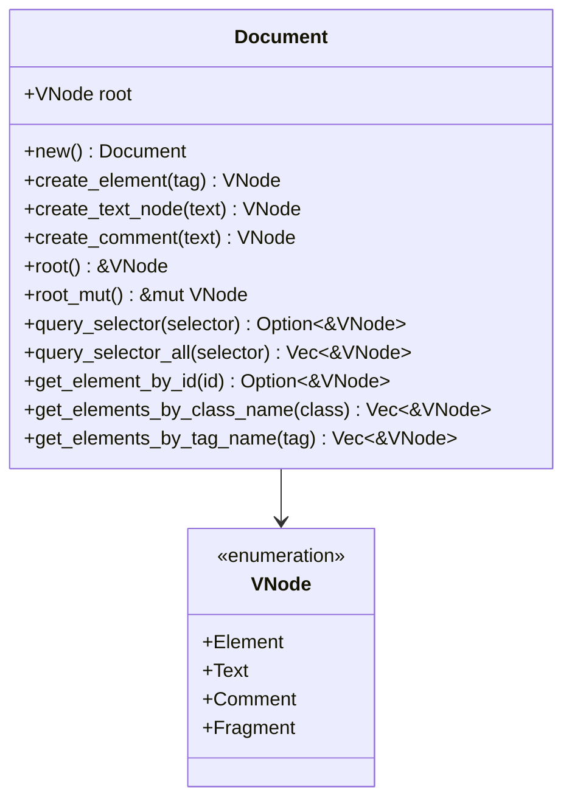
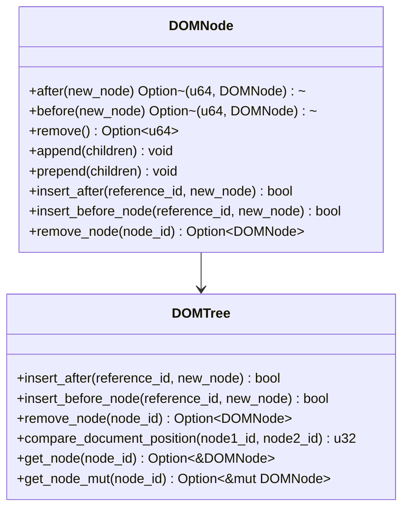
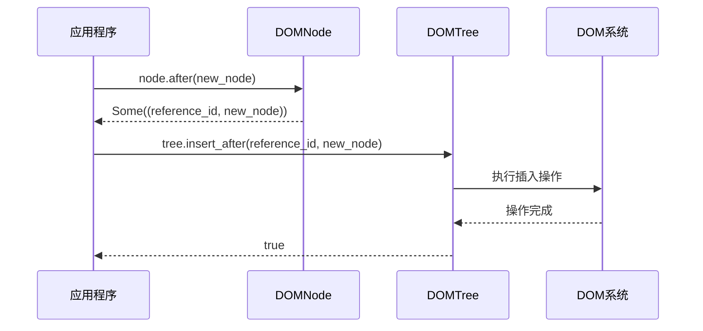
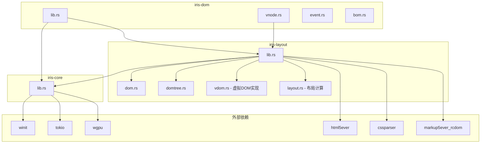

# iris-dom虚拟DOM系统

<cite>
**本文档引用的文件**
- [lib.rs](file://crates/iris-dom/src/lib.rs)
- [vnode.rs](file://crates/iris-dom/src/vnode.rs)
- [bom.rs](file://crates/iris-dom/src/bom.rs)
- [event.rs](file://crates/iris-dom/src/event.rs)
- [Cargo.toml](file://crates/iris-dom/Cargo.toml)
- [lib.rs](file://crates/iris-core/src/lib.rs)
- [lib.rs](file://crates/iris-layout/src/lib.rs)
- [dom.rs](file://crates/iris-layout/src/dom.rs)
- [domtree.rs](file://crates/iris-layout/src/domtree.rs)
- [vdom.rs](file://crates/iris-layout/src/vdom.rs)
- [Cargo.toml](file://Cargo.toml)
</cite>

## 更新摘要
**变更内容**
- 新增DOMTree系统支持现代DOM操作API，包括after()、before()、remove()等方法
- 扩展DOM节点系统，支持返回操作指令并通过DOMTree执行
- 增强DOM操作能力，提供更丰富的节点插入、删除和查询功能
- 完善DOM路径索引系统，支持高效的节点定位和操作

## 目录
1. [简介](#简介)
2. [项目结构](#项目结构)
3. [核心组件](#核心组件)
4. [架构概览](#架构概览)
5. [详细组件分析](#详细组件分析)
6. [现代DOM操作API](#现代dom操作api)
7. [依赖关系分析](#依赖关系分析)
8. [性能考量](#性能考量)
9. [故障排除指南](#故障排除指南)
10. [结论](#结论)

## 简介

iris-dom是Iris跨平台UI引擎中的虚拟DOM系统，提供跨端统一的DOM/BOM抽象层和事件系统。该系统的核心目标是在浏览器和桌面原生环境中抹平差异，提供统一的事件处理机制，以及轻量级的BOM/DOM模拟API。

系统采用"无真实DOM，仅做逻辑模拟"的设计理念，所有实际绘制都通过WebGPU进行，确保跨平台的一致性和高性能表现。最新的版本进一步完善了VNode系统，支持更多DOM操作和事件处理功能，并集成了增强的DOMTree系统，提供现代DOM操作API，包括after()、before()、remove()等方法，这些方法返回操作指令并通过DOMTree系统执行，显著扩展了DOM操作能力。

## 项目结构

iris-dom位于crates/iris-dom目录下，包含以下核心模块：



**图表来源**
- [lib.rs:1-48](file://crates/iris-dom/src/lib.rs#L1-L48)
- [Cargo.toml:1-14](file://crates/iris-dom/Cargo.toml#L1-L14)

**章节来源**
- [lib.rs:1-48](file://crates/iris-dom/src/lib.rs#L1-L48)
- [Cargo.toml:1-14](file://crates/iris-dom/Cargo.toml#L1-L14)

## 核心组件

### 虚拟DOM节点系统

iris-dom的虚拟DOM系统提供了轻量级的DOM表示，支持差异比较和高效更新。主要特点包括：

- **多类型节点支持**：元素节点、文本节点、注释节点和Fragment包装节点
- **属性管理**：支持动态设置和获取节点属性
- **样式集成**：与布局引擎无缝集成，支持样式计算
- **布局信息**：存储计算后的布局信息，便于渲染优化
- **增强的DOM操作**：支持更丰富的DOM操作API，包括节点查询、属性操作等

### 事件系统

提供统一的事件处理机制，支持多种事件类型：

- **鼠标事件**：点击、双击、按下、释放、移动、进入、离开
- **键盘事件**：按键按下、释放、输入
- **表单事件**：改变、输入、提交
- **窗口事件**：滚动、调整大小、加载完成
- **增强的事件处理**：支持事件冒泡、捕获阶段和事件停止传播

### BOM API模拟

模拟浏览器环境中的全局对象：

- **Window对象**：窗口管理、尺寸调整、全局存储
- **Document对象**：DOM操作API、元素查询
- **Location/Navigator/History/Console**：浏览器环境模拟
- **增强的DOM查询**：支持ID、类名、标签名等多种选择器

### DOMTree系统

**新增** 增强的DOM树管理系统，提供现代DOM操作API：

- **操作指令模式**：after()、before()、remove()等方法返回操作指令
- **节点索引系统**：通过DOMPath实现高效的节点定位
- **父子关系管理**：支持复杂的节点插入、删除和替换操作
- **文档位置比较**：提供节点间相对位置关系判断
- **批量操作支持**：支持append()、prepend()等现代API

**章节来源**
- [vnode.rs:1-454](file://crates/iris-dom/src/vnode.rs#L1-L454)
- [event.rs:1-414](file://crates/iris-dom/src/event.rs#L1-L414)
- [bom.rs:1-465](file://crates/iris-dom/src/bom.rs#L1-L465)
- [dom.rs:461-512](file://crates/iris-layout/src/dom.rs#L461-L512)
- [domtree.rs:106-209](file://crates/iris-layout/src/domtree.rs#L106-L209)

## 架构概览

iris-dom系统采用分层架构设计，各层职责清晰分离：

```mermaid
graph TB
subgraph "应用层"
App[Iris应用]
End
subgraph "虚拟DOM层"
VNode[VNode - 虚拟DOM节点]
EventSys[EventDispatcher - 事件系统]
BOM[BOM API - 窗口/文档模拟]
EnhancedDOM[增强DOM API]
End
subgraph "DOM树管理层"
DOMTree[DOMTree - DOM树管理]
DOMPath[DOMPath - 节点路径索引]
End
subgraph "布局层"
Layout[LayoutBox - 布局计算]
Style[ComputedStyles - 样式计算]
DOMNode[DOMNode - DOM节点]
End
subgraph "核心层"
Core[iris-core - 运行时]
GPU[WebGPU渲染]
End
App --> VNode
VNode --> EventSys
VNode --> BOM
VNode --> EnhancedDOM
EnhancedDOM --> DOMTree
DOMTree --> DOMPath
DOMTree --> Layout
Layout --> Style
Layout --> DOMNode
EventSys --> Core
BOM --> Core
DOMTree --> Core
Core --> GPU
```

**图表来源**
- [lib.rs:8-12](file://crates/iris-dom/src/lib.rs#L8-L12)
- [lib.rs:1-167](file://crates/iris-core/src/lib.rs#L1-L167)
- [lib.rs:1-38](file://crates/iris-layout/src/lib.rs#L1-L38)

系统的核心设计理念是"逻辑模拟 + GPU渲染"的分离架构，确保了跨平台的一致性和高性能。

## 详细组件分析

### 虚拟DOM节点系统

#### VNode数据结构

VNode采用枚举类型设计，支持四种节点类型，并增强了DOM操作功能：



**图表来源**
- [vnode.rs:10-211](file://crates/iris-dom/src/vnode.rs#L10-L211)

#### 差异比较算法

系统实现了高效的VNode差异比较算法，支持更精细的更新：



**图表来源**
- [vnode.rs:285-359](file://crates/iris-dom/src/vnode.rs#L285-L359)

**章节来源**
- [vnode.rs:1-454](file://crates/iris-dom/src/vnode.rs#L1-L454)

### 事件系统

#### 事件类型体系

事件系统支持完整的浏览器事件类型，并增强了事件处理能力：



**图表来源**
- [event.rs:8-280](file://crates/iris-dom/src/event.rs#L8-L280)

#### 事件分发流程

事件系统采用简化的冒泡传播机制，支持事件停止传播：



**图表来源**
- [event.rs:254-269](file://crates/iris-dom/src/event.rs#L254-L269)

**章节来源**
- [event.rs:1-414](file://crates/iris-dom/src/event.rs#L1-L414)

### BOM API模拟

#### Window对象

Window对象提供完整的浏览器窗口模拟，增强了属性管理功能：



**图表来源**
- [bom.rs:152-221](file://crates/iris-dom/src/bom.rs#L152-L221)

#### Document对象

Document对象提供增强的DOM操作API，支持更丰富的查询功能：



**图表来源**
- [bom.rs:223-367](file://crates/iris-dom/src/bom.rs#L223-L367)

**章节来源**
- [bom.rs:1-465](file://crates/iris-dom/src/bom.rs#L1-L465)

## 现代DOM操作API

**新增** iris-layout系统引入了现代化的DOM操作API，这些API提供了更直观和强大的节点操作能力：

### DOMNode现代API

DOM节点现在支持现代JavaScript风格的DOM操作方法：



**图表来源**
- [dom.rs:461-512](file://crates/iris-layout/src/dom.rs#L461-L512)
- [domtree.rs:106-209](file://crates/iris-layout/src/domtree.rs#L106-L209)

### 操作指令模式

现代API采用操作指令模式，提供更安全和可控的DOM操作：



**图表来源**
- [dom.rs:461-512](file://crates/iris-layout/src/dom.rs#L461-L512)
- [domtree.rs:106-140](file://crates/iris-layout/src/domtree.rs#L106-L140)

### 批量操作支持

系统支持现代JavaScript风格的批量操作：

- **append()**：在节点末尾批量添加多个子节点
- **prepend()**：在节点开头批量添加多个子节点
- **现代API设计**：提供更直观的API调用方式

**章节来源**
- [dom.rs:240-289](file://crates/iris-layout/src/dom.rs#L240-L289)
- [dom.rs:461-512](file://crates/iris-layout/src/dom.rs#L461-L512)
- [domtree.rs:106-209](file://crates/iris-layout/src/domtree.rs#L106-L209)

## 依赖关系分析

### 内部依赖关系

iris-dom系统与核心模块的依赖关系如下：



**图表来源**
- [lib.rs:39-41](file://crates/iris-dom/src/lib.rs#L39-L41)
- [lib.rs:1-167](file://crates/iris-core/src/lib.rs#L1-L167)
- [lib.rs:1-38](file://crates/iris-layout/src/lib.rs#L1-L38)

### 外部依赖分析

系统依赖的关键外部库：

- **winit**：跨平台窗口管理
- **tokio**：异步运行时
- **wgpu**：WebGPU图形API
- **html5ever**：HTML解析器
- **cssparser**：CSS解析器
- **markup5ever_rcdom**：DOM树实现

这些依赖确保了系统在不同平台上的稳定运行和高性能表现。

**章节来源**
- [Cargo.toml:23-30](file://Cargo.toml#L23-L30)
- [lib.rs:11-14](file://crates/iris-dom/Cargo.toml#L11-L14)

## 性能考量

### 虚拟DOM优化策略

1. **差异比较优化**：通过类型检查和快速路径减少不必要的比较
2. **内存复用**：使用HashMap和Vec的预分配策略
3. **增量更新**：只更新发生变化的部分
4. **布局缓存**：存储计算后的布局信息避免重复计算
5. **增强的DOM操作**：优化节点查询和属性访问性能
6. **DOMTree索引优化**：通过DOMPath实现O(log n)的节点定位

### 事件系统优化

1. **监听器管理**：使用HashMap快速定位监听器
2. **传播控制**：通过RefCell实现内部可变性
3. **批量处理**：支持多个监听器的批量执行
4. **事件停止传播**：减少不必要的事件处理

### 渲染性能

由于iris-dom采用"逻辑模拟 + GPU渲染"的架构，具有以下性能优势：
- 跨平台一致性，避免平台特定的性能问题
- GPU加速渲染，充分利用硬件性能
- 减少系统调用开销
- 增强的DOM操作优化

## 故障排除指南

### 常见问题及解决方案

#### 虚拟DOM节点问题

**问题**：节点属性无法正确设置
**解决方案**：检查节点类型，确保只对元素节点设置属性

**问题**：子节点添加失败
**解决方案**：确认父节点必须是元素节点或Fragment节点

**问题**：节点查询无效
**解决方案**：检查选择器语法和节点属性，确认增强的DOM查询功能正常

#### 现代DOM操作问题

**问题**：after()、before()、remove()方法返回None
**解决方案**：检查节点是否具有父节点，根节点无法执行这些操作

**问题**：DOMTree操作失败
**解决方案**：确认节点ID是否存在于索引中，检查DOMPath路径是否正确

**问题**：批量操作性能问题
**解决方案**：使用append()和prepend()替代多次单个节点操作

#### 事件系统问题

**问题**：事件监听器无法触发
**解决方案**：检查事件类型和节点ID是否匹配

**问题**：事件传播异常
**解决方案**：确认stop_propagation调用时机

#### BOM API问题

**问题**：Document查询选择器无效
**解决方案**：检查选择器语法和节点属性

**问题**：Window尺寸调整无效
**解决方案**：确认窗口对象实例和方法调用

**章节来源**
- [vnode.rs:361-454](file://crates/iris-dom/src/vnode.rs#L361-L454)
- [event.rs:282-414](file://crates/iris-dom/src/event.rs#L282-L414)
- [bom.rs:369-465](file://crates/iris-dom/src/bom.rs#L369-L465)
- [dom.rs:461-512](file://crates/iris-layout/src/dom.rs#L461-L512)
- [domtree.rs:106-209](file://crates/iris-layout/src/domtree.rs#L106-L209)

## 结论

iris-dom虚拟DOM系统是一个设计精良的跨平台UI抽象层，经过最新更新后具有以下增强特点：

1. **架构清晰**：分层设计确保了模块间的低耦合高内聚
2. **性能优秀**：通过差异比较和增量更新实现高效渲染
3. **扩展性强**：模块化设计便于功能扩展和维护
4. **跨平台**：统一的API确保了在不同平台上的行为一致性
5. **功能增强**：VNode系统支持更多DOM操作，事件处理更加完善
6. **API丰富**：与增强的DOM API配合，提供完整的前端开发体验
7. **现代API支持**：新增after()、before()、remove()等现代DOM操作API
8. **操作指令模式**：提供更安全和可控的DOM操作方式
9. **批量操作支持**：通过append()、prepend()等方法提升开发效率
10. **DOMTree集成**：完整的DOM树管理系统支持复杂节点操作

系统的核心价值在于提供了"无真实DOM，仅做逻辑模拟"的创新架构，结合WebGPU渲染技术和增强的DOM API，为现代UI应用开发提供了高性能、功能丰富的解决方案。随着Iris生态系统的不断发展，iris-dom将继续发挥其作为跨平台UI基础设施的重要作用，为开发者提供更好的开发体验和更高的性能表现。

**更新** 最新的版本特别增强了DOM操作能力，通过引入DOMTree系统和现代DOM操作API，使开发者能够以更接近JavaScript DOM API的方式进行节点操作，同时保持了Rust语言的安全性和性能优势。