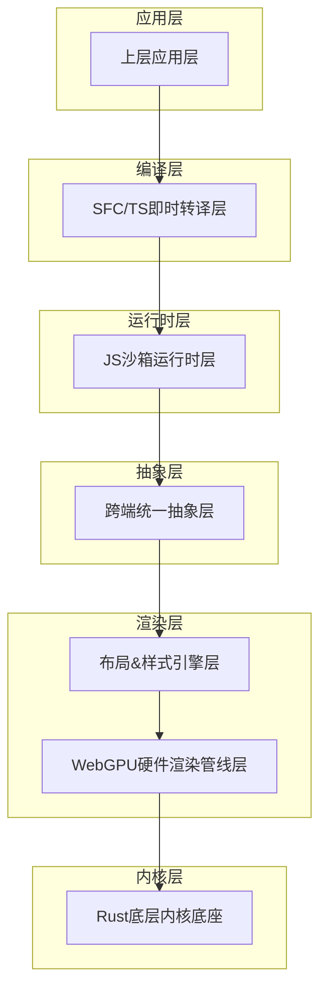
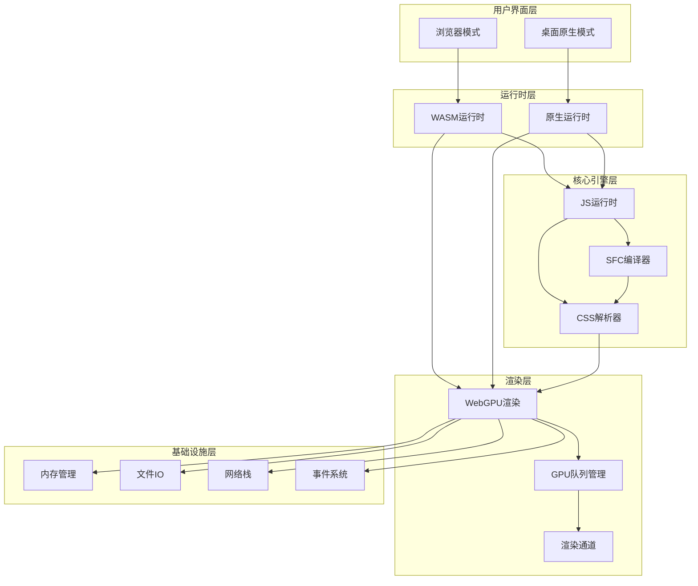
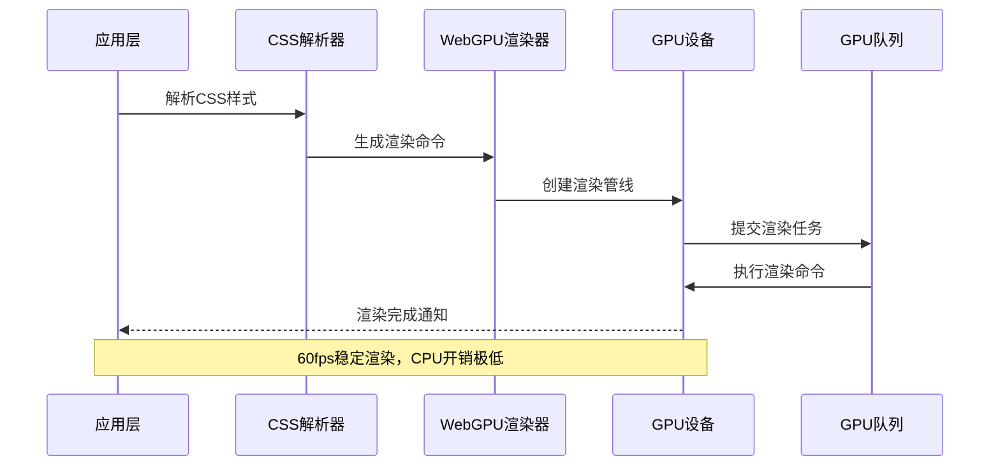
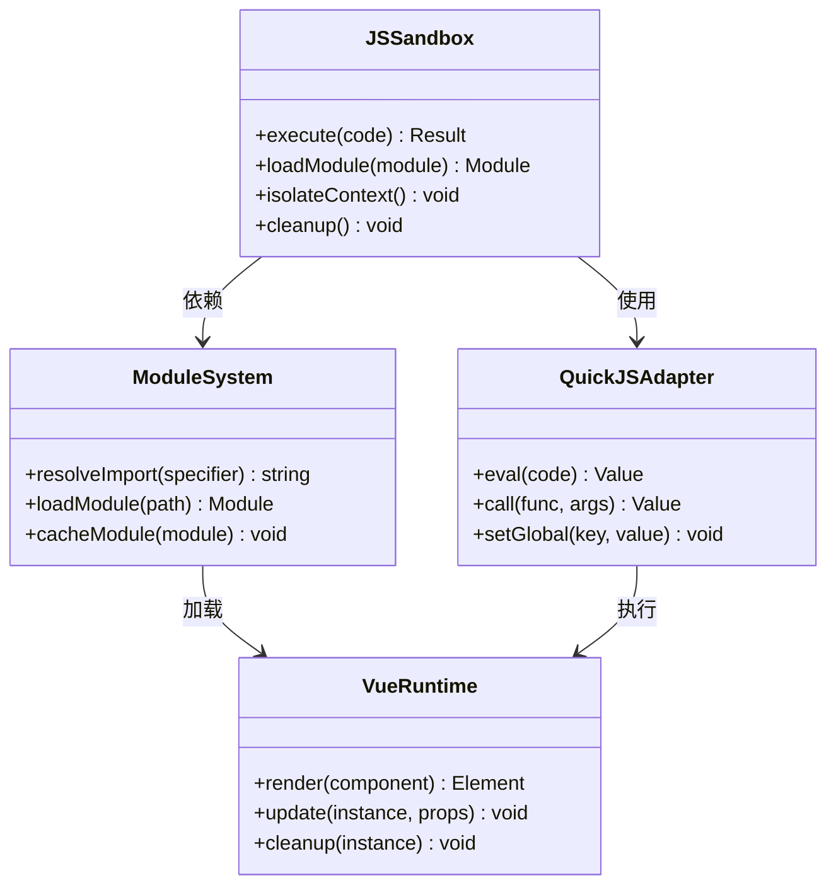
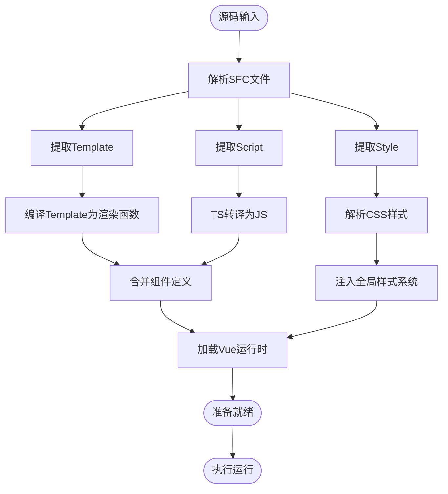
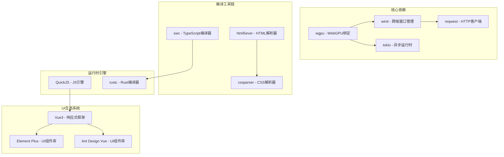

# 故障排除与FAQ

<cite>
**本文档引用的文件**
- [doc.txt](file://doc.txt)
- [todo.txt](file://todo.txt)
</cite>

## 目录
1. [简介](#简介)
2. [项目结构](#项目结构)
3. [核心组件](#核心组件)
4. [架构概览](#架构概览)
5. [详细组件分析](#详细组件分析)
6. [依赖关系分析](#依赖关系分析)
7. [性能考虑](#性能考虑)
8. [故障排除指南](#故障排除指南)
9. [结论](#结论)
10. [附录](#附录)

## 简介

Leivue Runtime是一个革命性的前端运行时引擎，采用Rust+WebGPU技术栈，旨在消除前端工程化复杂性，提供高性能的跨端运行体验。该项目的核心目标是：

- 提供完全脱离Node.js、浏览器DOM和编译打包的原生双端运行环境
- 支持零编译直接执行Vue3 + TypeScript
- 全面兼容Element Plus、Ant Design Vue等第三方UI库
- 实现硬件级渲染的应用引擎

## 项目结构

根据项目文档，Leivue Runtime采用了七层分层架构，每层都有明确的职责分工：

**图表来源**
- [doc.txt:7-22](file://doc.txt#L7-L22)

**章节来源**
- [doc.txt:7-22](file://doc.txt#L7-L22)

## 核心组件

### 1. Rust底层内核底座
- **语言**: 纯Rust编写，无GC、内存安全、高性能
- **基础能力**: 跨端窗口管理、异步调度、内存池、文件IO、原生网络栈、缓存系统
- **跨端适配**: 桌面(winit原生窗口 + Vulkan/Metal/DX12)、浏览器(Wasm编译 + WebGPU API绑定)
- **核心依赖**: wgpu、winit、tokio、reqwest

### 2. WebGPU硬件渲染层
- **设计理念**: 完全抛弃浏览器DOM渲染流水线，全自研GPU渲染
- **标准化**: 基于标准WebGPU规范，统一桌面/浏览器渲染接口
- **核心能力**: 批渲染、矢量绘制、圆角/阴影/渐变、纹理图集、字体渲染、图层合成
- **性能优势**: 60fps稳定渲染、大列表/复杂组件无卡顿、CPU开销极低

### 3. 布局&样式引擎层
- **标准复刻**: 复刻标准浏览器CSS体系，对标Chromium基础能力
- **HTML解析**: html5ever工业级解析，生成标准DOM节点树
- **CSS引擎**: cssparser解析、选择器匹配、样式继承、权重计算
- **布局系统**: 自研盒模型、Flex、流式布局，对标W3C标准
- **样式挂载**: 全局样式、Scoped样式、第三方UI库CSS全局注入

### 4. 跨端统一抽象层
- **统一事件系统**: 鼠标、键盘、滚动、点击命中检测
- **统一BOM/DOM模拟API**: 轻量实现window/document/Event
- **核心原则**: 无缝兼容Element Plus等UI库所需的浏览器环境API
- **执行模式**: 无真实DOM：仅做逻辑模拟，实际绘制全部走WebGPU

### 5. JS沙箱运行时层
- **JS引擎**: QuickJS（轻量高性能、Wasm友好、Rust深度绑定）
- **沙箱隔离**: 与宿主环境完全隔离，安全隔离脚本
- **内置运行时**: 预加载Vue3完整运行时(runtime-core/runtime-dom)
- **模块系统**: 自研ESM解析器，支持import/export、第三方包引入

### 6. 即时转译层
- **核心理念**: 零编译能力，实现源码直接运行
- **三大核心能力**:
  - TypeScript即时转译：基于Rust swc，内存内实时TS→JS，支持泛型/装饰器/TSX
  - Vue SFC即时编译：官方Rust库解析.vue，自动拆分template/script-setup/style
  - Template实时编译为Vue渲染函数
  - Script自动TS转译
  - Style自动解析并入全局样式系统
- **工程化优势**: 无构建打包：无Vite/Webpack/tsc，无node_modules强依赖

**章节来源**
- [doc.txt:23-64](file://doc.txt#L23-L64)

## 架构概览

Leivue Runtime的整体架构体现了高度的模块化和解耦设计：

**图表来源**
- [doc.txt:23-64](file://doc.txt#L23-L64)

## 详细组件分析

### WebGPU渲染管线组件

WebGPU渲染管线是Leivue Runtime的核心技术亮点，实现了从CPU到GPU的完整渲染优化：

**图表来源**
- [doc.txt:30-34](file://doc.txt#L30-L34)

### JS沙箱运行时组件

JS沙箱运行时确保了运行环境的安全性和隔离性：

**图表来源**
- [doc.txt:46-51](file://doc.txt#L46-L51)

**章节来源**
- [doc.txt:46-51](file://doc.txt#L46-L51)

### 即时转译组件

即时转译层实现了真正的零编译运行：

**图表来源**
- [doc.txt:51-60](file://doc.txt#L51-L60)

**章节来源**
- [doc.txt:51-60](file://doc.txt#L51-L60)

## 依赖关系分析

项目的技术栈展现了现代化的软件架构设计：

**图表来源**
- [doc.txt:29](file://doc.txt#L29)

**章节来源**
- [doc.txt:29](file://doc.txt#L29)

## 性能考虑

### 渲染性能优化

Leivue Runtime在渲染性能方面采用了多项优化策略：

- **硬件加速渲染**: 完全基于WebGPU硬件渲染，避免CPU瓶颈
- **批渲染优化**: 合并相似渲染操作，减少GPU状态切换
- **内存池管理**: 预分配和重用内存，降低GC压力
- **异步调度**: 基于Tokio的异步任务调度，提高并发性能

### 内存管理策略

- **零GC设计**: Rust的内存安全保证，避免垃圾回收停顿
- **智能缓存**: LRU缓存机制，优化频繁访问的数据
- **资源池化**: 对常用对象进行池化管理，减少分配开销

### 网络性能优化

- **双网络模式**: 自研Rust网络栈 + 浏览器原生网络栈
- **连接复用**: HTTP/2连接复用，减少握手开销
- **缓存策略**: 智能缓存机制，减少重复请求

## 故障排除指南

### 1. WebGPU兼容性问题

**问题症状**:
- 页面空白或渲染异常
- 控制台出现WebGPU相关错误
- 应用无法启动或启动缓慢

**诊断步骤**:
1. 检查浏览器WebGPU支持状态
2. 验证GPU驱动程序版本
3. 确认操作系统对WebGPU的支持
4. 测试其他WebGPU应用是否正常运行

**解决方案**:
- 更新显卡驱动程序
- 尝试不同的浏览器(Chrome/Firefox/Edge)
- 在桌面原生模式下运行
- 检查GPU硬件兼容性

**章节来源**
- [doc.txt:27-28](file://doc.txt#L27-L28)

### 2. JavaScript沙箱执行错误

**问题症状**:
- 脚本执行失败或异常
- Vue组件无法正确渲染
- 模块导入失败

**诊断步骤**:
1. 检查QuickJS引擎状态
2. 验证模块解析器工作正常
3. 确认Vue运行时已正确加载
4. 查看沙箱隔离状态

**解决方案**:
- 重启JS沙箱运行时
- 清理模块缓存
- 检查脚本语法和依赖
- 验证模块路径和权限

**章节来源**
- [doc.txt:46-51](file://doc.txt#L46-L51)

### 3. SFC编译器错误

**问题症状**:
- .vue文件无法正确编译
- Template编译失败
- Script转译异常

**诊断步骤**:
1. 检查SFC解析器状态
2. 验证Template编译器工作正常
3. 确认TS转译器运行状态
4. 检查CSS解析器功能

**解决方案**:
- 重新初始化编译器
- 清理编译缓存
- 验证文件格式和编码
- 检查依赖库版本兼容性

**章节来源**
- [doc.txt:51-60](file://doc.txt#L51-L60)

### 4. 跨端兼容性问题

**问题症状**:
- 桌面模式下功能异常
- 浏览器模式下性能问题
- 平台特定API调用失败

**诊断步骤**:
1. 确认当前运行模式
2. 检查平台特定API支持
3. 验证跨端抽象层工作状态
4. 测试不同平台的兼容性

**解决方案**:
- 切换到兼容性更好的模式
- 更新平台SDK版本
- 检查平台权限设置
- 使用降级方案

**章节来源**
- [doc.txt:41-45](file://doc.txt#L41-L45)

### 5. 性能问题诊断

**问题症状**:
- 应用运行缓慢
- 内存占用过高
- CPU使用率异常

**诊断步骤**:
1. 监控GPU使用情况
2. 检查内存分配模式
3. 分析渲染帧率
4. 评估网络请求性能

**解决方案**:
- 优化渲染批次
- 实施内存回收策略
- 减少不必要的重绘
- 实现懒加载机制

### 6. 网络连接问题

**问题症状**:
- 网络请求超时或失败
- 跨域请求被阻止
- 离线模式异常

**诊断步骤**:
1. 检查网络栈状态
2. 验证防火墙设置
3. 确认代理配置
4. 测试不同网络环境

**解决方案**:
- 配置正确的网络参数
- 实现重连机制
- 优化缓存策略
- 处理跨域访问

### 7. 调试工具使用指南

**内置调试功能**:
- 日志系统：提供多级别的日志输出
- 性能监控：实时监控渲染性能指标
- 内存分析：跟踪内存分配和使用情况
- 网络调试：显示网络请求详情

**调试技巧**:
1. 启用详细日志模式
2. 使用性能分析工具
3. 监控关键性能指标
4. 记录错误堆栈信息

## 结论

Leivue Runtime作为一个前沿的前端运行时引擎，在技术创新和性能优化方面展现了巨大的潜力。通过采用七层分层架构设计，项目实现了高度的模块化和解耦，为后续的功能扩展和维护奠定了坚实的基础。

虽然当前项目仍处于早期开发阶段，但其清晰的技术路线图和完整的功能规划为未来的成功实施提供了保障。建议开发者重点关注以下方面：

1. **WebGPU兼容性测试**：确保在不同平台和浏览器上的稳定性
2. **性能基准测试**：建立完善的性能监控和优化机制
3. **生态兼容性验证**：持续测试与主流Vue生态系统的兼容性
4. **安全性评估**：完善JS沙箱和网络安全机制

## 附录

### 开发环境要求

- **操作系统**: Windows 10+/macOS 10.15+/Linux
- **Rust版本**: 1.70+
- **WebGPU支持**: 现代浏览器或支持WebGPU的桌面环境
- **硬件要求**: 支持WebGPU的GPU设备

### 社区支持渠道

- **GitHub Issues**: 报告bug和功能请求
- **Discord服务器**: 实时技术支持和讨论
- **邮件列表**: 获取项目更新和技术讨论
- **文档网站**: 完整的API参考和使用指南

### 版本兼容性矩阵

| 组件 | 最低版本 | 推荐版本 | 兼容性 |
|------|----------|----------|--------|
| Rust | 1.70 | 1.75+ | ✅ 完全兼容 |
| WebGPU | 1.0 | 1.0+ | ✅ 完全兼容 |
| Chrome | 113 | 119+ | ✅ 完全兼容 |
| Firefox | 113 | 119+ | ✅ 完全兼容 |
| Edge | 113 | 119+ | ✅ 完全兼容 |