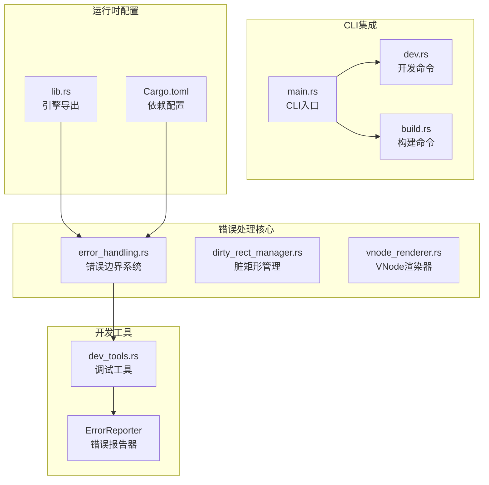
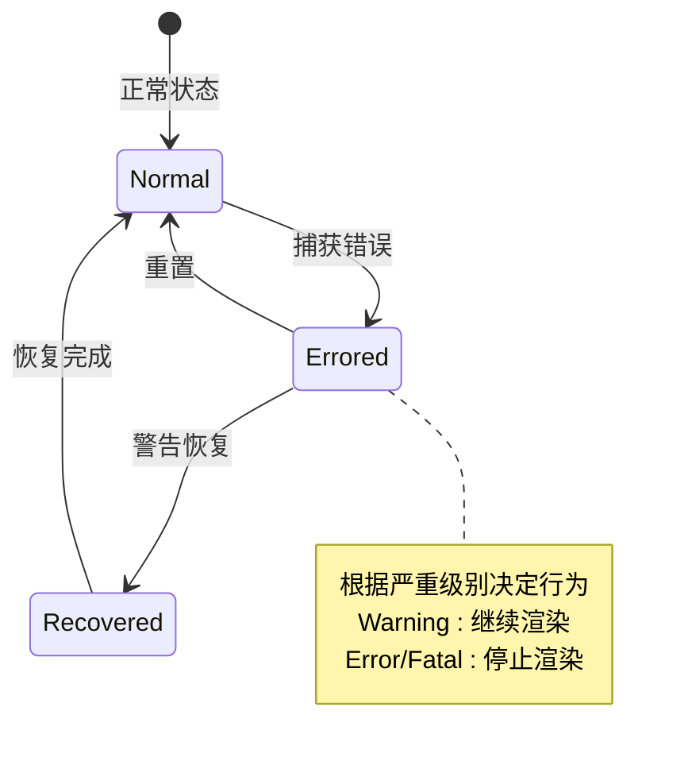
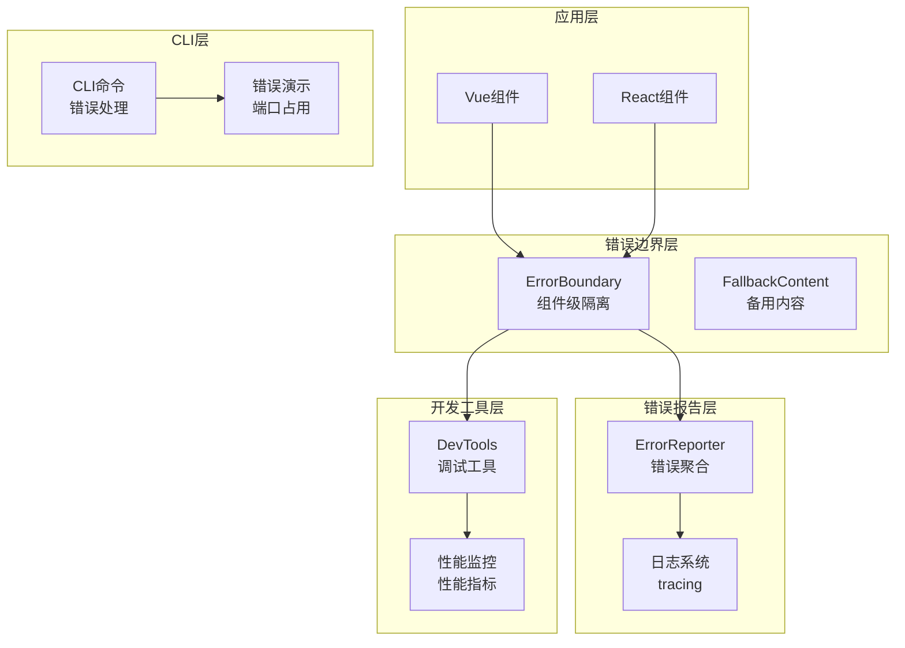
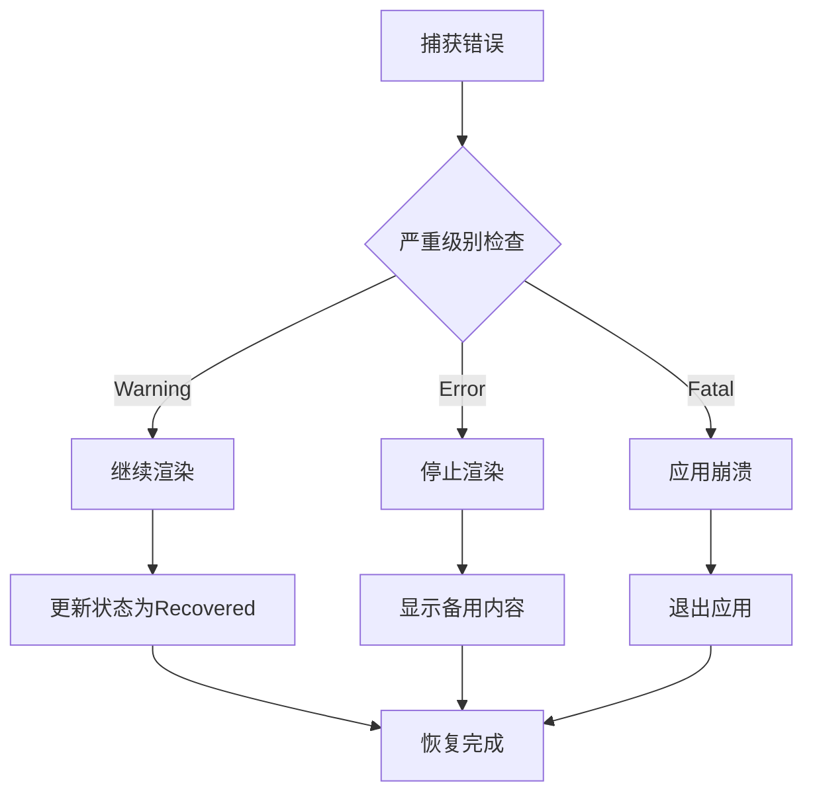
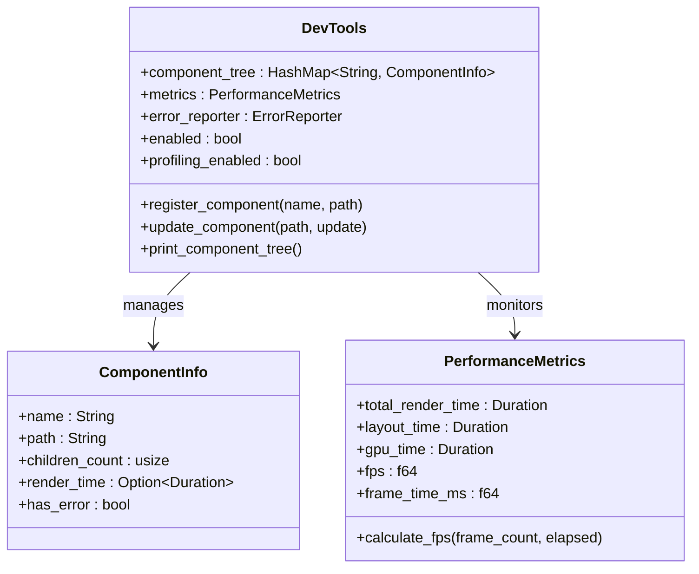
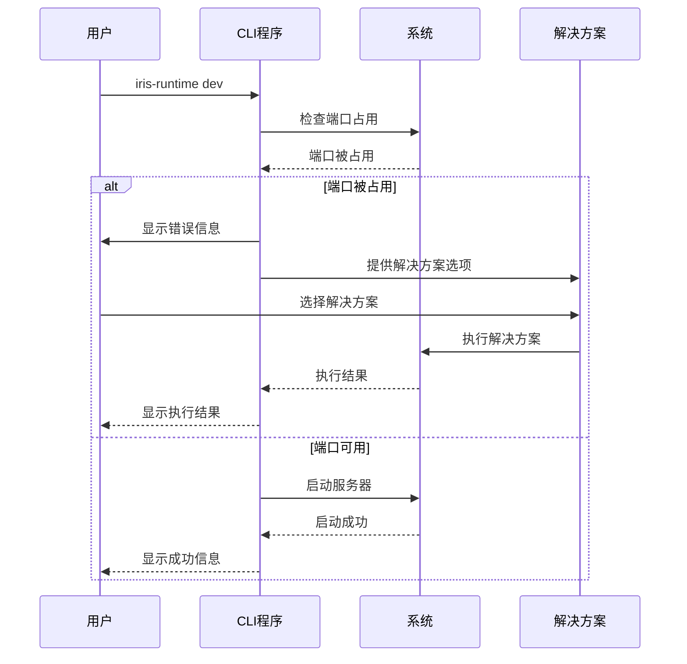
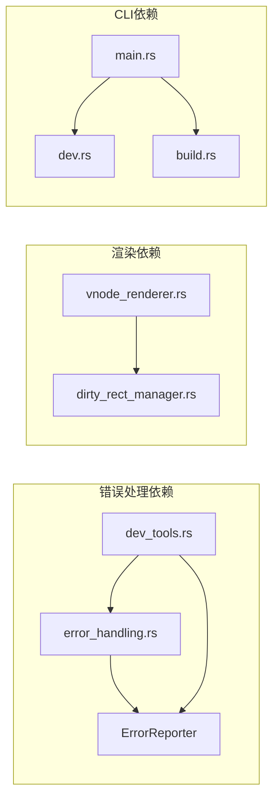

# 错误处理指南

<cite>
**本文档引用的文件**
- [error_handling.rs](file://crates/iris-engine/src/error_handling.rs)
- [ERROR_HANDLING.md](file://crates/iris-runtime/ERROR_HANDLING.md)
- [lib.rs](file://crates/iris-engine/src/lib.rs)
- [main.rs](file://crates/iris-cli/src/main.rs)
- [dev.rs](file://crates/iris-cli/src/commands/dev.rs)
- [build.rs](file://crates/iris-cli/src/commands/build.rs)
- [vnode_renderer.rs](file://crates/iris-engine/src/vnode_renderer.rs)
- [dirty_rect_manager.rs](file://crates/iris-engine/src/dirty_rect_manager.rs)
- [dev_tools.rs](file://crates/iris-engine/src/dev_tools.rs)
- [Cargo.toml](file://crates/iris-engine/Cargo.toml)
</cite>

## 目录
1. [简介](#简介)
2. [项目结构](#项目结构)
3. [核心组件](#核心组件)
4. [架构概览](#架构概览)
5. [详细组件分析](#详细组件分析)
6. [依赖关系分析](#依赖关系分析)
7. [性能考虑](#性能考虑)
8. [故障排除指南](#故障排除指南)
9. [结论](#结论)

## 简介

Iris Runtime 错误处理系统是一个多层次、模块化的错误管理框架，旨在提供优雅的错误捕获、隔离和恢复机制。该系统不仅处理运行时错误，还提供了完整的开发工具链来帮助开发者诊断和解决各种问题。

系统的核心设计理念包括：
- **组件级错误隔离**：防止单个组件的错误影响整个应用
- **渐进式错误恢复**：支持从不同严重级别的错误中恢复
- **详细的错误报告**：提供完整的错误上下文和诊断信息
- **开发友好性**：为开发者提供清晰的错误信息和解决方案

## 项目结构

Iris Runtime 错误处理系统分布在多个关键模块中：

**图表来源**
- [error_handling.rs:1-520](file://crates/iris-engine/src/error_handling.rs#L1-L520)
- [dev_tools.rs:1-472](file://crates/iris-engine/src/dev_tools.rs#L1-L472)
- [main.rs:1-96](file://crates/iris-cli/src/main.rs#L1-L96)

**章节来源**
- [lib.rs:1-109](file://crates/iris-engine/src/lib.rs#L1-L109)
- [Cargo.toml:1-47](file://crates/iris-engine/Cargo.toml#L1-L47)

## 核心组件

### 错误严重级别系统

系统定义了三个层次的错误严重级别：

| 严重级别 | 描述 | 行为 |
|---------|------|------|
| **Warning** | 警告 - 不影响渲染 | 继续渲染，记录错误 |
| **Error** | 错误 - 组件渲染失败 | 停止渲染，显示备用内容 |
| **Fatal** | 致命 - 整个应用崩溃 | 停止渲染，无法恢复 |

### 错误来源分类

系统支持多种错误来源的分类和处理：

- **Render**：渲染错误
- **Layout**：布局计算错误  
- **Style**：样式处理错误
- **Script**：JavaScript执行错误
- **Network**：网络请求错误
- **Unknown**：未知来源错误

### 错误边界系统

错误边界是系统的核心组件，提供组件级别的错误隔离：

**图表来源**
- [error_handling.rs:146-283](file://crates/iris-engine/src/error_handling.rs#L146-L283)

**章节来源**
- [error_handling.rs:12-283](file://crates/iris-engine/src/error_handling.rs#L12-L283)

## 架构概览

Iris Runtime 错误处理系统的整体架构采用分层设计：

**图表来源**
- [dev_tools.rs:106-369](file://crates/iris-engine/src/dev_tools.rs#L106-L369)
- [ERROR_HANDLING.md:1-265](file://crates/iris-runtime/ERROR_HANDLING.md#L1-L265)

## 详细组件分析

### 错误边界系统

错误边界是组件级错误隔离的核心实现：

#### 核心功能特性

1. **状态管理**：跟踪错误边界的状态变化
2. **错误历史**：维护错误历史记录，支持最大历史长度限制
3. **备用内容**：为错误状态提供备用UI内容
4. **渲染控制**：根据错误严重级别控制渲染流程

#### 错误恢复策略

**图表来源**
- [error_handling.rs:200-237](file://crates/iris-engine/src/error_handling.rs#L200-L237)

**章节来源**
- [error_handling.rs:157-283](file://crates/iris-engine/src/error_handling.rs#L157-L283)

### 错误报告系统

错误报告器负责收集、存储和报告系统中的所有错误：

#### 数据结构设计

| 字段 | 类型 | 描述 |
|------|------|------|
| `errors` | Vec<IrisError> | 存储所有错误的数组 |
| `max_errors` | usize | 最大错误数量限制 |
| `enabled` | bool | 错误报告器启用状态 |

#### 报告功能

1. **实时错误报告**：错误发生时立即打印和存储
2. **统计分析**：按严重级别和来源分类统计
3. **错误聚合**：提供完整的错误报告生成
4. **历史管理**：自动管理错误历史，避免内存泄漏

**章节来源**
- [error_handling.rs:285-390](file://crates/iris-engine/src/error_handling.rs#L285-L390)

### 调试工具系统

DevTools 提供了全面的开发时调试能力：

#### 组件树检查

**图表来源**
- [dev_tools.rs:106-369](file://crates/iris-engine/src/dev_tools.rs#L106-L369)

**章节来源**
- [dev_tools.rs:1-472](file://crates/iris-engine/src/dev_tools.rs#L1-L472)

### CLI 错误处理

CLI 层面实现了用户友好的错误处理和解决方案：

#### 端口占用错误处理

**图表来源**
- [ERROR_HANDLING.md:198-221](file://crates/iris-runtime/ERROR_HANDLING.md#L198-L221)

**章节来源**
- [ERROR_HANDLING.md:1-265](file://crates/iris-runtime/ERROR_HANDLING.md#L1-L265)

## 依赖关系分析

### 核心依赖关系

**图表来源**
- [Cargo.toml:13-31](file://crates/iris-engine/Cargo.toml#L13-L31)

### 模块间交互

系统通过以下方式实现模块间的解耦：

1. **接口抽象**：所有错误处理组件都通过标准接口交互
2. **事件驱动**：使用事件系统实现松耦合通信
3. **工厂模式**：统一创建和管理错误处理组件
4. **观察者模式**：支持错误状态的实时通知

**章节来源**
- [lib.rs:77-92](file://crates/iris-engine/src/lib.rs#L77-L92)

## 性能考虑

### 错误处理性能优化

1. **内存管理**：错误历史和报告器都有最大容量限制
2. **异步处理**：错误报告采用异步方式，不影响主渲染流程
3. **缓存策略**：常用错误信息进行缓存，避免重复计算
4. **批量处理**：多个错误可以批量处理和报告

### 调试工具性能影响

DevTools 提供了性能监控功能，但需要注意：

- **性能分析开关**：只有在启用性能分析时才进行计时
- **采样频率**：性能指标定期采样，避免频繁计算
- **内存使用**：组件树和性能数据有合理的内存限制

## 故障排除指南

### 常见错误场景及解决方案

#### 端口占用问题

**问题症状**：
- 启动时显示端口被占用错误
- 无法启动开发服务器

**解决方案**：
1. **手动指定端口**：使用 `--port` 参数指定其他端口
2. **自动选择端口**：使用 `--port 0` 让系统自动选择可用端口
3. **关闭占用进程**：查找并终止占用端口的进程

#### 图形界面检测失败

**问题症状**：
- 在无头环境中运行时报错
- 无法创建原生窗口

**解决方案**：
1. **检查DISPLAY变量**：确保图形环境变量正确设置
2. **启用X11转发**：在SSH连接中启用X11转发
3. **使用有GUI的机器**：在具有图形界面的机器上运行

#### 渲染错误处理

**问题症状**：
- 组件渲染失败但应用继续运行
- 页面显示空白或错误内容

**处理流程**：
1. **错误捕获**：错误边界捕获渲染错误
2. **状态更新**：更新错误边界状态
3. **备用内容**：显示预定义的备用内容
4. **错误报告**：记录错误信息供调试

### 调试技巧

#### 使用DevTools进行调试

1. **启用调试模式**：在开发时启用DevTools
2. **监控组件树**：查看组件状态和渲染时间
3. **分析性能指标**：监控FPS和渲染时间
4. **查看错误报告**：分析错误历史和统计信息

#### 错误日志分析

1. **查看详细错误信息**：包含错误来源、严重级别、时间戳
2. **分析错误模式**：识别重复出现的错误类型
3. **关联错误链**：查看错误的因果关系
4. **性能影响评估**：分析错误对系统性能的影响

**章节来源**
- [main.rs:79-84](file://crates/iris-cli/src/main.rs#L79-L84)
- [dev.rs:44-100](file://crates/iris-cli/src/commands/dev.rs#L44-L100)

## 结论

Iris Runtime 错误处理系统通过多层次的设计实现了优雅的错误管理：

### 主要优势

1. **组件级隔离**：错误不会传播到整个应用
2. **渐进式恢复**：支持从不同严重级别的错误中恢复
3. **开发友好**：提供详细的错误信息和解决方案
4. **性能优化**：最小化错误处理对系统性能的影响
5. **可扩展性**：模块化设计支持功能扩展

### 最佳实践建议

1. **合理使用错误边界**：为关键组件设置错误边界
2. **提供有意义的备用内容**：改善用户体验
3. **启用调试工具**：在开发阶段充分利用调试功能
4. **监控错误趋势**：定期分析错误报告
5. **及时修复严重错误**：优先处理Error和Fatal级别的错误

该系统为Iris Runtime提供了坚实的错误处理基础，确保了应用的稳定性和可靠性，同时为开发者提供了强大的调试和诊断工具。