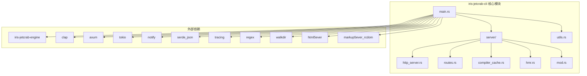
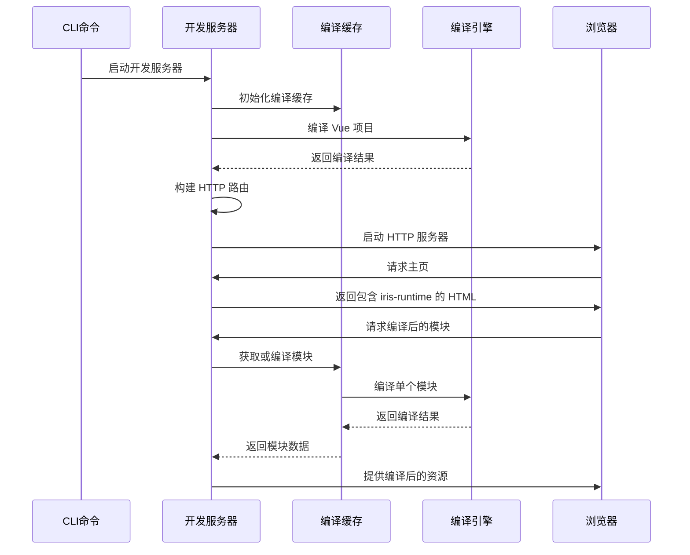
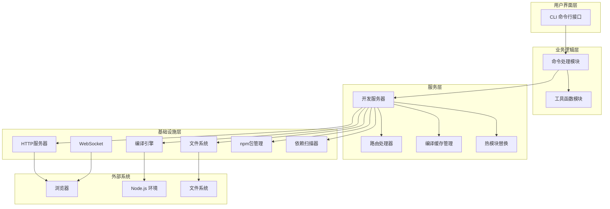
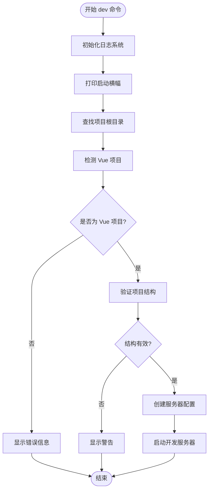
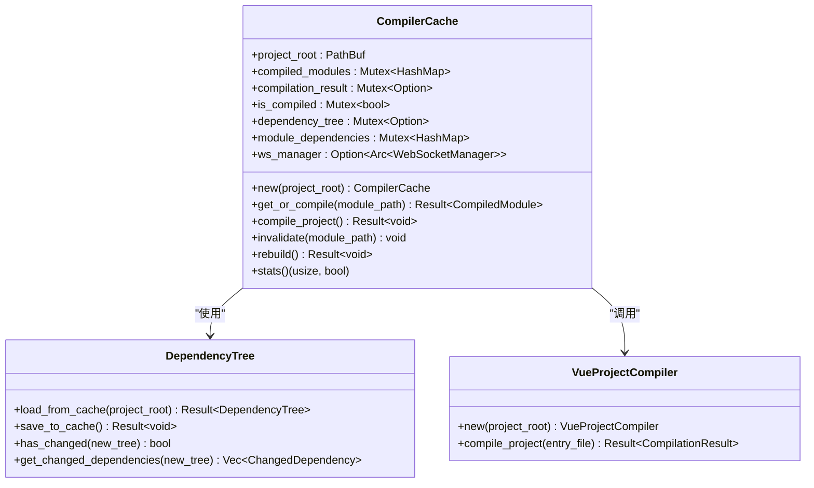
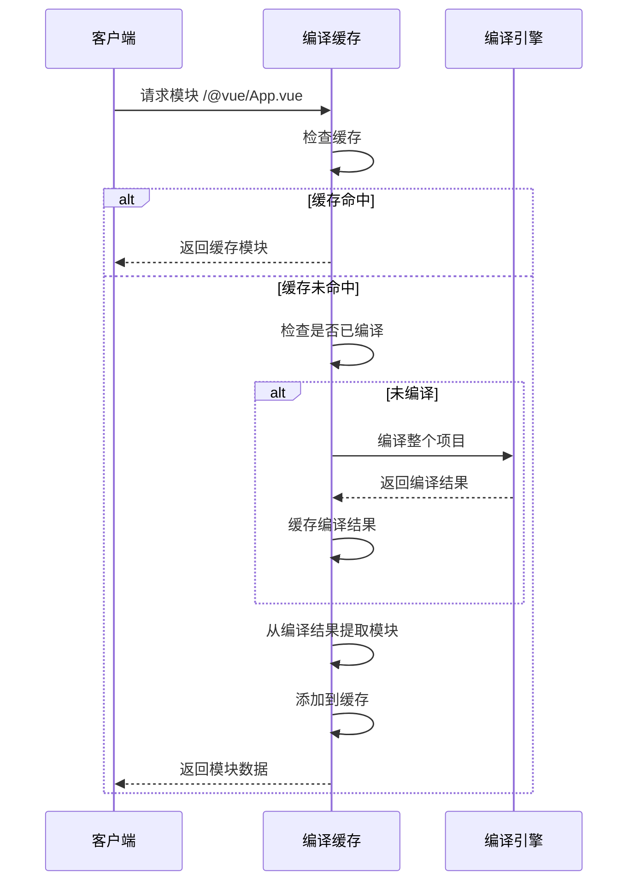
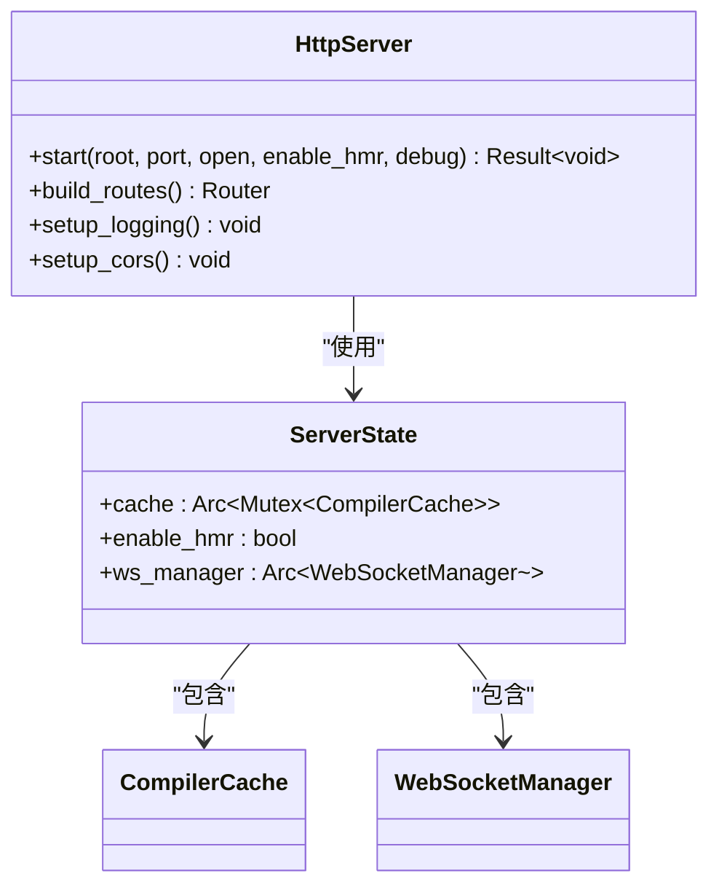
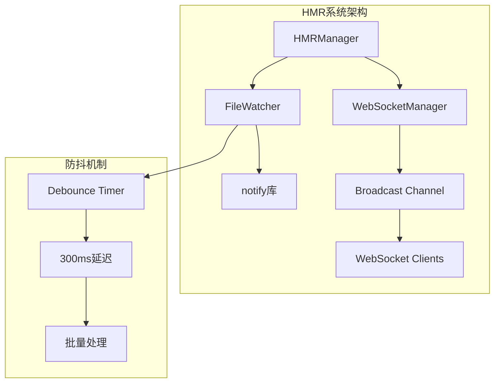
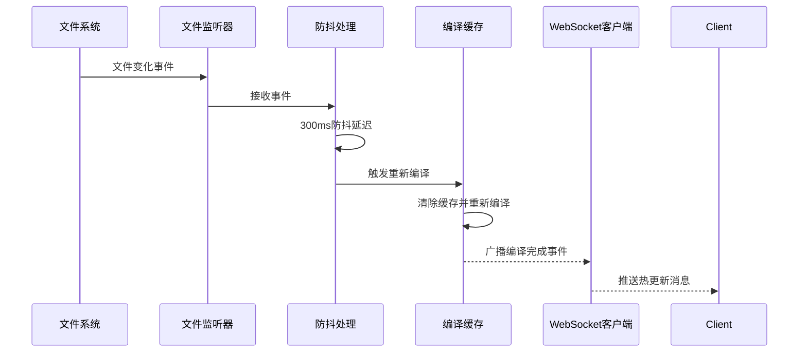
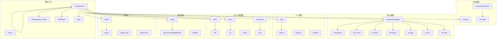

# Iris JetCrab CLI工具

<cite>
**本文档引用的文件**
- [main.rs](file://crates/iris-jetcrab-cli/src/main.rs)
- [server/mod.rs](file://crates/iris-jetcrab-cli/src/server/mod.rs)
- [server/http_server.rs](file://crates/iris-jetcrab-cli/src/server/http_server.rs)
- [server/routes.rs](file://crates/iris-jetcrab-cli/src/server/routes.rs)
- [server/compiler_cache.rs](file://crates/iris-jetcrab-cli/src/server/compiler_cache.rs)
- [server/hmr.rs](file://crates/iris-jetcrab-cli/src/server/hmr.rs)
- [utils.rs](file://crates/iris-jetcrab-cli/src/utils.rs)
- [Cargo.toml](file://crates/iris-jetcrab-cli/Cargo.toml)
- [iris-jetcrab-engine/Cargo.toml](file://crates/iris-jetcrab-engine/Cargo.toml)
- [lib.rs](file://crates/iris-jetcrab-engine/src/lib.rs)
- [IRIS_JETCRAB_CLI_ARCHITECTURE.md](file://docs/IRIS_JETCRAB_CLI_ARCHITECTURE.md)
</cite>

## 更新摘要
**所做更改**
- 更新了编译缓存系统以反映增强的模块解析逻辑
- 新增了npm包处理器和源文件处理器的详细分析
- 完善了依赖问题扫描和自动修复功能的实现
- 增强了路由处理机制，支持更多类型的模块解析
- 更新了WebSocket通信和文件监听机制的详细说明

## 目录
1. [简介](#简介)
2. [项目结构](#项目结构)
3. [核心组件](#核心组件)
4. [架构概览](#架构概览)
5. [详细组件分析](#详细组件分析)
6. [编译缓存系统](#编译缓存系统)
7. [HTTP服务器与路由](#http服务器与路由)
8. [HMR热模块替换](#hmr热模块替换)
9. [依赖关系分析](#依赖关系分析)
10. [性能考虑](#性能考虑)
11. [故障排除指南](#故障排除指南)
12. [结论](#结论)

## 简介

Iris JetCrab CLI 是一个专为 Vue 项目设计的开发服务器工具，采用**运行时按需编译**架构。该工具基于 Rust 语言开发，利用 iris-jetcrab-engine 编译引擎来处理 Vue 单文件组件（SFC）的编译，并通过 HTTP 服务器提供编译后的资源给浏览器渲染。

**核心创新特性**：
- **运行时按需编译**：首次请求时编译整个项目，后续请求使用缓存
- **智能模块解析**：支持多种模块解析策略，包括相对路径匹配、扩展名匹配、目录索引解析
- **HTTP服务器**：基于 Axum 框架的高性能 HTTP 服务器
- **增强路由系统**：完整的路由处理机制，支持 Vue 模块编译、npm包服务、源文件编译和依赖问题管理
- **编译缓存**：智能缓存管理，支持依赖树检测和增量编译
- **HMR热模块替换**：实时文件监听和热更新推送
- **WebSocket通信**：双向通信支持热更新事件推送
- **依赖问题管理**：自动扫描和修复npm依赖问题

## 项目结构

Iris JetCrab CLI 采用模块化的 Rust 项目结构，主要分为以下几个核心模块：

**图表来源**
- [main.rs:1-71](file://crates/iris-jetcrab-cli/src/main.rs#L1-L71)
- [server/mod.rs:1-15](file://crates/iris-jetcrab-cli/src/server/mod.rs#L1-L15)

**章节来源**
- [Cargo.toml:1-55](file://crates/iris-jetcrab-cli/Cargo.toml#L1-L55)
- [main.rs:1-71](file://crates/iris-jetcrab-cli/src/main.rs#L1-L71)

## 核心组件

### CLI 命令系统

Iris JetCrab CLI 提供两个主要命令：dev 和 info，每个命令都有特定的功能和参数。

#### Dev 命令
开发服务器启动命令，支持多种配置选项：
- `--root/-r`: 指定项目根目录，默认为当前目录
- `--port/-p`: 设置开发服务器端口，默认 3000
- `--open/-o`: 自动打开浏览器
- `--no-hmr`: 禁用热更新
- `--debug/-d`: 启用调试模式

#### Info 命令
显示项目信息命令：
- `--root/-r`: 项目根目录

**章节来源**
- [main.rs:25-56](file://crates/iris-jetcrab-cli/src/main.rs#L25-L56)
- [main.rs:58-70](file://crates/iris-jetcrab-cli/src/main.rs#L58-L70)

### 开发服务器架构

开发服务器是整个 CLI 工具的核心组件，负责编译 Vue 项目、提供 HTTP 服务和管理热更新。

**图表来源**
- [server/http_server.rs:20-117](file://crates/iris-jetcrab-cli/src/server/http_server.rs#L20-L117)
- [server/compiler_cache.rs:72-216](file://crates/iris-jetcrab-cli/src/server/compiler_cache.rs#L72-L216)

**章节来源**
- [server/http_server.rs:1-117](file://crates/iris-jetcrab-cli/src/server/http_server.rs#L1-L117)

## 架构概览

Iris JetCrab CLI 采用了分层架构设计，将不同的功能职责分离到独立的模块中：

**图表来源**
- [main.rs:15-23](file://crates/iris-jetcrab-cli/src/main.rs#L15-L23)
- [server/mod.rs:14](file://crates/iris-jetcrab-cli/src/server/mod.rs#L14)

**章节来源**
- [IRIS_JETCRAB_CLI_ARCHITECTURE.md:1-184](file://docs/IRIS_JETCRAB_CLI_ARCHITECTURE.md#L1-L184)

## 详细组件分析

### 命令处理模块

命令处理模块负责解析用户输入并执行相应的操作。每个命令都有独立的实现文件，遵循单一职责原则。

#### 开发命令实现

开发命令是最复杂的命令，负责完整的项目检测、编译和服务器启动流程：

**图表来源**
- [main.rs:62-69](file://crates/iris-jetcrab-cli/src/main.rs#L62-L69)

#### 信息命令实现

信息命令相对简单，主要用于显示项目的基本信息：

**章节来源**
- [main.rs:15-23](file://crates/iris-jetcrab-cli/src/main.rs#L15-L23)
- [main.rs:66-68](file://crates/iris-jetcrab-cli/src/main.rs#L66-L68)

## 编译缓存系统

编译缓存系统是 Iris JetCrab CLI 的核心创新之一，实现了智能的按需编译和缓存管理。

### 缓存架构设计

**图表来源**
- [server/compiler_cache.rs:22-64](file://crates/iris-jetcrab-cli/src/server/compiler_cache.rs#L22-L64)
- [server/compiler_cache.rs:218-301](file://crates/iris-jetcrab-cli/src/server/compiler_cache.rs#L218-L301)

### 缓存工作流程

**图表来源**
- [server/compiler_cache.rs:72-216](file://crates/iris-jetcrab-cli/src/server/compiler_cache.rs#L72-L216)

### 增强的模块解析逻辑

编译缓存系统实现了多种模块解析策略，以支持更灵活的模块查找：

#### 多种匹配策略
1. **完全匹配**：相对于项目根目录的完整路径
2. **文件名匹配**：仅匹配文件名
3. **路径后缀匹配**：支持不同平台的路径分隔符
4. **Vue模块前缀匹配**：处理/@vue/前缀的特殊路径
5. **扩展名自动补全**：当请求路径没有扩展名时，自动尝试常见扩展名
6. **目录索引文件解析**：当请求路径指向目录时，查找index文件

#### CSS/SCSS文件处理
对于缺失的CSS/SCSS/LESS文件，系统会返回空桩模块而不是抛出500错误，提升开发体验。

**章节来源**
- [server/compiler_cache.rs:106-216](file://crates/iris-jetcrab-cli/src/server/compiler_cache.rs#L106-L216)

## HTTP服务器与路由

### HTTP服务器实现

HTTP服务器模块实现了完整的 HTTP 服务器功能，包括路由处理、静态资源服务和热更新支持。

#### 服务器状态管理

服务器使用 `ServerState` 结构体来管理全局状态：

**图表来源**
- [server/http_server.rs:19-117](file://crates/iris-jetcrab-cli/src/server/http_server.rs#L19-L117)

#### HTTP 路由设计

服务器定义了多个路由来处理不同类型请求：

| 路由路径 | 处理器 | 功能描述 |
|---------|--------|----------|
| `/` | `index_handler` | 返回包含 iris-runtime 的 HTML 页面 |
| `/src/*path` | `source_file_handler` | 编译并返回可执行的 JavaScript 模块 |
| `/@vue/*path` | `vue_module_handler` | 提供编译后的 Vue 模块 |
| `/@npm/*path` | `npm_package_handler` | 提供 npm 包服务 |
| `/assets/*path` | `static_handler` | 提供静态资源文件 |
| `/api/project-info` | `project_info_handler` | 返回项目信息 API |
| `/api/dependency-issues` | `dependency_issues_handler` | 扫描依赖问题 |
| `/api/resolve-dependencies` | `resolve_dependencies_handler` | 自动修复依赖问题 |
| `/resolve.html` | `resolve_page_handler` | 依赖问题解决页面 |
| `/@hmr` | `hmr_handler` | HMR WebSocket 连接 |

**章节来源**
- [server/http_server.rs:61-83](file://crates/iris-jetcrab-cli/src/server/http_server.rs#L61-L83)
- [server/routes.rs:23-166](file://crates/iris-jetcrab-cli/src/server/routes.rs#L23-L166)

### 路由处理器实现

路由处理器模块实现了各种 HTTP 请求的处理逻辑：

#### 主页处理器
主页处理器负责返回包含 iris-runtime 的 HTML 页面，支持自定义 index.html 或使用默认模板。

#### 源文件处理器
源文件处理器实现了完整的模块编译功能，支持：
- 编译单个源文件
- 重写裸模块导入为/@npm/路径
- 添加HMR客户端代码
- 返回可执行的JavaScript模块

#### Vue 模块处理器
Vue 模块处理器实现了按需编译功能，支持编译单个 Vue 模块并返回编译结果。

#### npm包处理器
npm包处理器提供了npm包服务，支持：
- 解析包名和子路径
- 处理scoped包（如@vue/devtools-api）
- 重写包内部的相对导入
- 替换process.env.NODE_ENV为'development'

#### 静态资源处理器
静态资源处理器提供 public 目录下的静态文件访问，支持多种文件类型的 Content-Type 设置。

#### 项目信息处理器
项目信息处理器返回项目的元数据信息，包括项目根目录、Vue 文件数量、缓存状态等。

#### 依赖问题扫描处理器
依赖问题扫描处理器使用 iris-jetcrab-engine 的 DependencyScanner 来：
- 扫描项目中的依赖问题
- 分析未安装的npm包
- 提供详细的错误信息和解决方案

#### 依赖问题解决处理器
依赖问题解决处理器实现了自动修复功能：
- 下载未安装的npm包
- 更新package.json中的irisResolved字段
- 通过WebSocket推送下载进度
- 广播重新编译完成事件

#### HMR WebSocket处理器
HMR WebSocket处理器处理热更新的 WebSocket 连接，支持事件广播和客户端管理。

**章节来源**
- [server/routes.rs:1-1634](file://crates/iris-jetcrab-cli/src/server/routes.rs#L1-L1634)

## HMR热模块替换

### HMR架构设计

HMR（热模块替换）模块实现了完整的文件监听和热更新推送功能：

**图表来源**
- [server/hmr.rs:86-222](file://crates/iris-jetcrab-cli/src/server/hmr.rs#L86-L222)

### HMR事件系统

HMR系统定义了多种事件类型，用于与浏览器客户端通信：

| 事件类型 | JSON结构 | 触发时机 |
|---------|----------|----------|
| `connected` | `{ type: "connected", message: string }` | WebSocket连接建立 |
| `file-changed` | `{ type: "file-changed", path: string, timestamp: number }` | 文件发生变化 |
| `rebuild-complete` | `{ type: "rebuild-complete", modules_count: number, duration_ms: number }` | 重新编译完成 |
| `compile-error` | `{ type: "compile-error", message: string }` | 编译过程中发生错误 |
| `npm-download` | `{ type: "npm-download", package: string, version: string, progress: number, status: string, error: string }` | npm包下载进度 |

### 文件监听机制

HMR系统使用 notify 库实现高效的文件监听：

**图表来源**
- [server/hmr.rs:114-212](file://crates/iris-jetcrab-cli/src/server/hmr.rs#L114-L212)

**章节来源**
- [server/hmr.rs:1-222](file://crates/iris-jetcrab-cli/src/server/hmr.rs#L1-L222)

## 依赖关系分析

Iris JetCrab CLI 的依赖关系体现了清晰的分层架构：

**图表来源**
- [Cargo.toml:17-55](file://crates/iris-jetcrab-cli/Cargo.toml#L17-L55)
- [iris-jetcrab-engine/Cargo.toml:13-76](file://crates/iris-jetcrab-engine/Cargo.toml#L13-L76)

**章节来源**
- [Cargo.toml:1-55](file://crates/iris-jetcrab-cli/Cargo.toml#L1-L55)
- [iris-jetcrab-engine/Cargo.toml:1-76](file://crates/iris-jetcrab-engine/Cargo.toml#L1-L76)

## 性能考虑

Iris JetCrab CLI 在设计时考虑了多个性能优化方面：

### 异步处理
- 使用 Tokio 异步运行时处理并发请求
- 采用广播通道进行热更新通知
- 异步文件监听和编译处理

### 内存管理
- 合理的内存池和缓存策略
- 及时释放不再使用的资源
- 避免内存泄漏的编程实践

### 编译优化
- 条件编译启用优化特性
- 按需加载模块减少初始内存占用
- 编译结果缓存机制

### 缓存策略
- 首次请求时编译整个项目，后续请求使用缓存
- 智能依赖树检测，支持增量编译
- 缓存失效和重建机制

### 模块解析优化
- 多种匹配策略提高模块查找效率
- 智能的CSS/SCSS文件处理避免错误
- npm包缓存和重写机制

## 故障排除指南

### 常见问题及解决方案

#### 项目检测失败
**问题**: CLI 报告不是 Vue 项目
**原因**: 缺少必要的项目文件或配置
**解决方案**:
1. 确保存在 `package.json` 文件
2. 验证 Vue 依赖已正确安装
3. 检查入口文件是否存在

#### 服务器启动失败
**问题**: 开发服务器无法启动
**原因**: 端口被占用或其他系统问题
**解决方案**:
1. 更换端口号
2. 检查防火墙设置
3. 确认网络连接正常

#### 编译缓存问题
**问题**: 编译缓存异常或编译失败
**原因**: 缓存损坏或依赖树变化
**解决方案**:
1. 清理编译缓存
2. 重新编译项目
3. 检查依赖树变化

#### HMR功能异常
**问题**: 修改文件后页面未自动刷新
**原因**: HMR功能尚未完全实现或配置错误
**解决方案**:
1. 检查HMR配置
2. 验证文件监听器状态
3. 查看WebSocket连接状态

#### 依赖问题扫描失败
**问题**: 依赖问题扫描无法正常工作
**原因**: npm包管理器问题或网络连接异常
**解决方案**:
1. 检查npm包管理器状态
2. 验证网络连接
3. 清理npm缓存

**章节来源**
- [utils.rs:8-27](file://crates/iris-jetcrab-cli/src/utils.rs#L8-L27)
- [server/http_server.rs:38-42](file://crates/iris-jetcrab-cli/src/server/http_server.rs#L38-L42)

## 结论

Iris JetCrab CLI 是一个功能完整且设计良好的 Vue 项目开发工具。它成功地将 Rust 的高性能与浏览器渲染能力结合，为开发者提供了现代化的开发体验。

### 主要优势
- **运行时按需编译**: 首次请求时编译整个项目，后续请求使用缓存，提升开发体验
- **智能模块解析**: 支持多种模块解析策略，包括相对路径匹配、扩展名补全、目录索引解析
- **模块化设计**: 清晰的分层架构便于维护和扩展
- **异步处理**: 高效的并发处理能力
- **智能缓存**: 智能的依赖树管理和增量编译支持
- **HMR支持**: 完整的热模块替换功能
- **依赖管理**: 自动扫描和修复npm依赖问题
- **开发友好**: 完善的错误处理和用户反馈

### 架构创新
- **引擎分离**: iris-jetcrab-engine 与 iris-jetcrab-cli 的对等架构设计
- **按需编译**: 运行时编译而非预编译，提升灵活性
- **缓存优化**: 智能缓存管理，支持依赖变化检测
- **WebSocket通信**: 实时热更新推送机制
- **模块解析增强**: 支持npm包和源文件的复杂解析需求

### 发展方向
- 完善HMR功能的错误处理和性能优化
- 增强编译缓存的增量编译能力
- 扩展对更多前端框架的支持
- 优化编译性能和内存使用
- 增强开发工具链的集成能力
- 改进依赖问题扫描的准确性

该工具为 Vue 项目的开发提供了坚实的基础，随着后续版本的迭代，相信会成为开发者的重要生产力工具。其创新的运行时按需编译架构、智能缓存系统和增强的模块解析逻辑为现代前端开发提供了新的思路和解决方案。