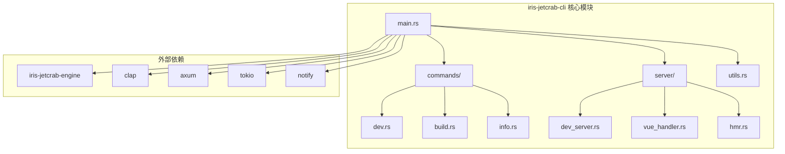
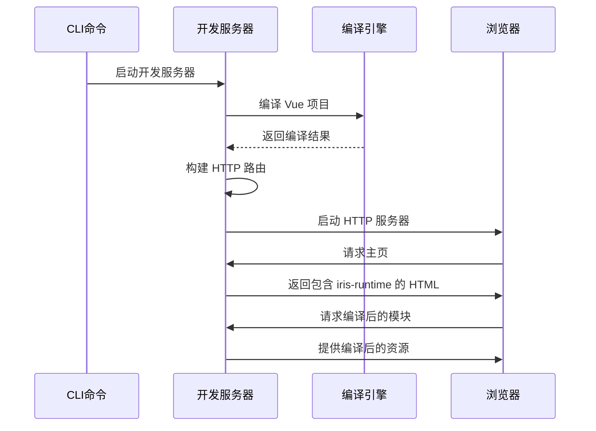
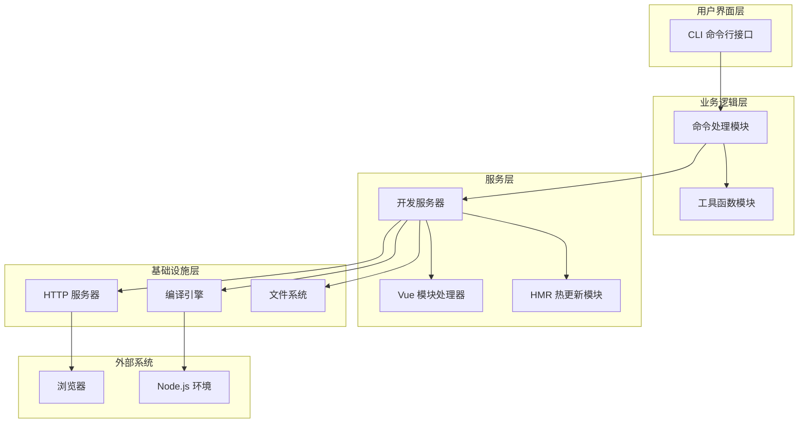
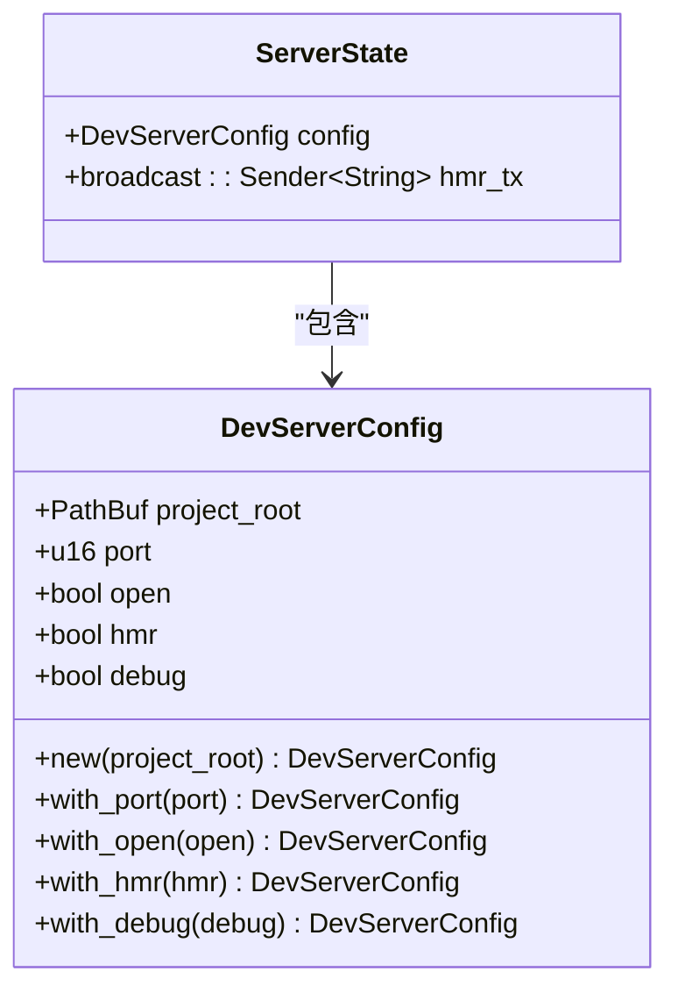
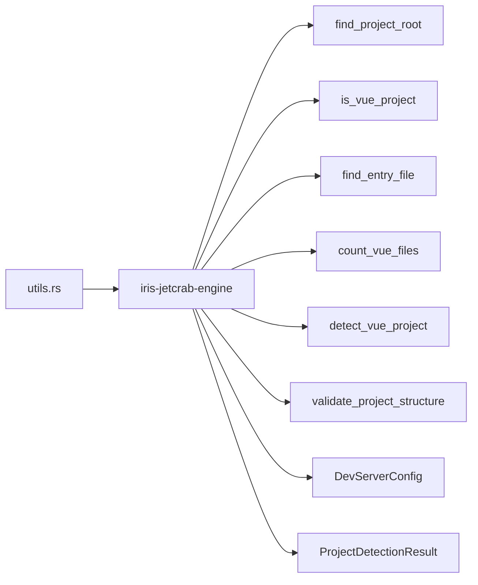
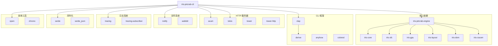

# Iris JetCrab CLI工具

<cite>
**本文档引用的文件**
- [Cargo.toml](file://crates/iris-jetcrab-cli/Cargo.toml)
- [main.rs](file://crates/iris-jetcrab-cli/src/main.rs)
- [commands/mod.rs](file://crates/iris-jetcrab-cli/src/commands/mod.rs)
- [commands/dev.rs](file://crates/iris-jetcrab-cli/src/commands/dev.rs)
- [commands/build.rs](file://crates/iris-jetcrab-cli/src/commands/build.rs)
- [commands/info.rs](file://crates/iris-jetcrab-cli/src/commands/info.rs)
- [server/mod.rs](file://crates/iris-jetcrab-cli/src/server/mod.rs)
- [server/dev_server.rs](file://crates/iris-jetcrab-cli/src/server/dev_server.rs)
- [server/vue_handler.rs](file://crates/iris-jetcrab-cli/src/server/vue_handler.rs)
- [server/hmr.rs](file://crates/iris-jetcrab-cli/src/server/hmr.rs)
- [utils.rs](file://crates/iris-jetcrab-cli/src/utils.rs)
- [README.md](file://crates/iris-jetcrab-cli/README.md)
- [iris-jetcrab-engine/Cargo.toml](file://crates/iris-jetcrab-engine/Cargo.toml)
- [iris-runtime.js](file://iris-runtime/bin/iris-runtime.js)
- [package.json](file://iris-runtime/package.json)
</cite>

## 目录
1. [简介](#简介)
2. [项目结构](#项目结构)
3. [核心组件](#核心组件)
4. [架构概览](#架构概览)
5. [详细组件分析](#详细组件分析)
6. [依赖关系分析](#依赖关系分析)
7. [性能考虑](#性能考虑)
8. [故障排除指南](#故障排除指南)
9. [结论](#结论)

## 简介

Iris JetCrab CLI 是一个专为 Vue 项目设计的开发服务器工具，支持浏览器渲染和热更新功能。该项目基于 Rust 语言开发，利用了 iris-jetcrab-engine 编译引擎来处理 Vue 单文件组件（SFC）的编译，并通过 HTTP 服务器提供编译后的资源给浏览器渲染。

该工具的主要特点包括：
- 支持 Vue 项目开发服务器启动
- 提供热更新（HMR）功能
- 自动打开浏览器
- 支持调试模式
- 与 iris-jetcrab-engine 深度集成

## 项目结构

Iris JetCrab CLI 采用模块化的 Rust 项目结构，主要分为以下几个核心模块：

**图表来源**
- [main.rs:1-86](file://crates/iris-jetcrab-cli/src/main.rs#L1-L86)
- [commands/mod.rs:1-6](file://crates/iris-jetcrab-cli/src/commands/mod.rs#L1-L6)
- [server/mod.rs:1-8](file://crates/iris-jetcrab-cli/src/server/mod.rs#L1-L8)

**章节来源**
- [Cargo.toml:1-54](file://crates/iris-jetcrab-cli/Cargo.toml#L1-L54)
- [main.rs:1-86](file://crates/iris-jetcrab-cli/src/main.rs#L1-L86)

## 核心组件

### CLI 命令系统

Iris JetCrab CLI 提供三个主要命令：dev、build 和 info，每个命令都有特定的功能和参数。

#### Dev 命令
开发服务器启动命令，支持多种配置选项：
- `--root/-r`: 指定项目根目录，默认为当前目录
- `--port/-p`: 设置开发服务器端口，默认 3000
- `--open/-o`: 自动打开浏览器
- `--no-hmr`: 禁用热更新
- `--debug/-d`: 启用调试模式

#### Build 命令
项目构建命令，用于生产环境部署：
- `--root/-r`: 项目根目录
- `--out-dir/-o`: 输出目录，默认 dist
- `--optimize`: 生产模式优化

#### Info 命令
显示项目信息命令：
- `--root/-r`: 项目根目录

**章节来源**
- [main.rs:22-68](file://crates/iris-jetcrab-cli/src/main.rs#L22-L68)
- [commands/dev.rs:13-82](file://crates/iris-jetcrab-cli/src/commands/dev.rs#L13-L82)
- [commands/build.rs:8-28](file://crates/iris-jetcrab-cli/src/commands/build.rs#L8-L28)
- [commands/info.rs:8-31](file://crates/iris-jetcrab-cli/src/commands/info.rs#L8-L31)

### 开发服务器架构

开发服务器是整个 CLI 工具的核心组件，负责编译 Vue 项目、提供 HTTP 服务和管理热更新。

**图表来源**
- [server/dev_server.rs:32-92](file://crates/iris-jetcrab-cli/src/server/dev_server.rs#L32-L92)
- [server/dev_server.rs:95-108](file://crates/iris-jetcrab-cli/src/server/dev_server.rs#L95-L108)

**章节来源**
- [server/dev_server.rs:1-177](file://crates/iris-jetcrab-cli/src/server/dev_server.rs#L1-L177)

## 架构概览

Iris JetCrab CLI 采用了分层架构设计，将不同的功能职责分离到独立的模块中：

**图表来源**
- [main.rs:9-20](file://crates/iris-jetcrab-cli/src/main.rs#L9-L20)
- [server/mod.rs:7](file://crates/iris-jetcrab-cli/src/server/mod.rs#L7)

**章节来源**
- [README.md:148-165](file://crates/iris-jetcrab-cli/README.md#L148-L165)

## 详细组件分析

### 命令处理模块

命令处理模块负责解析用户输入并执行相应的操作。每个命令都有独立的实现文件，遵循单一职责原则。

#### 开发命令实现

开发命令是最复杂的命令，负责完整的项目检测、编译和服务器启动流程：

**图表来源**
- [commands/dev.rs:13-82](file://crates/iris-jetcrab-cli/src/commands/dev.rs#L13-L82)

#### 构建命令实现

构建命令目前处于开发阶段，提供了基本的项目检测功能：

**章节来源**
- [commands/dev.rs:1-82](file://crates/iris-jetcrab-cli/src/commands/dev.rs#L1-L82)
- [commands/build.rs:1-28](file://crates/iris-jetcrab-cli/src/commands/build.rs#L1-L28)
- [commands/info.rs:1-31](file://crates/iris-jetcrab-cli/src/commands/info.rs#L1-L31)

### 开发服务器实现

开发服务器模块实现了完整的 HTTP 服务器功能，包括路由处理、静态资源服务和热更新支持。

#### 服务器状态管理

服务器使用 `ServerState` 结构体来管理全局状态：

**图表来源**
- [server/dev_server.rs:25-29](file://crates/iris-jetcrab-cli/src/server/dev_server.rs#L25-L29)
- [server/dev_server.rs:68-72](file://crates/iris-jetcrab-cli/src/server/dev_server.rs#L68-L72)

#### HTTP 路由设计

服务器定义了多个路由来处理不同类型请求：

| 路由路径 | 处理器 | 功能描述 |
|---------|--------|----------|
| `/` | `index_handler` | 返回包含 iris-runtime 的 HTML 页面 |
| `/@vue/*path` | `vue_module_handler` | 提供编译后的 Vue 模块 |
| `/assets/*path` | `static_handler` | 提供静态资源文件 |

**章节来源**
- [server/dev_server.rs:51-59](file://crates/iris-jetcrab-cli/src/server/dev_server.rs#L51-L59)
- [server/dev_server.rs:110-138](file://crates/iris-jetcrab-cli/src/server/dev_server.rs#L110-L138)

### 工具函数模块

工具函数模块重新导出了 iris-jetcrab-engine 中的项目检测和验证功能：

**图表来源**
- [utils.rs:6-15](file://crates/iris-jetcrab-cli/src/utils.rs#L6-L15)

**章节来源**
- [utils.rs:1-17](file://crates/iris-jetcrab-cli/src/utils.rs#L1-L17)

## 依赖关系分析

Iris JetCrab CLI 的依赖关系体现了清晰的分层架构：

**图表来源**
- [Cargo.toml:17-53](file://crates/iris-jetcrab-cli/Cargo.toml#L17-L53)
- [iris-jetcrab-engine/Cargo.toml:13-53](file://crates/iris-jetcrab-engine/Cargo.toml#L13-L53)

**章节来源**
- [Cargo.toml:1-54](file://crates/iris-jetcrab-cli/Cargo.toml#L1-L54)
- [iris-jetcrab-engine/Cargo.toml:1-72](file://crates/iris-jetcrab-engine/Cargo.toml#L1-L72)

## 性能考虑

Iris JetCrab CLI 在设计时考虑了多个性能优化方面：

### 异步处理
- 使用 Tokio 异步运行时处理并发请求
- 采用广播通道进行热更新通知
- 异步文件监听和编译处理

### 内存管理
- 合理的内存池和缓存策略
- 及时释放不再使用的资源
- 避免内存泄漏的编程实践

### 编译优化
- 条件编译启用优化特性
- 按需加载模块减少初始内存占用
- 编译结果缓存机制

## 故障排除指南

### 常见问题及解决方案

#### 项目检测失败
**问题**: CLI 报告不是 Vue 项目
**原因**: 缺少必要的项目文件或配置
**解决方案**: 
1. 确保存在 `package.json` 文件
2. 验证 Vue 依赖已正确安装
3. 检查入口文件是否存在

#### 服务器启动失败
**问题**: 开发服务器无法启动
**原因**: 端口被占用或其他系统问题
**解决方案**:
1. 更换端口号
2. 检查防火墙设置
3. 确认网络连接正常

#### 热更新不工作
**问题**: 修改文件后页面未自动刷新
**原因**: HMR 功能尚未完全实现
**解决方案**:
1. 刷新浏览器手动更新
2. 等待后续版本更新
3. 使用手动刷新作为临时解决方案

**章节来源**
- [commands/dev.rs:32-41](file://crates/iris-jetcrab-cli/src/commands/dev.rs#L32-L41)
- [server/dev_server.rs:81-83](file://crates/iris-jetcrab-cli/src/server/dev_server.rs#L81-L83)

## 结论

Iris JetCrab CLI 是一个功能完整且设计良好的 Vue 项目开发工具。它成功地将 Rust 的高性能与浏览器渲染能力结合，为开发者提供了现代化的开发体验。

### 主要优势
- **模块化设计**: 清晰的分层架构便于维护和扩展
- **异步处理**: 高效的并发处理能力
- **开发友好**: 完善的错误处理和用户反馈
- **可扩展性**: 良好的插件和扩展机制

### 发展方向
- 完成热更新功能的实现
- 优化编译性能和内存使用
- 增强错误处理和诊断能力
- 扩展对更多前端框架的支持

该工具为 Vue 项目的开发提供了坚实的基础，随着后续版本的迭代，相信会成为开发者的重要生产力工具。