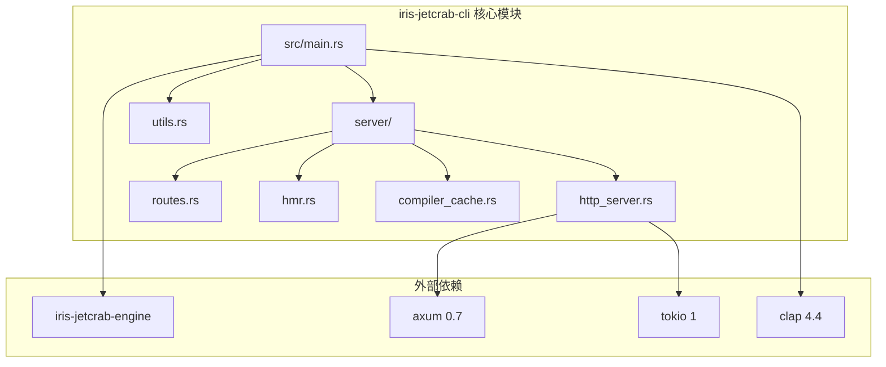
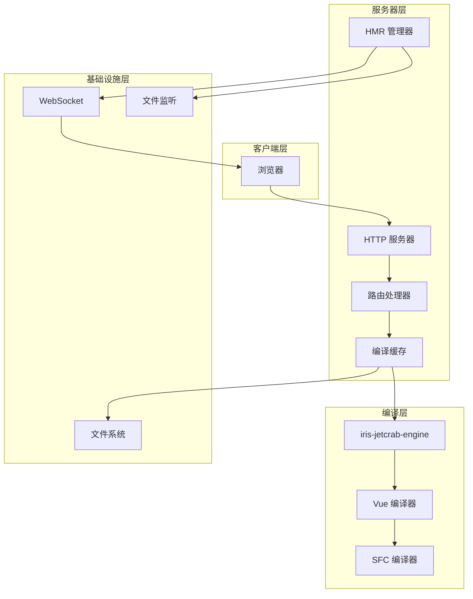
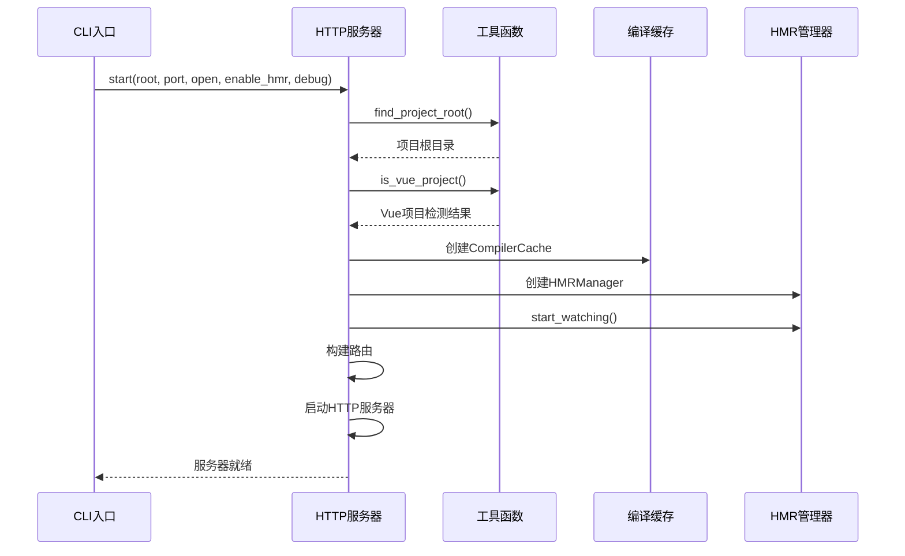
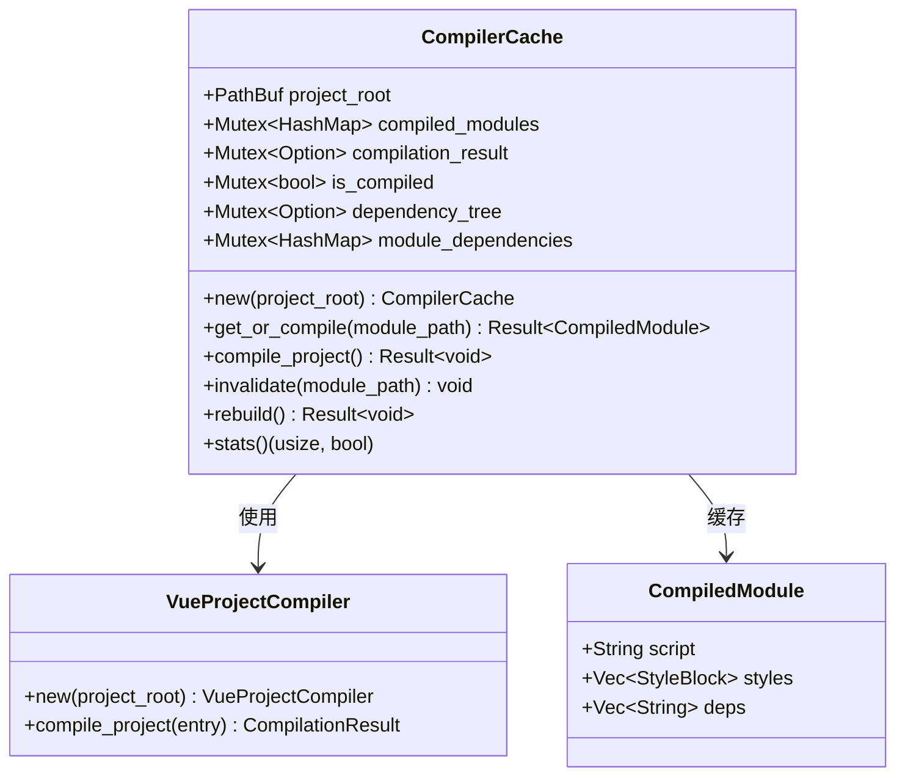
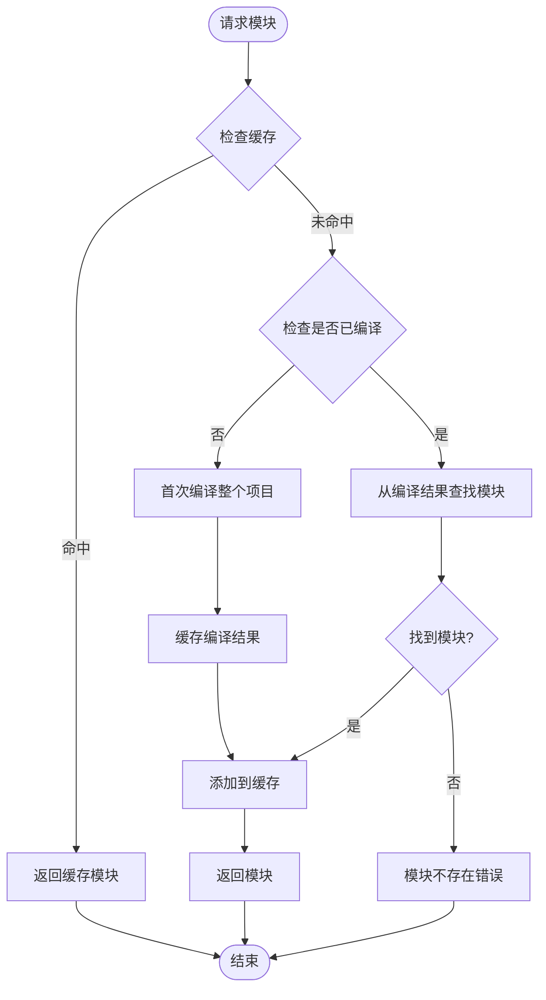
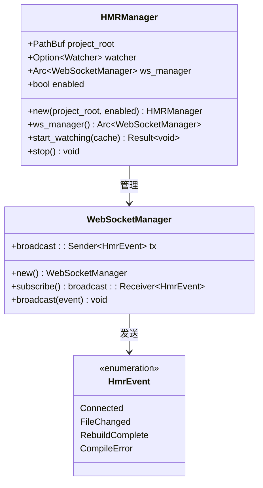
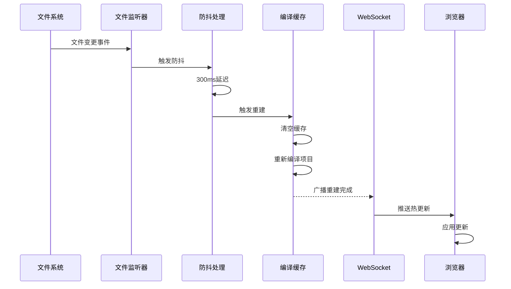
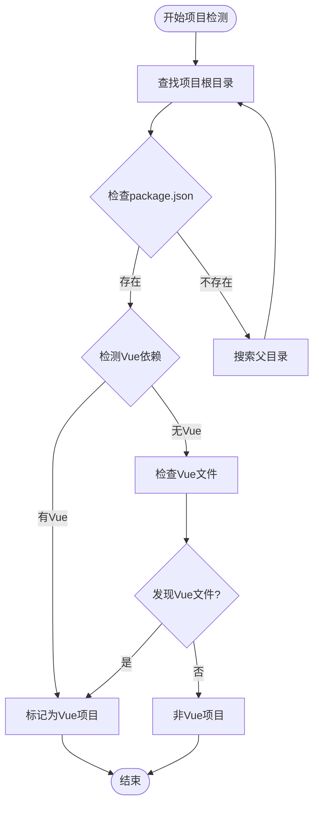
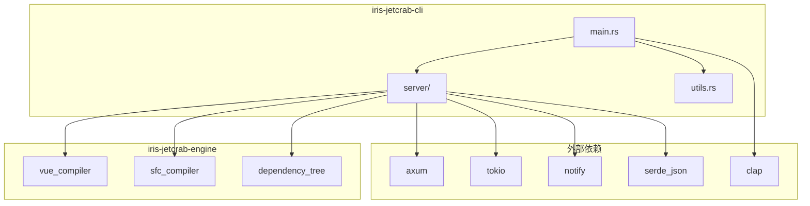

# Iris JetCrab CLI架构文档

<cite>
**本文档引用的文件**
- [main.rs](file://crates/iris-jetcrab-cli/src/main.rs)
- [Cargo.toml](file://crates/iris-jetcrab-cli/Cargo.toml)
- [server/mod.rs](file://crates/iris-jetcrab-cli/src/server/mod.rs)
- [utils.rs](file://crates/iris-jetcrab-cli/src/utils.rs)
- [http_server.rs](file://crates/iris-jetcrab-cli/src/server/http_server.rs)
- [routes.rs](file://crates/iris-jetcrab-cli/src/server/routes.rs)
- [hmr.rs](file://crates/iris-jetcrab-cli/src/server/hmr.rs)
- [compiler_cache.rs](file://crates/iris-jetcrab-cli/src/server/compiler_cache.rs)
- [Cargo.toml](file://crates/iris-jetcrab-engine/Cargo.toml)
- [lib.rs](file://crates/iris-jetcrab-engine/src/lib.rs)
- [IRIS_JETCRAB_CLI_ARCHITECTURE.md](file://docs/IRIS_JETCRAB_CLI_ARCHITECTURE.md)
- [Cargo.toml](file://Cargo.toml)
- [iris.config.json](file://examples/vue-demo/iris.config.json)
</cite>

## 目录
1. [简介](#简介)
2. [项目结构](#项目结构)
3. [核心组件](#核心组件)
4. [架构概览](#架构概览)
5. [详细组件分析](#详细组件分析)
6. [依赖关系分析](#依赖关系分析)
7. [性能考虑](#性能考虑)
8. [故障排除指南](#故障排除指南)
9. [结论](#结论)

## 简介

Iris JetCrab CLI 是一个专为 Vue 项目设计的开发服务器工具，采用"运行时按需编译"架构。该工具提供了现代化的开发体验，支持热模块替换(HMR)、实时文件监听和高效的编译缓存机制。

该架构的核心理念是将编译逻辑与服务器功能分离，通过独立的编译引擎提供强大的 Vue SFC 编译能力，而 CLI 工具专注于提供便捷的开发服务器功能。

## 项目结构

Iris JetCrab CLI 项目采用清晰的模块化组织结构：

**图表来源**
- [main.rs:1-71](file://crates/iris-jetcrab-cli/src/main.rs#L1-L71)
- [server/mod.rs:1-15](file://crates/iris-jetcrab-cli/src/server/mod.rs#L1-L15)

**章节来源**
- [main.rs:1-71](file://crates/iris-jetcrab-cli/src/main.rs#L1-L71)
- [Cargo.toml:1-54](file://crates/iris-jetcrab-cli/Cargo.toml#L1-L54)

## 核心组件

### CLI 入口点
主程序使用 clap 框架提供命令行接口，支持开发服务器启动和项目信息查询两个主要命令。

### HTTP 服务器
基于 Axum 框架构建的异步 HTTP 服务器，提供现代化的 Web 开发体验。

### 编译缓存系统
智能的编译缓存机制，在首次请求时编译整个项目，并在后续请求中使用缓存结果。

### HMR 热更新系统
实时文件监听和热更新推送，提供流畅的开发体验。

**章节来源**
- [main.rs:15-71](file://crates/iris-jetcrab-cli/src/main.rs#L15-L71)
- [http_server.rs:19-104](file://crates/iris-jetcrab-cli/src/server/http_server.rs#L19-L104)

## 架构概览

Iris JetCrab CLI 采用了分层架构设计，实现了编译逻辑与服务器功能的清晰分离：

**图表来源**
- [http_server.rs:58-70](file://crates/iris-jetcrab-cli/src/server/http_server.rs#L58-L70)
- [compiler_cache.rs:20-34](file://crates/iris-jetcrab-cli/src/server/compiler_cache.rs#L20-L34)
- [hmr.rs:71-81](file://crates/iris-jetcrab-cli/src/server/hmr.rs#L71-L81)

## 详细组件分析

### HTTP 服务器组件

HTTP 服务器是整个 CLI 工具的核心，负责处理所有网络请求和服务器生命周期管理。

#### 服务器启动流程

**图表来源**
- [http_server.rs:20-104](file://crates/iris-jetcrab-cli/src/server/http_server.rs#L20-L104)

#### 路由处理系统

服务器提供以下核心路由：

| 路由 | 方法 | 功能描述 |
|------|------|----------|
| `/` | GET | 返回主页内容 |
| `/@vue/*path` | GET | Vue 模块按需编译 |
| `/assets/*path` | GET | 提供静态资源 |
| `/api/project-info` | GET | 返回项目信息 |
| `/@hmr` | GET | HMR WebSocket 连接 |

**章节来源**
- [http_server.rs:58-70](file://crates/iris-jetcrab-cli/src/server/http_server.rs#L58-L70)
- [routes.rs:22-146](file://crates/iris-jetcrab-cli/src/server/routes.rs#L22-L146)

### 编译缓存管理系统

编译缓存系统是 Iris JetCrab CLI 的核心性能优化组件，实现了智能的缓存策略和失效机制。

#### 缓存架构设计

**图表来源**
- [compiler_cache.rs:20-59](file://crates/iris-jetcrab-cli/src/server/compiler_cache.rs#L20-L59)
- [compiler_cache.rs:14-16](file://crates/iris-jetcrab-cli/src/server/compiler_cache.rs#L14-L16)

#### 缓存工作流程

**图表来源**
- [compiler_cache.rs:61-95](file://crates/iris-jetcrab-cli/src/server/compiler_cache.rs#L61-L95)

**章节来源**
- [compiler_cache.rs:1-223](file://crates/iris-jetcrab-cli/src/server/compiler_cache.rs#L1-L223)

### HMR 热更新系统

HMR 系统提供了实时的文件变更检测和热更新推送功能，显著提升了开发效率。

#### HMR 架构设计

**图表来源**
- [hmr.rs:71-97](file://crates/iris-jetcrab-cli/src/server/hmr.rs#L71-L97)
- [hmr.rs:47-69](file://crates/iris-jetcrab-cli/src/server/hmr.rs#L47-L69)

#### HMR 工作流程

**图表来源**
- [hmr.rs:117-169](file://crates/iris-jetcrab-cli/src/server/hmr.rs#L117-L169)

**章节来源**
- [hmr.rs:1-207](file://crates/iris-jetcrab-cli/src/server/hmr.rs#L1-L207)

### 工具函数模块

工具函数模块提供了项目检测、文件查找和信息收集等辅助功能。

#### 项目检测算法

**图表来源**
- [utils.rs:8-62](file://crates/iris-jetcrab-cli/src/utils.rs#L8-L62)

**章节来源**
- [utils.rs:1-142](file://crates/iris-jetcrab-cli/src/utils.rs#L1-L142)

## 依赖关系分析

Iris JetCrab CLI 采用了精心设计的依赖关系，确保了模块间的松耦合和高内聚。

**图表来源**
- [Cargo.toml:17-54](file://crates/iris-jetcrab-cli/Cargo.toml#L17-L54)
- [Cargo.toml:13-69](file://crates/iris-jetcrab-engine/Cargo.toml#L13-L69)

### 核心依赖特性

| 依赖名称 | 版本 | 主要用途 | 关键特性 |
|----------|------|----------|----------|
| axum | 0.7 | HTTP 服务器框架 | 异步处理、中间件支持 |
| tokio | 1 | 异步运行时 | 全功能异步支持 |
| clap | 4.4 | 命令行解析 | 类型安全、自动帮助 |
| notify | 6.1 | 文件系统监听 | 跨平台文件监控 |
| serde_json | 1.0 | JSON序列化 | 高性能序列化 |

**章节来源**
- [Cargo.toml:17-54](file://crates/iris-jetcrab-cli/Cargo.toml#L17-L54)
- [Cargo.toml:13-69](file://crates/iris-jetcrab-engine/Cargo.toml#L13-L69)

## 性能考虑

Iris JetCrab CLI 在设计时充分考虑了性能优化，采用了多种策略来提升开发体验：

### 编译缓存策略
- **首次编译优化**：首次请求时编译整个项目，后续请求使用缓存
- **智能失效机制**：检测依赖变化时自动重新编译
- **内存管理**：使用 Arc 和 Mutex 确保线程安全的缓存访问

### 异步处理优化
- **非阻塞 I/O**：所有文件操作和网络请求都是异步的
- **并发处理**：多个请求可以并行处理，充分利用多核 CPU
- **资源池管理**：合理管理数据库连接和文件句柄

### 内存使用优化
- **增量更新**：HMR 系统只处理变化的模块
- **缓存淘汰**：实现 LRU 缓存策略防止内存泄漏
- **零拷贝优化**：在可能的情况下使用零拷贝技术

## 故障排除指南

### 常见问题及解决方案

#### 1. 项目检测失败
**问题症状**：CLI 报告不是 Vue 项目
**可能原因**：
- 缺少 package.json 文件
- 项目根目录不正确
- 缺少 Vue 相关依赖

**解决步骤**：
1. 确认项目根目录包含 package.json
2. 检查 package.json 中是否包含 Vue 依赖
3. 验证 src 目录结构

#### 2. 编译错误
**问题症状**：编译过程中出现错误
**可能原因**：
- 语法错误
- 缺少依赖
- 配置文件错误

**解决步骤**：
1. 检查控制台错误信息
2. 验证 TypeScript/JavaScript 语法
3. 确认所有依赖已安装

#### 3. HMR 不工作
**问题症状**：文件修改后页面不刷新
**可能原因**：
- 文件监听器未启动
- WebSocket 连接失败
- 防抖机制导致延迟

**解决步骤**：
1. 检查 HMR 配置
2. 验证防火墙设置
3. 查看浏览器控制台错误

**章节来源**
- [utils.rs:118-141](file://crates/iris-jetcrab-cli/src/utils.rs#L118-L141)
- [hmr.rs:99-197](file://crates/iris-jetcrab-cli/src/server/hmr.rs#L99-L197)

## 结论

Iris JetCrab CLI 代表了现代 Vue 开发工具的发展方向，通过"运行时按需编译"架构实现了高性能和易用性的完美平衡。该工具不仅提供了完整的开发服务器功能，还通过智能的缓存机制和实时热更新系统显著提升了开发效率。

### 主要优势

1. **架构清晰**：编译逻辑与服务器功能分离，职责明确
2. **性能优异**：智能缓存和异步处理确保快速响应
3. **开发友好**：实时热更新和直观的错误提示
4. **扩展性强**：模块化设计便于功能扩展

### 未来发展方向

1. **增量编译**：实现更精确的模块级编译
2. **性能分析**：集成编译性能监控工具
3. **IDE 集成**：提供更好的 IDE 开发体验
4. **云开发**：支持远程开发环境

该架构为 Vue 生态系统提供了一个强大而灵活的开发工具，为未来的进一步发展奠定了坚实的基础。