# Iris JetCrab CLI架构文档

<cite>
**本文档引用的文件**
- [main.rs](file://crates/iris-jetcrab-cli/src/main.rs)
- [Cargo.toml](file://crates/iris-jetcrab-cli/Cargo.toml)
- [server/mod.rs](file://crates/iris-jetcrab-cli/src/server/mod.rs)
- [utils.rs](file://crates/iris-jetcrab-cli/src/utils.rs)
- [http_server.rs](file://crates/iris-jetcrab-cli/src/server/http_server.rs)
- [routes.rs](file://crates/iris-jetcrab-cli/src/server/routes.rs)
- [hmr.rs](file://crates/iris-jetcrab-cli/src/server/hmr.rs)
- [compiler_cache.rs](file://crates/iris-jetcrab-cli/src/server/compiler_cache.rs)
- [progress.html](file://crates/iris-jetcrab-cli/src/server/progress.html)
- [dependency_scanner.rs](file://crates/iris-jetcrab-engine/src/dependency_scanner.rs)
- [npm_downloader.rs](file://crates/iris-jetcrab-engine/src/npm_downloader.rs)
- [Cargo.toml](file://crates/iris-jetcrab-engine/Cargo.toml)
- [Cargo.toml](file://Cargo.toml)
- [iris.config.json](file://examples/vue-demo/iris.config.json)
</cite>

## 更新摘要
**变更内容**
- 增强了编译缓存管理：改进的模块解析和路径匹配策略
- 优化了模块解析系统：支持多种路径格式和目录索引文件
- 改进了路由系统：新增npm包处理器和重写导入机制
- 优化了开发服务器功能：增强的HMR和依赖管理集成

## 目录
1. [简介](#简介)
2. [项目结构](#项目结构)
3. [核心组件](#核心组件)
4. [架构概览](#架构概览)
5. [详细组件分析](#详细组件分析)
6. [依赖关系分析](#依赖关系分析)
7. [性能考虑](#性能考虑)
8. [故障排除指南](#故障排除指南)
9. [结论](#结论)

## 简介

Iris JetCrab CLI 是一个专为 Vue 项目设计的开发服务器工具，采用"运行时按需编译"架构。该工具提供了现代化的开发体验，支持热模块替换(HMR)、实时文件监听、高效的编译缓存机制以及**增强的依赖管理功能**。

该架构的核心理念是将编译逻辑与服务器功能分离，通过独立的编译引擎提供强大的 Vue SFC 编译能力，而 CLI 工具专注于提供便捷的开发服务器功能。**最新版本在编译缓存管理、模块解析和路由系统方面进行了重大改进，提供了更智能的模块处理和更流畅的开发体验**。

## 项目结构

Iris JetCrab CLI 项目采用清晰的模块化组织结构，**新增了完整的依赖管理和npm包处理生态系统**：

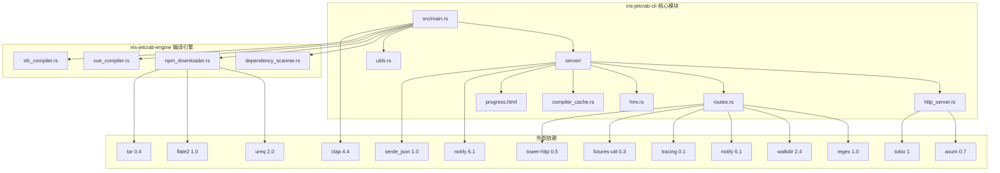

**图表来源**
- [main.rs:1-71](file://crates/iris-jetcrab-cli/src/main.rs#L1-L71)
- [server/mod.rs:1-15](file://crates/iris-jetcrab-cli/src/server/mod.rs#L1-L15)

**章节来源**
- [main.rs:1-71](file://crates/iris-jetcrab-cli/src/main.rs#L1-L71)
- [Cargo.toml:1-55](file://crates/iris-jetcrab-cli/Cargo.toml#L1-L55)

## 核心组件

### CLI 入口点
主程序使用 clap 框架提供命令行接口，支持开发服务器启动和项目信息查询两个主要命令。

### HTTP 服务器
基于 Axum 框架构建的异步 HTTP 服务器，提供现代化的 Web 开发体验。**新增了增强的内容类型检测和CORS支持**。

### 编译缓存系统
智能的编译缓存机制，在首次请求时编译整个项目，并在后续请求中使用缓存结果。**新增了多种模块解析策略和路径匹配算法**。

### HMR 热更新系统
实时文件监听和热更新推送，提供流畅的开发体验。**集成了npm包下载进度事件和依赖管理功能**。

### 依赖扫描系统
**增强功能**：完整的依赖问题检测和自动修复系统，包括：
- 依赖问题扫描 API (`/api/dependency-issues`)
- 交互式解决界面 (`/resolve.html`)
- 自动修复功能 (`/api/resolve-dependencies`)

### npm 包处理器
**新增功能**：从 node_modules 直接提供 npm 包的服务，支持裸模块导入重写和相对路径处理。

### npm 下载进度可视化系统
**增强功能**：实时显示 npm 包下载进度的完整系统，包括前端页面和 WebSocket 集成。

**章节来源**
- [main.rs:15-71](file://crates/iris-jetcrab-cli/src/main.rs#L15-L71)
- [http_server.rs:19-117](file://crates/iris-jetcrab-cli/src/server/http_server.rs#L19-L117)

## 架构概览

Iris JetCrab CLI 采用了分层架构设计，实现了编译逻辑与服务器功能的清晰分离。**新增了增强的依赖管理层和npm包处理层**：

```mermaid
graph TB
subgraph "客户端层"
Browser[浏览器]
ResolvePage[解决页面 /resolve.html]
ProgressPage[进度页面 progress.html]
NPMPage[npm包页面 /@npm/*]
end
subgraph "服务器层"
HTTP[HTTP 服务器]
Routes[路由处理器]
Cache[编译缓存]
HMR[HMR 管理器]
WS[WebSocket 管理器]
NPMHandler[npm 包处理器]
End
subgraph "依赖管理层"
DepScanner[依赖扫描器]
Resolver[版本解析器]
Fixer[自动修复器]
end
subgraph "编译层"
Engine[iris-jetcrab-engine]
Compiler[Vue 编译器]
SFC[SFC 编译器]
NPM[NPM 下载器]
end
subgraph "基础设施层"
FS[文件系统]
Notify[文件监听]
Progress[进度回调]
ProjectScan[项目扫描器]
End
Browser --> HTTP
ResolvePage --> Routes
ProgressPage --> WS
NPMPage --> NPMHandler
HTTP --> Routes
Routes --> Cache
Cache --> Engine
Engine --> Compiler
Compiler --> SFC
NPMHandler --> NPM
NPM --> DepScanner
DepScanner --> Resolver
Resolver --> Fixer
Fixer --> NPM
NPM --> Progress
Progress --> WS
Cache --> FS
HMR --> Notify
HMR --> WS
WS --> Browser
WS --> ProgressPage
WS --> ResolvePage
WS --> NPMPage
```

**图表来源**
- [http_server.rs:62-83](file://crates/iris-jetcrab-cli/src/server/http_server.rs#L62-L83)
- [compiler_cache.rs:40-70](file://crates/iris-jetcrab-cli/src/server/compiler_cache.rs#L40-L70)
- [hmr.rs:86-112](file://crates/iris-jetcrab-cli/src/server/hmr.rs#L86-L112)

## 详细组件分析

### HTTP 服务器组件

HTTP 服务器是整个 CLI 工具的核心，负责处理所有网络请求和服务器生命周期管理。**新增了增强的内容类型检测和CORS支持**。

#### 服务器启动流程

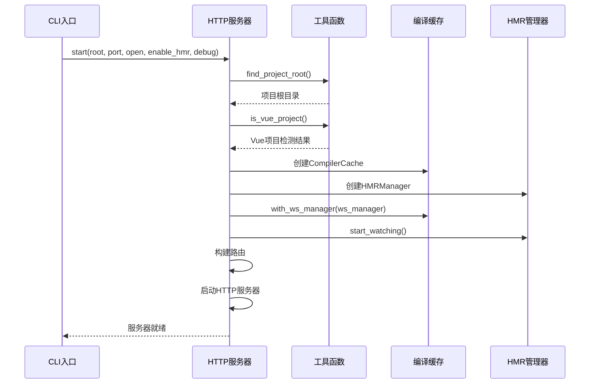

**图表来源**
- [http_server.rs:20-117](file://crates/iris-jetcrab-cli/src/server/http_server.rs#L20-L117)

#### 路由处理系统

服务器提供以下核心路由，**新增了npm包处理和增强的模块解析路由**：

| 路由 | 方法 | 功能描述 |
|------|------|----------|
| `/` | GET | 返回主页内容 |
| `/src/*path` | GET | 源文件编译和返回JavaScript模块 |
| `/@vue/*path` | GET | Vue 模块按需编译 |
| `/@npm/*path` | GET | npm 包处理和下载 |
| `/assets/*path` | GET | 提供静态资源 |
| `/api/project-info` | GET | 返回项目信息 |
| `/api/dependency-issues` | GET | 扫描并返回依赖问题 |
| `/resolve.html` | GET | 依赖问题解决页面 |
| `/api/resolve-dependencies` | POST | 自动修复依赖问题 |
| `/@hmr` | GET | HMR WebSocket 连接 |
| `/progress.html` | GET | npm 下载进度可视化页面 |

**章节来源**
- [http_server.rs:62-83](file://crates/iris-jetcrab-cli/src/server/http_server.rs#L62-L83)
- [routes.rs:24-147](file://crates/iris-jetcrab-cli/src/server/routes.rs#L24-L147)

### 编译缓存管理系统

编译缓存系统是 Iris JetCrab CLI 的核心性能优化组件，实现了智能的缓存策略和失效机制。**新增了多种模块解析策略和路径匹配算法**。

#### 缓存架构设计

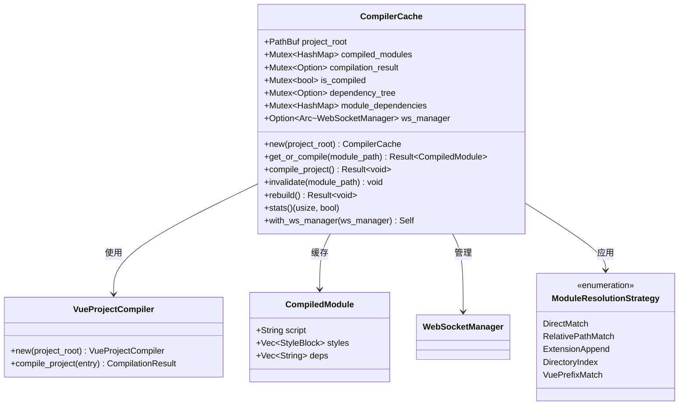

**图表来源**
- [compiler_cache.rs:22-70](file://crates/iris-jetcrab-cli/src/server/compiler_cache.rs#L22-L70)
- [compiler_cache.rs:72-216](file://crates/iris-jetcrab-cli/src/server/compiler_cache.rs#L72-L216)

#### 缓存工作流程

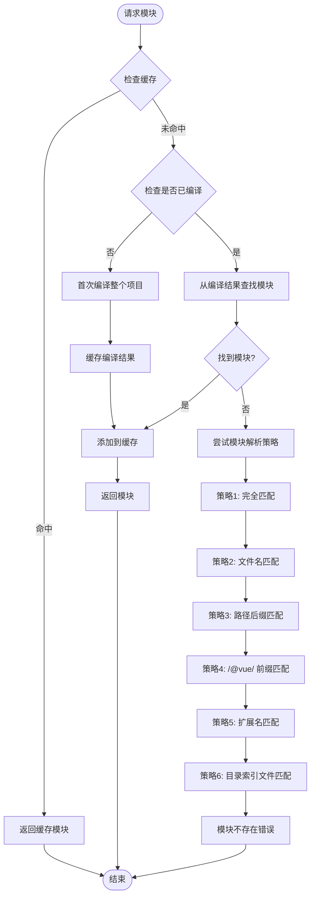

**图表来源**
- [compiler_cache.rs:72-216](file://crates/iris-jetcrab-cli/src/server/compiler_cache.rs#L72-L216)

**章节来源**
- [compiler_cache.rs:1-359](file://crates/iris-jetcrab-cli/src/server/compiler_cache.rs#L1-L359)

### HMR 热更新系统

HMR 系统提供了实时的文件变更检测和热更新推送功能，显著提升了开发效率。**集成了npm包下载进度事件和依赖管理功能**。

#### HMR 架构设计

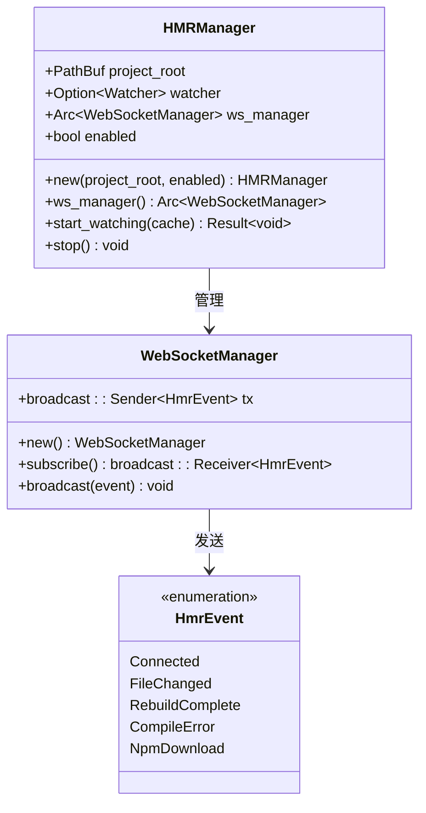

**图表来源**
- [hmr.rs:86-112](file://crates/iris-jetcrab-cli/src/server/hmr.rs#L86-L112)
- [hmr.rs:62-84](file://crates/iris-jetcrab-cli/src/server/hmr.rs#L62-L84)

#### HMR 工作流程

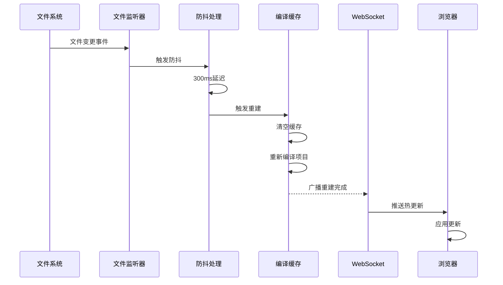

**图表来源**
- [hmr.rs:114-222](file://crates/iris-jetcrab-cli/src/server/hmr.rs#L114-L222)

**章节来源**
- [hmr.rs:1-222](file://crates/iris-jetcrab-cli/src/server/hmr.rs#L1-L222)

### npm 包处理器

**新增功能**：从 node_modules 直接提供 npm 包的服务，支持裸模块导入重写和相对路径处理。

#### npm 包处理器架构

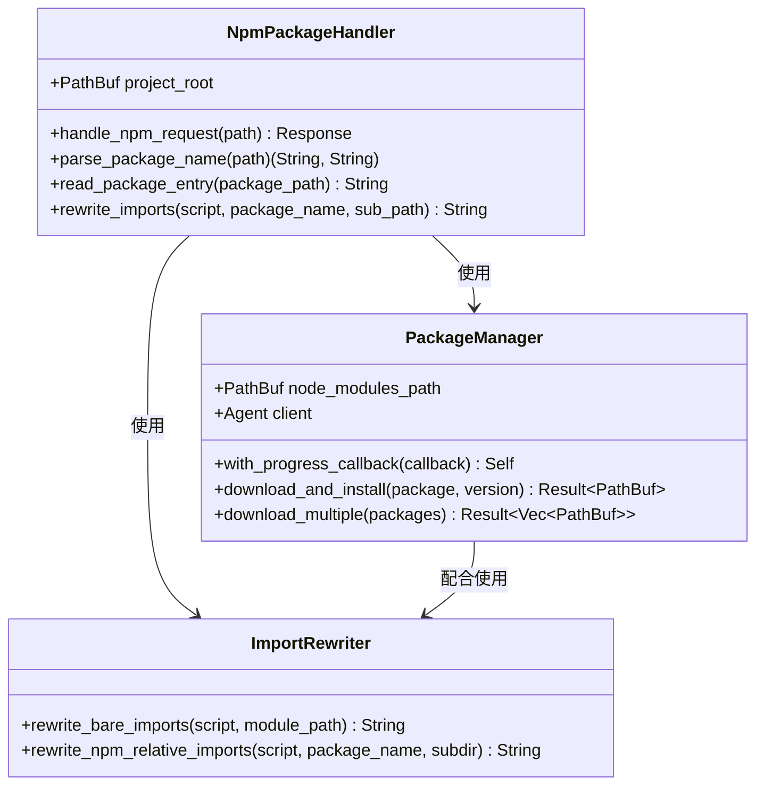

**图表来源**
- [routes.rs:1282-1388](file://crates/iris-jetcrab-cli/src/server/routes.rs#L1282-L1388)
- [routes.rs:1400-1454](file://crates/iris-jetcrab-cli/src/server/routes.rs#L1400-L1454)

#### npm 包处理工作流程

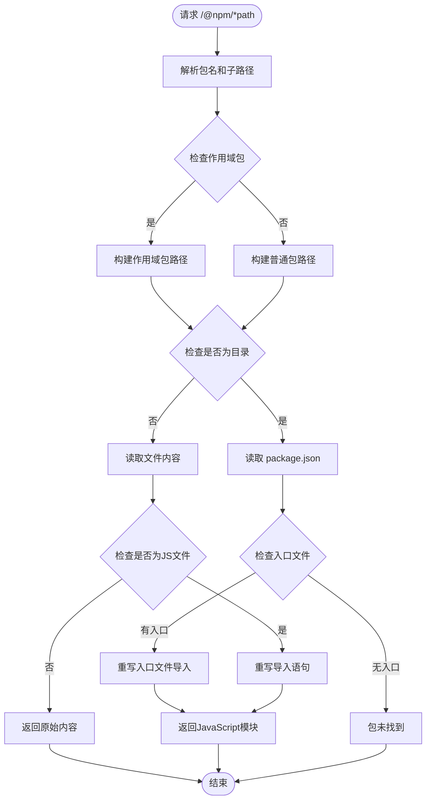

**图表来源**
- [routes.rs:1282-1388](file://crates/iris-jetcrab-cli/src/server/routes.rs#L1282-L1388)

**章节来源**
- [routes.rs:1278-1566](file://crates/iris-jetcrab-cli/src/server/routes.rs#L1278-L1566)

### 依赖扫描系统

**增强功能**：完整的依赖问题检测和自动修复系统，提供从扫描到修复的一站式解决方案。

#### 依赖扫描架构

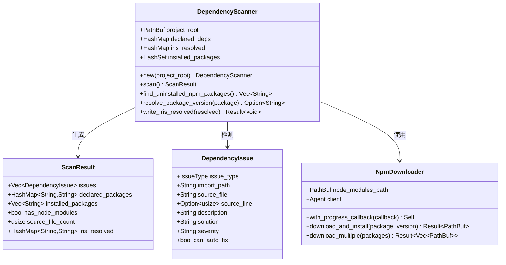

**图表来源**
- [dependency_scanner.rs:67-92](file://crates/iris-jetcrab-engine/src/dependency_scanner.rs#L67-L92)
- [dependency_scanner.rs:50-65](file://crates/iris-jetcrab-engine/src/dependency_scanner.rs#L50-L65)
- [dependency_scanner.rs:29-48](file://crates/iris-jetcrab-engine/src/dependency_scanner.rs#L29-L48)

#### 依赖扫描工作流程

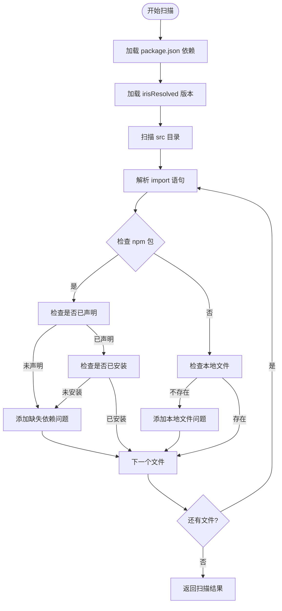

**图表来源**
- [dependency_scanner.rs:94-122](file://crates/iris-jetcrab-engine/src/dependency_scanner.rs#L94-L122)
- [dependency_scanner.rs:243-382](file://crates/iris-jetcrab-engine/src/dependency_scanner.rs#L243-L382)

**章节来源**
- [dependency_scanner.rs:1-819](file://crates/iris-jetcrab-engine/src/dependency_scanner.rs#L1-L819)

### 交互式解决界面

**增强功能**：提供可视化的依赖问题解决界面，用户可以通过点击按钮一键修复所有问题。

#### 解决界面架构

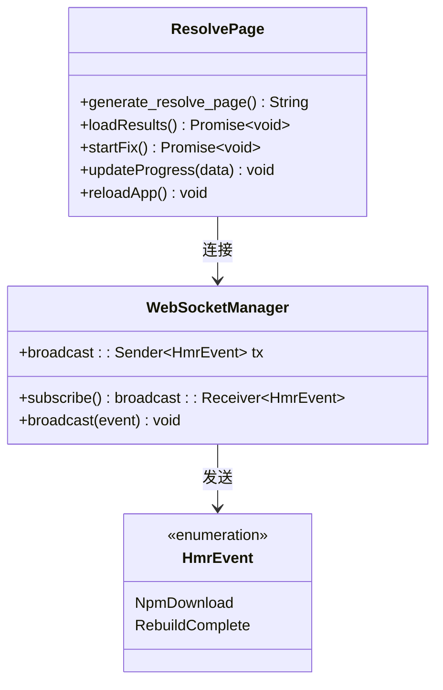

**图表来源**
- [routes.rs:566-571](file://crates/iris-jetcrab-cli/src/server/routes.rs#L566-L571)
- [hmr.rs:45-59](file://crates/iris-jetcrab-cli/src/server/hmr.rs#L45-L59)

#### 解决界面工作流程

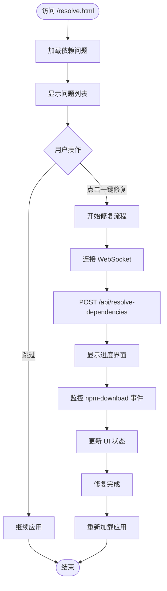

**图表来源**
- [routes.rs:1098-1131](file://crates/iris-jetcrab-cli/src/server/routes.rs#L1098-L1131)
- [routes.rs:551-680](file://crates/iris-jetcrab-cli/src/server/routes.rs#L551-L680)

**章节来源**
- [routes.rs:544-1253](file://crates/iris-jetcrab-cli/src/server/routes.rs#L544-L1253)

### npm 下载进度可视化系统

**增强功能**：实时显示 npm 包下载进度的完整系统，包括前端页面和 WebSocket 集成。

#### 进度可视化架构

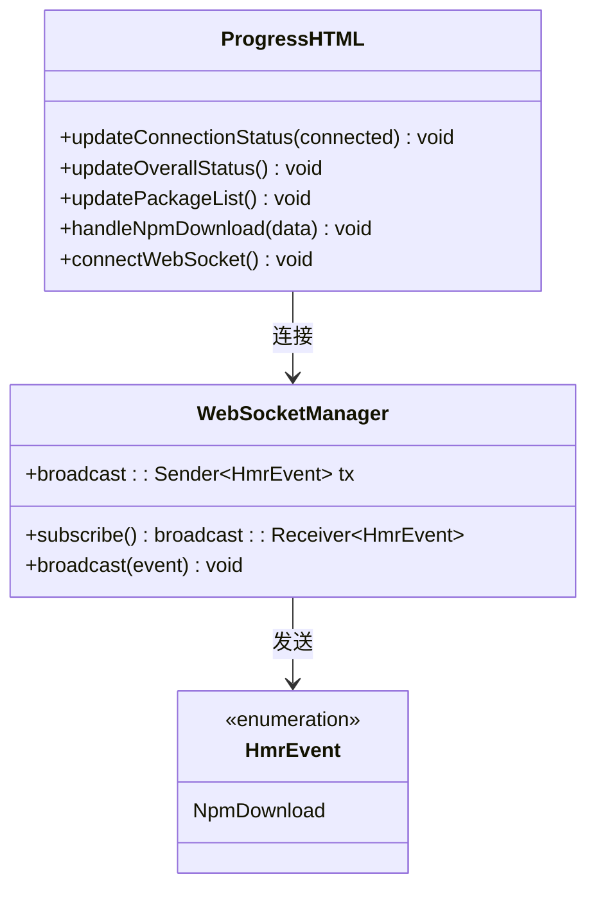

**图表来源**
- [progress.html:304-370](file://crates/iris-jetcrab-cli/src/server/progress.html#L304-L370)
- [hmr.rs:45-59](file://crates/iris-jetcrab-cli/src/server/hmr.rs#L45-L59)

#### 进度页面功能

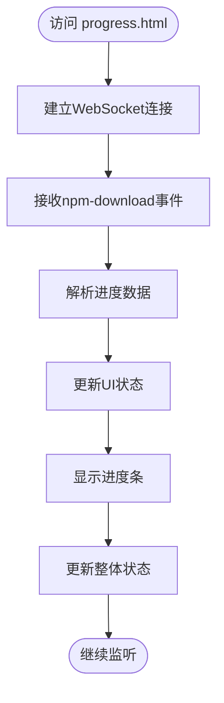

**图表来源**
- [progress.html:328-367](file://crates/iris-jetcrab-cli/src/server/progress.html#L328-L367)

**章节来源**
- [progress.html:1-371](file://crates/iris-jetcrab-cli/src/server/progress.html#L1-L371)

### 工具函数模块

工具函数模块提供了项目检测、文件查找和信息收集等辅助功能。**新增了增强的内容类型检测功能**。

#### 项目检测算法


**图表来源**
- [utils.rs:8-62](file://crates/iris-jetcrab-cli/src/utils.rs#L8-L62)

#### 内容类型检测增强

**增强功能**：增强的内容类型检测系统，支持更多文件类型的自动识别：

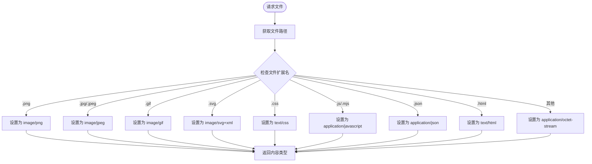

**图表来源**
- [routes.rs:1255-1276](file://crates/iris-jetcrab-cli/src/server/routes.rs#L1255-L1276)

**章节来源**
- [utils.rs:1-142](file://crates/iris-jetcrab-cli/src/utils.rs#L1-L142)

## 依赖关系分析

Iris JetCrab CLI 采用了精心设计的依赖关系，确保了模块间的松耦合和高内聚。**新增了完整的依赖管理相关依赖**。

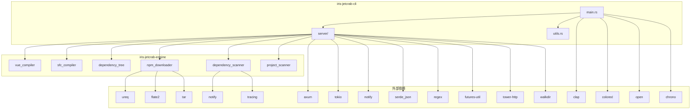

**图表来源**
- [Cargo.toml:17-55](file://crates/iris-jetcrab-cli/Cargo.toml#L17-L55)
- [Cargo.toml:13-76](file://crates/iris-jetcrab-engine/Cargo.toml#L13-L76)

### 核心依赖特性

| 依赖名称 | 版本 | 主要用途 | 关键特性 |
|----------|------|----------|----------|
| axum | 0.7 | HTTP 服务器框架 | 异步处理、WebSocket支持、中间件支持 |
| tokio | 1 | 异步运行时 | 全功能异步支持、多线程运行时 |
| clap | 4.4 | 命令行解析 | 类型安全、自动帮助、子命令支持 |
| notify | 6.1 | 文件系统监听 | 跨平台文件监控、事件驱动 |
| serde_json | 1.0 | JSON序列化 | 高性能序列化、反序列化 |
| ureq | 2.0 | HTTP客户端 | 轻量级HTTP请求、同步API |
| flate2 | 1.0 | Gzip解压缩 | 高性能压缩解压、流式处理 |
| tar | 0.4 | tar包处理 | 标准tar格式支持、流式解压 |
| regex | 1.0 | 正则表达式 | 高性能正则匹配、编译时优化 |
| tracing | 0.1 | 日志追踪 | 结构化日志记录、性能分析 |
| futures-util | 0.3 | 异步工具 | 异步流处理、组合器 |
| tower-http | 0.5 | HTTP中间件 | CORS支持、文件服务 |
| walkdir | 2.4 | 目录遍历 | 递归目录扫描、性能优化 |
| colored | 2.1 | 控制台颜色 | ANSI颜色输出、跨平台支持 |
| open | 5.0 | 系统打开 | 自动打开浏览器、跨平台支持 |
| chrono | 0.4 | 时间处理 | 高精度时间、时区支持 |

**章节来源**
- [Cargo.toml:17-55](file://crates/iris-jetcrab-cli/Cargo.toml#L17-L55)
- [Cargo.toml:13-76](file://crates/iris-jetcrab-engine/Cargo.toml#L13-L76)

## 性能考虑

Iris JetCrab CLI 在设计时充分考虑了性能优化，采用了多种策略来提升开发体验。**新增了编译缓存管理、模块解析和路由系统的性能优化**。

### 编译缓存策略
- **智能模块解析**：实现多种路径匹配策略，包括完全匹配、文件名匹配、路径后缀匹配、/@vue/ 前缀匹配、扩展名匹配和目录索引文件匹配
- **首次编译优化**：首次请求时编译整个项目，后续请求使用缓存
- **智能失效机制**：检测依赖变化时自动重新编译
- **内存管理**：使用 Arc 和 Mutex 确保线程安全的缓存访问

### 异步处理优化
- **非阻塞 I/O**：所有文件操作和网络请求都是异步的
- **并发处理**：多个请求可以并行处理，充分利用多核 CPU
- **资源池管理**：合理管理数据库连接和文件句柄

### 内存使用优化
- **增量更新**：HMR 系统只处理变化的模块
- **缓存淘汰**：实现 LRU 缓存策略防止内存泄漏
- **零拷贝优化**：在可能的情况下使用零拷贝技术

### WebSocket 优化
- **事件广播**：使用广播通道高效分发事件
- **连接管理**：自动重连机制确保连接稳定性
- **进度压缩**：npm 下载进度事件的最小化传输

### 依赖扫描优化
- **增量扫描**：只扫描发生变化的文件
- **并行处理**：多个 npm 包下载并行进行
- **缓存机制**：版本解析结果缓存避免重复查询

### 模块解析优化
- **多策略匹配**：支持多种路径格式和解析策略
- **路径规范化**：处理不同操作系统路径分隔符
- **导入重写优化**：高效的裸模块导入重写算法

### 内容类型检测优化
- **静态映射**：使用静态数组进行快速文件类型判断
- **扩展名预处理**：减少字符串处理开销
- **缓存机制**：避免重复的文件类型计算

## 故障排除指南

### 常见问题及解决方案

#### 1. 项目检测失败
**问题症状**：CLI 报告不是 Vue 项目
**可能原因**：
- 缺少 package.json 文件
- 项目根目录不正确
- 缺少 Vue 相关依赖

**解决步骤**：
1. 确认项目根目录包含 package.json
2. 检查 package.json 中是否包含 Vue 依赖
3. 验证 src 目录结构

#### 2. 编译错误
**问题症状**：编译过程中出现错误
**可能原因**：
- 语法错误
- 缺少依赖
- 配置文件错误

**解决步骤**：
1. 检查控制台错误信息
2. 验证 TypeScript/JavaScript 语法
3. 确认所有依赖已安装

#### 3. HMR 不工作
**问题症状**：文件修改后页面不刷新
**可能原因**：
- 文件监听器未启动
- WebSocket 连接失败
- 防抖机制导致延迟

**解决步骤**：
1. 检查 HMR 配置
2. 验证防火墙设置
3. 查看浏览器控制台错误

#### 4. 依赖扫描失败
**问题症状**：/api/dependency-issues 返回错误
**可能原因**：
- 项目结构不符合预期
- 权限问题无法读取文件
- 网络问题无法访问 npm registry

**解决步骤**：
1. 检查项目根目录权限
2. 验证 package.json 格式
3. 确认网络连接正常

#### 5. 自动修复失败
**问题症状**：/api/resolve-dependencies 无法下载 npm 包
**可能原因**：
- npm registry 访问受限
- 磁盘空间不足
- 权限问题无法写入 node_modules

**解决步骤**：
1. 检查网络连接和代理设置
2. 验证磁盘空间和权限
3. 查看 WebSocket 事件日志

#### 6. npm 包处理失败
**问题症状**：/@npm/* 路由返回错误
**可能原因**：
- 包名解析错误
- node_modules 路径问题
- 导入重写失败

**解决步骤**：
1. 检查包名格式（支持作用域包）
2. 验证 node_modules 目录结构
3. 查看导入重写日志

#### 7. 模块解析失败
**问题症状**：/src/* 路由找不到模块
**可能原因**：
- 路径格式不正确
- 模块不存在
- 缓存失效

**解决步骤**：
1. 检查模块路径格式
2. 验证模块文件存在
3. 清除编译缓存重新编译

#### 8. npm 下载进度不显示
**问题症状**：progress.html 页面空白或无进度
**可能原因**：
- WebSocket 连接失败
- npm 下载器未正确配置
- 进度回调未触发

**解决步骤**：
1. 检查浏览器控制台 WebSocket 错误
2. 验证 npm 包下载器配置
3. 确认进度回调函数正确设置

**章节来源**
- [utils.rs:118-141](file://crates/iris-jetcrab-cli/src/utils.rs#L118-L141)
- [hmr.rs:138-222](file://crates/iris-jetcrab-cli/src/server/hmr.rs#L138-L222)

## 结论

Iris JetCrab CLI 代表了现代 Vue 开发工具的发展方向，通过"运行时按需编译"架构实现了高性能和易用性的完美平衡。**最新版本在编译缓存管理、模块解析和路由系统方面的重大改进，提供了更智能的模块处理、更流畅的开发体验和更完善的依赖管理功能**。

### 主要优势

1. **架构清晰**：编译逻辑与服务器功能分离，职责明确
2. **性能优异**：智能缓存和异步处理确保快速响应
3. **开发友好**：实时热更新、依赖问题可视化和一键修复
4. **扩展性强**：模块化设计便于功能扩展
5. **用户体验优秀**：完整的进度反馈和实时更新
6. **智能解析**：支持多种路径格式和解析策略
7. **npm 集成**：完整的 npm 包处理和下载系统

### 改进功能价值

1. **增强的编译缓存管理**：多种模块解析策略提高了模块查找的准确性和效率
2. **改进的模块解析系统**：支持目录索引文件和多种路径格式，提升了开发灵活性
3. **优化的路由系统**：新增的 npm 包处理器和导入重写机制完善了模块系统
4. **优化的开发服务器功能**：集成的 HMR 和依赖管理功能提供了更流畅的开发体验

### 未来发展方向

1. **智能依赖建议**：基于项目类型和使用模式推荐依赖版本
2. **依赖安全扫描**：集成安全漏洞检测和修复建议
3. **增量编译优化**：实现更精确的模块级编译
4. **性能分析**：集成编译性能监控工具
5. **IDE 集成**：提供更好的 IDE 开发体验
6. **云开发**：支持远程开发环境

该架构为 Vue 生态系统提供了一个强大而灵活的开发工具，为未来的进一步发展奠定了坚实的基础。**新增的功能使其成为更加完善的开发工具链的重要组成部分，显著提升了开发效率和用户体验**。