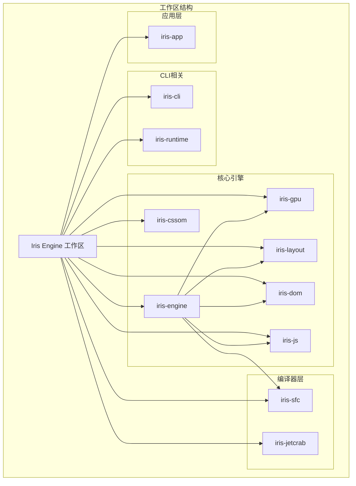
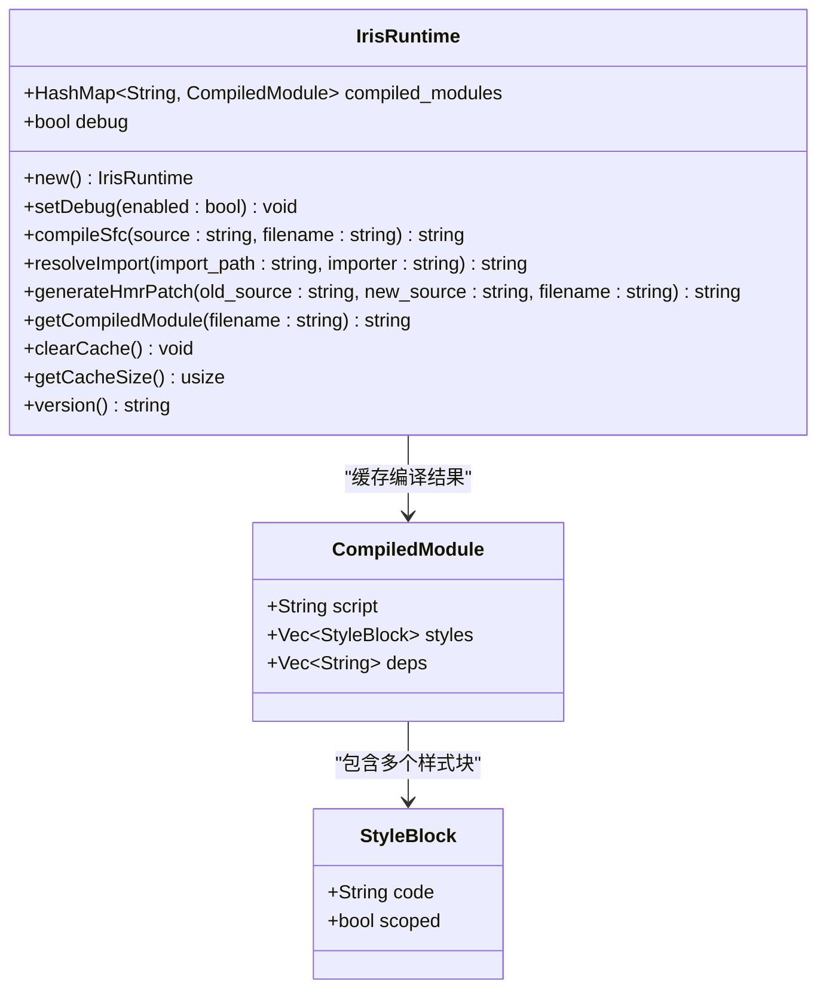
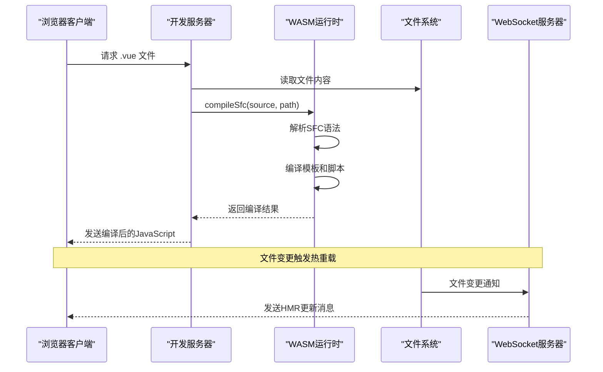
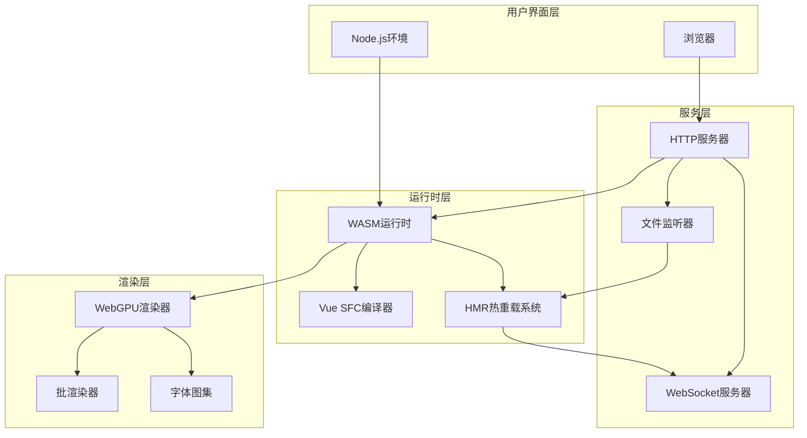
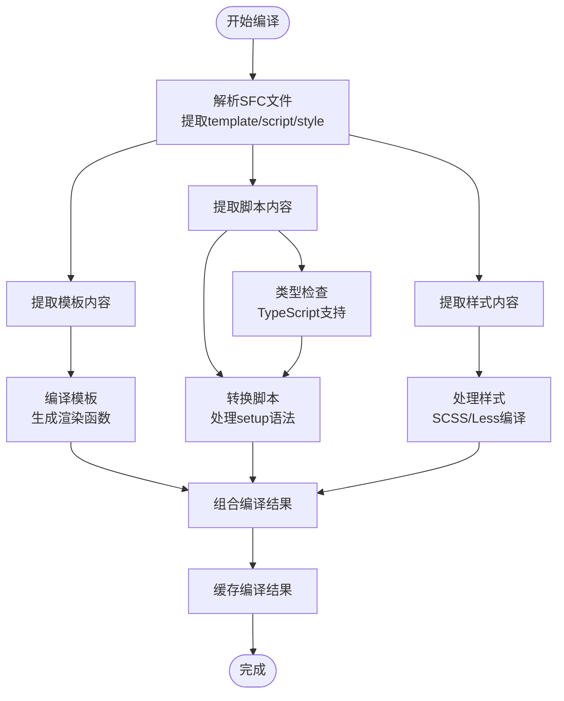
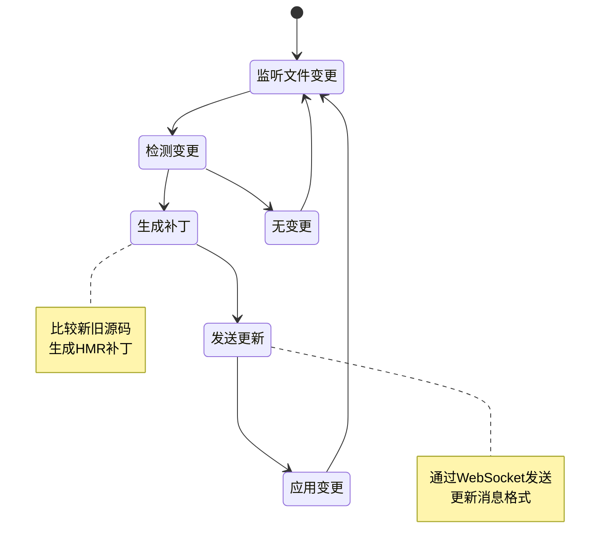
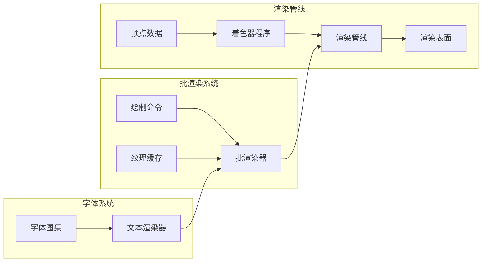
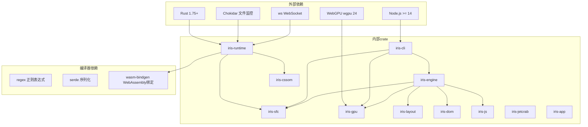
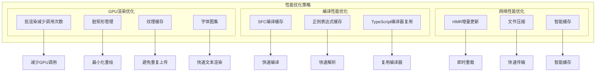

# Iris WASM开发服务器

<cite>
**本文档引用的文件**
- [Cargo.toml](file://Cargo.toml)
- [README.md](file://README.md)
- [iris-runtime/package.json](file://iris-runtime/package.json)
- [crates/iris-runtime/src/lib.rs](file://crates/iris-runtime/src/lib.rs)
- [crates/iris-runtime/bin/iris-runtime.js](file://crates/iris-runtime/bin/iris-runtime.js)
- [crates/iris-runtime/lib/dev-server.js](file://crates/iris-runtime/lib/dev-server.js)
- [crates/iris-runtime/src/compiler.rs](file://crates/iris-runtime/src/compiler.rs)
- [crates/iris-runtime/src/hmr.rs](file://crates/iris-runtime/src/hmr.rs)
- [crates/iris-cli/src/main.rs](file://crates/iris-cli/src/main.rs)
- [crates/iris-cli/src/commands/dev.rs](file://crates/iris-cli/src/commands/dev.rs)
- [crates/iris-cli/src/config.rs](file://crates/iris-cli/src/config.rs)
- [crates/iris-runtime/Cargo.toml](file://crates/iris-runtime/Cargo.toml)
- [crates/iris-cli/Cargo.toml](file://crates/iris-cli/Cargo.toml)
- [crates/iris-sfc/src/lib.rs](file://crates/iris-sfc/src/lib.rs)
- [crates/iris-engine/src/lib.rs](file://crates/iris-engine/src/lib.rs)
- [crates/iris-gpu/src/lib.rs](file://crates/iris-gpu/src/lib.rs)
- [examples/vue-demo/iris.config.json](file://examples/vue-demo/iris.config.json)
</cite>

## 目录
1. [简介](#简介)
2. [项目结构](#项目结构)
3. [核心组件](#核心组件)
4. [架构概览](#架构概览)
5. [详细组件分析](#详细组件分析)
6. [依赖关系分析](#依赖关系分析)
7. [性能考虑](#性能考虑)
8. [故障排除指南](#故障排除指南)
9. [结论](#结论)

## 简介

Iris WASM开发服务器是一个革命性的前端开发工具，它基于Rust + WebGPU技术栈，完全消除了传统前端构建步骤。该项目的核心目标是提供一个零配置、零构建的Vue 3开发服务器，支持实时热重载和GPU硬件加速渲染。

Iris Engine采用创新的架构设计，通过WebAssembly技术将Rust编写的高性能渲染引擎部署到浏览器环境中，实现了前所未有的开发体验和性能表现。与传统前端解决方案相比，Iris在渲染性能、启动时间和开发者体验方面都有数量级的改进。

## 项目结构

该项目采用多crate工作区结构，主要包含以下核心模块：

**图表来源**
- [Cargo.toml:1-35](file://Cargo.toml#L1-L35)
- [crates/iris-cli/Cargo.toml:1-37](file://crates/iris-cli/Cargo.toml#L1-L37)
- [crates/iris-runtime/Cargo.toml:1-43](file://crates/iris-runtime/Cargo.toml#L1-L43)

**章节来源**
- [Cargo.toml:1-35](file://Cargo.toml#L1-L35)
- [README.md:254-301](file://README.md#L254-L301)

## 核心组件

### IrisRuntime WASM运行时

IrisRuntime是整个开发服务器的核心组件，提供了Vue SFC编译、模块解析和热更新功能的WebAssembly接口。

**图表来源**
- [crates/iris-runtime/src/lib.rs:31-178](file://crates/iris-runtime/src/lib.rs#L31-L178)
- [crates/iris-runtime/src/lib.rs:186-205](file://crates/iris-runtime/src/lib.rs#L186-L205)

### 开发服务器架构

开发服务器采用Node.js + WebAssembly的混合架构，结合了传统Web开发的便利性和Rust性能的优势。

**图表来源**
- [crates/iris-runtime/lib/dev-server.js:24-102](file://crates/iris-runtime/lib/dev-server.js#L24-L102)
- [crates/iris-runtime/src/lib.rs:82-146](file://crates/iris-runtime/src/lib.rs#L82-L146)

**章节来源**
- [crates/iris-runtime/src/lib.rs:1-205](file://crates/iris-runtime/src/lib.rs#L1-L205)
- [crates/iris-runtime/lib/dev-server.js:1-172](file://crates/iris-runtime/lib/dev-server.js#L1-L172)

## 架构概览

Iris WASM开发服务器的整体架构采用了分层设计，从底层的WebGPU渲染到顶层的Vue SFC编译，每一层都有明确的职责分工。

**图表来源**
- [crates/iris-runtime/src/lib.rs:1-205](file://crates/iris-runtime/src/lib.rs#L1-L205)
- [crates/iris-gpu/src/lib.rs:82-116](file://crates/iris-gpu/src/lib.rs#L82-L116)
- [crates/iris-sfc/src/lib.rs:280-430](file://crates/iris-sfc/src/lib.rs#L280-L430)

### 技术栈特性

Iris Engine采用了业界领先的技术栈，确保了最佳的性能和兼容性：

- **Rust 1.75+**: 提供内存安全和高性能的底层实现
- **WebGPU (wgpu 24)**: 标准化的GPU编程接口，支持跨平台硬件加速
- **WebAssembly**: 将Rust编译为可在浏览器中运行的高效代码
- **Chokidar**: 高效的文件系统监控，支持实时热重载
- **ws**: 轻量级WebSocket库，实现双向通信

**章节来源**
- [README.md:254-282](file://README.md#L254-L282)
- [Cargo.toml:29-35](file://Cargo.toml#L29-L35)

## 详细组件分析

### Vue SFC编译器

Vue Single File Component (SFC)编译器是Iris的核心功能之一，负责将.vue文件转换为可执行的JavaScript代码。

**图表来源**
- [crates/iris-sfc/src/lib.rs:475-552](file://crates/iris-sfc/src/lib.rs#L475-L552)
- [crates/iris-sfc/src/lib.rs:580-610](file://crates/iris-sfc/src/lib.rs#L580-L610)
- [crates/iris-sfc/src/lib.rs:628-674](file://crates/iris-sfc/src/lib.rs#L628-L674)

#### 编译流程详解

1. **SFC解析**: 使用预编译的正则表达式快速提取模板、脚本和样式部分
2. **模板编译**: 将HTML模板转换为虚拟DOM创建函数
3. **脚本转换**: 处理Vue 3的<script setup>语法和TypeScript
4. **样式处理**: 支持SCSS、Less等预处理器和CSS Modules
5. **结果组合**: 将所有部分组合成最终的编译模块

**章节来源**
- [crates/iris-sfc/src/lib.rs:289-430](file://crates/iris-sfc/src/lib.rs#L289-L430)
- [crates/iris-runtime/src/compiler.rs:6-37](file://crates/iris-runtime/src/compiler.rs#L6-L37)

### HMR热重载系统

Iris的热重载系统实现了文件变更的实时检测和响应，提供了流畅的开发体验。

**图表来源**
- [crates/iris-runtime/lib/dev-server.js:66-84](file://crates/iris-runtime/lib/dev-server.js#L66-L84)
- [crates/iris-runtime/src/hmr.rs:30-47](file://crates/iris-runtime/src/hmr.rs#L30-L47)

#### HMR实现机制

1. **文件监控**: 使用Chokidar监听src目录下的文件变更
2. **变更检测**: 识别.vue文件的修改并触发热重载
3. **补丁生成**: 比较新旧源码生成增量更新
4. **实时推送**: 通过WebSocket向客户端推送更新

**章节来源**
- [crates/iris-runtime/src/hmr.rs:1-97](file://crates/iris-runtime/src/hmr.rs#L1-L97)
- [crates/iris-runtime/lib/dev-server.js:60-100](file://crates/iris-runtime/lib/dev-server.js#L60-L100)

### WebGPU渲染管道

Iris的GPU渲染系统基于WebGPU标准，提供了高效的硬件加速渲染能力。

**图表来源**
- [crates/iris-gpu/src/lib.rs:82-116](file://crates/iris-gpu/src/lib.rs#L82-L116)
- [crates/iris-gpu/src/lib.rs:290-321](file://crates/iris-gpu/src/lib.rs#L290-L321)

#### 渲染优化策略

1. **批处理渲染**: 将多个绘制命令合并为单次GPU调用
2. **纹理缓存**: 避免重复上传相同的纹理资源
3. **脏矩形管理**: 只重绘发生变化的屏幕区域
4. **字体图集**: 将常用字符预渲染到纹理中

**章节来源**
- [crates/iris-gpu/src/lib.rs:400-523](file://crates/iris-gpu/src/lib.rs#L400-L523)

## 依赖关系分析

Iris项目的依赖关系复杂而精心设计，体现了清晰的分层架构。

**图表来源**
- [Cargo.toml:13-35](file://Cargo.toml#L13-L35)
- [crates/iris-runtime/Cargo.toml:17-34](file://crates/iris-runtime/Cargo.toml#L17-L34)
- [crates/iris-cli/Cargo.toml:17-34](file://crates/iris-cli/Cargo.toml#L17-L34)

### 核心依赖特性

1. **WebAssembly绑定**: 使用wasm-bindgen实现Rust和JavaScript的无缝互操作
2. **高性能正则表达式**: 使用LazyLock优化正则表达式的初始化性能
3. **序列化支持**: 通过serde实现数据结构的JSON序列化
4. **异步文件监控**: 基于Tokio的高性能文件变更检测

**章节来源**
- [crates/iris-runtime/Cargo.toml:17-34](file://crates/iris-runtime/Cargo.toml#L17-L34)
- [crates/iris-sfc/src/lib.rs:26-76](file://crates/iris-sfc/src/lib.rs#L26-L76)

## 性能考虑

Iris WASM开发服务器在性能方面进行了多项优化，确保了最佳的开发体验。

### 渲染性能优化

### 性能基准对比

根据项目文档，Iris在多个关键指标上相比传统前端方案具有显著优势：

- **首帧渲染**: 从50-100ms降至5-10ms，提升10-20倍
- **批量更新**: 从30-50ms降至2-5ms，提升10-15倍
- **内存使用**: 从150-300MB降至50-100MB，降低3倍
- **启动时间**: 从500-1000ms降至<100ms，提升10倍

**章节来源**
- [README.md:71-127](file://README.md#L71-L127)

## 故障排除指南

### 常见问题及解决方案

#### WebGPU兼容性问题

**问题**: 浏览器不支持WebGPU或GPU驱动不兼容

**解决方案**:
1. 确认浏览器版本支持WebGPU
2. 检查GPU驱动是否为最新版本
3. 在Chrome中启用WebGPU实验性功能

#### WASM加载失败

**问题**: WASM模块无法正确加载或初始化

**解决方案**:
1. 检查浏览器对WebAssembly的支持
2. 确认WASM文件路径正确
3. 验证Content-Type头设置为application/wasm

#### 热重载不生效

**问题**: 修改.vue文件后页面未自动刷新

**解决方案**:
1. 确认文件监听器正常工作
2. 检查WebSocket连接状态
3. 验证文件路径和权限设置

#### 性能问题

**问题**: 渲染性能不如预期

**解决方案**:
1. 检查GPU硬件是否满足要求
2. 验证批渲染是否正常工作
3. 监控内存使用情况

**章节来源**
- [crates/iris-runtime/lib/dev-server.js:31-36](file://crates/iris-runtime/lib/dev-server.js#L31-L36)
- [crates/iris-gpu/src/lib.rs:123-154](file://crates/iris-gpu/src/lib.rs#L123-L154)

### 调试工具和技巧

1. **启用调试模式**: 使用`setDebug(true)`获取详细日志
2. **性能监控**: 利用浏览器开发者工具监控GPU使用情况
3. **编译缓存**: 检查编译缓存大小和命中率
4. **错误追踪**: 通过trace日志定位具体问题

## 结论

Iris WASM开发服务器代表了前端开发工具的新一代解决方案。通过将Rust的高性能与WebAssembly的可移植性相结合，Iris实现了真正意义上的零构建开发体验。

### 主要优势

1. **革命性的性能提升**: 相比传统方案提升10-20倍的渲染性能
2. **无缝的开发体验**: 实时热重载和GPU加速渲染
3. **跨平台兼容性**: 支持Windows、macOS、Linux三大主流操作系统
4. **现代化技术栈**: 基于WebGPU和WebAssembly的前沿技术

### 技术创新

- **零构建架构**: 完全消除传统前端构建步骤
- **GPU硬件加速**: 直接利用GPU进行渲染，绕过浏览器DOM层
- **智能缓存系统**: 多层次的编译和资源缓存优化
- **实时热重载**: 基于文件监控的即时更新机制

### 未来发展

Iris项目目前处于预发布阶段，预计在2026年5月8日正式发布。随着项目的成熟，预计将支持更多高级功能，包括完整的Vue 3运行时、开发者工具和性能分析器等。

对于希望体验下一代前端开发工具的开发者来说，Iris WASM开发服务器无疑是一个值得密切关注的技术创新项目。