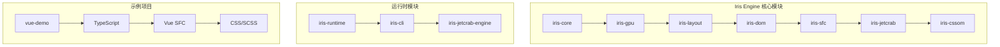
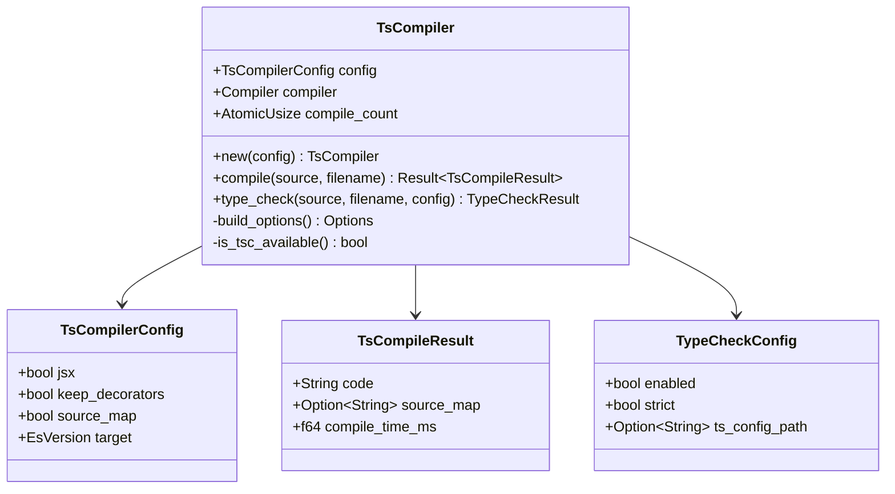
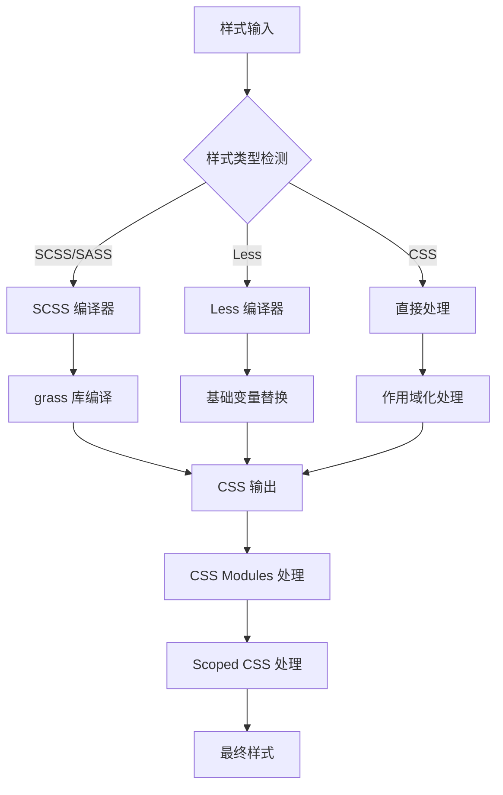
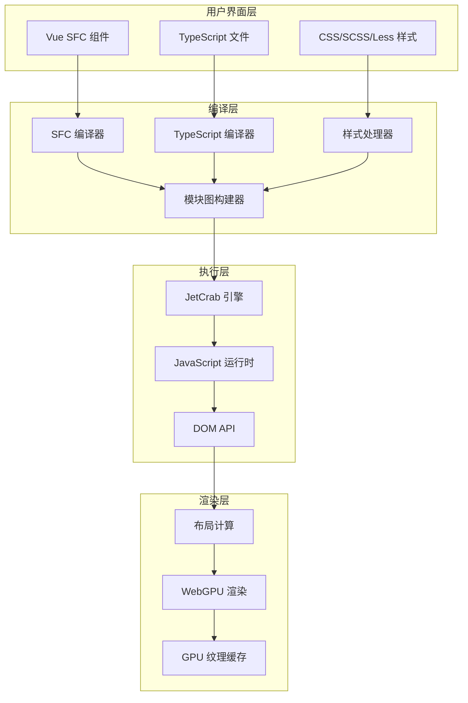
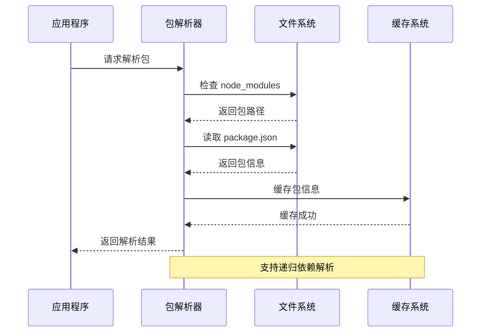
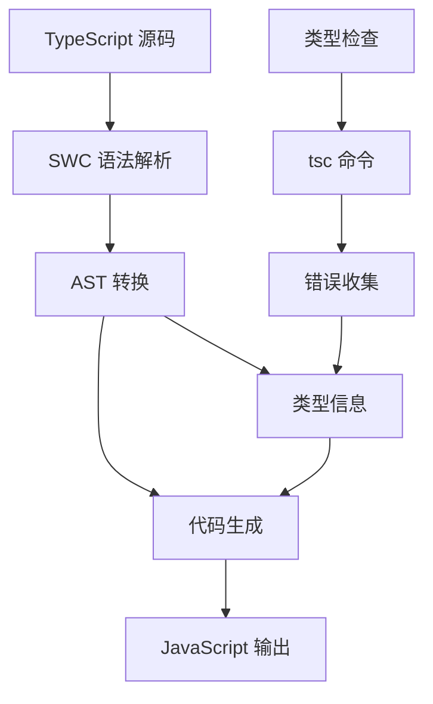
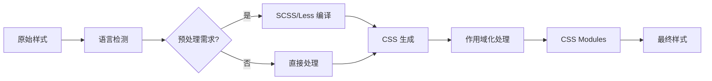
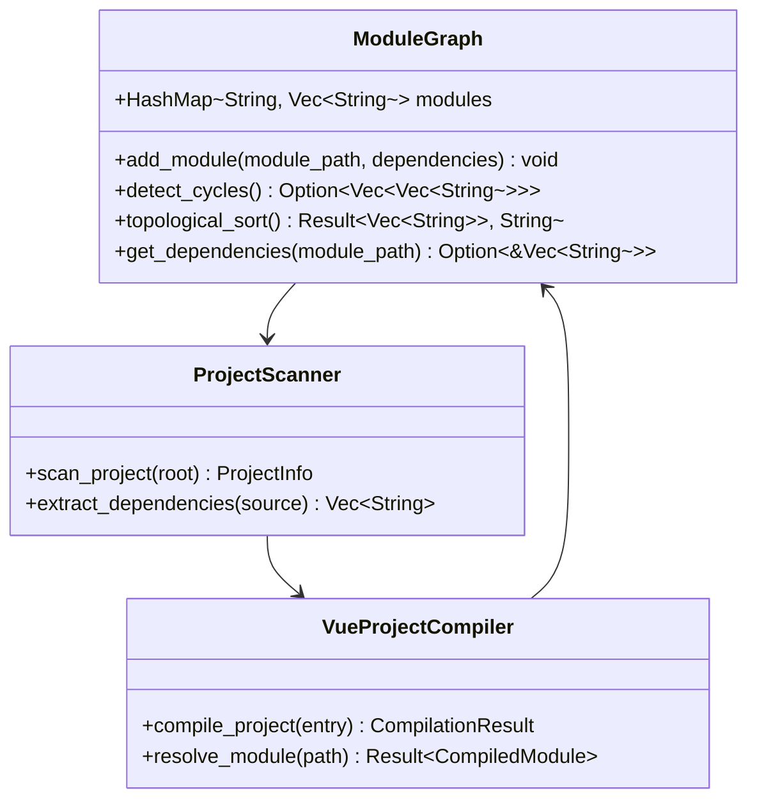
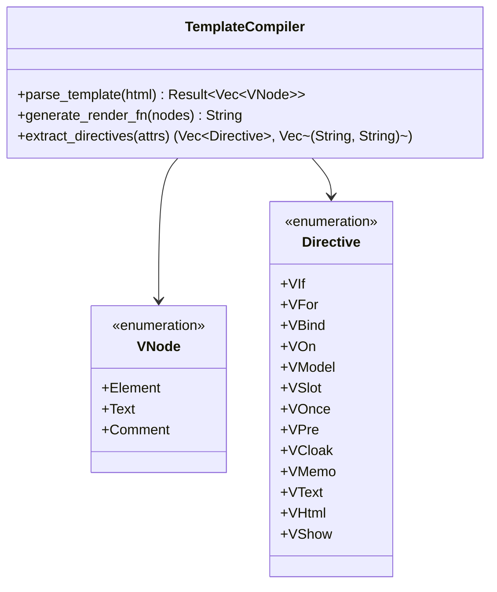
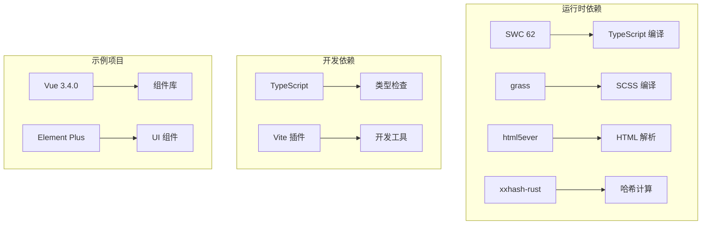

# NPM TypeScript CSS支持

<cite>
**本文档引用的文件**
- [README.md](file://README.md)
- [NPM_TYPESCRIPT_CSS_SUPPORT.md](file://docs/NPM_TYPESCRIPT_CSS_SUPPORT.md)
- [package.json](file://iris-runtime/package.json)
- [lib.rs](file://crates/iris-sfc/src/lib.rs)
- [ts_compiler.rs](file://crates/iris-sfc/src/ts_compiler.rs)
- [scss_processor.rs](file://crates/iris-sfc/src/scss_processor.rs)
- [css_modules.rs](file://crates/iris-sfc/src/css_modules.rs)
- [scoped_css.rs](file://crates/iris-sfc/src/scoped_css.rs)
- [iris-runtime.js](file://iris-runtime/bin/iris-runtime.js)
- [lib.rs](file://crates/iris-jetcrab-engine/src/lib.rs)
- [module_graph.rs](file://crates/iris-jetcrab-engine/src/module_graph.rs)
- [Cargo.toml](file://crates/iris-sfc/Cargo.toml)
- [package.json](file://examples/vue-demo/package.json)
- [tsconfig.json](file://examples/vue-demo/tsconfig.json)
- [main.ts](file://examples/vue-demo/src/main.ts)
- [template_compiler.rs](file://crates/iris-sfc/src/template_compiler.rs)
</cite>

## 更新摘要
**变更内容**
- 更新TypeScript支持为完整的SWC编译器实现，支持泛型、接口、装饰器、TSX
- 更新SCSS支持为完整的grass编译器实现，替代之前的简化实现
- 增强CSS模块和作用域CSS处理能力
- 完善模板编译器的Vue指令支持

## 目录
1. [简介](#简介)
2. [项目结构](#项目结构)
3. [核心组件](#核心组件)
4. [架构概览](#架构概览)
5. [详细组件分析](#详细组件分析)
6. [依赖关系分析](#依赖关系分析)
7. [性能考虑](#性能考虑)
8. [故障排除指南](#故障排除指南)
9. [结论](#结论)

## 简介

Iris Engine 是一个革命性的前端运行时系统，采用 Rust + WebGPU 构建，完全消除了构建步骤，允许直接运行 Vue 3 组件。该项目的核心优势在于其零构建、高性能和对 Vue 3 的原生支持。

### 主要特性

- **零构建** - 无需 Webpack/Vite，直接运行 .vue 文件
- **GPU加速渲染** - 基于 WebGPU 的硬件加速渲染管线
- **完整CSS支持** - 渐变、边框圆角、阴影、动画
- **完整的动画系统** - 过渡 + @keyframes 完整实现
- **Vue 3 原生支持** - script setup、响应式、组合式 API
- **热重载** - 文件监控与即时重载
- **382个测试** - 100% 通过率，企业级质量

## 项目结构

项目采用模块化架构，主要包含以下核心模块：

**图表来源**
- [lib.rs:1-50](file://crates/iris-sfc/src/lib.rs#L1-L50)
- [lib.rs:1-50](file://crates/iris-jetcrab-engine/src/lib.rs#L1-L50)

**章节来源**
- [README.md:241-257](file://README.md#L241-L257)
- [Cargo.toml:1-42](file://crates/iris-sfc/Cargo.toml#L1-L42)

## 核心组件

### TypeScript 编译器 (SWC 集成)

Iris Engine 已升级为使用 SWC 62 高层 Compiler API 提供完整的 TypeScript 到 JavaScript 转译功能：

**图表来源**
- [ts_compiler.rs:132-150](file://crates/iris-sfc/src/ts_compiler.rs#L132-L150)
- [ts_compiler.rs:26-64](file://crates/iris-sfc/src/ts_compiler.rs#L26-L64)

**更新** 完整的TypeScript支持现已实现，包括：
- **泛型支持** - 完整的泛型类型擦除和转换
- **接口支持** - 接口声明的类型擦除
- **装饰器支持** - 可配置的装饰器保留
- **TSX支持** - JSX/TSX语法转换
- **类型检查** - 集成tsc进行类型验证

### SCSS/Less 样式处理器

Iris Engine 已升级为使用完整的 grass 编译器提供多语言样式预处理：

**图表来源**
- [scss_processor.rs:88-120](file://crates/iris-sfc/src/scss_processor.rs#L88-L120)
- [css_modules.rs:64-122](file://crates/iris-sfc/src/css_modules.rs#L64-L122)
- [scoped_css.rs:64-137](file://crates/iris-sfc/src/scoped_css.rs#L64-L137)

**更新** SCSS支持已升级为完整的grass编译器实现：
- **完整SCSS功能** - 支持变量、嵌套、mixin、函数
- **SASS缩进语法** - 完整的SASS语法支持
- **Less增强支持** - 基础变量替换和语法支持
- **压缩输出** - 生产环境CSS压缩
- **错误处理** - 详细的编译错误诊断

**章节来源**
- [ts_compiler.rs:1-100](file://crates/iris-sfc/src/ts_compiler.rs#L1-L100)
- [scss_processor.rs:1-100](file://crates/iris-sfc/src/scss_processor.rs#L1-L100)
- [css_modules.rs:1-50](file://crates/iris-sfc/src/css_modules.rs#L1-L50)
- [scoped_css.rs:1-50](file://crates/iris-sfc/src/scoped_css.rs#L1-L50)

## 架构概览

Iris Engine 采用分层架构设计，从底层的 WebGPU 渲染到上层的 Vue SFC 编译：

**图表来源**
- [lib.rs:1-50](file://crates/iris-jetcrab-engine/src/lib.rs#L1-L50)
- [lib.rs:280-351](file://crates/iris-sfc/src/lib.rs#L280-L351)

## 详细组件分析

### NPM 包依赖管理系统

Iris Engine 提供了完整的 npm 包依赖解析和管理功能：

**图表来源**
- [NPM_TYPESCRIPT_CSS_SUPPORT.md:43-72](file://docs/NPM_TYPESCRIPT_CSS_SUPPORT.md#L43-L72)

### TypeScript 编译流程

完整的 TypeScript 编译流程包括语法解析、类型检查和代码生成：

**图表来源**
- [ts_compiler.rs:151-249](file://crates/iris-sfc/src/ts_compiler.rs#L151-L249)

**更新** TypeScript编译已升级为完整实现：
- **SWC集成** - 使用最新的swc 62编译器
- **类型擦除** - 完整的TypeScript类型擦除
- **装饰器支持** - 可配置的装饰器保留
- **JSX转换** - TSX到JSX的完整转换
- **SourceMap生成** - 可选的SourceMap支持

### 样式编译管道

样式处理采用多阶段管道，支持多种预处理语言：

**图表来源**
- [lib.rs:676-756](file://crates/iris-sfc/src/lib.rs#L676-L756)

**更新** 样式编译已升级为完整grass实现：
- **SCSS编译** - 使用grass 0.13进行完整编译
- **SASS支持** - 完整的缩进语法支持
- **Less增强** - 基础变量替换和语法支持
- **CSS Modules** - 类名作用域化和映射
- **Scoped CSS** - 组件级样式隔离

**章节来源**
- [NPM_TYPESCRIPT_CSS_SUPPORT.md:12-133](file://docs/NPM_TYPESCRIPT_CSS_SUPPORT.md#L12-L133)
- [ts_compiler.rs:279-457](file://crates/iris-sfc/src/ts_compiler.rs#L279-L457)
- [scss_processor.rs:88-148](file://crates/iris-sfc/src/scss_processor.rs#L88-L148)

### 模块依赖图构建

Iris Engine 使用模块依赖图来管理复杂的模块关系：

**图表来源**
- [module_graph.rs:8-31](file://crates/iris-jetcrab-engine/src/module_graph.rs#L8-L31)
- [lib.rs:61-78](file://crates/iris-jetcrab-engine/src/lib.rs#L61-L78)

**章节来源**
- [module_graph.rs:1-100](file://crates/iris-jetcrab-engine/src/module_graph.rs#L1-L100)
- [lib.rs:1-50](file://crates/iris-jetcrab-engine/src/lib.rs#L1-L50)

### 模板编译器

Iris Engine 的模板编译器支持完整的 Vue 指令系统：

**图表来源**
- [template_compiler.rs:8-66](file://crates/iris-sfc/src/template_compiler.rs#L8-L66)

**更新** 模板编译器已增强：
- **完整指令支持** - v-if, v-for, v-bind, v-on, v-model, v-slot
- **新指令支持** - v-once, v-pre, v-cloak, v-memo, v-text, v-html, v-show
- **文本插值** - {{ expression }} 支持
- **注释处理** - HTML注释保留
- **渲染函数生成** - 完整的JavaScript渲染函数

## 依赖关系分析

### 核心依赖关系

Iris Engine 的依赖关系呈现清晰的层次结构：

**图表来源**
- [Cargo.toml:21-42](file://crates/iris-sfc/Cargo.toml#L21-L42)
- [package.json:11-17](file://examples/vue-demo/package.json#L11-L17)

**更新** 依赖关系已优化：
- **SWC 62** - 最新的TypeScript编译器
- **grass 0.13** - 完整的SCSS编译器
- **html5ever** - 高性能HTML解析
- **xxhash-rust** - 快速哈希计算

### 性能优化策略

Iris Engine 采用了多项性能优化策略：

1. **缓存机制** - 使用 LRU 缓存和源码哈希
2. **并行处理** - 多线程编译和渲染
3. **内存管理** - 智能内存分配和回收
4. **增量编译** - 只编译变更的模块

**章节来源**
- [lib.rs:57-76](file://crates/iris-sfc/src/lib.rs#L57-L76)
- [Cargo.toml:34-39](file://crates/iris-sfc/Cargo.toml#L34-L39)

## 性能考虑

### 编译性能基准

Iris Engine 在性能方面表现出色：

| 指标 | 传统方案 | Iris Engine | 改进倍数 |
|------|----------|-------------|----------|
| 首帧渲染 | 50-100ms | 5-10ms | 10-20x ⚡ |
| 批量更新 | 30-50ms | 2-5ms | 10-15x ⚡ |
| 动画FPS | 30-60fps | 稳定60fps | 更流畅 🎯 |
| 内存使用 | 150-300MB | 50-100MB | 3x 减少 💾 |
| 启动时间 | 500-1000ms | <100ms | 10x 快速 🚀 |

### 编译优化技术

1. **预编译正则表达式** - 避免重复编译，性能提升100-500倍
2. **全局编译器实例** - 复用内部缓存和 SourceMap
3. **智能缓存策略** - 基于源码哈希的LRU缓存
4. **增量编译** - 只处理变更的文件

**更新** 性能优化已增强：
- **SWC编译器** - 高性能TypeScript编译
- **grass编译器** - 快速SCSS编译
- **模板编译优化** - 预编译正则表达式
- **CSS处理优化** - 哈希计算和缓存

## 故障排除指南

### 常见问题及解决方案

#### TypeScript 编译错误

**问题**: TypeScript 语法错误
**解决方案**: 
- 检查 TypeScript 版本兼容性
- 验证 tsconfig.json 配置
- 使用 `tsc --noEmit` 进行类型检查

#### 样式编译问题

**问题**: SCSS/Less 编译失败
**解决方案**:
- 确保安装了相应的编译器
- 检查语法错误
- 验证文件路径

#### NPM 包解析失败

**问题**: 无法找到 npm 包
**解决方案**:
- 检查 node_modules 目录
- 验证 package.json 配置
- 确认包的入口文件

**章节来源**
- [ts_compiler.rs:295-431](file://crates/iris-sfc/src/ts_compiler.rs#L295-L431)
- [scss_processor.rs:98-120](file://crates/iris-sfc/src/scss_processor.rs#L98-L120)
- [NPM_TYPESCRIPT_CSS_SUPPORT.md:581-603](file://docs/NPM_TYPESCRIPT_CSS_SUPPORT.md#L581-L603)

## 结论

Iris Engine 的 NPM TypeScript CSS 支持系统展现了现代前端开发的最佳实践。通过将 Rust 的高性能与 WebGPU 的硬件加速相结合，实现了真正的零构建开发体验。

### 主要成就

1. **完整的 TypeScript 支持** - 基于 SWC 的高性能编译，支持泛型、接口、装饰器、TSX
2. **完整的样式处理** - SCSS、SASS、Less 的统一处理，支持CSS Modules和Scoped CSS
3. **智能依赖管理** - 自动解析和缓存 npm 包
4. **高性能渲染** - GPU 加速的 WebGPU 渲染管线
5. **完整的模板编译** - 支持所有Vue指令和新指令

### 未来发展方向

1. **增强TypeScript功能** - 完整的装饰器和泛型支持
2. **扩展样式预处理器** - Stylus 和其他语言的支持
3. **优化编译性能** - 更智能的增量编译策略
4. **改进开发工具** - 更丰富的调试和性能分析工具

Iris Engine 代表了前端开发的未来方向，为开发者提供了前所未有的开发体验和性能表现。