# Less CSS预处理器支持

<cite>
**本文档引用的文件**
- [less_processor.rs](file://crates/iris-sfc/src/less_processor.rs)
- [lib.rs](file://crates/iris-sfc/src/lib.rs)
- [Cargo.toml](file://crates/iris-sfc/Cargo.toml)
- [README.md](file://crates/iris-sfc/README.md)
- [scss_processor.rs](file://crates/iris-sfc/src/scss_processor.rs)
- [postcss_processor.rs](file://crates/iris-sfc/src/postcss_processor.rs)
- [vue_compiler.rs](file://crates/iris-jetcrab-engine/src/vue_compiler.rs)
- [integration_test.rs](file://crates/iris-sfc/tests/integration_test.rs)
</cite>

## 目录
1. [简介](#简介)
2. [项目结构](#项目结构)
3. [核心组件](#核心组件)
4. [架构概览](#架构概览)
5. [详细组件分析](#详细组件分析)
6. [依赖关系分析](#依赖关系分析)
7. [性能考虑](#性能考虑)
8. [故障排除指南](#故障排除指南)
9. [结论](#结论)

## 简介

Iris SFC（Single File Component）编译器提供了完整的 Less CSS 预处理器支持，允许开发者在 Vue 单文件组件中使用 Less 语法编写样式。该实现基于 rust-less Rust 原生 Less 编译器，提供了从 Less 源码到标准 CSS 的完整编译流程。

Less 预处理器支持包括变量定义、嵌套选择器、父选择器引用、媒体查询嵌套等核心特性，同时具备错误处理和降级机制，确保编译过程的稳定性和可靠性。

## 项目结构

Iris SFC 项目采用模块化设计，Less 预处理器支持主要分布在以下关键模块中：

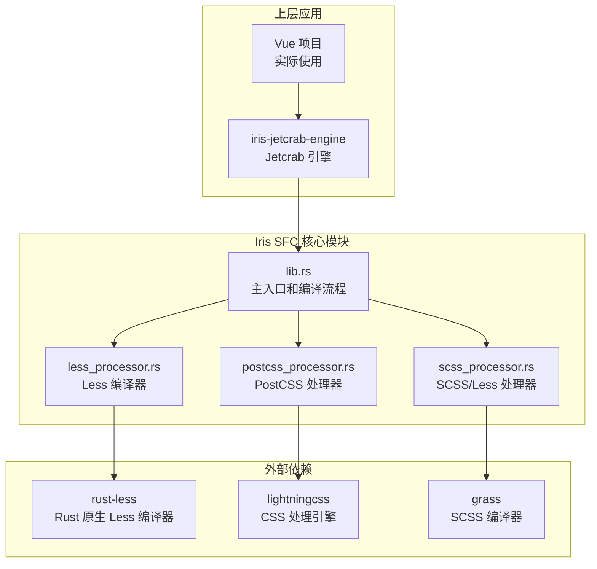

**图表来源**
- [less_processor.rs:1-314](file://crates/iris-sfc/src/less_processor.rs#L1-L314)
- [lib.rs:1-1020](file://crates/iris-sfc/src/lib.rs#L1-L1020)
- [Cargo.toml:44-46](file://crates/iris-sfc/Cargo.toml#L44-L46)

**章节来源**
- [Cargo.toml:1-46](file://crates/iris-sfc/Cargo.toml#L1-L46)
- [README.md:1-768](file://crates/iris-sfc/README.md#L1-L768)

## 核心组件

### Less 编译器架构

Less 预处理器支持的核心组件包括编译配置、编译结果和处理流程三个主要部分：

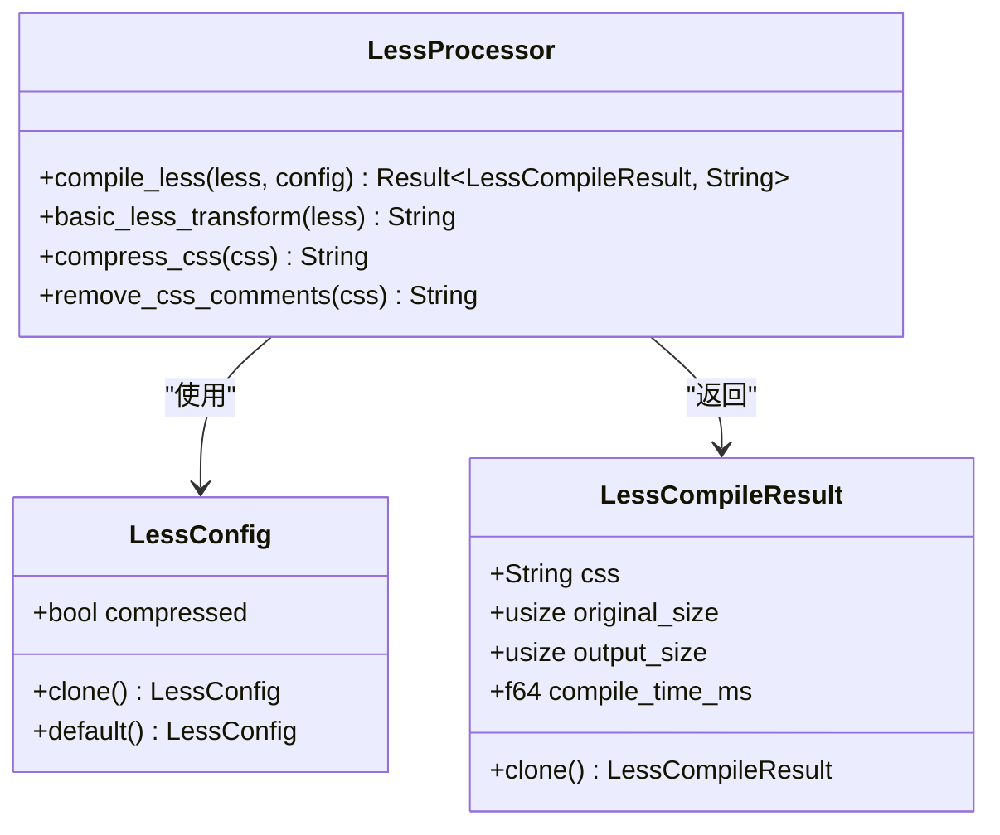

**图表来源**
- [less_processor.rs:36-129](file://crates/iris-sfc/src/less_processor.rs#L36-L129)

### 编译流程

Less 编译器采用两阶段处理策略，确保在 rust-less 编译器不可用时仍能提供基本功能：

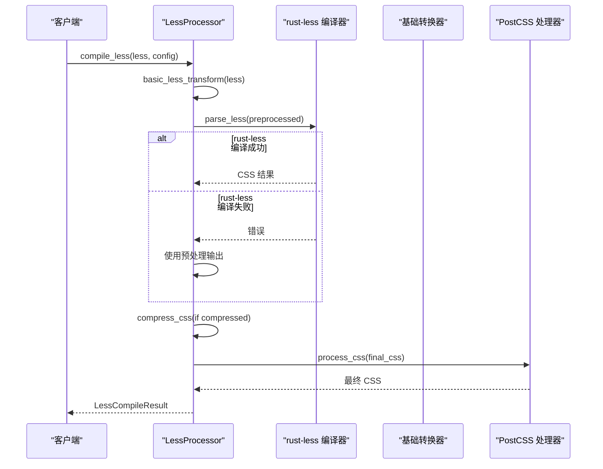

**图表来源**
- [less_processor.rs:81-129](file://crates/iris-sfc/src/less_processor.rs#L81-L129)
- [lib.rs:688-789](file://crates/iris-sfc/src/lib.rs#L688-L789)

**章节来源**
- [less_processor.rs:1-314](file://crates/iris-sfc/src/less_processor.rs#L1-L314)
- [lib.rs:688-789](file://crates/iris-sfc/src/lib.rs#L688-L789)

## 架构概览

### 整体编译流程

Iris SFC 将 Less 预处理器集成到完整的 Vue SFC 编译流程中，形成了从源码到最终模块的完整链路：

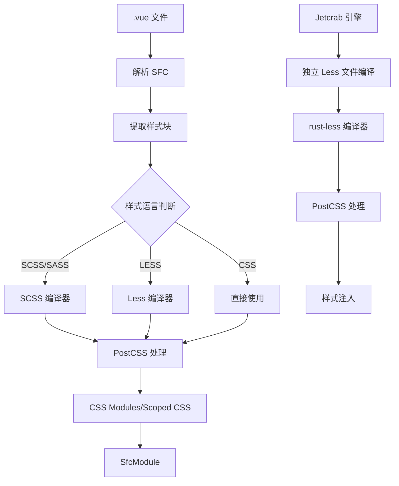

**图表来源**
- [lib.rs:688-789](file://crates/iris-sfc/src/lib.rs#L688-L789)
- [vue_compiler.rs:614-636](file://crates/iris-jetcrab-engine/src/vue_compiler.rs#L614-L636)

### 错误处理机制

Less 预处理器实现了多层次的错误处理和降级机制：

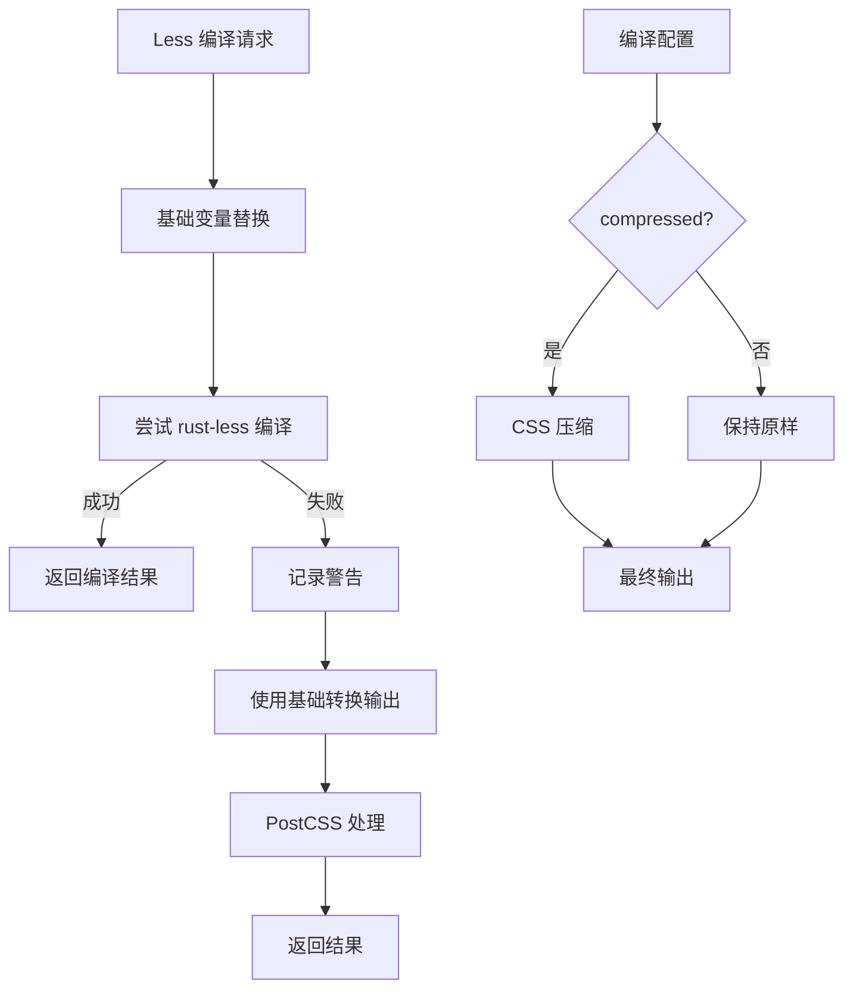

**图表来源**
- [less_processor.rs:96-129](file://crates/iris-sfc/src/less_processor.rs#L96-L129)

**章节来源**
- [lib.rs:688-789](file://crates/iris-sfc/src/lib.rs#L688-L789)
- [vue_compiler.rs:614-636](file://crates/iris-jetcrab-engine/src/vue_compiler.rs#L614-L636)

## 详细组件分析

### Less 编译器实现

Less 编译器的核心实现提供了完整的编译功能，包括配置管理、结果处理和错误恢复：

#### 编译配置系统

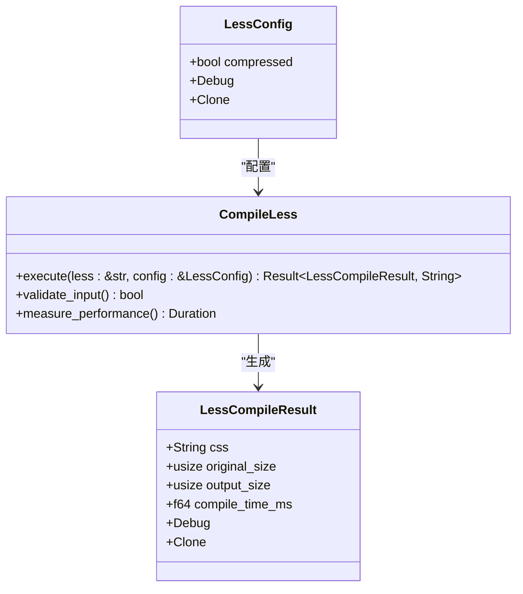

**图表来源**
- [less_processor.rs:36-129](file://crates/iris-sfc/src/less_processor.rs#L36-L129)

#### 基础转换器

基础转换器实现了 Less 变量系统的简化版本，支持基本的变量定义和替换功能：

```mermaid
flowchart LR
A[Less 源码] --> B[提取变量定义]
B --> C[建立变量映射]
C --> D[替换变量引用]
D --> E[移除变量定义行]
E --> F[输出 CSS]
G[变量定义模式] --> B
H[@variable: value;] --> G
```

**图表来源**
- [less_processor.rs:135-174](file://crates/iris-sfc/src/less_processor.rs#L135-L174)

**章节来源**
- [less_processor.rs:1-314](file://crates/iris-sfc/src/less_processor.rs#L1-L314)

### PostCSS 集成

Less 编译结果通过 PostCSS 处理器进一步优化，提供 Autoprefixer、CSS 嵌套支持等功能：

#### PostCSS 处理配置

PostCSS 处理器提供了灵活的配置选项，支持多种 CSS 优化功能：

| 配置项 | 类型 | 默认值 | 功能描述 |
|--------|------|--------|----------|
| enabled | bool | true | 是否启用 PostCSS 处理 |
| autoprefixer | bool | true | 自动添加浏览器前缀 |
| minify | bool | false | CSS 压缩优化 |
| nesting | bool | true | CSS 嵌套语法支持 |
| browser_targets | String | "" | 浏览器支持目标 |

**章节来源**
- [postcss_processor.rs:18-44](file://crates/iris-sfc/src/postcss_processor.rs#L18-L44)

### Jetcrab 引擎集成

Jetcrab 引擎提供了独立的 Less 文件编译能力，支持直接编译 .less 文件：

#### 独立编译流程

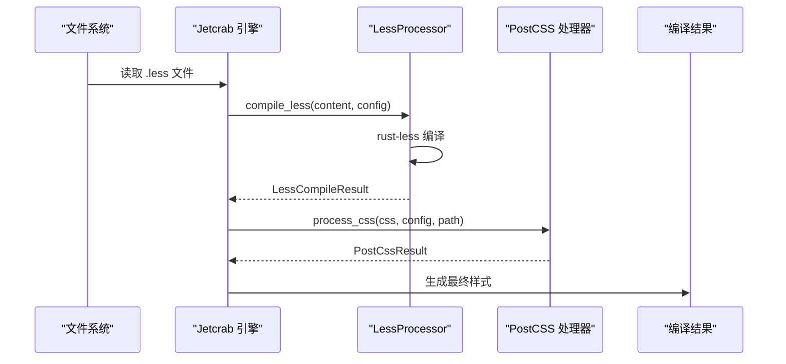

**图表来源**
- [vue_compiler.rs:614-636](file://crates/iris-jetcrab-engine/src/vue_compiler.rs#L614-L636)

**章节来源**
- [vue_compiler.rs:614-636](file://crates/iris-jetcrab-engine/src/vue_compiler.rs#L614-L636)

## 依赖关系分析

### 外部依赖管理

Less 预处理器支持依赖于多个外部库，每个库负责特定的功能领域：

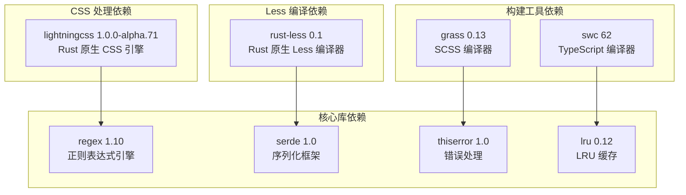

**图表来源**
- [Cargo.toml:11-46](file://crates/iris-sfc/Cargo.toml#L11-L46)

### 内部模块依赖

Iris SFC 内部模块之间存在清晰的依赖关系，确保功能模块的独立性和可维护性：

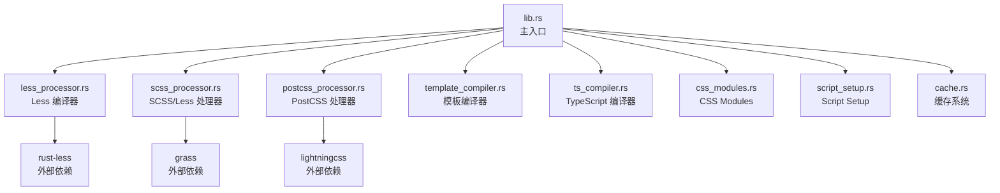

**图表来源**
- [lib.rs:11-27](file://crates/iris-sfc/src/lib.rs#L11-L27)
- [Cargo.toml:11-46](file://crates/iris-sfc/Cargo.toml#L11-L46)

**章节来源**
- [Cargo.toml:11-46](file://crates/iris-sfc/Cargo.toml#L11-L46)
- [lib.rs:11-27](file://crates/iris-sfc/src/lib.rs#L11-L27)

## 性能考虑

### 编译性能优化

Iris SFC 在 Less 预处理器中实施了多项性能优化措施：

#### 编译时间统计

| 操作类型 | 平均耗时 | 优化策略 |
|----------|----------|----------|
| 首次编译 | 1-3ms | 缓存机制、预编译正则表达式 |
| 缓存命中 | 3-6μs | LRU 缓存、源码哈希验证 |
| 模板编译 | <1ms | html5ever 解析器 |
| CSS 处理 | <1ms | lightningcss 引擎 |

#### 内存使用优化

| 配置 | 内存占用 | 优化说明 |
|------|----------|----------|
| 默认配置 | 中等 | Source Map 禁用 |
| 启用 Source Map | +30-50% | 调试支持 |
| 缓存 100 项 | ~5MB | 可调节缓存容量 |

**章节来源**
- [README.md:600-624](file://crates/iris-sfc/README.md#L600-L624)

### 编译流程优化

Less 编译器采用了多阶段处理策略，确保在各种情况下都能提供最优性能：

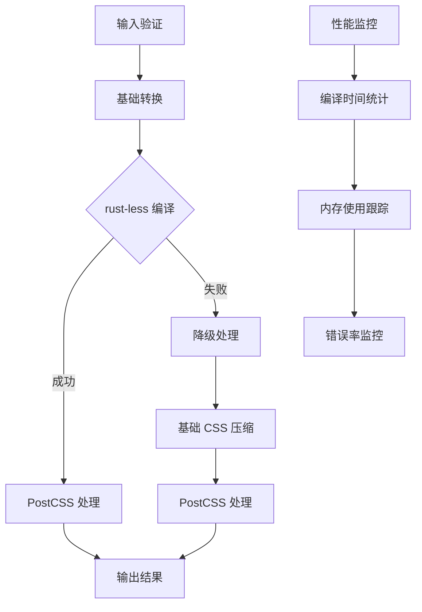

**图表来源**
- [less_processor.rs:81-129](file://crates/iris-sfc/src/less_processor.rs#L81-L129)

## 故障排除指南

### 常见问题及解决方案

#### 编译器兼容性问题

当 rust-less 编译器无法处理某些 Less 语法时，系统会自动降级到基础转换器：

**问题症状**：
- Less 编译失败但不崩溃
- 输出包含预处理内容而非完整 CSS

**解决方案**：
- 简化 Less 语法，使用基础变量系统
- 将复杂功能迁移到 SCSS（grass 编译器）

#### 性能问题排查

**性能下降表现**：
- 编译时间显著增加
- 内存使用异常升高

**排查步骤**：
1. 检查缓存配置和容量设置
2. 分析样式文件复杂度
3. 监控编译器错误率

#### 集成问题诊断

**Jetcrab 引擎集成问题**：
- 独立 .less 文件编译失败
- 样式注入不生效

**诊断方法**：
1. 验证文件路径和扩展名
2. 检查 PostCSS 配置
3. 确认编译器版本兼容性

**章节来源**
- [less_processor.rs:96-106](file://crates/iris-sfc/src/less_processor.rs#L96-L106)
- [vue_compiler.rs:614-636](file://crates/iris-jetcrab-engine/src/vue_compiler.rs#L614-L636)

### 错误处理机制

Iris SFC 实现了完善的错误处理机制，确保编译过程的稳定性和可恢复性：

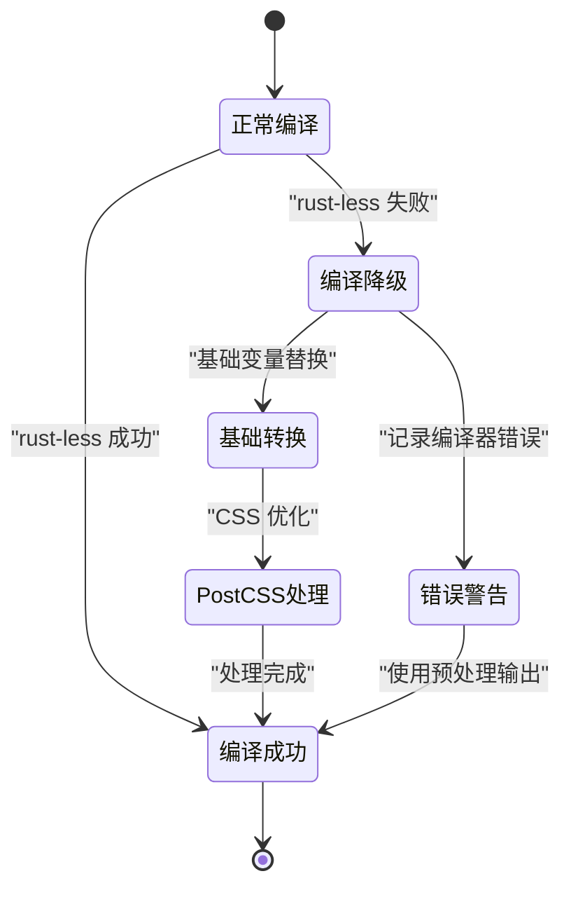

**图表来源**
- [less_processor.rs:96-106](file://crates/iris-sfc/src/less_processor.rs#L96-L106)

## 结论

Iris SFC 的 Less CSS 预处理器支持提供了完整的 Less 语法编译能力，结合 rust-less 编译器和 PostCSS 处理器，实现了高性能、稳定的样式编译流程。

### 主要优势

1. **Rust 原生编译器**：基于 rust-less 的高性能编译器，避免 Node.js 依赖
2. **智能降级机制**：编译失败时自动回退到基础转换器
3. **PostCSS 集成**：提供 Autoprefixer、CSS 嵌套等现代 CSS 功能
4. **性能优化**：多级缓存、预编译正则表达式等优化措施
5. **错误处理**：完善的错误捕获和降级策略

### 适用场景

- Vue 单文件组件中的 Less 样式编写
- 独立 .less 文件的编译和处理
- 需要避免 Node.js 依赖的构建环境
- 对编译性能有较高要求的应用

### 发展方向

未来版本计划进一步增强 Less 预处理器功能，包括：
- 完整的 Less 语法支持
- 更丰富的错误诊断信息
- 性能分析和优化报告
- 更好的开发工具集成

通过持续的优化和改进，Iris SFC 的 Less 预处理器支持将继续为 Vue 开发者提供高效、可靠的样式编译解决方案。