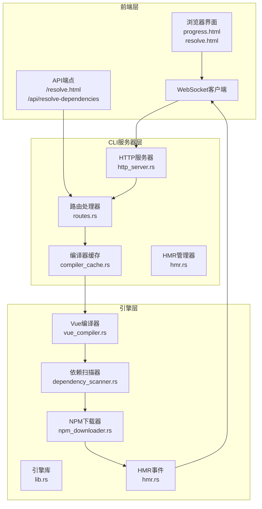
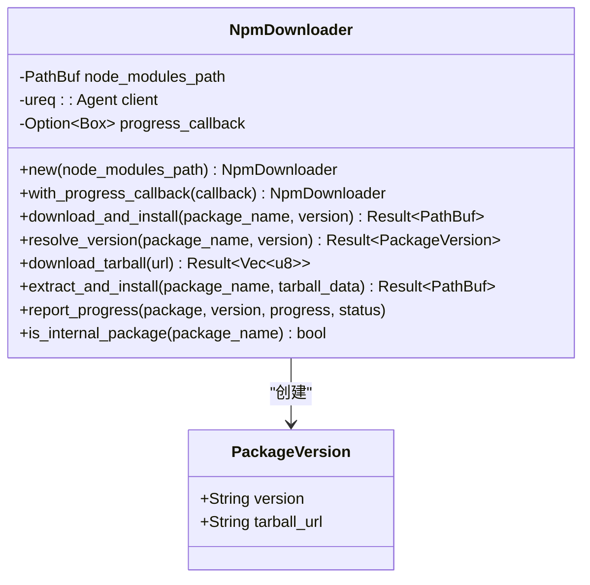
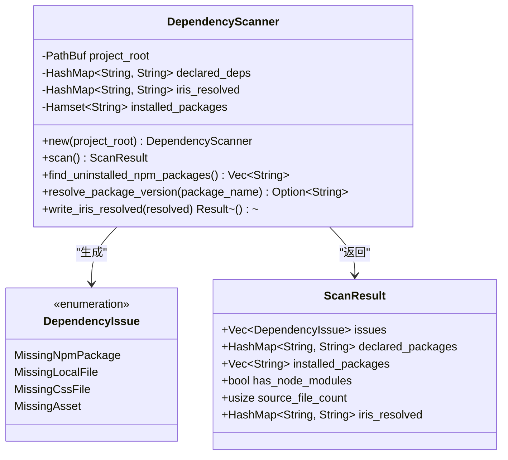
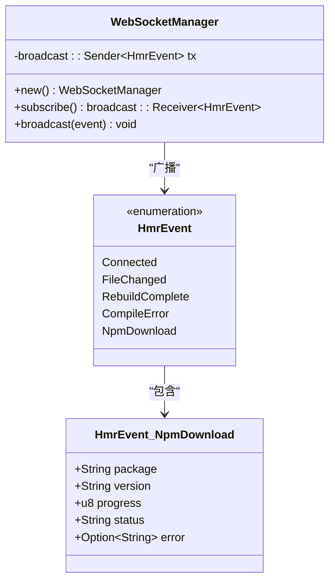
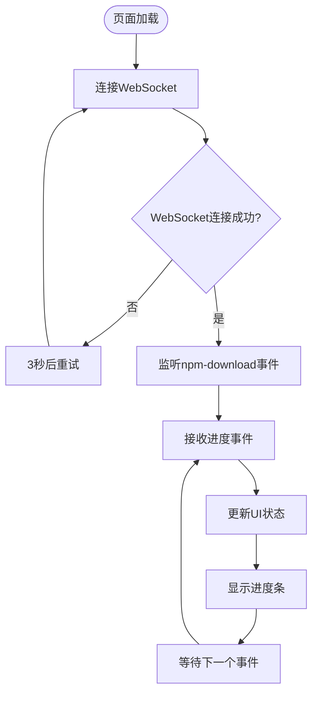
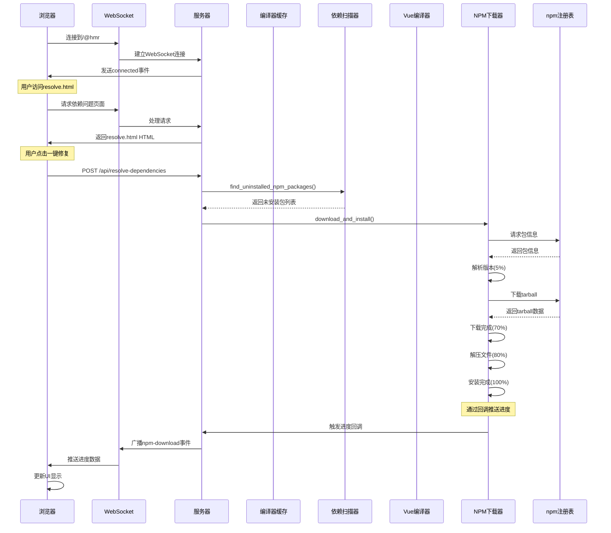
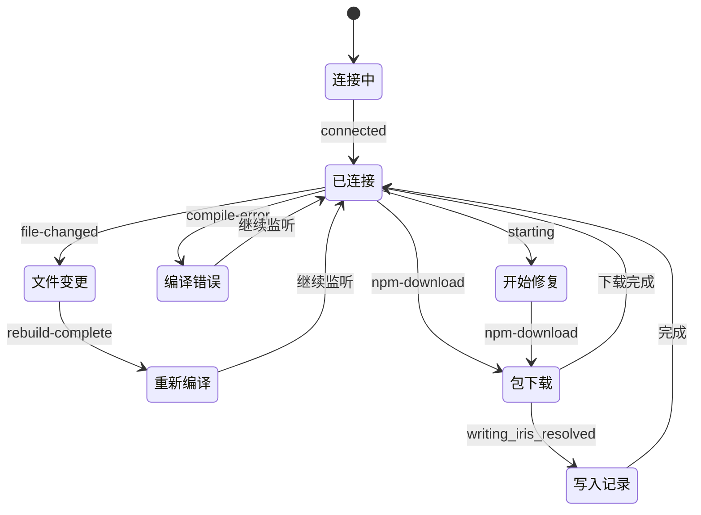
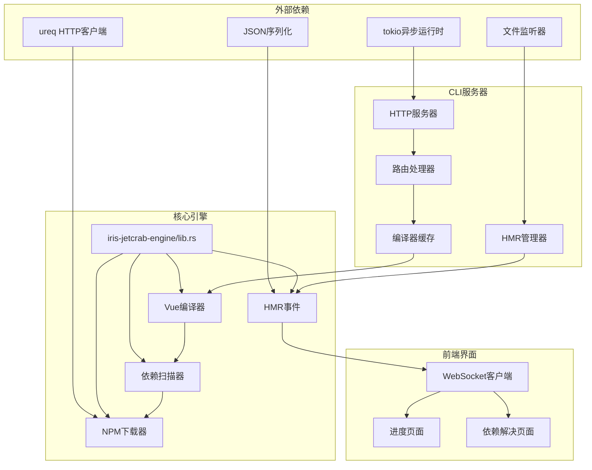

# NPM下载进度可视化

<cite>
**本文档引用的文件**
- [npm_downloader.rs](file://crates/iris-jetcrab-engine/src/npm_downloader.rs)
- [dependency_scanner.rs](file://crates/iris-jetcrab-engine/src/dependency_scanner.rs)
- [NPM_DOWNLOAD_PROGRESS.md](file://docs/NPM_DOWNLOAD_PROGRESS.md)
- [progress.html](file://crates/iris-jetcrab-cli/src/server/progress.html)
- [routes.rs](file://crates/iris-jetcrab-cli/src/server/routes.rs)
- [lib.rs](file://crates/iris-jetcrab-engine/src/lib.rs)
- [hmr.rs](file://crates/iris-jetcrab-engine/src/hmr.rs)
- [vue_compiler.rs](file://crates/iris-jetcrab-engine/src/vue_compiler.rs)
- [compiler_cache.rs](file://crates/iris-jetcrab-cli/src/server/compiler_cache.rs)
- [http_server.rs](file://crates/iris-jetcrab-cli/src/server/http_server.rs)
- [main.rs](file://crates/iris-cli/src/main.rs)
- [dev.rs](file://crates/iris-cli/src/commands/dev.rs)
- [hmr.rs](file://crates/iris-jetcrab-cli/src/server/hmr.rs)
</cite>

## 更新摘要
**变更内容**
- 新增依赖扫描和自动修复功能模块
- 扩展WebSocket事件处理支持新状态
- 新增resolve.html页面用于依赖问题解决
- 增强进度可视化功能覆盖完整依赖管理流程

## 目录
1. [简介](#简介)
2. [项目结构](#项目结构)
3. [核心组件](#核心组件)
4. [架构概览](#架构概览)
5. [详细组件分析](#详细组件分析)
6. [依赖关系分析](#依赖关系分析)
7. [性能考虑](#性能考虑)
8. [故障排除指南](#故障排除指南)
9. [结论](#结论)

## 简介

Iris JetCrab CLI 实现了完整的 NPM 包下载进度可视化系统，通过 WebSocket 实时推送下载状态到浏览器界面。该系统允许开发者在浏览器中直观地监控 Vue 项目依赖的安装过程，包括包解析、下载、解压和安装等各个阶段的状态。

**更新** 系统现已扩展为完整的依赖管理解决方案，包括依赖扫描、问题识别、自动修复和进度可视化功能。

## 项目结构

该项目采用模块化架构，主要分为以下几个核心部分：

**图表来源**
- [http_server.rs:19-111](file://crates/iris-jetcrab-cli/src/server/http_server.rs#L19-L111)
- [routes.rs:1-659](file://crates/iris-jetcrab-cli/src/server/routes.rs#L1-L659)
- [lib.rs:1-103](file://crates/iris-jetcrab-engine/src/lib.rs#L1-L103)

**章节来源**
- [http_server.rs:19-111](file://crates/iris-jetcrab-cli/src/server/http_server.rs#L19-L111)
- [lib.rs:1-103](file://crates/iris-jetcrab-engine/src/lib.rs#L1-L103)

## 核心组件

### NPM下载器 (NpmDownloader)

NPM下载器是整个进度可视化系统的核心组件，负责直接从 npm registry 下载包并提供进度回调机制。

**图表来源**
- [npm_downloader.rs:46-302](file://crates/iris-jetcrab-engine/src/npm_downloader.rs#L46-L302)

### 依赖扫描器 (DependencyScanner)

**新增** 依赖扫描器负责扫描项目中的依赖问题，识别未声明的npm包、缺失的本地文件和其他依赖问题。

**图表来源**
- [dependency_scanner.rs:67-800](file://crates/iris-jetcrab-engine/src/dependency_scanner.rs#L67-L800)

### WebSocket管理器

WebSocket管理器负责在服务器和浏览器之间建立实时通信通道，推送下载进度事件。

**图表来源**
- [hmr.rs:62-84](file://crates/iris-jetcrab-cli/src/server/hmr.rs#L62-L84)
- [hmr.rs:19-60](file://crates/iris-jetcrab-cli/src/server/hmr.rs#L19-L60)

### 前端进度页面

前端进度页面提供了完整的用户界面，展示实时的下载进度和状态信息。

**图表来源**
- [progress.html:328-367](file://crates/iris-jetcrab-cli/src/server/progress.html#L328-L367)

**章节来源**
- [npm_downloader.rs:46-302](file://crates/iris-jetcrab-engine/src/npm_downloader.rs#L46-L302)
- [hmr.rs:62-84](file://crates/iris-jetcrab-cli/src/server/hmr.rs#L62-L84)
- [progress.html:1-371](file://crates/iris-jetcrab-cli/src/server/progress.html#L1-L371)

## 架构概览

整个NPM下载进度可视化系统采用分层架构设计，实现了前后端分离和实时通信：

**图表来源**
- [npm_downloader.rs:118-156](file://crates/iris-jetcrab-engine/src/npm_downloader.rs#L118-L156)
- [compiler_cache.rs:208-226](file://crates/iris-jetcrab-cli/src/server/compiler_cache.rs#L208-L226)
- [routes.rs:149-239](file://crates/iris-jetcrab-cli/src/server/routes.rs#L149-L239)

## 详细组件分析

### 进度回调机制

NPM下载器实现了灵活的进度回调机制，允许在下载的不同阶段报告进度状态：

| 阶段 | 进度范围 | 状态值 | 描述 |
|------|----------|--------|------|
| 包解析 | 0-5% | `resolving` | 解析包信息和版本 |
| 开始下载 | 5-20% | `downloading` | 开始下载tarball文件 |
| 下载中 | 20-70% | `downloading` | 继续下载tarball文件 |
| 下载完成 | 70-80% | `downloading` | 下载完成，准备解压 |
| 开始解压 | 80-90% | `extracting` | 开始解压文件 |
| 解压完成 | 90-100% | `extracting` | 解压完成，准备安装 |
| 安装完成 | 100% | `installed` | 安装完成 |
| 写入irisResolved | 0% | `writing_iris_resolved` | 写入版本解析记录 |

**更新** 新增了`writing_iris_resolved`状态，用于显示向package.json写入版本解析记录的过程。

**章节来源**
- [npm_downloader.rs:118-156](file://crates/iris-jetcrab-engine/src/npm_downloader.rs#L118-L156)
- [NPM_DOWNLOAD_PROGRESS.md:17-26](file://docs/NPM_DOWNLOAD_PROGRESS.md#L17-L26)

### WebSocket事件系统

HMR事件系统提供了统一的事件管理机制，支持多种类型的事件：

**图表来源**
- [hmr.rs:19-60](file://crates/iris-jetcrab-cli/src/server/hmr.rs#L19-L60)

### 前端UI组件

前端进度页面实现了响应式的用户界面，包含以下主要组件：

1. **连接状态指示器**：显示WebSocket连接状态（绿色表示已连接，红色表示断开）
2. **总体状态栏**：显示当前正在下载的包数量和状态
3. **包进度列表**：每个包独立显示进度条、状态徽章和进度百分比
4. **自动重连机制**：WebSocket断开后自动重连，间隔3秒
5. **依赖问题解决页面**：**新增** 专门用于显示和解决依赖问题的页面

**更新** 新增了依赖问题解决页面，提供完整的依赖管理功能。

**章节来源**
- [progress.html:45-177](file://crates/iris-jetcrab-cli/src/server/progress.html#L45-L177)
- [progress.html:231-367](file://crates/iris-jetcrab-cli/src/server/progress.html#L231-L367)

### 依赖扫描和自动修复功能

**新增** 系统现在包含完整的依赖扫描和自动修复功能：

1. **依赖扫描**：扫描项目中的依赖问题，包括未声明的npm包、缺失的本地文件等
2. **问题分类**：将问题分为错误、警告和信息三个严重级别
3. **自动修复**：一键下载和安装缺失的依赖包
4. **版本记录**：将解析的版本信息写入package.json的irisResolved字段

**章节来源**
- [dependency_scanner.rs:94-122](file://crates/iris-jetcrab-engine/src/dependency_scanner.rs#L94-L122)
- [routes.rs:545-680](file://crates/iris-jetcrab-cli/src/server/routes.rs#L545-L680)

## 依赖关系分析

系统各组件之间的依赖关系如下：

**图表来源**
- [lib.rs:61-82](file://crates/iris-jetcrab-engine/src/lib.rs#L61-L82)
- [http_server.rs:1-111](file://crates/iris-jetcrab-cli/src/server/http_server.rs#L1-L111)

**章节来源**
- [lib.rs:61-82](file://crates/iris-jetcrab-engine/src/lib.rs#L61-L82)
- [http_server.rs:1-111](file://crates/iris-jetcrab-cli/src/server/http_server.rs#L1-L111)

## 性能考虑

### 异步处理
系统采用异步编程模型，使用Tokio运行时处理并发操作：
- WebSocket连接管理
- 文件监听和防抖处理
- HTTP请求处理
- 编译器缓存管理
- **新增** 依赖扫描的异步处理

### 缓存策略
- 编译结果缓存：避免重复编译相同模块
- 依赖树缓存：快速检测依赖变化
- 模块路径匹配：支持多种路径格式的模块查找
- **新增** 依赖扫描结果缓存

### 网络优化
- HTTP客户端超时配置：连接超时10秒，读取超时30秒
- 分阶段进度报告：提供更精确的用户体验
- 自动重连机制：网络中断后的优雅恢复
- **新增** 依赖包下载的并发处理

## 故障排除指南

### 常见问题及解决方案

1. **WebSocket连接失败**
   - 检查服务器是否正常启动
   - 确认防火墙设置允许WebSocket连接
   - 查看浏览器控制台的网络错误

2. **进度页面无法加载**
   - 确认服务器端口配置正确
   - 检查路由配置是否正确
   - 验证progress.html文件是否存在

3. **下载进度不显示**
   - 确认NPM下载器的进度回调已正确设置
   - 检查编译器缓存是否正确传递WebSocket管理器
   - 验证npm包是否存在于node_modules中

4. **包下载失败**
   - 检查网络连接和npm注册表可达性
   - 验证包名和版本号的正确性
   - 查看服务器日志获取详细错误信息

5. **依赖扫描失败**
   - **新增** 检查package.json文件格式是否正确
   - 确认项目根目录权限正确
   - 验证node_modules目录是否存在且可访问

6. **自动修复功能异常**
   - **新增** 检查npm注册表连接状态
   - 确认磁盘空间充足
   - 验证package.json写入权限

**章节来源**
- [compiler_cache.rs:208-226](file://crates/iris-jetcrab-cli/src/server/compiler_cache.rs#L208-L226)
- [routes.rs:149-239](file://crates/iris-jetcrab-cli/src/server/routes.rs#L149-L239)

## 结论

Iris JetCrab CLI 的 NPM下载进度可视化系统通过以下关键特性实现了优秀的用户体验：

1. **实时性**：通过WebSocket实现实时进度推送
2. **可视化**：直观的进度条和状态指示
3. **可靠性**：自动重连和错误处理机制
4. **可扩展性**：模块化的架构设计支持功能扩展
5. **性能**：异步处理和缓存策略保证系统性能
6. **完整性**：**新增** 完整的依赖管理解决方案，包括扫描、修复和版本记录功能

**更新** 系统现已扩展为完整的依赖管理工具，不仅能够显示下载进度，还能自动识别和修复项目中的依赖问题，显著提升了开发体验和调试效率。通过清晰的架构设计和完善的错误处理机制，系统能够在各种环境下稳定运行，为开发者提供可靠的开发工具。

该系统为Vue项目开发提供了完整的依赖管理可视化解决方案，通过以下增强功能：
- 依赖问题自动扫描和分类
- 一键自动修复功能
- 版本解析记录管理
- 更丰富的状态显示
- 更完善的错误处理