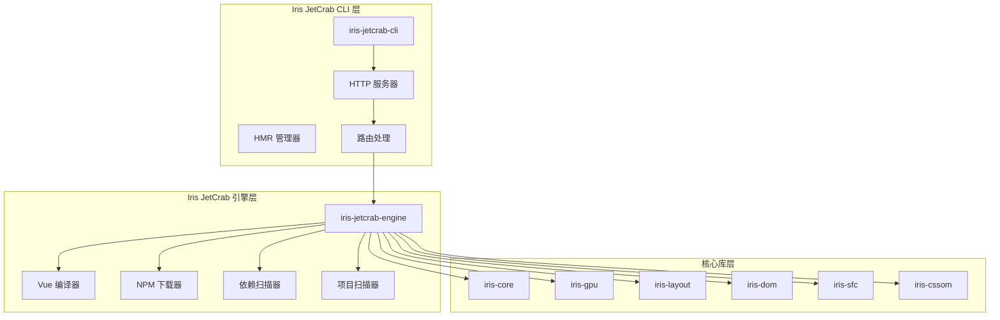
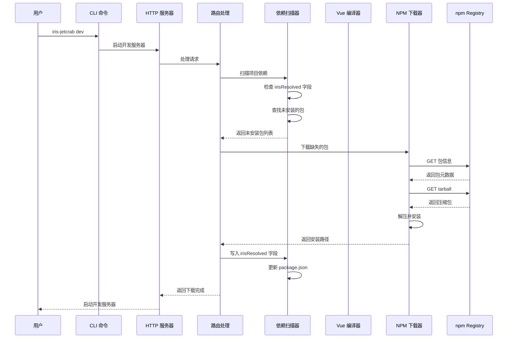
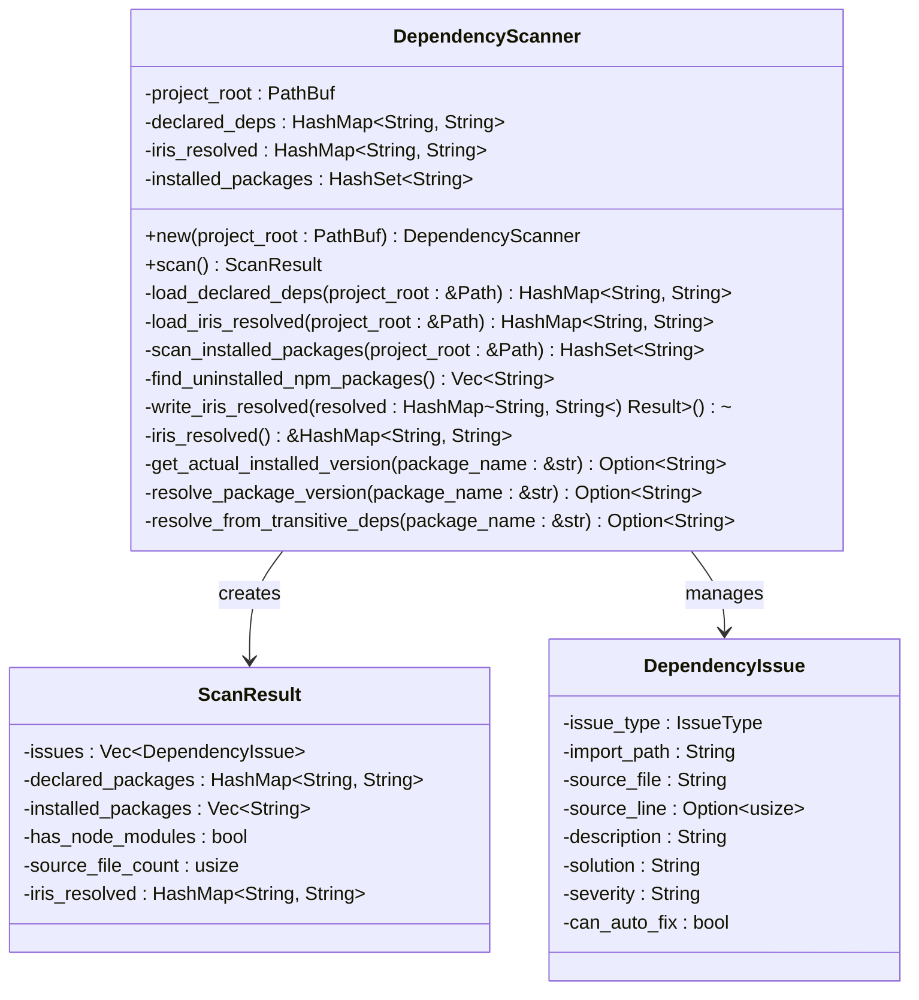
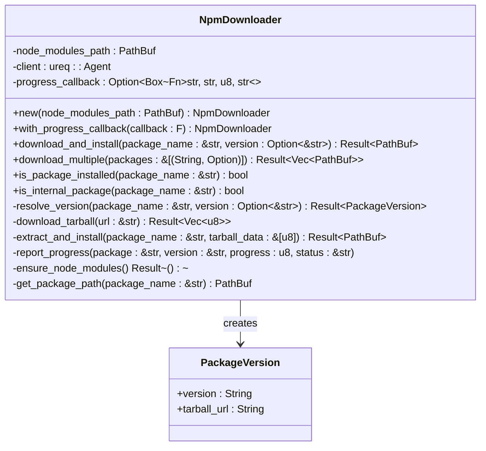
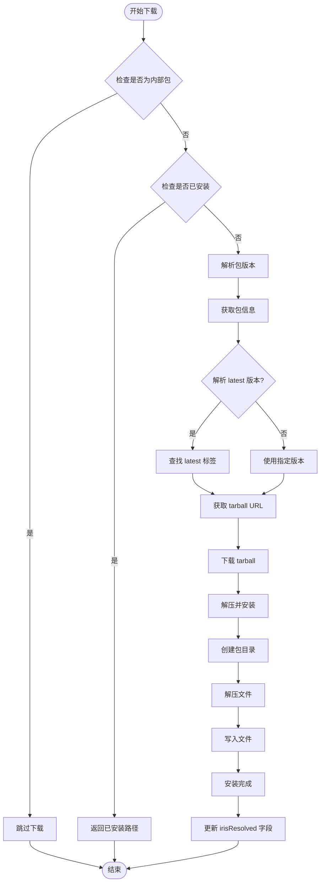
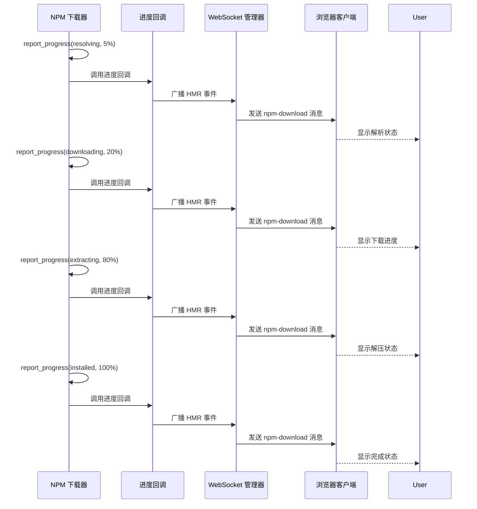
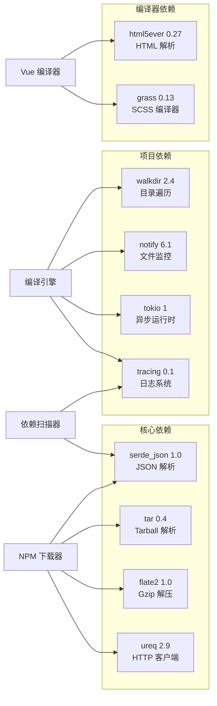

# NPM自动下载功能

<cite>
**本文档引用的文件**
- [dependency_scanner.rs](file://crates/iris-jetcrab-engine/src/dependency_scanner.rs)
- [npm_downloader.rs](file://crates/iris-jetcrab-engine/src/npm_downloader.rs)
- [NPM_AUTO_DOWNLOAD.md](file://docs/NPM_AUTO_DOWNLOAD.md)
- [NPM_DOWNLOADER_IMPLEMENTATION.md](file://docs/NPM_DOWNLOADER_IMPLEMENTATION.md)
- [lib.rs](file://crates/iris-jetcrab-engine/src/lib.rs)
- [Cargo.toml](file://crates/iris-jetcrab-engine/Cargo.toml)
- [vue_compiler.rs](file://crates/iris-jetcrab-engine/src/vue_compiler.rs)
- [project_scanner.rs](file://crates/iris-jetcrab-engine/src/project_scanner.rs)
- [NPM_DOWNLOAD_PROGRESS.md](file://docs/NPM_DOWNLOAD_PROGRESS.md)
- [main.rs](file://crates/iris-jetcrab-cli/src/main.rs)
- [dev.rs](file://crates/iris-cli/src/commands/dev.rs)
- [routes.rs](file://crates/iris-jetcrab-cli/src/server/routes.rs)
- [package.json](file://examples/vue-demo/package.json)
</cite>

## 更新摘要
**变更内容**
- 新增依赖扫描器模块，提供自动下载缺失 npm 包的能力
- 增强 NPM 下载器与依赖扫描器的集成，支持通过 irisResolved 字段记录版本信息
- CLI 服务器中集成自动写入 package.json 的 irisResolved 字段功能
- 完善依赖问题检测和自动修复机制

## 目录
1. [简介](#简介)
2. [项目结构](#项目结构)
3. [核心组件](#核心组件)
4. [架构概览](#架构概览)
5. [详细组件分析](#详细组件分析)
6. [依赖关系分析](#依赖关系分析)
7. [性能考虑](#性能考虑)
8. [故障排除指南](#故障排除指南)
9. [结论](#结论)

## 简介

Iris JetCrab CLI 内置了强大的 NPM 包自动下载功能，允许开发者在无需安装任何外部工具（npm、yarn、pnpm 等）的情况下，自动下载并安装所需的 NPM 包。该功能现已得到显著增强，现在可以与依赖扫描器深度集成，提供自动下载缺失的 npm 包并通过 irisResolved 字段记录版本信息。

该功能的核心优势包括：
- **零外部依赖**：完全独立运行，不需要 Node.js 或任何 NPM 工具
- **自动下载**：编译时自动检测并下载缺失的包
- **版本管理**：从 package.json 读取版本号，通过 irisResolved 字段记录解析版本
- **智能扫描**：依赖扫描器自动识别未声明的 npm 包
- **缓存机制**：已安装的包不会重复下载
- **实时进度显示**：通过 WebSocket 实时显示下载进度
- **自动版本记录**：下载完成后自动写入 package.json 的 irisResolved 字段

## 项目结构

Iris JetCrab 项目的整体架构采用模块化设计，NPM 自动下载功能主要分布在以下关键模块中：



**图表来源**
- [lib.rs:61-82](file://crates/iris-jetcrab-engine/src/lib.rs#L61-L82)
- [main.rs:1-71](file://crates/iris-jetcrab-cli/src/main.rs#L1-L71)
- [routes.rs:637-665](file://crates/iris-jetcrab-cli/src/server/routes.rs#L637-L665)

**章节来源**
- [lib.rs:1-105](file://crates/iris-jetcrab-engine/src/lib.rs#L1-L105)
- [Cargo.toml:1-76](file://crates/iris-jetcrab-engine/Cargo.toml#L1-L76)

## 核心组件

### 依赖扫描器 (DependencyScanner)

依赖扫描器是新增的核心组件，负责扫描项目中的依赖问题并识别未声明的 npm 包。其主要功能包括：

- **依赖问题检测**：扫描源码文件，识别未在 package.json 中声明的 npm 包
- **irisResolved 字段管理**：读取和写入 package.json 中的 irisResolved 字段
- **版本解析**：从传递依赖中查找包的版本信息
- **自动下载支持**：提供查找未安装包的功能，支持自动下载流程

### NPM 下载器 (NpmDownloader)

NPM 下载器是整个自动下载功能的核心组件，负责直接从 npm registry 下载包并进行安装。其主要功能包括：

- **包版本解析**：支持指定版本和 latest 版本解析
- **HTTP 请求处理**：使用 ureq 库进行 HTTP 请求
- **Tarball 解压**：使用 flate2 和 tar 库解压压缩包
- **缓存管理**：检查 node_modules 目录中的现有包
- **进度报告**：提供实时下载进度反馈

### Vue 项目编译器 (VueProjectCompiler)

Vue 项目编译器负责处理 Vue 项目的编译过程，并集成了 NPM 包自动下载功能。其核心职责包括：

- **依赖解析**：从 package.json 中读取项目依赖
- **包路径解析**：确定 NPM 包的安装路径
- **编译流程控制**：协调各个编译步骤的执行

### 项目扫描器 (ProjectScanner)

项目扫描器负责扫描和解析 Vue 项目的结构，为编译器提供必要的项目信息。

**章节来源**
- [dependency_scanner.rs:67-77](file://crates/iris-jetcrab-engine/src/dependency_scanner.rs#L67-L77)
- [npm_downloader.rs:46-54](file://crates/iris-jetcrab-engine/src/npm_downloader.rs#L46-L54)
- [vue_compiler.rs:51-69](file://crates/iris-jetcrab-engine/src/vue_compiler.rs#L51-L69)
- [project_scanner.rs:41-45](file://crates/iris-jetcrab-engine/src/project_scanner.rs#L41-L45)

## 架构概览

Iris JetCrab 的 NPM 自动下载功能采用分层架构设计，现在集成了依赖扫描器，确保了功能的模块化和可维护性：



**图表来源**
- [NPM_AUTO_DOWNLOAD.md:9-21](file://docs/NPM_AUTO_DOWNLOAD.md#L9-L21)
- [NPM_DOWNLOADER_IMPLEMENTATION.md:65-91](file://docs/NPM_DOWNLOADER_IMPLEMENTATION.md#L65-L91)
- [routes.rs:637-665](file://crates/iris-jetcrab-cli/src/server/routes.rs#L637-L665)

## 详细组件分析

### 依赖扫描器类结构



**图表来源**
- [dependency_scanner.rs:50-77](file://crates/iris-jetcrab-engine/src/dependency_scanner.rs#L50-L77)
- [dependency_scanner.rs:29-48](file://crates/iris-jetcrab-engine/src/dependency_scanner.rs#L29-L48)

### NPM 下载器类结构



**图表来源**
- [npm_downloader.rs:39-54](file://crates/iris-jetcrab-engine/src/npm_downloader.rs#L39-L54)

### 下载流程详细分析



**图表来源**
- [npm_downloader.rs:118-156](file://crates/iris-jetcrab-engine/src/npm_downloader.rs#L118-L156)
- [npm_downloader.rs:158-210](file://crates/iris-jetcrab-engine/src/npm_downloader.rs#L158-L210)
- [routes.rs:637-665](file://crates/iris-jetcrab-cli/src/server/routes.rs#L637-L665)

### 进度报告机制

Iris JetCrab 实现了完整的进度报告机制，通过回调函数和 WebSocket 实时显示下载进度：



**图表来源**
- [NPM_DOWNLOAD_PROGRESS.md:29-79](file://docs/NPM_DOWNLOAD_PROGRESS.md#L29-L79)
- [NPM_DOWNLOAD_PROGRESS.md:81-120](file://docs/NPM_DOWNLOAD_PROGRESS.md#L81-L120)

**章节来源**
- [dependency_scanner.rs:679-737](file://crates/iris-jetcrab-engine/src/dependency_scanner.rs#L679-L737)
- [npm_downloader.rs:87-156](file://crates/iris-jetcrab-engine/src/npm_downloader.rs#L87-L156)
- [NPM_DOWNLOAD_PROGRESS.md:1-347](file://docs/NPM_DOWNLOAD_PROGRESS.md#L1-L347)

## 依赖关系分析

Iris JetCrab 的 NPM 自动下载功能依赖于以下关键库：



**图表来源**
- [Cargo.toml:44-60](file://crates/iris-jetcrab-engine/Cargo.toml#L44-L60)

**章节来源**
- [Cargo.toml:13-76](file://crates/iris-jetcrab-engine/Cargo.toml#L13-L76)

## 性能考虑

### 下载性能优化

Iris JetCrab 当前版本采用串行下载策略，这虽然简化了实现复杂度，但在处理多个依赖包时可能会影响整体性能。未来的优化方向包括：

- **并行下载**：同时下载多个包以提高整体速度
- **智能缓存**：利用全局缓存减少重复下载
- **断点续传**：支持大文件的断点续传功能
- **压缩传输**：在网络传输层面进行优化

### 内存使用优化

NPM 下载器在处理大型包时需要注意内存使用情况：

- **流式解压**：避免将整个 tarball 加载到内存中
- **增量处理**：逐个文件处理而不是一次性解压
- **资源清理**：及时释放不再使用的内存和文件句柄

### 网络连接优化

为了提高网络请求的效率：

- **连接复用**：重用 HTTP 连接减少握手开销
- **超时配置**：合理设置连接和读取超时时间
- **错误重试**：在网络不稳定时自动重试请求

### 依赖扫描性能优化

依赖扫描器在处理大型项目时需要注意性能：

- **增量扫描**：只扫描发生变化的文件
- **并行处理**：使用多线程处理多个文件
- **缓存机制**：缓存扫描结果减少重复计算

## 故障排除指南

### 常见问题及解决方案

#### 1. 网络连接问题

**症状**：下载过程中出现网络错误或超时

**解决方案**：
- 检查网络连接是否稳定
- 配置代理服务器（未来版本支持）
- 增加超时时间设置
- 使用国内 npm 镜像源（未来版本支持）

#### 2. 包版本解析失败

**症状**：无法解析包的最新版本或指定版本

**解决方案**：
- 验证包名是否正确
- 检查版本号格式是否符合语义化版本规范
- 确认包是否存在于 npm registry 中
- 查看详细的错误日志获取更多信息

#### 3. 文件权限问题

**症状**：无法创建或写入 node_modules 目录

**解决方案**：
- 检查目标目录的写入权限
- 确保有足够的磁盘空间
- 关闭可能占用文件的其他程序
- 以管理员权限运行 CLI

#### 4. 解压失败问题

**症状**：tarball 解压过程中出现错误

**解决方案**：
- 验证下载的 tarball 文件完整性
- 检查磁盘空间是否充足
- 确认文件系统支持所需的文件操作
- 清理部分损坏的文件后重试

#### 5. irisResolved 字段写入失败

**症状**：自动下载完成后无法更新 package.json

**解决方案**：
- 检查 package.json 文件的写入权限
- 确认 JSON 格式是否正确
- 验证磁盘空间是否充足
- 查看详细的错误日志获取更多信息

### 调试和诊断

#### 启用详细日志

可以通过设置环境变量来获取更详细的调试信息：

```bash
export RUST_LOG=debug
iris-jetcrab dev
```

#### 检查依赖完整性

使用以下命令验证项目依赖的完整性：

```bash
iris-jetcrab info --root ./your-project
```

**章节来源**
- [NPM_AUTO_DOWNLOAD.md:216-222](file://docs/NPM_AUTO_DOWNLOAD.md#L216-L222)
- [NPM_AUTO_DOWNLOAD.md:236-253](file://docs/NPM_AUTO_DOWNLOAD.md#L236-L253)

## 结论

Iris JetCrab 的 NPM 自动下载功能代表了现代前端开发工具的一个重要进步。通过完全消除对外部工具的依赖，它为开发者提供了前所未有的便利性和易用性。

### 主要成就

1. **零配置开发体验**：开发者无需安装 Node.js 或任何 NPM 工具
2. **自动依赖管理**：编译时自动检测并下载缺失的包
3. **智能版本记录**：通过 irisResolved 字段记录解析的版本信息
4. **实时进度反馈**：通过 WebSocket 提供可视化的下载进度
5. **跨平台支持**：支持 Windows、macOS 和 Linux 系统
6. **依赖问题检测**：自动扫描并识别未声明的 npm 包
7. **自动版本记录**：下载完成后自动更新 package.json

### 未来发展方向

尽管当前版本已经实现了核心功能，但仍有许多改进空间：

- **并行下载**：提升多包下载的效率
- **代理支持**：支持企业网络环境下的代理配置
- **完整性校验**：添加 SHA-256 校验确保包的完整性
- **离线模式**：支持离线环境下的包管理
- **依赖锁文件**：支持 package-lock.json 的完整解析
- **增量扫描**：优化大型项目的依赖扫描性能
- **错误恢复**：增强下载失败后的自动恢复机制

### 适用场景

Iris JetCrab 的 NPM 自动下载功能特别适用于：

- **快速原型开发**：需要快速搭建和测试的项目
- **学习和教育**：降低学习前端开发的门槛
- **简单项目**：不需要复杂依赖管理的小型项目
- **CI/CD 环境**：简化持续集成和部署流程
- **微服务架构**：快速启动和测试独立的服务模块

通过这些创新性的功能，Iris JetCrab 为现代前端开发提供了一个强大而灵活的解决方案，真正实现了"一键启动"的开发体验。新增的依赖扫描器和 irisResolved 字段管理功能进一步提升了工具的智能化水平，为开发者提供了更加完善和可靠的开发体验。