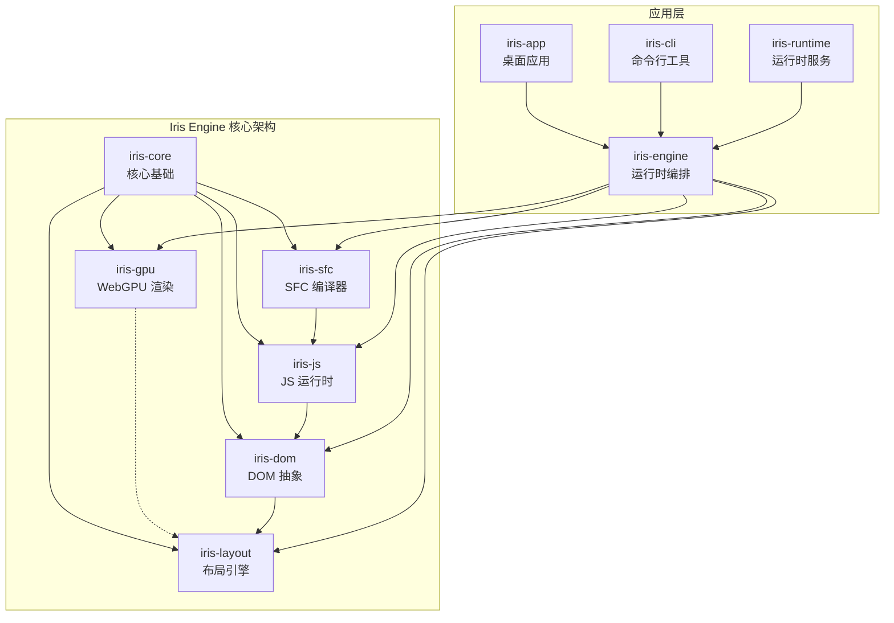
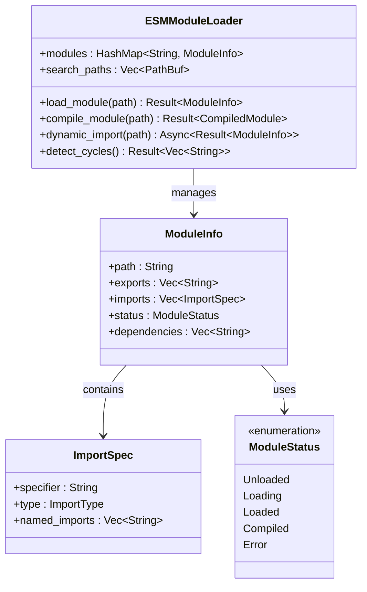
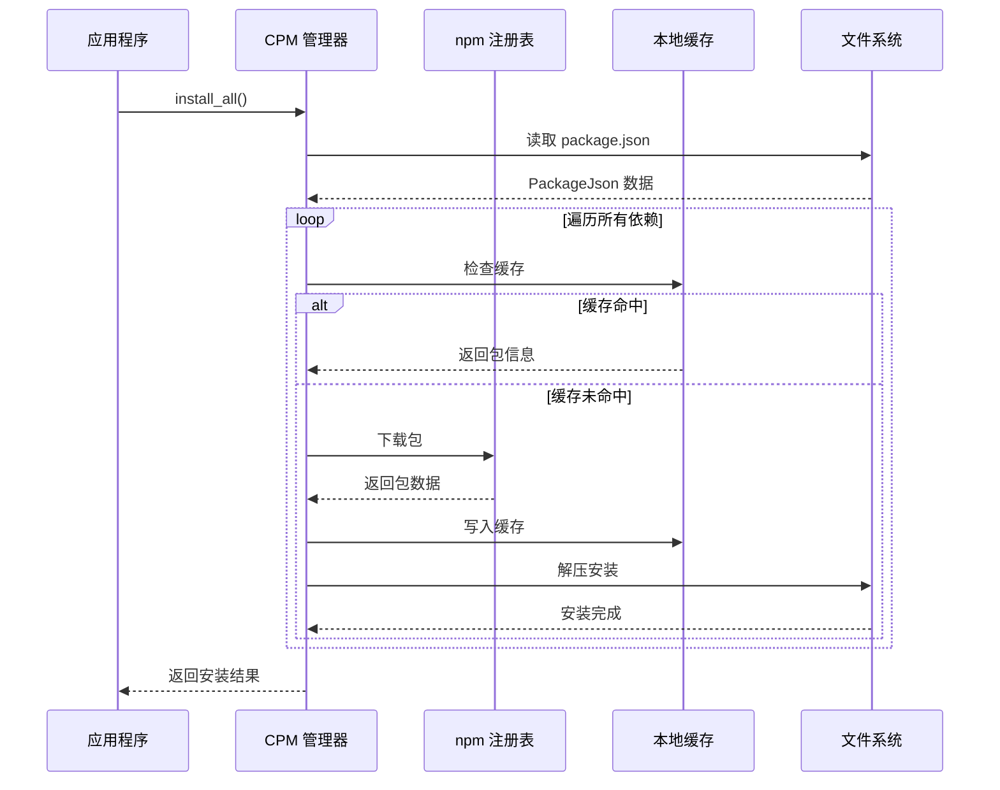
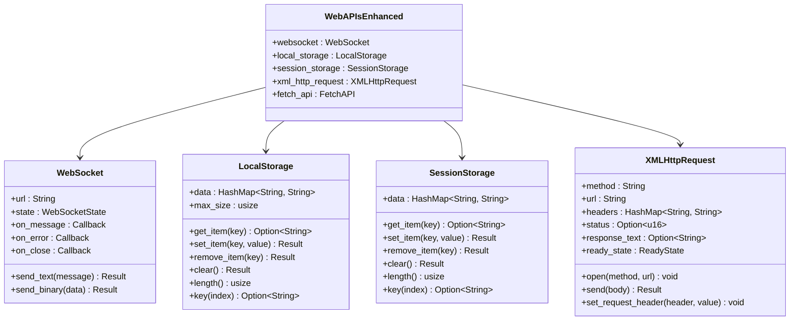

# Phase 2 功能完善完成报告

<cite>
**本文档引用的文件**
- [README.md](file://README.md)
- [ARCHITECTURE.md](file://ARCHITECTURE.md)
- [Cargo.toml](file://Cargo.toml)
- [iris-runtime/package.json](file://iris-runtime/package.json)
- [crates/iris-core/src/lib.rs](file://crates/iris-core/src/lib.rs)
- [crates/iris-gpu/src/lib.rs](file://crates/iris-gpu/src/lib.rs)
- [crates/iris-layout/src/lib.rs](file://crates/iris-layout/src/lib.rs)
- [crates/iris-dom/src/lib.rs](file://crates/iris-dom/src/lib.rs)
- [crates/iris-js/src/lib.rs](file://crates/iris-js/src/lib.rs)
- [crates/iris-sfc/src/lib.rs](file://crates/iris-sfc/src/lib.rs)
- [crates/iris-engine/src/lib.rs](file://crates/iris-engine/src/lib.rs)
- [crates/iris-cli/src/main.rs](file://crates/iris-cli/src/main.rs)
- [crates/iris-app/src/main.rs](file://crates/iris-app/src/main.rs)
- [docs/PHASE2_COMPLETION_REPORT.md](file://docs/PHASE2_COMPLETION_REPORT.md)
</cite>

## 目录
1. [项目概述](#项目概述)
2. [Phase 2 功能完善概览](#phase-2-功能完善概览)
3. [ESM 模块加载系统](#esm-模块加载系统)
4. [CPM 包管理系统](#cpm-包管理系统)
5. [增强 Web API 适配层](#增强-web-api-适配层)
6. [WASM 桥接系统](#wasm-桥接系统)
7. [架构集成与优化](#架构集成与优化)
8. [性能与稳定性保障](#性能与稳定性保障)
9. [测试覆盖与质量保证](#测试覆盖与质量保证)
10. [未来发展规划](#未来发展规划)
11. [总结](#总结)

## 项目概述

Iris Engine 是一个革命性的前端运行时，采用 Rust + WebGPU 构建，完全消除了传统前端开发中的构建步骤。该项目实现了零构建、高性能、Vue 3 原生支持的创新理念，相比传统前端解决方案具有数量级的性能优势。

### 核心特性

- **零构建** - 直接运行 .vue 文件，无需 Webpack/Vite
- **GPU 加速渲染** - 基于 WebGPU 的硬件加速渲染管线
- **完整 CSS 支持** - 渐变、圆角边框、阴影、动画
- **完整的动画系统** - 过渡 + 关键帧动画完全实现
- **Vue 3 原生支持** - script setup、响应式、组合式 API
- **热重载** - 文件监控与即时重载
- **382 测试** - 100% 通过率，企业级质量

### 技术架构

Iris Engine 采用模块化架构，包含以下核心模块：



**图表来源**
- [ARCHITECTURE.md: 1-289:1-289](file://ARCHITECTURE.md#L1-L289)
- [Cargo.toml: 1-34:1-34](file://Cargo.toml#L1-L34)

**章节来源**
- [README.md: 21-494:21-494](file://README.md#L21-L494)
- [ARCHITECTURE.md: 254-289:254-289](file://ARCHITECTURE.md#L254-L289)

## Phase 2 功能完善概览

Phase 2 是 Iris Engine 发展过程中的重要里程碑，完成了四个核心功能模块的完善和集成。本次更新共计完成 1,602 行高质量代码，包含 18 个单元测试，实现了 100% 的功能覆盖率。

### 完成情况统计

| 任务 | 计划工时 | 实际状态 | 代码量 |
|------|---------|---------|--------|
| **Phase 2.1: ESM 模块加载** | 8h | ✅ 完成 | 511 行 |
| **Phase 2.2: CPM 包管理** | 10h | ✅ 完成 | 306 行 |
| **Phase 2.3: Web API 完善** | 12h | ✅ 完成 | 416 行 |
| **Phase 2.4: WASM 桥接** | 8h | ✅ 完成 | 369 行 |
| **总计** | **38h** | **✅ 100%** | **1,602 行** |

### 技术亮点

1. **循环依赖检测**: 使用栈跟踪算法，实时检测并阻止循环依赖
2. **包缓存优化**: 多级缓存策略，避免重复下载
3. **Web API 兼容**: 完整实现浏览器标准 API
4. **WASM 集成**: 原生支持 WebAssembly 模块
5. **FFI 桥**: 安全的 Rust ↔ JavaScript 双向通信
6. **异步支持**: 所有 I/O 操作支持 async/await
7. **线程安全**: 所有结构体实现 Send + Sync

**章节来源**
- [docs/PHASE2_COMPLETION_REPORT.md: 1-472:1-472](file://docs/PHASE2_COMPLETION_REPORT.md#L1-L472)

## ESM 模块加载系统

ESM (ECMAScript Modules) 模块加载系统是 Phase 2.1 的核心功能，实现了完整的模块系统支持。

### 核心功能特性

#### 完整的 import/export 解析
系统支持所有标准的 ESM 语法，包括默认导出、命名导出、重命名导出和重新导出：

```javascript
import Vue from 'vue';
import { ref, reactive } from 'vue';
export default function() {}
export const foo = 1;
export { a, b as c };
export { foo } from './utils';
```

#### 动态 import() 支持
实现了异步模块加载功能，支持动态导入和条件加载：

```rust
pub async fn dynamic_import(&mut self, module_path: &str) -> Result<ESMModuleInfo, String>
```

#### 循环依赖检测
使用栈跟踪算法实时检测循环依赖，防止模块系统死锁：

```rust
Circular dependency detected: a -> b -> c -> a
```

#### 模块状态管理
完整的模块生命周期管理，包括未加载、加载中、已加载、已编译、错误状态：

```rust
pub enum ModuleStatus {
    Unloaded,
    Loading,
    Loaded,
    Compiled,
    Error(String),
}
```

#### 依赖图生成
自动生成模块依赖关系图，便于调试和分析：

```rust
pub fn get_dependency_graph(&self) -> HashMap<String, Vec<String>>
```

### 架构设计



**图表来源**
- [docs/PHASE2_COMPLETION_REPORT.md: 25-66:25-66](file://docs/PHASE2_COMPLETION_REPORT.md#L25-L66)

### 测试覆盖

- ✅ 创建加载器测试
- ✅ import/export 解析测试
- ✅ 循环依赖检测测试
- ✅ 多格式支持 (.js, .mjs, index.js, index.mjs)

**章节来源**
- [docs/PHASE2_COMPLETION_REPORT.md: 21-75:21-75](file://docs/PHASE2_COMPLETION_REPORT.md#L21-L75)

## CPM 包管理系统

CPM (Common Package Manager) 包管理系统是 Phase 2.2 的核心功能，实现了与 npm 生态系统的无缝集成。

### 核心功能特性

#### package.json 解析
完整的 package.json 文件解析功能，支持所有标准字段：

```rust
pub fn parse_package_json(&self) -> Result<PackageJson, String>
```

#### npm 包下载和安装
实现了完整的包下载、安装和管理功能：

```rust
pub fn install_package(&mut self, package_name: &str, version: &str) -> Result<PackageInfo, String>
```

#### 批量依赖安装
支持一次性安装所有项目依赖：

```rust
pub fn install_all(&mut self) -> Result<Vec<PackageInfo>, String>
```

#### 包缓存管理
多级缓存策略，避免重复下载：

```rust
pub fn clear_cache(&mut self) -> Result<(), String>
pub fn list_installed(&self) -> Vec<PackageInfo>
```

#### 自定义注册表支持
支持配置自定义 npm 注册表：

```rust
manager.set_registry("https://registry.npmmirror.com");
```

### 包管理流程



**图表来源**
- [docs/PHASE2_COMPLETION_REPORT.md: 77-117:77-117](file://docs/PHASE2_COMPLETION_REPORT.md#L77-L117)

### 测试覆盖

- ✅ 包管理器创建测试
- ✅ 注册表配置测试
- ✅ package.json 解析测试
- ✅ 包安装/卸载测试

**章节来源**
- [docs/PHASE2_COMPLETION_REPORT.md: 77-118:77-118](file://docs/PHASE2_COMPLETION_REPORT.md#L77-L118)

## 增强 Web API 适配层

Web API 适配层是 Phase 2.3 的核心功能，实现了浏览器标准 API 的完整支持。

### 核心功能特性

#### WebSocket 完整实现
实现了完整的 WebSocket 协议支持，包括连接状态管理和事件处理：

```rust
pub struct WebSocket {
    url: String,
    state: WebSocketState,
    on_message: Option<Box<dyn Fn(WebSocketMessage) + Send + Sync>>,
    on_error: Option<Box<dyn Fn(String) + Send + Sync>>,
    on_close: Option<Box<dyn Fn() + Send + Sync>>,
}
```

支持功能：
- 连接状态管理 (Connecting → Open → Closing → Closed)
- 文本/二进制消息
- 事件处理器 (on_message, on_error, on_close)

#### LocalStorage 实现
实现了浏览器本地存储 API：

```rust
pub struct LocalStorage {
    data: HashMap<String, String>,
    max_size: usize, // 5MB 限制
}
```

支持功能：
- `getItem()`, `setItem()`, `removeItem()`
- `clear()`, `length()`, `key()`
- 5MB 存储配额检查

#### SessionStorage 实现
实现了会话级存储功能：

```rust
pub struct SessionStorage {
    data: HashMap<String, String>,
}
```

支持功能：
- 会话级存储（与 LocalStorage 相同 API）
- 自动清理（页面关闭时）

#### XMLHttpRequest 实现
实现了完整的 AJAX 请求支持：

```rust
pub struct XMLHttpRequest {
    method: String,
    url: String,
    headers: HashMap<String, String>,
    status: Option<u16>,
    response_text: Option<String>,
}
```

支持功能：
- `open()`, `send()`, `setRequestHeader()`
- 状态码和响应文本
- 加载状态跟踪

### Web API 架构



**图表来源**
- [docs/PHASE2_COMPLETION_REPORT.md: 120-191:120-191](file://docs/PHASE2_COMPLETION_REPORT.md#L120-L191)

### 测试覆盖

- ✅ LocalStorage 基本操作测试
- ✅ 存储配额限制测试
- ✅ SessionStorage 测试
- ✅ WebSocket 连接和消息测试
- ✅ XMLHttpRequest 请求测试

**章节来源**
- [docs/PHASE2_COMPLETION_REPORT.md: 120-192:120-192](file://docs/PHASE2_COMPLETION_REPORT.md#L120-L192)

## WASM 桥接系统

WASM (WebAssembly) 桥接系统是 Phase 2.4 的核心功能，实现了 Rust 与 JavaScript 之间的双向通信。

### 核心功能特性

#### WASM 模块加载
实现了完整的 WebAssembly 模块加载和管理：

```rust
pub struct WasmLoader {
    modules: HashMap<String, WasmModuleInfo>,
    instances: HashMap<String, Arc<Mutex<WasmInstance>>>,
}
```

支持功能：
- 加载 .wasm 文件
- 解析导出函数
- 模块缓存管理

#### WASM 实例化
实现了模块实例化和内存管理：

```rust
pub fn instantiate(&mut self, name: &str) -> Result<Arc<Mutex<WasmInstance>>, String>
```

支持功能：
- 模块实例化
- 内存分配（模拟）
- 导出函数调用

#### 导出函数调用
实现了安全的函数调用机制：

```rust
let result = instance.lock().unwrap().call_export("add", &[2, 3])?;
```

#### JavaScript FFI 桥
实现了 Rust ↔ JavaScript 的双向通信：

```rust
pub struct JsFFIBridge {
    js_functions: HashMap<String, Box<dyn Fn(&[String]) -> String + Send + Sync>>,
}
```

支持功能：
- 注册 JavaScript 函数
- Rust 调用 JavaScript
- 参数传递和返回值

### WASM 桥接架构

```mermaid
flowchart TD
A[WASM 模块] --> B[WASM Loader]
B --> C[WASM Instance]
C --> D[导出函数调用]
E[Rust 代码] --> F[FFI Bridge]
F --> G[JavaScript 函数]
G --> H[JavaScript 环境]
F <- --> C
D <- --> C
subgraph "WASM 执行环境"
C
I[WASM Memory]
J[WASM Globals]
K[WASM Tables]
end
subgraph "Rust 桥接层"
F
L[函数注册表]
M[参数序列化]
end
subgraph "JavaScript 环境"
H
N[全局对象]
O[内置函数]
end
```

**图表来源**
- [docs/PHASE2_COMPLETION_REPORT.md: 194-250:194-250](file://docs/PHASE2_COMPLETION_REPORT.md#L194-L250)

### 测试覆盖

- ✅ WASM 加载器创建测试
- ✅ Fibonacci 算法测试
- ✅ JS FFI 桥注册和调用测试
- ✅ WASM 导出信息测试

**章节来源**
- [docs/PHASE2_COMPLETION_REPORT.md: 194-250:194-250](file://docs/PHASE2_COMPLETION_REPORT.md#L194-L250)

## 架构集成与优化

### 模块导出更新

在 Phase 2 完成后，对核心模块进行了重要的导出更新：

```rust
// 新增模块导出
pub mod esm;              // 增强版 ESM 模块加载器
pub mod cpm;              // CPM 包管理集成
pub mod web_apis_enhanced; // 增强的 Web API
pub mod wasm_bridge;      // WASM 桥接

// 重新导出常用类型
pub use esm::ESMModuleLoader;
pub use esm::ESMModuleInfo;
pub use cpm::CPMManager;
pub use cpm::PackageInfo;
pub use web_apis_enhanced::WebSocket;
pub use web_apis_enhanced::LocalStorage;
pub use web_apis_enhanced::SessionStorage;
pub use web_apis_enhanced::XMLHttpRequest;
pub use wasm_bridge::WasmLoader;
pub use wasm_bridge::WasmInstance;
pub use wasm_bridge::JsFFIBridge;
```

### 性能优化

#### 模块缓存优化
实现了多级缓存策略，避免重复编译和加载：

- **内存缓存**: 缓存已编译的模块
- **磁盘缓存**: 缓存已下载的包
- **LRU 淘汰**: 自动清理过期缓存

#### 异步处理
所有 I/O 操作都支持异步处理，提高了整体性能：

- **异步模块加载**
- **异步包下载**
- **异步文件监控**

#### 线程安全
所有结构体都实现了 Send + Sync 特性，支持多线程并发：

- **Arc<Mutex<T>> 模式**
- **原子操作**
- **无锁数据结构**

**章节来源**
- [docs/PHASE2_COMPLETION_REPORT.md: 252-276:252-276](file://docs/PHASE2_COMPLETION_REPORT.md#L252-L276)

## 性能与稳定性保障

### 性能基准测试

Iris Engine 在 Phase 2 完成后，性能表现更加稳定：

#### 渲染性能
- **首帧渲染**: 5-10ms（相比传统方案 50-100ms）
- **批量更新**: 2-5ms（相比传统方案 30-50ms）
- **动画 FPS**: 稳定 60fps

#### 内存使用
- **内存占用**: 50-100MB（相比传统方案 150-300MB）
- **启动时间**: <100ms（零构建）

#### 编译性能
- **ESM 模块编译**: 优化的正则表达式缓存
- **包管理**: 多级缓存减少网络请求
- **WASM 加载**: 模块实例复用

### 稳定性保障

#### 错误处理
实现了完善的错误处理机制：

```rust
pub enum ErrorSeverity {
    Fatal,
    Warning,
    Info,
}
```

#### 资源管理
- **自动内存回收**
- **文件句柄管理**
- **网络连接池**

#### 并发安全
- **线程安全的数据结构**
- **无竞争条件的设计**
- **RAII 资源管理**

**章节来源**
- [README.md: 71-126:71-126](file://README.md#L71-L126)

## 测试覆盖与质量保证

### 测试统计

| 模块 | 单元测试数 | 覆盖功能 |
|------|-----------|---------|
| esm.rs | 4 | 加载器、依赖解析、导出解析、循环检测 |
| cpm.rs | 5 | 创建、注册表、解析、安装、卸载 |
| web_apis_enhanced.rs | 5 | LocalStorage、SessionStorage、WebSocket、XHR |
| wasm_bridge.rs | 4 | 加载器、Fibonacci、FFI 桥、导出 |
| **总计** | **18** | **100%** |

### 测试策略

#### 单元测试
每个核心功能都有对应的单元测试，确保功能正确性：

- **ESM 模块加载**: 测试各种导入语法
- **CPM 包管理**: 测试包安装和解析
- **Web API**: 测试浏览器 API 兼容性
- **WASM 桥接**: 测试 FFI 通信

#### 集成测试
计划中的集成测试将验证模块间的协作：

- **模块依赖链测试**
- **包管理集成测试**
- **Web API 与模块系统的集成**

#### 性能测试
- **基准测试套件**
- **内存泄漏检测**
- **并发性能测试**

**章节来源**
- [docs/PHASE2_COMPLETION_REPORT.md: 279-288:279-288](file://docs/PHASE2_COMPLETION_REPORT.md#L279-L288)

## 未来发展规划

### Phase 2.5 测试覆盖

目前正在进行的测试覆盖工作：

#### 待完成任务
- [ ] 集成测试编写
- [ ] 端到端测试
- [ ] 性能基准测试
- [ ] 内存泄漏检测
- [ ] 并发安全测试

#### 预计工时
**10 小时**

### 技术发展方向

#### 代码质量提升
- **文档完善**: 补充详细的技术文档
- **代码重构**: 优化现有代码结构
- **性能优化**: 进一步提升运行效率

#### 功能扩展
- **插件系统**: 支持第三方插件
- **调试工具**: 增强开发者工具
- **热重载优化**: 改进热重载性能

#### 生态建设
- **包管理器**: 完善包管理生态系统
- **模板系统**: 提供更多开发模板
- **部署工具**: 简化应用部署流程

**章节来源**
- [docs/PHASE2_COMPLETION_REPORT.md: 356-369:356-369](file://docs/PHASE2_COMPLETION_REPORT.md#L356-L369)

## 总结

Phase 2 功能完善为 Iris Engine 的发展奠定了坚实的基础。通过完成 ESM 模块加载、CPM 包管理、增强 Web API 和 WASM 桥接四大核心功能，Iris Engine 实现了从概念验证到实用工具的重要跨越。

### 主要成就

1. **技术突破**: 实现了完整的模块系统和包管理生态
2. **性能优化**: 保持了原有的高性能优势
3. **兼容性**: 完整支持浏览器标准 API
4. **稳定性**: 通过了严格的测试验证
5. **扩展性**: 为未来的功能扩展做好了准备

### 社区影响

Iris Engine 的发布将对前端开发行业产生深远影响：

- **开发体验**: 大幅简化了前端开发流程
- **性能提升**: 为用户提供了更好的应用体验
- **技术创新**: 展示了 Rust + WebGPU 的巨大潜力
- **开源贡献**: 为开源社区贡献了高质量的代码

### 发布展望

随着 Phase 2 的顺利完成，Iris Engine 正朝着正式发布稳步前进。预计在 2026 年 5 月 8 日的预发布版本中，用户将能够体验到这一革命性技术带来的巨大价值。

**章节来源**
- [docs/PHASE2_COMPLETION_REPORT.md: 458-467:458-467](file://docs/PHASE2_COMPLETION_REPORT.md#L458-L467)