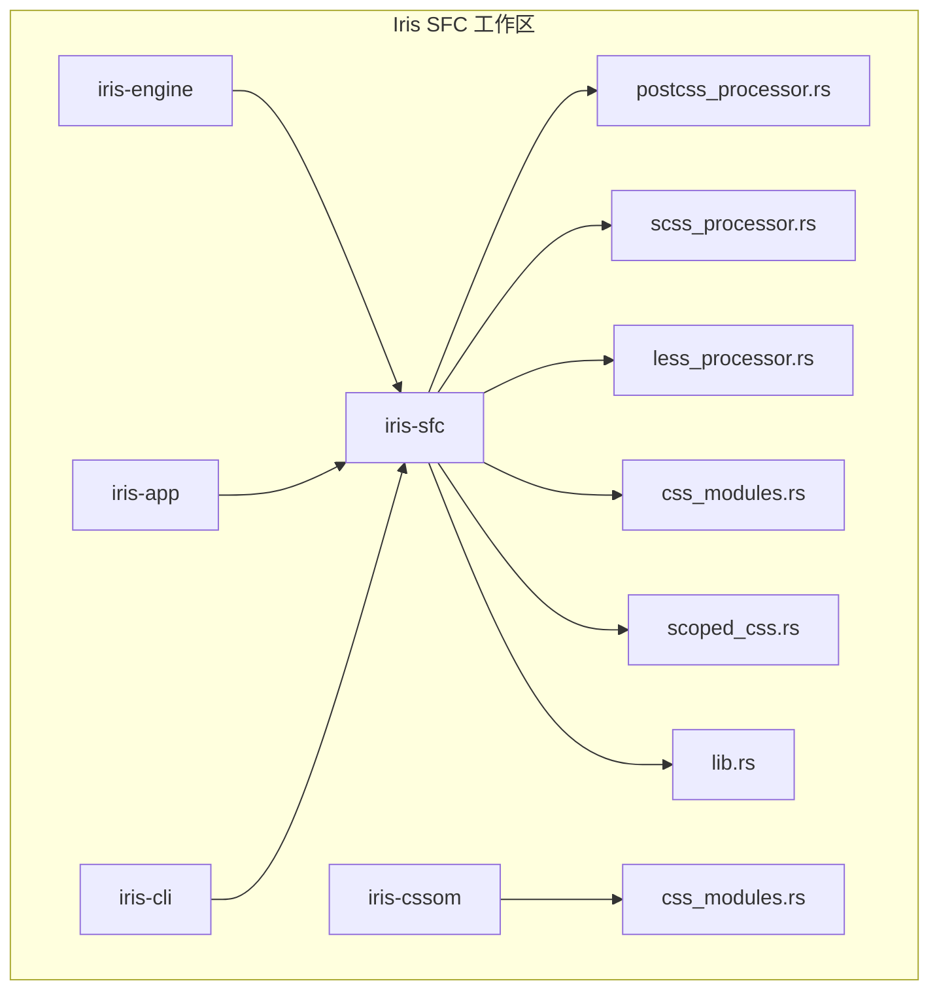
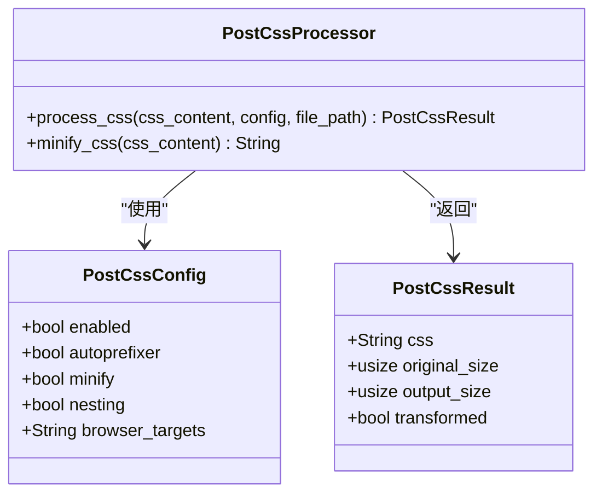
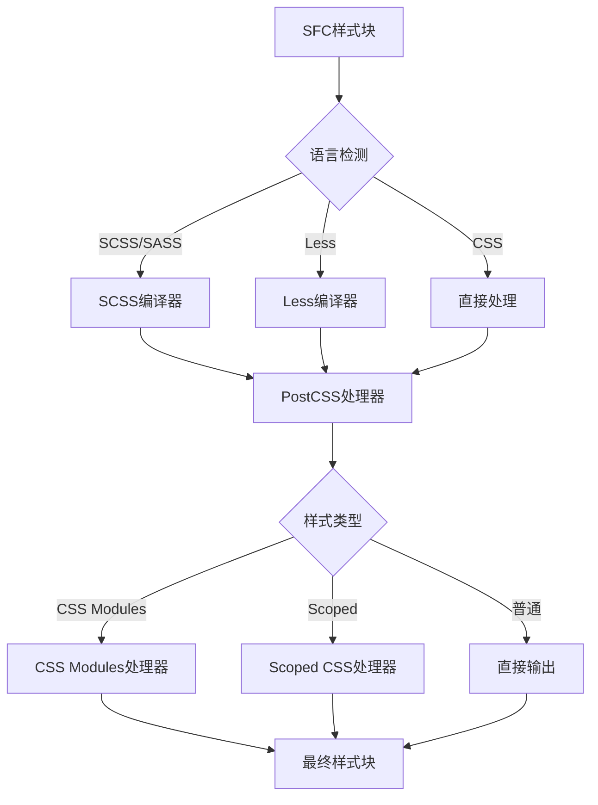
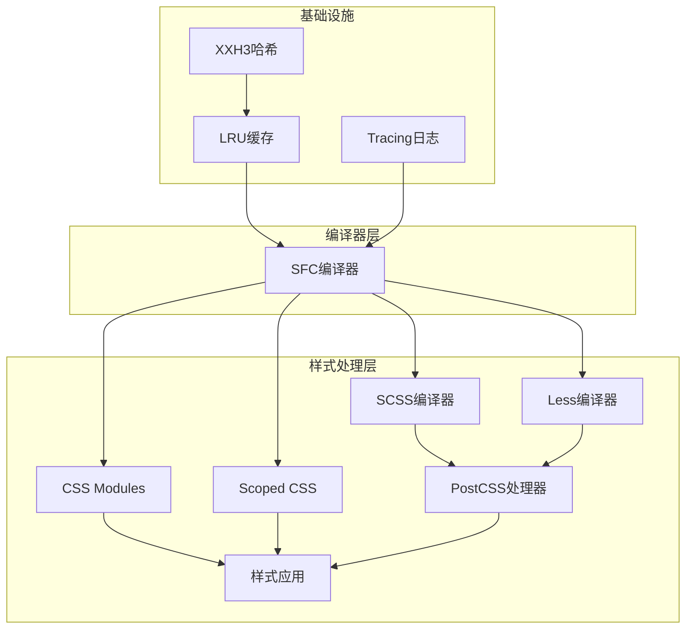
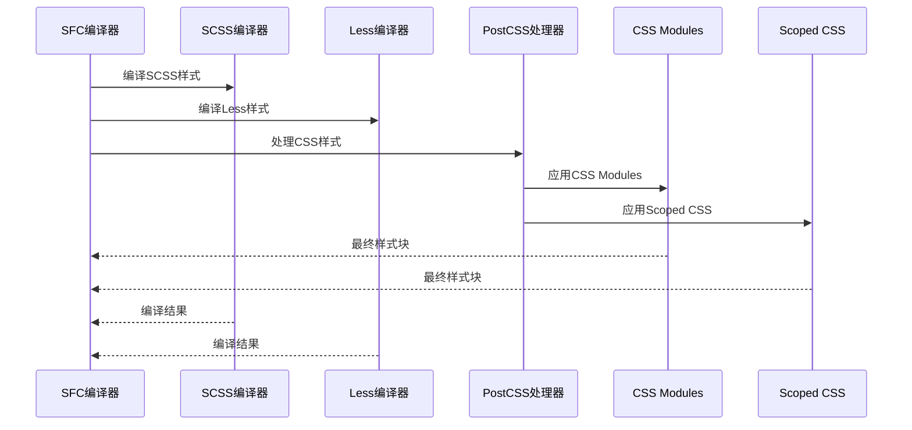
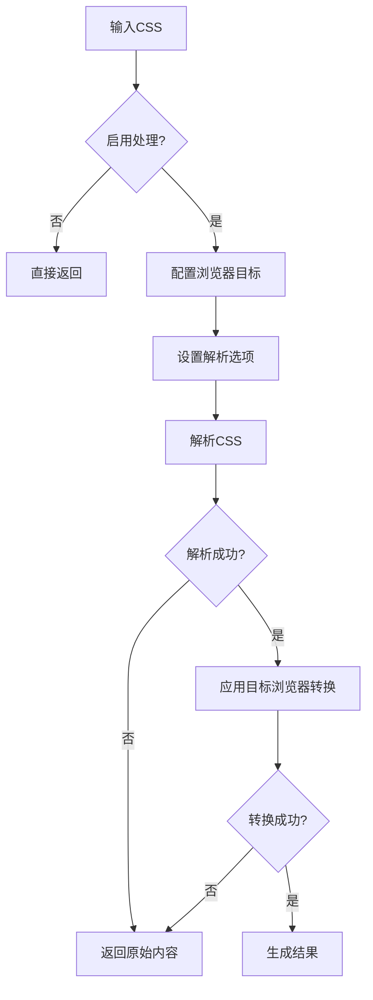
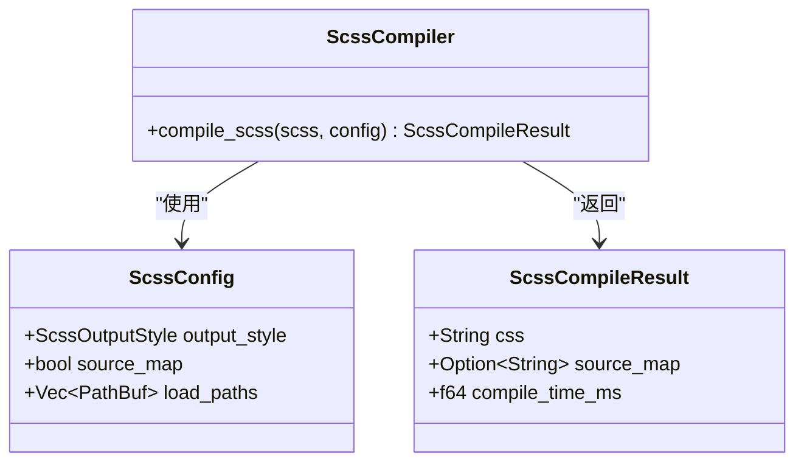
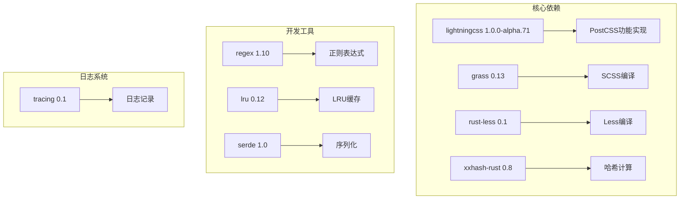
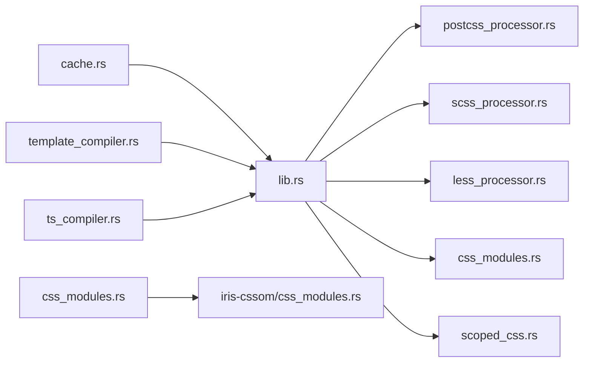
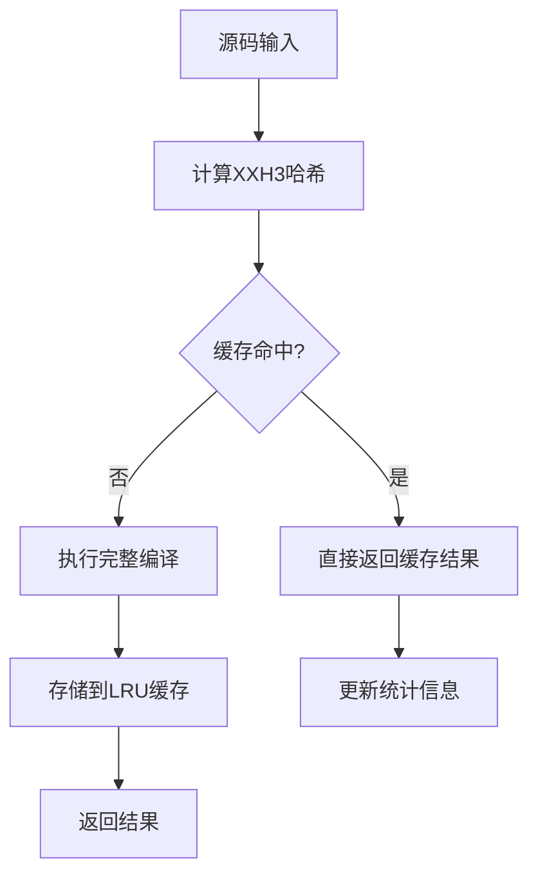

# PostCSS集成系统

<cite>
**本文档引用的文件**
- [postcss_processor.rs](file://crates/iris-sfc/src/postcss_processor.rs)
- [lib.rs](file://crates/iris-sfc/src/lib.rs)
- [Cargo.toml](file://crates/iris-sfc/Cargo.toml)
- [README.md](file://crates/iris-sfc/README.md)
- [scss_processor.rs](file://crates/iris-sfc/src/scss_processor.rs)
- [less_processor.rs](file://crates/iris-sfc/src/less_processor.rs)
- [css_modules.rs](file://crates/iris-sfc/src/css_modules.rs)
- [scoped_css.rs](file://crates/iris-sfc/src/scoped_css.rs)
- [integration_test.rs](file://crates/iris-sfc/tests/integration_test.rs)
- [sfc_demo.rs](file://crates/iris-sfc/examples/sfc_demo.rs)
- [App.vue](file://examples/vue-demo/src/App.vue)
- [Cargo.toml](file://Cargo.toml)
</cite>

## 目录
1. [简介](#简介)
2. [项目结构](#项目结构)
3. [核心组件](#核心组件)
4. [架构概览](#架构概览)
5. [详细组件分析](#详细组件分析)
6. [依赖关系分析](#依赖关系分析)
7. [性能考虑](#性能考虑)
8. [故障排除指南](#故障排除指南)
9. [结论](#结论)

## 简介

PostCSS集成系统是Iris SFC（Single File Component）编译器的核心样式处理模块，提供完整的CSS预处理和后处理能力。该系统使用lightningcss Rust原生引擎替代传统的Node.js PostCSS工具链，实现了零外部依赖的高性能CSS处理解决方案。

系统主要功能包括：
- **PostCSS等价功能**：Autoprefixer、CSS嵌套、CSS变量回退、CSS压缩优化
- **预处理器支持**：SCSS和Less编译
- **CSS Modules**：类名作用域化和映射生成
- **Scoped CSS**：Vue风格的作用域样式
- **零依赖架构**：完全基于Rust实现

## 项目结构

Iris SFC项目采用多crate工作区架构，PostCSS集成系统位于iris-sfc crate中：



**图表来源**
- [Cargo.toml:1-50](file://Cargo.toml#L1-L50)
- [Cargo.toml:1-46](file://crates/iris-sfc/Cargo.toml#L1-L46)

**章节来源**
- [Cargo.toml:1-50](file://Cargo.toml#L1-L50)
- [Cargo.toml:1-46](file://crates/iris-sfc/Cargo.toml#L1-L46)

## 核心组件

### PostCSS处理器

PostCSS处理器是系统的核心组件，提供完整的CSS处理能力：



**图表来源**
- [postcss_processor.rs:18-57](file://crates/iris-sfc/src/postcss_processor.rs#L18-L57)

### 样式编译流水线

系统采用多阶段编译流水线，支持多种样式语言的统一处理：



**图表来源**
- [lib.rs:688-789](file://crates/iris-sfc/src/lib.rs#L688-L789)

**章节来源**
- [postcss_processor.rs:1-292](file://crates/iris-sfc/src/postcss_processor.rs#L1-L292)
- [lib.rs:688-789](file://crates/iris-sfc/src/lib.rs#L688-L789)

## 架构概览

### 系统架构图



**图表来源**
- [lib.rs:688-789](file://crates/iris-sfc/src/lib.rs#L688-L789)
- [scss_processor.rs:88-120](file://crates/iris-sfc/src/scss_processor.rs#L88-L120)
- [less_processor.rs:81-132](file://crates/iris-sfc/src/less_processor.rs#L81-L132)

### 编译流程序列图



**图表来源**
- [lib.rs:688-789](file://crates/iris-sfc/src/lib.rs#L688-L789)

**章节来源**
- [lib.rs:688-789](file://crates/iris-sfc/src/lib.rs#L688-L789)

## 详细组件分析

### PostCSS处理器实现

PostCSS处理器使用lightningcss引擎实现完整的PostCSS功能：

#### 配置系统

处理器支持灵活的配置选项：

| 配置项 | 类型 | 默认值 | 描述 |
|--------|------|--------|------|
| enabled | bool | true | 是否启用PostCSS处理 |
| autoprefixer | bool | true | 是否启用浏览器前缀自动添加 |
| minify | bool | false | 是否启用CSS压缩 |
| nesting | bool | true | 是否启用CSS嵌套支持 |
| browser_targets | String | "" | 浏览器支持目标 |

#### 处理流程



**图表来源**
- [postcss_processor.rs:67-178](file://crates/iris-sfc/src/postcss_processor.rs#L67-L178)

#### 浏览器目标配置

系统支持两种浏览器目标配置方式：

1. **默认配置**：使用预设的浏览器版本
2. **自定义配置**：通过browserslist字符串指定

**章节来源**
- [postcss_processor.rs:18-178](file://crates/iris-sfc/src/postcss_processor.rs#L18-L178)

### 预处理器集成

#### SCSS编译器

SCSS编译器使用grass库实现完整的SCSS功能：



**图表来源**
- [scss_processor.rs:47-86](file://crates/iris-sfc/src/scss_processor.rs#L47-L86)

#### Less编译器

Less编译器提供基础的Less语法支持：

| 功能 | 支持状态 | 描述 |
|------|----------|------|
| 变量替换 | ✅ 完全支持 | 基础变量定义和引用 |
| 嵌套选择器 | ⚠️ 部分支持 | 有限的嵌套语法 |
| 父选择器 | ❌ 不支持 | `&` 语法不支持 |
| 媒体查询 | ⚠️ 部分支持 | 基础媒体查询支持 |

**章节来源**
- [scss_processor.rs:88-148](file://crates/iris-sfc/src/scss_processor.rs#L88-L148)
- [less_processor.rs:64-132](file://crates/iris-sfc/src/less_processor.rs#L64-L132)

### CSS Modules系统

CSS Modules提供类名作用域化和映射生成功能：

#### 类名作用域化流程

```mermaid
flowchart TD
A[原始CSS] --> B[提取类名]
B --> C{处理:global()}
C --> |是| D[保留类名]
C --> |否| E{处理:local()}
E --> |是| F[作用域化类名]
E --> |否| G[自动作用域化]
F --> H[生成映射表]
G --> H
D --> H
H --> I[最终CSS]
```

**图表来源**
- [css_modules.rs:74-122](file://crates/iris-sfc/src/css_modules.rs#L74-L122)

#### 作用域化算法

系统使用XXH3哈希算法生成短哈希值：

1. **内容哈希**：对CSS内容计算XXH3哈希
2. **短哈希生成**：取哈希值的低32位并格式化为8位十六进制
3. **类名替换**：将`.class`替换为`.class__hash`

**章节来源**
- [css_modules.rs:42-162](file://crates/iris-sfc/src/css_modules.rs#L42-L162)

### Scoped CSS实现

Scoped CSS处理器实现Vue风格的作用域样式：

#### 选择器作用域化规则

| 选择器类型 | 作用域化规则 | 示例 |
|------------|-------------|------|
| 简单类选择器 | `.class` → `.class[data-v-hash]` | `.button` → `.button[data-v-1a2b3c4d]` |
| 组合选择器 | 每个简单选择器都添加作用域 | `.button.active` → `.button[data-v-...].active[data-v-...]` |
| 伪类选择器 | 保持不变，不影响作用域 | `.button:hover` → `.button[data-v-...]:hover` |
| 组合器 | 作用域化基础选择器 | `div > p` → `div[data-v-...] > p[data-v-...]` |

**章节来源**
- [scoped_css.rs:139-258](file://crates/iris-sfc/src/scoped_css.rs#L139-L258)

## 依赖关系分析

### 外部依赖

PostCSS集成系统的主要外部依赖：



**图表来源**
- [Cargo.toml:11-46](file://crates/iris-sfc/Cargo.toml#L11-L46)

### 内部模块依赖



**图表来源**
- [lib.rs:11-26](file://crates/iris-sfc/src/lib.rs#L11-L26)

**章节来源**
- [Cargo.toml:11-46](file://crates/iris-sfc/Cargo.toml#L11-L46)
- [lib.rs:11-26](file://crates/iris-sfc/src/lib.rs#L11-L26)

## 性能考虑

### 编译性能优化

系统采用多种策略确保高性能：

1. **零依赖架构**：避免Node.js运行时开销
2. **Rust原生实现**：利用Rust的高性能特性
3. **LRU缓存系统**：内存中缓存编译结果
4. **预编译正则表达式**：避免重复编译正则

### 缓存策略



**图表来源**
- [cache.rs:178-256](file://crates/iris-sfc/src/cache.rs#L178-L256)

### 性能基准

| 操作类型 | 时间消耗 | 说明 |
|----------|----------|------|
| 首次编译 | 1-3ms | 包含所有编译步骤 |
| 缓存命中 | <10μs | LRU缓存直接返回 |
| 模板编译 | <1ms | 取决于模板复杂度 |
| CSS Modules | <1ms | 取决于样式数量 |

**章节来源**
- [cache.rs:136-299](file://crates/iris-sfc/src/cache.rs#L136-L299)
- [README.md:618-624](file://crates/iris-sfc/README.md#L618-L624)

## 故障排除指南

### 常见问题及解决方案

#### PostCSS处理失败

**症状**：CSS处理过程中出现错误，返回原始内容

**原因分析**：
1. CSS语法错误
2. 浏览器目标配置问题
3. lightningcss引擎异常

**解决方法**：
1. 检查CSS语法完整性
2. 验证浏览器目标配置格式
3. 查看详细错误日志

#### SCSS编译错误

**症状**：SCSS编译失败，返回错误信息

**常见原因**：
1. SCSS语法错误
2. 不支持的SCSS特性
3. grass库版本限制

**解决方法**：
1. 简化SCSS语法
2. 避免使用高级特性
3. 更新grass库版本

#### CSS Modules冲突

**症状**：CSS Modules作用域化异常

**原因分析**：
1. 类名命名冲突
2. 作用域化算法问题
3. 全局样式处理不当

**解决方法**：
1. 检查类名唯一性
2. 使用`:global()`声明全局样式
3. 验证作用域化规则

**章节来源**
- [postcss_processor.rs:125-177](file://crates/iris-sfc/src/postcss_processor.rs#L125-L177)
- [scss_processor.rs:101-105](file://crates/iris-sfc/src/scss_processor.rs#L101-L105)

### 调试技巧

1. **启用详细日志**：使用`RUST_LOG=debug`查看详细处理过程
2. **性能分析**：监控编译时间和缓存命中率
3. **错误追踪**：查看具体的错误位置和上下文信息

## 结论

PostCSS集成系统通过Rust原生实现提供了高性能、零依赖的CSS处理解决方案。系统具有以下优势：

1. **高性能**：基于lightningcss的Rust实现，编译速度快
2. **零依赖**：完全避免Node.js运行时开销
3. **功能完整**：支持PostCSS主要功能和现代CSS特性
4. **易于集成**：提供简洁的API接口
5. **可扩展性**：模块化设计便于功能扩展

该系统为Iris框架提供了坚实的样式处理基础，支持现代Vue.js开发工作流，同时保持了Rust生态系统的性能和安全性优势。