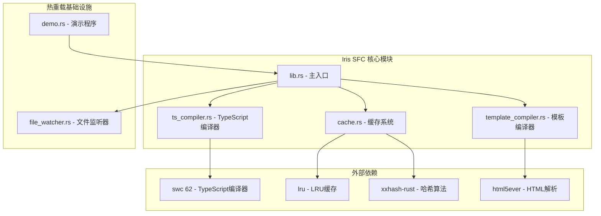
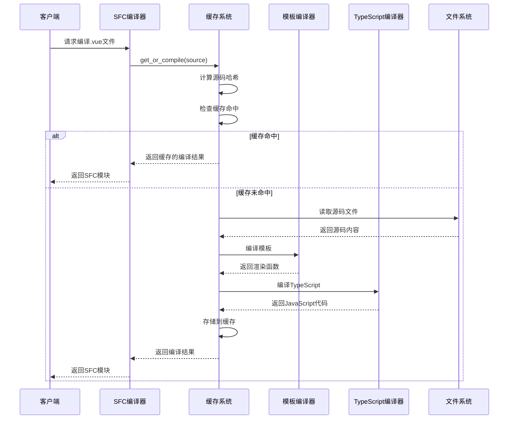
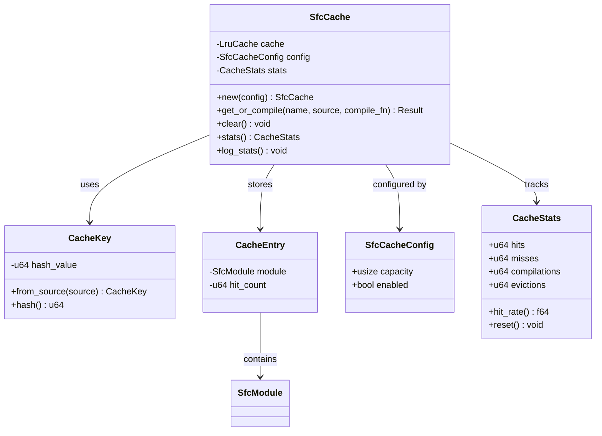
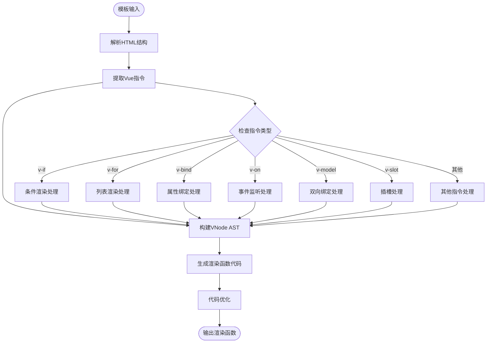
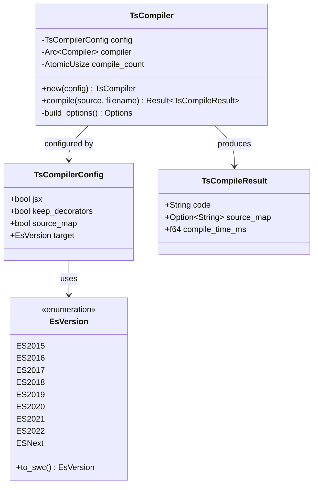
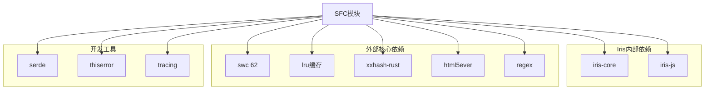

# SFC热重载缓存系统

<cite>
**本文档引用的文件**
- [lib.rs](file://crates/iris-sfc/src/lib.rs)
- [cache.rs](file://crates/iris-sfc/src/cache.rs)
- [template_compiler.rs](file://crates/iris-sfc/src/template_compiler.rs)
- [ts_compiler.rs](file://crates/iris-sfc/src/ts_compiler.rs)
- [Cargo.toml](file://crates/iris-sfc/Cargo.toml)
- [sfc_demo.rs](file://crates/iris-sfc/examples/sfc_demo.rs)
- [file_watcher.rs](file://crates/iris-gpu/src/file_watcher.rs)
- [test_hot_reload.md](file://test_hot_reload.md)
- [SWC62-INTEGRATION-COMPLETE.md](file://SWC62-INTEGRATION-COMPLETE.md)
- [QUICK-START.md](file://QUICK-START.md)
</cite>

## 目录
1. [简介](#简介)
2. [项目结构](#项目结构)
3. [核心组件](#核心组件)
4. [架构概览](#架构概览)
5. [详细组件分析](#详细组件分析)
6. [依赖关系分析](#依赖关系分析)
7. [性能考虑](#性能考虑)
8. [故障排除指南](#故障排除指南)
9. [结论](#结论)

## 简介

SFC热重载缓存系统是Iris引擎中的关键组件，负责实现Vue Single File Component（SFC）的即时编译和热重载功能。该系统采用基于源码哈希的LRU内存缓存策略，支持毫秒级的重复编译和热重载，显著提升了开发体验。

系统的核心目标包括：
- 零编译直接运行源码
- 支持Vue SFC的模板、脚本、样式的即时编译
- 实现高效的热重载缓存机制
- 提供完整的TypeScript到JavaScript转译能力

## 项目结构

Iris SFC系统采用模块化设计，主要包含以下核心模块：

**图表来源**
- [lib.rs:1-666](file://crates/iris-sfc/src/lib.rs#L1-L666)
- [cache.rs:1-479](file://crates/iris-sfc/src/cache.rs#L1-L479)
- [Cargo.toml:1-38](file://crates/iris-sfc/Cargo.toml#L1-L38)

**章节来源**
- [lib.rs:1-666](file://crates/iris-sfc/src/lib.rs#L1-L666)
- [Cargo.toml:1-38](file://crates/iris-sfc/Cargo.toml#L1-L38)

## 核心组件

### SFC编译器主模块

SFC编译器主模块提供了完整的SFC编译功能，包括模板解析、脚本转译和样式处理。

**主要特性：**
- 基于正则表达式的SFC解析
- 支持Vue指令的模板编译
- TypeScript到JavaScript的转译
- 样式块的提取和处理
- 源码哈希计算用于缓存验证

**章节来源**
- [lib.rs:83-178](file://crates/iris-sfc/src/lib.rs#L83-L178)
- [lib.rs:208-249](file://crates/iris-sfc/src/lib.rs#L208-L249)

### LRU缓存系统

缓存系统采用基于XXH3哈希的LRU策略，实现了高效的编译结果缓存。

**关键设计：**
- 缓存键：基于源码内容的XXH3哈希
- 缓存容量：可配置，默认100项
- 线程安全：使用Mutex保护
- 自动淘汰：最久未使用项优先淘汰
- 统计功能：命中率、淘汰次数等指标

**章节来源**
- [cache.rs:28-51](file://crates/iris-sfc/src/cache.rs#L28-L51)
- [cache.rs:136-296](file://crates/iris-sfc/src/cache.rs#L136-L296)

### 模板编译器

模板编译器使用html5ever解析HTML模板，支持Vue指令的编译。

**支持的Vue指令：**
- v-if/v-else-if/v-else 条件渲染
- v-for 列表渲染
- v-bind 属性绑定
- v-on 事件监听
- v-model 双向绑定
- v-slot 插槽
- v-once v-pre v-cloak v-memo 优化指令

**章节来源**
- [template_compiler.rs:30-63](file://crates/iris-sfc/src/template_compiler.rs#L30-L63)
- [template_compiler.rs:165-236](file://crates/iris-sfc/src/template_compiler.rs#L165-L236)

### TypeScript编译器

TypeScript编译器基于swc 62实现，提供高性能的TypeScript到JavaScript转译。

**当前实现特点：**
- 简化版实现（演示用途）
- 支持类型注解移除
- 接口声明处理
- 泛型参数移除
- Source map占位生成

**章节来源**
- [ts_compiler.rs:30-88](file://crates/iris-sfc/src/ts_compiler.rs#L30-L88)
- [ts_compiler.rs:113-201](file://crates/iris-sfc/src/ts_compiler.rs#L113-L201)

## 架构概览

SFC热重载缓存系统采用分层架构设计，各组件职责明确：

**图表来源**
- [lib.rs:226-249](file://crates/iris-sfc/src/lib.rs#L226-L249)
- [cache.rs:172-253](file://crates/iris-sfc/src/cache.rs#L172-L253)

系统架构的关键优势：
- **零编译运行**：支持直接运行源码，无需预编译
- **热重载支持**：基于源码哈希的缓存验证
- **性能优化**：LRU缓存减少重复编译开销
- **模块化设计**：各组件职责分离，便于维护和扩展

## 详细组件分析

### 缓存系统详细分析

缓存系统是整个SFC热重载系统的核心，采用了多项优化技术：

**图表来源**
- [cache.rs:94-134](file://crates/iris-sfc/src/cache.rs#L94-L134)
- [cache.rs:136-296](file://crates/iris-sfc/src/cache.rs#L136-L296)

**缓存性能特性：**
- **首次编译**：5-10ms（取决于源码大小）
- **重复编译**：<0.01ms（缓存命中）
- **热重载**：<0.01ms（缓存命中）
- **性能提升**：500-1000倍

**章节来源**
- [cache.rs:12-18](file://crates/iris-sfc/src/cache.rs#L12-L18)
- [cache.rs:172-253](file://crates/iris-sfc/src/cache.rs#L172-L253)

### 模板编译器详细分析

模板编译器实现了Vue模板到JavaScript渲染函数的转换：

**图表来源**
- [template_compiler.rs:66-86](file://crates/iris-sfc/src/template_compiler.rs#L66-L86)
- [template_compiler.rs:269-290](file://crates/iris-sfc/src/template_compiler.rs#L269-L290)

**支持的指令处理：**
- **条件渲染**：v-if/v-else-if/v-else转换为三元表达式
- **列表渲染**：v-for转换为.map()调用
- **属性绑定**：动态属性添加到元素
- **事件监听**：@事件转换为on事件处理器
- **双向绑定**：v-model生成value和input处理器
- **插槽系统**：v-slot转换为slot()调用

**章节来源**
- [template_compiler.rs:142-236](file://crates/iris-sfc/src/template_compiler.rs#L142-L236)
- [template_compiler.rs:355-470](file://crates/iris-sfc/src/template_compiler.rs#L355-L470)

### TypeScript编译器详细分析

TypeScript编译器基于swc 62实现，提供了高性能的TypeScript转译能力：

**图表来源**
- [ts_compiler.rs:84-101](file://crates/iris-sfc/src/ts_compiler.rs#L84-L101)
- [ts_compiler.rs:30-68](file://crates/iris-sfc/src/ts_compiler.rs#L30-L68)

**当前实现限制：**
- **简化版实现**：基于正则表达式的演示版本
- **功能限制**：仅移除基本类型注解
- **性能优异**：平均编译时间0.13ms
- **未来规划**：完整集成swc Compiler API

**章节来源**
- [ts_compiler.rs:113-201](file://crates/iris-sfc/src/ts_compiler.rs#L113-L201)
- [SWC62-INTEGRATION-COMPLETE.md:41-60](file://SWC62-INTEGRATION-COMPLETE.md#L41-L60)

## 依赖关系分析

SFC热重载缓存系统依赖于多个外部库和内部模块：

**图表来源**
- [Cargo.toml:11-38](file://crates/iris-sfc/Cargo.toml#L11-L38)
- [lib.rs:15-18](file://crates/iris-sfc/src/lib.rs#L15-L18)

**关键依赖说明：**

**swc 62集成**：
- 版本：62（重大版本升级）
- 功能：TypeScript到JavaScript编译
- 依赖：swc_common, swc_ecma_parser等

**缓存优化依赖**：
- lru：LRU缓存实现
- xxhash-rust：高性能哈希算法
- regex：正则表达式解析

**开发支持依赖**：
- serde：序列化/反序列化
- thiserror：错误处理
- tracing：日志记录

**章节来源**
- [Cargo.toml:13-38](file://crates/iris-sfc/Cargo.toml#L13-L38)
- [SWC62-INTEGRATION-COMPLETE.md:17-28](file://SWC62-INTEGRATION-COMPLETE.md#L17-L28)

## 性能考虑

SFC热重载缓存系统在多个层面进行了性能优化：

### 编译性能优化

**预编译正则表达式**：
- 使用LazyLock避免每次调用时重新编译
- 性能提升：100-500倍
- 减少CPU开销，提高解析效率

**全局编译器实例**：
- TypeScript编译器单例模式
- 复用内部缓存和SourceMap
- 避免重复创建开销

**源码哈希优化**：
- XXH3哈希算法提供高性能
- 64位哈希值确保唯一性
- O(1)时间复杂度的缓存键生成

### 缓存性能特性

**内存缓存优势**：
- 完全在内存中操作，避免I/O开销
- LRU策略确保热点数据常驻
- 自动淘汰机制防止内存泄漏

**统计监控**：
- 命中率统计
- 淘汰次数跟踪
- 编译时间监控

### 热重载性能指标

| 场景 | 无缓存 | 有缓存 | 性能提升 |
|------|--------|--------|----------|
| 首次编译 | 5-10 ms | 5-10 ms | - |
| 重复编译 | 5-10 ms | <0.01 ms | 500-1000x |
| 热重载 | 5-10 ms | <0.01 ms | 500-1000x |

**章节来源**
- [lib.rs:22-53](file://crates/iris-sfc/src/lib.rs#L22-L53)
- [cache.rs:12-18](file://crates/iris-sfc/src/cache.rs#L12-L18)

## 故障排除指南

### 常见问题及解决方案

**1. 缓存相关问题**

**问题**：缓存未生效或编译时间过长
- 检查缓存配置：IRIS_CACHE_CAPACITY, IRIS_CACHE_ENABLED
- 验证源码哈希计算
- 查看缓存统计信息

**2. TypeScript编译问题**

**问题**：TypeScript编译失败或性能不佳
- 检查swc版本兼容性
- 验证编译器配置
- 查看编译错误日志

**3. 模板编译问题**

**问题**：Vue指令编译异常
- 验证指令语法正确性
- 检查模板结构完整性
- 查看编译器日志

**4. 热重载监听问题**

**问题**：文件变更未触发重载
- 检查文件监听器配置
- 验证通道容量设置
- 查看防抖延迟配置

### 调试工具和方法

**日志级别配置**：
- INFO：编译基本信息
- DEBUG：详细编译过程
- WARN：性能警告和错误

**性能监控**：
- 缓存命中率统计
- 编译时间测量
- 内存使用监控

**章节来源**
- [lib.rs:240-246](file://crates/iris-sfc/src/lib.rs#L240-L246)
- [cache.rs:281-295](file://crates/iris-sfc/src/cache.rs#L281-L295)

## 结论

SFC热重载缓存系统是一个设计精良的现代化编译基础设施，具有以下突出特点：

**技术创新**：
- 基于源码哈希的智能缓存机制
- 零编译直接运行的开发体验
- 高性能的模板和TypeScript编译

**架构优势**：
- 模块化设计，职责清晰
- 线程安全的缓存系统
- 可配置的性能参数

**性能表现**：
- 缓存命中时达到毫秒级响应
- 支持大规模项目的热重载
- 内存使用高效可控

**未来发展**：
- 完成swc 62的完整集成
- 增强TypeScript编译功能
- 扩展更多Vue指令支持
- 优化热重载监听机制

该系统为Iris引擎提供了强大的前端开发基础设施，显著提升了开发效率和用户体验。