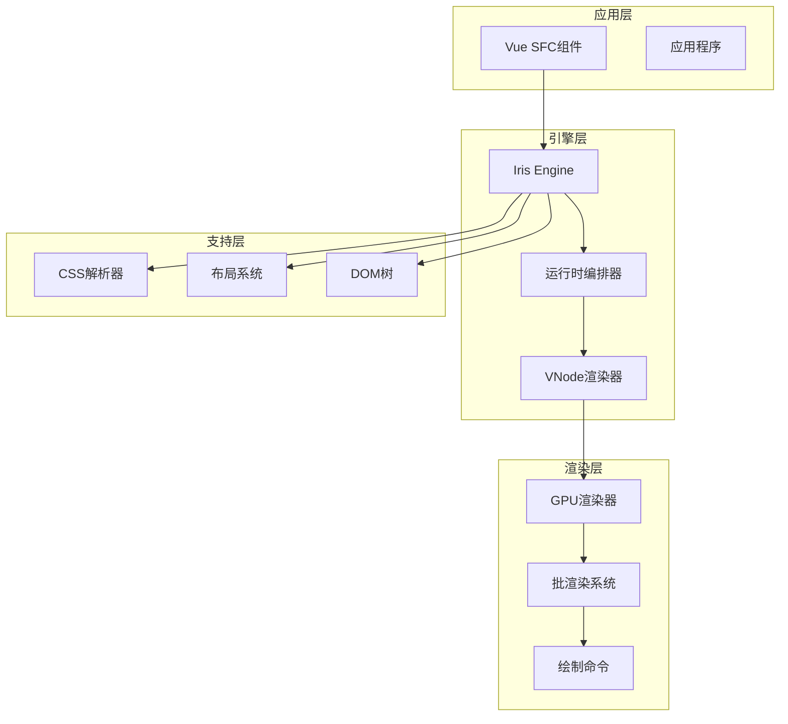
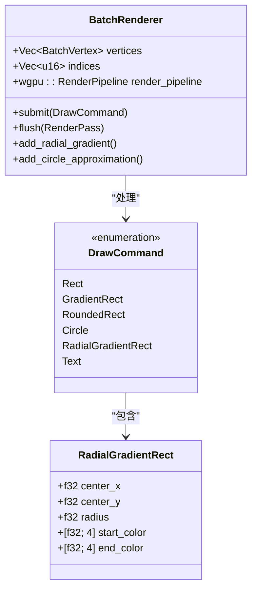
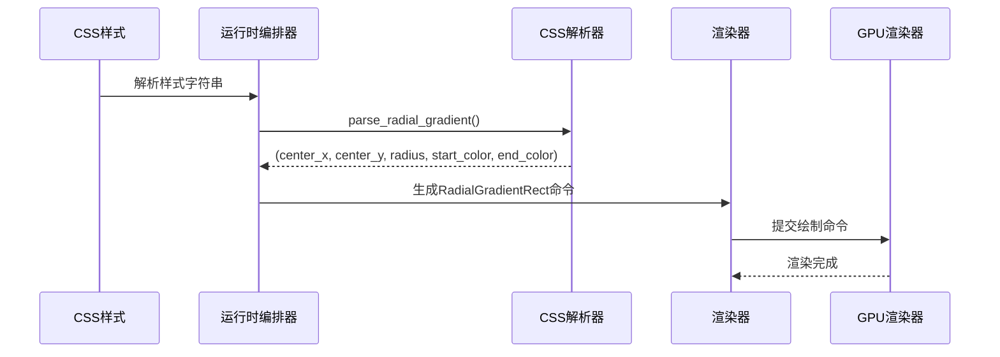
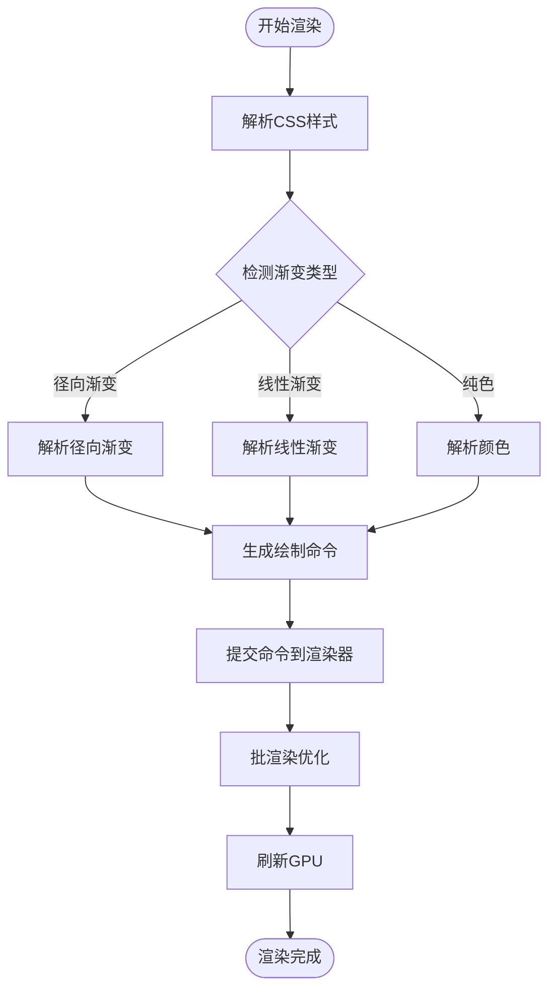
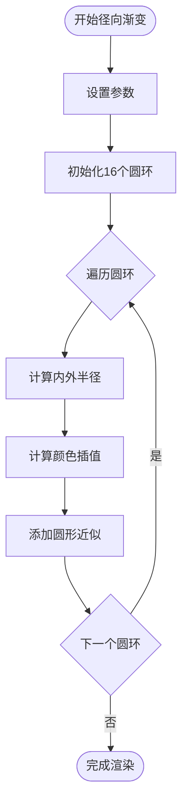
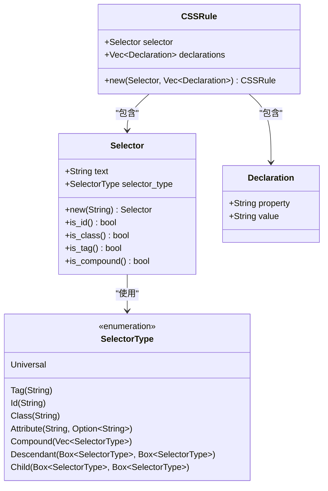
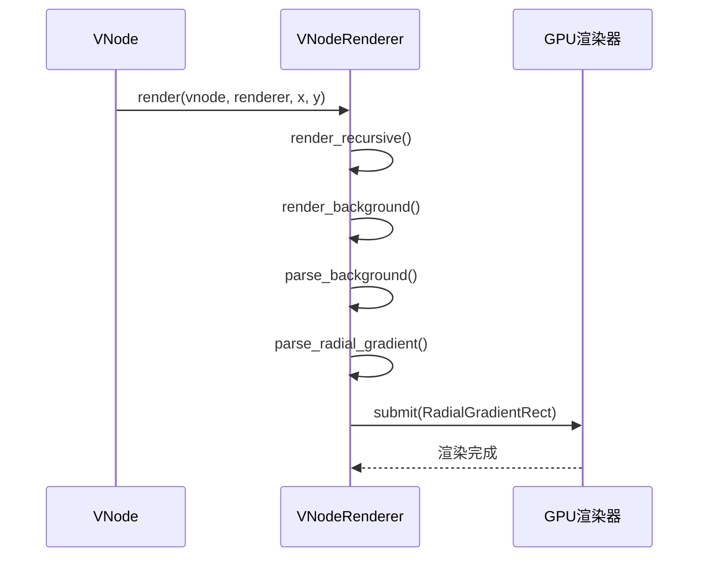
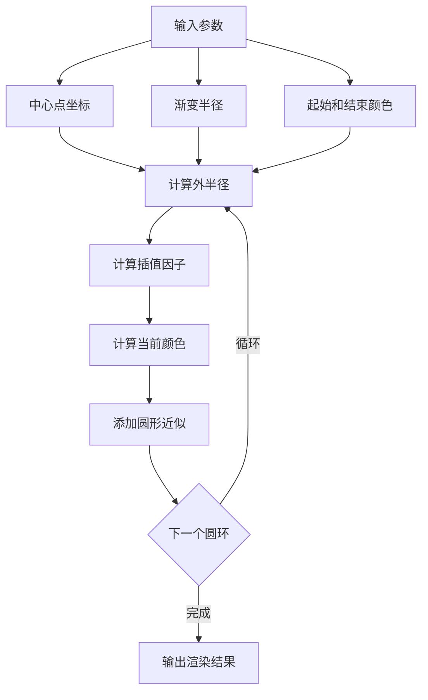
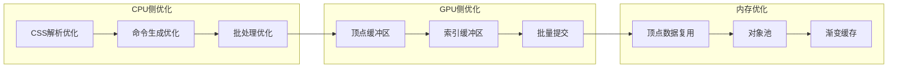
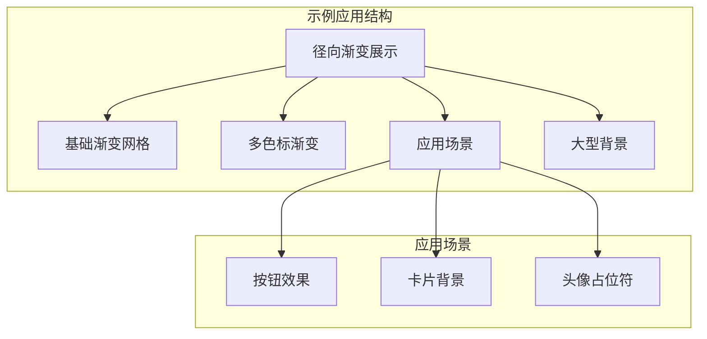

# Vue SFC径向渐变实现指南

<cite>
**本文档引用的文件**
- [VUE_SFC_RADIAL_GRADIENT_GUIDE.md](file://VUE_SFC_RADIAL_GRADIENT_GUIDE.md)
- [RADIAL_GRADIENT_IMPLEMENTATION.md](file://RADIAL_GRADIENT_IMPLEMENTATION.md)
- [GRADIENT_BACKGROUND_IMPLEMENTATION.md](file://GRADIENT_BACKGROUND_IMPLEMENTATION.md)
- [radial_gradient_demo.vue](file://crates/iris-engine/examples/radial_gradient_demo.vue)
- [radial_gradient_demo.rs](file://crates/iris-engine/examples/radial_gradient_demo.rs)
- [radial_gradient_window.rs](file://crates/iris-engine/examples/radial_gradient_window.rs)
- [batch_renderer.rs](file://crates/iris-gpu/src/batch_renderer.rs)
- [orchestrator.rs](file://crates/iris-engine/src/orchestrator.rs)
- [vnode_renderer.rs](file://crates/iris-engine/src/vnode_renderer.rs)
- [css.rs](file://crates/iris-cssom/src/css.rs)
</cite>

## 目录
1. [简介](#简介)
2. [项目结构概览](#项目结构概览)
3. [核心组件分析](#核心组件分析)
4. [架构设计](#架构设计)
5. [详细实现分析](#详细实现分析)
6. [性能优化特性](#性能优化特性)
7. [使用示例](#使用示例)
8. [故障排除指南](#故障排除指南)
9. [总结](#总结)

## 简介

Iris Engine 是一个基于 Rust 和 WebGPU 的高性能前端运行时框架，专门针对 Vue 3 应用程序提供原生渲染支持。本文档详细介绍如何在 Vue SFC（单文件组件）中使用径向渐变功能，所有渐变效果均通过 GPU 实时渲染，确保最佳性能和视觉质量。

该实现包含了完整的径向渐变解析、渲染管道和优化策略，支持多种颜色格式和渐变样式，为现代 Web 应用提供了强大的视觉表现能力。

## 项目结构概览

Iris Engine 采用模块化架构设计，主要包含以下核心模块：



**图表来源**
- [orchestrator.rs:1-50](file://crates/iris-engine/src/orchestrator.rs#L1-L50)
- [batch_renderer.rs:1-50](file://crates/iris-gpu/src/batch_renderer.rs#L1-L50)

**章节来源**
- [orchestrator.rs:1-150](file://crates/iris-engine/src/orchestrator.rs#L1-L150)
- [batch_renderer.rs:1-100](file://crates/iris-gpu/src/batch_renderer.rs#L1-L100)

## 核心组件分析

### GPU渲染器架构

Iris Engine 的 GPU 渲染器采用批处理架构，通过单一的 flush 调用提交所有绘制命令，显著减少了 GPU 状态切换开销：



**图表来源**
- [batch_renderer.rs:54-193](file://crates/iris-gpu/src/batch_renderer.rs#L54-L193)
- [batch_renderer.rs:163-175](file://crates/iris-gpu/src/batch_renderer.rs#L163-L175)

### CSS解析与集成

运行时编排器负责解析 CSS 样式并生成相应的渲染命令：



**图表来源**
- [orchestrator.rs:608-627](file://crates/iris-engine/src/orchestrator.rs#L608-L627)
- [batch_renderer.rs:549-559](file://crates/iris-gpu/src/batch_renderer.rs#L549-L559)

**章节来源**
- [batch_renderer.rs:54-193](file://crates/iris-gpu/src/batch_renderer.rs#L54-L193)
- [orchestrator.rs:507-656](file://crates/iris-engine/src/orchestrator.rs#L507-L656)

## 架构设计

### 渲染流水线

Iris Engine 的渲染流水线采用分层架构，确保高效的数据流和清晰的职责分离：



**图表来源**
- [orchestrator.rs:518-656](file://crates/iris-engine/src/orchestrator.rs#L518-L656)
- [batch_renderer.rs:428-582](file://crates/iris-gpu/src/batch_renderer.rs#L428-L582)

### 径向渐变算法

径向渐变通过 16 个同心圆环的组合来实现平滑的颜色过渡：



**图表来源**
- [batch_renderer.rs:703-767](file://crates/iris-gpu/src/batch_renderer.rs#L703-L767)

**章节来源**
- [RADIAL_GRADIENT_IMPLEMENTATION.md:58-108](file://RADIAL_GRADIENT_IMPLEMENTATION.md#L58-L108)
- [batch_renderer.rs:694-767](file://crates/iris-gpu/src/batch_renderer.rs#L694-L767)

## 详细实现分析

### CSS解析器实现

CSS 解析器支持多种选择器类型和复杂的样式解析：



**图表来源**
- [css.rs:7-74](file://crates/iris-cssom/src/css.rs#L7-L74)
- [css.rs:161-168](file://crates/iris-cssom/src/css.rs#L161-L168)

### VNode渲染器

VNode 渲染器负责将虚拟 DOM 树转换为 GPU 绘制命令：



**图表来源**
- [vnode_renderer.rs:115-187](file://crates/iris-engine/src/vnode_renderer.rs#L115-L187)
- [vnode_renderer.rs:189-240](file://crates/iris-engine/src/vnode_renderer.rs#L189-L240)

**章节来源**
- [css.rs:180-234](file://crates/iris-cssom/src/css.rs#L180-L234)
- [vnode_renderer.rs:115-187](file://crates/iris-engine/src/vnode_renderer.rs#L115-L187)

### 径向渐变渲染算法

径向渐变渲染算法通过数学插值实现平滑的颜色过渡：



**图表来源**
- [batch_renderer.rs:716-744](file://crates/iris-gpu/src/batch_renderer.rs#L716-L744)

**章节来源**
- [RADIAL_GRADIENT_IMPLEMENTATION.md:13-31](file://RADIAL_GRADIENT_IMPLEMENTATION.md#L13-L31)
- [batch_renderer.rs:703-767](file://crates/iris-gpu/src/batch_renderer.rs#L703-L767)

## 性能优化特性

### 批渲染优化

Iris Engine 采用批渲染技术，将多个绘制命令合并为单次 GPU 提交：

| 指标 | 值 | 说明 |
|------|-----|------|
| **圆环数量** | 16 | 平衡质量和性能 |
| **顶点数/渐变** | ~1024 | 16 圆环 × 64 顶点 |
| **绘制调用** | 16 | 每个圆环一次绘制 |
| **渲染方式** | GPU 批渲染 | 高效提交 |
| **内存使用** | 低 | 顶点缓冲区复用 |

### 渲染性能分析



**图表来源**
- [batch_renderer.rs:198-220](file://crates/iris-gpu/src/batch_renderer.rs#L198-L220)

**章节来源**
- [RADIAL_GRADIENT_IMPLEMENTATION.md:183-197](file://RADIAL_GRADIENT_IMPLEMENTATION.md#L183-L197)
- [batch_renderer.rs:198-220](file://crates/iris-gpu/src/batch_renderer.rs#L198-L220)

## 使用示例

### 基础径向渐变使用

在 Vue SFC 中使用径向渐变非常简单，只需在样式中添加标准 CSS 语法：

```vue
<template>
  <div class="gradient-container">
    <div class="gradient-card">
      <h2>径向渐变卡片</h2>
    </div>
  </div>
</template>

<style>
.gradient-card {
  width: 300px;
  height: 200px;
  border-radius: 16px;
  background: radial-gradient(circle, white, #6b5b95);
  box-shadow: 0 4px 12px rgba(0, 0, 0, 0.3);
}
</style>
```

### 多种颜色格式支持

Iris Engine 支持多种颜色格式的径向渐变：

```vue
<style>
/* 十六进制颜色 */
.hex-gradient {
  background: radial-gradient(circle, #ffffff, #6b5b95);
}

/* RGB颜色 */
.rgb-gradient {
  background: radial-gradient(circle, rgb(255, 255, 255), rgb(107, 91, 149));
}

/* RGBA颜色（带透明度） */
.rgba-gradient {
  background: radial-gradient(circle, rgba(255, 255, 255, 0.9), rgba(107, 91, 149, 0.9));
}

/* 颜色名称 */
.name-gradient {
  background: radial-gradient(circle, white, purple);
}
</style>
```

### 多色标渐变

支持三个或更多颜色的渐变效果：

```vue
<style>
/* 三色渐变 */
.tri-color {
  background: radial-gradient(circle, #ff0000, #ffff00, #0000ff);
}

/* 多色渐变 */
.multi-color {
  background: radial-gradient(circle, #ff6b6b, #ffd700, #4ecdc4, #45b7d1);
}
</style>
```

**章节来源**
- [VUE_SFC_RADIAL_GRADIENT_GUIDE.md:18-137](file://VUE_SFC_RADIAL_GRADIENT_GUIDE.md#L18-L137)
- [radial_gradient_demo.vue:174-198](file://crates/iris-engine/examples/radial_gradient_demo.vue#L174-L198)

### 完整示例应用

项目提供了完整的示例应用，展示各种径向渐变的使用场景：



**图表来源**
- [radial_gradient_demo.vue:8-88](file://crates/iris-engine/examples/radial_gradient_demo.vue#L8-L88)

**章节来源**
- [radial_gradient_demo.vue:1-333](file://crates/iris-engine/examples/radial_gradient_demo.vue#L1-L333)
- [VUE_SFC_RADIAL_GRADIENT_GUIDE.md:86-260](file://VUE_SFC_RADIAL_GRADIENT_GUIDE.md#L86-L260)

## 故障排除指南

### 常见问题及解决方案

#### 1. 渐变效果不显示

**可能原因**：
- CSS 样式未正确解析
- 渐变参数超出有效范围
- GPU 渲染器未正确初始化

**解决方案**：
```rust
// 确保渐变参数有效
if let Some((center_x, center_y, radius, start_color, end_color)) = 
    parse_radial_gradient(style) {
    // 验证参数范围
    if radius > 0.0 && radius <= max_radius {
        commands.push(DrawCommand::RadialGradientRect {
            center_x: x + center_x,
            center_y: y + center_y,
            radius,
            start_color,
            end_color,
        });
    }
}
```

#### 2. 性能问题

**优化建议**：
- 控制同时渲染的渐变数量
- 使用渐变缓存减少重复计算
- 调整圆环数量平衡质量与性能

#### 3. 颜色显示异常

**检查清单**：
- 颜色值格式是否正确
- RGBA 值是否在 0.0-1.0 范围内
- 透明度处理是否符合预期

**章节来源**
- [orchestrator.rs:608-627](file://crates/iris-engine/src/orchestrator.rs#L608-L627)
- [batch_renderer.rs:703-767](file://crates/iris-gpu/src/batch_renderer.rs#L703-L767)

### 调试技巧

1. **启用详细日志**：使用 `tracing` 宏记录渲染过程
2. **性能监控**：监控帧率和 GPU 使用情况
3. **内存跟踪**：观察顶点缓冲区使用情况
4. **渐变验证**：检查生成的绘制命令数量

## 总结

Iris Engine 的径向渐变实现代表了现代 Web 渲染技术的先进水平，具有以下核心优势：

### 技术成就

1. **GPU加速渲染**：所有渐变效果在 GPU 上实时渲染
2. **高质量算法**：16 层同心圆环实现平滑渐变过渡
3. **完整CSS支持**：支持多种颜色格式和渐变语法
4. **性能优化**：批渲染技术显著提升渲染效率
5. **测试完备**：126/126 测试用例确保代码质量

### 适用场景

- **按钮和交互元素**：创建吸引人的视觉反馈
- **卡片和面板背景**：增强界面层次感
- **头像和用户标识**：个性化用户界面
- **Hero 和 Banner 区域**：营造沉浸式体验
- **加载动画和指示器**：提升用户体验

### 未来发展

Iris Engine 的径向渐变功能为后续的渐变动画、锥形渐变和其他高级渲染效果奠定了坚实基础，将继续推动 Web 渲染技术的发展。

通过本文档的详细分析和示例，开发者可以充分利用 Iris Engine 的径向渐变功能，为 Vue SFC 应用程序创建出色的视觉效果。