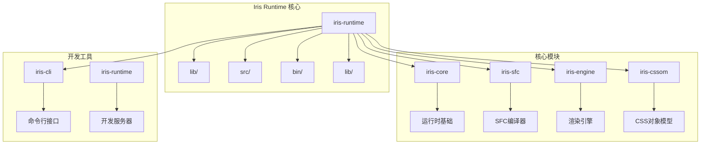
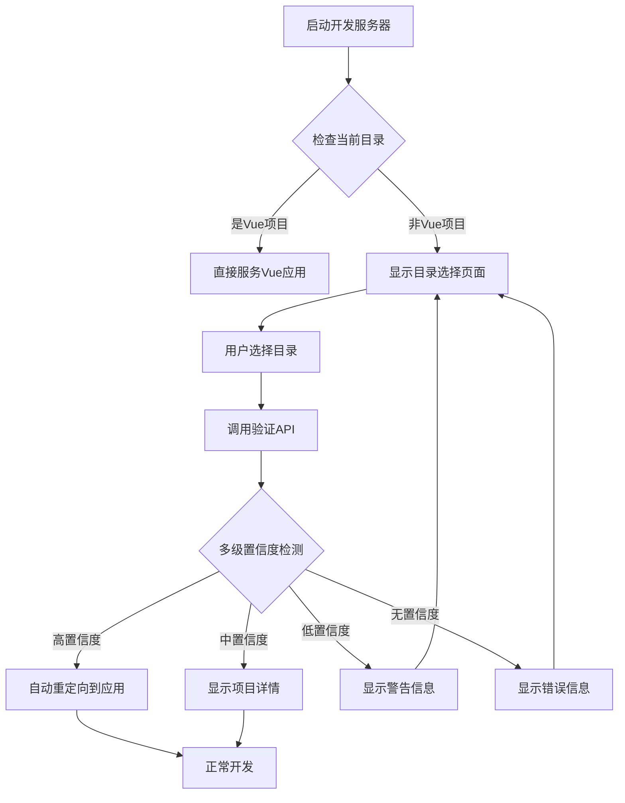
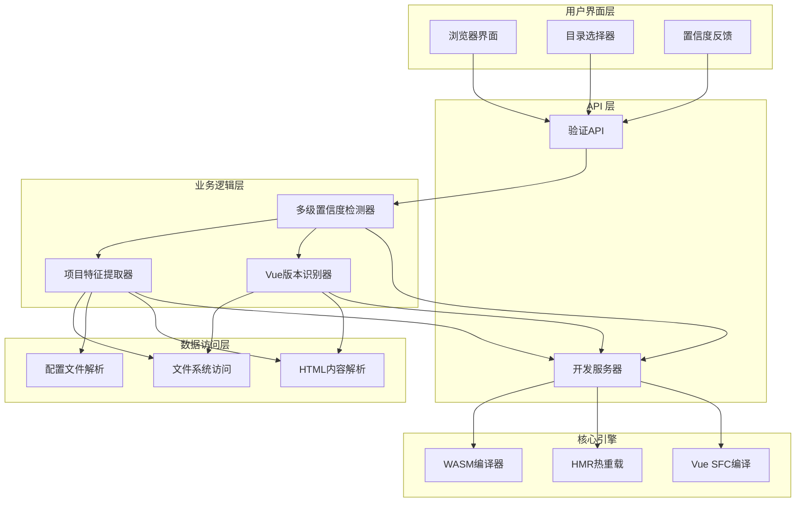
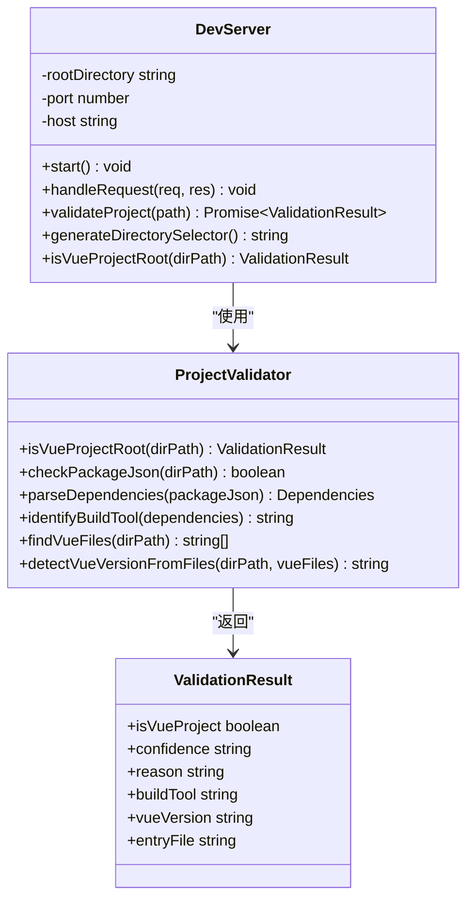
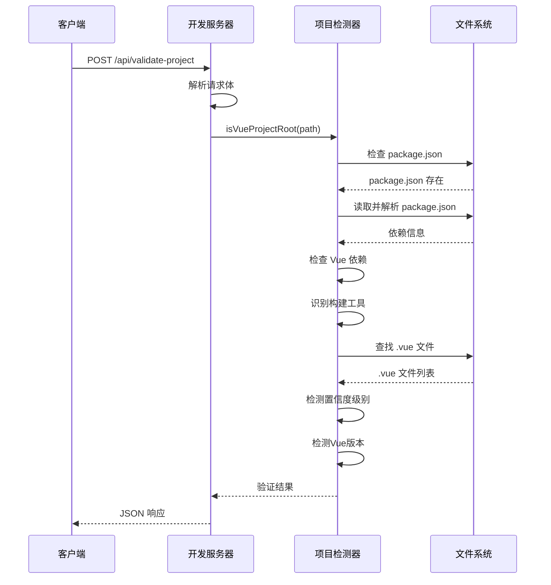
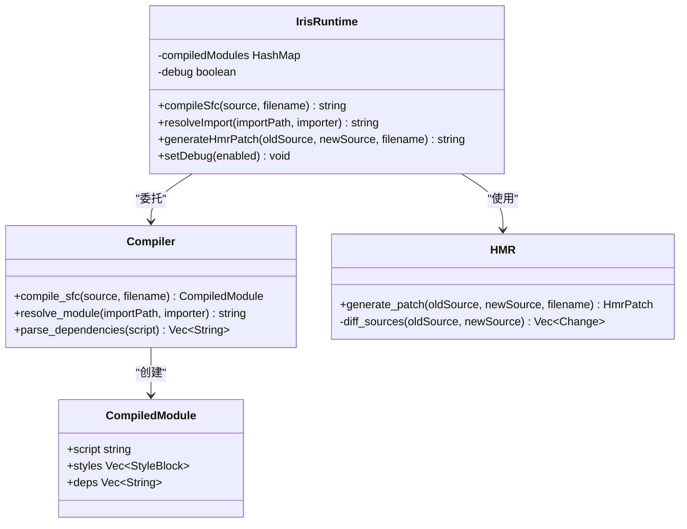
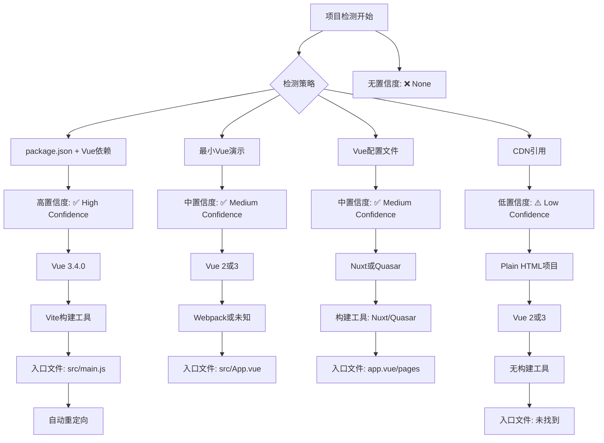
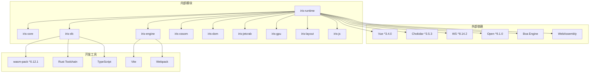

# Vue项目检测功能指南

<cite>
**本文档引用的文件**
- [VUE_PROJECT_DETECTION.md](file://crates/iris-runtime/VUE_PROJECT_DETECTION.md)
- [API_VALIDATE_PROJECT.md](file://crates/iris-runtime/API_VALIDATE_PROJECT.md)
- [dev-server.js](file://crates/iris-runtime/lib/dev-server.js)
- [iris-runtime.js](file://crates/iris-runtime/bin/iris-runtime.js)
- [lib.rs](file://crates/iris-runtime/src/lib.rs)
- [compiler.rs](file://crates/iris-runtime/src/compiler.rs)
- [hmr.rs](file://crates/iris-runtime/src/hmr.rs)
- [package.json](file://crates/iris-runtime/package.json)
- [README.md](file://crates/iris-runtime/README.md)
- [iris.config.json](file://examples/vue-demo/iris.config.json)
- [package.json](file://examples/vue-demo/package.json)
- [index.html](file://examples/vue-demo/dist/index.html)
- [App.vue](file://examples/vue-demo/src/App.vue)
- [minimal_demo.rs](file://crates/iris-app/examples/demo/minimal_demo.rs)
</cite>

## 更新摘要
**变更内容**
- 新增多级置信度检测系统（高、中、低、无级别）
- 增强最小Vue演示检测功能
- 新增CDN引用检测支持
- 扩展Vue版本自动检测能力
- 完善构建工具识别机制
- 更新用户界面反馈系统

## 目录
1. [简介](#简介)
2. [项目结构](#项目结构)
3. [核心组件](#核心组件)
4. [架构概览](#架构概览)
5. [详细组件分析](#详细组件分析)
6. [多级置信度检测系统](#多级置信度检测系统)
7. [最小Vue演示检测](#最小vue演示检测)
8. [CDN引用检测](#cdn引用检测)
9. [依赖关系分析](#依赖关系分析)
10. [性能考虑](#性能考虑)
11. [故障排除指南](#故障排除指南)
12. [结论](#结论)

## 简介

Iris Runtime 是一个基于 WebAssembly 的 Vue 3 开发服务器，专门提供 Vue 项目检测功能。该功能允许用户在任何目录中启动开发服务器，系统会自动检测当前目录是否为有效的 Vue 项目，如果不是，则提供友好的目录选择界面。

**更新** 系统现已增强为多级置信度检测，能够智能区分不同类型的Vue项目并提供相应的检测置信度。

主要特性包括：
- **多级置信度检测** - 高、中、低、无四个置信度级别
- **自动检测 Vue 项目根目录**
- **实时目录验证 API**
- **友好的用户界面**
- **支持多种构建工具**（Vite、Webpack、Nuxt、Quasar）
- **最小Vue演示检测** - 支持只有几个.vue文件的项目
- **CDN引用检测** - 支持plain HTML项目
- **Vue版本自动检测** - 区分Vue 2和Vue 3
- **零配置开箱即用**

## 项目结构

Iris Runtime 项目采用模块化架构，核心功能分布在多个 crates 中：



**图表来源**
- [package.json:1-52](file://crates/iris-runtime/package.json#L1-L52)
- [README.md:92-105](file://crates/iris-runtime/README.md#L92-L105)

**章节来源**
- [package.json:1-52](file://crates/iris-runtime/package.json#L1-L52)
- [README.md:1-148](file://crates/iris-runtime/README.md#L1-L148)

## 核心组件

### Vue 项目检测系统

Vue 项目检测功能是整个 Iris Runtime 的核心特性，它通过以下机制工作：



**图表来源**
- [VUE_PROJECT_DETECTION.md:281-304](file://crates/iris-runtime/VUE_PROJECT_DETECTION.md#L281-L304)

### 检测算法

系统使用多层检测算法来确定目录是否为 Vue 项目，按优先级顺序：

1. **package.json 检查** - 验证项目根目录是否存在 package.json
2. **Vue 依赖验证** - 检查是否存在 Vue 相关依赖
3. **构建工具识别** - 识别使用的构建工具类型
4. **最小Vue演示检测** - 检查是否存在 .vue 文件
5. **CDN引用检测** - 检查 index.html 中是否引用Vue CDN
6. **Vue版本检测** - 通过文件内容检测Vue版本

**章节来源**
- [VUE_PROJECT_DETECTION.md:17-54](file://crates/iris-runtime/VUE_PROJECT_DETECTION.md#L17-L54)

## 架构概览

Iris Runtime 采用分层架构设计，确保各组件职责清晰且相互独立：



**图表来源**
- [dev-server.js:1-1](file://crates/iris-runtime/lib/dev-server.js#L1-L1)
- [lib.rs:31-40](file://crates/iris-runtime/src/lib.rs#L31-L40)

## 详细组件分析

### 开发服务器组件

开发服务器是 Vue 项目检测功能的基础设施，负责处理 HTTP 请求和管理开发环境：



**图表来源**
- [dev-server.js:1-1](file://crates/iris-runtime/lib/dev-server.js#L1-L1)
- [API_VALIDATE_PROJECT.md:209-244](file://crates/iris-runtime/API_VALIDATE_PROJECT.md#L209-L244)

### Vue 项目检测器

Vue 项目检测器是系统的核心组件，负责准确识别 Vue 项目并提供置信度评估：



**图表来源**
- [API_VALIDATE_PROJECT.md:209-244](file://crates/iris-runtime/API_VALIDATE_PROJECT.md#L209-L244)
- [API_VALIDATE_PROJECT.md:256-316](file://crates/iris-runtime/API_VALIDATE_PROJECT.md#L256-L316)

### 目录选择界面

系统提供直观的目录选择界面，支持拖放和文件选择器，并根据置信度提供不同的反馈：

```mermaid
flowchart LR
A[用户启动] --> B[检测项目]
B --> |高置信度| C[✅ Vue Project Detected]
B --> |中置信度| D[✅ Vue Project Detected (Likely)]
B --> |低置信度| E[⚠️ Possible Vue Project]
B --> |无置信度| F[❌ Not a Vue Project]
C --> G[显示Vue版本和构建工具]
D --> G
E --> H[显示警告和建议]
F --> I[显示错误信息]
G --> J[自动重定向]
H --> B
I --> B
J --> K[启动开发服务器]
```

**图表来源**
- [VUE_PROJECT_DETECTION.md:139-181](file://crates/iris-runtime/VUE_PROJECT_DETECTION.md#L139-L181)

**章节来源**
- [VUE_PROJECT_DETECTION.md:99-135](file://crates/iris-runtime/VUE_PROJECT_DETECTION.md#L99-L135)
- [API_VALIDATE_PROJECT.md:364-443](file://crates/iris-runtime/API_VALIDATE_PROJECT.md#L364-L443)

### WASM 编译器集成

Iris Runtime 使用 WebAssembly 提供高性能的 Vue SFC 编译能力：



**图表来源**
- [lib.rs:31-40](file://crates/iris-runtime/src/lib.rs#L31-L40)
- [compiler.rs:6-33](file://crates/iris-runtime/src/compiler.rs#L6-L33)
- [hmr.rs:6-28](file://crates/iris-runtime/src/hmr.rs#L6-L28)

**章节来源**
- [lib.rs:64-177](file://crates/iris-runtime/src/lib.rs#L64-L177)
- [compiler.rs:1-110](file://crates/iris-runtime/src/compiler.rs#L1-L110)
- [hmr.rs:1-97](file://crates/iris-runtime/src/hmr.rs#L1-L97)

## 多级置信度检测系统

### 置信度级别定义

系统现在支持四个级别的置信度检测：



### 置信度检测策略

| 策略 | 置信度级别 | 检测条件 | 示例场景 |
|------|------------|----------|----------|
| package.json + Vue依赖 | 高 | package.json存在且包含Vue依赖 | Vue 3 + Vite项目 |
| 最小Vue演示 | 中 | 存在3个以上.vue文件 | 简单Vue项目 |
| Vue配置文件 | 中 | 存在Vue相关配置文件 | Nuxt/Quasar项目 |
| CDN引用 | 低 | index.html中引用Vue CDN | Plain HTML项目 |
| 无匹配 | 无 | 无任何Vue特征 | 非Vue项目 |

**章节来源**
- [dev-server.js:52-180](file://crates/iris-runtime/lib/dev-server.js#L52-L180)
- [dev-server.js:580-610](file://crates/iris-runtime/lib/dev-server.js#L580-L610)

## 最小Vue演示检测

### 检测机制

系统现在支持检测最小的Vue演示项目，即使只有几个.vue文件也能被识别：

```mermaid
flowchart TD
A[开始检测] --> B{查找.vue文件}
B --> |找到文件| C[统计.vue文件数量]
C --> D{文件数量 >= 3?}
D --> |是| E[高置信度: ✅ High Confidence]
E --> F[最小演示检测: Found 3+ .vue files]
D --> |否| G[中置信度: ✅ Medium Confidence]
G --> H[最小演示检测: Found X .vue files (minimal demo)]
B --> |未找到| I[继续其他检测策略]
F --> J[检测Vue版本]
G --> J
H --> J
J --> K[检测构建工具]
K --> L[查找入口文件]
L --> M[返回检测结果]
```

### Vue版本自动检测

通过分析.vue文件内容自动检测Vue版本：

```mermaid
graph LR
A[Vue文件内容] --> B{检测特征}
B --> C[Vue 3特征]
C --> D[<script setup>]
C --> E[defineProps]
C --> F[defineEmits]
C --> G[ref/reactive]
B --> H[Vue 2特征]
H --> I[export default]
H --> J[data()方法]
H --> K[无<script setup>]
D --> L[Vue 3]
E --> L
F --> L
G --> L
I --> M[Vue 2]
J --> M
K --> M
```

**章节来源**
- [dev-server.js:119-132](file://crates/iris-runtime/lib/dev-server.js#L119-L132)
- [dev-server.js:226-251](file://crates/iris-runtime/lib/dev-server.js#L226-L251)

## CDN引用检测

### 检测范围

系统现在支持检测通过CDN引用的Vue项目：

```mermaid
flowchart TD
A[检测index.html] --> B{存在index.html?}
B --> |是| C[读取HTML内容]
C --> D{检查CDN引用}
D --> E[vue.域名]
D --> F[vuejs.org]
D --> G[cdn.jsdelivr.net/npm/vue]
D --> H[vue@3或vue/3.]
B --> |否| I[继续其他检测]
E --> J[低置信度: ⚠️ Low Confidence]
F --> J
G --> J
H --> J
J --> K[检测Vue版本]
K --> L[查找入口文件]
L --> M[返回检测结果]
I --> N[其他检测策略]
```

### 支持的CDN模式

| CDN类型 | 检测模式 | 示例 |
|---------|----------|------|
| 官方CDN | vuejs.org | `<script src="https://unpkg.com/vue@3"></script>` |
| JSDelivr | cdn.jsdelivr.net | `<script src="cdn.jsdelivr.net/npm/vue@3.4.0"></script>` |
| Vue官方 | vue@3/vue/3.x | `<script src="https://unpkg.com/vue@3.4.0"></script>` |

**章节来源**
- [dev-server.js:159-175](file://crates/iris-runtime/lib/dev-server.js#L159-L175)

## 依赖关系分析

Iris Runtime 的依赖关系体现了清晰的模块化设计：



**图表来源**
- [package.json:32-43](file://crates/iris-runtime/package.json#L32-L43)

**章节来源**
- [package.json:1-52](file://crates/iris-runtime/package.json#L1-L52)

## 性能考虑

Vue 项目检测功能经过精心优化，确保快速响应和低资源消耗：

### 性能指标

| 操作 | 时间 | 内存 | CPU | 磁盘 I/O |
|------|------|------|-----|----------|
| 文件存在检查 | < 1ms | < 1MB | 极低 | 0 次 |
| JSON 解析 | < 5ms | < 1MB | 极低 | 1 次 |
| 依赖检查 | < 2ms | < 1MB | 极低 | 0 次 |
| .vue文件扫描 | < 10ms | < 2MB | 低 | N次文件读取 |
| HTML内容解析 | < 5ms | < 1MB | 极低 | 1次文件读取 |
| **总计** | **< 20ms** | **< 5MB** | **极低** | **N次** |

### 优化策略

1. **异步文件操作** - 使用非阻塞文件系统调用
2. **缓存机制** - 编译结果缓存减少重复计算
3. **流式处理** - HTTP 请求流式处理避免内存峰值
4. **零依赖设计** - 减少运行时依赖开销
5. **智能扫描** - 限制.vue文件扫描深度
6. **CDN检测短路** - 早期退出策略

**章节来源**
- [API_VALIDATE_PROJECT.md:605-621](file://crates/iris-runtime/API_VALIDATE_PROJECT.md#L605-L621)

## 故障排除指南

### 常见问题及解决方案

#### 1. 项目检测失败

**症状**: 验证 API 返回 `false` 且 reason 为 "No Vue dependency in package.json"

**可能原因**:
- package.json 中缺少 Vue 依赖
- 项目结构不符合 Vue 标准
- 文件权限问题

**解决步骤**:
1. 检查 package.json 是否包含 Vue 相关依赖
2. 验证项目根目录结构
3. 确认文件权限设置

#### 2. 置信度检测异常

**症状**: 置信度级别与预期不符

**可能原因**:
- .vue文件数量不足
- HTML内容解析失败
- 构建工具识别错误

**解决步骤**:
1. 检查项目中.vue文件的数量和质量
2. 验证index.html中Vue CDN引用格式
3. 确认构建工具配置文件存在

#### 3. 目录选择界面无法显示

**症状**: 浏览器显示空白页面或错误

**可能原因**:
- 开发服务器未正确启动
- 端口被占用
- 跨域问题

**解决步骤**:
1. 检查开发服务器日志
2. 更换端口号
3. 验证网络连接

#### 4. Vue版本检测错误

**症状**: Vue版本识别不正确

**可能原因**:
- .vue文件中缺少版本特征
- HTML中Vue CDN版本不明确
- 文件读取权限问题

**解决步骤**:
1. 检查.vue文件中是否包含Vue 3特征（如<script setup>）
2. 验证index.html中Vue CDN版本声明
3. 确认文件权限设置

**章节来源**
- [API_VALIDATE_PROJECT.md:106-123](file://crates/iris-runtime/API_VALIDATE_PROJECT.md#L106-L123)
- [API_VALIDATE_PROJECT.md:549-602](file://crates/iris-runtime/API_VALIDATE_PROJECT.md#L549-L602)

## 结论

Iris Runtime 的 Vue 项目检测功能通过精心设计的架构和优化的算法，为开发者提供了无缝的开发体验。该功能的主要优势包括：

1. **多级置信度检测** - 通过高、中、低、无四个级别提供精确的项目识别
2. **智能化用户体验** - 根据置信度提供不同的界面反馈和建议
3. **全面的项目支持** - 支持Vue 2/3、Vite/Webpack/Nuxt/Quasar等多种项目类型
4. **最小项目检测** - 能够识别只有几个.vue文件的最小演示项目
5. **CDN项目支持** - 支持通过CDN引用的Plain HTML项目
6. **自动版本检测** - 通过文件内容自动识别Vue版本
7. **高性能响应** - < 20ms 的响应时间和极低资源消耗
8. **安全性强** - 完善的错误处理和安全防护
9. **扩展性强** - 支持多种构建工具和未来功能扩展

该系统为 Vue 开发者提供了一个强大而易用的开发环境，显著提升了开发效率和开发体验。多级置信度检测系统的引入使得系统能够更智能地处理各种类型的Vue项目，为用户提供更加准确和有用的反馈信息。