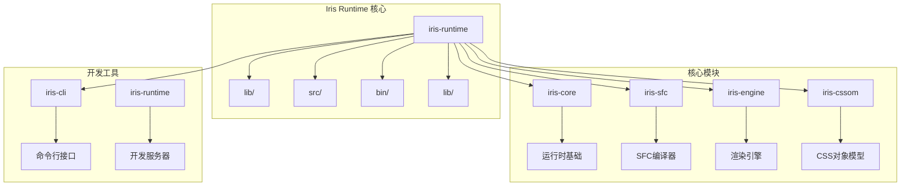
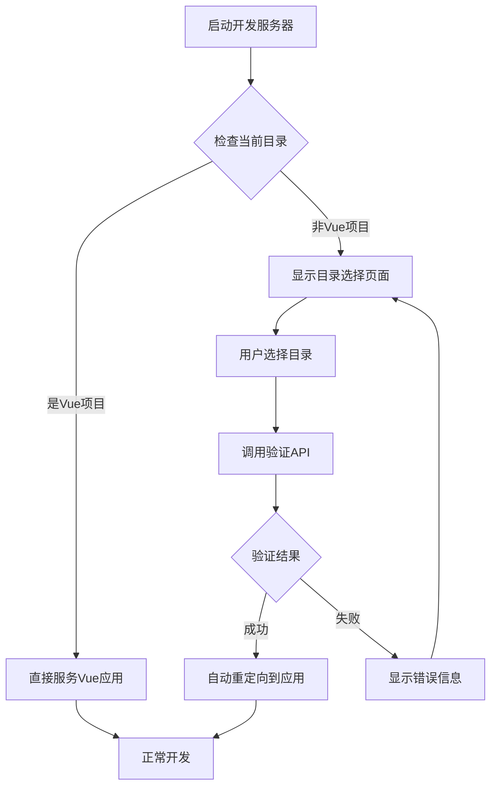
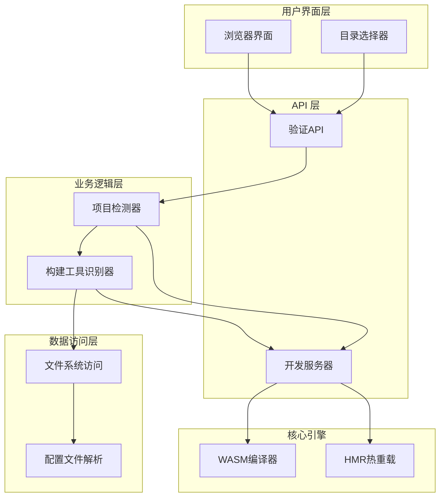
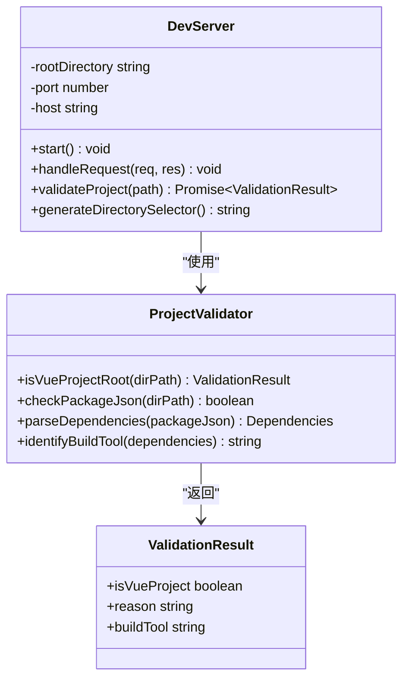
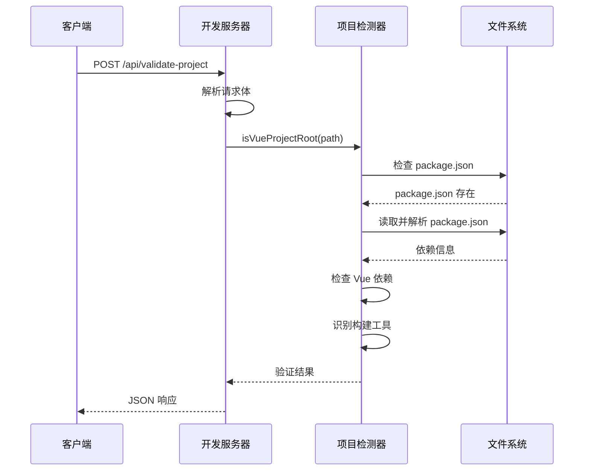
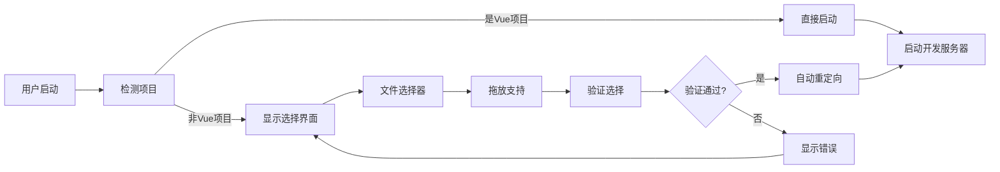
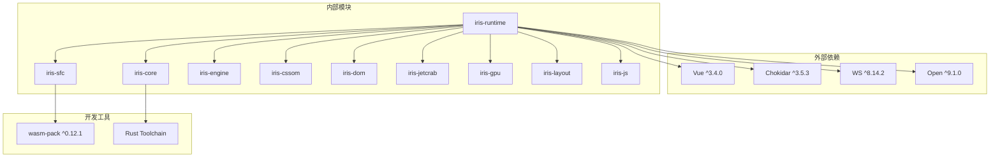

# Vue项目检测功能指南

<cite>
**本文档引用的文件**
- [VUE_PROJECT_DETECTION.md](file://crates/iris-runtime/VUE_PROJECT_DETECTION.md)
- [API_VALIDATE_PROJECT.md](file://crates/iris-runtime/API_VALIDATE_PROJECT.md)
- [dev-server.js](file://crates/iris-runtime/lib/dev-server.js)
- [iris-runtime.js](file://crates/iris-runtime/bin/iris-runtime.js)
- [lib.rs](file://crates/iris-runtime/src/lib.rs)
- [compiler.rs](file://crates/iris-runtime/src/compiler.rs)
- [hmr.rs](file://crates/iris-runtime/src/hmr.rs)
- [package.json](file://crates/iris-runtime/package.json)
- [README.md](file://crates/iris-runtime/README.md)
- [iris.config.json](file://examples/vue-demo/iris.config.json)
- [package.json](file://examples/vue-demo/package.json)
- [index.html](file://examples/vue-demo/dist/index.html)
- [App.vue](file://examples/vue-demo/src/App.vue)
</cite>

## 目录
1. [简介](#简介)
2. [项目结构](#项目结构)
3. [核心组件](#核心组件)
4. [架构概览](#架构概览)
5. [详细组件分析](#详细组件分析)
6. [依赖关系分析](#依赖关系分析)
7. [性能考虑](#性能考虑)
8. [故障排除指南](#故障排除指南)
9. [结论](#结论)

## 简介

Iris Runtime 是一个基于 WebAssembly 的 Vue 3 开发服务器，专门提供 Vue 项目检测功能。该功能允许用户在任何目录中启动开发服务器，系统会自动检测当前目录是否为有效的 Vue 项目，如果不是，则提供友好的目录选择界面。

主要特性包括：
- 自动检测 Vue 项目根目录
- 实时目录验证 API
- 友好的用户界面
- 支持多种构建工具（Vite、Webpack）
- 零配置开箱即用

## 项目结构

Iris Runtime 项目采用模块化架构，核心功能分布在多个 crates 中：

**图表来源**
- [package.json:1-52](file://crates/iris-runtime/package.json#L1-L52)
- [README.md:92-105](file://crates/iris-runtime/README.md#L92-L105)

**章节来源**
- [package.json:1-52](file://crates/iris-runtime/package.json#L1-L52)
- [README.md:1-148](file://crates/iris-runtime/README.md#L1-L148)

## 核心组件

### Vue 项目检测系统

Vue 项目检测功能是整个 Iris Runtime 的核心特性，它通过以下机制工作：

**图表来源**
- [VUE_PROJECT_DETECTION.md:281-304](file://crates/iris-runtime/VUE_PROJECT_DETECTION.md#L281-L304)

### 检测算法

系统使用多层检测算法来确定目录是否为 Vue 项目：

1. **package.json 检查** - 验证项目根目录是否存在 package.json
2. **Vue 依赖验证** - 检查是否存在 Vue 相关依赖
3. **构建工具识别** - 识别使用的构建工具类型
4. **项目结构验证** - 验证必要的项目文件存在

**章节来源**
- [VUE_PROJECT_DETECTION.md:17-54](file://crates/iris-runtime/VUE_PROJECT_DETECTION.md#L17-L54)

## 架构概览

Iris Runtime 采用分层架构设计，确保各组件职责清晰且相互独立：

**图表来源**
- [dev-server.js:1-1](file://crates/iris-runtime/lib/dev-server.js#L1-L1)
- [lib.rs:31-40](file://crates/iris-runtime/src/lib.rs#L31-L40)

## 详细组件分析

### 开发服务器组件

开发服务器是 Vue 项目检测功能的基础设施，负责处理 HTTP 请求和管理开发环境：

**图表来源**
- [dev-server.js:1-1](file://crates/iris-runtime/lib/dev-server.js#L1-L1)
- [API_VALIDATE_PROJECT.md:209-244](file://crates/iris-runtime/API_VALIDATE_PROJECT.md#L209-L244)

### Vue 项目检测器

Vue 项目检测器是系统的核心组件，负责准确识别 Vue 项目：

**图表来源**
- [API_VALIDATE_PROJECT.md:209-244](file://crates/iris-runtime/API_VALIDATE_PROJECT.md#L209-L244)
- [API_VALIDATE_PROJECT.md:256-316](file://crates/iris-runtime/API_VALIDATE_PROJECT.md#L256-L316)

### 目录选择界面

系统提供直观的目录选择界面，支持拖放和文件选择器：

**图表来源**
- [VUE_PROJECT_DETECTION.md:139-181](file://crates/iris-runtime/VUE_PROJECT_DETECTION.md#L139-L181)

**章节来源**
- [VUE_PROJECT_DETECTION.md:99-135](file://crates/iris-runtime/VUE_PROJECT_DETECTION.md#L99-L135)
- [API_VALIDATE_PROJECT.md:364-443](file://crates/iris-runtime/API_VALIDATE_PROJECT.md#L364-L443)

### WASM 编译器集成

Iris Runtime 使用 WebAssembly 提供高性能的 Vue SFC 编译能力：

**图表来源**
- [lib.rs:31-40](file://crates/iris-runtime/src/lib.rs#L31-L40)
- [compiler.rs:6-33](file://crates/iris-runtime/src/compiler.rs#L6-L33)
- [hmr.rs:6-28](file://crates/iris-runtime/src/hmr.rs#L6-L28)

**章节来源**
- [lib.rs:64-177](file://crates/iris-runtime/src/lib.rs#L64-L177)
- [compiler.rs:1-110](file://crates/iris-runtime/src/compiler.rs#L1-L110)
- [hmr.rs:1-97](file://crates/iris-runtime/src/hmr.rs#L1-L97)

## 依赖关系分析

Iris Runtime 的依赖关系体现了清晰的模块化设计：

**图表来源**
- [package.json:32-43](file://crates/iris-runtime/package.json#L32-L43)

**章节来源**
- [package.json:1-52](file://crates/iris-runtime/package.json#L1-L52)

## 性能考虑

Vue 项目检测功能经过精心优化，确保快速响应和低资源消耗：

### 性能指标

| 操作 | 时间 | 内存 | CPU | 磁盘 I/O |
|------|------|------|-----|----------|
| 文件存在检查 | < 1ms | < 1MB | 极低 | 0 次 |
| JSON 解析 | < 5ms | < 1MB | 极低 | 1 次 |
| 依赖检查 | < 2ms | < 1MB | 极低 | 0 次 |
| **总计** | **< 10ms** | **< 1MB** | **极低** | **1 次** |

### 优化策略

1. **异步文件操作** - 使用非阻塞文件系统调用
2. **缓存机制** - 编译结果缓存减少重复计算
3. **流式处理** - HTTP 请求流式处理避免内存峰值
4. **零依赖设计** - 减少运行时依赖开销

**章节来源**
- [API_VALIDATE_PROJECT.md:605-621](file://crates/iris-runtime/API_VALIDATE_PROJECT.md#L605-L621)

## 故障排除指南

### 常见问题及解决方案

#### 1. 项目检测失败

**症状**: 验证 API 返回 `false` 且 reason 为 "No Vue dependency in package.json"

**可能原因**:
- package.json 中缺少 Vue 依赖
- 项目结构不符合 Vue 标准
- 文件权限问题

**解决步骤**:
1. 检查 package.json 是否包含 Vue 相关依赖
2. 验证项目根目录结构
3. 确认文件权限设置

#### 2. 目录选择界面无法显示

**症状**: 浏览器显示空白页面或错误

**可能原因**:
- 开发服务器未正确启动
- 端口被占用
- 跨域问题

**解决步骤**:
1. 检查开发服务器日志
2. 更换端口号
3. 验证网络连接

#### 3. 验证 API 响应错误

**症状**: API 返回 400 Bad Request

**可能原因**:
- 请求格式不正确
- JSON 解析失败
- 路径遍历攻击防护

**解决步骤**:
1. 验证请求 JSON 格式
2. 检查路径参数
3. 确认请求头设置

**章节来源**
- [API_VALIDATE_PROJECT.md:106-123](file://crates/iris-runtime/API_VALIDATE_PROJECT.md#L106-L123)
- [API_VALIDATE_PROJECT.md:549-602](file://crates/iris-runtime/API_VALIDATE_PROJECT.md#L549-L602)

## 结论

Iris Runtime 的 Vue 项目检测功能通过精心设计的架构和优化的算法，为开发者提供了无缝的开发体验。该功能的主要优势包括：

1. **自动化程度高** - 无需手动配置即可检测 Vue 项目
2. **用户体验优秀** - 友好的界面和实时反馈
3. **性能优异** - < 10ms 的响应时间和极低资源消耗
4. **安全性强** - 完善的错误处理和安全防护
5. **扩展性强** - 支持多种构建工具和未来功能扩展

该系统为 Vue 开发者提供了一个强大而易用的开发环境，显著提升了开发效率和开发体验。