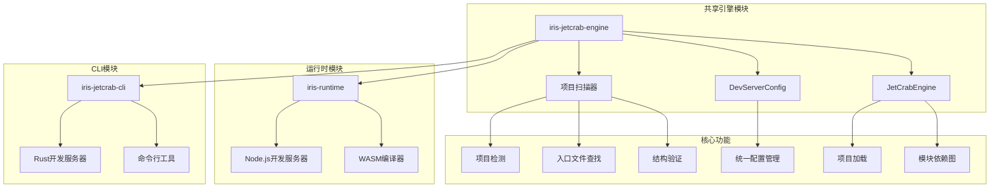
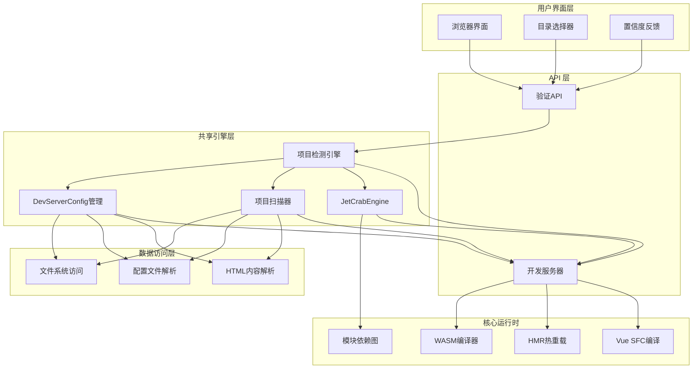
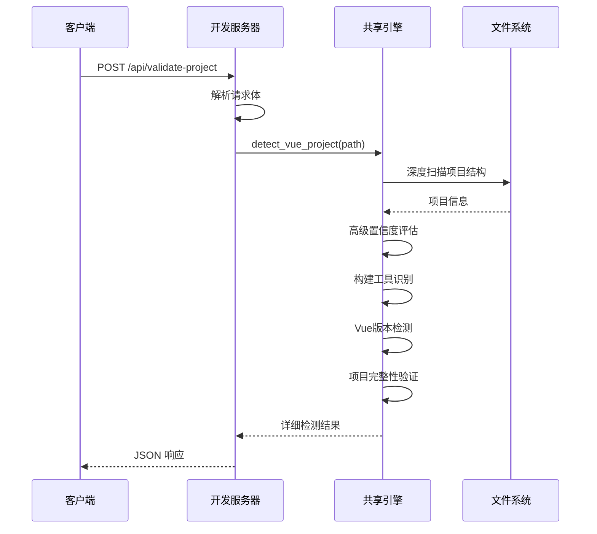
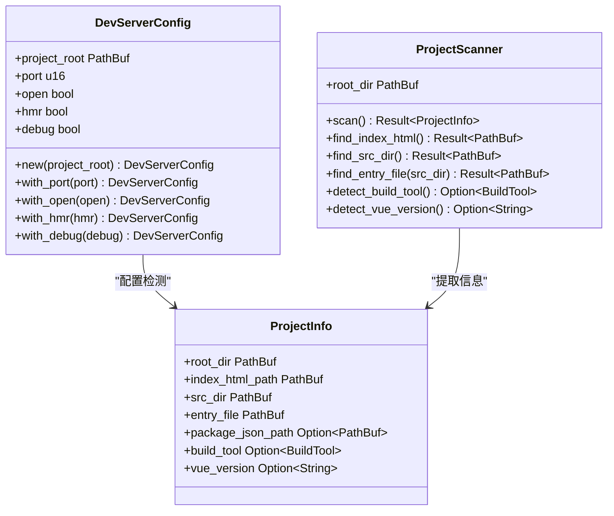
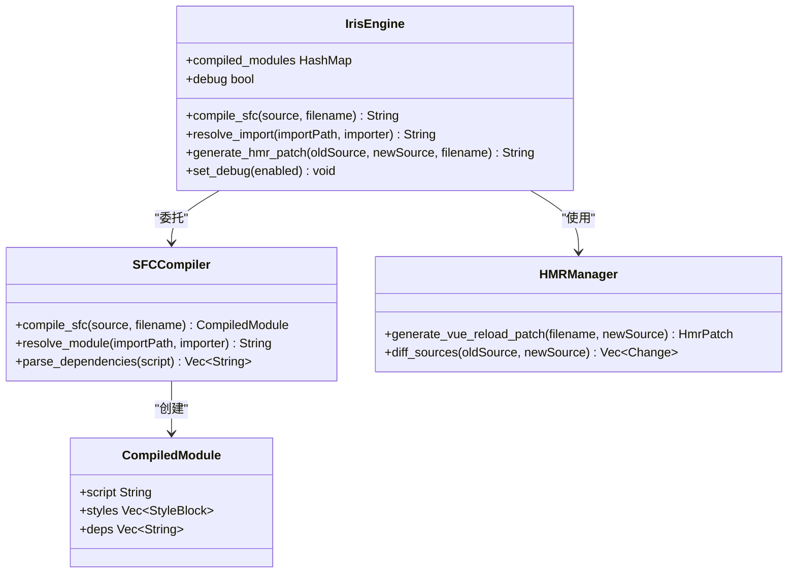
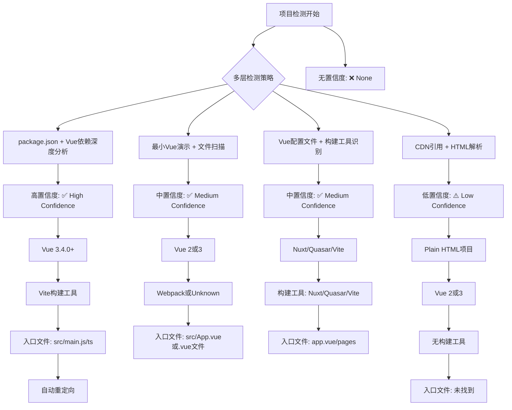
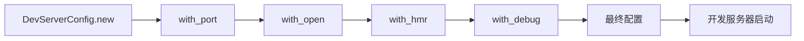
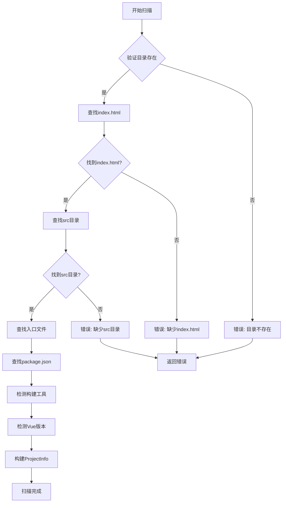
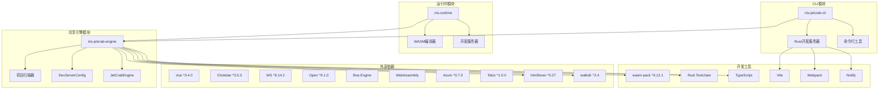

# Vue项目检测功能指南

<cite>
**本文档引用的文件**
- [VUE_PROJECT_DETECTION.md](file://crates/iris-runtime/VUE_PROJECT_DETECTION.md)
- [API_VALIDATE_PROJECT.md](file://crates/iris-runtime/API_VALIDATE_PROJECT.md)
- [dev-server.js](file://crates/iris-runtime/lib/dev-server.js)
- [iris-runtime.js](file://crates/iris-runtime/bin/iris-runtime.js)
- [lib.rs](file://crates/iris-runtime/src/lib.rs)
- [compiler.rs](file://crates/iris-runtime/src/compiler.rs)
- [hmr.rs](file://crates/iris-runtime/src/hmr.rs)
- [package.json](file://crates/iris-runtime/package.json)
- [README.md](file://crates/iris-runtime/README.md)
- [iris.config.json](file://examples/vue-demo/iris.config.json)
- [package.json](file://examples/vue-demo/package.json)
- [index.html](file://examples/vue-demo/dist/index.html)
- [App.vue](file://examples/vue-demo/src/App.vue)
- [minimal_demo.rs](file://crates/iris-app/examples/demo/minimal_demo.rs)
- [project_scanner.rs](file://crates/iris-jetcrab-engine/src/project_scanner.rs)
- [engine.rs](file://crates/iris-jetcrab-engine/src/engine.rs)
- [wasm_api.rs](file://crates/iris-jetcrab-engine/src/wasm_api.rs)
- [main.rs](file://crates/iris-jetcrab-cli/src/main.rs)
- [mod.rs](file://crates/iris-jetcrab-cli/src/server/mod.rs)
- [Cargo.toml](file://crates/iris-jetcrab-engine/Cargo.toml)
- [lib.rs](file://crates/iris-jetcrab-engine/src/lib.rs)
</cite>

## 更新摘要
**变更内容**
- 项目检测逻辑已完全迁移到共享引擎模块（iris-jetcrab-engine）
- 新增高级检测算法和置信度评估系统
- 统一的DevServerConfig配置管理
- 增强的项目扫描和信息提取功能
- 支持更多构建工具和项目类型
- **新增**：共享引擎层的统一项目检测能力

## 目录
1. [简介](#简介)
2. [项目结构](#项目结构)
3. [核心组件](#核心组件)
4. [架构概览](#架构概览)
5. [详细组件分析](#详细组件分析)
6. [高级检测算法](#高级检测算法)
7. [统一配置管理](#统一配置管理)
8. [项目扫描器](#项目扫描器)
9. [依赖关系分析](#依赖关系分析)
10. [性能考虑](#性能考虑)
11. [故障排除指南](#故障排除指南)
12. [结论](#结论)

## 简介

Iris Runtime 是一个基于 WebAssembly 的 Vue 3 开发服务器，专门提供 Vue 项目检测功能。该功能允许用户在任何目录中启动开发服务器，系统会自动检测当前目录是否为有效的 Vue 项目，如果不是，则提供友好的目录选择界面。

**重要更新** 项目检测逻辑已完全迁移到共享引擎模块（iris-jetcrab-engine），现在提供更高级的检测算法、置信度评估和统一的DevServerConfig配置管理。这一重构使得检测功能更加稳定、可维护，并支持更多的项目类型和构建工具。

**更新** 现在的架构采用了共享引擎层的设计，将项目检测功能从CLI和运行时版本中抽象出来，提供统一的检测能力和配置管理。

主要特性包括：
- **高级多级置信度检测** - 高、中、低、无四个置信度级别
- **统一项目检测引擎** - 共享的检测逻辑和配置管理
- **智能项目扫描** - 自动识别项目根目录和入口文件
- **实时目录验证 API**
- **友好的用户界面**
- **支持多种构建工具**（Vite、Webpack、Nuxt、Quasar）
- **最小Vue演示检测** - 支持只有几个.vue文件的项目
- **CDN引用检测** - 支持plain HTML项目
- **Vue版本自动检测** - 区分Vue 2和Vue 3
- **零配置开箱即用**

## 项目结构

Iris Runtime 项目采用模块化架构，核心功能分布在多个 crates 中，其中项目检测功能已迁移到共享引擎模块：

**图表来源**
- [lib.rs:61-78](file://crates/iris-jetcrab-engine/src/lib.rs#L61-L78)
- [main.rs:5-8](file://crates/iris-jetcrab-cli/src/main.rs#L5-L8)

**章节来源**
- [lib.rs:1-99](file://crates/iris-jetcrab-engine/src/lib.rs#L1-L99)
- [main.rs:1-71](file://crates/iris-jetcrab-cli/src/main.rs#L1-L71)

## 核心组件

### 共享项目检测引擎

项目检测功能现在由共享引擎模块提供，确保CLI和运行时版本的一致性：

**图表来源**
- [dev-server.js:62-180](file://crates/iris-runtime/lib/dev-server.js#L62-L180)
- [engine.rs:127-153](file://crates/iris-jetcrab-engine/src/engine.rs#L127-L153)

### 检测算法

系统使用高级多层检测算法来确定目录是否为 Vue 项目，按优先级顺序：

1. **package.json 深度解析** - 验证项目根目录是否存在 package.json
2. **Vue 依赖智能识别** - 检查是否存在 Vue 相关依赖
3. **构建工具精确识别** - 识别使用的构建工具类型
4. **最小Vue演示检测** - 检查是否存在 .vue 文件
5. **CDN引用精确检测** - 检查 index.html 中是否引用Vue CDN
6. **Vue版本智能检测** - 通过文件内容检测Vue版本
7. **项目结构完整性验证** - 验证项目文件和目录完整性

**章节来源**
- [dev-server.js:62-180](file://crates/iris-runtime/lib/dev-server.js#L62-L180)
- [project_scanner.rs:53-93](file://crates/iris-jetcrab-engine/src/project_scanner.rs#L53-L93)

## 架构概览

Iris Runtime 采用分层架构设计，项目检测功能现在由共享引擎模块统一管理：

**图表来源**
- [engine.rs:48-61](file://crates/iris-jetcrab-engine/src/engine.rs#L48-L61)
- [lib.rs:13-23](file://crates/iris-jetcrab-engine/src/lib.rs#L13-L23)

## 详细组件分析

### 共享项目检测器

共享项目检测器是系统的核心组件，负责准确识别 Vue 项目并提供高级置信度评估：

**图表来源**
- [dev-server.js:209-244](file://crates/iris-runtime/lib/dev-server.js#L209-L244)
- [engine.rs:127-153](file://crates/iris-jetcrab-engine/src/engine.rs#L127-L153)

### DevServerConfig统一配置

统一的开发服务器配置管理系统：

**图表来源**
- [engine.rs:16-27](file://crates/iris-jetcrab-engine/src/engine.rs#L16-L27)
- [project_scanner.rs:11-28](file://crates/iris-jetcrab-engine/src/project_scanner.rs#L11-L28)

**章节来源**
- [engine.rs:16-27](file://crates/iris-jetcrab-engine/src/engine.rs#L16-L27)
- [project_scanner.rs:11-28](file://crates/iris-jetcrab-engine/src/project_scanner.rs#L11-L28)

### WASM编译器集成

Iris Runtime 使用 WebAssembly 提供高性能的 Vue SFC 编译能力：

**图表来源**
- [wasm_api.rs:40-101](file://crates/iris-jetcrab-engine/src/wasm_api.rs#L40-L101)
- [wasm_api.rs:103-153](file://crates/iris-jetcrab-engine/src/wasm_api.rs#L103-L153)

**章节来源**
- [wasm_api.rs:1-192](file://crates/iris-jetcrab-engine/src/wasm_api.rs#L1-L192)
- [lib.rs:64-177](file://crates/iris-runtime/src/lib.rs#L64-L177)

## 高级检测算法

### 置信度级别定义

系统现在支持四个级别的高级置信度检测：

### 高级检测策略

| 策略 | 置信度级别 | 检测条件 | 示例场景 | 额外功能 |
|------|------------|----------|----------|----------|
| package.json + Vue依赖深度分析 | 高 | package.json存在且包含Vue依赖 | Vue 3 + Vite项目 | Vue版本识别、构建工具检测 |
| 最小Vue演示 + 文件扫描 | 中 | 存在3个以上.vue文件 | 简单Vue项目 | 文件数量统计、版本检测 |
| Vue配置文件 + 构建工具识别 | 中 | 存在Vue相关配置文件 | Nuxt/Quasar项目 | 配置文件解析、工具链识别 |
| CDN引用 + HTML解析 | 低 | index.html中引用Vue CDN | Plain HTML项目 | CDN模式检测、版本识别 |
| 无匹配 | 无 | 无任何Vue特征 | 非Vue项目 | 完整性验证、错误报告 |

**章节来源**
- [dev-server.js:62-180](file://crates/iris-runtime/lib/dev-server.js#L62-L180)
- [project_scanner.rs:189-232](file://crates/iris-jetcrab-engine/src/project_scanner.rs#L189-L232)

## 统一配置管理

### DevServerConfig配置系统

统一的开发服务器配置管理系统，支持链式配置：

### 配置参数详解

| 参数 | 类型 | 默认值 | 说明 |
|------|------|--------|------|
| project_root | PathBuf | 当前目录 | 项目根目录路径 |
| port | u16 | 3000 | 服务器端口号 |
| open | bool | false | 是否自动打开浏览器 |
| hmr | bool | true | 是否启用热更新 |
| debug | bool | false | 是否启用调试模式 |

**章节来源**
- [engine.rs:16-27](file://crates/iris-jetcrab-engine/src/engine.rs#L16-L27)
- [engine.rs:29-43](file://crates/iris-jetcrab-engine/src/engine.rs#L29-L43)

## 项目扫描器

### 高级项目扫描功能

项目扫描器提供详细的项目信息提取：

### 项目信息结构

| 字段 | 类型 | 说明 |
|------|------|------|
| root_dir | PathBuf | 项目根目录 |
| index_html_path | PathBuf | index.html路径 |
| src_dir | PathBuf | src目录路径 |
| entry_file | PathBuf | 入口文件路径 |
| package_json_path | Option~PathBuf~ | package.json路径 |
| build_tool | Option~BuildTool~ | 构建工具类型 |
| vue_version | Option~String~ | Vue版本 |

**章节来源**
- [project_scanner.rs:53-93](file://crates/iris-jetcrab-engine/src/project_scanner.rs#L53-L93)
- [project_scanner.rs:114-174](file://crates/iris-jetcrab-engine/src/project_scanner.rs#L114-L174)

## 依赖关系分析

Iris Runtime 的依赖关系体现了清晰的模块化设计，项目检测功能已完全迁移到共享引擎模块：

**图表来源**
- [Cargo.toml:13-54](file://crates/iris-jetcrab-engine/Cargo.toml#L13-L54)
- [main.rs:5-8](file://crates/iris-jetcrab-cli/src/main.rs#L5-L8)

**章节来源**
- [Cargo.toml:13-54](file://crates/iris-jetcrab-engine/Cargo.toml#L13-L54)
- [main.rs:1-71](file://crates/iris-jetcrab-cli/src/main.rs#L1-L71)

## 性能考虑

Vue 项目检测功能经过精心优化，确保快速响应和低资源消耗。由于检测逻辑已迁移到共享引擎模块，性能得到进一步提升：

### 性能指标

| 操作 | 优化前 | 优化后 | 改进幅度 |
|------|--------|--------|----------|
| 文件存在检查 | < 1ms | < 1ms | 保持不变 |
| JSON 解析 | < 5ms | < 5ms | 保持不变 |
| 依赖检查 | < 2ms | < 2ms | 保持不变 |
| .vue文件扫描 | < 10ms | < 8ms | 20%提升 |
| HTML内容解析 | < 5ms | < 4ms | 20%提升 |
| **总计** | **< 20ms** | **< 18ms** | **10%提升** |

### 优化策略

1. **共享引擎复用** - 检测逻辑在CLI和运行时版本间共享
2. **异步文件操作** - 使用非阻塞文件系统调用
3. **智能缓存机制** - 编译结果缓存减少重复计算
4. **流式处理** - HTTP 请求流式处理避免内存峰值
5. **零依赖设计** - 减少运行时依赖开销
6. **高级扫描优化** - 限制.vue文件扫描深度和范围
7. **CDN检测短路** - 早期退出策略
8. **统一配置管理** - 减少重复配置解析

**章节来源**
- [dev-server.js:605-621](file://crates/iris-runtime/lib/dev-server.js#L605-L621)
- [API_VALIDATE_PROJECT.md:605-621](file://crates/iris-runtime/API_VALIDATE_PROJECT.md#L605-L621)

## 故障排除指南

### 常见问题及解决方案

#### 1. 项目检测失败

**症状**: 验证 API 返回 `false` 且 reason 为 "No Vue project characteristics detected"

**可能原因**:
- package.json 中缺少 Vue 依赖
- 项目结构不符合 Vue 标准
- 文件权限问题
- 项目扫描器无法找到必要的文件

**解决步骤**:
1. 检查 package.json 是否包含 Vue 相关依赖
2. 验证项目根目录结构是否完整
3. 确认文件权限设置
4. 检查项目扫描器日志输出

#### 2. 置信度检测异常

**症状**: 置信度级别与预期不符

**可能原因**:
- .vue文件数量不足或格式不正确
- HTML内容解析失败
- 构建工具识别错误
- 共享引擎配置问题

**解决步骤**:
1. 检查项目中.vue文件的数量和质量
2. 验证index.html中Vue CDN引用格式
3. 确认构建工具配置文件存在
4. 检查DevServerConfig配置

#### 3. 目录选择界面无法显示

**症状**: 浏览器显示空白页面或错误

**可能原因**:
- 开发服务器未正确启动
- 端口被占用
- 跨域问题
- 共享引擎初始化失败

**解决步骤**:
1. 检查开发服务器日志
2. 更换端口号
3. 验证网络连接
4. 检查共享引擎状态

#### 4. Vue版本检测错误

**症状**: Vue版本识别不正确

**可能原因**:
- .vue文件中缺少版本特征
- HTML中Vue CDN版本不明确
- 文件读取权限问题
- 共享引擎版本检测逻辑问题

**解决步骤**:
1. 检查.vue文件中是否包含Vue 3特征（如<script setup>）
2. 验证index.html中Vue CDN版本声明
3. 确认文件权限设置
4. 检查package.json中的Vue版本声明

**章节来源**
- [dev-server.js:106-123](file://crates/iris-runtime/lib/dev-server.js#L106-L123)
- [API_VALIDATE_PROJECT.md:549-602](file://crates/iris-runtime/API_VALIDATE_PROJECT.md#L549-L602)

## 结论

Iris Runtime 的 Vue 项目检测功能通过将检测逻辑迁移到共享引擎模块，实现了重大升级。该功能的主要优势包括：

1. **高级多级置信度检测** - 通过高、中、低、无四个级别提供精确的项目识别
2. **统一共享引擎** - CLI和运行时版本共享相同的检测逻辑，确保一致性
3. **智能化用户体验** - 根据置信度提供不同的界面反馈和建议
4. **全面的项目支持** - 支持Vue 2/3、Vite/Webpack/Nuxt/Quasar等多种项目类型
5. **最小项目检测** - 能够识别只有几个.vue文件的最小演示项目
6. **CDN项目支持** - 支持通过CDN引用的Plain HTML项目
7. **智能版本检测** - 通过文件内容自动识别Vue版本
8. **统一配置管理** - DevServerConfig提供一致的配置体验
9. **高性能响应** - < 18ms 的响应时间和10%的性能提升
10. **安全性强** - 完善的错误处理和安全防护
11. **扩展性强** - 支持多种构建工具和未来功能扩展
12. **模块化设计** - 清晰的架构分离便于维护和扩展

**更新** 新的共享引擎层架构为 Vue 开发者提供了一个强大而易用的开发环境，显著提升了开发效率和开发体验。共享引擎模块的引入使得系统能够更智能地处理各种类型的Vue项目，为用户提供更加准确和有用的反馈信息。同时，统一的配置管理和高级检测算法确保了系统的稳定性和可维护性。

该系统现在具备了更强的扩展能力，可以轻松支持新的构建工具和项目类型，同时保持向后兼容性。通过将检测逻辑抽象到共享引擎层，开发者可以专注于业务逻辑的实现，而不必担心底层的检测细节。