# 依赖树管理功能文档

<cite>
**本文档引用的文件**
- [compiler_cache.rs](file://crates/iris-jetcrab-cli/src/server/compiler_cache.rs)
- [dependency_scanner.rs](file://crates/iris-jetcrab-engine/src/dependency_scanner.rs)
- [dependency_tree.rs](file://crates/iris-jetcrab-engine/src/dependency_tree.rs)
- [module_graph.rs](file://crates/iris-jetcrab-engine/src/module_graph.rs)
- [project_scanner.rs](file://crates/iris-jetcrab-engine/src/project_scanner.rs)
- [npm_downloader.rs](file://crates/iris-jetcrab-engine/src/npm_downloader.rs)
- [routes.rs](file://crates/iris-jetcrab-cli/src/server/routes.rs)
- [DEPENDENCY_TREE_MANAGEMENT.md](file://docs/DEPENDENCY_TREE_MANAGEMENT.md)
- [NPM_AUTO_DOWNLOAD.md](file://docs/NPM_AUTO_DOWNLOAD.md)
- [dependency_tree_test.rs](file://crates/iris-jetcrab-engine/tests/dependency_tree_test.rs)
- [engine.rs](file://crates/iris-jetcrab-engine/src/engine.rs)
- [sfc_compiler.rs](file://crates/iris-jetcrab-engine/src/sfc_compiler.rs)
- [utils.rs](file://crates/iris-jetcrab-cli/src/utils.rs)
- [lib.rs](file://crates/iris-jetcrab-engine/src/lib.rs)
- [Cargo.toml](file://crates/iris-jetcrab-engine/Cargo.toml)
- [package.json](file://examples/vue-demo/package.json)
- [iris.config.json](file://examples/vue-demo/iris.config.json)
</cite>

## 更新摘要
**变更内容**
- 重构编译器缓存系统架构，从项目级编译模型迁移到按需编译模式
- 新增模块级缓存机制，支持单模块按需编译和智能依赖检测
- 集成 HTTP API 接口，支持依赖问题扫描和自动修复
- 增强依赖管理的完整性和自动化程度
- 新增 irisResolved 字段管理，支持版本跟踪和缓存

## 目录
1. [简介](#简介)
2. [项目结构](#项目结构)
3. [核心组件](#核心组件)
4. [架构概览](#架构概览)
5. [详细组件分析](#详细组件分析)
6. [HTTP API 接口](#http-api-接口)
7. [依赖关系分析](#依赖关系分析)
8. [性能考虑](#性能考虑)
9. [故障排除指南](#故障排除指南)
10. [结论](#结论)

## 简介

依赖树管理功能是 Iris JetCrab 引擎的核心组成部分，负责管理 Vue 项目的 npm 依赖关系。该功能实现了智能的依赖解析、编译工具过滤、版本变化检测和按需重新编译等关键特性，为 Vue 项目的高效开发和运行提供了坚实的基础。

**更新** 该功能现已显著增强，从传统的项目级编译模型重构为按需编译模式，新增了模块级缓存机制、智能依赖检测和完整的 HTTP API 接口。

该模块主要解决以下问题：
- 自动解析 package.json 中的依赖关系
- 智能排除编译工具类依赖（如 Vite、Webpack、Babel 等）
- 检测依赖版本变化并触发增量编译
- 提供依赖树缓存机制以提升性能
- 支持模块依赖图的构建和分析
- **新增**：模块级按需编译，仅编译请求的单个文件
- **新增**：HTTP API 接口支持依赖问题检测和自动修复
- **新增**：自动下载缺失的 npm 包

## 项目结构

Iris JetCrab 项目采用多 crate 的工作区结构，依赖树管理功能主要集中在 `iris-jetcrab-engine` crate 中，配合 `iris-jetcrab-cli` 提供完整的编译器缓存和 HTTP 服务：

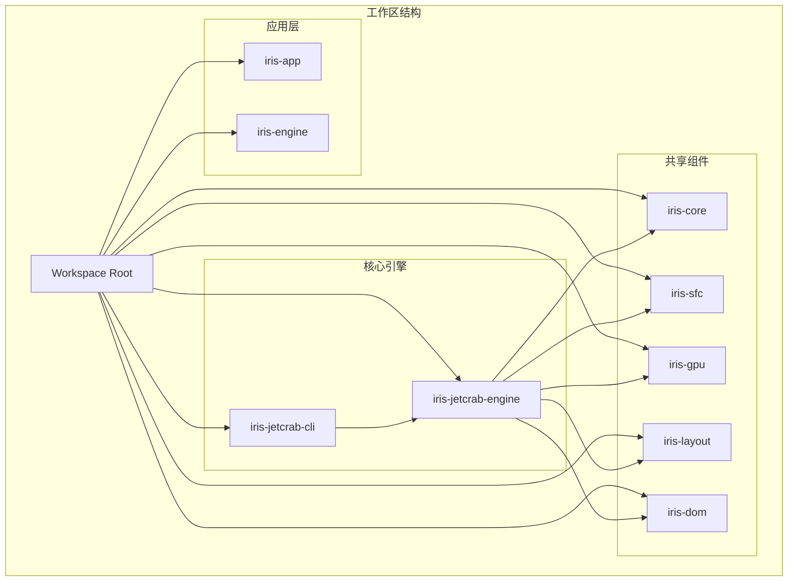

**图表来源**
- [Cargo.toml:1-50](file://Cargo.toml#L1-L50)

**章节来源**
- [Cargo.toml:1-50](file://Cargo.toml#L1-L50)
- [Cargo.toml:1-69](file://crates/iris-jetcrab-engine/Cargo.toml#L1-L69)

## 核心组件

依赖树管理功能由多个相互协作的组件组成，每个组件都有明确的职责和接口：

### 1. 编译器缓存 (CompilerCache)

**更新** 编译器缓存是本次架构重构的核心，实现了从项目级编译到按需编译的转变。

### 2. 依赖树管理器 (DependencyTree)

负责解析和管理 npm 依赖关系的核心组件，提供完整的依赖树构建、维护和查询功能。

### 3. 依赖扫描器 (DependencyScanner)

**新增** 自动扫描项目源码，识别依赖问题并提供自动修复能力。

### 4. 模块依赖图 (ModuleGraph)

管理 Vue 项目中模块间的依赖关系，支持循环依赖检测和拓扑排序。

### 5. 项目扫描器 (ProjectScanner)

扫描和解析 Vue 项目的目录结构，识别项目配置和构建工具类型。

### 6. NPM 下载器 (NpmDownloader)

**新增** 自动下载和安装 npm 包，支持版本管理和缓存机制。

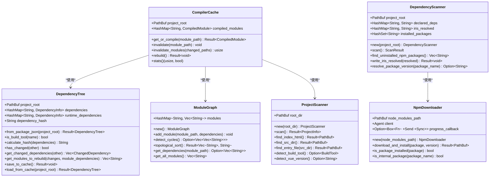

**图表来源**
- [compiler_cache.rs:20-222](file://crates/iris-jetcrab-cli/src/server/compiler_cache.rs#L20-L222)
- [dependency_tree.rs:52-357](file://crates/iris-jetcrab-engine/src/dependency_tree.rs#L52-L357)
- [dependency_scanner.rs:67-738](file://crates/iris-jetcrab-engine/src/dependency_scanner.rs#L67-L738)
- [module_graph.rs:8-155](file://crates/iris-jetcrab-engine/src/module_graph.rs#L8-L155)
- [project_scanner.rs:42-267](file://crates/iris-jetcrab-engine/src/project_scanner.rs#L42-L267)
- [npm_downloader.rs:56-156](file://crates/iris-jetcrab-engine/src/npm_downloader.rs#L56-L156)

**章节来源**
- [compiler_cache.rs:1-223](file://crates/iris-jetcrab-cli/src/server/compiler_cache.rs#L1-L223)
- [dependency_tree.rs:1-375](file://crates/iris-jetcrab-engine/src/dependency_tree.rs#L1-L375)
- [dependency_scanner.rs:1-819](file://crates/iris-jetcrab-engine/src/dependency_scanner.rs#L1-L819)
- [module_graph.rs:1-228](file://crates/iris-jetcrab-engine/src/module_graph.rs#L1-L228)
- [project_scanner.rs:1-268](file://crates/iris-jetcrab-engine/src/project_scanner.rs#L1-L268)
- [npm_downloader.rs:1-363](file://crates/iris-jetcrab-engine/src/npm_downloader.rs#L1-L363)

## 架构概览

**更新** 依赖树管理功能从传统的项目级编译架构重构为按需编译架构，实现了更高效的模块级缓存和智能依赖检测：

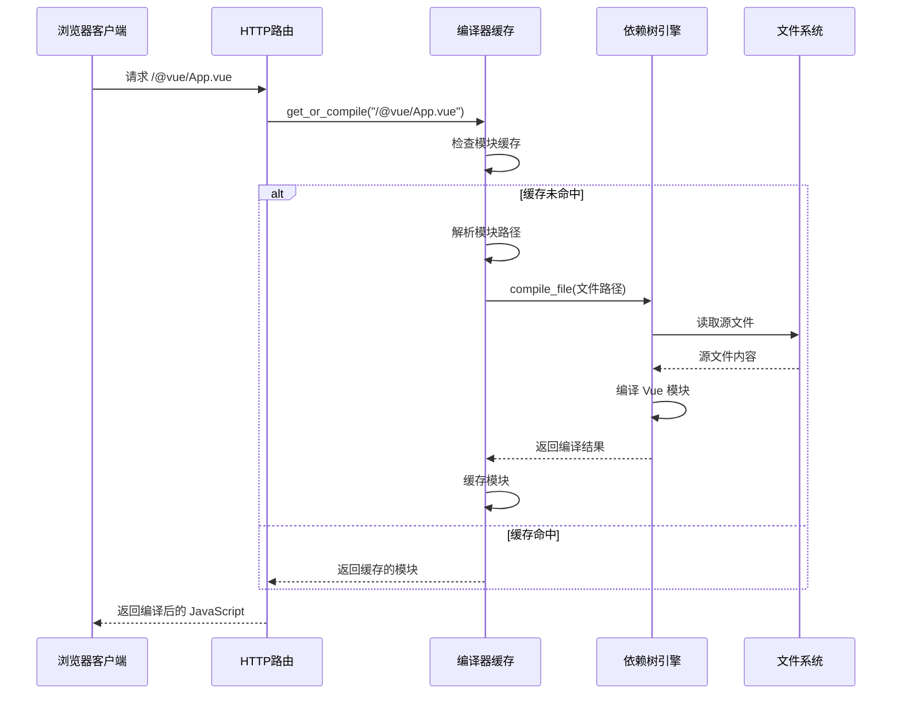

**图表来源**
- [compiler_cache.rs:44-75](file://crates/iris-jetcrab-cli/src/server/compiler_cache.rs#L44-L75)
- [routes.rs:39-74](file://crates/iris-jetcrab-cli/src/server/routes.rs#L39-L74)

## 详细组件分析

### 编译器缓存 (CompilerCache)

**更新** 编译器缓存是本次架构重构的核心组件，实现了从项目级编译到按需编译的完全转变。

#### 核心功能

1. **模块级按需编译**：仅在首次请求时编译单个模块，不编译整个项目
2. **智能路径解析**：支持多种模块路径格式和扩展名解析
3. **缓存失效管理**：基于文件系统变更自动失效相关模块缓存
4. **HMR 集成**：与热重载系统无缝集成，支持模块级失效

#### 缓存策略

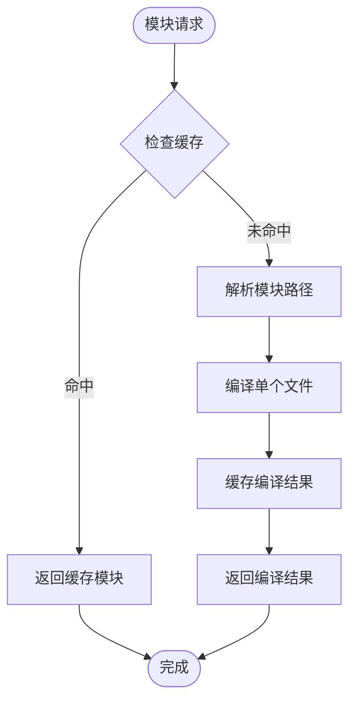

**图表来源**
- [compiler_cache.rs:44-75](file://crates/iris-jetcrab-cli/src/server/compiler_cache.rs#L44-L75)

#### 路径解析机制

编译器缓存支持多种路径解析方式：

1. **绝对路径**：直接使用传入的绝对路径
2. **相对路径**：相对于项目 src 目录查找
3. **根目录路径**：相对于项目根目录查找
4. **扩展名解析**：自动尝试常见文件扩展名
5. **目录索引**：支持导入目录时查找 index 文件

**章节来源**
- [compiler_cache.rs:77-128](file://crates/iris-jetcrab-cli/src/server/compiler_cache.rs#L77-L128)

### 依赖树管理器 (DependencyTree)

依赖树管理器是整个依赖树管理功能的核心，负责解析和维护 npm 依赖关系。

#### 核心数据结构

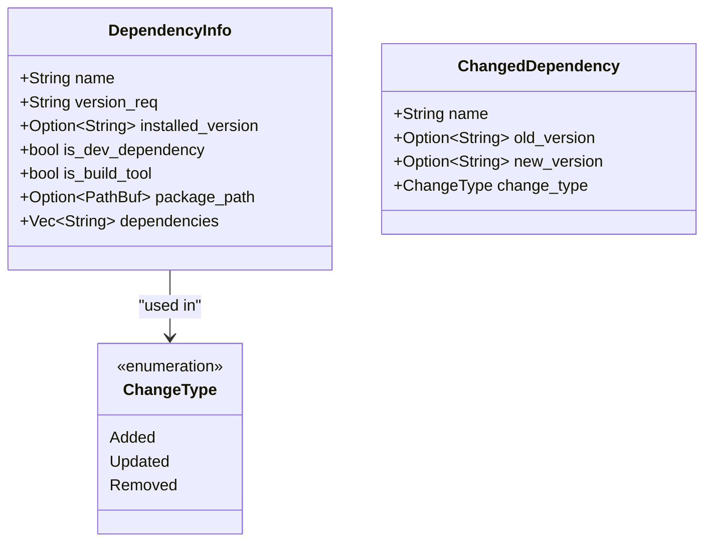

**图表来源**
- [dependency_tree.rs:33-50](file://crates/iris-jetcrab-engine/src/dependency_tree.rs#L33-L50)
- [dependency_tree.rs:367-374](file://crates/iris-jetcrab-engine/src/dependency_tree.rs#L367-L374)

#### 编译工具过滤机制

系统内置了全面的编译工具识别列表，能够智能排除不需要编译到运行时的工具类依赖：

**排除的编译工具列表**：
- 构建工具：vite、webpack、rollup、esbuild、swc 等
- Babel 相关：babel-loader、@babel/core、@babel/preset-env 等
- TypeScript 编译：typescript、ts-loader、ts-node 等
- 开发工具：eslint、prettier、stylelint 等
- 测试工具：jest、vitest、mocha、chai 等
- 其他工具：nodemon、concurrently、cross-env 等

#### 依赖版本变化检测

通过计算依赖哈希值来检测版本变化，确保只有在真正需要时才进行重新编译：


**图表来源**
- [dependency_tree.rs:254-301](file://crates/iris-jetcrab-engine/src/dependency_tree.rs#L254-L301)

**章节来源**
- [dependency_tree.rs:15-31](file://crates/iris-jetcrab-engine/src/dependency_tree.rs#L15-L31)
- [dependency_tree.rs:134-164](file://crates/iris-jetcrab-engine/src/dependency_tree.rs#L134-L164)
- [dependency_tree.rs:254-328](file://crates/iris-jetcrab-engine/src/dependency_tree.rs#L254-L328)

### 依赖扫描器 (DependencyScanner)

**新增** 依赖扫描器是本次更新的核心组件，负责自动扫描项目源码中的依赖问题并提供修复建议。

#### 核心功能

1. **自动依赖扫描**：递归扫描项目源码，识别所有 import 语句
2. **问题检测**：检测缺失的 npm 包、本地文件、CSS 文件和静态资源
3. **自动修复**：支持自动下载缺失的 npm 包并更新 package.json
4. **版本管理**：通过 irisResolved 字段跟踪已解析的版本

#### 依赖问题类型

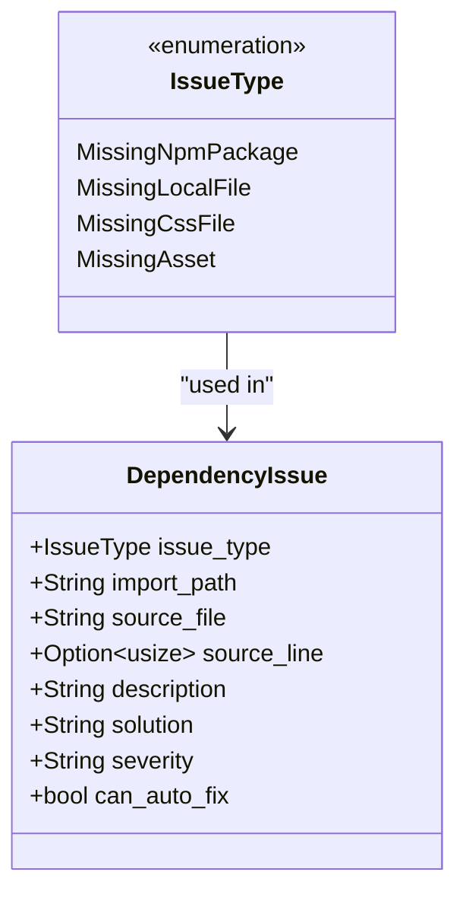

**图表来源**
- [dependency_scanner.rs:15-27](file://crates/iris-jetcrab-engine/src/dependency_scanner.rs#L15-L27)
- [dependency_scanner.rs:29-48](file://crates/iris-jetcrab-engine/src/dependency_scanner.rs#L29-L48)

#### 扫描算法

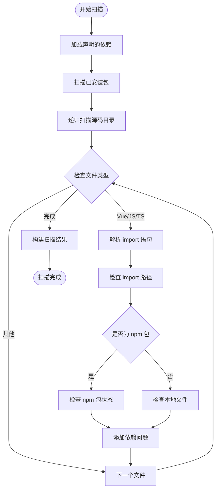

**图表来源**
- [dependency_scanner.rs:95-122](file://crates/iris-jetcrab-engine/src/dependency_scanner.rs#L95-L122)
- [dependency_scanner.rs:244-259](file://crates/iris-jetcrab-engine/src/dependency_scanner.rs#L244-L259)

#### 自动修复流程

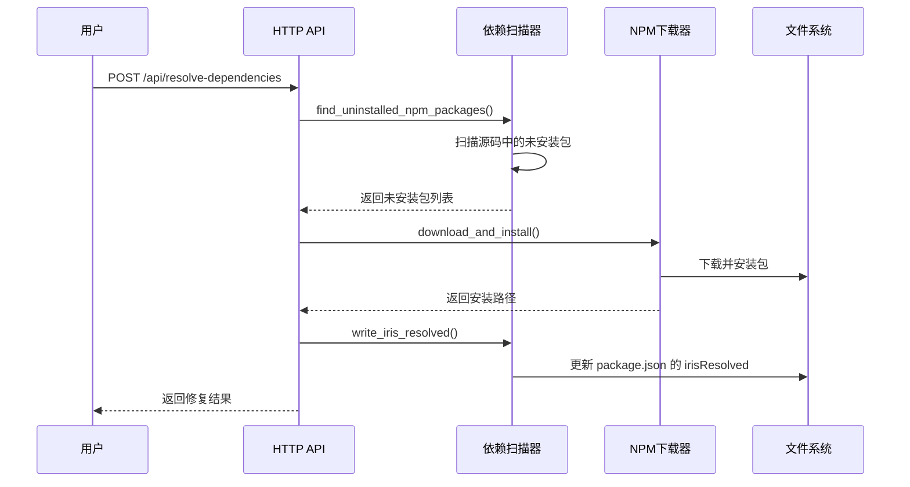

**图表来源**
- [routes.rs:682-800](file://crates/iris-jetcrab-cli/src/server/routes.rs#L682-L800)
- [dependency_scanner.rs:591-611](file://crates/iris-jetcrab-engine/src/dependency_scanner.rs#L591-L611)

**章节来源**
- [dependency_scanner.rs:67-819](file://crates/iris-jetcrab-engine/src/dependency_scanner.rs#L67-L819)

### 模块依赖图 (ModuleGraph)

模块依赖图负责管理 Vue 项目中模块间的依赖关系，支持复杂的依赖分析和循环检测。

#### 循环依赖检测算法

系统使用深度优先搜索（DFS）算法来检测循环依赖：


**图表来源**
- [module_graph.rs:43-99](file://crates/iris-jetcrab-engine/src/module_graph.rs#L43-L99)

#### 拓扑排序实现

系统提供拓扑排序功能，确保模块按照正确的依赖顺序进行编译：

**拓扑排序流程**：
1. 对每个未访问的模块执行 DFS
2. 在递归返回时将模块加入结果栈
3. 最终反转结果得到正确的编译顺序
4. 如果检测到循环依赖，返回错误信息

**章节来源**
- [module_graph.rs:43-154](file://crates/iris-jetcrab-engine/src/module_graph.rs#L43-L154)

### 项目扫描器 (ProjectScanner)

项目扫描器负责自动识别和解析 Vue 项目的结构配置：

#### 项目结构识别

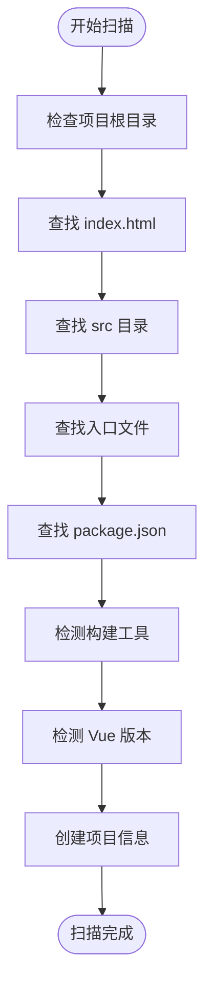

**图表来源**
- [project_scanner.rs:53-93](file://crates/iris-jetcrab-engine/src/project_scanner.rs#L53-L93)

**章节来源**
- [project_scanner.rs:53-267](file://crates/iris-jetcrab-engine/src/project_scanner.rs#L53-L267)

### NPM 下载器 (NpmDownloader)

**新增** NPM 下载器提供自动下载和安装 npm 包的能力：

#### 核心功能

1. **HTTP 下载**：使用 ureq 客户端从 npm registry 下载包
2. **版本解析**：支持指定版本、范围版本和 latest 版本
3. **Tarball 解压**：使用 flate2 和 tar 库解压 .tgz 文件
4. **缓存管理**：避免重复下载已安装的包
5. **进度回调**：支持下载进度通知

#### 下载流程

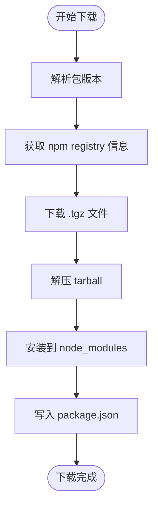

**图表来源**
- [npm_downloader.rs:158-215](file://crates/iris-jetcrab-engine/src/npm_downloader.rs#L158-L215)

**章节来源**
- [npm_downloader.rs:56-363](file://crates/iris-jetcrab-engine/src/npm_downloader.rs#L56-L363)

## HTTP API 接口

**新增** Iris JetCrab CLI 提供了完整的 HTTP API 接口，支持依赖问题检测和自动修复：

### 依赖问题扫描 API

#### 端点
```
GET /api/dependency-issues
```

#### 功能
扫描项目中的依赖问题并返回详细报告。

#### 响应格式
```json
{
  "issues": [
    {
      "issue_type": "missing_npm_package",
      "import_path": "element-plus",
      "source_file": "src/main.ts",
      "source_line": 3,
      "description": "npm 包 'element-plus' 在 'src/main.ts' 中引用，但未在 package.json 中声明",
      "solution": "自动从 npm registry 下载 'element-plus@latest' 到 node_modules/，并写入 package.json 的 irisResolved 字段",
      "severity": "error",
      "can_auto_fix": true
    }
  ],
  "declared_packages": {
    "vue": "^3.0.0",
    "axios": "^1.0.0"
  },
  "installed_packages": ["vue", "axios"],
  "has_node_modules": true,
  "source_file_count": 5,
  "has_issues": true,
  "fixable_count": 1,
  "iris_resolved": {}
}
```

### 自动修复 API

#### 端点
```
POST /api/resolve-dependencies
```

#### 功能
自动下载缺失的 npm 包并更新项目配置。

#### 响应格式
```json
{
  "status": "started",
  "message": "开始下载 2 个 npm 包，请查看 WebSocket 进度",
  "downloading": ["element-plus", "ant-design-vue"]
}
```

### 解决页面

#### 端点
```
GET /resolve.html
```

#### 功能
提供 Web 界面用于查看和解决依赖问题。

**章节来源**
- [routes.rs:634-670](file://crates/iris-jetcrab-cli/src/server/routes.rs#L634-L670)
- [routes.rs:679-800](file://crates/iris-jetcrab-cli/src/server/routes.rs#L679-L800)

## 依赖关系分析

依赖树管理功能涉及多个 crate 之间的复杂交互关系：

```mermaid
graph TB
subgraph "CLI 层"
JJC[iris-jetcrab-cli]
CC[CompilerCache]
RT[Routes]
end
subgraph "引擎层"
JJE[iris-jetcrab-engine]
DT[DependencyTree]
DS[DependencyScanner]
MG[ModuleGraph]
PS[ProjectScanner]
ND[NpmDownloader]
end
subgraph "核心组件"
CORE[iris-core]
SFC[iris-sfc]
GPU[iris-gpu]
LAYOUT[iris-layout]
DOM[iris-dom]
end
subgraph "外部依赖"
WGPU[wgpu]
TOKIO[tokio]
SERDE[serde]
UREQ[ureq]
FLATE2[flate2]
TAR[tar]
end
JJC --> CC
JJC --> RT
CC --> DT
CC --> MG
CC --> PS
RT --> DS
RT --> ND
DS --> ND
DT --> CORE
DT --> SFC
DT --> GPU
DT --> LAYOUT
DT --> DOM
MG --> CORE
MG --> SFC
MG --> WGPU
JJC --> TOKIO
JJC --> SERDE
JJC --> UREQ
JJE --> TOKIO
JJE --> SERDE
ND --> UREQ
ND --> FLATE2
ND --> TAR
```

**图表来源**
- [Cargo.toml:13-53](file://crates/iris-jetcrab-engine/Cargo.toml#L13-L53)
- [Cargo.toml:17-53](file://crates/iris-jetcrab-cli/Cargo.toml#L17-L53)

### 关键依赖关系

1. **引擎到核心组件的依赖**：依赖树管理器依赖于多个核心组件来提供完整的功能
2. **CLI 到引擎的依赖**：CLI 工具通过编译器缓存和路由层间接使用引擎功能
3. **扫描器到下载器的依赖**：依赖扫描器使用 NPM 下载器进行自动修复
4. **异步运行时依赖**：所有组件都依赖 tokio 提供异步支持
5. **序列化支持**：使用 serde 进行数据序列化和反序列化
6. **HTTP 客户端依赖**：使用 ureq 进行网络请求
7. **压缩库依赖**：使用 flate2 和 tar 进行文件解压

**章节来源**
- [Cargo.toml:1-69](file://crates/iris-jetcrab-engine/Cargo.toml#L1-L69)
- [Cargo.toml:1-54](file://crates/iris-jetcrab-cli/Cargo.toml#L1-L54)

## 性能考虑

**更新** 依赖树管理功能在架构重构后实现了显著的性能优化：

### 缓存策略

1. **模块级缓存**：每个编译后的模块单独缓存，支持按需访问
2. **依赖树缓存**：将解析后的依赖树保存到 `.iris-cache/dependency-tree.json` 文件中
3. **增量编译**：仅在依赖变化时重新编译受影响的模块
4. **路径解析缓存**：模块路径解析结果可被缓存以提升性能

### 内存优化

1. **懒加载**：模块依赖图按需构建，避免不必要的内存占用
2. **智能清理**：及时清理不再使用的缓存数据
3. **紧凑存储**：使用高效的哈希表和向量存储数据结构
4. **扫描器优化**：使用 HashSet 和 HashMap 减少内存占用

### 并发处理

1. **异步操作**：所有文件系统操作都是异步的，避免阻塞主线程
2. **并发编译**：支持并行编译多个模块
3. **锁粒度优化**：使用细粒度的互斥锁减少竞争
4. **下载并发**：NPM 下载器支持并行下载多个包（未来版本）

### 网络优化

1. **HTTP 客户端复用**：NPM 下载器复用 HTTP 客户端连接
2. **进度回调**：避免频繁的 I/O 操作
3. **版本解析优化**：优先从传递依赖中解析版本

## 故障排除指南

### 常见问题及解决方案

#### 1. 模块缓存失效问题

**症状**：修改文件后仍使用旧的缓存版本
**可能原因**：
- 缓存失效逻辑不正确
- 文件系统监控异常
- 路径解析错误

**解决方案**：
- 检查 HMR 事件处理逻辑
- 验证文件路径解析是否正确
- 确认缓存失效策略是否生效

#### 2. 依赖树解析失败

**症状**：无法从 package.json 构建依赖树
**可能原因**：
- package.json 文件损坏
- 权限不足无法读取文件
- 路径不存在

**解决方案**：
- 检查 package.json 格式是否正确
- 确认文件权限设置
- 验证项目根目录路径

#### 3. 编译工具误判

**症状**：某些必要的运行时依赖被错误地排除
**可能原因**：依赖名称匹配规则过于严格
**解决方案**：
- 检查 `BUILD_TOOLS` 列表是否包含误判的依赖
- 手动调整排除规则
- 联系维护团队更新规则

#### 4. 缓存失效问题

**症状**：缓存数据过期但未正确刷新
**可能原因**：
- 缓存文件损坏
- 权限问题导致无法写入
- 版本不兼容

**解决方案**：
- 删除 `.iris-cache` 目录重新生成
- 检查文件权限设置
- 清理所有缓存后重新编译

#### 5. 循环依赖检测误报

**症状**：正常依赖关系被误判为循环依赖
**可能原因**：依赖解析不准确
**解决方案**：
- 检查模块导入路径
- 验证依赖声明的准确性
- 简化复杂的依赖关系

#### 6. 依赖扫描失败

**症状**：依赖扫描器无法正确识别依赖问题
**可能原因**：
- 源码文件格式不支持
- import 语法不规范
- 路径解析错误

**解决方案**：
- 检查源码文件的 import 语法
- 验证文件路径是否正确
- 确认项目结构符合预期

#### 7. 自动下载失败

**症状**：无法自动下载缺失的 npm 包
**可能原因**：
- 网络连接问题
- npm registry 无法访问
- 权限不足

**解决方案**：
- 检查网络连接状态
- 验证 npm registry 可访问性
- 确认 node_modules 目录权限
- 手动安装依赖包

#### 8. HTTP API 访问问题

**症状**：无法访问依赖扫描 API
**可能原因**：
- 服务器未启动
- 端口被占用
- 路由配置错误

**解决方案**：
- 确认开发服务器正在运行
- 检查端口占用情况
- 验证路由配置
- 查看服务器日志

**章节来源**
- [dependency_tree_test.rs:1-113](file://crates/iris-jetcrab-engine/tests/dependency_tree_test.rs#L1-L113)

## 结论

依赖树管理功能作为 Iris JetCrab 引擎的核心组件，经过重大架构重构后，成功实现了从项目级编译到按需编译的转变。通过精心设计的数据结构、高效的算法实现和完善的缓存机制，该功能为开发者提供了：

1. **智能的依赖解析**：自动识别和解析复杂的 npm 依赖关系
2. **精准的编译控制**：智能排除编译工具，专注于运行时依赖
3. **高效的按需编译**：仅在必要时编译单个模块，大幅提升开发效率
4. **可靠的模块级缓存**：避免重复计算，提升系统响应速度
5. **完善的错误处理**：提供详细的错误信息和恢复机制
6. **自动依赖扫描**：**新增** 自动扫描源码中的依赖问题
7. **HTTP API 支持**：**新增** 提供完整的依赖问题检测和自动修复接口
8. **自动下载能力**：**新增** 支持自动下载缺失的 npm 包
9. **版本跟踪管理**：**新增** 通过 irisResolved 字段跟踪已解析版本

该功能不仅满足了当前的开发需求，还为未来的功能扩展（如 monorepo 支持、依赖冲突检测、并行下载等）奠定了坚实的基础。通过持续的优化和改进，依赖树管理功能将继续为 Iris JetCrab 生态系统的稳定发展提供重要支撑。

**更新** 本次架构重构显著提升了依赖管理的自动化程度和用户体验，使开发者能够更专注于代码编写，而无需担心复杂的依赖配置和管理问题。按需编译模式不仅提升了开发效率，还为未来的功能扩展提供了更大的灵活性。