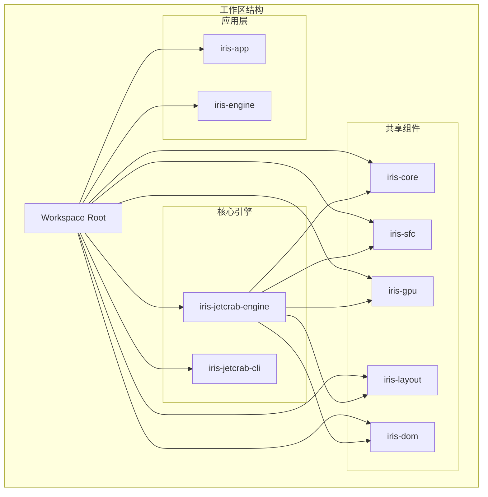
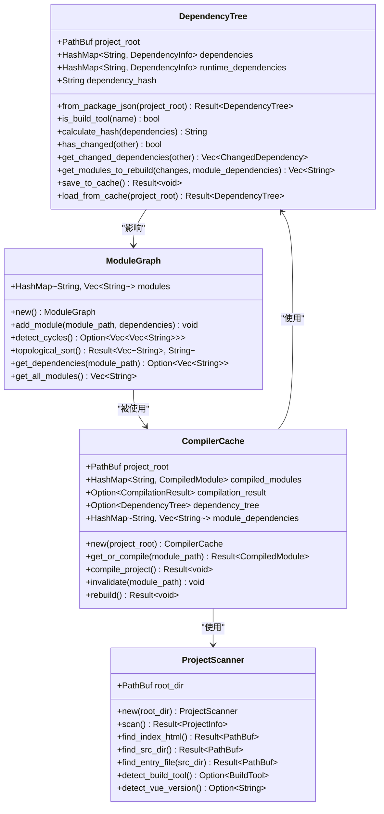
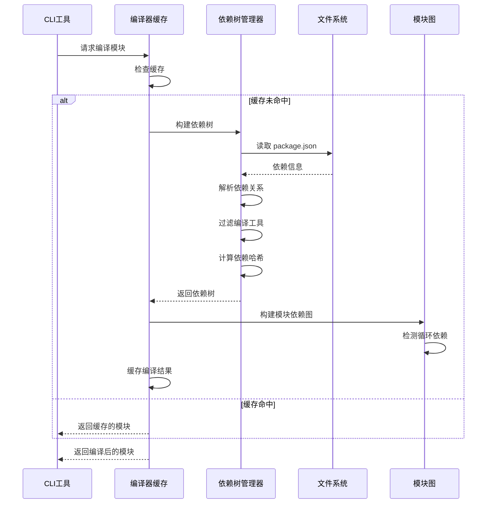
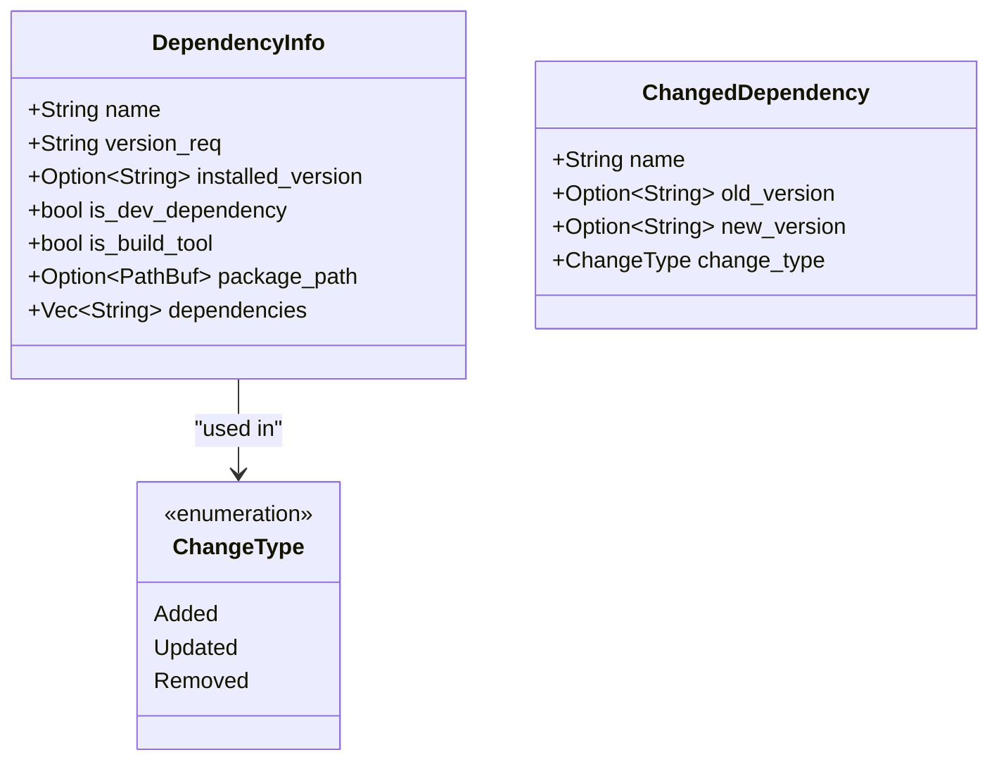
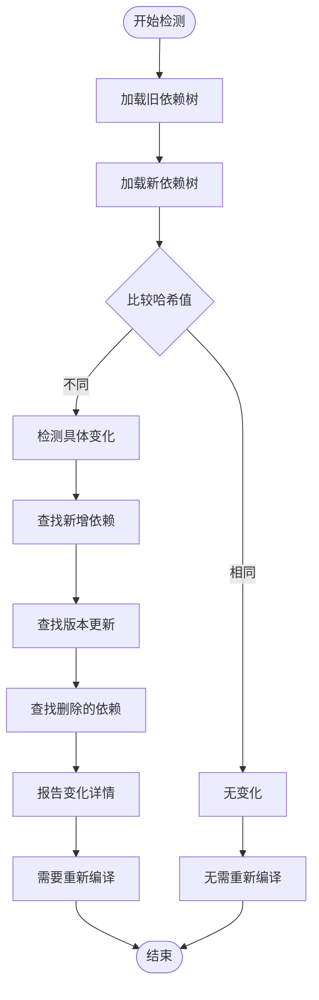
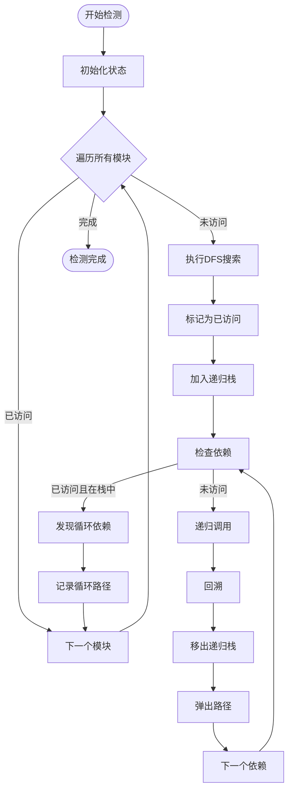
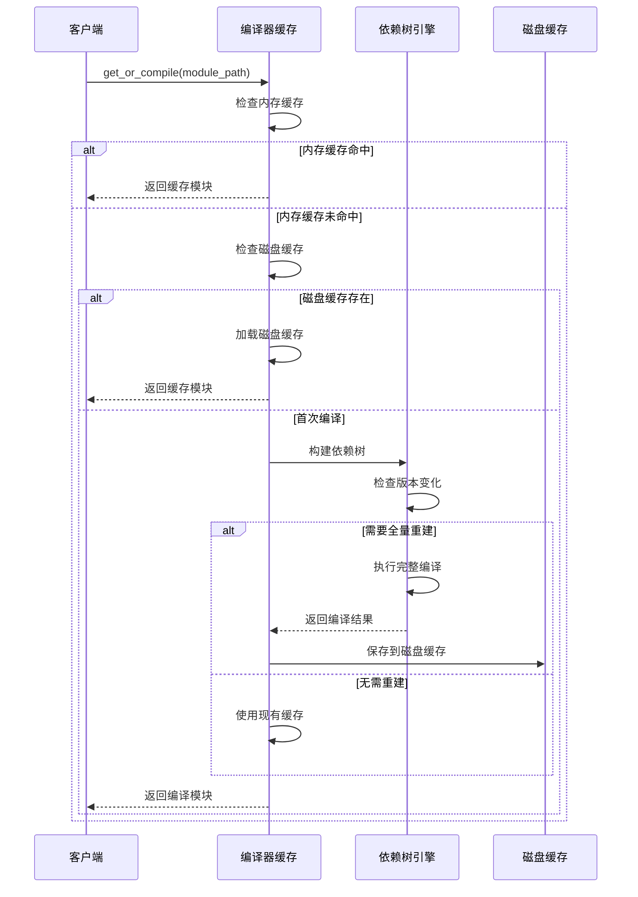
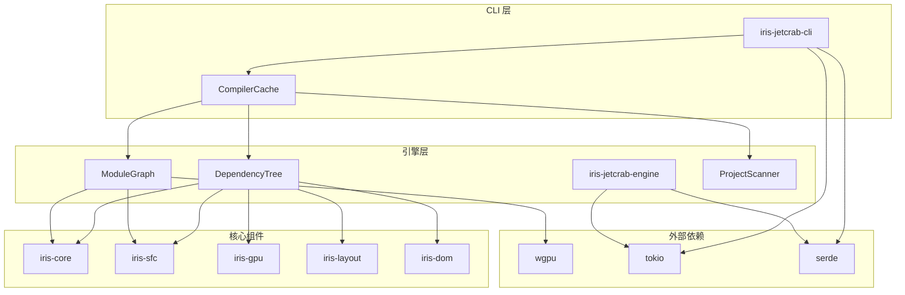

# 依赖树管理功能文档

<cite>
**本文档引用的文件**
- [dependency_tree.rs](file://crates/iris-jetcrab-engine/src/dependency_tree.rs)
- [module_graph.rs](file://crates/iris-jetcrab-engine/src/module_graph.rs)
- [project_scanner.rs](file://crates/iris-jetcrab-engine/src/project_scanner.rs)
- [DEPENDENCY_TREE_MANAGEMENT.md](file://docs/DEPENDENCY_TREE_MANAGEMENT.md)
- [dependency_tree_test.rs](file://crates/iris-jetcrab-engine/tests/dependency_tree_test.rs)
- [engine.rs](file://crates/iris-jetcrab-engine/src/engine.rs)
- [sfc_compiler.rs](file://crates/iris-jetcrab-engine/src/sfc_compiler.rs)
- [compiler_cache.rs](file://crates/iris-jetcrab-cli/src/server/compiler_cache.rs)
- [utils.rs](file://crates/iris-jetcrab-cli/src/utils.rs)
- [Cargo.toml](file://crates/iris-jetcrab-engine/Cargo.toml)
- [package.json](file://examples/vue-demo/package.json)
- [iris.config.json](file://examples/vue-demo/iris.config.json)
</cite>

## 目录
1. [简介](#简介)
2. [项目结构](#项目结构)
3. [核心组件](#核心组件)
4. [架构概览](#架构概览)
5. [详细组件分析](#详细组件分析)
6. [依赖关系分析](#依赖关系分析)
7. [性能考虑](#性能考虑)
8. [故障排除指南](#故障排除指南)
9. [结论](#结论)

## 简介

依赖树管理功能是 Iris JetCrab 引擎的核心组成部分，负责管理 Vue 项目的 npm 依赖关系。该功能实现了智能的依赖解析、编译工具过滤、版本变化检测和按需重新编译等关键特性，为 Vue 项目的高效开发和运行提供了坚实的基础。

该模块主要解决以下问题：
- 自动解析 package.json 中的依赖关系
- 智能排除编译工具类依赖（如 Vite、Webpack、Babel 等）
- 检测依赖版本变化并触发增量编译
- 提供依赖树缓存机制以提升性能
- 支持模块依赖图的构建和分析

## 项目结构

Iris JetCrab 项目采用多 crate 的工作区结构，依赖树管理功能主要集中在 `iris-jetcrab-engine` crate 中：

**图表来源**
- [Cargo.toml:1-50](file://Cargo.toml#L1-L50)

**章节来源**
- [Cargo.toml:1-50](file://Cargo.toml#L1-L50)
- [Cargo.toml:1-69](file://crates/iris-jetcrab-engine/Cargo.toml#L1-L69)

## 核心组件

依赖树管理功能由多个相互协作的组件组成，每个组件都有明确的职责和接口：

### 1. 依赖树管理器 (DependencyTree)

负责解析和管理 npm 依赖关系的核心组件，提供完整的依赖树构建、维护和查询功能。

### 2. 模块依赖图 (ModuleGraph)

管理 Vue 项目中模块间的依赖关系，支持循环依赖检测和拓扑排序。

### 3. 项目扫描器 (ProjectScanner)

扫描和解析 Vue 项目的目录结构，识别项目配置和构建工具类型。

### 4. 编译器缓存 (CompilerCache)

在 CLI 层面管理编译缓存，实现按需编译和依赖变化检测。

**图表来源**
- [dependency_tree.rs:52-357](file://crates/iris-jetcrab-engine/src/dependency_tree.rs#L52-L357)
- [module_graph.rs:8-155](file://crates/iris-jetcrab-engine/src/module_graph.rs#L8-L155)
- [project_scanner.rs:42-267](file://crates/iris-jetcrab-engine/src/project_scanner.rs#L42-L267)
- [compiler_cache.rs:20-222](file://crates/iris-jetcrab-cli/src/server/compiler_cache.rs#L20-L222)

**章节来源**
- [dependency_tree.rs:1-375](file://crates/iris-jetcrab-engine/src/dependency_tree.rs#L1-L375)
- [module_graph.rs:1-228](file://crates/iris-jetcrab-engine/src/module_graph.rs#L1-L228)
- [project_scanner.rs:1-268](file://crates/iris-jetcrab-engine/src/project_scanner.rs#L1-L268)
- [compiler_cache.rs:1-223](file://crates/iris-jetcrab-cli/src/server/compiler_cache.rs#L1-L223)

## 架构概览

依赖树管理功能在整个 Iris JetCrab 生态系统中扮演着关键角色，连接了底层引擎、CLI 工具和用户应用：

**图表来源**
- [compiler_cache.rs:61-165](file://crates/iris-jetcrab-cli/src/server/compiler_cache.rs#L61-L165)
- [dependency_tree.rs:65-132](file://crates/iris-jetcrab-engine/src/dependency_tree.rs#L65-L132)
- [module_graph.rs:43-154](file://crates/iris-jetcrab-engine/src/module_graph.rs#L43-L154)

## 详细组件分析

### 依赖树管理器 (DependencyTree)

依赖树管理器是整个依赖树管理功能的核心，负责解析和维护 npm 依赖关系。

#### 核心数据结构

**图表来源**
- [dependency_tree.rs:33-50](file://crates/iris-jetcrab-engine/src/dependency_tree.rs#L33-L50)
- [dependency_tree.rs:367-374](file://crates/iris-jetcrab-engine/src/dependency_tree.rs#L367-L374)

#### 编译工具过滤机制

系统内置了全面的编译工具识别列表，能够智能排除不需要编译到运行时的工具类依赖：

**排除的编译工具列表**：
- 构建工具：vite、webpack、rollup、esbuild、swc 等
- Babel 相关：babel-loader、@babel/core、@babel/preset-env 等
- TypeScript 编译：typescript、ts-loader、ts-node 等
- 开发工具：eslint、prettier、stylelint 等
- 测试工具：jest、vitest、mocha、chai 等
- 其他工具：nodemon、concurrently、cross-env 等

#### 依赖版本变化检测

通过计算依赖哈希值来检测版本变化，确保只有在真正需要时才进行重新编译：

**图表来源**
- [dependency_tree.rs:254-301](file://crates/iris-jetcrab-engine/src/dependency_tree.rs#L254-L301)

**章节来源**
- [dependency_tree.rs:15-31](file://crates/iris-jetcrab-engine/src/dependency_tree.rs#L15-L31)
- [dependency_tree.rs:134-164](file://crates/iris-jetcrab-engine/src/dependency_tree.rs#L134-L164)
- [dependency_tree.rs:254-328](file://crates/iris-jetcrab-engine/src/dependency_tree.rs#L254-L328)

### 模块依赖图 (ModuleGraph)

模块依赖图负责管理 Vue 项目中模块间的依赖关系，支持复杂的依赖分析和循环检测。

#### 循环依赖检测算法

系统使用深度优先搜索（DFS）算法来检测循环依赖：

**图表来源**
- [module_graph.rs:43-99](file://crates/iris-jetcrab-engine/src/module_graph.rs#L43-L99)

#### 拓扑排序实现

系统提供拓扑排序功能，确保模块按照正确的依赖顺序进行编译：

**拓扑排序流程**：
1. 对每个未访问的模块执行 DFS
2. 在递归返回时将模块加入结果栈
3. 最终反转结果得到正确的编译顺序
4. 如果检测到循环依赖，返回错误信息

**章节来源**
- [module_graph.rs:43-154](file://crates/iris-jetcrab-engine/src/module_graph.rs#L43-L154)

### 项目扫描器 (ProjectScanner)

项目扫描器负责自动识别和解析 Vue 项目的结构配置：

#### 项目结构识别

**图表来源**
- [project_scanner.rs:53-93](file://crates/iris-jetcrab-engine/src/project_scanner.rs#L53-L93)

**章节来源**
- [project_scanner.rs:53-267](file://crates/iris-jetcrab-engine/src/project_scanner.rs#L53-L267)

### 编译器缓存 (CompilerCache)

编译器缓存层在 CLI 工具中实现了智能的按需编译和缓存管理：

#### 缓存策略

**图表来源**
- [compiler_cache.rs:61-165](file://crates/iris-jetcrab-cli/src/server/compiler_cache.rs#L61-L165)

**章节来源**
- [compiler_cache.rs:36-222](file://crates/iris-jetcrab-cli/src/server/compiler_cache.rs#L36-L222)

## 依赖关系分析

依赖树管理功能涉及多个 crate 之间的复杂交互关系：

**图表来源**
- [Cargo.toml:13-53](file://crates/iris-jetcrab-engine/Cargo.toml#L13-L53)
- [Cargo.toml:17-53](file://crates/iris-jetcrab-cli/Cargo.toml#L17-L53)

### 关键依赖关系

1. **引擎到核心组件的依赖**：依赖树管理器依赖于多个核心组件来提供完整的功能
2. **CLI 到引擎的依赖**：CLI 工具通过编译器缓存间接使用引擎功能
3. **异步运行时依赖**：所有组件都依赖 tokio 提供异步支持
4. **序列化支持**：使用 serde 进行数据序列化和反序列化

**章节来源**
- [Cargo.toml:1-69](file://crates/iris-jetcrab-engine/Cargo.toml#L1-L69)
- [Cargo.toml:1-54](file://crates/iris-jetcrab-cli/Cargo.toml#L1-L54)

## 性能考虑

依赖树管理功能在设计时充分考虑了性能优化：

### 缓存策略

1. **依赖树缓存**：将解析后的依赖树保存到 `.iris-cache/dependency-tree.json` 文件中
2. **编译结果缓存**：缓存完整的编译结果，避免重复编译
3. **增量编译**：仅在依赖变化时重新编译受影响的模块

### 内存优化

1. **懒加载**：模块依赖图按需构建，避免不必要的内存占用
2. **智能清理**：及时清理不再使用的缓存数据
3. **紧凑存储**：使用高效的哈希表和向量存储数据结构

### 并发处理

1. **异步操作**：所有文件系统操作都是异步的，避免阻塞主线程
2. **并发编译**：支持并行编译多个模块
3. **锁粒度优化**：使用细粒度的互斥锁减少竞争

## 故障排除指南

### 常见问题及解决方案

#### 1. 依赖树解析失败

**症状**：无法从 package.json 构建依赖树
**可能原因**：
- package.json 文件损坏
- 权限不足无法读取文件
- 路径不存在

**解决方案**：
- 检查 package.json 格式是否正确
- 确认文件权限设置
- 验证项目根目录路径

#### 2. 编译工具误判

**症状**：某些必要的运行时依赖被错误地排除
**可能原因**：依赖名称匹配规则过于严格
**解决方案**：
- 检查 `BUILD_TOOLS` 列表是否包含误判的依赖
- 手动调整排除规则
- 联系维护团队更新规则

#### 3. 缓存失效问题

**症状**：缓存数据过期但未正确刷新
**可能原因**：
- 缓存文件损坏
- 权限问题导致无法写入
- 版本不兼容

**解决方案**：
- 删除 `.iris-cache` 目录重新生成
- 检查文件权限设置
- 清理所有缓存后重新编译

#### 4. 循环依赖检测误报

**症状**：正常依赖关系被误判为循环依赖
**可能原因**：依赖解析不准确
**解决方案**：
- 检查模块导入路径
- 验证依赖声明的准确性
- 简化复杂的依赖关系

**章节来源**
- [dependency_tree_test.rs:1-113](file://crates/iris-jetcrab-engine/tests/dependency_tree_test.rs#L1-L113)

## 结论

依赖树管理功能作为 Iris JetCrab 引擎的核心组件，成功实现了 Vue 项目依赖关系的智能化管理。通过精心设计的数据结构、高效的算法实现和完善的缓存机制，该功能为开发者提供了：

1. **智能的依赖解析**：自动识别和解析复杂的 npm 依赖关系
2. **精准的编译控制**：智能排除编译工具，专注于运行时依赖
3. **高效的增量编译**：仅在必要时重新编译，大幅提升开发效率
4. **可靠的缓存机制**：避免重复计算，提升系统响应速度
5. **完善的错误处理**：提供详细的错误信息和恢复机制

该功能不仅满足了当前的开发需求，还为未来的功能扩展（如 monorepo 支持、依赖冲突检测等）奠定了坚实的基础。通过持续的优化和改进，依赖树管理功能将继续为 Iris JetCrab 生态系统的稳定发展提供重要支撑。