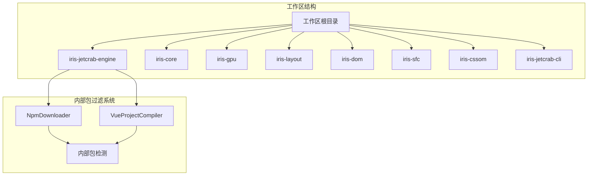
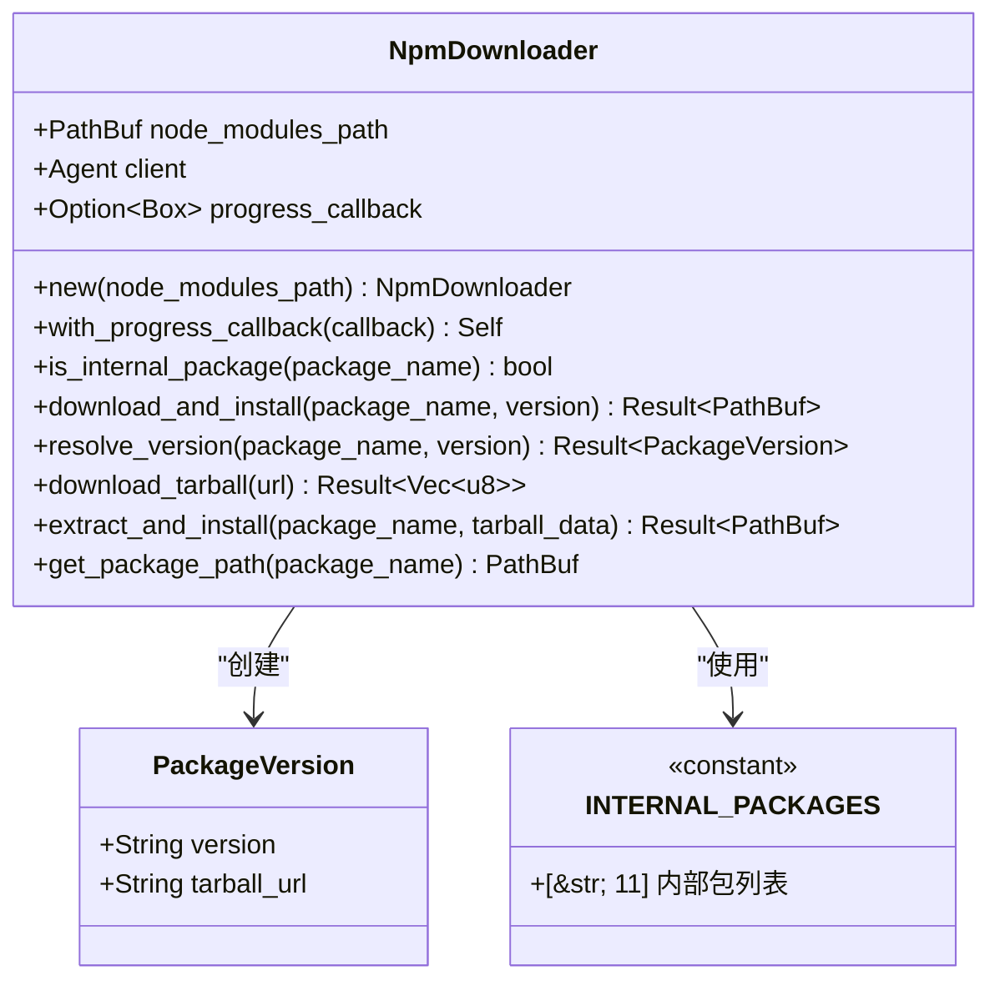
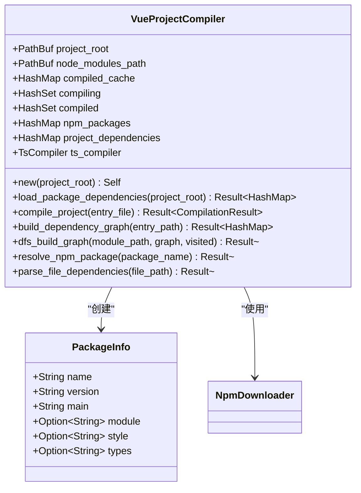
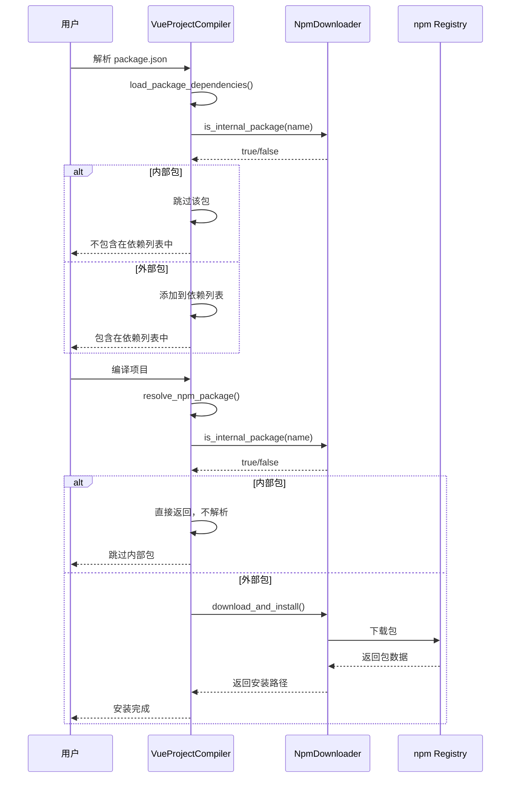
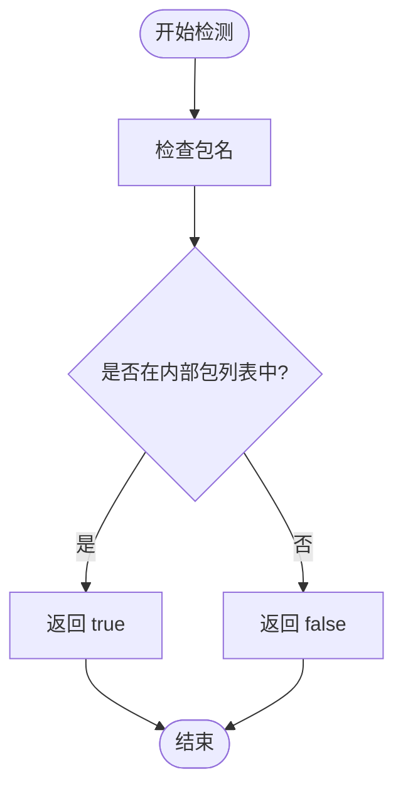
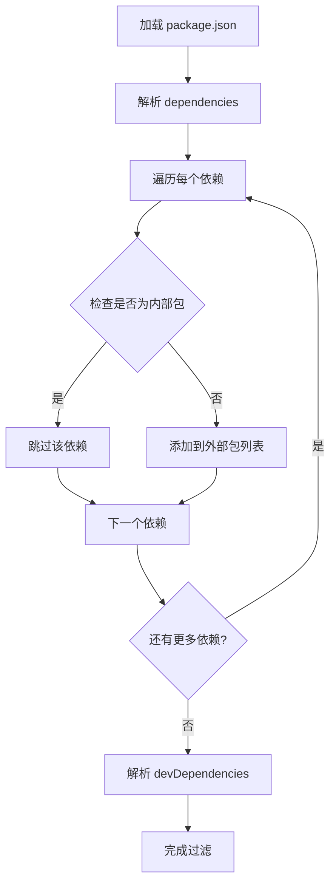
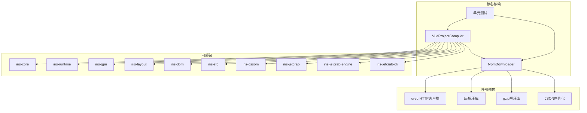

# 内部包过滤系统

<cite>
**本文档引用的文件**
- [INTERNAL_PACKAGE_FILTER.md](file://docs/INTERNAL_PACKAGE_FILTER.md)
- [internal_package_filter_test.rs](file://crates/iris-jetcrab-engine/tests/internal_package_filter_test.rs)
- [npm_downloader.rs](file://crates/iris-jetcrab-engine/src/npm_downloader.rs)
- [vue_compiler.rs](file://crates/iris-jetcrab-engine/src/vue_compiler.rs)
- [Cargo.toml](file://Cargo.toml)
- [Cargo.toml](file://crates/iris-jetcrab-engine/Cargo.toml)
</cite>

## 目录
1. [简介](#简介)
2. [项目结构](#项目结构)
3. [核心组件](#核心组件)
4. [架构概览](#架构概览)
5. [详细组件分析](#详细组件分析)
6. [依赖关系分析](#依赖关系分析)
7. [性能考虑](#性能考虑)
8. [故障排除指南](#故障排除指南)
9. [结论](#结论)

## 简介

内部包过滤系统是 Iris JetCrab CLI 的核心功能之一，它能够自动识别并过滤 Iris 框架的内部包，避免从 npm registry 下载这些由框架自身提供的组件。该系统通过三层过滤机制确保内部包不会被错误地下载和安装。

Iris 框架包含 11 个核心内部包，这些包构成了框架的基础功能：
- `iris` - Iris 框架核心
- `iris-runtime` - Iris 运行时
- `iris-core` - 核心库
- `iris-gpu` - WebGPU 渲染
- `iris-layout` - 布局引擎
- `iris-dom` - DOM API
- `iris-sfc` - SFC 编译器
- `iris-cssom` - CSSOM 解析
- `iris-jetcrab` - JetCrab JS 引擎
- `iris-jetcrab-engine` - Vue 编排引擎
- `iris-jetcrab-cli` - CLI 工具

## 项目结构

Iris JetCrab 项目采用多 crate 的工作区结构，内部包过滤系统主要分布在以下模块中：

**图表来源**
- [Cargo.toml:1-50](file://Cargo.toml#L1-L50)
- [Cargo.toml:1-76](file://crates/iris-jetcrab-engine/Cargo.toml#L1-L76)

**章节来源**
- [Cargo.toml:1-50](file://Cargo.toml#L1-L50)
- [Cargo.toml:1-76](file://crates/iris-jetcrab-engine/Cargo.toml#L1-L76)

## 核心组件

### NpmDownloader 结构体

NpmDownloader 是内部包过滤系统的核心组件，负责处理 npm 包的下载和安装逻辑。

**图表来源**
- [npm_downloader.rs:47-54](file://crates/iris-jetcrab-engine/src/npm_downloader.rs#L47-L54)
- [npm_downloader.rs:39-44](file://crates/iris-jetcrab-engine/src/npm_downloader.rs#L39-L44)
- [npm_downloader.rs:25-37](file://crates/iris-jetcrab-engine/src/npm_downloader.rs#L25-L37)

### VueProjectCompiler 组件

VueProjectCompiler 负责解析 Vue 项目的依赖关系，并在解析过程中应用内部包过滤。

**图表来源**
- [vue_compiler.rs:52-69](file://crates/iris-jetcrab-engine/src/vue_compiler.rs#L52-L69)
- [vue_compiler.rs:19-34](file://crates/iris-jetcrab-engine/src/vue_compiler.rs#L19-L34)

**章节来源**
- [npm_downloader.rs:47-54](file://crates/iris-jetcrab-engine/src/npm_downloader.rs#L47-L54)
- [vue_compiler.rs:52-69](file://crates/iris-jetcrab-engine/src/vue_compiler.rs#L52-L69)

## 架构概览

内部包过滤系统采用三层防护机制，确保内部包不会被意外下载：

**图表来源**
- [vue_compiler.rs:96-126](file://crates/iris-jetcrab-engine/src/vue_compiler.rs#L96-L126)
- [vue_compiler.rs:341-416](file://crates/iris-jetcrab-engine/src/vue_compiler.rs#L341-L416)
- [npm_downloader.rs:118-156](file://crates/iris-jetcrab-engine/src/npm_downloader.rs#L118-L156)

## 详细组件分析

### 内部包检测机制

内部包检测是整个过滤系统的核心，通过预定义的内部包列表实现快速识别。

**图表来源**
- [npm_downloader.rs:87-90](file://crates/iris-jetcrab-engine/src/npm_downloader.rs#L87-L90)

内部包检测的具体实现包括：

1. **包名匹配算法**：使用标准库的 `contains` 方法进行字符串匹配
2. **大小写敏感性**：包名匹配严格区分大小写
3. **性能优化**：内部包列表为固定长度数组，查找复杂度为 O(n)

**章节来源**
- [npm_downloader.rs:25-37](file://crates/iris-jetcrab-engine/src/npm_downloader.rs#L25-L37)
- [npm_downloader.rs:87-90](file://crates/iris-jetcrab-engine/src/npm_downloader.rs#L87-L90)

### package.json 解析过滤

在解析 package.json 文件时，系统会自动过滤掉内部包依赖：

**图表来源**
- [vue_compiler.rs:96-126](file://crates/iris-jetcrab-engine/src/vue_compiler.rs#L96-L126)

**章节来源**
- [vue_compiler.rs:96-126](file://crates/iris-jetcrab-engine/src/vue_compiler.rs#L96-L126)

### npm 包解析过滤

在编译过程中遇到 npm 包时的过滤逻辑：

**章节来源**
- [vue_compiler.rs:341-416](file://crates/iris-jetcrab-engine/src/vue_compiler.rs#L341-L416)

### 下载器层面过滤

即使代码尝试下载内部包，下载器也会阻止这一操作：

**章节来源**
- [npm_downloader.rs:118-156](file://crates/iris-jetcrab-engine/src/npm_downloader.rs#L118-L156)

## 依赖关系分析

内部包过滤系统与其他组件的依赖关系如下：

**图表来源**
- [Cargo.toml:13-56](file://crates/iris-jetcrab-engine/Cargo.toml#L13-L56)
- [npm_downloader.rs:10-18](file://crates/iris-jetcrab-engine/src/npm_downloader.rs#L10-L18)

**章节来源**
- [Cargo.toml:13-56](file://crates/iris-jetcrab-engine/Cargo.toml#L13-L56)

## 性能考虑

内部包过滤系统在设计时充分考虑了性能因素：

### 时间复杂度分析

1. **内部包检测**：O(n) - 其中 n 是内部包列表的长度（固定为 11）
2. **包名匹配**：O(m) - 其中 m 是包名的字符数
3. **整体复杂度**：O(n×m) - 对于每个包的检测

### 空间复杂度分析

1. **内部包列表**：O(n) - 固定大小的字符串数组
2. **缓存机制**：O(k) - k 为已解析的包数量
3. **依赖图**：O(d) - d 为依赖关系的数量

### 性能优化策略

1. **静态列表查找**：使用固定长度数组而非动态集合
2. **早期退出**：一旦发现内部包立即返回
3. **缓存机制**：避免重复解析相同的包
4. **异步处理**：下载操作使用异步非阻塞方式

## 故障排除指南

### 常见问题及解决方案

#### 问题：内部包仍然被下载

**可能原因**：
1. 内部包名称不在过滤列表中
2. 包名大小写不匹配
3. 版本号格式问题

**解决方法**：
1. 检查内部包列表是否包含该包
2. 确认包名大小写完全正确
3. 验证版本号格式

#### 问题：外部包无法下载

**可能原因**：
1. 网络连接问题
2. npm registry 服务不可用
3. 包名拼写错误

**解决方法**：
1. 检查网络连接状态
2. 确认 npm registry 可访问性
3. 验证包名拼写

#### 问题：过滤规则不生效

**可能原因**：
1. 代码未正确调用过滤函数
2. 缓存导致旧结果
3. 版本兼容性问题

**解决方法**：
1. 确认调用链中包含过滤步骤
2. 清理缓存重新执行
3. 检查版本兼容性

**章节来源**
- [internal_package_filter_test.rs:1-115](file://crates/iris-jetcrab-engine/tests/internal_package_filter_test.rs#L1-L115)

## 结论

内部包过滤系统通过三层防护机制实现了对 Iris 框架内部包的全面保护：

### 主要优势

1. **完整性保护**：确保所有内部包都不会被错误下载
2. **性能优化**：简单的字符串匹配算法保证高效执行
3. **可靠性**：多层过滤确保安全网的完整性
4. **可维护性**：清晰的代码结构便于维护和扩展

### 设计亮点

1. **分层过滤**：从 package.json 解析到下载器的完整保护链
2. **命名约定**：基于 `iris` 前缀的统一命名规范
3. **测试覆盖**：完整的单元测试确保功能正确性
4. **日志记录**：详细的调试信息便于问题排查

### 未来发展方向

1. **动态包列表**：支持运行时动态添加内部包
2. **智能识别**：基于包内容的智能识别机制
3. **性能监控**：实时监控过滤性能指标
4. **扩展接口**：支持第三方自定义过滤规则

通过这个精心设计的内部包过滤系统，Iris JetCrab CLI 能够确保框架内部组件与外部依赖的完美分离，为开发者提供稳定可靠的开发体验。