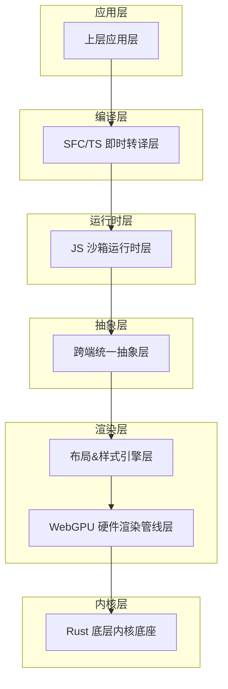
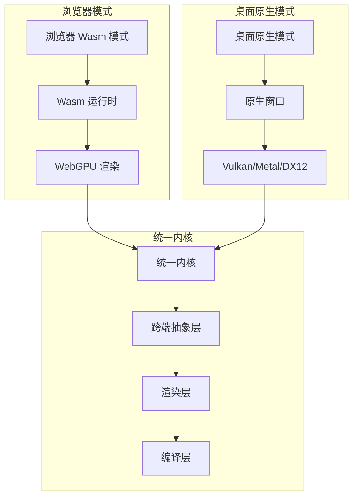
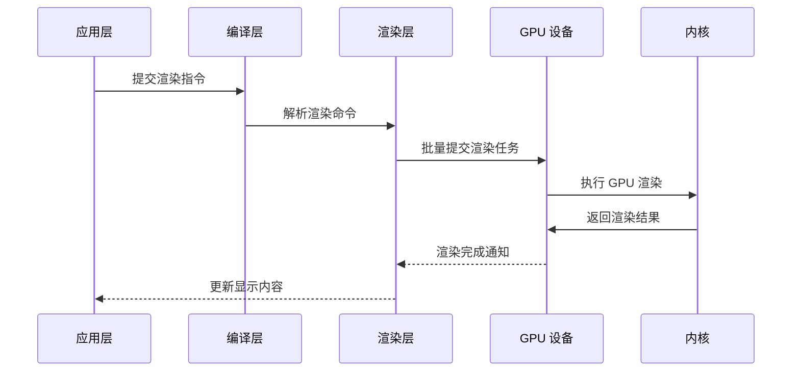
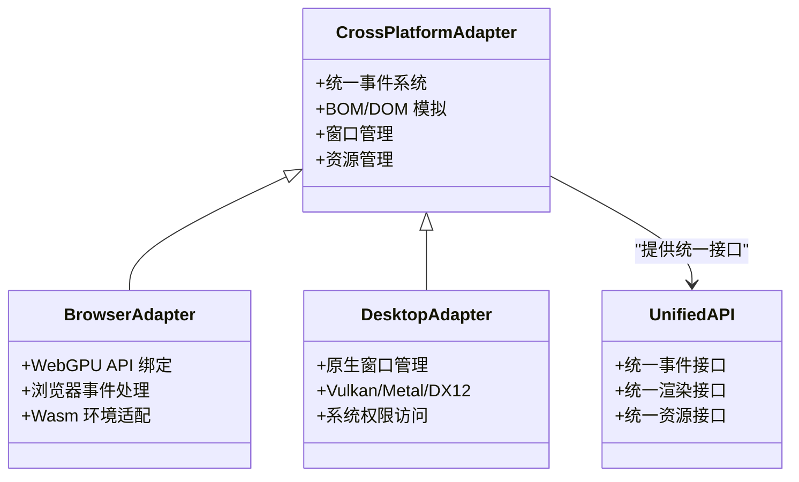
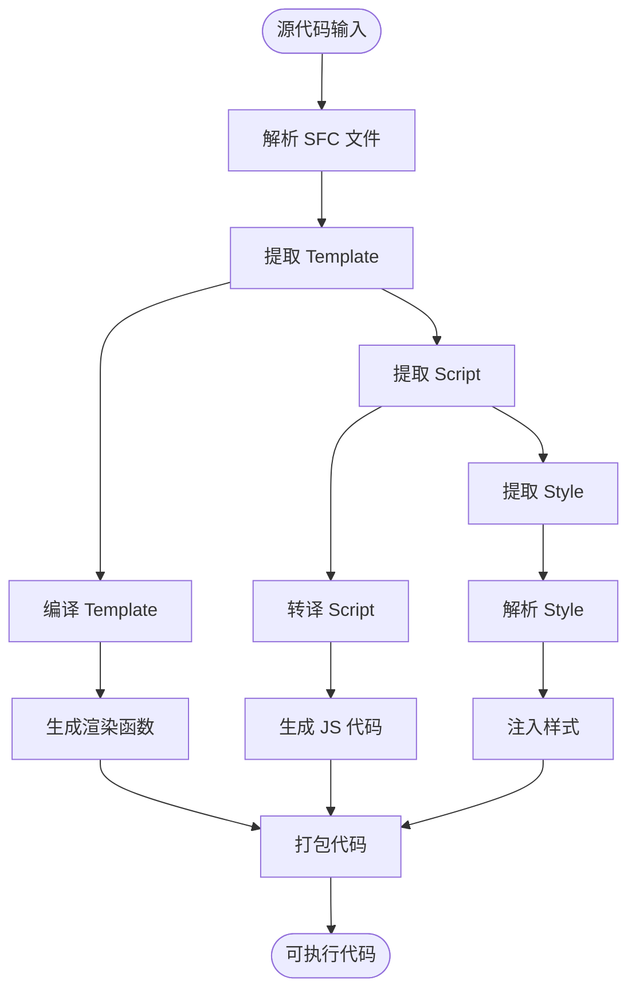
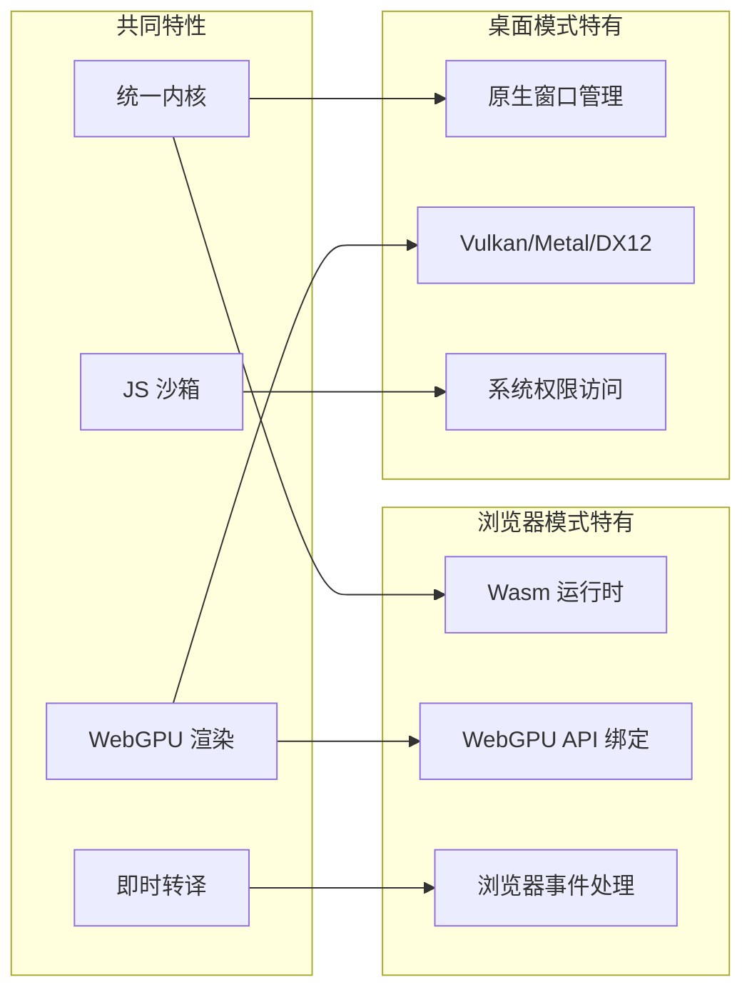
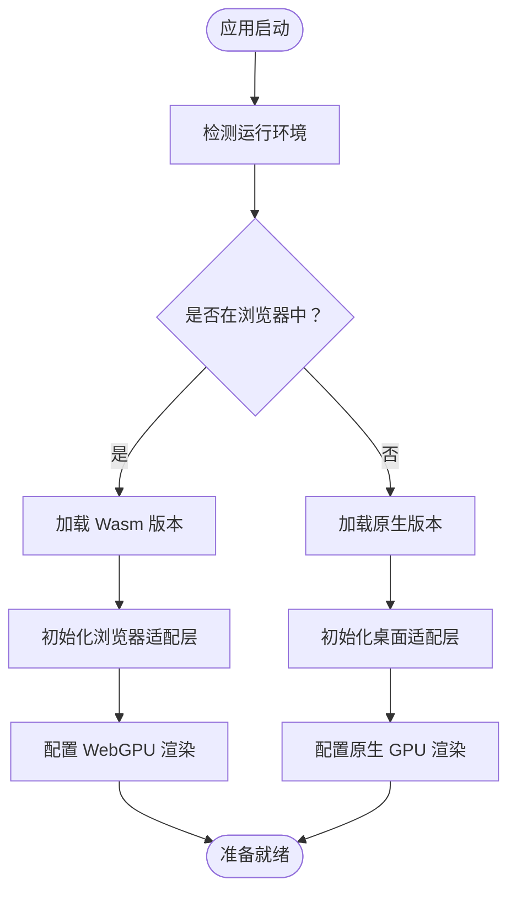
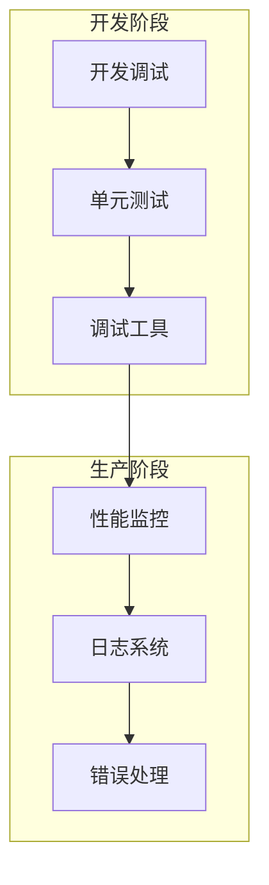

# 双端跨平台运行

<cite>
**本文档引用的文件**
- [doc.txt](file://doc.txt)
- [todo.txt](file://todo.txt)
</cite>

## 目录
1. [简介](#简介)
2. [项目结构](#项目结构)
3. [核心组件](#核心组件)
4. [架构概览](#架构概览)
5. [详细组件分析](#详细组件分析)
6. [双端运行模式对比](#双端运行模式对比)
7. [部署配置指南](#部署配置指南)
8. [性能考虑](#性能考虑)
9. [故障排除指南](#故障排除指南)
10. [结论](#结论)

## 简介

Leivu Runtime 是一个基于 Rust 和 WebGPU 的下一代无构建前端运行时引擎。该项目的核心目标是提供一套完全脱离传统前端工程化的解决方案，实现零编译直接执行 Vue3 + TypeScript，并在浏览器 Wasm 模式和桌面原生模式之间实现真正的双端统一运行。

该引擎通过七层分层架构实现了从应用层到底层内核的完整解耦，其中最核心的特点是提供了统一的 WebGPU 渲染接口，使得浏览器和桌面端能够共享同一套渲染逻辑。

## 项目结构

根据项目文档，Leivu Runtime 采用七层分层架构设计：

**图表来源**
- [doc.txt:7-22](file://doc.txt#L7-L22)

**章节来源**
- [doc.txt:7-22](file://doc.txt#L7-L22)

## 核心组件

### 底层内核底座（Rust 核心基座）

项目的核心基座采用纯 Rust 编写，具备以下关键特性：

- **语言特性**：无垃圾回收器（GC）、内存安全、高性能
- **基础能力**：跨端窗口管理、异步调度、内存池、文件 IO、原生网络栈、缓存系统
- **跨端适配**：
  - 桌面端：使用 winit 原生窗口 + Vulkan/Metal/DX12
  - 浏览器端：Wasm 编译 + 浏览器 WebGPU API 绑定
- **核心依赖**：wgpu、winit、tokio、reqwest

### WebGPU 硬件渲染层

该层完全替代了传统的浏览器 DOM 渲染流水线，实现了全自研的 GPU 渲染：

- **渲染理念**：基于标准 WebGPU 规范，统一桌面和浏览器渲染接口
- **核心能力**：批渲染、矢量绘制、圆角/阴影/渐变、纹理图集、字体渲染、图层合成
- **性能优势**：60fps 稳定渲染、大列表/复杂组件无卡顿、CPU 开销极低

### 布局 & 样式引擎层

复刻标准浏览器 CSS 体系，对标 Chromium 基础能力：

- **HTML 解析**：使用 html5ever 工业级解析，生成标准 DOM 节点树
- **CSS 引擎**：cssparser 解析、选择器匹配、样式继承、权重计算
- **布局系统**：自研盒模型、Flex、流式布局，对标 W3C 标准
- **样式挂载**：支持全局样式、Scoped 样式、第三方 UI 库 CSS 全局注入

### 跨端统一抽象层

这是实现双端统一运行的关键层：

- **统一事件系统**：鼠标、键盘、滚动、点击命中检测
- **统一 BOM/DOM 模拟 API**：轻量实现 window/document/Event
- **兼容性保证**：无缝兼容 Element Plus 等 UI 库所需的浏览器环境 API
- **渲染策略**：无真实 DOM：仅做逻辑模拟，实际绘制全部走 WebGPU

### JS 沙箱运行时层

独立隔离的执行环境：

- **JS 引擎**：QuickJS（轻量高性能、Wasm 友好、Rust 深度绑定）
- **沙箱隔离**：与宿主环境完全隔离，安全隔离脚本
- **内置运行时**：预加载 Vue3 完整运行时（runtime-core/runtime-dom）
- **模块系统**：自研 ESM 解析器，支持 import/export、第三方包引入

### 即时转译层

实现零编译能力的核心层：

- **TypeScript 即时转译**：基于 Rust swc，内存内实时 TS→JS，支持泛型/装饰器/TSX
- **Vue SFC 即时编译**：官方 Rust 库解析.vue，自动拆分 template/script-setup/style
- **Template 实时编译**：模板实时编译为 Vue 渲染函数
- **Script 自动转译**：自动 TS 转译
- **Style 自动解析**：自动解析并入全局样式系统
- **零工程化**：无构建打包、无 Vite/Webpack/tsc、无 node_modules 强依赖

**章节来源**
- [doc.txt:23-64](file://doc.txt#L23-L64)

## 架构概览

Leivu Runtime 的整体架构体现了高度的模块化和解耦设计：

**图表来源**
- [doc.txt:26-28](file://doc.txt#L26-L28)
- [doc.txt:41-45](file://doc.txt#L41-L45)

## 详细组件分析

### WebGPU 渲染管线实现

WebGPU 渲染层是整个系统的核心创新点，它完全替代了传统的 DOM 渲染：

**图表来源**
- [doc.txt:30-34](file://doc.txt#L30-L34)

### 跨端适配层设计

跨端适配层通过统一抽象实现了双端代码的共享：

**图表来源**
- [doc.txt:41-45](file://doc.txt#L41-L45)
- [doc.txt:26-28](file://doc.txt#L26-L28)

### 即时转译系统

即时转译层实现了真正的零编译运行：

**图表来源**
- [doc.txt:51-60](file://doc.txt#L51-L60)

**章节来源**
- [doc.txt:30-64](file://doc.txt#L30-L64)

## 双端运行模式对比

### 浏览器 Wasm 模式

浏览器 Wasm 模式是该引擎的重要运行形态之一：

| 特性 | 描述 |
|------|------|
| **运行方式** | 编译为 Wasm，嵌入任意现代浏览器 |
| **渲染接口** | 基于 WebGPU API 绑定 |
| **部署方式** | 可嵌入任何现代浏览器，无需额外安装 |
| **系统权限** | 受浏览器沙箱限制，权限相对受限 |
| **性能特点** | 依赖浏览器性能，受设备限制 |
| **使用场景** | 在线应用、Web 应用、需要跨浏览器兼容的场景 |

### 桌面原生模式

桌面原生模式提供了更强大的系统集成能力：

| 特性 | 描述 |
|------|------|
| **运行方式** | 脱离浏览器，编译为独立 EXE/App/二进制 |
| **渲染接口** | 使用原生 GPU 接口（Vulkan/Metal/DX12） |
| **部署方式** | 独立可执行文件，支持多平台分发 |
| **系统权限** | 原生系统权限：本地文件、串口、离线运行 |
| **性能特点** | 直接访问系统资源，性能最优 |
| **使用场景** | 桌面应用、内网系统、需要原生权限的应用 |

### 技术实现差异

**图表来源**
- [doc.txt:26-28](file://doc.txt#L26-L28)
- [doc.txt:76-82](file://doc.txt#L76-L82)

**章节来源**
- [doc.txt:76-82](file://doc.txt#L76-L82)

## 部署配置指南

### 浏览器 Wasm 模式部署

浏览器模式的部署相对简单，主要涉及以下步骤：

1. **构建 Wasm 包装**：将核心引擎编译为 Wasm 格式
2. **集成到网页**：将 Wasm 文件嵌入到 HTML 页面中
3. **WebGPU 支持检查**：确保目标浏览器支持 WebGPU
4. **资源加载**：配置静态资源的加载路径

### 桌面原生模式部署

桌面模式的部署更加灵活，支持多种平台：

1. **平台选择**：Windows/macOS/Linux 等目标平台
2. **原生窗口配置**：设置窗口属性、菜单栏、工具栏
3. **系统权限配置**：根据应用需求配置必要的系统权限
4. **打包分发**：生成独立的可执行文件进行分发

### 切换方法

项目提供了灵活的运行模式切换机制：

**图表来源**
- [doc.txt:5](file://doc.txt#L5)

**章节来源**
- [doc.txt:5](file://doc.txt#L5)

## 性能考虑

### 渲染性能对比

WebGPU 渲染相比传统 DOM 渲染具有显著优势：

- **帧率稳定性**：WebGPU 实现 60fps 稳定渲染
- **大列表性能**：复杂组件和大量实例渲染无卡顿
- **CPU 开销**：极低的 CPU 开销，提升整体系统性能

### 内存管理

Rust 语言的内存安全性保证了更好的内存管理：

- **无垃圾回收**：避免 GC 暂停对渲染的影响
- **内存安全**：编译时内存安全检查
- **高效内存池**：优化频繁分配的场景

### 启动时间

双端模式都实现了快速启动：

- **体积极小**：MB 级别的体积
- **内存占用低**：优化的内存使用
- **启动极速**：减少启动等待时间

## 故障排除指南

### 常见问题及解决方案

1. **WebGPU 不支持**
   - 检查浏览器版本和驱动程序
   - 提供降级方案或提示用户升级

2. **Wasm 加载失败**
   - 确认网络连接正常
   - 检查 CSP 设置
   - 验证文件完整性

3. **权限相关问题**
   - 桌面模式：检查系统权限配置
   - 浏览器模式：确认用户授权状态

### 开发调试

**章节来源**
- [doc.txt:88-92](file://doc.txt#L88-L92)

## 结论

Leivu Runtime 代表了前端运行时技术的一个重要发展方向，通过 WebGPU 硬件加速和跨端统一架构，为开发者提供了全新的应用开发体验。

### 主要优势

1. **技术突破**：完全脱离传统前端工程化流程
2. **性能卓越**：WebGPU 硬件加速带来显著性能提升
3. **部署灵活**：支持浏览器和桌面双端部署
4. **生态兼容**：完整支持 Vue3 生态系统
5. **安全可靠**：JS 沙箱隔离和内存安全保证

### 发展前景

随着 WebGPU 标准的不断完善和浏览器支持度的提升，这种双端跨平台运行模式有望成为未来前端应用开发的重要方向。项目当前处于开发初期，但其架构设计和技术选型展现了强大的技术实力和发展潜力。