# 文件监控与热重载系统

<cite>
**本文档引用的文件**
- [crates/iris-gpu/src/file_watcher.rs](file://crates/iris-gpu/src/file_watcher.rs)
- [crates/iris-gpu/tests/file_watcher_integration.rs](file://crates/iris-gpu/tests/file_watcher_integration.rs)
- [crates/iris-gpu/src/batch_renderer.rs](file://crates/iris-gpu/src/batch_renderer.rs)
- [crates/iris-gpu/src/batch_shader.wgsl](file://crates/iris-gpu/src/batch_shader.wgsl)
- [crates/iris-sfc/src/lib.rs](file://crates/iris-sfc/src/lib.rs)
- [crates/iris-sfc/src/template_compiler.rs](file://crates/iris-sfc/src/template_compiler.rs)
- [crates/iris-app/src/main.rs](file://crates/iris-app/src/main.rs)
- [crates/iris-core/src/lib.rs](file://crates/iris-core/src/lib.rs)
- [Cargo.toml](file://Cargo.toml)
- [test_hot_reload.md](file://test_hot_reload.md)
</cite>

## 目录
1. [简介](#简介)
2. [项目结构](#项目结构)
3. [核心组件](#核心组件)
4. [架构概览](#架构概览)
5. [详细组件分析](#详细组件分析)
6. [依赖关系分析](#依赖关系分析)
7. [性能考虑](#性能考虑)
8. [故障排除指南](#故障排除指南)
9. [结论](#结论)

## 简介

Iris 文件监控与热重载系统是一个完整的实时文件变更检测和响应框架，专为 Vue Single File Component (SFC) 开发而设计。该系统提供了毫秒级的热重载体验，支持跨平台文件监控、智能防抖机制、事件去重和优雅的错误处理。

系统的核心特性包括：
- **实时文件监控**：使用 notify crate 监听文件系统变化
- **智能防抖**：避免编辑器保存时的重复触发（默认 500ms）
- **事件去重**：同一文件的多次变更只保留最后一次
- **跨平台支持**：Windows、macOS、Linux 完全兼容
- **扩展名过滤**：可配置监听特定文件类型
- **通道容量管理**：可配置的事件队列容量
- **图形界面警告**：通道满时的安全警告机制

## 项目结构

Iris 采用多 crate 的模块化架构，文件监控与热重载系统主要分布在以下核心 crate 中：

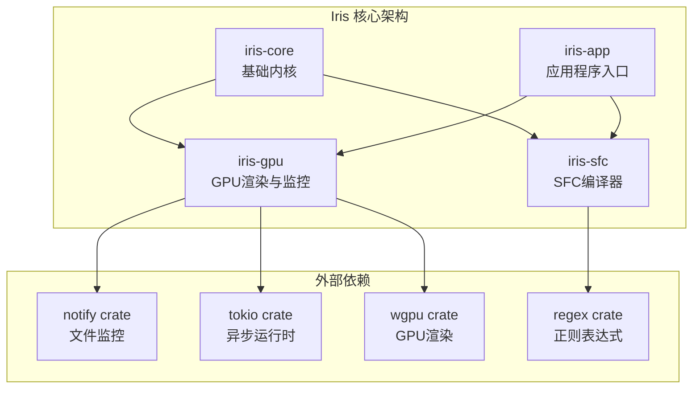

**图表来源**
- [Cargo.toml:1-29](file://Cargo.toml#L1-L29)
- [crates/iris-core/src/lib.rs:1-165](file://crates/iris-core/src/lib.rs#L1-L165)

**章节来源**
- [Cargo.toml:1-29](file://Cargo.toml#L1-L29)

## 核心组件

### 文件监控器 (FileWatcher)

文件监控器是整个热重载系统的核心组件，负责监听文件系统变化并提供异步事件流。

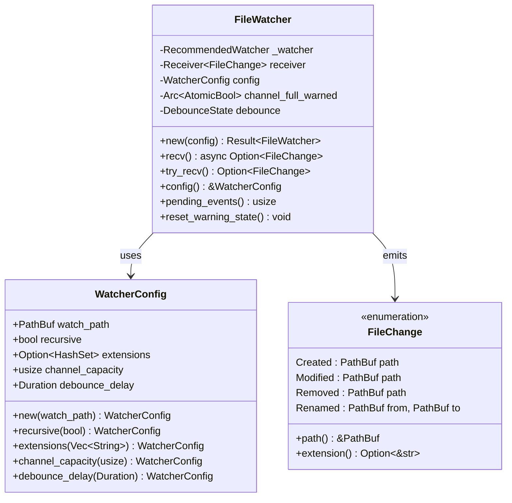

**图表来源**
- [crates/iris-gpu/src/file_watcher.rs:172-481](file://crates/iris-gpu/src/file_watcher.rs#L172-L481)

### SFC 编译器

SFC 编译器负责将 Vue 单文件组件编译为可执行的 JavaScript 代码。

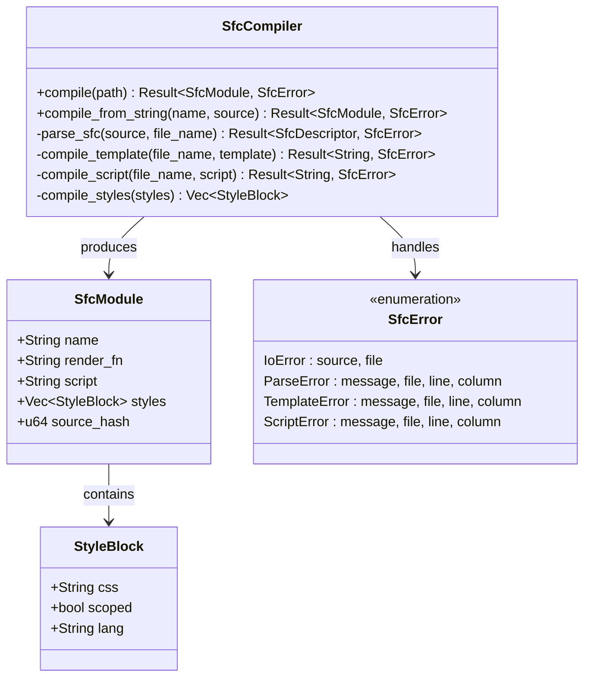

**图表来源**
- [crates/iris-sfc/src/lib.rs:36-131](file://crates/iris-sfc/src/lib.rs#L36-L131)
- [crates/iris-sfc/src/lib.rs:161-240](file://crates/iris-sfc/src/lib.rs#L161-L240)

### 应用程序入口

应用程序入口负责协调整个热重载流程，从文件监控到 SFC 编译再到 GPU 资源更新。

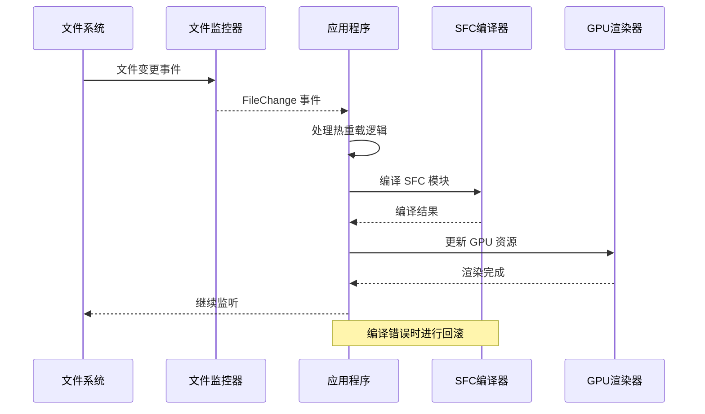

**图表来源**
- [crates/iris-app/src/main.rs:237-403](file://crates/iris-app/src/main.rs#L237-L403)

**章节来源**
- [crates/iris-gpu/src/file_watcher.rs:42-100](file://crates/iris-gpu/src/file_watcher.rs#L42-L100)
- [crates/iris-sfc/src/lib.rs:161-240](file://crates/iris-sfc/src/lib.rs#L161-L240)
- [crates/iris-app/src/main.rs:237-403](file://crates/iris-app/src/main.rs#L237-L403)

## 架构概览

Iris 文件监控与热重载系统采用分层架构设计，确保各个组件职责清晰、耦合度低。

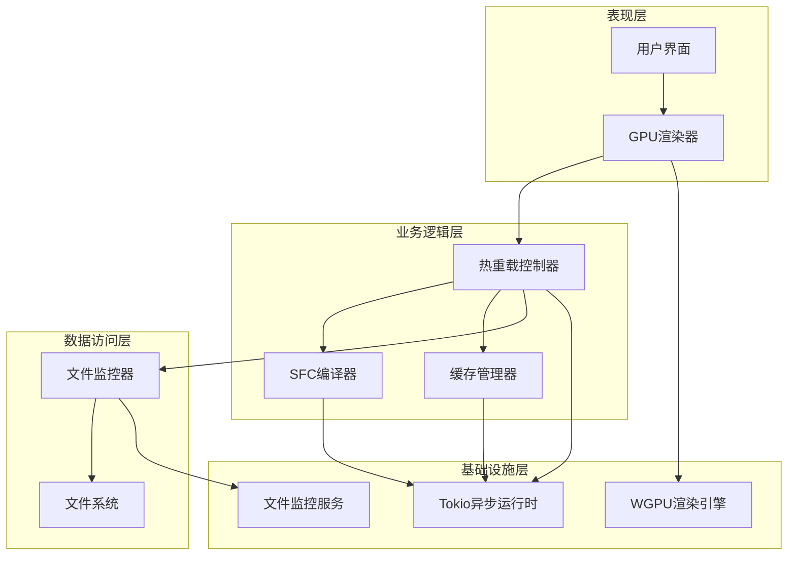

**图表来源**
- [crates/iris-app/src/main.rs:124-235](file://crates/iris-app/src/main.rs#L124-L235)
- [crates/iris-gpu/src/file_watcher.rs:245-411](file://crates/iris-gpu/src/file_watcher.rs#L245-L411)

系统的关键设计原则：

1. **异步非阻塞**：所有文件监控和编译操作都在异步环境中进行
2. **事件驱动**：基于事件的架构，文件变更触发相应的处理流程
3. **错误隔离**：编译错误不会影响主应用的运行，支持回滚机制
4. **资源管理**：智能的缓存管理和资源清理机制
5. **跨平台兼容**：统一的接口抽象，支持多操作系统

## 详细组件分析

### 文件监控器实现

文件监控器实现了复杂的文件系统监听逻辑，包括防抖机制、事件去重和错误处理。

#### 防抖机制设计

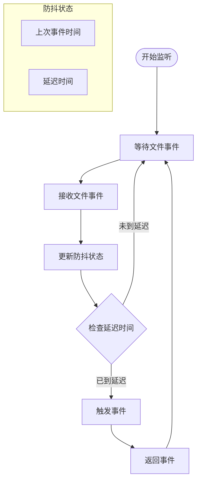

**图表来源**
- [crates/iris-gpu/src/file_watcher.rs:139-170](file://crates/iris-gpu/src/file_watcher.rs#L139-L170)

#### 事件处理流程

文件监控器支持多种文件事件类型，每种事件都有对应的处理逻辑：

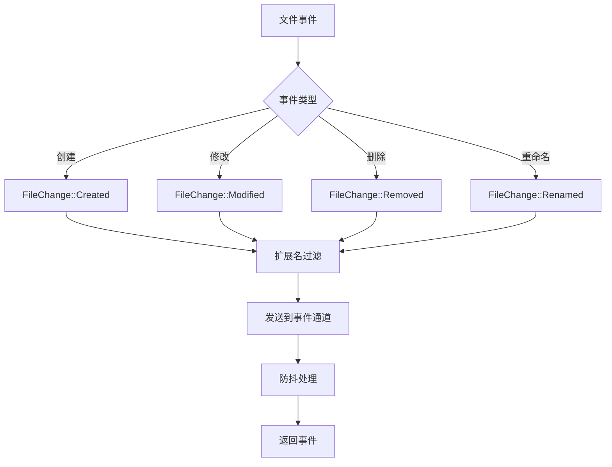

**图表来源**
- [crates/iris-gpu/src/file_watcher.rs:318-367](file://crates/iris-gpu/src/file_watcher.rs#L318-L367)

#### 配置系统

文件监控器提供了灵活的配置选项：

| 配置项 | 默认值 | 描述 |
|--------|--------|------|
| watch_path | 当前目录 | 监听的根目录路径 |
| recursive | true | 是否递归监听子目录 |
| extensions | None | 文件扩展名过滤器 |
| channel_capacity | 2000 | 事件通道容量 |
| debounce_delay | 500ms | 防抖延迟时间 |

**章节来源**
- [crates/iris-gpu/src/file_watcher.rs:86-137](file://crates/iris-gpu/src/file_watcher.rs#L86-L137)
- [crates/iris-gpu/src/file_watcher.rs:413-463](file://crates/iris-gpu/src/file_watcher.rs#L413-L463)

### SFC 编译器实现

SFC 编译器负责将 Vue 单文件组件转换为可执行的 JavaScript 代码。

#### 模板编译流程

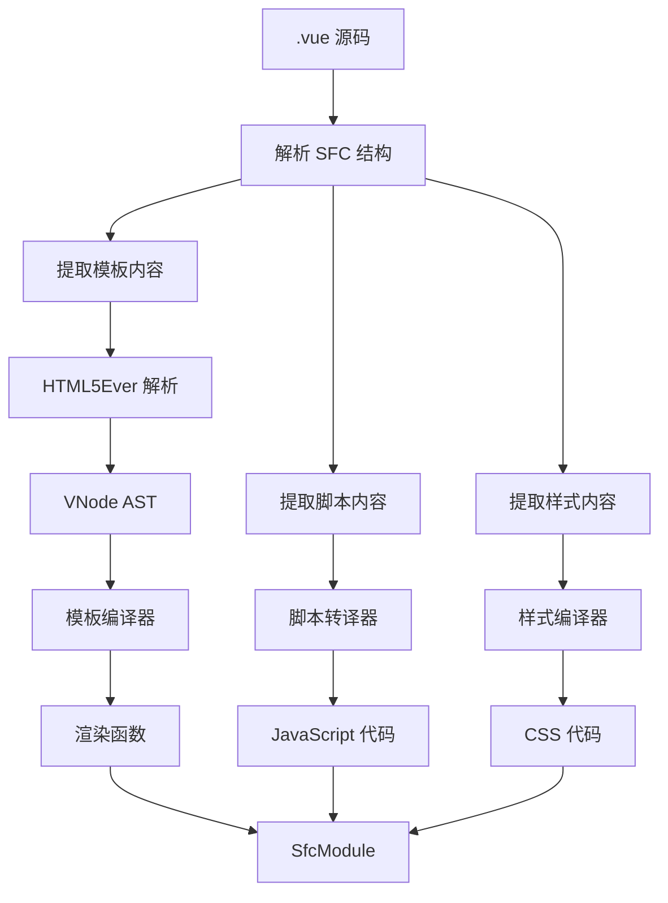

**图表来源**
- [crates/iris-sfc/src/lib.rs:254-319](file://crates/iris-sfc/src/lib.rs#L254-L319)

#### 模板指令支持

SFC 编译器支持多种 Vue 指令：

| 指令 | 功能 | 示例 |
|------|------|------|
| v-if | 条件渲染 | `
内容
` |
| v-for | 列表渲染 | `<li v-for="item in items">{{ item }}</li>` |
| v-bind | 属性绑定 | `<input :value="message">` |
| v-on | 事件监听 | `<button @click="handleClick">点击</button>` |
| v-model | 双向绑定 | `<input v-model="message">` |
| v-slot | 插槽 | `<slot v-slot:default="slotProps">内容</slot>` |
| v-once | 一次性渲染 | `
静态内容
` |
| v-pre | 跳过编译 | `
{{ 未编译的内容 }}
` |
| v-cloak | 隐藏未编译内容 | `
编译后显示
` |
| v-memo | 记忆化优化 | `
内容
` |

**章节来源**
- [crates/iris-sfc/src/template_compiler.rs:30-63](file://crates/iris-sfc/src/template_compiler.rs#L30-L63)
- [crates/iris-sfc/src/template_compiler.rs:355-470](file://crates/iris-sfc/src/template_compiler.rs#L355-L470)

### GPU 批渲染系统

GPU 批渲染系统优化了 2D 图形的渲染性能，通过合并多次绘制调用减少 GPU 调用开销。

#### 批渲染工作原理

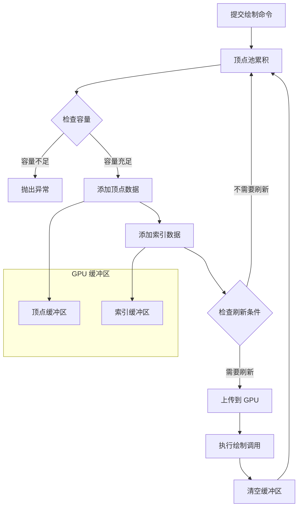

**图表来源**
- [crates/iris-gpu/src/batch_renderer.rs:209-249](file://crates/iris-gpu/src/batch_renderer.rs#L209-L249)

#### 着色器实现

批渲染系统使用 WGSL 着色器实现高效的 2D 图形渲染：

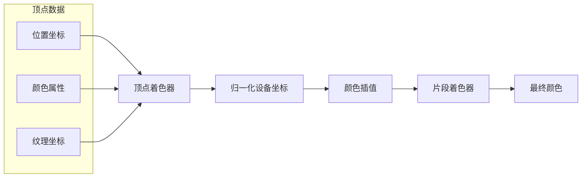

**图表来源**
- [crates/iris-gpu/src/batch_shader.wgsl:9-25](file://crates/iris-gpu/src/batch_shader.wgsl#L9-L25)

**章节来源**
- [crates/iris-gpu/src/batch_renderer.rs:87-202](file://crates/iris-gpu/src/batch_renderer.rs#L87-L202)
- [crates/iris-gpu/src/batch_shader.wgsl:1-26](file://crates/iris-gpu/src/batch_shader.wgsl#L1-L26)

## 依赖关系分析

Iris 文件监控与热重载系统的依赖关系体现了清晰的分层架构：

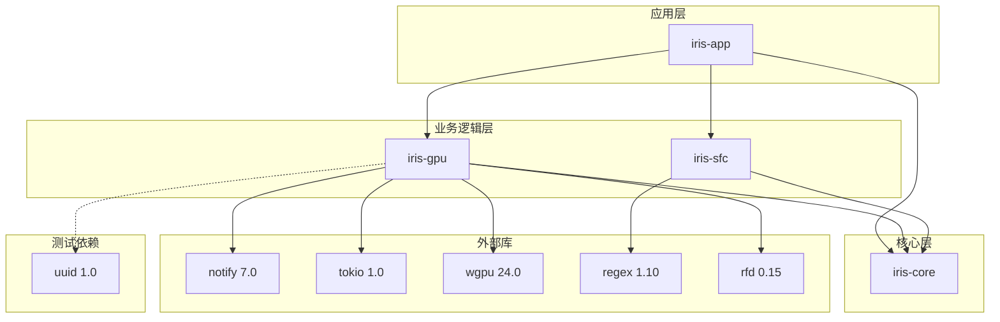

**图表来源**
- [Cargo.toml:13-29](file://Cargo.toml#L13-L29)
- [crates/iris-gpu/Cargo.toml:11-25](file://crates/iris-gpu/Cargo.toml#L11-L25)
- [crates/iris-sfc/Cargo.toml:11-23](file://crates/iris-sfc/Cargo.toml#L11-L23)

### 关键依赖说明

| 依赖库 | 版本 | 用途 | 重要性 |
|--------|------|------|--------|
| notify | 7.0 | 文件系统监控 | 核心依赖 |
| tokio | 1.0 | 异步运行时 | 核心依赖 |
| wgpu | 24.0 | GPU 渲染 | 核心依赖 |
| regex | 1.10 | 正则表达式 | 重要依赖 |
| rfd | 0.15 | 图形对话框 | 可选依赖 |
| uuid | 1.0 | 测试工具 | 测试依赖 |

**章节来源**
- [Cargo.toml:13-29](file://Cargo.toml#L13-L29)
- [crates/iris-gpu/Cargo.toml:11-25](file://crates/iris-gpu/Cargo.toml#L11-L25)

## 性能考虑

Iris 系统在设计时充分考虑了性能优化，采用了多种策略来确保高效的文件监控和热重载体验。

### 文件监控性能优化

1. **防抖机制**：默认 500ms 防抖延迟，避免编辑器保存时的重复触发
2. **事件去重**：同一文件的多次变更只保留最后一次
3. **通道容量管理**：默认 2000 个事件容量，可根据项目规模调整
4. **扩展名过滤**：只监听必要的文件类型，减少不必要的事件

### 编译性能优化

1. **正则表达式预编译**：使用 LazyLock 避免重复编译
2. **增量编译**：只编译发生变化的文件
3. **缓存机制**：SFC 模块缓存避免重复编译
4. **异步处理**：编译任务在后台线程执行

### GPU 渲染性能优化

1. **批渲染**：合并多次绘制调用为单次 GPU 调用
2. **顶点缓冲区**：使用 GPU 本地缓冲区存储顶点数据
3. **索引缓冲区**：使用索引绘制减少顶点重复
4. **Alpha 混合**：硬件加速的颜色混合

## 故障排除指南

### 常见问题及解决方案

#### 文件监控器警告

**问题**：控制台出现 "File watcher event queue is full" 警告

**原因**：事件处理速度跟不上文件变更速度

**解决方案**：
1. 增加通道容量：`WatcherConfig::new(path).channel_capacity(5000)`
2. 优化事件处理逻辑
3. 减少不必要的文件监听

#### 编译错误处理

**问题**：SFC 编译失败导致应用崩溃

**解决方案**：
1. 系统自动回滚到之前的缓存状态
2. 错误信息记录到日志
3. 应用继续正常运行

#### 跨平台兼容性

**问题**：在某些平台上文件监控不工作

**解决方案**：
1. 检查平台特定的权限设置
2. 确保有足够的磁盘空间
3. 验证路径格式正确

**章节来源**
- [crates/iris-gpu/src/file_watcher.rs:290-391](file://crates/iris-gpu/src/file_watcher.rs#L290-L391)
- [crates/iris-app/src/main.rs:345-402](file://crates/iris-app/src/main.rs#L345-L402)

### 调试技巧

1. **启用详细日志**：设置环境变量 `RUST_LOG=debug`
2. **监控事件队列**：使用 `pending_events()` 方法检查队列状态
3. **测试文件监控**：参考 `test_hot_reload.md` 进行手动测试
4. **验证编译结果**：检查 SFC 编译输出的渲染函数

**章节来源**
- [test_hot_reload.md:1-15](file://test_hot_reload.md#L1-L15)

## 结论

Iris 文件监控与热重载系统展现了现代 Rust 应用程序的最佳实践，通过精心设计的架构和优化策略，实现了高效、可靠的文件变更检测和响应机制。

### 主要成就

1. **完整的热重载链路**：从文件监控到 SFC 编译再到 GPU 资源更新的完整流程
2. **高性能设计**：异步非阻塞架构和多种性能优化策略
3. **跨平台兼容**：统一的接口抽象支持多操作系统
4. **错误处理机制**：完善的错误隔离和回滚机制
5. **可扩展性**：模块化设计便于功能扩展和维护

### 技术亮点

- **智能防抖**：避免编辑器保存时的重复触发
- **事件去重**：提高事件处理效率
- **异步架构**：充分利用现代硬件性能
- **缓存管理**：智能的资源管理和清理
- **跨平台支持**：统一的文件监控接口

该系统为 Vue SFC 开发提供了卓越的开发体验，毫秒级的热重载响应和稳定的错误处理机制使其成为现代前端开发的理想选择。随着功能的不断完善，Iris 系统将继续为开发者提供更好的开发工具和更流畅的开发体验。