# 安全与扩展能力

<cite>
**本文档引用的文件**
- [doc.txt](file://doc.txt)
- [todo.txt](file://todo.txt)
</cite>

## 目录
1. [引言](#引言)
2. [项目结构](#项目结构)
3. [核心组件](#核心组件)
4. [架构概览](#架构概览)
5. [详细组件分析](#详细组件分析)
6. [依赖关系分析](#依赖关系分析)
7. [性能考虑](#性能考虑)
8. [故障排除指南](#故障排除指南)
9. [结论](#结论)

## 引言

Leivue Runtime 是一个革命性的前端运行时引擎，旨在突破传统浏览器沙箱限制，为 Vue 生态提供高性能的跨端运行底座。该项目的核心目标是消除前端工程化复杂性，通过自研技术实现真正的零编译直接执行，同时确保严格的安全隔离和强大的扩展能力。

该引擎采用七层分层架构设计，从底层内核到底层应用层实现了高度解耦，特别在安全与扩展能力方面采用了多项创新技术，包括独立的 JS 沙箱隔离机制、双网络模式支持、离线运行缓存系统以及源码保护方案。

## 项目结构

Leivue Runtime 采用模块化的七层分层架构，每层都有明确的职责分工和边界定义：

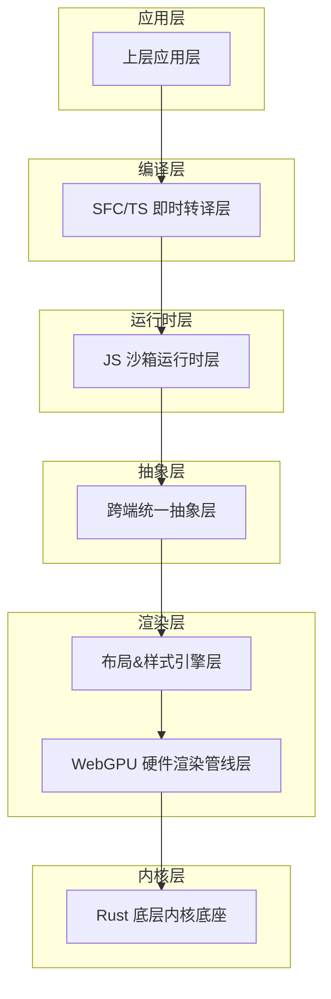

**图表来源**
- [doc.txt:7-22](file://doc.txt#L7-L22)

**章节来源**
- [doc.txt:7-22](file://doc.txt#L7-L22)

## 核心组件

### 安全与扩展能力概述

Leivue Runtime 在安全与扩展能力方面实现了六大核心功能：

1. **独立 JS 沙箱**：完全隔离的执行环境，防止恶意代码攻击
2. **双网络模式**：自研 Rust 网络栈，支持跨域突破和内网请求
3. **离线运行**：核心 UI 库和运行时的内置缓存系统
4. **源码保护**：支持源码加密运行，保护商业项目代码
5. **扩展插件系统**：灵活的插件开发和集成机制
6. **跨端兼容**：统一的跨端抽象层

**章节来源**
- [doc.txt:88-92](file://doc.txt#L88-L92)

### JS 沙箱隔离机制

JS 沙箱运行时层是整个系统安全架构的核心，采用了多重隔离策略：

#### QuickJS 引擎集成

系统选择了 QuickJS 作为 JS 引擎，原因包括：
- 轻量高性能的特性
- 对 WebAssembly 的友好支持
- 与 Rust 的深度绑定能力
- 内存安全和性能优势

#### 沙箱隔离策略

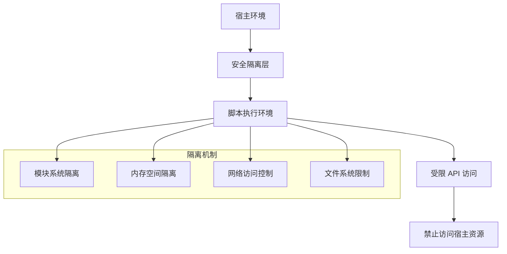

**图表来源**
- [doc.txt:46-50](file://doc.txt#L46-L50)

**章节来源**
- [doc.txt:46-50](file://doc.txt#L46-L50)

### 双网络模式实现

双网络模式是 Leivue Runtime 的核心技术特色之一，提供了灵活的网络访问能力：

#### 自研 Rust 网络栈

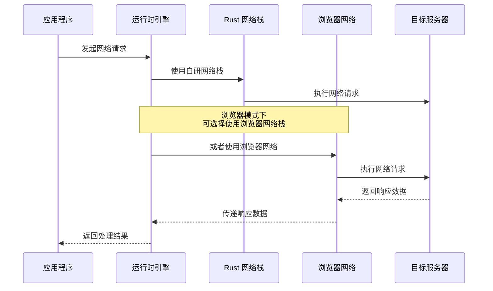

**图表来源**
- [doc.txt:25](file://doc.txt#L25)
- [doc.txt:89-90](file://doc.txt#L89-L90)

#### 网络模式特性

双网络模式支持以下关键特性：
- **跨域突破**：通过自研网络栈绕过浏览器同源策略限制
- **内网请求**：支持对内网服务的直接访问
- **灵活切换**：可根据场景选择最优的网络访问方式
- **安全控制**：在网络层面对请求进行安全检查和过滤

**章节来源**
- [doc.txt:25](file://doc.txt#L25)
- [doc.txt:89-90](file://doc.txt#L89-L90)

### 离线运行缓存机制

离线运行能力确保了系统在没有网络连接情况下的正常工作：

#### 缓存系统架构

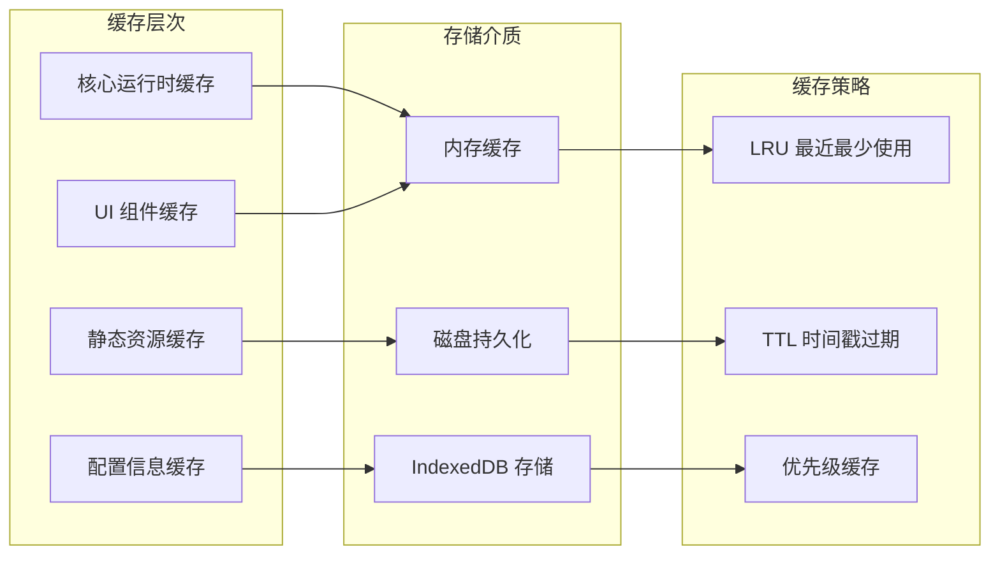

**图表来源**
- [doc.txt:25](file://doc.txt#L25)
- [doc.txt:91](file://doc.txt#L91)

#### 缓存策略

系统采用多层缓存策略：
- **内存缓存**：用于频繁访问的核心运行时组件
- **磁盘缓存**：用于静态资源和大型组件
- **IndexedDB 缓存**：用于配置信息和用户偏好设置
- **智能过期机制**：基于 LRU 和 TTL 的混合缓存策略

**章节来源**
- [doc.txt:25](file://doc.txt#L25)
- [doc.txt:91](file://doc.txt#L91)

### 源码保护加密方案

源码保护是商业项目的重要需求，系统提供了完整的加密运行方案：

#### 加密运行架构

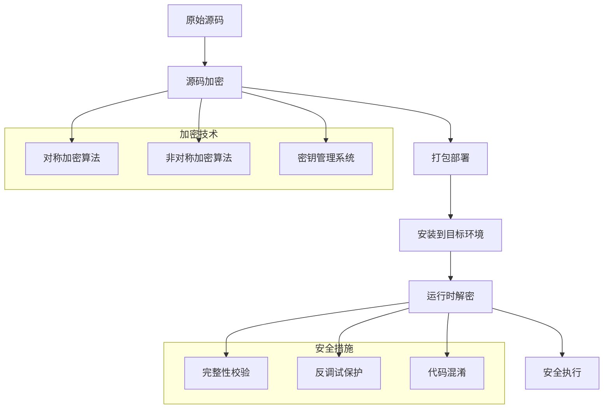

**图表来源**
- [doc.txt:92](file://doc.txt#L92)

#### 加密保护特性

源码保护方案包含多个层面的安全措施：
- **多层加密**：结合对称和非对称加密算法
- **动态解密**：在运行时进行解密，避免明文存储
- **完整性校验**：防止源码被篡改
- **反调试保护**：防止逆向分析和调试
- **代码混淆**：增加源码分析难度

**章节来源**
- [doc.txt:92](file://doc.txt#L92)

## 架构概览

Leivue Runtime 的整体架构体现了高度的模块化和解耦设计：

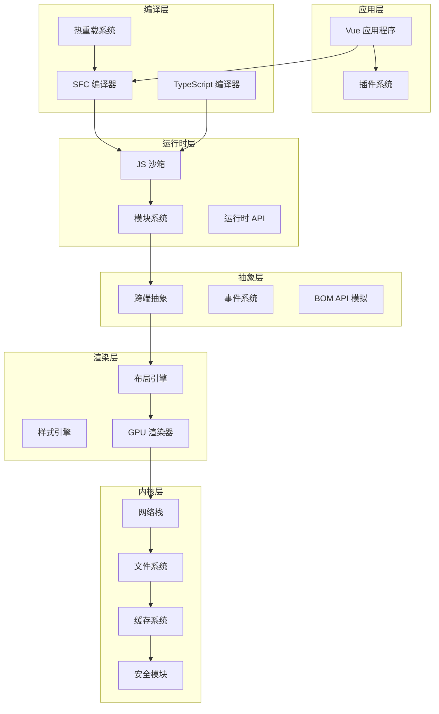

**图表来源**
- [doc.txt:7-22](file://doc.txt#L7-L22)

**章节来源**
- [doc.txt:7-22](file://doc.txt#L7-L22)

## 详细组件分析

### JS 沙箱安全机制

#### 安全边界设计

JS 沙箱通过多层次的安全边界确保脚本执行的安全性：

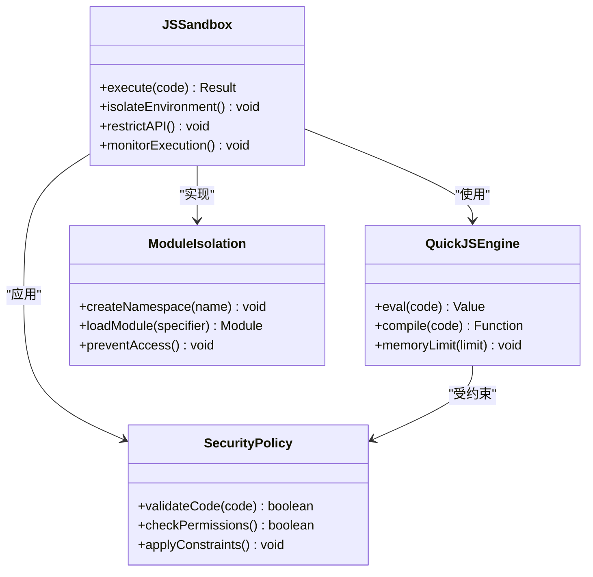

**图表来源**
- [doc.txt:46-50](file://doc.txt#L46-L50)

#### 恶意代码防护

系统采用多种技术手段防止恶意代码执行：

1. **执行时间限制**：防止无限循环和长时间阻塞
2. **内存使用监控**：限制脚本的内存占用
3. **API 访问控制**：严格限制对敏感 API 的调用
4. **代码完整性检查**：验证脚本的完整性
5. **异常处理机制**：捕获和处理异常情况

**章节来源**
- [doc.txt:46-50](file://doc.txt#L46-L50)

### 网络安全与访问控制

#### 网络访问策略

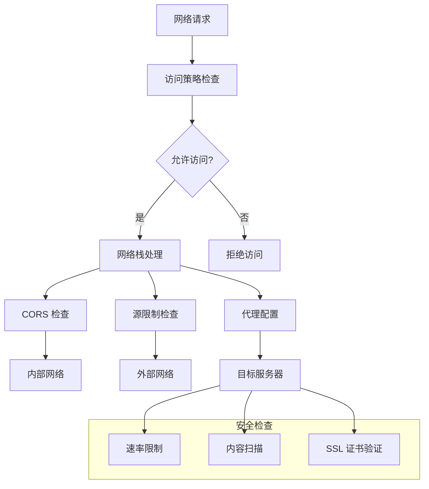

**图表来源**
- [doc.txt:89-90](file://doc.txt#L89-L90)

#### 跨域突破机制

系统通过自研网络栈实现了安全的跨域突破：

1. **代理模式**：通过本地代理服务器转发跨域请求
2. **CORS 处理**：在代理层正确处理 CORS 头部
3. **安全白名单**：只允许配置的域名进行跨域访问
4. **请求审计**：记录所有跨域请求的日志

**章节来源**
- [doc.txt:89-90](file://doc.txt#L89-L90)

### 缓存安全与完整性

#### 缓存安全策略

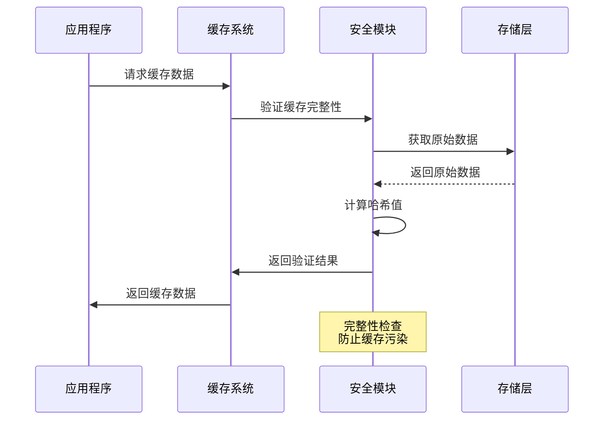

**图表来源**
- [doc.txt:91](file://doc.txt#L91)

#### 缓存完整性保护

系统采用多种技术确保缓存数据的完整性：

1. **哈希校验**：对缓存数据进行 SHA-256 哈希校验
2. **版本控制**：跟踪缓存数据的版本信息
3. **时间戳验证**：检查缓存数据的有效期
4. **增量更新**：支持部分缓存数据的更新

**章节来源**
- [doc.txt:91](file://doc.txt#L91)

## 依赖关系分析

### 技术栈依赖

Leivue Runtime 的技术栈体现了现代化和高性能的特点：

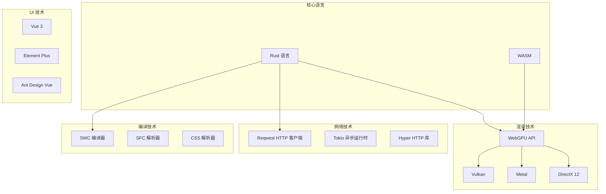

**图表来源**
- [doc.txt:24-29](file://doc.txt#L24-L29)

### 外部依赖关系

系统的关键外部依赖包括：

1. **wgpu**：WebGPU 渲染库，提供跨平台图形渲染能力
2. **winit**：窗口管理库，支持桌面端原生窗口
3. **tokio**：异步运行时，提供高性能的异步 I/O
4. **reqwest**：HTTP 客户端库，支持异步网络请求
5. **html5ever**：HTML 解析器，工业级的 HTML 解析能力
6. **cssparser**：CSS 解析器，标准的 CSS 解析和处理

**章节来源**
- [doc.txt:24-29](file://doc.txt#L24-L29)

## 性能考虑

### 安全性能影响

安全机制的实现需要在安全性与性能之间找到平衡点：

#### 沙箱性能优化

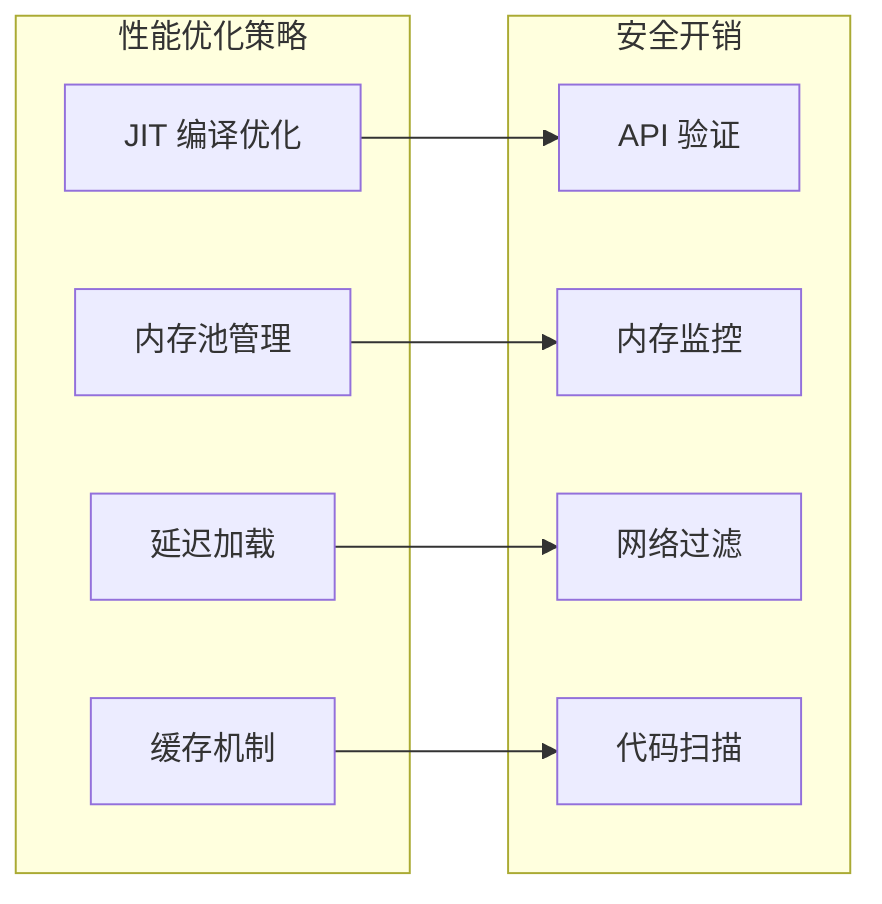

#### 性能监控指标

系统需要监控以下关键性能指标：
- **沙箱执行延迟**：沙箱环境的额外开销
- **内存使用峰值**：安全机制的内存占用
- **网络请求延迟**：网络栈的性能表现
- **缓存命中率**：缓存系统的效率

## 故障排除指南

### 常见安全问题

#### 沙箱逃逸检测

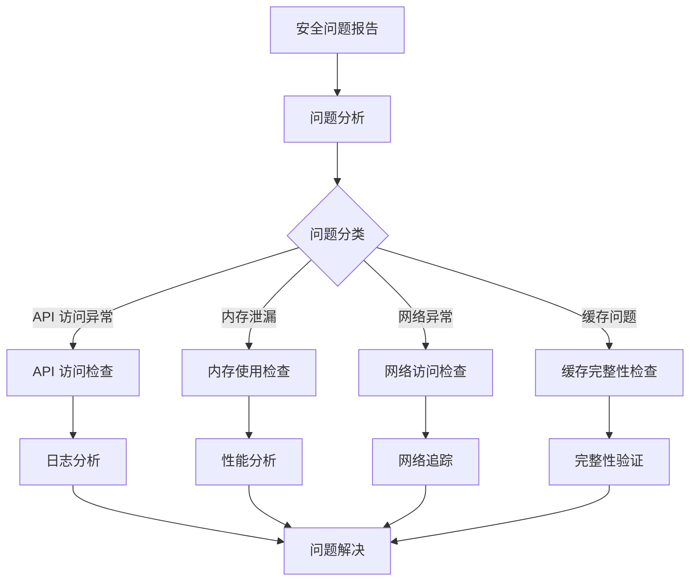

#### 安全事件响应流程

1. **问题发现**：通过监控系统发现异常行为
2. **隔离处理**：立即隔离受影响的沙箱实例
3. **证据收集**：收集相关日志和数据
4. **根因分析**：分析问题的根本原因
5. **修复实施**：实施针对性的安全修复
6. **验证测试**：验证修复效果
7. **预防改进**：改进安全策略和监控

**章节来源**
- [doc.txt:88-92](file://doc.txt#L88-L92)

## 结论

Leivue Runtime 在安全与扩展能力方面的设计体现了现代前端运行时引擎的发展方向。通过独立的 JS 沙箱隔离机制、双网络模式支持、离线运行缓存系统以及源码保护方案，该系统为 Vue 生态提供了真正意义上的高性能跨端运行底座。

### 主要成就

1. **突破浏览器沙箱限制**：通过自研技术实现真正的跨域访问和内网请求
2. **实现零编译直接执行**：消除了传统前端工程化的复杂性
3. **提供完整的安全防护**：从网络层到执行层的多层安全保护
4. **支持灵活的扩展机制**：为插件开发和定制化提供了良好的基础

### 未来发展方向

随着项目的进一步发展，建议重点关注以下方面：
- **安全机制的持续优化**：提升安全防护能力和性能表现
- **扩展能力的完善**：提供更丰富的插件开发工具和接口
- **跨平台兼容性**：进一步提升不同平台的兼容性和性能
- **开发工具链**：完善开发、调试和部署工具链

通过持续的技术创新和架构优化，Leivue Runtime 有望成为下一代前端运行时的标准解决方案，为开发者提供更加安全、高效和易用的开发体验。