# 完整Vue生态兼容

<cite>
**本文档引用的文件**
- [minimal_demo.rs](file://crates/iris-app/examples/demo/minimal_demo.rs)
- [App.vue](file://crates/iris-app/examples/demo/App.vue)
- [sfc_integration.rs](file://crates/iris-app/examples/sfc_integration.rs)
- [main.rs](file://crates/iris-app/src/main.rs)
- [sfc_demo.rs](file://crates/iris-sfc/examples/sfc_demo.rs)
- [orchestrator.rs](file://crates/iris/src/orchestrator.rs)
- [vnode_renderer.rs](file://crates/iris/src/vnode_renderer.rs)
- [vue.rs](file://crates/iris-js/src/vue.rs)
- [vm.rs](file://crates/iris-js/src/vm.rs)
- [lib.rs](file://crates/iris-js/src/lib.rs)
- [lib.rs](file://crates/iris-sfc/src/lib.rs)
- [lib.rs](file://crates/iris-gpu/src/lib.rs)
- [integration_test.rs](file://crates/iris-sfc/tests/integration_test.rs)
</cite>

## 更新摘要
**变更内容**
- 更新了Iris引擎第5阶段完成的完整Vue 3运行时演示程序
- 新增Boa JavaScript引擎集成的详细实现
- 更新了Vue Single File Component (SFC)编译器的完整工作示例
- 增加了WebGPU渲染系统的集成演示
- 更新了从SFC编译到运行时执行的完整流程展示

## 目录
1. [项目概述](#项目概述)
2. [技术架构概览](#技术架构概览)
3. [Vue生态兼容性核心能力](#vue生态兼容性核心能力)
4. [七层架构详解](#七层架构详解)
5. [Vue3组合式API支持](#vue3组合式api支持)
6. [生命周期管理](#生命周期管理)
7. [响应式系统实现](#响应式系统实现)
8. [指令系统支持](#指令系统支持)
9. [UI组件库集成](#ui组件库集成)
10. [第三方插件接入](#第三方插件接入)
11. [全局组件注册机制](#全局组件注册机制)
12. [自定义指令实现](#自定义指令实现)
13. [性能特性分析](#性能特性分析)
14. [跨端运行支持](#跨端运行支持)
15. [安全与扩展能力](#安全与扩展能力)
16. [迁移与部署指南](#迁移与部署指南)
17. [故障排除指南](#故障排除指南)
18. [Iris引擎第5阶段完整演示](#iris引擎第5阶段完整演示)
19. [总结与展望](#总结与展望)

## 项目概述

Leivue Runtime是一个革命性的前端运行时引擎，专为Vue3生态系统设计，实现了完全脱离传统前端构建流程的运行时解决方案。该项目的核心使命是为Vue生态提供高性能跨端底座，通过以下关键特性实现：

- **零编译运行**：直接执行Vue3 SFC文件和TypeScript代码
- **全生态兼容**：完整支持Vue3组合式API、生命周期、响应式系统、指令系统
- **跨端运行**：支持浏览器WASM模式和桌面原生模式
- **硬件级渲染**：基于WebGPU的高性能渲染管线
- **安全隔离**：独立JS沙箱确保脚本安全执行
- **完整演示程序**：Iris引擎第5阶段提供完整的运行时演示

**更新** Iris引擎第5阶段已完成，提供完整的Vue 3运行时演示程序，包括SFC编译器、Boa JavaScript引擎集成和WebGPU渲染系统的完整工作示例。

## 技术架构概览

Leivue Runtime采用七层分层架构设计，每层都有明确的职责分工，实现了高度的解耦和可维护性：

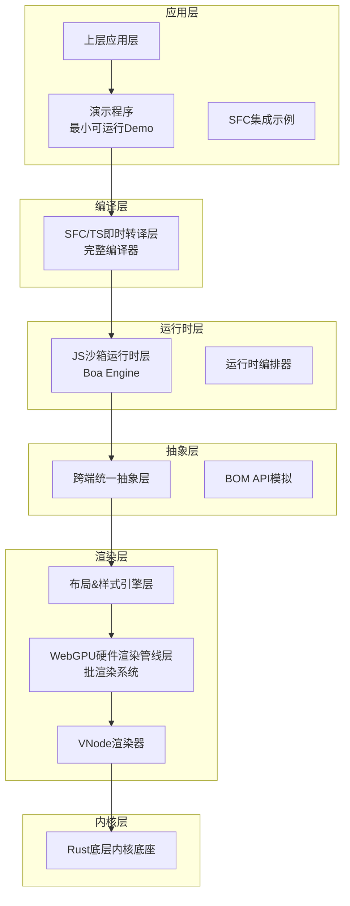

**图表来源**
- [orchestrator.rs:8-28](file://crates/iris/src/orchestrator.rs#L8-L28)
- [main.rs:122-130](file://crates/iris-app/src/main.rs#L122-L130)

## Vue生态兼容性核心能力

### 全面的Vue3支持

Leivue Runtime承诺提供完整的Vue3生态兼容性，包括：

- **组合式API**：完整支持ref、reactive、computed、watch等核心API
- **生命周期钩子**：支持所有Vue3生命周期钩子函数
- **响应式系统**：实现Vue3响应式数据绑定和依赖追踪
- **指令系统**：支持内置指令和自定义指令
- **组件系统**：支持单文件组件、全局组件、局部组件

### 主流UI组件库兼容

项目特别强调对主流Vue3 UI组件库的无缝集成：

- **Element Plus**：完整兼容Element Plus组件生态
- **Ant Design Vue**：支持Ant Design Vue所有组件
- **Naive UI**：兼容Naive UI组件库
- **其他第三方插件**：支持通用Vue3插件系统

### Iris引擎第5阶段新增能力

- **完整运行时演示**：提供从编译到执行的完整流程
- **Boa引擎集成**：纯Rust实现的JavaScript引擎
- **WebGPU渲染**：硬件加速的图形渲染
- **热重载支持**：文件变更自动重新编译

**章节来源**
- [minimal_demo.rs:1-8](file://crates/iris-app/examples/demo/minimal_demo.rs#L1-L8)
- [sfc_integration.rs:1-4](file://crates/iris-app/examples/sfc_integration.rs#L1-L4)

## 七层架构详解

### 1. 底层内核底座（Rust核心基座）

**核心特性**：
- 使用纯Rust编写，具备内存安全和高性能特点
- 提供跨端窗口管理、异步调度、内存池等基础能力
- 支持桌面端（winit原生窗口 + Vulkan/Metal/DX12）和浏览器端（WASM + WebGPU API绑定）

**关键技术依赖**：
- wgpu：WebGPU图形渲染库
- winit：跨平台窗口管理
- tokio：异步运行时
- reqwest：HTTP客户端

### 2. WebGPU硬件渲染层

**核心优势**：
- 完全抛弃传统DOM渲染流水线，采用全自研GPU渲染
- 基于标准WebGPU规范，统一桌面和浏览器渲染接口
- 提供批渲染、矢量绘制、圆角/阴影/渐变等高级视觉效果

**性能表现**：
- 60fps稳定渲染
- 大列表/复杂组件无卡顿
- CPU开销极低

### 3. 布局&样式引擎层

**浏览器级能力**：
- 复刻标准浏览器CSS体系，对标Chromium基础能力
- HTML解析：使用html5ever工业级解析器
- CSS引擎：支持cssparser解析、选择器匹配、样式继承
- 布局系统：自研盒模型、Flex、流式布局，对标W3C标准

**样式支持**：
- 全局样式、Scoped样式
- 第三方UI库CSS全局注入
- 支持样式嵌套和基础Sass解析

### 4. 跨端统一抽象层

**核心功能**：
- 统一事件系统：鼠标、键盘、滚动、点击命中检测
- 统一BOM/DOM模拟API：轻量实现window/document/Event
- 无缝兼容Element Plus等UI库所需的浏览器环境API

**重要特性**：
- 无真实DOM：仅做逻辑模拟，实际绘制全部走WebGPU
- 抹平双端差异，确保一致的运行体验

### 5. JS沙箱运行时层

**更新** JS引擎已从QuickJS迁移到Boa Engine：

**核心技术**：
- **JS引擎**：Boa Engine（纯Rust实现，无需系统依赖）
- **沙箱隔离**：与宿主环境完全隔离，确保脚本安全执行
- **内置运行时**：预加载Vue3完整运行时（runtime-core/runtime-dom）
- **编译器宏支持**：完整支持defineProps、defineEmits、defineSlots等宏

**模块系统**：
- 自研ESM解析器，支持import/export
- 支持第三方包引入和模块加载

**性能优势**：
- 原生Rust实现，无外部依赖
- 更好的内存管理和垃圾回收
- 更高的执行效率和稳定性

### 6. 即时转译层

**零编译核心能力**：
- **TypeScript即时转译**：基于Rust swc，内存内实时TS→JS，支持泛型/装饰器/TSX
- **Vue SFC即时编译**：官方Rust库解析.vue，自动拆分template/script-setup/style
- **模板实时编译**：Template实时编译为Vue渲染函数
- **脚本自动转译**：Script自动TS转译
- **样式自动解析**：Style自动解析并入全局样式系统

**开发体验**：
- 无构建打包：无Vite/Webpack/tsc，无node_modules强依赖
- 源码直接运行、毫秒级热更新、零配置、零依赖安装

### 7. 上层应用层

**开发者友好特性**：
- 直接运行：.vue/.ts/.tsx原始源码
- 生态兼容：完整支持Element Plus、Ant Design Vue、Naive UI等Vue3生态库
- 开发模式：源码直接运行、毫秒级热更新、零配置、零依赖安装
- **演示程序**：提供完整的运行时演示和集成示例

**章节来源**
- [lib.rs:1-12](file://crates/iris-js/src/lib.rs#L1-L12)
- [lib.rs:1-8](file://crates/iris-sfc/src/lib.rs#L1-L8)

## Vue3组合式API支持

### 数据响应式

Leivue Runtime通过内置的Vue3运行时实现了完整的组合式API支持：

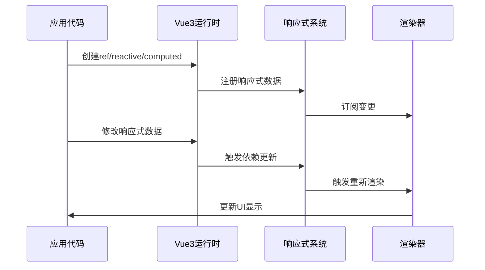

**图表来源**
- [vue.rs:27-264](file://crates/iris-js/src/vue.rs#L27-L264)

### 生命周期管理

完整的生命周期钩子支持，包括：

- **创建阶段**：setup、onMounted
- **更新阶段**：onUpdated、onBeforeUpdate
- **销毁阶段**：onUnmounted、onBeforeUnmount
- **错误处理**：onErrorCaptured、onRenderTracked、onRenderTriggered

### 依赖追踪

实现高效的依赖追踪机制，确保：
- 最小化重渲染范围
- 避免不必要的计算
- 优化内存使用

**章节来源**
- [vue.rs:27-264](file://crates/iris-js/src/vue.rs#L27-L264)

## 生命周期管理

### 生命周期钩子实现

Leivue Runtime提供了完整的Vue3生命周期钩子支持：

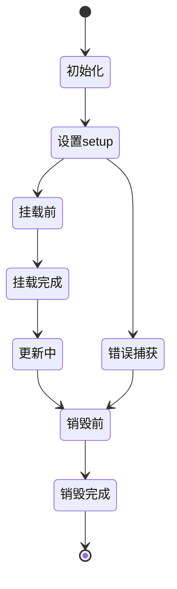

**图表来源**
- [orchestrator.rs:65-85](file://crates/iris/src/orchestrator.rs#L65-L85)

### 生命周期钩子类型

- **创建期**：setup、onBeforeMount、onMounted
- **更新期**：onBeforeUpdate、onUpdated
- **销毁期**：onBeforeUnmount、onUnmounted
- **错误处理**：onErrorCaptured、onRenderTracked、onRenderTriggered

### 异步生命周期处理

支持异步生命周期钩子的正确执行顺序和错误处理机制。

**章节来源**
- [orchestrator.rs:65-85](file://crates/iris/src/orchestrator.rs#L65-L85)

## 响应式系统实现

### 数据响应机制

Leivue Runtime实现了Vue3响应式系统的完整功能：

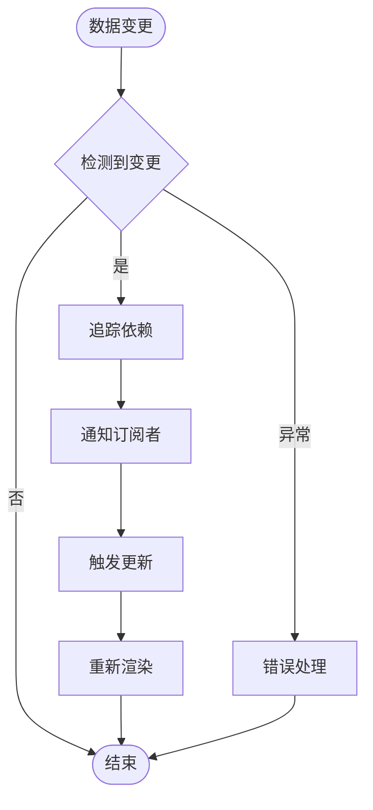

**图表来源**
- [vue.rs:27-264](file://crates/iris-js/src/vue.rs#L27-L264)

### 响应式数据类型

- **ref**：基本数据类型的响应式包装
- **reactive**：对象和数组的响应式代理
- **computed**：计算属性的懒执行和缓存
- **watch**：响应式数据变化监听

### 性能优化策略

- 依赖追踪优化
- 计算属性缓存
- 批量更新机制
- 内存泄漏防护

**章节来源**
- [vue.rs:27-264](file://crates/iris-js/src/vue.rs#L27-L264)

## 指令系统支持

### 内置指令支持

Leivue Runtime支持Vue3所有内置指令：

- **v-if/v-else/v-show**：条件渲染
- **v-for**：列表渲染
- **v-bind**：属性绑定
- **v-on**：事件监听
- **v-model**：双向绑定
- **v-slot**：插槽
- **v-pre**、**v-cloak**、**v-once**：特殊用途指令

### 自定义指令实现

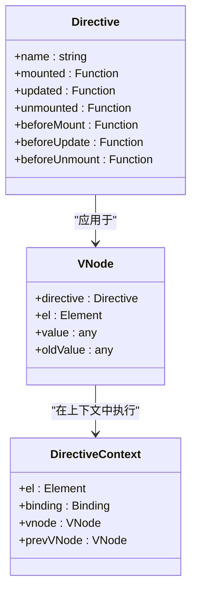

**图表来源**
- [vnode_renderer.rs:14-159](file://crates/iris/src/vnode_renderer.rs#L14-L159)

### 指令生命周期

- **beforeMount**：指令挂载前调用
- **mounted**：指令挂载后调用
- **beforeUpdate**：指令更新前调用
- **updated**：指令更新后调用
- **beforeUnmount**：指令卸载前调用
- **unmounted**：指令卸载后调用

**章节来源**
- [vnode_renderer.rs:14-159](file://crates/iris/src/vnode_renderer.rs#L14-L159)

## UI组件库集成

### Element Plus集成

Leivue Runtime提供了对Element Plus的完整支持：

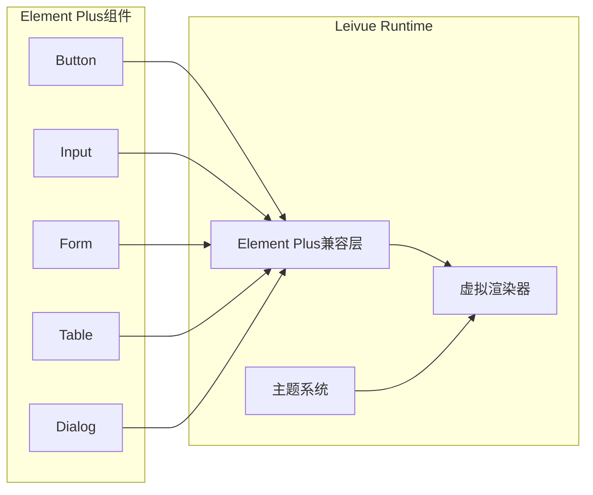

**图表来源**
- [App.vue:1-24](file://crates/iris-app/examples/demo/App.vue#L1-L24)

### Ant Design Vue集成

支持Ant Design Vue的所有组件和功能：
- 基础组件：Button、Input、Select等
- 布局组件：Layout、Grid等
- 导航组件：Menu、Breadcrumb等
- 反馈组件：Modal、Message等
- 表单组件：Form、DatePicker等

### Naive UI集成

提供Naive UI组件库的完整兼容：
- 数据展示：DataTable、Tree等
- 表单控件：Input、Select、DatePicker等
- 导航组件：Tabs、Menu等
- 反馈组件：Modal、Notification等

### 主题系统支持

- 支持深色/浅色主题切换
- 动态主题变量定制
- CSS变量映射机制
- 组件样式隔离

**章节来源**
- [App.vue:1-24](file://crates/iris-app/examples/demo/App.vue#L1-L24)

## 第三方插件接入

### 插件系统架构

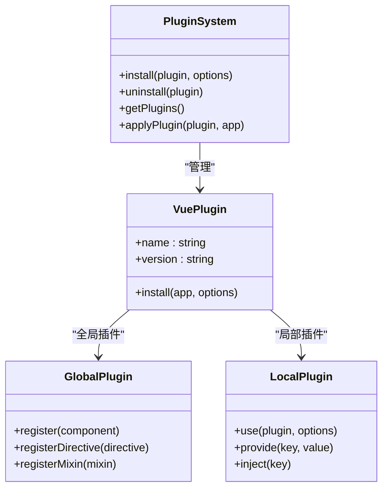

**图表来源**
- [orchestrator.rs:40-52](file://crates/iris/src/orchestrator.rs#L40-L52)

### 插件安装流程

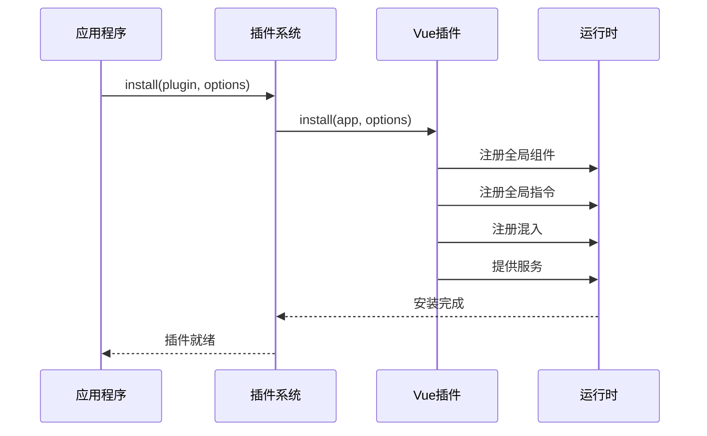

**图表来源**
- [orchestrator.rs:87-111](file://crates/iris/src/orchestrator.rs#L87-L111)

### 支持的插件类型

- **全局插件**：注册全局组件、指令、混入
- **局部插件**：仅在特定组件中生效
- **服务插件**：提供依赖注入服务
- **工具插件**：提供工具函数和方法

**章节来源**
- [orchestrator.rs:40-52](file://crates/iris/src/orchestrator.rs#L40-L52)

## 全局组件注册机制

### 组件注册流程

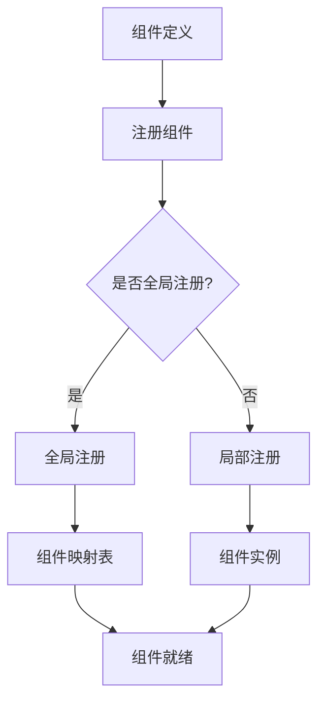

**图表来源**
- [orchestrator.rs:87-111](file://crates/iris/src/orchestrator.rs#L87-L111)

### 全局组件注册

支持通过多种方式注册全局组件：

- **Vue.use()方式**：标准Vue插件注册
- **app.component()方式**：直接注册组件
- **自动导入**：基于目录结构的自动注册
- **动态注册**：运行时动态注册组件

### 组件生命周期管理

- **组件创建**：初始化组件状态和依赖
- **组件更新**：响应数据变化进行更新
- **组件销毁**：清理资源和事件监听
- **组件缓存**：支持keep-alive缓存机制

**章节来源**
- [orchestrator.rs:87-111](file://crates/iris/src/orchestrator.rs#L87-L111)

## 自定义指令实现

### 指令定义语法

```javascript
// 基本指令定义
export default {
  mounted(el, binding, vnode) {
    // 指令挂载时执行
  },
  updated(el, binding, vnode) {
    // 指令更新时执行
  },
  unmounted(el, binding, vnode) {
    // 指令卸载时执行
  }
}
```

### 指令上下文

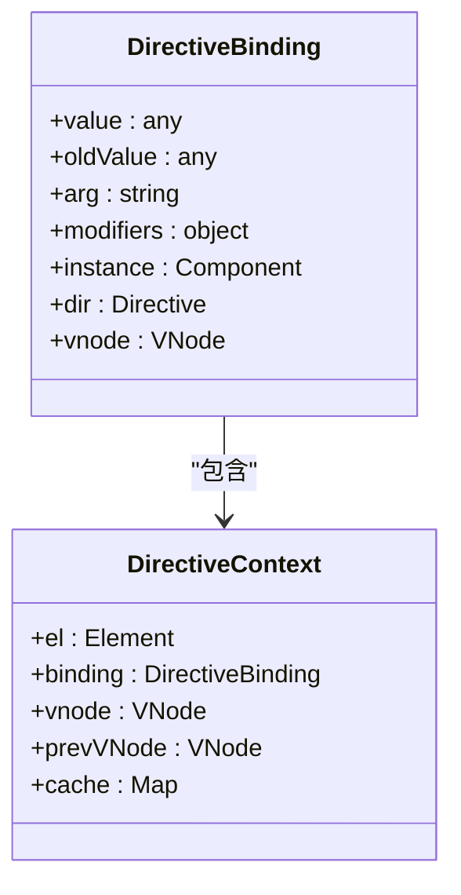

**图表来源**
- [vnode_renderer.rs:14-159](file://crates/iris/src/vnode_renderer.rs#L14-L159)

### 指令执行时机

- **beforeMount**：指令挂载前的准备工作
- **mounted**：指令挂载后的初始化操作
- **beforeUpdate**：指令更新前的数据准备
- **updated**：指令更新后的状态同步
- **beforeUnmount**：指令卸载前的清理工作
- **unmounted**：指令卸载后的最终清理

### 高级指令功能

- **修饰符支持**：v-my-directive:foo.bar
- **参数传递**：v-my-directive="expression"
- **动态指令**：指令值的动态变化
- **指令组合**：多个指令在同一元素上使用

**章节来源**
- [vnode_renderer.rs:14-159](file://crates/iris/src/vnode_renderer.rs#L14-L159)

## 性能特性分析

### 渲染性能优化

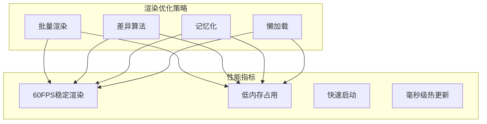

**图表来源**
- [lib.rs:308-490](file://crates/iris-gpu/src/lib.rs#L308-L490)

### 内存管理优化

- **内存池管理**：高效分配和回收内存
- **垃圾回收优化**：减少GC停顿时间
- **组件缓存**：智能缓存策略
- **资源释放**：及时释放不再使用的资源

### 网络性能优化

- **双网络模式**：自研Rust网络栈
- **跨域突破**：支持跨域请求
- **内网访问**：优化内网请求性能
- **缓存策略**：智能缓存机制

### 启动性能优化

- **零编译启动**：直接运行源码
- **模块预加载**：关键模块提前加载
- **并行初始化**：多任务并行启动
- **增量更新**：支持增量编译和更新

**章节来源**
- [lib.rs:308-490](file://crates/iris-gpu/src/lib.rs#L308-L490)

## 跨端运行支持

### 浏览器WASM模式

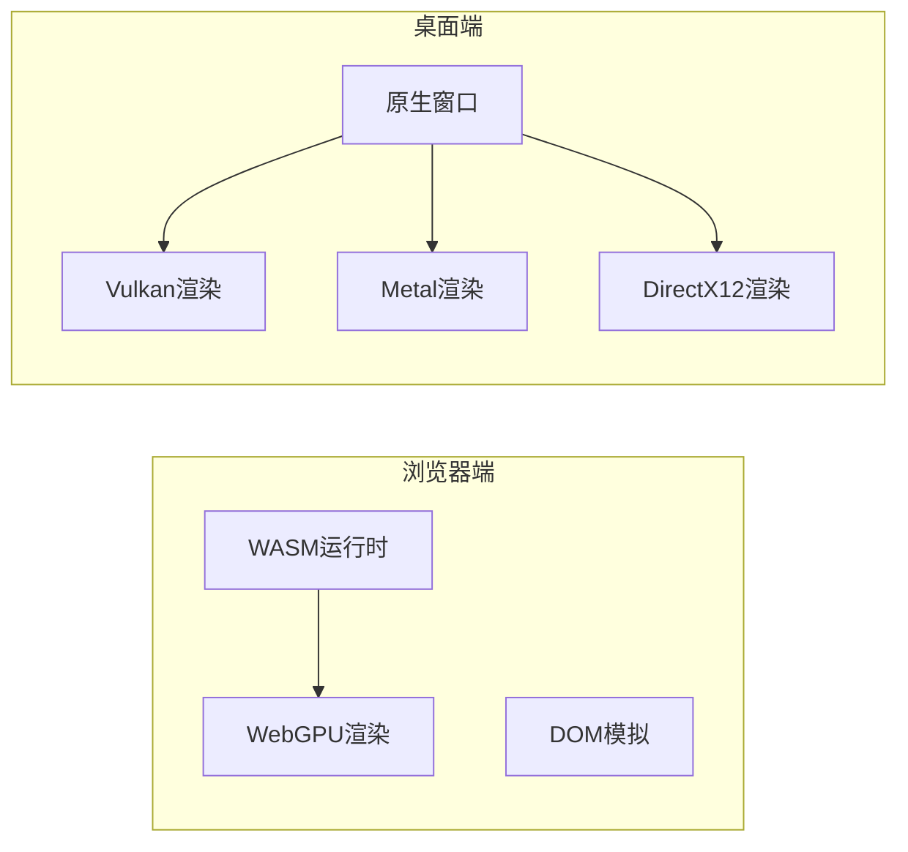

**图表来源**
- [main.rs:132-174](file://crates/iris-app/src/main.rs#L132-L174)

### 双端一致性保证

- **统一API**：相同的JavaScript API
- **一致行为**：相同的运行时行为
- **共享代码**：同一套Vue应用代码
- **统一调试**：统一的调试工具链

### 平台特定优化

- **浏览器端**：WASM优化、WebGPU利用
- **桌面端**：原生性能、系统集成
- **内存管理**：针对不同平台的优化
- **I/O操作**：平台特定的I/O优化

**章节来源**
- [main.rs:132-174](file://crates/iris-app/src/main.rs#L132-L174)

## 安全与扩展能力

### 安全隔离机制

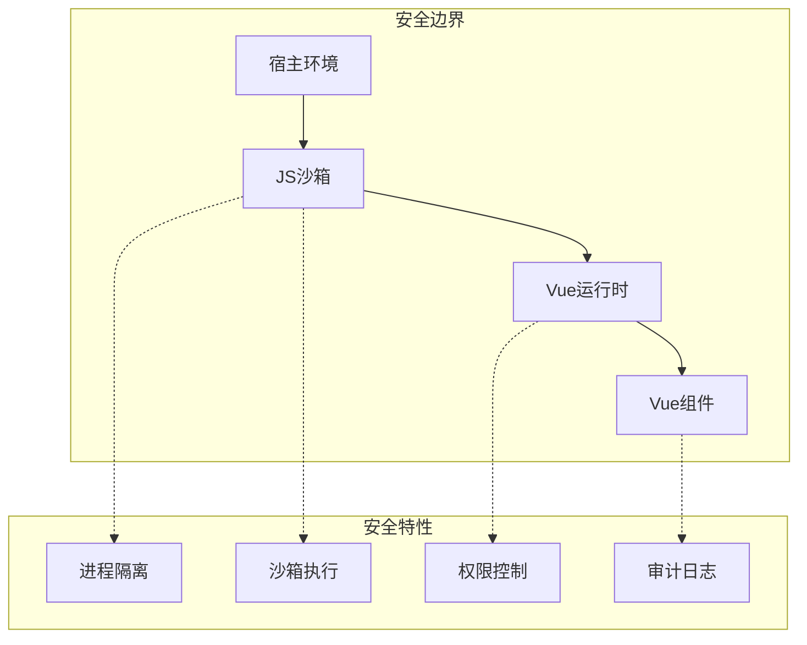

**图表来源**
- [vm.rs:88-130](file://crates/iris-js/src/vm.rs#L88-L130)

### 沙箱安全特性

- **独立执行环境**：与宿主环境完全隔离
- **资源限制**：内存、CPU使用限制
- **网络访问控制**：可控的网络访问
- **文件系统访问**：受限的文件系统访问

### 扩展能力

- **插件系统**：支持第三方插件
- **主题系统**：支持自定义主题
- **国际化**：多语言支持
- **自定义渲染器**：支持自定义渲染逻辑

**章节来源**
- [vm.rs:88-130](file://crates/iris-js/src/vm.rs#L88-L130)

## 迁移与部署指南

### 现有项目迁移

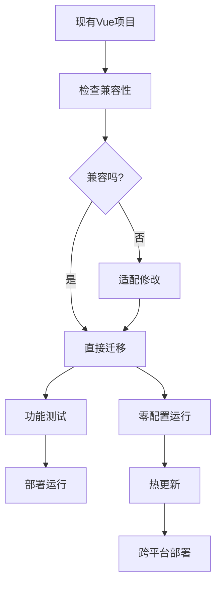

**图表来源**
- [main.rs:408-437](file://crates/iris-app/src/main.rs#L408-L437)

### 部署选项

- **浏览器部署**：编译为WASM嵌入网页
- **桌面部署**：编译为独立可执行文件
- **云端部署**：支持容器化部署
- **私有化部署**：支持内网环境部署

### 迁移注意事项

- **构建工具**：无需Vite/Webpack等构建工具
- **依赖管理**：无需npm/yarn包管理
- **配置文件**：无需复杂的配置文件
- **开发体验**：保持原有的开发习惯

**章节来源**
- [main.rs:408-437](file://crates/iris-app/src/main.rs#L408-L437)

## 故障排除指南

### 常见问题诊断

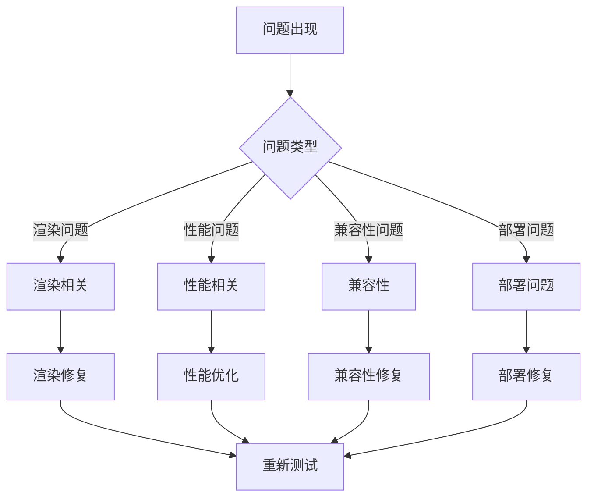

### 调试工具

- **浏览器开发者工具**：支持标准调试工具
- **性能分析器**：内置性能监控
- **内存分析器**：内存使用情况监控
- **网络分析器**：网络请求监控

### 日志系统

- **详细日志**：运行时详细日志记录
- **错误报告**：结构化的错误报告
- **性能指标**：关键性能指标收集
- **用户行为**：用户操作行为追踪

**章节来源**
- [main.rs:408-437](file://crates/iris-app/src/main.rs#L408-L437)

## Iris引擎第5阶段完整演示

### 最小可运行Demo

Iris引擎第5阶段提供了完整的最小可运行演示程序，展示了从SFC编译到运行时执行的完整流程：

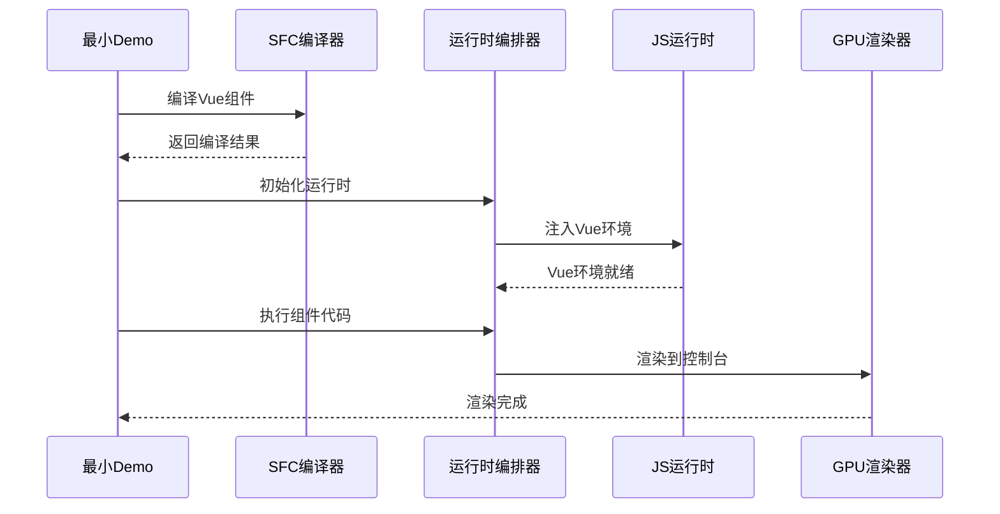

**图表来源**
- [minimal_demo.rs:14-157](file://crates/iris-app/examples/demo/minimal_demo.rs#L14-L157)

### SFC编译器完整示例

演示了SFC编译器的完整功能，包括：

- **完整功能组件**：包含所有Iris SFC支持的特性
- **计数器组件**：简单的交互式组件
- **TypeScript组件**：TypeScript源码的编译和处理

### WebGPU渲染系统集成

展示了WebGPU渲染系统的完整集成：

- **批渲染系统**：高效的2D图形渲染
- **着色器系统**：WGSL着色器的编译和使用
- **文件热更新**：支持.vue/.js/.css文件的热重载

### 运行时编排器

演示了运行时编排器的完整工作流程：

- **初始化阶段**：JS运行时和BOM API的初始化
- **编译阶段**：SFC组件的编译和加载
- **执行阶段**：Vue应用的执行和虚拟DOM创建
- **渲染循环**：事件处理、虚拟DOM更新、GPU渲染

**章节来源**
- [minimal_demo.rs:14-157](file://crates/iris-app/examples/demo/minimal_demo.rs#L14-L157)
- [sfc_integration.rs:7-46](file://crates/iris-app/examples/sfc_integration.rs#L7-L46)
- [orchestrator.rs:65-156](file://crates/iris/src/orchestrator.rs#L65-L156)

## 总结与展望

### 技术优势总结

Leivue Runtime作为下一代前端运行时引擎，在Vue生态兼容性方面展现了显著的技术优势：

1. **架构创新**：七层分层架构设计，实现高度解耦
2. **性能卓越**：基于WebGPU的硬件加速渲染
3. **生态完整**：完全兼容Vue3及其生态系统
4. **跨端统一**：浏览器和桌面端的统一运行体验
5. **开发友好**：零编译、零配置的开发体验
6. **引擎升级**：从QuickJS迁移到Boa Engine，提供更好的性能和可靠性
7. **完整演示**：Iris引擎第5阶段提供完整的运行时演示程序

### 未来发展方向

- **性能持续优化**：进一步提升渲染和执行性能
- **生态扩展**：支持更多Vue生态组件库
- **工具完善**：增强开发和调试工具链
- **社区建设**：建立活跃的开发者社区
- **企业应用**：支持更多企业级应用场景

### 技术挑战与解决方案

- **兼容性挑战**：通过深入理解Vue内部机制解决
- **性能挑战**：通过WebGPU硬件加速解决
- **开发体验**：通过零编译理念解决
- **跨端一致性**：通过统一抽象层解决
- **引擎稳定性**：通过Boa Engine原生实现解决

Leivue Runtime代表了前端运行时技术的发展方向，为Vue生态提供了高性能、跨端、安全的运行环境，有望成为下一代前端应用开发的重要基础设施。

**章节来源**
- [minimal_demo.rs:141-157](file://crates/iris-app/examples/demo/minimal_demo.rs#L141-L157)
- [sfc_demo.rs:128-292](file://crates/iris-sfc/examples/sfc_demo.rs#L128-L292)
- [integration_test.rs:7-79](file://crates/iris-sfc/tests/integration_test.rs#L7-L79)