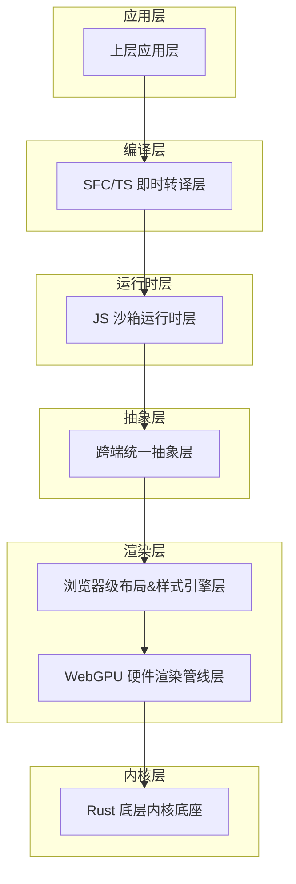
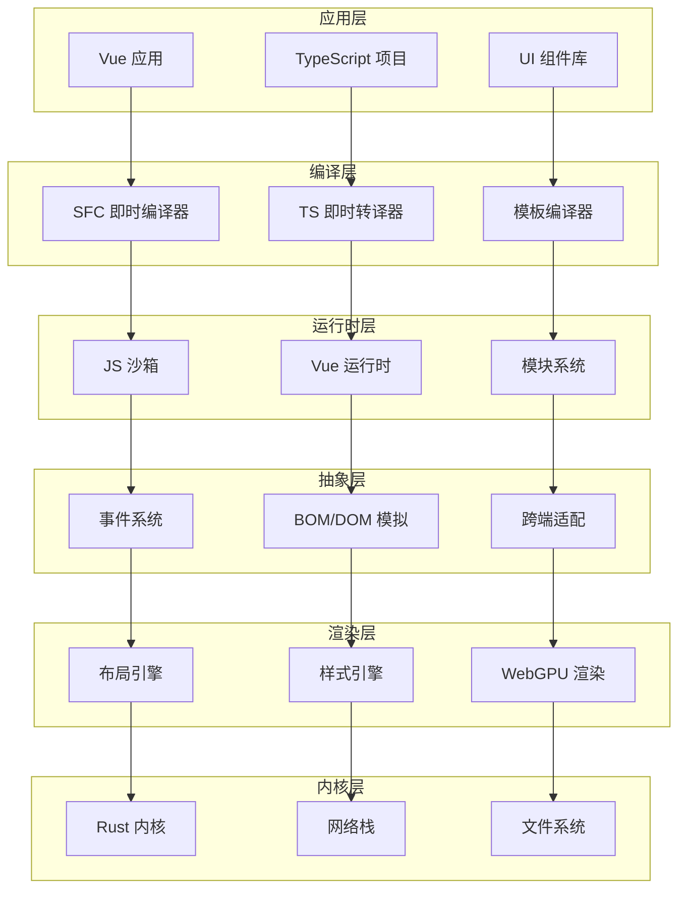
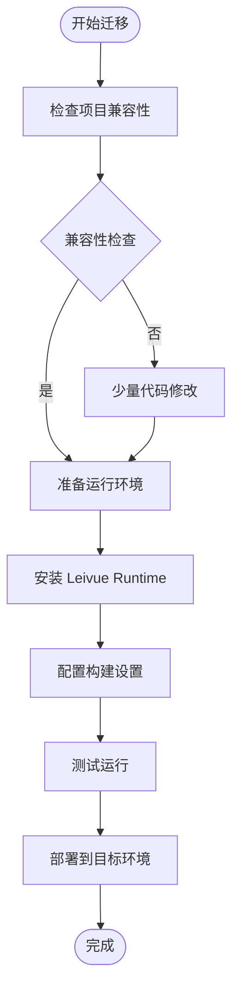
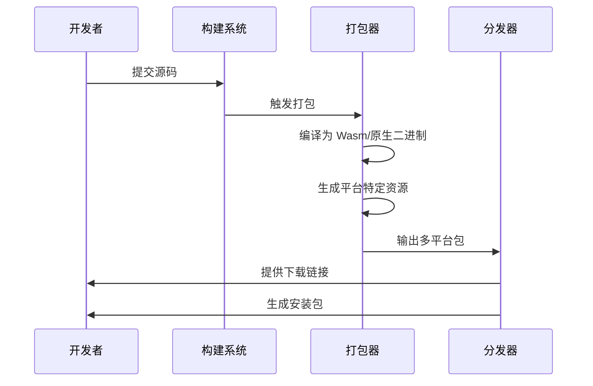
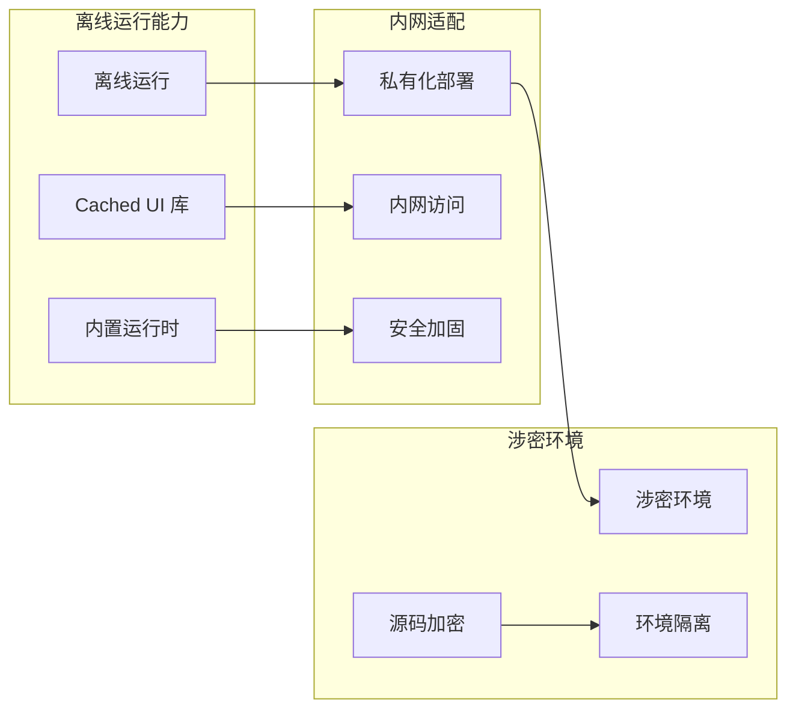
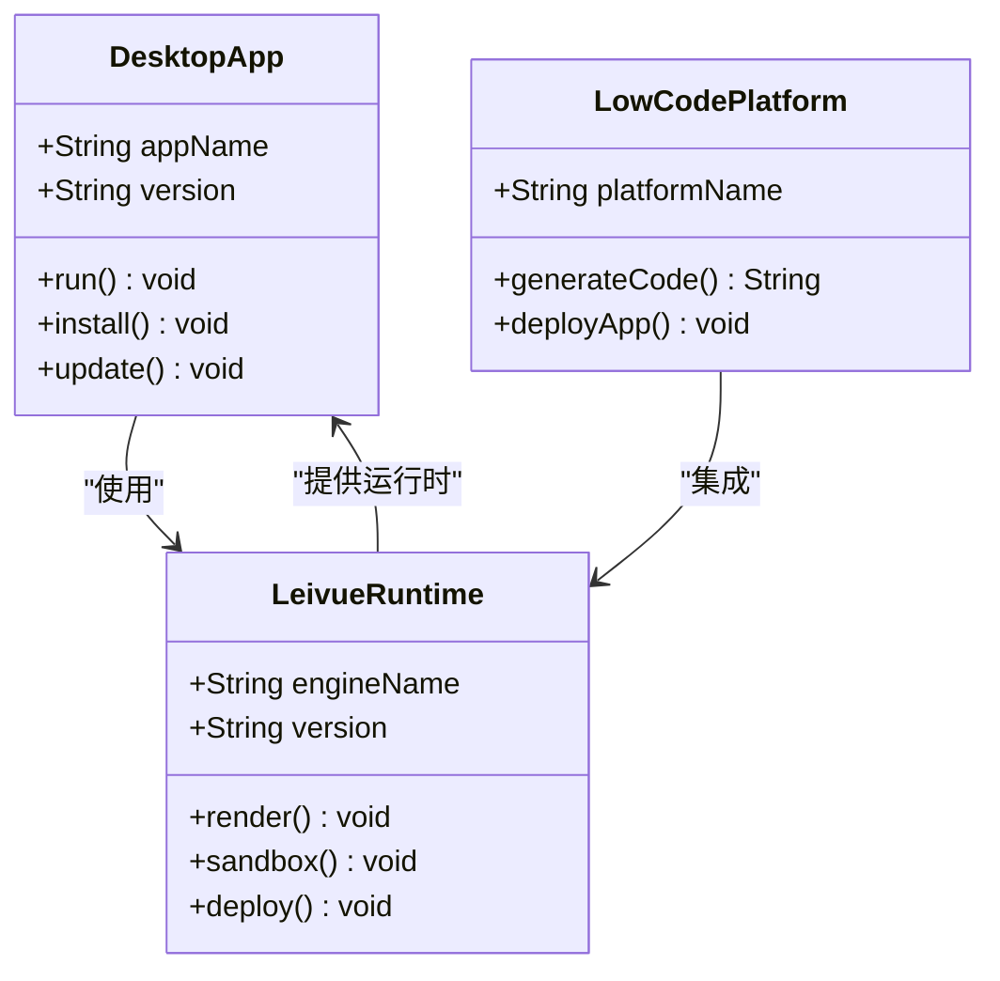
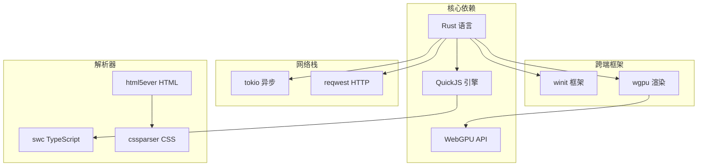

# 工程化与商业化能力

<cite>
**本文档引用的文件**
- [doc.txt](file://doc.txt)
- [todo.txt](file://todo.txt)
</cite>

## 目录
1. [简介](#简介)
2. [项目结构](#项目结构)
3. [核心组件](#核心组件)
4. [架构概览](#架构概览)
5. [详细组件分析](#详细组件分析)
6. [依赖关系分析](#依赖关系分析)
7. [性能考虑](#性能考虑)
8. [故障排除指南](#故障排除指南)
9. [结论](#结论)
10. [附录](#附录)

## 简介

Leivue Runtime 是一个革命性的前端运行时引擎，采用 Rust 和 WebGPU 技术构建，旨在彻底改变前端开发方式。该项目的核心目标是消除前端工程化复杂性，突破浏览器沙箱限制，为 Vue 生态提供高性能的跨端运行底座。

### 核心特性

- **零编译运行**：直接执行 Vue3 + TypeScript 源码，无需构建过程
- **双端跨平台**：同时支持浏览器 Wasm 模式和桌面原生模式
- **生态兼容**：完全兼容 Element Plus、Ant Design Vue 等主流 UI 库
- **高性能渲染**：基于 WebGPU 的硬件加速渲染
- **安全隔离**：独立的 JS 沙箱运行时层
- **工程化简化**：一键跨端打包和部署

## 项目结构

基于现有文档信息，项目采用七层分层架构设计，每层都有明确的职责分工：

**图表来源**
- [doc.txt:7-22](file://doc.txt#L7-L22)

**章节来源**
- [doc.txt:7-22](file://doc.txt#L7-L22)

## 核心组件

### 1. 底层内核底座（Rust 核心基座）

- **语言**：纯 Rust 编写，具备无垃圾回收、内存安全和高性能特点
- **基础能力**：跨端窗口管理、异步调度、内存池、文件 IO、原生网络栈、缓存系统
- **跨端适配**：
  - 桌面端：使用 winit 原生窗口 + Vulkan/Metal/DX12 渲染
  - 浏览器端：Wasm 编译 + 浏览器 WebGPU API 绑定
- **核心依赖**：wgpu、winit、tokio、reqwest

### 2. WebGPU 硬件渲染层

- **设计理念**：完全抛弃浏览器 DOM 渲染流水线，采用全自研 GPU 渲染
- **技术规范**：基于标准 WebGPU 规范，统一桌面和浏览器渲染接口
- **核心能力**：批渲染、矢量绘制、圆角/阴影/渐变、纹理图集、字体渲染、图层合成
- **性能优势**：60fps 稳定渲染、大列表/复杂组件无卡顿、CPU 开销极低

### 3. 布局 & 样式引擎层

- **浏览器内核能力**：复刻标准浏览器 CSS 体系，对标 Chromium 基础能力
- **HTML 解析**：使用 html5ever 工业级解析，生成标准 DOM 节点树
- **CSS 引擎**：cssparser 解析、选择器匹配、样式继承、权重计算
- **布局系统**：自研盒模型、Flex、流式布局，对标 W3C 标准
- **样式挂载**：支持全局样式、Scoped 样式、第三方 UI 库 CSS 全局注入

### 4. 跨端统一抽象层

- **统一事件系统**：鼠标、键盘、滚动、点击命中检测
- **统一 BOM/DOM 模拟 API**：轻量实现 window/document/Event
- **核心作用**：无缝兼容 Element Plus 等 UI 库所需的浏览器环境 API
- **运行机制**：无真实 DOM，仅做逻辑模拟，实际绘制全部走 WebGPU

### 5. JS 沙箱运行时层

- **JS 引擎**：QuickJS（轻量高性能、Wasm 友好、Rust 深度绑定）
- **沙箱隔离**：与宿主环境完全隔离，确保脚本安全
- **内置运行时**：预加载 Vue3 完整运行时（runtime-core/runtime-dom）
- **模块系统**：自研 ESM 解析器，支持 import/export、第三方包引入

### 6. 即时转译层

- **核心理念**：零编译能力，实现源码直接运行
- **三大核心能力**：
  - TypeScript 即时转译：基于 Rust swc，内存内实时 TS→JS，支持泛型/装饰器/TSX
  - Vue SFC 即时编译：官方 Rust 库解析.vue，自动拆分 template/script-setup/style
  - Template 实时编译为 Vue 渲染函数
  - Script 自动 TS 转译
  - Style 自动解析并入全局样式系统
- **工程化优势**：无构建打包：无 Vite/Webpack/tsc，无 node_modules 强依赖

**章节来源**
- [doc.txt:23-64](file://doc.txt#L23-L64)

## 架构概览

Leivue Runtime 采用七层分层架构，每一层都具有高度的解耦性和专业性：

**图表来源**
- [doc.txt:7-22](file://doc.txt#L7-L22)

## 详细组件分析

### Vue 项目迁移方案

#### 最小化代码改造原则

Leivue Runtime 设计的核心理念之一是实现现有 Vue 项目的低成本迁移，遵循以下原则：

1. **零改动兼容**：几乎无需修改业务代码即可运行
2. **生态无缝集成**：完整支持 Element Plus、Ant Design Vue、Naive UI 等主流 UI 库
3. **组合式 API 全面支持**：Vue3 组合式 API、生命周期、响应式、指令完全兼容
4. **第三方插件支持**：支持第三方 Vue 插件、全局组件、自定义指令

#### 迁移成本控制策略

**图表来源**
- [doc.txt:93-97](file://doc.txt#L93-L97)

#### 兼容性保证机制

- **TypeScript 支持**：直接运行 TypeScript，无需 tsc、无需 tsconfig
- **实时热更新**：修改源码即时刷新，无构建等待
- **零工程化**：无 Node、无 npm、无依赖配置即可开发
- **样式系统**：支持 Scoped CSS、全局 CSS、样式嵌套、基础 Sass 即时解析

**章节来源**
- [doc.txt:66-75](file://doc.txt#L66-L75)
- [doc.txt:93-97](file://doc.txt#L93-L97)

### 一键跨端打包实现流程

#### 多平台分发配置

Leivue Runtime 提供了完整的跨端打包解决方案，支持 Windows、macOS、Linux 多平台分发：

**图表来源**
- [doc.txt:95](file://doc.txt#L95)

#### 部署策略

- **浏览器模式**：编译为 Wasm，嵌入任意现代浏览器，基于 WebGPU 运行
- **桌面原生模式**：脱离浏览器、脱离 Electron/Tauri，编译为独立 EXE/App/二进制
- **体积优势**：体积极小（MB 级）、内存占用低、启动极速
- **权限支持**：原生系统权限：本地文件、串口、离线运行、内网部署

**章节来源**
- [doc.txt:76-82](file://doc.txt#L76-L82)
- [doc.txt:95](file://doc.txt#L95)

### 私有化、内网和涉密环境适配方案

#### 无外网依赖配置

Leivue Runtime 专为私有化部署场景设计，提供了完整的离线运行能力：

**图表来源**
- [doc.txt:96](file://doc.txt#L96)

#### 安全加固措施

- **独立 JS 沙箱**：脚本隔离运行，防止恶意代码
- **双网络模式**：自研 Rust 网络栈，支持跨域突破、内网请求
- **离线运行**：核心 UI 库/运行时可内置缓存，无网络可用
- **源码保护**：支持源码加密运行，保护商业项目代码

**章节来源**
- [doc.txt:88-92](file://doc.txt#L88-L92)
- [doc.txt:96](file://doc.txt#L96)

### 低代码平台和桌面工具集成案例

#### 低代码平台集成

Leivue Runtime 可作为低代码平台的底层运行底座，提供：

- **快速原型开发**：零编译运行，毫秒级热更新
- **多端一致体验**：统一的开发和运行环境
- **企业级安全**：独立沙箱和源码保护
- **离线部署**：支持私有化和内网环境

#### 桌面工具集成

**图表来源**
- [doc.txt:97](file://doc.txt#L97)

**章节来源**
- [doc.txt:97](file://doc.txt#L97)

## 依赖关系分析

### 技术栈依赖

**图表来源**
- [doc.txt:29](file://doc.txt#L29)

### 开发进度跟踪

项目当前处于早期开发阶段，主要开发任务包括：

1. **制定详细的开发计划和项目结构**
2. **搭建 Rust 项目骨架（初始化 Cargo workspace、分层模块等）**
3. **实现某个具体模块（如 WebGPU 渲染管线、SFC 编译器、JS 沙箱运行时等）**
4. **审查或优化现有架构设计**
5. **其他需求**

**章节来源**
- [todo.txt:1-5](file://todo.txt#L1-L5)

## 性能考虑

### 渲染性能优化

- **硬件加速**：基于 WebGPU 的 GPU 渲染，显著提升渲染性能
- **批处理渲染**：优化大量元素的渲染效率
- **内存管理**：Rust 的内存安全保证，避免内存泄漏
- **异步处理**：Tokio 异步运行时，提高并发性能

### 启动性能优化

- **零编译启动**：直接运行源码，无需构建等待
- **模块化加载**：按需加载模块，减少启动时间
- **缓存策略**：内置缓存系统，提升重复启动速度

## 故障排除指南

### 常见问题及解决方案

1. **运行时错误**
   - 检查浏览器是否支持 WebGPU
   - 确认 Wasm 模块正确加载
   - 验证网络连接状态

2. **渲染问题**
   - 检查 CSS 兼容性
   - 验证 WebGPU 支持情况
   - 确认 GPU 驱动版本

3. **性能问题**
   - 监控内存使用情况
   - 检查渲染负载
   - 优化组件结构

### 调试工具

- **日志系统**：详细的运行时日志输出
- **性能监控**：内置性能指标收集
- **错误报告**：结构化的错误信息

**章节来源**
- [doc.txt:88-92](file://doc.txt#L88-L92)

## 结论

Leivue Runtime 代表了前端运行时技术的重大突破，通过 Rust 和 WebGPU 的结合，实现了真正意义上的零编译运行和跨端统一。其七层分层架构设计确保了系统的高内聚、低耦合，为 Vue 生态提供了强大的性能支撑。

### 主要优势

1. **革命性的工程化简化**：彻底消除前端构建复杂性
2. **卓越的性能表现**：硬件加速渲染，60fps 稳定运行
3. **强大的跨端能力**：统一的开发和运行环境
4. **企业级安全保障**：独立沙箱和源码保护
5. **灵活的部署选项**：支持多种部署场景

### 发展前景

随着 WebGPU 技术的不断成熟和 Rust 生态的持续发展，Leivue Runtime 有望成为下一代前端应用的标准运行时，为开发者提供更高效、更安全、更便捷的开发体验。

## 附录

### 快速开始指南

1. **环境准备**：确保系统支持 WebGPU 或安装相应的渲染驱动
2. **项目迁移**：将现有 Vue 项目直接迁移到 Leivue Runtime
3. **功能验证**：运行示例项目验证核心功能
4. **生产部署**：配置多平台打包和部署

### 社区支持

- **GitHub 仓库**：获取最新代码和文档
- **Issue 跟踪**：报告问题和功能请求
- **讨论区**：参与社区讨论和技术交流