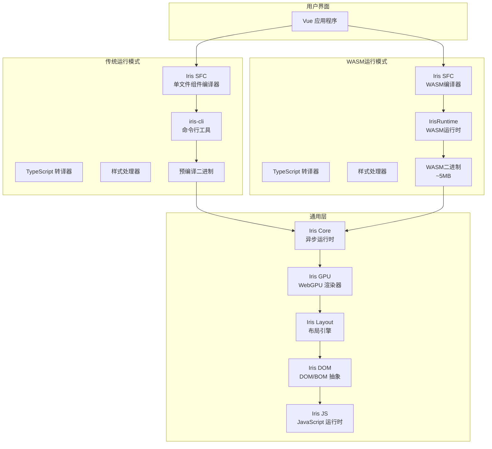
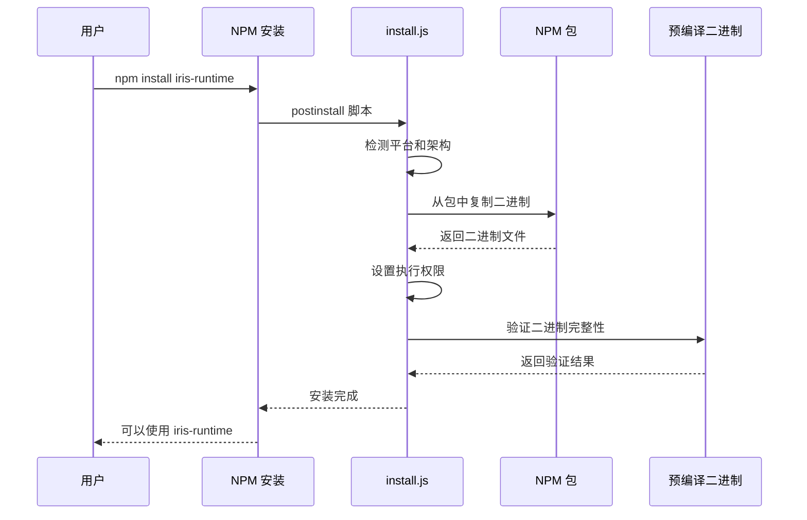
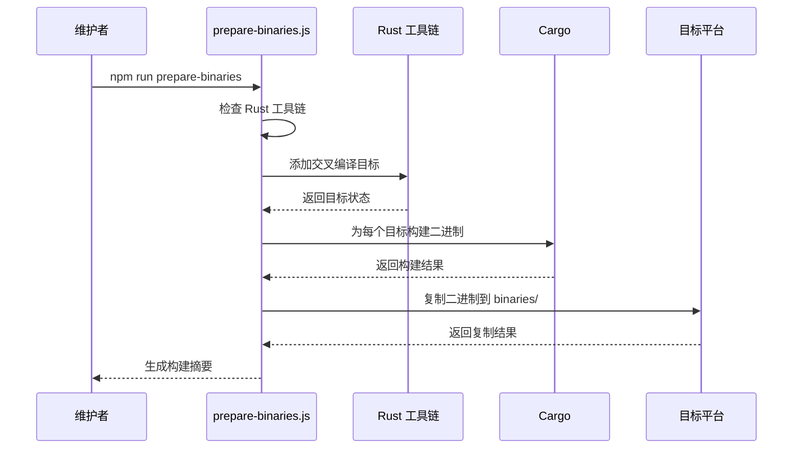
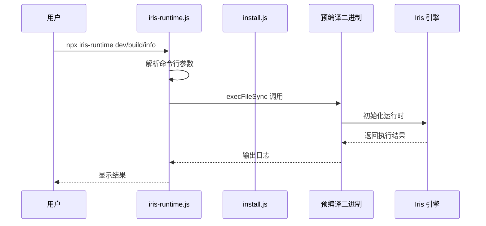
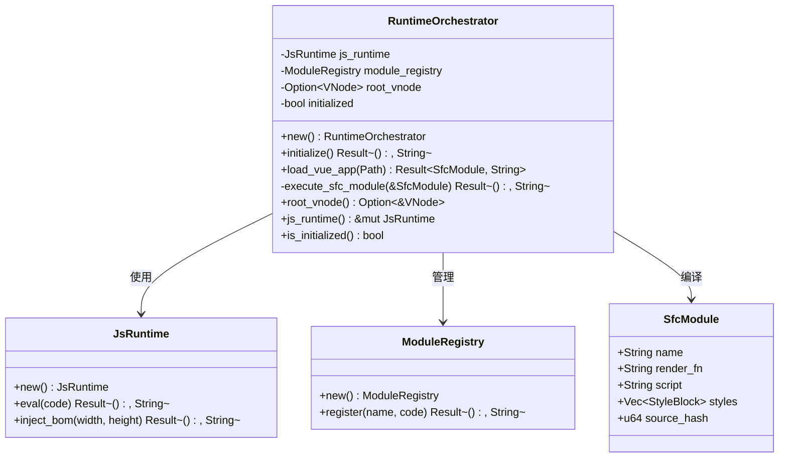
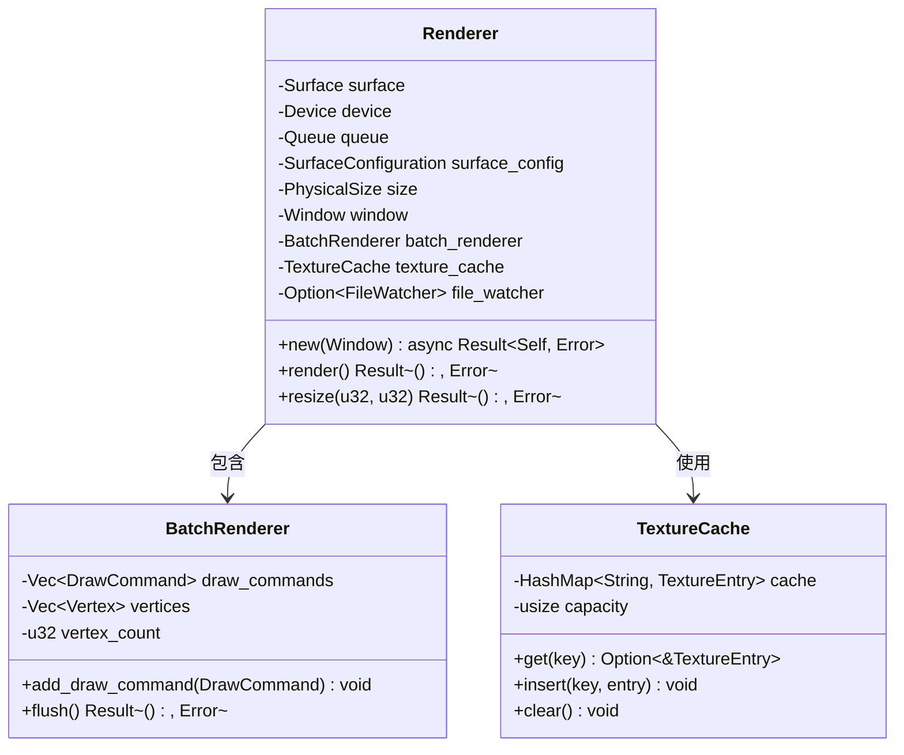
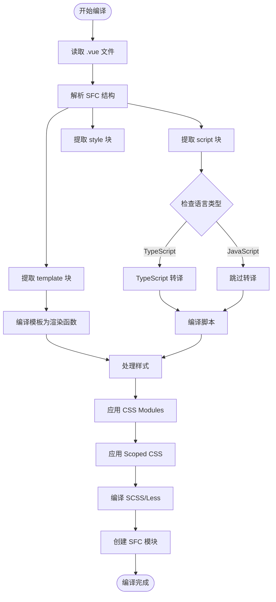
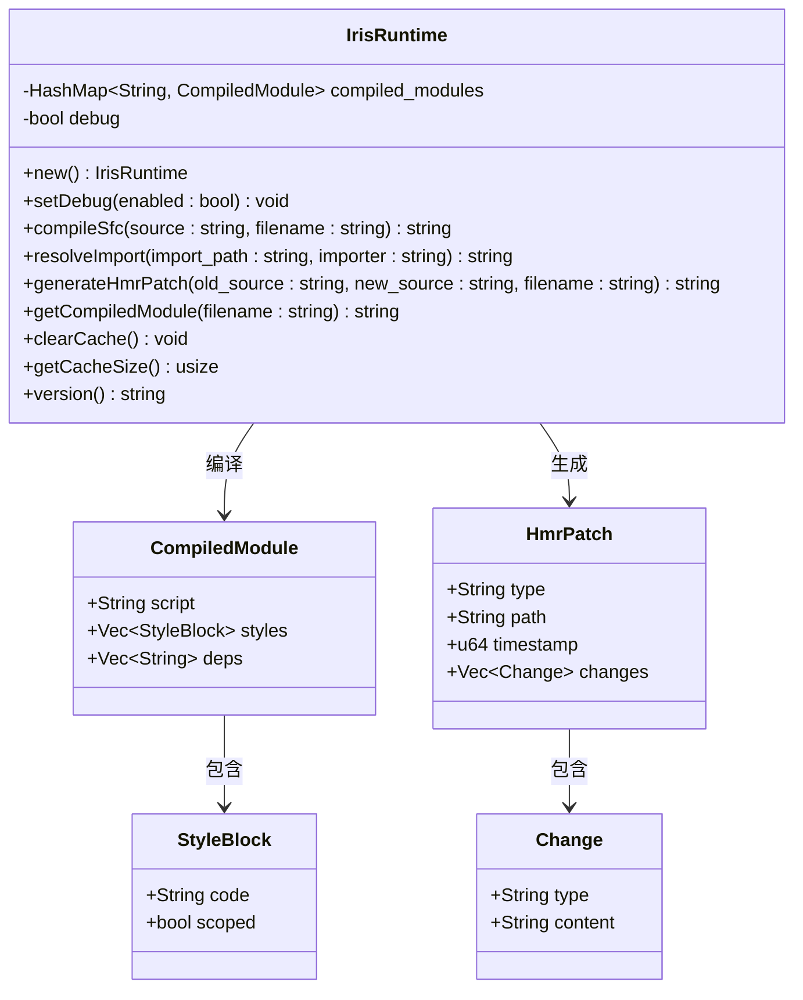
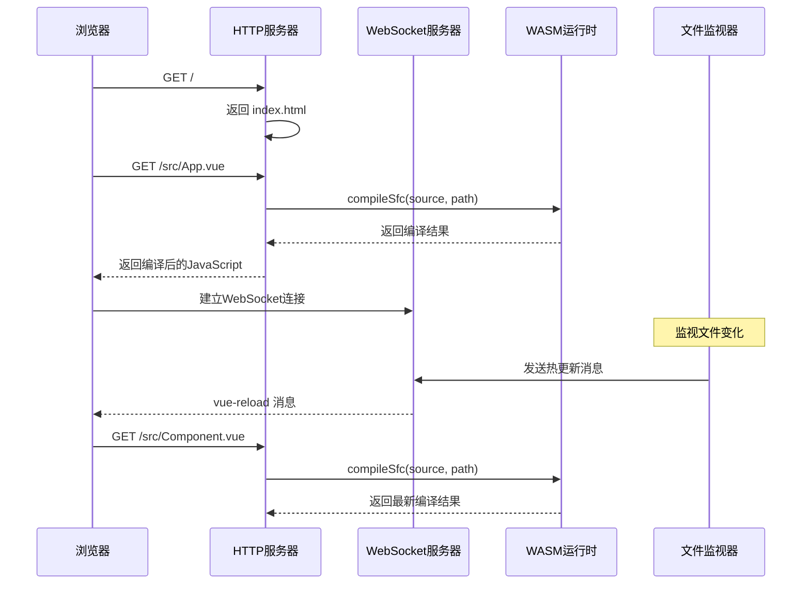
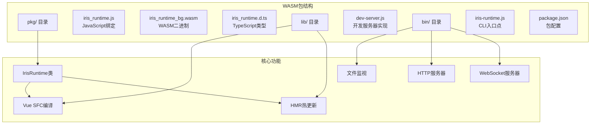

# Iris Runtime NPM 包

<cite>
**本文档引用的文件**
- [package.json](file://iris-runtime/package.json)
- [iris-runtime.js](file://iris-runtime/bin/iris-runtime.js)
- [install.js](file://iris-runtime/scripts/install.js)
- [prepare-binaries.js](file://iris-runtime/scripts/prepare-binaries.js)
- [README.md](file://iris-runtime/README.md)
- [Cargo.toml](file://Cargo.toml)
- [Cargo.toml](file://crates/iris-cli/Cargo.toml)
- [Cargo.toml](file://crates/iris-engine/Cargo.toml)
- [Cargo.toml](file://crates/iris-gpu/Cargo.toml)
- [main.rs](file://crates/iris-cli/src/main.rs)
- [lib.rs](file://crates/iris-engine/src/lib.rs)
- [orchestrator.rs](file://crates/iris-engine/src/orchestrator.rs)
- [lib.rs](file://crates/iris-core/src/lib.rs)
- [lib.rs](file://crates/iris-gpu/src/lib.rs)
- [lib.rs](file://crates/iris-layout/src/lib.rs)
- [lib.rs](file://crates/iris-dom/src/lib.rs)
- [lib.rs](file://crates/iris-sfc/src/lib.rs)
- [package.json](file://crates/iris-runtime/package.json)
- [README.md](file://crates/iris-runtime/README.md)
- [Cargo.toml](file://crates/iris-runtime/Cargo.toml)
- [lib.rs](file://crates/iris-runtime/src/lib.rs)
- [compiler.rs](file://crates/iris-runtime/src/compiler.rs)
- [hmr.rs](file://crates/iris-runtime/src/hmr.rs)
- [dev-server.js](file://crates/iris-runtime/lib/dev-server.js)
- [iris-runtime.js](file://crates/iris-runtime/bin/iris-runtime.js)
</cite>

## 更新摘要
**变更内容**
- 新增完整的WASM开发服务器功能，提供基于WebAssembly的Vue SFC编译和热重载
- iris-runtime包现在同时包含预编译二进制和WASM开发服务器两种运行模式
- 新增WASM运行时API，支持JavaScript直接调用Vue SFC编译功能
- 新增独立的iris-runtime WASM包，提供轻量级的开发服务器解决方案
- 增强了开发体验，支持零配置的WebAssembly开发服务器

## 目录
1. [简介](#简介)
2. [项目结构](#项目结构)
3. [核心组件](#核心组件)
4. [架构总览](#架构总览)
5. [详细组件分析](#详细组件分析)
6. [WASM开发服务器功能](#wasm开发服务器功能)
7. [依赖关系分析](#依赖关系分析)
8. [性能考虑](#性能考虑)
9. [故障排除指南](#故障排除指南)
10. [结论](#结论)

## 简介
Iris Runtime 是一个由 Rust + WebGPU 驱动的 Vue 3 开发服务器 NPM 包。经过重大架构升级，该包现已完全迁移到本地打包分发模式，无需用户安装 Rust 工具链即可使用。通过 Node.js 包装器调用预编译的 iris-cli 二进制文件，提供开发服务器、生产构建以及运行时信息查询功能。

**更新** 现在iris-runtime包不仅提供预编译二进制，还包含完整的WASM开发服务器实现，为开发者提供两种不同的运行模式选择。

## 项目结构
Iris Runtime 采用 monorepo 结构，包含一个传统NPM包和一个全新的WASM包。经过架构升级，现在提供两种主要的运行模式：

```mermaid
graph TB
subgraph "传统NPM包层 (iris-runtime)"
A[iris-runtime 包]
A1[bin/iris-runtime.js]
A2[scripts/install.js]
A3[scripts/prepare-binaries.js]
A4[package.json]
end
subgraph "预编译二进制层"
B[预编译二进制文件]
B1[iris-runtime.exe (Windows)]
B2[iris-runtime (macOS Intel)]
B3[iris-runtime-aarch64 (macOS ARM64)]
B4[iris-runtime-x86_64 (Linux)]
end
subgraph "WASM包层 (iris-runtime-wasm)"
C[iris-runtime WASM包]
C1[pkg/iris_runtime.js]
C2[pkg/iris_runtime_bg.wasm]
C3[lib/dev-server.js]
C4[bin/iris-runtime.js]
end
subgraph "Rust 工作区"
D[crates/]
subgraph "CLI 层"
D1[iris-cli]
D1a[src/main.rs]
end
subgraph "引擎层"
D2[iris-engine]
D2a[src/lib.rs]
D2b[src/orchestrator.rs]
end
subgraph "核心层"
D3[iris-core]
D3a[src/lib.rs]
end
subgraph "渲染层"
D4[iris-gpu]
D4a[src/lib.rs]
end
subgraph "布局层"
D5[iris-layout]
D5a[src/lib.rs]
end
subgraph "DOM层"
D6[iris-dom]
D6a[src/lib.rs]
end
subgraph "编译层"
D7[iris-sfc]
D7a[src/lib.rs]
end
subgraph "WASM运行时层"
D8[iris-runtime]
D8a[src/lib.rs]
D8b[src/compiler.rs]
D8c[src/hmr.rs]
end
end
A --> B
A --> D1
C --> D8
B --> D1
D8 --> D7
D1 --> D2
D2 --> D3
D2 --> D4
D2 --> D5
D2 --> D6
D2 --> D7
```

**图表来源**
- [Cargo.toml:1-35](file://Cargo.toml#L1-L35)
- [iris-runtime.js:1-131](file://iris-runtime/bin/iris-runtime.js#L1-L131)
- [install.js:1-94](file://iris-runtime/scripts/install.js#L1-L94)
- [prepare-binaries.js:1-146](file://iris-runtime/scripts/prepare-binaries.js#L1-L146)
- [main.rs:1-96](file://crates/iris-cli/src/main.rs#L1-L96)
- [lib.rs:1-205](file://crates/iris-runtime/src/lib.rs#L1-L205)

**章节来源**
- [package.json:1-60](file://iris-runtime/package.json#L1-L60)
- [README.md:1-164](file://iris-runtime/README.md#L1-L164)
- [Cargo.toml:1-35](file://Cargo.toml#L1-L35)

## 核心组件
Iris Runtime 由以下核心组件构成，现已完全基于预编译二进制和WASM两种模式：

### 传统NPM包管理层
- **iris-runtime 包**: 提供用户友好的 CLI 接口，无需 Rust 工具链
- **安装脚本**: 从包中复制预编译二进制文件，无需网络下载
- **维护者脚本**: 专门用于构建和准备多平台二进制文件
- **包装器脚本**: 将 Node.js 命令转发给预编译二进制

### WASM包管理层
- **iris-runtime WASM包**: 提供基于WebAssembly的轻量级开发服务器
- **WASM二进制**: 约5MB的精简二进制文件，支持跨平台运行
- **JavaScript绑定**: 自动生成的JS绑定和TypeScript类型定义
- **开发服务器**: 内置HTTP服务器和WebSocket HMR功能

### 预编译二进制层
- **iris-runtime 二进制**: 针对不同平台的预编译可执行文件
- **本地打包分发**: 所有二进制文件预先构建并包含在包中
- **自动检测机制**: 智能识别用户平台并选择对应二进制文件

### WASM运行时层
- **IrisRuntime类**: 提供Vue SFC编译、模块解析和热更新功能
- **编译器模块**: 基于iris-sfc的SFC编译功能
- **HMR模块**: 热模块替换补丁生成功能
- **模块解析**: 支持相对路径和裸模块名解析

### Rust CLI 层
- **iris-cli**: 主要的命令行工具，支持 dev/build/info 子命令
- **命令解析**: 使用 clap 库处理命令行参数和子命令
- **日志系统**: 集成 tracing 和 colored 日志输出

### 引擎编排层
- **RuntimeOrchestrator**: 协调各个引擎模块的初始化和交互
- **模块注册**: 管理 JavaScript 模块的注册和执行
- **生命周期管理**: 控制整个运行时的启动、运行和关闭过程

### 核心渲染层
- **WebGPU 渲染器**: 基于 wgpu 的硬件加速渲染
- **批渲染系统**: 优化图形绘制性能
- **纹理缓存**: 管理图像资源的缓存和复用

### 布局和 DOM 层
- **浏览器级布局**: 实现 Flexbox、Grid、表格等布局算法
- **虚拟 DOM**: 轻量级 DOM 抽象，支持事件系统
- **BOM API**: 提供 Window、Document 等浏览器 API 的模拟

### 编译层
- **SFC 编译器**: 即时编译 Vue 单文件组件
- **TypeScript 转译**: 支持 TypeScript 到 JavaScript 的转换
- **样式处理器**: 支持 CSS Modules、Scoped CSS、SCSS/Less

**更新** 新增WASM包层，提供轻量级的开发服务器解决方案，支持零配置的WebAssembly开发体验。

**章节来源**
- [iris-runtime.js:1-131](file://iris-runtime/bin/iris-runtime.js#L1-L131)
- [install.js:1-94](file://iris-runtime/scripts/install.js#L1-L94)
- [prepare-binaries.js:1-146](file://iris-runtime/scripts/prepare-binaries.js#L1-L146)
- [main.rs:1-96](file://crates/iris-cli/src/main.rs#L1-L96)
- [lib.rs:1-109](file://crates/iris-engine/src/lib.rs#L1-L109)
- [lib.rs:1-205](file://crates/iris-runtime/src/lib.rs#L1-L205)

## 架构总览
Iris Runtime 采用分层架构设计，现已完全基于预编译二进制和WASM两种运行模式：



**图表来源**
- [lib.rs:1-109](file://crates/iris-engine/src/lib.rs#L1-L109)
- [lib.rs:1-167](file://crates/iris-core/src/lib.rs#L1-L167)
- [lib.rs:1-200](file://crates/iris-gpu/src/lib.rs#L1-L200)
- [install.js:46-94](file://iris-runtime/scripts/install.js#L46-L94)
- [prepare-binaries.js:92-146](file://iris-runtime/scripts/prepare-binaries.js#L92-L146)
- [lib.rs:1-205](file://crates/iris-runtime/src/lib.rs#L1-L205)

## 详细组件分析

### 本地打包分发安装组件
安装脚本现在负责从包中复制预编译二进制文件，无需网络下载：



**图表来源**
- [install.js:46-94](file://iris-runtime/scripts/install.js#L46-L94)

**更新** 安装流程现在完全离线，无需任何网络访问。

**章节来源**
- [install.js:1-94](file://iris-runtime/scripts/install.js#L1-L94)

### 维护者二进制构建组件
prepare-binaries脚本专门用于维护者构建多平台二进制文件：



**图表来源**
- [prepare-binaries.js:92-146](file://iris-runtime/scripts/prepare-binaries.js#L92-L146)

**更新** 新增专门的维护者脚本，用于构建和准备多平台二进制文件。

**章节来源**
- [prepare-binaries.js:1-146](file://iris-runtime/scripts/prepare-binaries.js#L1-L146)

### CLI 包装器组件
CLI 包装器负责将 Node.js 命令转发给预编译的二进制文件：



**图表来源**
- [iris-runtime.js:53-131](file://iris-runtime/bin/iris-runtime.js#L53-L131)

**更新** 现在直接调用预编译二进制，无需查找本地构建的版本。

**章节来源**
- [iris-runtime.js:1-131](file://iris-runtime/bin/iris-runtime.js#L1-L131)

### 运行时编排器组件
运行时编排器是整个系统的协调中心：



**图表来源**
- [orchestrator.rs:40-162](file://crates/iris-engine/src/orchestrator.rs#L40-L162)

**章节来源**
- [orchestrator.rs:1-200](file://crates/iris-engine/src/orchestrator.rs#L1-L200)

### GPU 渲染组件
GPU 渲染系统提供硬件加速的图形渲染能力：



**图表来源**
- [lib.rs:82-162](file://crates/iris-gpu/src/lib.rs#L82-L162)

**章节来源**
- [lib.rs:1-200](file://crates/iris-gpu/src/lib.rs#L1-L200)

### SFC 编译组件
SFC 编译器负责将 Vue 单文件组件编译为可执行代码：



**图表来源**
- [lib.rs:289-430](file://crates/iris-sfc/src/lib.rs#L289-L430)

**章节来源**
- [lib.rs:1-800](file://crates/iris-sfc/src/lib.rs#L1-L800)

## WASM开发服务器功能

### WASM运行时API
新增的WASM运行时提供了完整的JavaScript API接口：



**图表来源**
- [lib.rs:34-178](file://crates/iris-runtime/src/lib.rs#L34-L178)
- [compiler.rs:6-37](file://crates/iris-runtime/src/compiler.rs#L6-L37)
- [hmr.rs:6-47](file://crates/iris-runtime/src/hmr.rs#L6-L47)

### 开发服务器实现
WASM开发服务器提供了完整的HTTP和WebSocket服务：



**图表来源**
- [dev-server.js:24-102](file://crates/iris-runtime/lib/dev-server.js#L24-L102)
- [lib.rs:82-93](file://crates/iris-runtime/src/lib.rs#L82-L93)

### WASM包结构
WASM包提供了完整的开发服务器解决方案：



**图表来源**
- [package.json:11-15](file://crates/iris-runtime/package.json#L11-L15)
- [README.md:73-86](file://crates/iris-runtime/README.md#L73-L86)

**章节来源**
- [lib.rs:1-205](file://crates/iris-runtime/src/lib.rs#L1-L205)
- [compiler.rs:1-114](file://crates/iris-runtime/src/compiler.rs#L1-L114)
- [hmr.rs:1-97](file://crates/iris-runtime/src/hmr.rs#L1-L97)
- [dev-server.js:1-172](file://crates/iris-runtime/lib/dev-server.js#L1-L172)
- [iris-runtime.js:1-52](file://crates/iris-runtime/bin/iris-runtime.js#L1-L52)

## 依赖关系分析
Iris Runtime 的依赖关系已简化为仅依赖预编译二进制和WASM运行时：

```mermaid
graph TB
subgraph "外部依赖"
NPM[NPM 包依赖]
Node[Node.js 运行时]
WASM[WASM运行时]
end
subgraph "传统NPM包层"
IR[iris-runtime]
CMD[commander]
CHALK[chalk]
WHICH[which]
end
subgraph "WASM包层"
WR[iris-runtime-wasm]
WASM_BIND[wasm-bindgen]
SERDE[serde]
WS[ws]
OPEN[open]
CHOKIDAR[chokidar]
end
subgraph "预编译二进制层"
BIN[预编制二进制文件]
LOCAL[本地打包分发]
PREPARE[prepare-binaries.js]
end
subgraph "Rust 工作区"
WSpace[Workspace]
subgraph "CLI 依赖"
CLAP[clap]
COLORED[colored]
TRACING[tracing]
END
subgraph "渲染依赖"
WGPU[wgpu 24]
WINIT[winit 0.30]
END
subgraph "编译依赖"
SERDE2[serde]
REGEX[regex]
TOKIO[tokio]
END
subgraph "WASM依赖"
WASM_BINDGEN[wasm-bindgen]
SERDE3[serde]
TRACING2[tracing]
END
end
NPM --> IR
NPM --> WR
Node --> IR
Node --> WR
WASM --> WR
IR --> CMD
IR --> CHALK
IR --> WHICH
IR --> BIN
WR --> WASM_BIND
WR --> SERDE
WR --> WS
WR --> OPEN
WR --> CHOKIDAR
BIN --> LOCAL
LOCAL --> PREPARE
WSpace --> CLAP
WSpace --> COLORED
WSpace --> TRACING
WSpace --> WGPU
WSpace --> WINIT
WSpace --> SERDE2
WSpace --> REGEX
WSpace --> TOKIO
WSpace --> WASM_BINDGEN
WSpace --> SERDE3
WSpace --> TRACING2
```

**图表来源**
- [package.json:45-49](file://iris-runtime/package.json#L45-L49)
- [Cargo.toml:13-35](file://Cargo.toml#L13-L35)
- [package.json:30-36](file://crates/iris-runtime/package.json#L30-L36)

**更新** 新增WASM包层的依赖关系，包括wasm-bindgen、ws、open等运行时依赖。

**章节来源**
- [package.json:1-60](file://iris-runtime/package.json#L1-L60)
- [Cargo.toml:1-35](file://Cargo.toml#L1-L35)
- [package.json:1-51](file://crates/iris-runtime/package.json#L1-L51)

## 性能考虑
Iris Runtime 在多个层面实现了性能优化，包括预编译二进制和WASM两种模式的优势：

### 本地打包分发性能优化
- **立即可用**: 无需编译等待，安装即使用
- **优化构建**: 预编译版本针对目标平台进行优化
- **减少资源消耗**: 避免了本地编译所需的 CPU 和内存资源
- **离线安装**: 完全不需要网络访问，提升安装速度和可靠性

### WASM运行时性能优化
- **轻量级部署**: 约5MB的WASM二进制文件，相比原生二进制大幅减小
- **零配置**: 无需Rust工具链，直接通过npm安装使用
- **跨平台兼容**: 单一WASM二进制可在所有支持的平台上运行
- **快速启动**: WASM模块加载速度快，开发服务器启动迅速

### 编译性能优化
- **缓存机制**: 使用 LRU 缓存存储编译结果，避免重复编译
- **正则表达式预编译**: 使用 LazyLock 避免重复编译正则表达式
- **全局编译器实例**: 复用 TypeScript 编译器实例，减少内存分配

### 渲染性能优化
- **批渲染系统**: 合并多个绘制命令，减少 GPU 状态切换
- **纹理缓存**: 复用纹理资源，避免重复上传
- **脏矩形管理**: 只重绘发生变化的区域

### 内存管理
- **异步运行时**: 使用 Tokio 多线程运行时处理并发任务
- **智能指针**: 广泛使用 Arc 和 Rc 管理共享资源
- **零拷贝设计**: 在可能的情况下避免不必要的数据复制

**更新** WASM模式显著提升了部署和启动性能，提供了更轻量级的开发服务器解决方案。

## 故障排除指南

### 传统安装和分发问题
1. **二进制文件缺失**
   - 症状: 安装后提示预编译二进制文件不存在
   - 解决方案: 确保使用完整版本的 iris-runtime 包，检查 binaries/ 目录是否包含对应平台的二进制文件

2. **平台不支持**
   - 症状: 提示不支持当前平台架构
   - 解决方案: 检查操作系统和架构兼容性，确认对应的二进制文件是否存在

3. **权限问题**
   - 症状: 在 Unix 系统上无法执行二进制文件
   - 解决方案: 确保二进制文件具有执行权限

### WASM包特定问题
1. **WASM模块加载失败**
   - 症状: 浏览器控制台显示WASM加载错误
   - 解决方案: 确保Node.js版本>=16.0.0，检查pkg目录中的WASM文件完整性

2. **开发服务器启动失败**
   - 症状: WASM开发服务器无法启动或端口被占用
   - 解决方案: 棇查端口配置，确保端口未被其他进程占用

3. **热重载功能异常**
   - 症状: 文件修改后页面不刷新或HMR消息发送失败
   - 解决方案: 检查WebSocket连接状态，确认防火墙设置允许WebSocket通信

### 运行时问题
1. **WebGPU 不支持**
   - 症状: 渲染器初始化失败
   - 解决方案: 确保浏览器或系统支持 WebGPU

2. **GPU 设备初始化失败**
   - 症状: 找不到合适的 GPU 设备
   - 解决方案: 检查显卡驱动和 WebGPU 支持情况

### 维护者构建问题
1. **Rust 工具链缺失**
   - 症状: prepare-binaries 脚本提示 Rust 工具链未找到
   - 解决方案: 安装 Rust 工具链并确保交叉编译目标已安装

2. **构建失败**
   - 症状: 某个或多个平台构建失败
   - 解决方案: 检查对应平台的开发环境配置，确保所有依赖都正确安装

### 编译问题
1. **SFC 编译错误**
   - 症状: 模板或脚本编译失败
   - 解决方案: 检查 .vue 文件格式和语法

2. **TypeScript 类型检查失败**
   - 症状: 类型检查报错但编译继续
   - 解决方案: 修复 TypeScript 类型错误

**更新** 新增WASM包特有的故障排除步骤，包括WASM模块加载、开发服务器启动和热重载功能问题。

**章节来源**
- [install.js:52-59](file://iris-runtime/scripts/install.js#L52-L59)
- [prepare-binaries.js:97-102](file://iris-runtime/scripts/prepare-binaries.js#L97-L102)
- [lib.rs:134-278](file://crates/iris-sfc/src/lib.rs#L134-L278)
- [dev-server.js:28-36](file://crates/iris-runtime/lib/dev-server.js#L28-L36)

## 结论
Iris Runtime NPM 包成功地将 Rust 的高性能特性与 Vue 3 的开发体验相结合，并通过完全迁移到本地打包分发模式，进一步简化了用户的使用体验。**更新** 现在iris-runtime包不仅提供预编译二进制，还包含完整的WASM开发服务器实现，为开发者提供了两种不同的运行模式选择。

**更新** 最大的改进是完全消除了对 Rust 工具链的需求和网络访问，使更多开发者能够轻松使用 Iris Runtime，并新增了基于WebAssembly的轻量级开发服务器解决方案。

主要优势包括：
- **双模式支持**: 传统预编译二进制和WASM开发服务器两种运行模式
- **零安装复杂度**: 无需安装 Rust 工具链，自动从包中复制预编译二进制
- **离线安装**: 完全不需要网络访问，提升安装速度和可靠性
- **跨平台支持**: 完整支持 Windows、macOS 和 Linux 平台
- **高性能**: 基于 Rust 和 WebGPU 的硬件加速渲染
- **易用性**: 简洁的 CLI 接口和自动化的安装流程
- **可靠性**: 本地打包分发确保二进制文件的完整性和一致性
- **可扩展性**: 模块化的架构设计便于功能扩展
- **维护友好**: 专门的维护者脚本简化了多平台二进制构建流程
- **轻量级**: WASM模式仅约5MB，相比原生二进制大幅减小
- **零配置**: WASM开发服务器开箱即用，无需额外配置

**更新** 最大的改进是完全消除了对 Rust 工具链的需求，使更多开发者能够轻松使用 Iris Runtime，并提供了基于WebAssembly的全新开发体验。

未来发展方向可能包括完善 TypeScript 编译器集成、增强热重载功能、优化构建性能、扩展WASM运行时功能等。对于希望获得更快开发体验和更好性能的 Vue 3 开发者来说，Iris Runtime 是一个值得考虑的选择，特别是对于那些不想或无法安装 Rust 工具链的用户。

**更新** 本地打包分发模式和WASM开发服务器为用户提供了前所未有的便利性，真正实现了"开箱即用"的开发体验，同时提供了更轻量级的替代方案。