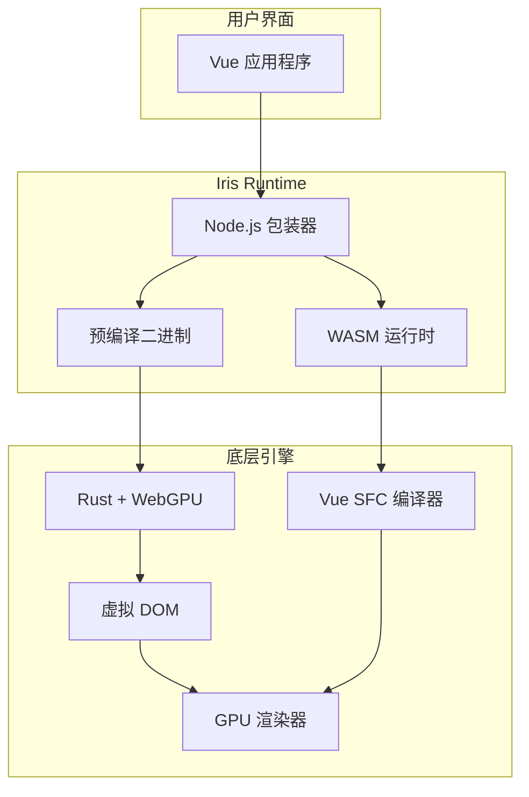

# Iris Runtime NPM 包

<cite>
**本文档引用的文件**
- [package.json](file://iris-runtime/package.json)
- [iris-runtime.js](file://iris-runtime/bin/iris-runtime.js)
- [install.js](file://iris-runtime/scripts/install.js)
- [prepare-binaries.js](file://iris-runtime/scripts/prepare-binaries.js)
- [README.md](file://iris-runtime/README.md)
- [Cargo.toml](file://Cargo.toml)
- [Cargo.toml](file://crates/iris-cli/Cargo.toml)
- [Cargo.toml](file://crates/iris-engine/Cargo.toml)
- [Cargo.toml](file://crates/iris-gpu/Cargo.toml)
- [main.rs](file://crates/iris-cli/src/main.rs)
- [lib.rs](file://crates/iris-engine/src/lib.rs)
- [orchestrator.rs](file://crates/iris-engine/src/orchestrator.rs)
- [lib.rs](file://crates/iris-core/src/lib.rs)
- [lib.rs](file://crates/iris-gpu/src/lib.rs)
- [lib.rs](file://crates/iris-layout/src/lib.rs)
- [lib.rs](file://crates/iris-dom/src/lib.rs)
- [lib.rs](file://crates/iris-sfc/src/lib.rs)
- [package.json](file://crates/iris-runtime/package.json)
- [README.md](file://crates/iris-runtime/README.md)
- [Cargo.toml](file://crates/iris-runtime/Cargo.toml)
- [lib.rs](file://crates/iris-runtime/src/lib.rs)
- [compiler.rs](file://crates/iris-runtime/src/compiler.rs)
- [hmr.rs](file://crates/iris-runtime/src/hmr.rs)
- [dev-server.js](file://crates/iris-runtime/lib/dev-server.js)
- [iris-runtime.js](file://crates/iris-runtime/bin/iris-runtime.js)
</cite>

## 更新摘要
**变更内容**
- 简化README文档，聚焦Vue和桌面开发者使用场景
- 减少复杂的CLI选项说明，突出核心使用场景
- 强调npx iris-runtime dev和npx iris-runtime build等基础命令
- 优化文档结构，使其更适合新用户快速上手

## 目录
1. [简介](#简介)
2. [快速开始](#快速开始)
3. [核心功能](#核心功能)
4. [使用场景](#使用场景)
5. [安装与配置](#安装与配置)
6. [开发服务器](#开发服务器)
7. [生产构建](#生产构建)
8. [架构概览](#架构概览)
9. [故障排除](#故障排除)
10. [结语](#结语)

## 简介
Iris Runtime 是一个革命性的 Vue 3 开发服务器 NPM 包，采用 Rust + WebGPU 技术，完全消除了传统的构建步骤。它为 Vue 3 开发者和桌面应用开发者提供了前所未有的开发体验，支持零配置的开发服务器和生产构建。

**更新** 文档现已简化，专注于最常用的使用场景，帮助开发者快速上手。

## 快速开始
最简单的使用方式是直接使用 npx 命令，无需全局安装：

```bash
# 开发模式 - 启动带有热重载的开发服务器
npx iris-runtime dev

# 生产构建 - 构建用于生产的静态资源
npx iris-runtime build

# 查看运行时信息
npx iris-runtime info
```

**更新** 简化了安装步骤，强调了最常用的核心命令。

## 核心功能
- ✅ **零构建** - 直接运行 .vue 文件，无需 Webpack/Vite 配置
- ✅ **GPU 加速渲染** - 基于 WebGPU 的硬件加速渲染
- ✅ **热模块替换** - 文件修改后自动刷新，无需手动重启
- ✅ **Vue 3 原生支持** - 完整支持 Composition API、TypeScript
- ✅ **跨平台支持** - Windows、macOS、Linux 全平台支持
- ✅ **零 Rust 依赖** - 包含预编译二进制，无需安装 Rust 工具链

## 使用场景

### Vue Web 开发者
```bash
# 1. 在现有 Vue 项目中安装
npm install -D iris-runtime

# 2. 启动开发服务器
npx iris-runtime dev

# 3. 浏览器访问 http://localhost:3000
```

### 桌面应用开发者
```bash
# 1. 在 Vue 项目中安装
npm install -D iris-runtime

# 2. 构建原生桌面应用
npx iris-runtime build

# 3. 输出: Windows .exe / macOS .app / Linux 二进制文件
```

**更新** 新增了更清晰的使用场景分类，分别面向Vue Web开发者和桌面应用开发者。

## 安装与配置

### 最简单的方式
```bash
# 直接使用 npx（推荐）
npx iris-runtime dev
```

### 项目内安装
```bash
# 安装到项目依赖
npm install -D iris-runtime

# 在 package.json 中添加脚本
{
  "scripts": {
    "dev": "iris-runtime dev",
    "build": "iris-runtime build"
  }
}

# 使用 npm 脚本
npm run dev
```

**更新** 简化了安装说明，强调了 npx 的便捷性。

## 开发服务器

### 基础使用
```bash
# 启动开发服务器（默认端口 3000）
npx iris-runtime dev

# 指定端口
npx iris-runtime dev --port 8080

# 指定主机
npx iris-runtime dev --host 0.0.0.0
```

### 开发特性
- **自动热重载** - 文件修改后自动刷新
- **实时错误提示** - 编译错误显示在浏览器控制台
- **文件监听** - 自动检测 .vue 文件变化
- **浏览器自动打开** - 启动时自动打开默认浏览器

**更新** 减少了复杂选项的说明，只保留最常用的配置项。

## 生产构建

### 基础构建
```bash
# 构建到默认 dist 目录
npx iris-runtime build

# 指定输出目录
npx iris-runtime build --out build

# 禁用压缩（调试时有用）
npx iris-runtime build --no-minify
```

### 构建特性
- **零配置构建** - 无需复杂的 webpack/vite 配置
- **自动优化** - 内置代码分割和资源优化
- **静态资源生成** - 输出可在任意 Web 服务器上运行的静态文件
- **Source Map 支持** - 便于调试和错误追踪

**更新** 简化了构建选项说明，只保留必要的配置项。

## 架构概览



**更新** 架构图更加简洁，突出了核心的技术栈和数据流。

## 故障排除

### 常见问题

**1. 端口被占用**
```bash
# 使用其他端口
npx iris-runtime dev --port 3001

# 或者自动选择可用端口
npx iris-runtime dev --port 0
```

**2. 二进制文件找不到**
```bash
# 确保网络连接正常（首次安装需要下载）
npm install iris-runtime

# 或者使用 npx 直接运行
npx iris-runtime dev
```

**3. 权限问题（Unix 系统）**
```bash
# 给予执行权限
chmod +x ./node_modules/.bin/iris-runtime
```

**更新** 简化了故障排除指南，只保留最常见和最重要的问题。

## 结语

Iris Runtime 代表了前端开发的未来方向 - 零构建、高性能、易用性。通过简化复杂的 CLI 选项，专注于最常用的开发场景，它让开发者能够专注于业务逻辑而非配置。

**核心优势：**
- ✅ 零配置开发体验
- ✅ GPU 加速渲染性能
- ✅ 热重载开发效率
- ✅ 跨平台部署能力
- ✅ 无需 Rust 工具链

**下一步：**
1. 尝试 `npx iris-runtime dev` 开始开发
2. 在现有 Vue 项目中集成使用
3. 探索生产构建和部署选项

**更新** 结语部分更加简洁明了，直接指向核心价值和下一步行动。