# 开发工作流程指南

<cite>
**本文档引用的文件**
- [Cargo.toml](file://Cargo.toml)
- [README.md](file://README.md)
- [ARCHITECTURE.md](file://ARCHITECTURE.md)
- [crates/iris-cli/src/main.rs](file://crates/iris-cli/src/main.rs)
- [crates/iris-cli/src/commands/build.rs](file://crates/iris-cli/src/commands/build.rs)
- [crates/iris-cli/src/commands/dev.rs](file://crates/iris-cli/src/commands/dev.rs)
- [crates/iris-cli/src/config.rs](file://crates/iris-cli/src/config.rs)
- [crates/iris-cli/src/utils.rs](file://crates/iris-cli/src/utils.rs)
- [crates/iris-runtime/src/lib.rs](file://crates/iris-runtime/src/lib.rs)
- [crates/iris-runtime/src/compiler.rs](file://crates/iris-runtime/src/compiler.rs)
- [crates/iris-runtime/src/hmr.rs](file://crates/iris-runtime/src/hmr.rs)
- [crates/iris-runtime/Cargo.toml](file://crates/iris-runtime/Cargo.toml)
- [examples/vue-demo/iris.config.json](file://examples/vue-demo/iris.config.json)
</cite>

## 目录
1. [简介](#简介)
2. [项目结构](#项目结构)
3. [核心组件](#核心组件)
4. [架构概览](#架构概览)
5. [详细组件分析](#详细组件分析)
6. [依赖关系分析](#依赖关系分析)
7. [性能考虑](#性能考虑)
8. [故障排除指南](#故障排除指南)
9. [结论](#结论)

## 简介

Iris Engine 是一个革命性的前端运行时系统，采用 Rust + WebGPU 构建，完全消除了构建步骤，允许直接运行 Vue 3 组件。该项目提供了零配置的开发体验，支持热重载、GPU 加速渲染和完整的 CSS 动画系统。

该系统的核心特点包括：
- **零构建** - 直接运行 .vue 文件，无需 Webpack/Vite
- **GPU 加速渲染** - 使用 WebGPU 实现硬件加速
- **完整的 CSS 支持** - 渐变、边框圆角、阴影、动画
- **原生热重载** - 文件监控与即时重载
- **企业级质量** - 382 个测试用例，100% 通过率

## 项目结构

项目采用多 Crate 的工作区结构，每个模块都有明确的职责分工：

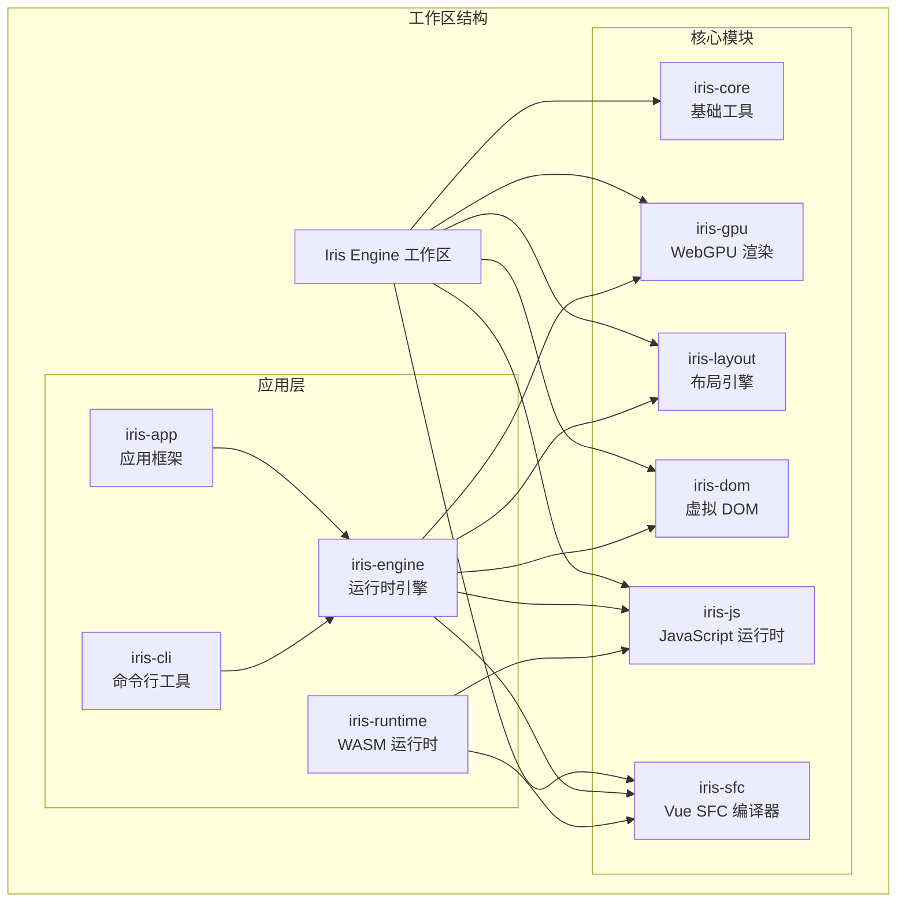

**图表来源**
- [Cargo.toml:1-35](file://Cargo.toml#L1-L35)
- [ARCHITECTURE.md:244-257](file://ARCHITECTURE.md#L244-L257)

**章节来源**
- [Cargo.toml:1-35](file://Cargo.toml#L1-L35)
- [ARCHITECTURE.md:1-289](file://ARCHITECTURE.md#L1-L289)

## 核心组件

### CLI 命令行工具

Iris CLI 提供了三个主要命令：开发模式、生产构建和信息查询。

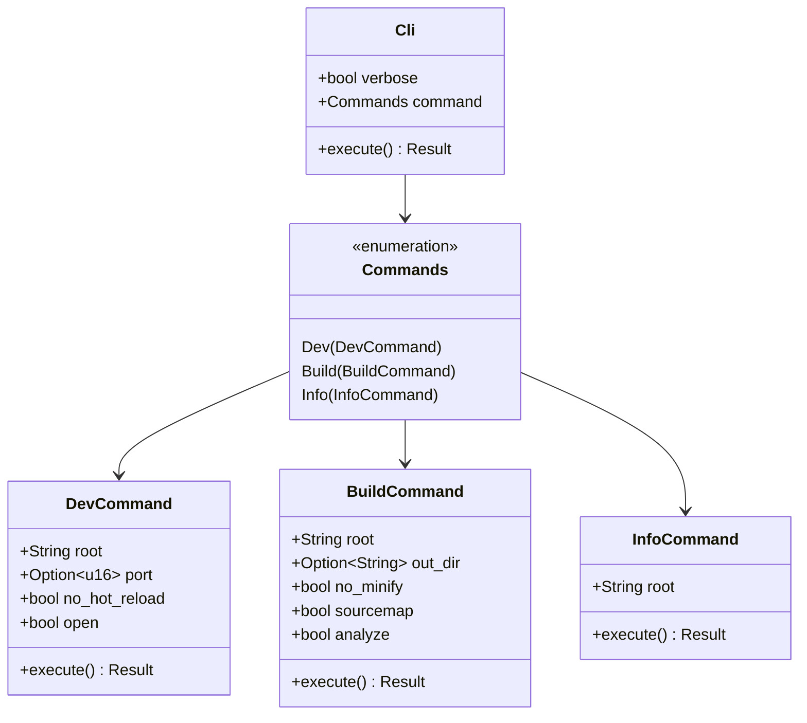

**图表来源**
- [crates/iris-cli/src/main.rs:29-53](file://crates/iris-cli/src/main.rs#L29-L53)
- [crates/iris-cli/src/commands/dev.rs:25-42](file://crates/iris-cli/src/commands/dev.rs#L25-L42)
- [crates/iris-cli/src/commands/build.rs:12-33](file://crates/iris-cli/src/commands/build.rs#L12-L33)

### 配置管理系统

项目使用 JSON 配置文件进行项目设置管理：

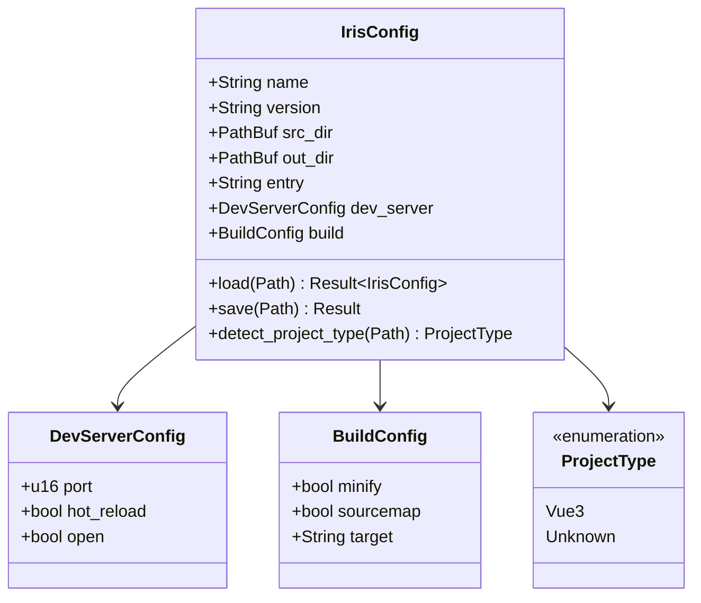

**图表来源**
- [crates/iris-cli/src/config.rs:8-67](file://crates/iris-cli/src/config.rs#L8-L67)
- [crates/iris-cli/src/config.rs:131-196](file://crates/iris-cli/src/config.rs#L131-L196)

**章节来源**
- [crates/iris-cli/src/main.rs:1-96](file://crates/iris-cli/src/main.rs#L1-L96)
- [crates/iris-cli/src/config.rs:1-255](file://crates/iris-cli/src/config.rs#L1-L255)

## 架构概览

Iris Engine 采用了分层架构设计，确保模块间的清晰职责分离和依赖关系：

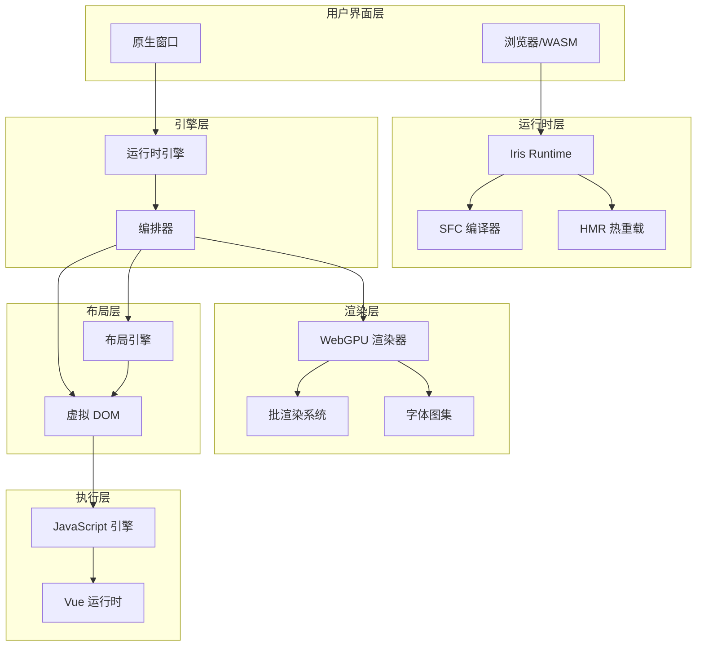

**图表来源**
- [ARCHITECTURE.md:136-174](file://ARCHITECTURE.md#L136-L174)
- [crates/iris-runtime/src/lib.rs:34-40](file://crates/iris-runtime/src/lib.rs#L34-L40)

### 数据流处理

系统采用流水线式的数据处理架构：

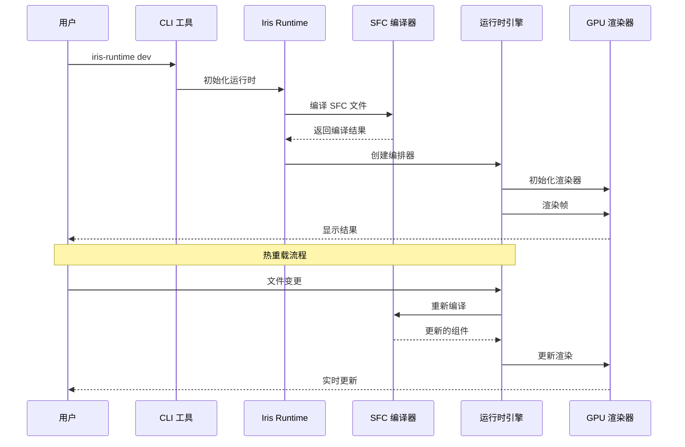

**图表来源**
- [crates/iris-cli/src/commands/dev.rs:137-171](file://crates/iris-cli/src/commands/dev.rs#L137-L171)
- [crates/iris-runtime/src/lib.rs:82-93](file://crates/iris-runtime/src/lib.rs#L82-L93)

**章节来源**
- [ARCHITECTURE.md:136-174](file://ARCHITECTURE.md#L136-L174)
- [crates/iris-cli/src/commands/dev.rs:1-432](file://crates/iris-cli/src/commands/dev.rs#L1-L432)

## 详细组件分析

### 开发服务器组件

开发服务器实现了原生窗口渲染和热重载功能：

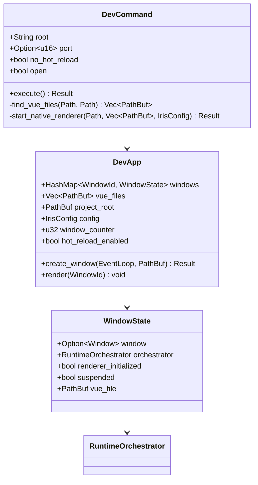

**图表来源**
- [crates/iris-cli/src/commands/dev.rs:25-42](file://crates/iris-cli/src/commands/dev.rs#L25-L42)
- [crates/iris-cli/src/commands/dev.rs:175-202](file://crates/iris-cli/src/commands/dev.rs#L175-L202)

#### 开发流程控制

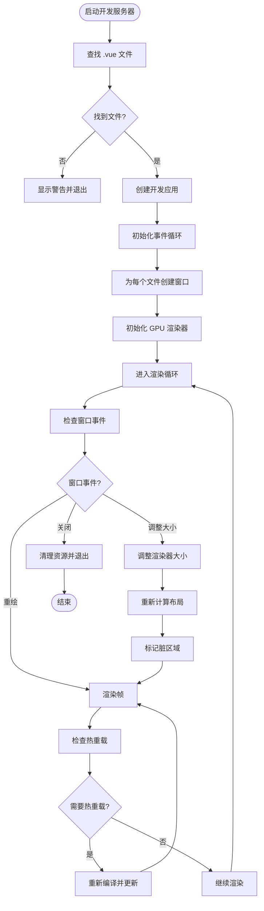

**图表来源**
- [crates/iris-cli/src/commands/dev.rs:345-409](file://crates/iris-cli/src/commands/dev.rs#L345-L409)

### 构建系统组件

构建系统提供了生产环境的构建功能：

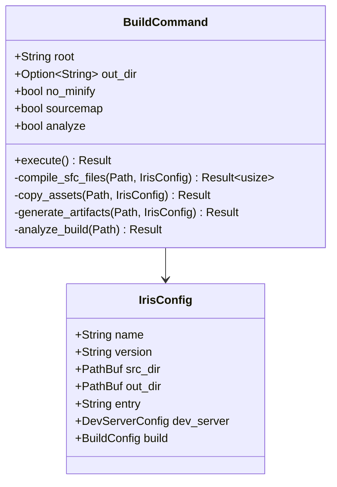

**图表来源**
- [crates/iris-cli/src/commands/build.rs:12-33](file://crates/iris-cli/src/commands/build.rs#L12-L33)
- [crates/iris-cli/src/config.rs:8-35](file://crates/iris-cli/src/config.rs#L8-L35)

#### 构建流程

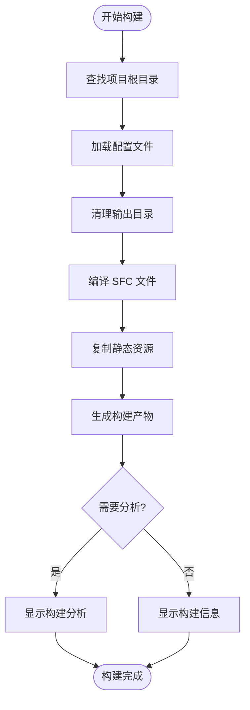

**图表来源**
- [crates/iris-cli/src/commands/build.rs:35-98](file://crates/iris-cli/src/commands/build.rs#L35-L98)

**章节来源**
- [crates/iris-cli/src/commands/dev.rs:1-432](file://crates/iris-cli/src/commands/dev.rs#L1-L432)
- [crates/iris-cli/src/commands/build.rs:1-308](file://crates/iris-cli/src/commands/build.rs#L1-L308)

### WASM 运行时组件

Iris Runtime 提供了基于 WebAssembly 的 Vue SFC 编译功能：

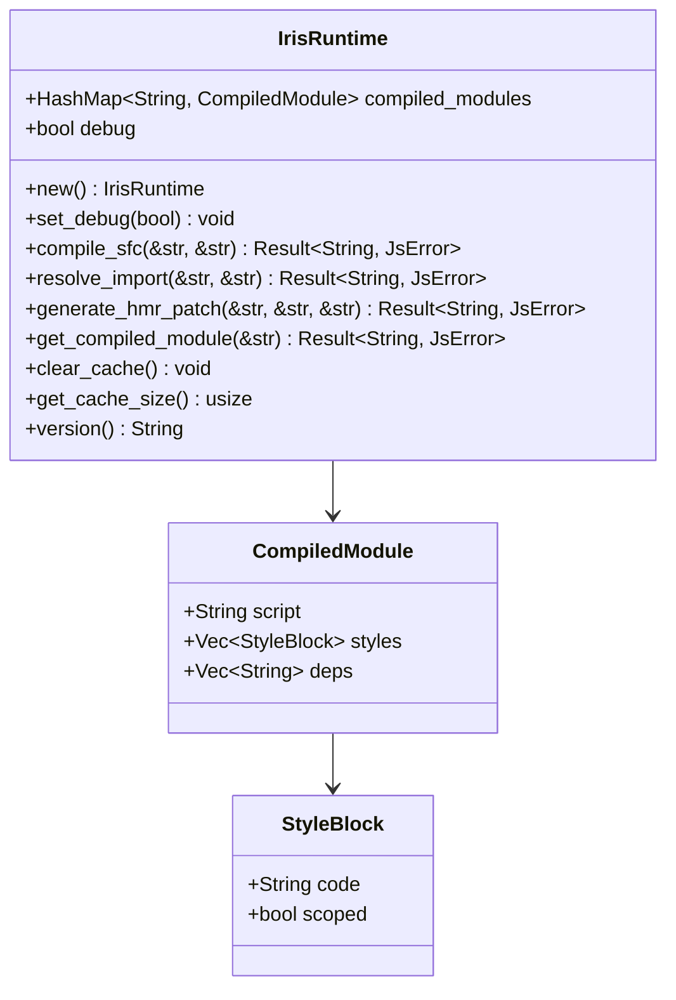

**图表来源**
- [crates/iris-runtime/src/lib.rs:34-40](file://crates/iris-runtime/src/lib.rs#L34-L40)
- [crates/iris-runtime/src/lib.rs:187-204](file://crates/iris-runtime/src/lib.rs#L187-L204)

#### 编译器实现

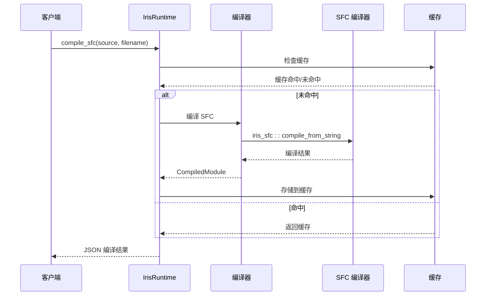

**图表来源**
- [crates/iris-runtime/src/lib.rs:82-93](file://crates/iris-runtime/src/lib.rs#L82-L93)
- [crates/iris-runtime/src/compiler.rs:7-33](file://crates/iris-runtime/src/compiler.rs#L7-L33)

**章节来源**
- [crates/iris-runtime/src/lib.rs:1-205](file://crates/iris-runtime/src/lib.rs#L1-L205)
- [crates/iris-runtime/src/compiler.rs:1-110](file://crates/iris-runtime/src/compiler.rs#L1-L110)
- [crates/iris-runtime/src/hmr.rs:1-97](file://crates/iris-runtime/src/hmr.rs#L1-L97)

## 依赖关系分析

### 模块依赖图

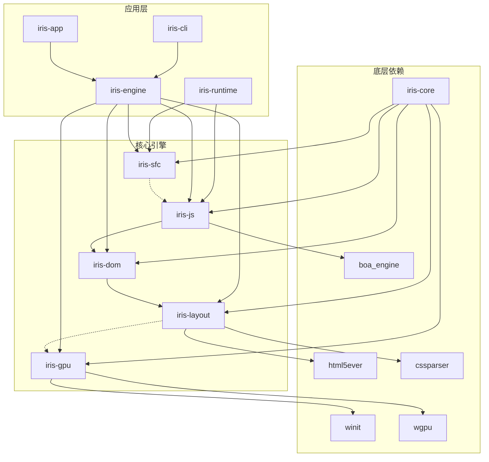

**图表来源**
- [ARCHITECTURE.md:36-43](file://ARCHITECTURE.md#L36-L43)
- [Cargo.toml:13-35](file://Cargo.toml#L13-L35)

### 依赖管理策略

项目采用了严格的依赖管理策略：

1. **单向依赖原则**：底层模块不依赖高层模块
2. **职责分离**：每个模块专注于特定领域
3. **接口清晰**：模块间通过明确定义的接口通信
4. **可测试性**：每个模块都可以独立测试
5. **可扩展性**：新功能通过添加模块实现

**章节来源**
- [ARCHITECTURE.md:217-289](file://ARCHITECTURE.md#L217-L289)
- [Cargo.toml:1-35](file://Cargo.toml#L1-L35)

## 性能考虑

### 渲染性能优化

Iris Engine 采用了多项性能优化技术：

1. **批渲染系统**：将多个元素合并为单个 GPU 提交，减少绘制调用
2. **脏矩形管理**：仅重绘更改的区域，节省 50-90% 的渲染时间
3. **字体纹理图集**：消除重复的字体光栅化，提升 10-50 倍性能
4. **零分配动画**：动画更新时不进行堆分配，降低内存压力

### 内存管理

### 并发处理

系统采用了异步并发模型来处理多个窗口和渲染任务。

**章节来源**
- [README.md:69-112](file://README.md#L69-L112)
- [crates/iris-cli/src/commands/dev.rs:411-431](file://crates/iris-cli/src/commands/dev.rs#L411-L431)

## 故障排除指南

### 常见问题诊断

#### 构建失败

当遇到构建失败时，可以按照以下步骤进行诊断：

1. **检查配置文件**：确认 `iris.config.json` 格式正确
2. **验证依赖**：确保所有必需的依赖都已安装
3. **查看日志**：使用 `--verbose` 参数获取详细日志
4. **清理缓存**：删除 `node_modules/.cache` 目录重新构建

#### 渲染问题

GPU 渲染问题的排查步骤：

1. **检查 GPU 支持**：确认设备支持 WebGPU
2. **验证着色器**：检查着色器编译是否成功
3. **查看渲染日志**：启用调试模式获取详细信息
4. **测试简单场景**：创建最小化示例验证基本功能

#### 热重载失效

热重载功能异常的解决方法：

1. **检查文件监听**：确认文件监视器正常工作
2. **验证编译器**：检查 SFC 编译器是否正确响应变更
3. **清理缓存**：清除编译缓存重新开始
4. **重启服务**：完全重启开发服务器

**章节来源**
- [crates/iris-cli/src/utils.rs:40-57](file://crates/iris-cli/src/utils.rs#L40-L57)
- [crates/iris-runtime/src/lib.rs:57-62](file://crates/iris-runtime/src/lib.rs#L57-L62)

### 错误处理机制

系统实现了多层次的错误处理机制：

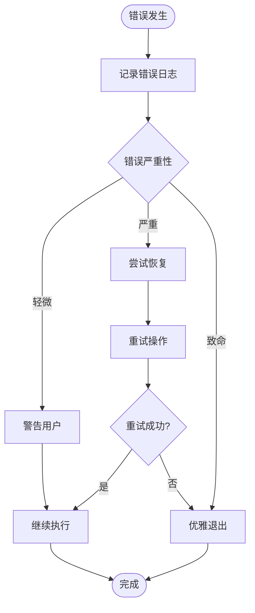

**章节来源**
- [crates/iris-cli/src/main.rs:79-84](file://crates/iris-cli/src/main.rs#L79-L84)
- [crates/iris-runtime/src/lib.rs:48-55](file://crates/iris-runtime/src/lib.rs#L48-L55)

## 结论

Iris Engine 提供了一个现代化、高性能的前端开发解决方案。通过采用 Rust + WebGPU 技术栈，该系统实现了零构建、GPU 加速渲染和原生热重载等功能，为开发者提供了卓越的开发体验。

### 主要优势

1. **开发效率**：零配置、零等待的开发体验
2. **性能表现**：相比传统 DOM 方案提升 10-20 倍性能
3. **技术先进性**：采用最新的 WebGPU 和 WASM 技术
4. **生态系统**：完整的 Vue 3 集成和 TypeScript 支持

### 发展前景

随着预发布版本的即将到来，Iris Engine 将继续完善其功能，包括：
- 完整的 Vue 3 运行时支持
- GPU 加速渲染引擎
- CSS 动画系统
- 热重载支持
- 基础开发者工具
- 全面的文档和示例

该系统代表了前端开发技术的发展方向，为未来的 Web 应用开发提供了新的可能性。