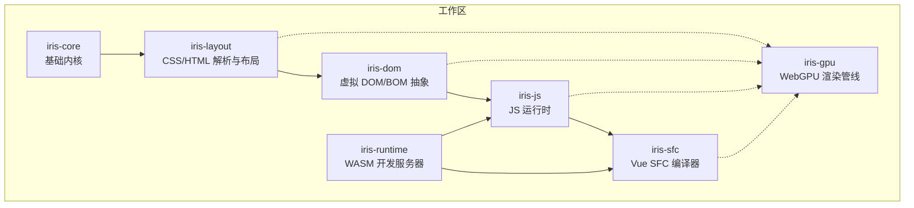
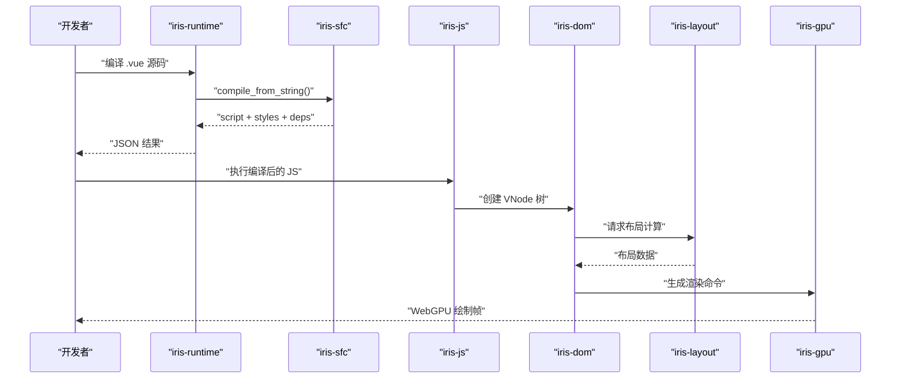
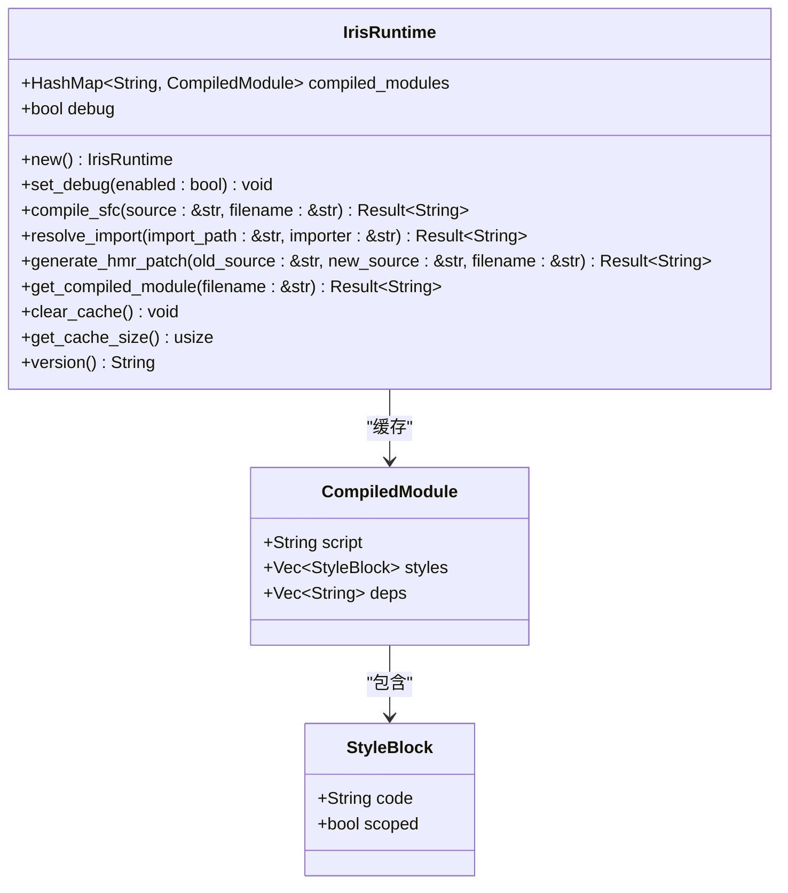
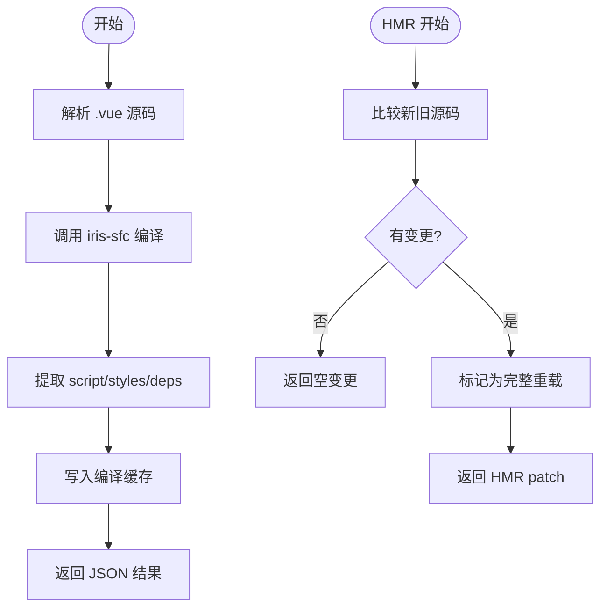
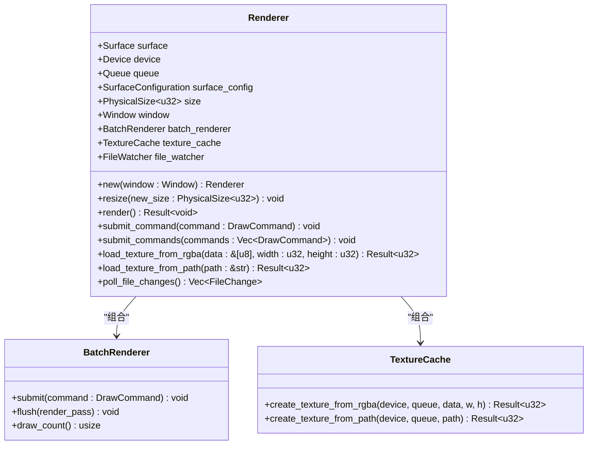
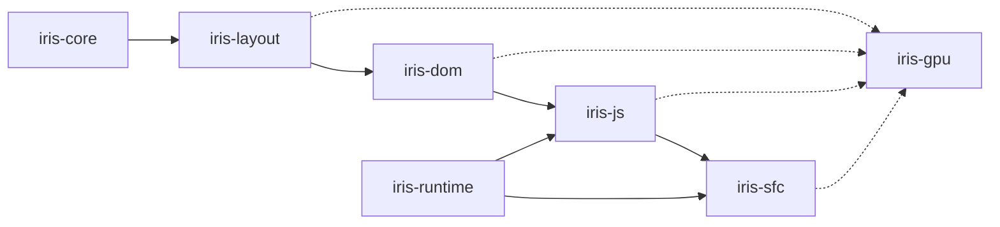

# 开发指南

<cite>
**本文档引用的文件**
- [Cargo.toml](file://Cargo.toml)
- [README.md](file://README.md)
- [ARCHITECTURE.md](file://ARCHITECTURE.md)
- [crates/iris-runtime/README.md](file://crates/iris-runtime/README.md)
- [crates/iris-runtime/DEVELOPMENT.md](file://crates/iris-runtime/DEVELOPMENT.md)
- [crates/iris-runtime/src/lib.rs](file://crates/iris-runtime/src/lib.rs)
- [crates/iris-runtime/src/compiler.rs](file://crates/iris-runtime/src/compiler.rs)
- [crates/iris-runtime/src/hmr.rs](file://crates/iris-runtime/src/hmr.rs)
- [crates/iris-runtime/package.json](file://crates/iris-runtime/package.json)
- [crates/iris-runtime/bin/iris-runtime.js](file://crates/iris-runtime/bin/iris-runtime.js)
- [crates/iris-core/src/lib.rs](file://crates/iris-core/src/lib.rs)
- [crates/iris-gpu/src/lib.rs](file://crates/iris-gpu/src/lib.rs)
- [crates/iris-layout/src/lib.rs](file://crates/iris-layout/src/lib.rs)
- [crates/iris-dom/src/lib.rs](file://crates/iris-dom/src/lib.rs)
- [crates/iris-js/src/lib.rs](file://crates/iris-js/src/lib.rs)
</cite>

## 目录
1. [简介](#简介)
2. [项目结构](#项目结构)
3. [核心组件](#核心组件)
4. [架构总览](#架构总览)
5. [详细组件分析](#详细组件分析)
6. [依赖关系分析](#依赖关系分析)
7. [性能考虑](#性能考虑)
8. [故障排除指南](#故障排除指南)
9. [结论](#结论)
10. [附录](#附录)

## 简介
Iris Engine 是一个基于 Rust + WebGPU 的零构建前端运行时，能够直接运行 Vue 3 组件，提供零等待的开发体验与卓越的渲染性能。项目采用多 Crate 分层架构，核心模块包括：iris-core（基础内核）、iris-gpu（WebGPU 渲染）、iris-layout（CSS 布局）、iris-dom（虚拟 DOM/BOM 抽象）、iris-js（JavaScript 运行时）、iris-sfc（Vue SFC 编译器）以及 iris-runtime（WASM 开发服务器）。Iris 的目标是消除传统前端构建步骤，提供即时热重载、GPU 加速渲染与完善的 CSS/动画支持。

**章节来源**
- [README.md:1-485](file://README.md#L1-L485)

## 项目结构
仓库采用工作区（workspace）组织，根目录的 Cargo.toml 声明了所有子 Crate，并统一管理依赖与版本。核心模块按职责划分，形成自底向上的单向依赖链：iris-core → iris-layout → iris-dom → iris-js → iris-sfc；iris-gpu 独立于布局引擎，仅接收渲染命令。

**图表来源**
- [Cargo.toml:1-35](file://Cargo.toml#L1-L35)
- [ARCHITECTURE.md:36-43](file://ARCHITECTURE.md#L36-L43)

**章节来源**
- [Cargo.toml:1-35](file://Cargo.toml#L1-L35)
- [ARCHITECTURE.md:1-289](file://ARCHITECTURE.md#L1-L289)

## 核心组件
- iris-core：提供跨平台窗口管理、事件循环抽象、Tokio 异步运行时与通用工具，作为所有上层模块的基础。
- iris-gpu：封装 wgpu 实例、渲染管线、批渲染系统、字体图集与纹理缓存，实现硬件加速绘制。
- iris-layout：HTML/CSS 解析、样式计算、盒模型与 Flex/Grid/浮动/表格布局，输出布局数据。
- iris-dom：虚拟 DOM 树、事件系统（EventDispatcher）、BOM API（Window/Document）模拟，不关心具体渲染。
- iris-js：基于 QuickJS 的 JS 运行时，注入 DOM API 与 Vue 运行时，支持 ESM 模块系统。
- iris-sfc：Vue 单文件组件编译器，解析 template/script/style，生成 JS 代码与样式块。
- iris-runtime：WASM 开发服务器，提供 Vue SFC 编译、模块解析与热重载（HMR）能力。

**章节来源**
- [crates/iris-core/src/lib.rs:1-167](file://crates/iris-core/src/lib.rs#L1-L167)
- [crates/iris-gpu/src/lib.rs:1-605](file://crates/iris-gpu/src/lib.rs#L1-L605)
- [crates/iris-layout/src/lib.rs:1-84](file://crates/iris-layout/src/lib.rs#L1-L84)
- [crates/iris-dom/src/lib.rs:1-48](file://crates/iris-dom/src/lib.rs#L1-L48)
- [crates/iris-js/src/lib.rs:1-46](file://crates/iris-js/src/lib.rs#L1-L46)
- [crates/iris-runtime/README.md:1-148](file://crates/iris-runtime/README.md#L1-L148)

## 架构总览
Iris 的渲染与执行链路如下：
1. SFC 编译：iris-runtime 调用 iris-sfc 将 .vue 文件编译为 JS 代码与样式块。
2. JS 执行：iris-js 执行编译后的 JS，创建 Vue 组件实例并生成虚拟 DOM。
3. DOM 更新：iris-dom 应用 VNode 差分算法，结合 iris-layout 的布局计算生成渲染命令。
4. GPU 渲染：iris-gpu 接收渲染命令，通过批渲染系统合并绘制，提交至 WebGPU。

**图表来源**
- [crates/iris-runtime/src/lib.rs:82-93](file://crates/iris-runtime/src/lib.rs#L82-L93)
- [crates/iris-runtime/src/compiler.rs:6-33](file://crates/iris-runtime/src/compiler.rs#L6-L33)
- [crates/iris-gpu/src/lib.rs:400-523](file://crates/iris-gpu/src/lib.rs#L400-L523)

**章节来源**
- [ARCHITECTURE.md:136-173](file://ARCHITECTURE.md#L136-L173)

## 详细组件分析

### iris-runtime（WASM 开发服务器）
iris-runtime 提供基于 WebAssembly 的 Vue SFC 编译与热重载能力，CLI 入口通过 Node.js 启动开发服务器，内部使用 WASM 模块进行编译与 HMR。

**图表来源**
- [crates/iris-runtime/src/lib.rs:34-178](file://crates/iris-runtime/src/lib.rs#L34-L178)
- [crates/iris-runtime/src/lib.rs:186-205](file://crates/iris-runtime/src/lib.rs#L186-L205)

编译流程与 HMR 差异检测：

**图表来源**
- [crates/iris-runtime/src/compiler.rs:6-33](file://crates/iris-runtime/src/compiler.rs#L6-L33)
- [crates/iris-runtime/src/hmr.rs:30-69](file://crates/iris-runtime/src/hmr.rs#L30-L69)

**章节来源**
- [crates/iris-runtime/src/lib.rs:1-205](file://crates/iris-runtime/src/lib.rs#L1-L205)
- [crates/iris-runtime/src/compiler.rs:1-110](file://crates/iris-runtime/src/compiler.rs#L1-L110)
- [crates/iris-runtime/src/hmr.rs:1-97](file://crates/iris-runtime/src/hmr.rs#L1-L97)
- [crates/iris-runtime/bin/iris-runtime.js:1-72](file://crates/iris-runtime/bin/iris-runtime.js#L1-L72)
- [crates/iris-runtime/package.json:1-52](file://crates/iris-runtime/package.json#L1-L52)

### iris-gpu（WebGPU 渲染管线）
iris-gpu 封装 wgpu 实例、渲染管线、批渲染系统与纹理缓存，提供统一的每帧渲染接口。其设计强调批处理与脏矩形优化，减少绘制调用次数并提升性能。

**图表来源**
- [crates/iris-gpu/src/lib.rs:86-599](file://crates/iris-gpu/src/lib.rs#L86-L599)

**章节来源**
- [crates/iris-gpu/src/lib.rs:1-605](file://crates/iris-gpu/src/lib.rs#L1-L605)

### iris-layout（CSS 布局引擎）
iris-layout 负责 HTML/CSS 解析、样式计算与布局计算，支持 Flex、Grid、浮动与表格布局，并提供布局缓存以优化性能。

**章节来源**
- [crates/iris-layout/src/lib.rs:1-84](file://crates/iris-layout/src/lib.rs#L1-L84)

### iris-dom（虚拟 DOM/BOM 抽象）
iris-dom 管理虚拟 DOM 树与事件系统，不关心具体渲染细节，通过与布局引擎协作生成渲染命令。

**章节来源**
- [crates/iris-dom/src/lib.rs:1-48](file://crates/iris-dom/src/lib.rs#L1-L48)

### iris-js（JavaScript 运行时）
iris-js 基于 QuickJS 提供 JS 执行环境，注入 DOM API 与 Vue 运行时，支持 ESM 模块系统与 TypeScript 编译。

**章节来源**
- [crates/iris-js/src/lib.rs:1-46](file://crates/iris-js/src/lib.rs#L1-L46)

### iris-core（基础内核）
iris-core 提供跨平台窗口管理、事件循环抽象与 Tokio 异步运行时，是所有上层模块的基础。

**章节来源**
- [crates/iris-core/src/lib.rs:1-167](file://crates/iris-core/src/lib.rs#L1-L167)

## 依赖关系分析
Iris 采用严格的单向依赖设计，避免循环依赖，确保模块职责清晰、可测试性强、易于扩展。

**图表来源**
- [ARCHITECTURE.md:36-43](file://ARCHITECTURE.md#L36-L43)
- [Cargo.toml:13-26](file://Cargo.toml#L13-L26)

**章节来源**
- [ARCHITECTURE.md:217-224](file://ARCHITECTURE.md#L217-L224)
- [Cargo.toml:1-35](file://Cargo.toml#L1-L35)

## 性能考虑
- 批渲染系统：将大量绘制命令合并为一次 GPU 提交，显著降低绘制调用次数。
- 字体图集与纹理缓存：避免重复光栅化与上传，提升文本与图片渲染效率。
- 布局缓存：对样式与布局计算结果进行缓存，减少重复计算。
- 零构建与即时编译：开发阶段通过 WASM 实现快速编译与热重载，缩短反馈周期。
- 异步与并发：基于 Tokio 的多线程运行时，合理拆分 CPU/GPU 任务，提升吞吐。

**章节来源**
- [README.md:69-112](file://README.md#L69-L112)
- [crates/iris-gpu/src/lib.rs:400-523](file://crates/iris-gpu/src/lib.rs#L400-L523)

## 故障排除指南
- WASM 编译失败：确认已安装 wasm32-unknown-unknown 目标与 wasm-pack。
- WASM 文件过大：使用 release 模式构建并启用优化配置。
- 热重载不生效：检查 iris-runtime CLI 参数与浏览器连接状态。
- 渲染异常：验证 WebGPU 兼容性与驱动版本，检查批渲染命令合法性。
- 依赖解析问题：确认模块导入路径解析逻辑与默认扩展名处理。

**章节来源**
- [crates/iris-runtime/DEVELOPMENT.md:342-371](file://crates/iris-runtime/DEVELOPMENT.md#L342-L371)
- [crates/iris-runtime/bin/iris-runtime.js:18-52](file://crates/iris-runtime/bin/iris-runtime.js#L18-L52)

## 结论
Iris Engine 通过清晰的模块化架构与高效的渲染管线，实现了零构建、GPU 加速与完善的前端开发体验。iris-runtime 作为 WASM 开发服务器，提供了快速编译与热重载能力；底层的 iris-gpu、iris-layout、iris-dom、iris-js 等模块各司其职，共同构成高性能的运行时系统。建议开发者遵循单向依赖与职责单一的设计原则，在新增功能时优先考虑模块边界与接口契约。

## 附录
- 快速开始：安装 iris-runtime 后，使用 npx iris-runtime dev 即可启动开发服务器。
- 开发流程：修改 Rust/WASM 代码 → 编译 WASM → 本地测试 → 发布 npm 包。
- 性能基准：相比传统 DOM 方案，Iris 在首帧、批量更新与内存占用方面具有数量级优势。

**章节来源**
- [README.md:313-362](file://README.md#L313-L362)
- [crates/iris-runtime/DEVELOPMENT.md:27-108](file://crates/iris-runtime/DEVELOPMENT.md#L27-L108)