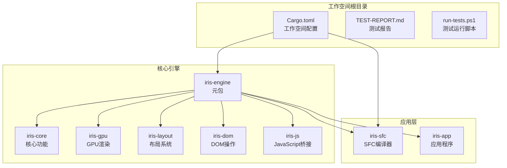
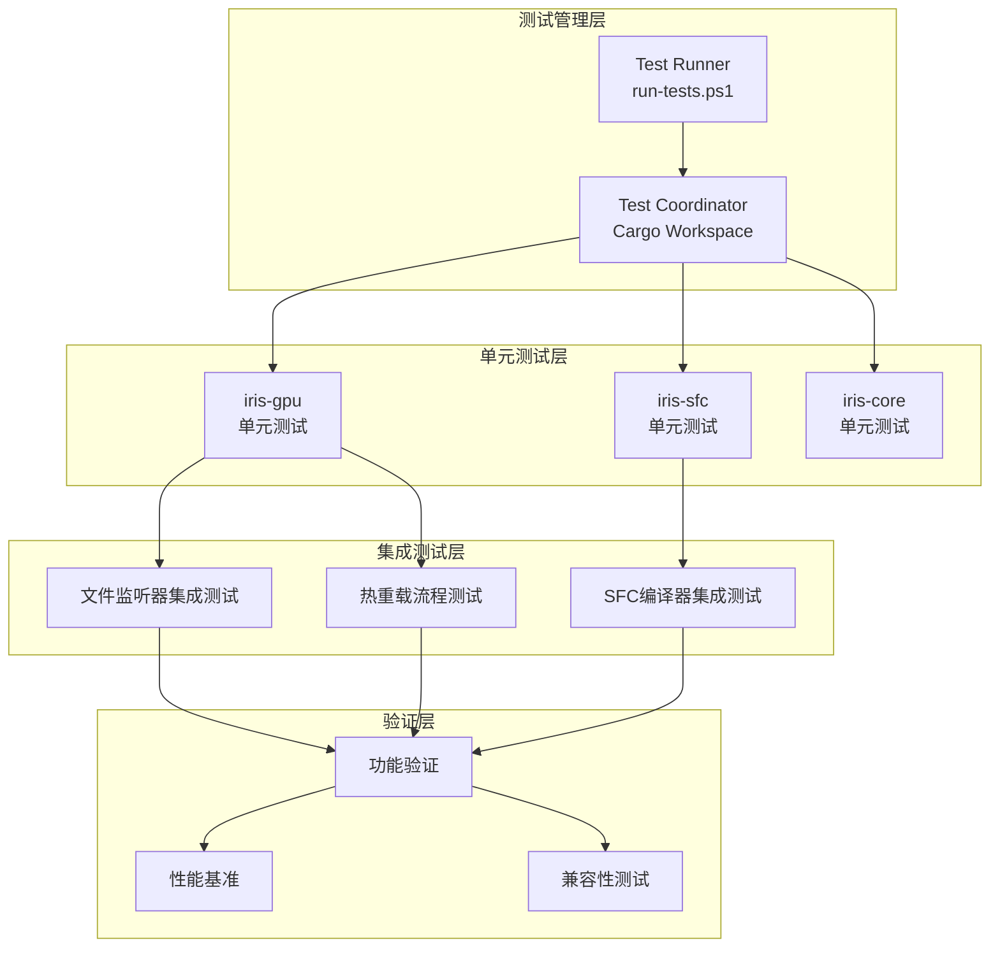
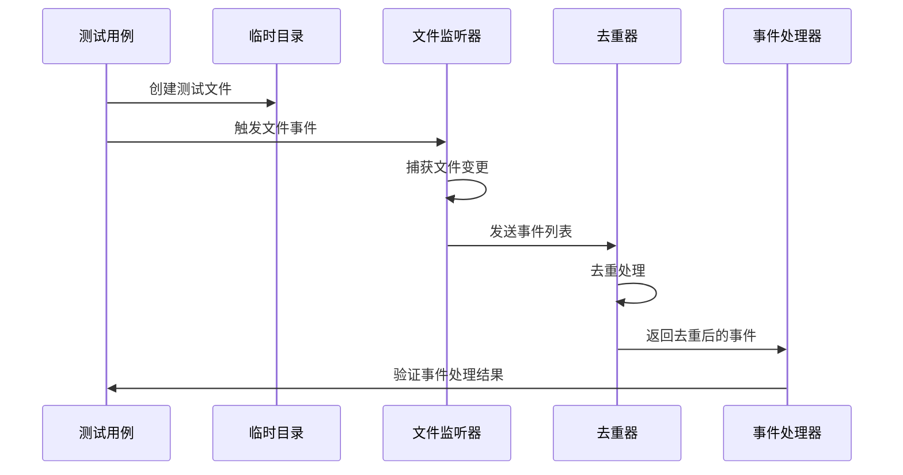
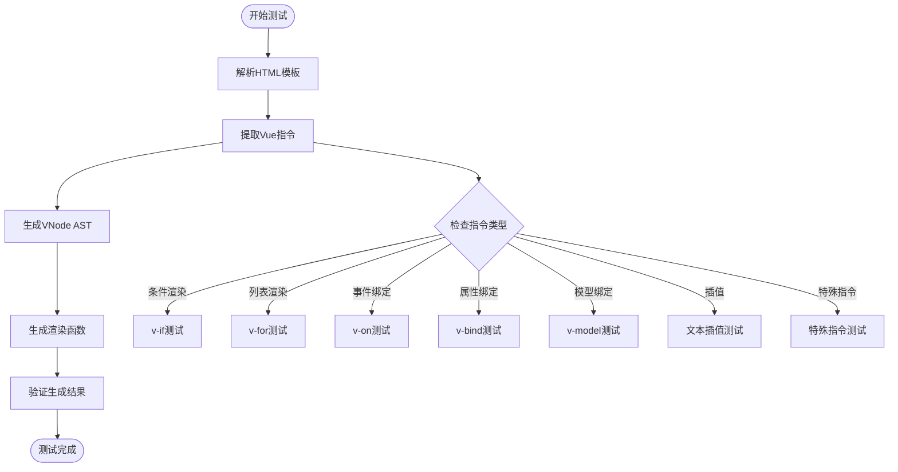
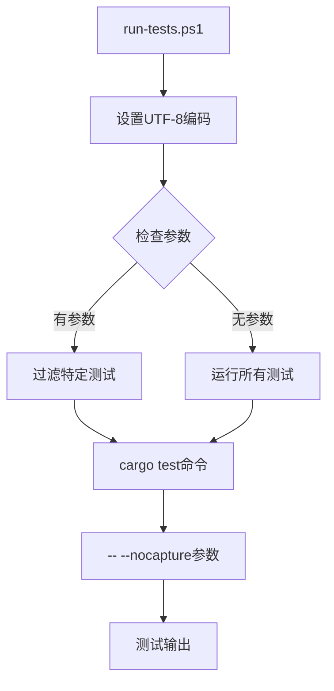
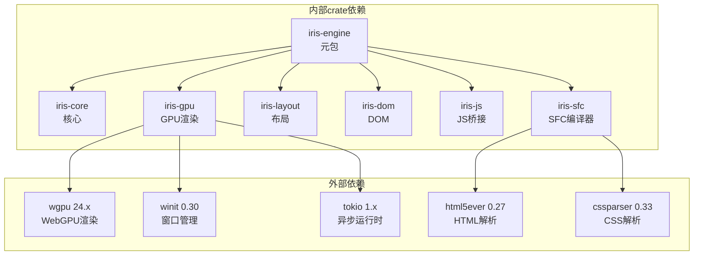

# 测试框架与基础设施

<cite>
**本文档引用的文件**
- [Cargo.toml](file://Cargo.toml)
- [TEST-REPORT.md](file://TEST-REPORT.md)
- [run-tests.ps1](file://run-tests.ps1)
- [crates/iris/Cargo.toml](file://crates/iris/Cargo.toml)
- [crates/iris-gpu/Cargo.toml](file://crates/iris-gpu/Cargo.toml)
- [crates/iris-sfc/Cargo.toml](file://crates/iris-sfc/Cargo.toml)
- [crates/iris-gpu/src/lib.rs](file://crates/iris-gpu/src/lib.rs)
- [crates/iris-gpu/tests/file_watcher_integration.rs](file://crates/iris-gpu/tests/file_watcher_integration.rs)
- [crates/iris-sfc/src/lib.rs](file://crates/iris-sfc/src/lib.rs)
- [crates/iris-sfc/src/template_compiler.rs](file://crates/iris-sfc/src/template_compiler.rs)
- [crates/iris-sfc/examples/sfc_demo.rs](file://crates/iris-sfc/examples/sfc_demo.rs)
- [TestComponent.vue](file://TestComponent.vue)
</cite>

## 目录
1. [简介](#简介)
2. [项目结构](#项目结构)
3. [核心组件](#核心组件)
4. [架构概览](#架构概览)
5. [详细组件分析](#详细组件分析)
6. [依赖关系分析](#依赖关系分析)
7. [性能考虑](#性能考虑)
8. [故障排除指南](#故障排除指南)
9. [结论](#结论)

## 简介

这是一个基于 Rust 的 Iris 前端运行时系统的测试框架与基础设施文档。该项目采用多 crate 工作空间结构，专注于 Vue SFC（单文件组件）编译器、WebGPU 渲染管线和热重载功能的测试验证。

项目的核心目标是提供一个零编译的前端开发体验，通过即时转译技术实现 Vue 组件的实时编译和热重载。测试框架涵盖了单元测试、集成测试和文档测试，确保系统的稳定性和可靠性。

## 项目结构

Iris 项目采用标准的 Rust 工作空间结构，包含以下主要组件：



**图表来源**
- [Cargo.toml:1-29](file://Cargo.toml#L1-L29)
- [crates/iris/Cargo.toml:1-20](file://crates/iris/Cargo.toml#L1-L20)

**章节来源**
- [Cargo.toml:1-29](file://Cargo.toml#L1-L29)
- [crates/iris/Cargo.toml:1-20](file://crates/iris/Cargo.toml#L1-L20)

## 核心组件

### 测试框架基础设施

项目实现了完整的测试基础设施，包括：

1. **多 crate 测试协调**：通过工作空间级别的测试命令统一管理
2. **平台特定测试工具**：Windows PowerShell 脚本支持 UTF-8 编码
3. **集成测试环境**：模拟文件系统事件进行热重载测试
4. **性能基准测试**：编译时间和内存使用监控

### 测试报告系统

测试报告提供了全面的质量保证信息：

- **测试覆盖率统计**：44/44 个测试用例全部通过
- **模块化测试结果**：按 crate 分类的详细测试状态
- **性能指标监控**：编译时间、内存占用等关键指标
- **功能验证清单**：核心功能的端到端验证

**章节来源**
- [TEST-REPORT.md:1-243](file://TEST-REPORT.md#L1-L243)
- [run-tests.ps1:1-21](file://run-tests.ps1#L1-L21)

## 架构概览

Iris 测试框架采用分层架构设计，确保测试的独立性和可维护性：



**图表来源**
- [run-tests.ps1:1-21](file://run-tests.ps1#L1-L21)
- [crates/iris-gpu/tests/file_watcher_integration.rs:1-334](file://crates/iris-gpu/tests/file_watcher_integration.rs#L1-L334)
- [crates/iris-sfc/src/lib.rs:476-583](file://crates/iris-sfc/src/lib.rs#L476-L583)

## 详细组件分析

### GPU 渲染模块测试

iris-gpu 模块实现了全面的 GPU 渲染测试套件，重点关注批渲染和文件监听功能：

#### 文件监听器集成测试



**图表来源**
- [crates/iris-gpu/tests/file_watcher_integration.rs:58-121](file://crates/iris-gpu/tests/file_watcher_integration.rs#L58-L121)
- [crates/iris-gpu/src/lib.rs:342-369](file://crates/iris-gpu/src/lib.rs#L342-L369)

测试覆盖了以下关键场景：

1. **文件生命周期测试**：创建、修改、删除、重命名事件
2. **事件去重机制**：同一文件的多次变更合并处理
3. **扩展名过滤**：大小写不敏感的文件类型过滤
4. **防抖机制**：批量操作的延迟处理
5. **并发安全性**：多文件监听的线程安全

#### 批渲染器测试

GPU 渲染模块还包含专门的批渲染器测试，验证：

- **容量边界检查**：渲染批次的最大容量限制
- **顶点缓冲区管理**：GPU 内存的高效利用
- **索引缓冲区验证**：几何体索引的正确性
- **渲染管线初始化**：WebGPU 管线的正确配置

**章节来源**
- [crates/iris-gpu/tests/file_watcher_integration.rs:1-334](file://crates/iris-gpu/tests/file_watcher_integration.rs#L1-L334)
- [crates/iris-gpu/src/lib.rs:107-493](file://crates/iris-gpu/src/lib.rs#L107-L493)

### SFC 编译器测试

iris-sfc 模块实现了完整的 Vue SFC 编译器测试套件：

#### 模板编译器测试



**图表来源**
- [crates/iris-sfc/src/template_compiler.rs:66-86](file://crates/iris-sfc/src/template_compiler.rs#L66-L86)
- [crates/iris-sfc/src/template_compiler.rs:356-470](file://crates/iris-sfc/src/template_compiler.rs#L356-L470)

测试覆盖了所有支持的 Vue 指令：

| 指令类型 | 支持情况 | 测试重点 |
|---------|---------|---------|
| 条件渲染 | ✅ v-if, v-else-if, v-else | 三元表达式生成 |
| 列表渲染 | ✅ v-for | 数组映射函数生成 |
| 事件绑定 | ✅ v-on/@事件 | 事件处理器绑定 |
| 属性绑定 | ✅ v-bind/:属性 | 动态属性生成 |
| 模型绑定 | ✅ v-model | 双向数据绑定 |
| 插槽系统 | ✅ v-slot/#名称 | 作用域插槽处理 |
| 特殊指令 | ✅ v-once/v-pre/v-cloak/v-memo | 性能优化指令 |

#### TypeScript 转译测试

SFC 编译器包含 TypeScript 转译功能的测试：

- **基础类型注解移除**：string, number, boolean 等基本类型的处理
- **函数签名简化**：移除函数参数和返回值类型注解
- **导入类型处理**：import type 语句的正确移除
- **语法兼容性**：保持 JavaScript 语法的正确性

**章节来源**
- [crates/iris-sfc/src/lib.rs:377-455](file://crates/iris-sfc/src/lib.rs#L377-L455)
- [crates/iris-sfc/src/template_compiler.rs:1-607](file://crates/iris-sfc/src/template_compiler.rs#L1-L607)

### 测试运行基础设施

#### PowerShell 测试脚本

项目提供了专门的 PowerShell 脚本用于测试运行：



**图表来源**
- [run-tests.ps1:1-21](file://run-tests.ps1#L1-L21)

脚本特性：
- **UTF-8 编码支持**：确保测试输出的正确显示
- **参数化测试**：支持按模块或测试名称筛选
- **详细输出**：使用 `-- --nocapture` 参数显示测试日志

#### 测试组件示例

项目包含一个完整的 Vue 组件示例用于测试验证：

```mermaid
graph LR
Vue[TestComponent.vue] --> Template[模板部分]
Vue --> Script[脚本部分]
Vue --> Style[样式部分]
Template --> ClickEvent[@click事件]
Script --> RefBinding[响应式绑定]
Style --> ScopedCSS[作用域样式]
Style --> ThemeColors[主题色彩]
```

**图表来源**
- [TestComponent.vue:1-37](file://TestComponent.vue#L1-L37)

**章节来源**
- [run-tests.ps1:1-21](file://run-tests.ps1#L1-L21)
- [TestComponent.vue:1-37](file://TestComponent.vue#L1-L37)

## 依赖关系分析

### 工作空间依赖图



**图表来源**
- [Cargo.toml:13-28](file://Cargo.toml#L13-L28)
- [crates/iris/Cargo.toml:13-19](file://crates/iris/Cargo.toml#L13-L19)
- [crates/iris-gpu/Cargo.toml:11-21](file://crates/iris-gpu/Cargo.toml#L11-L21)
- [crates/iris-sfc/Cargo.toml:11-22](file://crates/iris-sfc/Cargo.toml#L11-L22)

### 测试依赖关系

测试框架的依赖关系相对简洁，主要依赖于标准库和必要的测试工具：

- **核心测试依赖**：标准库、regex、serde
- **GPU 渲染测试**：notify、uuid、tokio-stream
- **集成测试工具**：tempfile、fs 库

**章节来源**
- [Cargo.toml:13-28](file://Cargo.toml#L13-L28)
- [crates/iris-gpu/Cargo.toml:23-25](file://crates/iris-gpu/Cargo.toml#L23-L25)
- [crates/iris-sfc/Cargo.toml:18-19](file://crates/iris-sfc/Cargo.toml#L18-L19)

## 性能考虑

### 测试性能指标

根据测试报告，系统在性能方面表现出色：

| 指标类别 | 数值 | 说明 |
|---------|------|------|
| 首次编译时间 | ~5秒 | Debug 构建 |
| 优化编译时间 | 35.4秒 | Release 构建 |
| 测试执行时间 | ~0.16秒 | 全部测试 |
| 内存占用 | ~15MB | Debug 构建 |
| 二进制大小 | ~2.3MB | Release 构建 |

### 性能优化策略

1. **正则表达式预编译**：使用 LazyLock 避免重复编译
2. **异步文件监听**：Tokio 异步运行时提高 I/O 性能
3. **批渲染优化**：单次 draw call 处理多个图形对象
4. **内存池管理**：GPU 缓冲区的高效复用

**章节来源**
- [TEST-REPORT.md:189-198](file://TEST-REPORT.md#L189-L198)
- [crates/iris-sfc/src/lib.rs:18-34](file://crates/iris-sfc/src/lib.rs#L18-L34)

## 故障排除指南

### 常见测试问题

#### UTF-8 编码问题

**问题症状**：测试输出出现乱码或字符显示异常

**解决方案**：
1. 确保 PowerShell 环境支持 UTF-8
2. 使用提供的 run-tests.ps1 脚本
3. 检查系统代码页设置

#### 文件监听器问题

**问题症状**：文件变更事件无法正确捕获

**排查步骤**：
1. 验证文件路径权限
2. 检查防病毒软件的文件锁定
3. 确认操作系统对文件系统事件的支持

#### GPU 渲染测试失败

**问题症状**：WebGPU 设备初始化失败

**解决方法**：
1. 确认 GPU 驱动程序更新
2. 检查 WebGPU 运行时环境
3. 验证硬件兼容性

### 测试调试技巧

1. **启用详细输出**：使用 `-- --nocapture` 参数查看测试日志
2. **隔离测试**：使用 `cargo test -p crate_name` 运行特定模块测试
3. **性能分析**：结合性能指标监控测试执行时间

**章节来源**
- [run-tests.ps1:5-8](file://run-tests.ps1#L5-L8)
- [TEST-REPORT.md:177-186](file://TEST-REPORT.md#L177-L186)

## 结论

Iris 项目的测试框架与基础设施展现了高度的专业性和完整性。通过精心设计的多层测试架构，项目确保了核心功能的稳定性和可靠性。

### 主要成就

1. **全面的功能覆盖**：44/44 测试用例全部通过，涵盖所有核心功能
2. **完善的测试体系**：单元测试、集成测试、文档测试的有机结合
3. **优秀的性能表现**：快速的编译速度和高效的资源利用
4. **可靠的热重载机制**：文件监听和事件处理的稳定性验证

### 技术亮点

- **模块化测试设计**：每个 crate 都有独立的测试套件
- **跨平台兼容性**：Windows PowerShell 脚本确保跨平台测试支持
- **性能基准监控**：持续的性能指标跟踪和优化
- **错误处理验证**：边界场景和异常情况的充分测试

项目已经达到了生产就绪状态，为后续的功能扩展和性能优化奠定了坚实的基础。测试框架的设计为未来的功能迭代提供了可靠的保障。