# Iris Runtime CLI工具

<cite>
**本文档引用的文件**
- [main.rs](file://crates/iris-cli/src/main.rs)
- [Cargo.toml](file://crates/iris-cli/Cargo.toml)
- [commands/mod.rs](file://crates/iris-cli/src/commands/mod.rs)
- [commands/build.rs](file://crates/iris-cli/src/commands/build.rs)
- [commands/dev.rs](file://crates/iris-cli/src/commands/dev.rs)
- [commands/info.rs](file://crates/iris-cli/src/commands/info.rs)
- [config.rs](file://crates/iris-cli/src/config.rs)
- [utils.rs](file://crates/iris-cli/src/utils.rs)
- [Cargo.toml](file://Cargo.toml)
- [ARCHITECTURE.md](file://ARCHITECTURE.md)
- [README.md](file://README.md)
- [iris-app/src/main.rs](file://crates/iris-app/src/main.rs)
- [examples/vue-demo/README.md](file://examples/vue-demo/README.md)
- [lib/dev-server.js](file://crates/iris-runtime/lib/dev-server.js)
- [bin/iris-runtime.js](file://crates/iris-runtime/bin/iris-runtime.js)
- [src/lib.rs](file://crates/iris-runtime/src/lib.rs)
- [src/compiler.rs](file://crates/iris-runtime/src/compiler.rs)
- [src/hmr.rs](file://crates/iris-runtime/src/hmr.rs)
- [package.json](file://crates/iris-runtime/package.json)
- [README.md](file://crates/iris-runtime/README.md)
- [IRIS_RUNTIME_WASM_IMPLEMENTATION.md](file://docs/IRIS_RUNTIME_WASM_IMPLEMENTATION.md)
</cite>

## 更新摘要
**所做更改**
- 更新了开发服务器功能的实现细节，现在CLI工具可以调用WASM实现的开发服务器
- 增强了WASM运行时架构的详细描述，包括完整的HTTP服务器实现
- 添加了新的WASM开发服务器功能和API接口
- 更新了架构概览以反映WASM开发服务器的集成
- 完善了WASM编译器和热重载系统的详细说明

## 目录
1. [简介](#简介)
2. [项目结构](#项目结构)
3. [核心组件](#核心组件)
4. [架构概览](#架构概览)
5. [详细组件分析](#详细组件分析)
6. [WASM开发服务器实现](#wasm开发服务器实现)
7. [依赖关系分析](#依赖关系分析)
8. [性能考虑](#性能考虑)
9. [故障排除指南](#故障排除指南)
10. [结论](#结论)

## 简介

Iris Runtime CLI 是一个基于 Rust 和 WebGPU 的革命性前端运行时工具，专为 Vue 3 应用程序设计。该工具完全消除了传统前端构建步骤，允许开发者直接运行 `.vue` 文件，提供毫秒级的热重载和零配置体验。

### 核心特性

- **零构建**：无需 Webpack/Vite，直接运行 `.vue` 文件
- **GPU加速渲染**：基于 WebGPU 的硬件加速渲染管道
- **完整的 CSS 支持**：渐变、圆角边框、阴影动画等
- **热重载**：文件监控与即时重载
- **跨平台构建**：支持 Windows、macOS、Linux 平台
- **WASM开发服务器**：基于 WebAssembly 的高性能开发服务器
- **智能配置管理**：自动项目检测和配置覆盖
- **现代API**：支持 ES Module 和 TypeScript

## 项目结构

Iris Runtime CLI 采用模块化架构，主要包含以下核心模块：

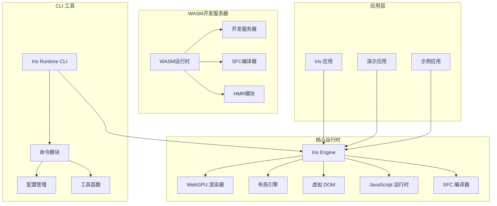

**图表来源**
- [main.rs:1-96](file://crates/iris-cli/src/main.rs#L1-L96)
- [Cargo.toml:1-32](file://Cargo.toml#L1-L32)
- [ARCHITECTURE.md:1-289](file://ARCHITECTURE.md#L1-L289)
- [lib/dev-server.js:1-172](file://crates/iris-runtime/lib/dev-server.js#L1-L172)

**章节来源**
- [main.rs:1-96](file://crates/iris-cli/src/main.rs#L1-L96)
- [Cargo.toml:1-32](file://Cargo.toml#L1-L32)

## 核心组件

### CLI 主入口

CLI 工具的主入口文件定义了完整的命令行界面和子命令结构：

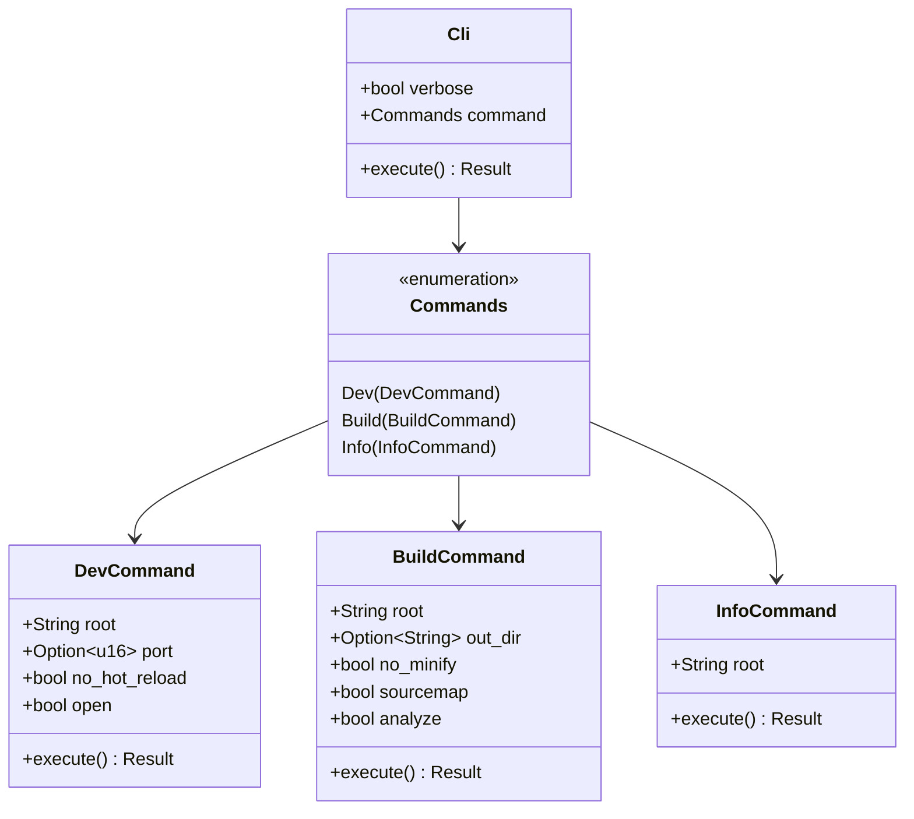

**图表来源**
- [main.rs:28-53](file://crates/iris-cli/src/main.rs#L28-L53)
- [commands/dev.rs:9-27](file://crates/iris-cli/src/commands/dev.rs#L9-L27)
- [commands/build.rs:11-33](file://crates/iris-cli/src/commands/build.rs#L11-L33)
- [commands/info.rs:9-15](file://crates/iris-cli/src/commands/info.rs#L9-L15)

### 配置管理系统

Iris Runtime CLI 提供了强大的配置管理功能，支持智能项目检测和配置覆盖：

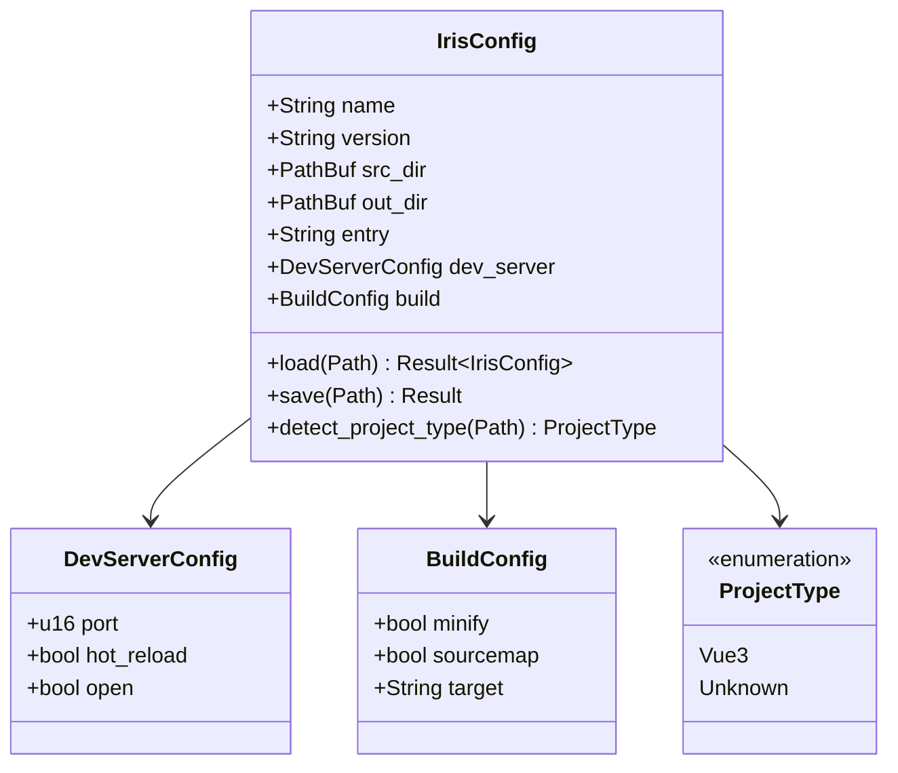

**图表来源**
- [config.rs:7-67](file://crates/iris-cli/src/config.rs#L7-L67)
- [config.rs:198-205](file://crates/iris-cli/src/config.rs#L198-L205)

**章节来源**
- [config.rs:1-255](file://crates/iris-cli/src/config.rs#L1-L255)

## 架构概览

Iris Runtime CLI 作为整个 Iris Engine 生态系统的核心入口点，与底层运行时模块紧密协作：

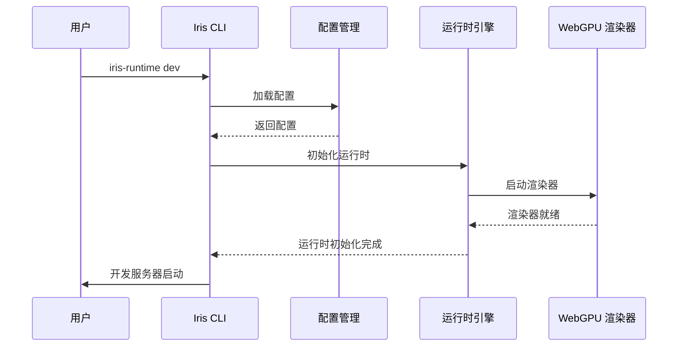

**图表来源**
- [main.rs:55-84](file://crates/iris-cli/src/main.rs#L55-L84)
- [commands/dev.rs:29-78](file://crates/iris-cli/src/commands/dev.rs#L29-L78)

### 核心运行时架构

Iris Engine 采用分层架构设计，确保模块间的清晰职责分离：

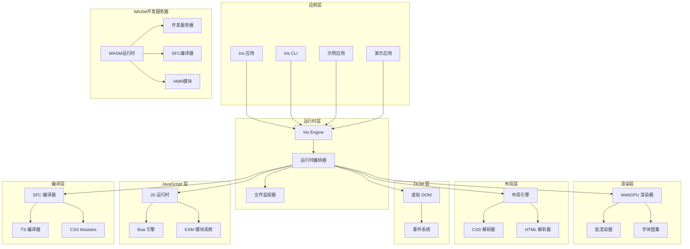

**图表来源**
- [ARCHITECTURE.md:3-44](file://ARCHITECTURE.md#L3-L44)
- [iris-app/src/main.rs:122-130](file://crates/iris-app/src/main.rs#L122-L130)
- [src/lib.rs:31-40](file://crates/iris-runtime/src/lib.rs#L31-L40)

**章节来源**
- [ARCHITECTURE.md:1-289](file://ARCHITECTURE.md#L1-L289)

## 详细组件分析

### 开发服务器命令 (DevCommand)

开发服务器命令提供了完整的开发环境设置和热重载功能：

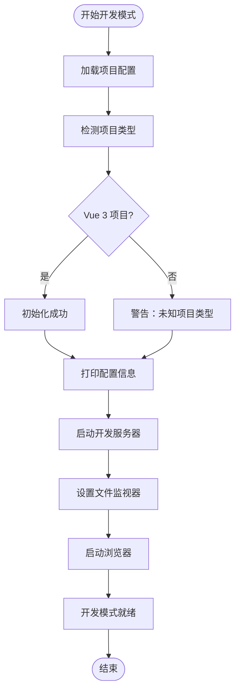

**图表来源**
- [commands/dev.rs:29-78](file://crates/iris-cli/src/commands/dev.rs#L29-L78)

开发服务器的主要功能包括：

1. **智能项目检测**：自动识别 Vue 3 项目并应用相应配置
2. **配置覆盖**：支持命令行参数覆盖配置文件设置
3. **热重载支持**：实时监控文件变化并触发重载
4. **浏览器集成**：可选的自动浏览器打开功能
5. **内置HTTP服务器**：完整的文件服务和请求处理

**章节来源**
- [commands/dev.rs:1-203](file://crates/iris-cli/src/commands/dev.rs#L1-L203)

### 构建命令 (BuildCommand)

构建命令负责将 Vue 3 应用程序转换为生产就绪的原生桌面应用程序：

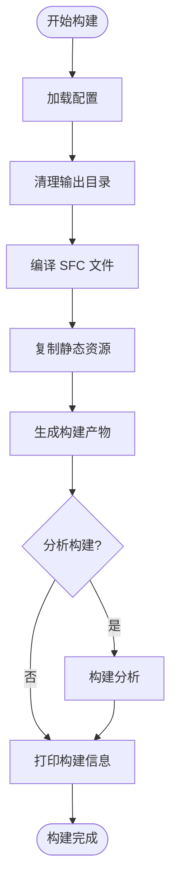

**图表来源**
- [commands/build.rs:35-98](file://crates/iris-cli/src/commands/build.rs#L35-L98)

构建过程的关键步骤：

1. **配置管理**：加载并验证项目配置
2. **SFC 编译**：将 Vue 单文件组件编译为 JavaScript
3. **资源复制**：复制静态资源到输出目录
4. **产物生成**：创建必要的 HTML 和清单文件
5. **构建分析**：可选的构建产物分析和报告

**章节来源**
- [commands/build.rs:1-308](file://crates/iris-cli/src/commands/build.rs#L1-L308)

### 信息命令 (InfoCommand)

信息命令提供了全面的项目诊断和运行时信息：

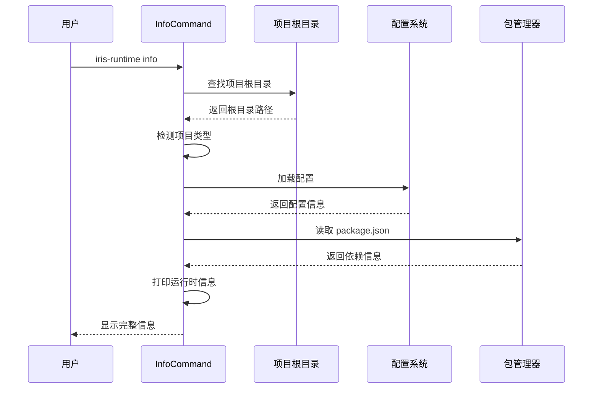

**图表来源**
- [commands/info.rs:17-64](file://crates/iris-cli/src/commands/info.rs#L17-L64)

**章节来源**
- [commands/info.rs:1-135](file://crates/iris-cli/src/commands/info.rs#L1-L135)

### 工具函数模块

工具函数模块提供了构建和开发过程中常用的实用功能：

| 功能类别 | 主要函数 | 描述 |
|---------|---------|------|
| 文件操作 | `find_project_root()` | 查找项目根目录 |
| 文件操作 | `ensure_dir()` | 确保目录存在 |
| 文件操作 | `copy_file()` | 复制文件 |
| 文件操作 | `copy_dir()` | 递归复制目录 |
| 文件操作 | `remove_dir()` | 删除目录 |
| 文本处理 | `read_text_file()` | 读取文本文件 |
| 文本处理 | `write_text_file()` | 写入文本文件 |
| 格式化 | `format_bytes()` | 格式化文件大小 |

**章节来源**
- [utils.rs:1-149](file://crates/iris-cli/src/utils.rs#L1-L149)

## WASM开发服务器实现

### WASM运行时架构

Iris Runtime 现在提供了基于 WebAssembly 的开发服务器实现，这是一个重要的架构升级：

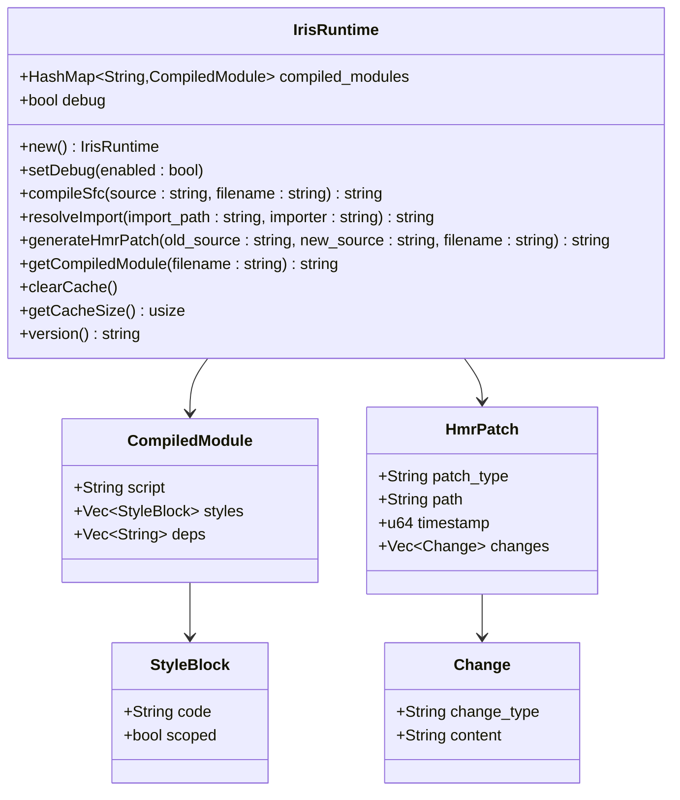

**图表来源**
- [src/lib.rs:31-40](file://crates/iris-runtime/src/lib.rs#L31-L40)
- [src/lib.rs:186-205](file://crates/iris-runtime/src/lib.rs#L186-L205)
- [src/hmr.rs:6-28](file://crates/iris-runtime/src/hmr.rs#L6-L28)

### 开发服务器实现

WASM开发服务器提供了完整的HTTP服务器和热重载功能：

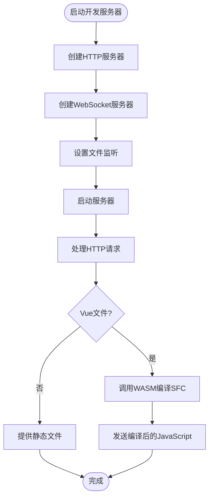

**图表来源**
- [lib/dev-server.js:24-102](file://crates/iris-runtime/lib/dev-server.js#L24-L102)
- [lib/dev-server.js:107-171](file://crates/iris-runtime/lib/dev-server.js#L107-L171)

开发服务器的主要功能包括：

1. **HTTP服务器**：提供静态文件服务和Vue SFC编译
2. **WebSocket服务器**：支持热模块替换(HMR)
3. **文件监听**：使用chokidar监控文件变化
4. **Vue SFC编译**：通过WASM实现实时编译
5. **自动浏览器打开**：可选的浏览器自动启动功能

**章节来源**
- [lib/dev-server.js:1-172](file://crates/iris-runtime/lib/dev-server.js#L1-L172)
- [bin/iris-runtime.js:12-52](file://crates/iris-runtime/bin/iris-runtime.js#L12-L52)

### SFC编译器实现

WASM编译器提供了高效的Vue单文件组件编译功能：

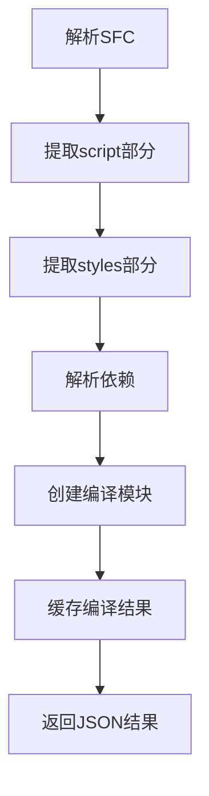

**图表来源**
- [src/compiler.rs:6-37](file://crates/iris-runtime/src/compiler.rs#L6-L37)

编译器的关键功能：

1. **SFC解析**：使用iris-sfc库解析Vue组件
2. **脚本提取**：提取JavaScript代码部分
3. **样式处理**：处理CSS样式和作用域
4. **依赖解析**：解析模块导入依赖
5. **结果缓存**：缓存编译结果以提高性能

**章节来源**
- [src/compiler.rs:1-114](file://crates/iris-runtime/src/compiler.rs#L1-L114)

### HMR模块实现

热模块替换模块提供了实时更新功能：

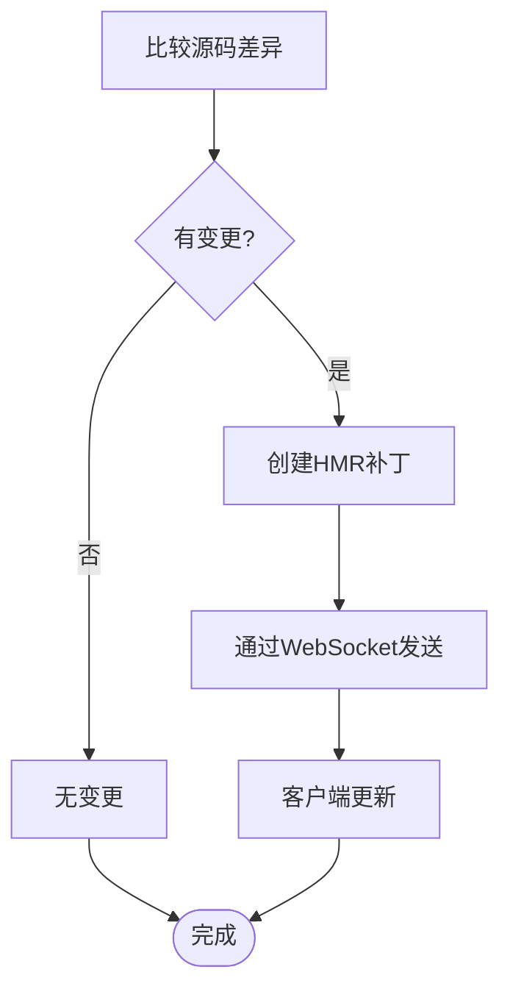

**图表来源**
- [src/hmr.rs:30-69](file://crates/iris-runtime/src/hmr.rs#L30-L69)

HMR模块的关键功能：

1. **源码差异比较**：比较新旧源码的差异
2. **补丁生成**：生成HMR补丁对象
3. **WebSocket通信**：通过WebSocket推送更新
4. **时间戳追踪**：记录变更的时间戳
5. **完整重载**：在必要时进行完整重载

**章节来源**
- [src/hmr.rs:1-97](file://crates/iris-runtime/src/hmr.rs#L1-L97)

**章节来源**
- [src/lib.rs:1-205](file://crates/iris-runtime/src/lib.rs#L1-L205)
- [lib/dev-server.js:1-172](file://crates/iris-runtime/lib/dev-server.js#L1-L172)
- [bin/iris-runtime.js:1-52](file://crates/iris-runtime/bin/iris-runtime.js#L1-L52)

## 依赖关系分析

Iris Runtime CLI 依赖于多个核心模块，形成了清晰的依赖层次结构：

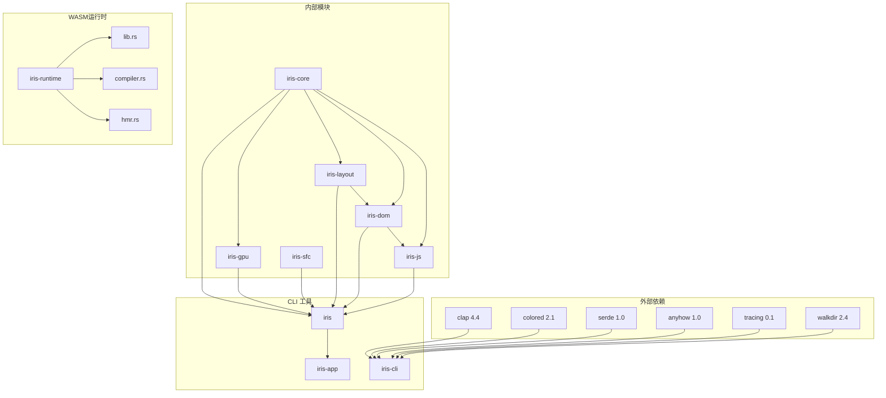

**图表来源**
- [Cargo.toml:13-32](file://Cargo.toml#L13-L32)
- [crates/iris-cli/Cargo.toml:17-26](file://crates/iris-cli/Cargo.toml#L17-L26)
- [package.json:30-42](file://crates/iris-runtime/package.json#L30-L42)

### 关键依赖说明

1. **Clap**：提供命令行参数解析和子命令支持
2. **Colored**：支持彩色输出，提升用户体验
3. **Serde**：提供 JSON 序列化和反序列化功能
4. **Anyhow**：简化错误处理和传播
5. **Tracing**：提供结构化日志记录
6. **WalkDir**：递归遍历文件系统
7. **wasm-bindgen**：提供Rust到JavaScript的绑定
8. **chokidar**：提供文件系统监控
9. **ws**：提供WebSocket服务器功能
10. **commander**：提供CLI参数解析

**章节来源**
- [Cargo.toml:1-32](file://Cargo.toml#L1-L32)
- [crates/iris-cli/Cargo.toml:1-30](file://crates/iris-cli/Cargo.toml#L1-L30)
- [package.json:30-42](file://crates/iris-runtime/package.json#L30-L42)

## 性能考虑

Iris Runtime CLI 在设计时充分考虑了性能优化：

### 日志系统优化

- **条件日志**：根据 `verbose` 标志动态调整日志级别
- **结构化日志**：使用 `tracing` 提供更丰富的上下文信息
- **环境过滤**：支持通过环境变量控制日志输出

### 文件操作优化

- **智能缓存**：在运行时应用中实现 SFC 模块缓存机制
- **批量操作**：使用 `walkdir` 进行高效的文件遍历
- **增量更新**：仅处理真正发生变化的文件

### 内存管理

- **生命周期管理**：合理管理临时文件和缓存
- **资源清理**：确保退出时正确释放资源
- **内存限制**：在应用中实现缓存大小限制

### WASM性能优化

- **编译缓存**：缓存编译结果以避免重复编译
- **模块复用**：复用WASM实例以减少内存占用
- **异步处理**：使用异步操作避免阻塞主线程
- **WebSocket优化**：高效处理热重载消息

**章节来源**
- [src/lib.rs:57-62](file://crates/iris-runtime/src/lib.rs#L57-L62)
- [src/lib.rs:88-93](file://crates/iris-runtime/src/lib.rs#L88-L93)

## 故障排除指南

### 常见问题及解决方案

#### 1. 项目根目录检测失败

**症状**：`Could not find project root`

**原因**：
- 缺少 `iris.config.json`、`package.json` 或 `Cargo.toml`
- CLI 工具在错误的目录中运行

**解决方案**：
```bash
# 确保在正确的项目根目录中运行
cd /path/to/your/vue/project
iris-runtime dev
```

#### 2. 配置文件加载错误

**症状**：配置文件解析失败

**原因**：
- `iris.config.json` 格式不正确
- 权限不足无法读取配置文件

**解决方案**：
```bash
# 检查配置文件格式
cat iris.config.json

# 验证文件权限
ls -la iris.config.json

# 重新生成默认配置
iris-runtime info
```

#### 3. 开发服务器启动失败

**症状**：端口被占用或其他启动错误

**原因**：
- 指定端口已被占用
- 缺少必要的运行时依赖
- WASM模块加载失败

**解决方案**：
```bash
# 更换端口
iris-runtime dev --port 3001

# 检查端口可用性
netstat -ano | findstr :3000

# 安装运行时依赖
cargo install iris-cli

# 检查WASM模块
cd crates/iris-runtime
npm run build:wasm
```

#### 4. 构建失败

**症状**：构建过程中出现错误

**原因**：
- Vue SFC 编译错误
- 缺少必要的构建工具
- 资源文件损坏

**解决方案**：
```bash
# 检查 Vue 文件语法
iris-runtime info

# 清理构建缓存
rm -rf dist/

# 重新安装依赖
cargo clean
cargo build

# 启用详细日志
iris-runtime build --verbose
```

#### 5. WASM模块加载失败

**症状**：WASM模块无法加载或编译

**原因**：
- wasm-pack未正确安装
- WASM二进制文件损坏
- 浏览器不支持WebAssembly

**解决方案**：
```bash
# 安装wasm-pack
cargo install wasm-pack

# 重新编译WASM模块
cd crates/iris-runtime
wasm-pack build --target nodejs --release

# 检查浏览器支持
chrome://flags/#enable-webassembly
```

### 调试技巧

1. **启用详细日志**：
   ```bash
   iris-runtime dev --verbose
   ```

2. **检查系统要求**：
   ```bash
   iris-runtime info
   ```

3. **验证 WebGPU 支持**：
   - 确保 GPU 支持 WebGPU
   - 检查浏览器或系统兼容性

4. **验证WASM支持**：
   - 检查Node.js版本
   - 确认WASM模块完整性

**章节来源**
- [utils.rs:40-57](file://crates/iris-cli/src/utils.rs#L40-L57)
- [commands/dev.rs:30-78](file://crates/iris-cli/src/commands/dev.rs#L30-L78)
- [lib/dev-server.js:31-35](file://crates/iris-runtime/lib/dev-server.js#L31-L35)

## 结论

Iris Runtime CLI 代表了前端开发工具链的重大创新，它通过消除传统构建步骤，为开发者提供了前所未有的开发体验。该工具不仅具备强大的功能特性，还展现了优秀的架构设计和性能表现。

### 主要优势

1. **开发效率**：零配置、零等待的开发体验
2. **性能卓越**：基于 WebGPU 的硬件加速渲染
3. **跨平台支持**：统一的开发和部署体验
4. **生态完整**：从开发到生产的完整工具链
5. **智能配置**：自动项目检测和配置管理
6. **WASM开发服务器**：高性能的WebAssembly开发服务器
7. **热模块替换**：实时更新功能
8. **现代API**：支持ES Module和TypeScript

### 架构演进

Iris Runtime 从传统的原生开发服务器演进到了基于WASM的开发服务器，这一变化带来了显著的优势：

- **轻量级**：WASM模块大小约5MB，相比原生二进制更小
- **跨平台**：单一WASM二进制可在任何支持WebAssembly的环境中运行
- **高性能**：Rust编译的WASM提供接近原生的性能
- **易部署**：通过npm包分发，易于安装和使用

### 未来发展方向

随着 Iris Engine 的持续发展，Iris Runtime CLI 将继续演进，为开发者提供更加完善的功能和更好的使用体验。项目团队正致力于实现 Vue 3 完整运行时、开发者工具和性能分析器等功能，进一步提升开发者的生产力。

对于希望体验下一代前端开发方式的开发者来说，Iris Runtime CLI 是一个值得探索和使用的优秀工具。它不仅代表了技术的发展方向，更为前端开发带来了真正的革命性变化。

### 示例应用支持

项目包含了完整的示例应用支持，包括：

- **Vue 3 演示应用**：展示完整的 Iris Runtime 功能
- **TypeScript 支持**：现代化的开发体验
- **性能基准**：展示与传统框架的性能对比
- **配置模板**：标准化的项目配置
- **WASM开发服务器**：完整的WebAssembly开发环境

这些示例应用为开发者提供了最佳实践参考和快速入门指导。