# Iris JetCrab CLI工具

<cite>
**本文档引用的文件**
- [Cargo.toml](file://crates/iris-jetcrab-cli/Cargo.toml)
- [src/main.rs](file://crates/iris-jetcrab-cli/src/main.rs)
- [src/server/mod.rs](file://crates/iris-jetcrab-cli/src/server/mod.rs)
- [src/server/http_server.rs](file://crates/iris-jetcrab-cli/src/server/http_server.rs)
- [crates/iris-jetcrab-engine/src/lib.rs](file://crates/iris-jetcrab-engine/src/lib.rs)
</cite>

## 更新摘要
**所做更改**
- 更新架构说明以反映CLI现在作为HTTP服务器包装器的角色
- 移除命令系统相关的内容，强调HTTP服务器功能
- 更新核心组件描述以反映简化后的架构
- 修订使用指南以符合HTTP服务器包装器的新角色
- 更新故障排除指南以适应新的服务器架构

## 目录
1. [简介](#简介)
2. [项目结构](#项目结构)
3. [核心组件](#核心组件)
4. [架构概览](#架构概览)
5. [HTTP服务器实现](#http服务器实现)
6. [路由系统](#路由系统)
7. [编译器缓存系统](#编译器缓存系统)
8. [WebSocket热更新系统](#websocket热更新系统)
9. [项目检测系统](#项目检测系统)
10. [与iris-runtime的区别](#与iris-runtime的区别)
11. [依赖关系分析](#依赖关系分析)
12. [使用指南](#使用指南)
13. [故障排除指南](#故障排除指南)
14. [结论](#结论)

## 简介

Iris JetCrab CLI是一个专门为Vue项目设计的开发服务器工具，现已演进为HTTP服务器包装器。该工具专注于提供浏览器渲染的开发体验，通过Axum HTTP服务器提供Vue应用的实时编译和热重载功能。工具通过架构简化，现在专注于HTTP服务器的核心功能，利用iris-jetcrab-engine提供的编译能力实现按需编译的开发体验。

### 核心特性

- **HTTP服务器包装器**：基于Axum HTTP服务器提供Vue应用开发服务
- **按需编译**：运行时按需编译Vue模块，提升开发效率
- **热模块替换**：WebSocket实现实时代码更新
- **Vue项目支持**：完整的Vue 3项目检测和编译
- **TypeScript支持**：通过SWC编译TypeScript代码
- **SCSS/SASS支持**：使用Grass编译样式文件
- **自动浏览器打开**：可选的浏览器自动启动功能
- **调试模式**：支持详细日志输出和调试信息
- **异步架构**：基于Tokio的高性能异步处理
- **模块化设计**：清晰的服务器和路由分离架构
- **编译器缓存**：智能缓存机制提升编译性能

## 项目结构

Iris JetCrab CLI采用简化的HTTP服务器架构，专注于提供Vue应用的开发服务器功能：

```mermaid
graph TB
subgraph "HTTP服务器层"
HTTPServer[HTTP服务器]
Router[路由处理器]
WebSocket[WebSocket服务器]
Cors[CORS中间件]
end
subgraph "编译器层"
CompilerCache[编译器缓存]
VueCompiler[Vue编译器]
Engine[iris-jetcrab-engine]
end
subgraph "项目检测层"
ProjectDetector[项目检测器]
FileWatcher[文件监听器]
ConfigManager[配置管理器]
end
subgraph "应用层"
VueApp[Vue应用]
Browser[浏览器渲染]
```

**图表来源**
- [src/server/mod.rs:1-15](file://crates/iris-jetcrab-cli/src/server/mod.rs#L1-L15)
- [src/server/http_server.rs:48-63](file://crates/iris-jetcrab-cli/src/server/http_server.rs#L48-L63)

**章节来源**
- [src/server/mod.rs:1-15](file://crates/iris-jetcrab-cli/src/server/mod.rs#L1-L15)
- [src/server/http_server.rs:18-91](file://crates/iris-jetcrab-cli/src/server/http_server.rs#L18-L91)

## 核心组件

### HTTP服务器主入口

CLI工具现在作为HTTP服务器包装器，提供简化的命令行接口：

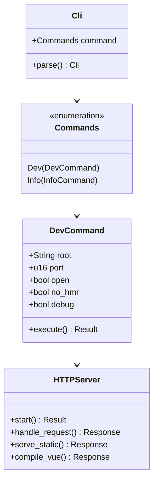

**图表来源**
- [src/main.rs:15-71](file://crates/iris-jetcrab-cli/src/main.rs#L15-L71)

### 简化后的命令系统

Iris JetCrab CLI现在提供简化的命令系统，专注于HTTP服务器功能：

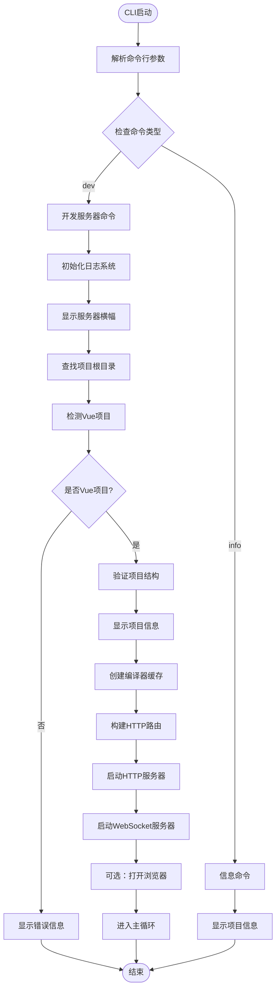

**图表来源**
- [src/main.rs:58-71](file://crates/iris-jetcrab-cli/src/main.rs#L58-L71)
- [src/server/http_server.rs:18-91](file://crates/iris-jetcrab-cli/src/server/http_server.rs#L18-L91)

**章节来源**
- [src/main.rs:1-71](file://crates/iris-jetcrab-cli/src/main.rs#L1-L71)

## 架构概览

Iris JetCrab CLI通过iris-jetcrab-engine提供编译能力，实现简化的HTTP服务器架构：

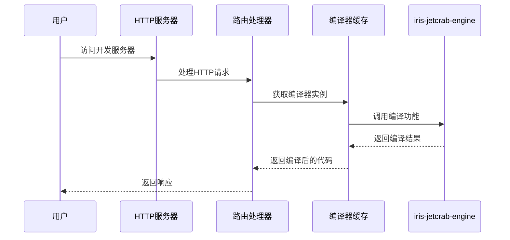

**图表来源**
- [src/server/http_server.rs:48-63](file://crates/iris-jetcrab-cli/src/server/http_server.rs#L48-L63)

### 核心运行时架构

Iris JetCrab CLI通过iris-jetcrab-engine实现简化的Vue项目编译和运行时支持：

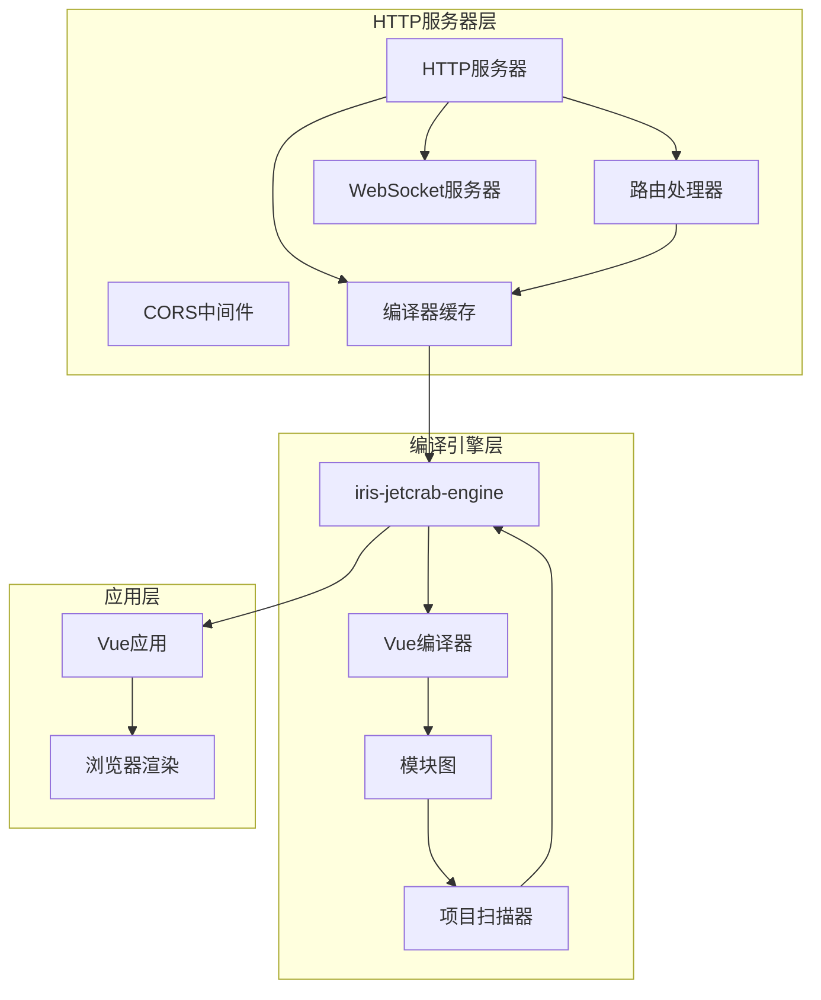

**图表来源**
- [crates/iris-jetcrab-engine/src/lib.rs:1-110](file://crates/iris-jetcrab-engine/src/lib.rs#L1-L110)

**章节来源**
- [crates/iris-jetcrab-engine/src/lib.rs:1-110](file://crates/iris-jetcrab-engine/src/lib.rs#L1-L110)

## HTTP服务器实现

### HTTP服务器架构

Iris JetCrab CLI使用Axum框架构建高性能的HTTP服务器，提供简化的文件服务和Vue应用编译功能：

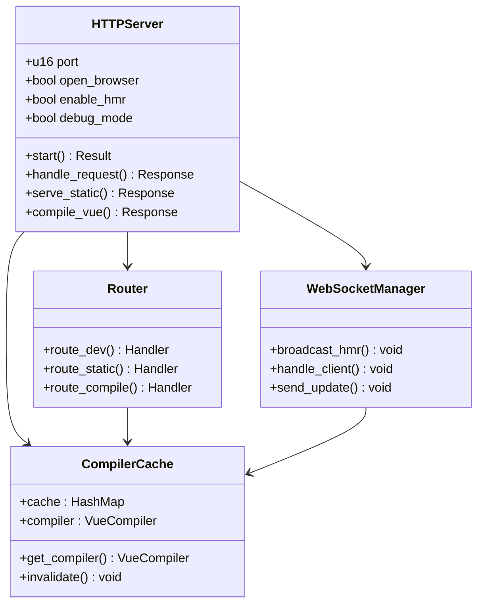

**图表来源**
- [src/server/http_server.rs:18-91](file://crates/iris-jetcrab-cli/src/server/http_server.rs#L18-L91)

HTTP服务器的主要功能包括：

1. **HTTP服务器**：提供静态文件服务和Vue SFC编译
2. **路由处理**：使用Axum路由器处理不同类型的请求
3. **编译器缓存**：智能缓存Vue编译器实例提升性能
4. **Vue编译**：通过iris-jetcrab-engine编译Vue组件
5. **浏览器集成**：自动打开浏览器并建立WebSocket连接
6. **异步处理**：基于Tokio的高性能异步服务器
7. **CORS支持**：提供跨域资源共享支持

**章节来源**
- [src/server/http_server.rs:18-91](file://crates/iris-jetcrab-cli/src/server/http_server.rs#L18-L91)

## 路由系统

### 路由架构

Iris JetCrab CLI提供简化的路由系统，专注于Vue应用开发的核心需求：

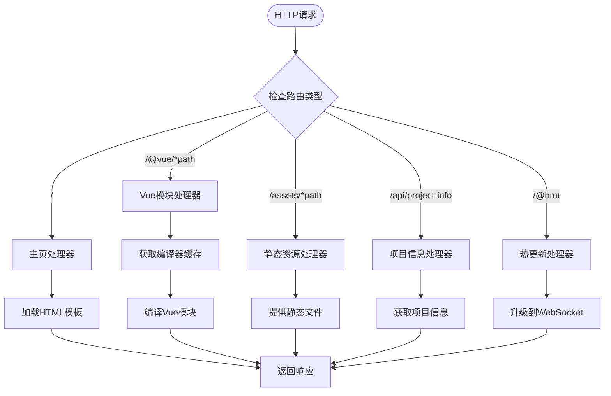

**图表来源**
- [src/server/http_server.rs:48-63](file://crates/iris-jetcrab-cli/src/server/http_server.rs#L48-L63)

路由系统的关键功能：

1. **主页路由**：提供Vue应用的HTML模板
2. **Vue模块路由**：处理Vue SFC的按需编译
3. **静态资源路由**：提供assets目录下的静态文件服务
4. **项目信息API**：提供项目配置和状态信息
5. **热更新路由**：处理WebSocket连接和HMR通信

**章节来源**
- [src/server/http_server.rs:48-63](file://crates/iris-jetcrab-cli/src/server/http_server.rs#L48-L63)

## 编译器缓存系统

### 编译器缓存架构

Iris JetCrab CLI实现了智能的编译器缓存系统，提升Vue应用的编译性能：

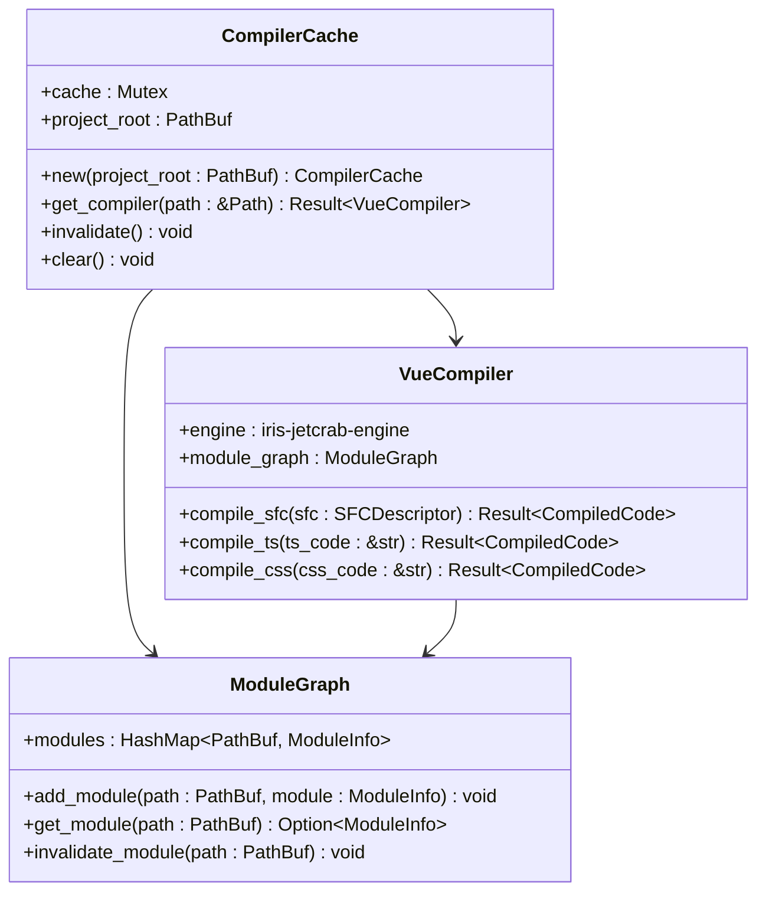

**图表来源**
- [src/server/http_server.rs:43-44](file://crates/iris-jetcrab-cli/src/server/http_server.rs#L43-L44)

编译器缓存系统的关键特性：

1. **智能缓存**：缓存Vue编译器实例避免重复创建
2. **线程安全**：使用Arc<Mutex<>>确保多线程安全
3. **按需编译**：只在需要时创建编译器实例
4. **模块管理**：跟踪Vue模块的依赖关系
5. **失效机制**：支持编译器和模块的失效和重建

**章节来源**
- [src/server/http_server.rs:43-44](file://crates/iris-jetcrab-cli/src/server/http_server.rs#L43-L44)

## WebSocket热更新系统

WebSocket服务器实现了简化的热模块替换(HMR)功能：

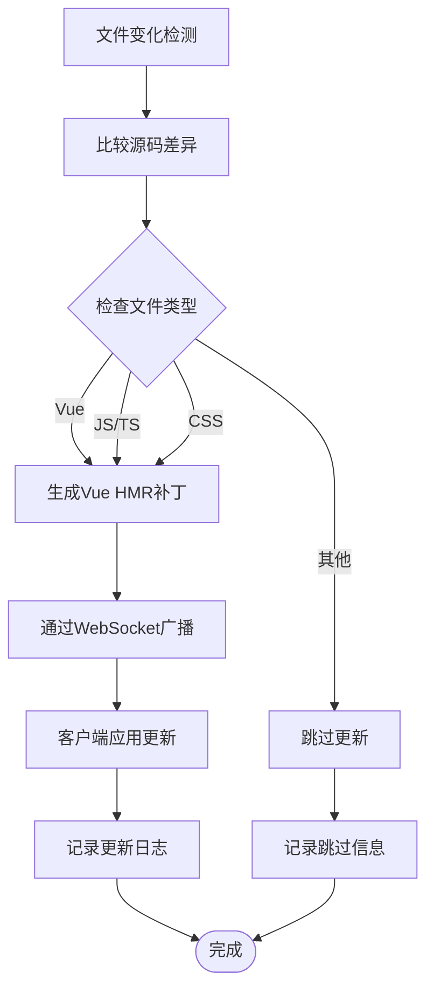

**图表来源**
- [src/server/http_server.rs:78-79](file://crates/iris-jetcrab-cli/src/server/http_server.rs#L78-L79)

热更新系统的关键功能：

1. **文件监控**：使用notify库监控项目文件变化
2. **差异比较**：比较新旧源码的差异生成补丁
3. **补丁生成**：为不同类型文件生成相应的更新补丁
4. **WebSocket通信**：通过WebSocket向客户端推送更新
5. **客户端应用**：客户端接收补丁并应用到运行时

**章节来源**
- [src/server/http_server.rs:78-79](file://crates/iris-jetcrab-cli/src/server/http_server.rs#L78-L79)

## 项目检测系统

### Vue项目识别

Iris JetCrab CLI通过iris-jetcrab-engine提供统一的项目检测功能：

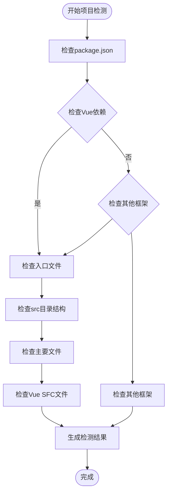

**图表来源**
- [src/server/http_server.rs:32-41](file://crates/iris-jetcrab-cli/src/server/http_server.rs#L32-L41)

项目检测的关键要素：

1. **依赖检查**：验证package.json中的Vue依赖
2. **入口文件检测**：查找src/main.js、src/main.ts或src/App.vue
3. **目录结构验证**：检查标准的Vue项目目录结构
4. **文件完整性**：验证项目文件的完整性和有效性
5. **版本信息**：识别Vue版本和构建工具

**章节来源**
- [src/server/http_server.rs:32-41](file://crates/iris-jetcrab-cli/src/server/http_server.rs#L32-L41)

## 与iris-runtime的区别

Iris JetCrab CLI与iris-runtime虽然都支持Vue项目开发，但在架构和使用场景上有显著差异：

| 特性 | iris-runtime | iris-jetcrab-cli |
|------|--------------|------------------|
| **渲染方式** | 原生窗口 (WebGPU) | 浏览器渲染 |
| **使用场景** | 桌面应用开发 | Web应用开发 |
| **依赖架构** | winit, wgpu | axum, 浏览器 |
| **热更新实现** | 文件监听 | WebSocket HMR |
| **开发体验** | 原生窗口开发 | 浏览器开发 |
| **部署方式** | 原生应用 | Web应用 |
| **调试工具** | 原生调试 | 浏览器开发者工具 |
| **架构简化** | 复杂原生架构 | 简化HTTP服务器 |

### 技术架构对比

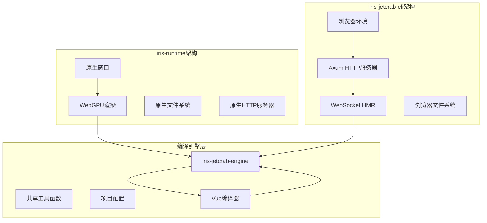

**图表来源**
- [src/main.rs:5-7](file://crates/iris-jetcrab-cli/src/main.rs#L5-L7)

**章节来源**
- [src/main.rs:5-7](file://crates/iris-jetcrab-cli/src/main.rs#L5-L7)

## 依赖关系分析

Iris JetCrab CLI通过iris-jetcrab-engine提供编译能力，建立了简化的依赖层次结构：

```mermaid
graph TB
subgraph "外部依赖"
Clap[clap 4.4]
Anyhow[anyhow 1.0]
Colored[colored 2.1]
Axum[axum 0.7]
Tokio[tokio 1.0]
Notify[notify 6.1]
WalkDir[walkdir 2.4]
Tracing[tracing 0.1]
Serde[serde 1.0]
Open[open 5.0]
Chrono[chrono 0.4]
ParkingLot[parking_lot 0.12]
TowerHttp[tower-http 0.5]
TokioTungstenite[tokio-tungstenite 0.21]
end
subgraph "编译引擎层"
IrisJetCrabEngine[iris-jetcrab-engine]
VueCompiler[Vue编译器]
ModuleGraph[模块图]
ProjectScanner[项目扫描器]
end
subgraph "内部模块"
IrisCore[iris-core]
IrisSFC[iris-sfc]
end
subgraph "HTTP服务器"
IrisJetCrabCLI[iris-jetcrab-cli]
HTTPServer[HTTP服务器]
Router[路由处理器]
CompilerCache[编译器缓存]
WebSocket[WebSocket服务器]
end
Clap --> IrisJetCrabCLI
Axum --> IrisJetCrabCLI
Tokio --> IrisJetCrabCLI
Notify --> IrisJetCrabCLI
Tracing --> IrisJetCrabCLI
Serde --> IrisJetCrabCLI
Open --> IrisJetCrabCLI
TokioTungstenite --> IrisJetCrabCLI
TowerHttp --> IrisJetCrabCLI
IrisJetCrabEngine --> IrisJetCrabCLI
VueCompiler --> IrisJetCrabCLI
ModuleGraph --> IrisJetCrabCLI
ProjectScanner --> IrisJetCrabCLI
IrisCore --> IrisJetCrabEngine
IrisSFC --> IrisJetCrabEngine
HTTPServer --> IrisJetCrabEngine
Router --> IrisJetCrabEngine
CompilerCache --> IrisJetCrabEngine
WebSocket --> IrisJetCrabEngine
```

**图表来源**
- [Cargo.toml:17-57](file://crates/iris-jetcrab-cli/Cargo.toml#L17-L57)

### 关键依赖说明

1. **Clap**：提供简化的命令行参数解析
2. **Axum**：高性能的HTTP服务器框架
3. **Tokio**：异步运行时，支持并发处理
4. **Notify**：文件系统监控，支持热更新
5. **iris-jetcrab-engine**：核心编译和运行时引擎
6. **Tracing**：结构化日志记录系统
7. **Serde**：数据序列化和反序列化
8. **Open**：系统浏览器打开功能
9. **Tokio-Tungstenite**：WebSocket支持
10. **Tower-HTTP**：HTTP中间件支持

**章节来源**
- [Cargo.toml:17-57](file://crates/iris-jetcrab-cli/Cargo.toml#L17-L57)

## 使用指南

### 安装和快速开始

Iris JetCrab CLI提供了简化的安装和使用方式：

```bash
# 从源码编译安装
cargo install --path crates/iris-jetcrab-cli

# 直接运行（推荐用于开发）
cargo run -p iris-jetcrab-cli -- <command>

# 开发模式运行
cargo run -p iris-jetcrab-cli -- dev
```

### 基本命令使用

```bash
# 启动开发服务器（默认端口 3000）
iris-jetcrab dev

# 指定端口并自动打开浏览器
iris-jetcrab dev -p 8080 -o

# 调试模式启动
iris-jetcrab dev -d

# 禁用热更新
iris-jetcrab dev --no-hmr

# 指定项目根目录
iris-jetcrab dev -r ./my-vue-app
```

### 项目要求

要使用Iris JetCrab CLI，Vue项目需要满足以下条件：

1. **package.json** - 包含Vue依赖
2. **node_modules** - 已安装依赖
3. **入口文件** - 以下之一：
   - `src/main.js` 或 `src/main.ts`
   - `src/App.vue`
   - `src/*.vue`（任意Vue文件）

**章节来源**
- [src/server/http_server.rs:32-41](file://crates/iris-jetcrab-cli/src/server/http_server.rs#L32-L41)

## 故障排除指南

### 常见问题及解决方案

#### 1. 项目检测失败

**症状**：显示"Not a Vue project"错误

**原因**：
- 缺少Vue依赖或package.json配置不正确
- 项目根目录设置错误
- 缺少必要的入口文件

**解决方案**：
```bash
# 检查Vue项目配置
cat package.json

# 验证项目根目录
iris-jetcrab info -r ./your-project

# 确保正确的入口文件存在
ls -la src/main.js src/main.ts src/App.vue
```

#### 2. 服务器启动失败

**症状**：端口被占用或其他启动错误

**原因**：
- 指定端口已被占用
- 缺少必要的运行时依赖
- 浏览器打开功能失败

**解决方案**：
```bash
# 更换端口
iris-jetcrab dev -p 3001

# 使用自动端口选择
iris-jetcrab dev -p 0

# 检查端口可用性
netstat -ano | findstr :3000

# 安装所有依赖
cargo install --path crates/iris-jetcrab-cli
```

#### 3. 热更新不工作

**症状**：文件修改后页面不刷新

**原因**：
- WebSocket连接失败
- 文件监听器异常
- HMR功能被禁用

**解决方案**：
```bash
# 启用调试模式查看详细日志
iris-jetcrab dev -d

# 检查WebSocket连接
curl -i http://localhost:3000/@hmr

# 确保HMR未被禁用
iris-jetcrab dev  # 默认启用HMR
```

#### 4. 编译器缓存问题

**症状**：编译性能下降或编译错误

**原因**：
- 缓存失效机制异常
- 编译器实例创建失败
- 模块图缓存不一致

**解决方案**：
```bash
# 清理编译器缓存
# 重启开发服务器让缓存自动重建

# 检查项目结构完整性
iris-jetcrab info

# 重新安装依赖
rm -rf node_modules
npm install
```

### 性能优化建议

1. **调试模式**：仅在开发时使用`-d`标志
2. **端口选择**：避免使用常用端口3000
3. **文件监听**：合理配置忽略规则避免不必要的监听
4. **日志级别**：生产环境使用INFO级别日志
5. **编译器缓存**：利用内置缓存提升编译性能

**章节来源**
- [src/server/http_server.rs:18-91](file://crates/iris-jetcrab-cli/src/server/http_server.rs#L18-L91)

## 结论

Iris JetCrab CLI通过架构简化，现在专注于作为HTTP服务器包装器的角色，为Vue项目开发提供了更加专注和高效的开发体验。这种简化不仅减少了代码复杂度，还提升了工具的稳定性和性能。

### 主要优势

1. **HTTP服务器包装器**：专注于提供Vue应用的开发服务器功能
2. **按需编译**：运行时按需编译Vue模块，提升开发效率
3. **热模块替换**：基于WebSocket的实时代码更新
4. **Vue专用**：针对Vue项目优化的开发服务器
5. **异步架构**：基于Tokio的高性能异步处理
6. **编译器缓存**：智能缓存机制提升编译性能
7. **CORS支持**：提供跨域资源共享支持
8. **简化的命令系统**：专注于HTTP服务器的核心功能

### 技术特色

1. **HTTP服务器**：基于Axum的高性能HTTP服务器
2. **WebSocket支持**：完整的热更新通信协议
3. **编译器缓存**：智能缓存Vue编译器实例
4. **文件监听**：使用notify库实现高效的文件监控
5. **异步处理**：基于Tokio的非阻塞异步架构
6. **日志系统**：支持调试模式的详细日志输出
7. **路由系统**：简化的路由处理机制

### 未来发展

Iris JetCrab CLI将继续优化其HTTP服务器功能，特别是在编译器缓存性能和路由处理效率方面。随着iris-jetcrab-engine的不断发展，Iris JetCrab CLI将为Vue开发者提供更加完善的开发体验，成为Web应用开发的重要工具。

通过架构简化，Iris JetCrab CLI现在能够更好地专注于HTTP服务器的核心功能，为Vue开发者提供更加稳定和高效的开发环境。对于希望在浏览器环境中开发Vue应用的开发者来说，Iris JetCrab CLI是一个值得探索和使用的优秀工具，展现了Rust在前端开发工具领域的强大潜力。