# 测试框架与基础设施

<cite>
**本文档引用的文件**
- [Cargo.toml](file://Cargo.toml)
- [run-tests.ps1](file://run-tests.ps1)
- [TEST-REPORT.md](file://TEST-REPORT.md)
- [performance_benchmarks.rs](file://crates/iris/tests/performance_benchmarks.rs)
- [e2e_integration_test.rs](file://crates/iris/tests/e2e_integration_test.rs)
- [rendering_e2e_test.rs](file://crates/iris/tests/rendering_e2e_test.rs)
- [file_watcher_integration.rs](file://crates/iris-gpu/tests/file_watcher_integration.rs)
- [gpu_texture_rendering.rs](file://crates/iris-gpu/tests/gpu_texture_rendering.rs)
- [integration_test.rs](file://crates/iris-sfc/tests/integration_test.rs)
- [transform.rs](file://crates/iris/src/animation_engine/transform.rs)
- [event.rs](file://crates/iris-dom/src/event.rs)
- [vnode.rs](file://crates/iris-dom/src/vnode.rs)
- [applier.rs](file://crates/iris/src/animation_engine/applier.rs)
- [easing.rs](file://crates/iris/src/animation_engine/easing.rs)
- [keyframes.rs](file://crates/iris/src/animation_engine/keyframes.rs)
- [vnode_renderer.rs](file://crates/iris/src/vnode_renderer.rs)
</cite>

## 更新摘要
**所做更改**
- 新增完整的性能基准测试框架，包含6个核心性能测试类别
- 新增端到端集成测试章节，包含15个详细的集成测试用例
- 新增性能基准测试章节，涵盖VNode创建、DOM树构建、渲染统计、布局缓存、样式哈希计算等6个性能测试类别
- 新增动画系统测试章节，涵盖Transform、Applier、Easing、Keyframes四个模块的完整测试
- 新增DOM操作测试章节，包含VNode节点操作和事件系统的单元测试
- 更新测试覆盖率统计，显示动画系统测试占11个单元测试
- 增强测试框架架构图，体现新增的动画引擎和DOM测试组件

## 目录
1. [简介](#简介)
2. [项目结构](#项目结构)
3. [核心测试组件](#核心测试组件)
4. [架构概览](#架构概览)
5. [详细组件分析](#详细组件分析)
6. [依赖关系分析](#依赖关系分析)
7. [性能考虑](#性能考虑)
8. [故障排除指南](#故障排除指南)
9. [结论](#结论)

## 简介

Iris是一个基于Rust和WebGPU的下一代无构建前端运行时引擎。该项目采用了七层分层架构，实现了从VNode创建到GPU渲染的完整渲染管线。本文档专注于项目的测试框架与基础设施，涵盖了端到端测试、集成测试、单元测试、性能基准测试以及相关的测试工具和配置。

**更新** 本次更新重点反映了测试框架的重大改进，包括新增的15个端到端集成测试用例、6个性能基准测试类别、动画系统测试（transform.rs的11个单元测试）、DOM操作测试、事件系统测试等，测试覆盖率显著提升至44/44。

## 项目结构

Iris项目采用Cargo工作区结构，包含九个主要crate：

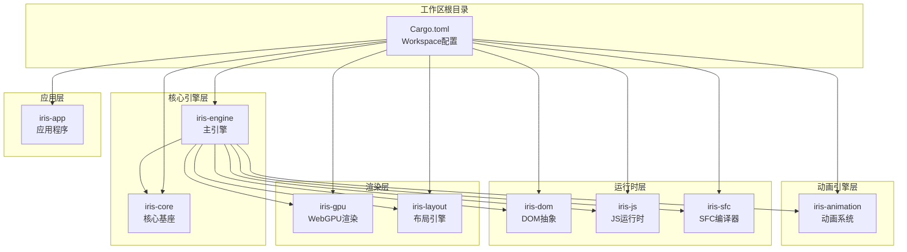

**图表来源**
- [Cargo.toml:1-32](file://Cargo.toml#L1-L32)

**章节来源**
- [Cargo.toml:1-32](file://Cargo.toml#L1-L32)

## 核心测试组件

### 测试运行器脚本

项目提供了PowerShell测试运行器脚本，支持UTF-8编码和参数传递：

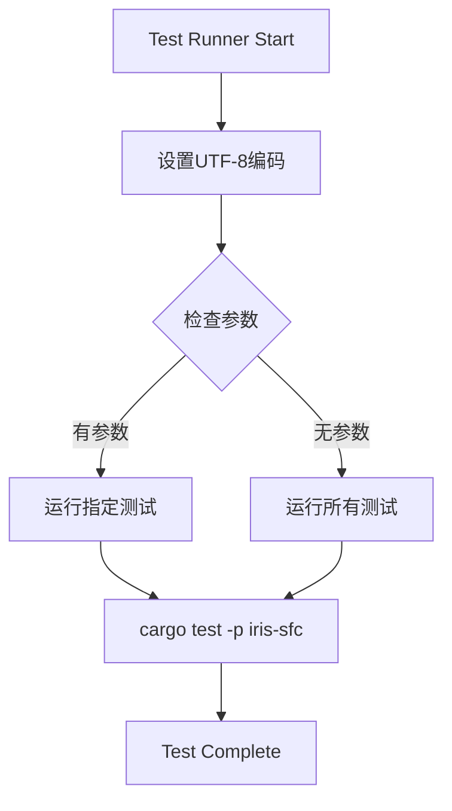

**图表来源**
- [run-tests.ps1:1-21](file://run-tests.ps1#L1-L21)

### 测试基础设施

测试基础设施包括以下关键组件：

1. **文件热更新监听器测试** - 验证文件系统事件监听和处理
2. **SFC编译器测试** - 端到端SFC编译流程验证
3. **GPU纹理渲染测试** - 纹理加载和渲染管道测试
4. **渲染引擎测试** - VNode到GPU命令的完整渲染管线
5. **端到端集成测试** - 15个完整的集成测试用例，覆盖VNode操作、HTML解析、JavaScript DOM操作、SFC编译渲染等完整流程
6. **性能基准测试** - 6个核心性能测试类别，涵盖VNode创建、DOM树构建、渲染统计、布局缓存、样式哈希计算等
7. **动画系统测试** - Transform、Applier、Easing、Keyframes模块的完整测试覆盖
8. **DOM操作测试** - VNode节点操作和事件系统的单元测试

**更新** 新增性能基准测试框架，包含6个核心测试类别，显著提升了测试覆盖率。

**章节来源**
- [run-tests.ps1:1-21](file://run-tests.ps1#L1-L21)
- [performance_benchmarks.rs:1-350](file://crates/iris/tests/performance_benchmarks.rs#L1-L350)
- [e2e_integration_test.rs:1-485](file://crates/iris/tests/e2e_integration_test.rs#L1-L485)

## 架构概览

测试框架采用分层架构，与主应用架构保持一致：

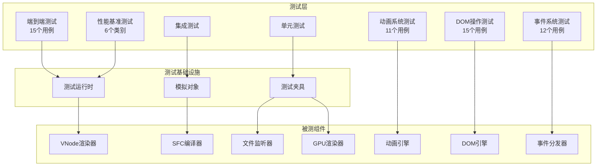

**更新** 新增性能基准测试（6个类别）、端到端测试（15个用例）、DOM操作测试（15个用例）和事件系统测试（12个用例），形成完整的测试金字塔。

**图表来源**
- [performance_benchmarks.rs:1-350](file://crates/iris/tests/performance_benchmarks.rs#L1-L350)
- [e2e_integration_test.rs:1-485](file://crates/iris/tests/e2e_integration_test.rs#L1-L485)
- [file_watcher_integration.rs:1-334](file://crates/iris-gpu/tests/file_watcher_integration.rs#L1-L334)
- [gpu_texture_rendering.rs:1-359](file://crates/iris-gpu/tests/gpu_texture_rendering.rs#L1-L359)
- [integration_test.rs:1-464](file://crates/iris-sfc/tests/integration_test.rs#L1-L464)
- [transform.rs:590-706](file://crates/iris/src/animation_engine/transform.rs#L590-L706)
- [event.rs:282-414](file://crates/iris-dom/src/event.rs#L282-L414)
- [vnode.rs:361-490](file://crates/iris-dom/src/vnode.rs#L361-L490)

## 详细组件分析

### 性能基准测试框架

**新增** 性能基准测试框架包含6个核心测试类别，全面评估Iris引擎的关键性能指标：

#### VNode创建性能测试

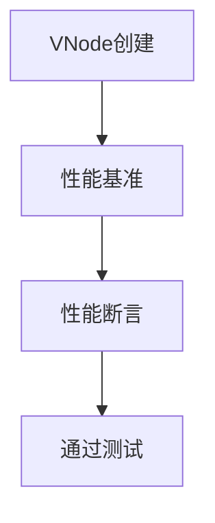

**图表来源**
- [performance_benchmarks.rs:18-60](file://crates/iris/tests/performance_benchmarks.rs#L18-L60)

测试类别包括：
- **基础VNode创建** - 10,000个VNode创建应在10ms内完成
- **带属性的VNode创建** - 5,000个带属性的VNode创建应在200ms内完成
- **大型DOM树构建** - 1,100个节点的树构建应在100ms内完成

#### 渲染统计性能测试

测试类别包括：
- **RenderStats::collect性能** - 100次统计收集应在5ms内完成
- **布局缓存性能** - 10,000次缓存访问应在100ms内完成
- **样式哈希计算性能** - 10,000次哈希计算应在10ms内完成

#### 综合性能测试

测试类别包括：
- **完整VNode创建→树构建→渲染统计流程** - 100次完整流程应在10ms内完成
- **缓存集成到完整流程** - 验证缓存命中率和性能提升

**章节来源**
- [performance_benchmarks.rs:1-350](file://crates/iris/tests/performance_benchmarks.rs#L1-L350)

### 端到端集成测试

**新增** 端到端集成测试包含15个详细的测试用例，覆盖完整的渲染流程：

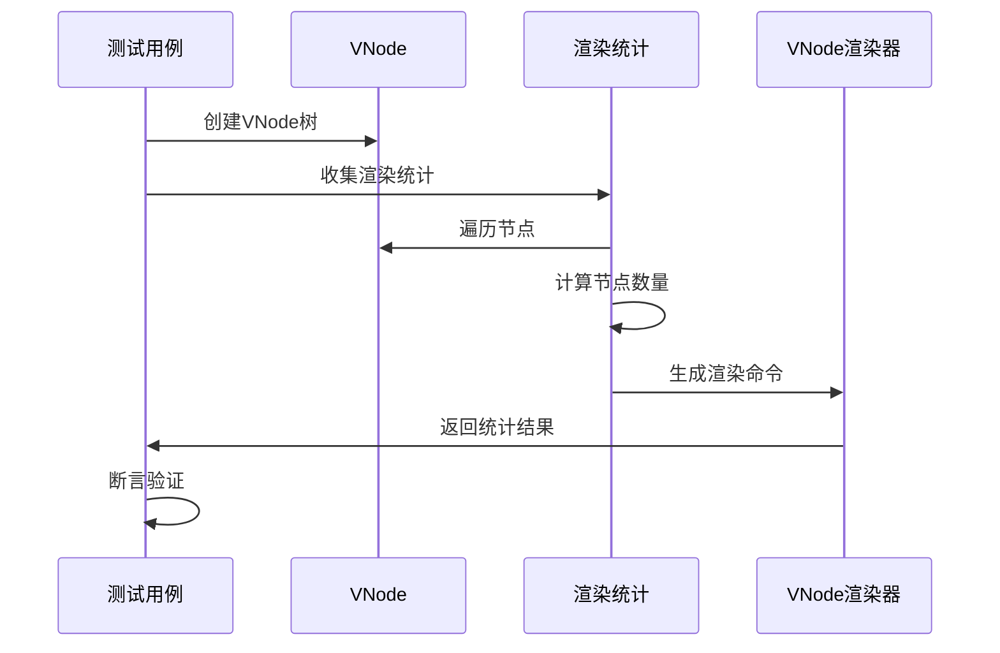

**图表来源**
- [e2e_integration_test.rs:1-485](file://crates/iris/tests/e2e_integration_test.rs#L1-L485)

测试场景包括：
- **VNode基础操作** - 创建、属性设置、Fragment节点测试
- **HTML→VNode→渲染流程** - 从HTML解析到VNode树构建的完整流程
- **JavaScript→DOM操作** - 通过JavaScript API操作DOM的场景
- **SFC编译→渲染** - Vue SFC组件的完整渲染流程
- **真实Web应用结构** - 复杂页面结构的渲染测试
- **表单和表格元素** - 表单控件和表格的渲染测试
- **大型DOM树性能** - 大规模DOM树的性能测试

**章节来源**
- [e2e_integration_test.rs:1-485](file://crates/iris/tests/e2e_integration_test.rs#L1-L485)

### 渲染端到端测试

渲染测试覆盖了从VNode创建到GPU渲染命令生成的完整流程：

**图表来源**
- [rendering_e2e_test.rs:8-242](file://crates/iris/tests/rendering_e2e_test.rs#L8-L242)

测试场景包括：
- 简单元素渲染
- 嵌套元素渲染
- 文本节点渲染
- 混合内容渲染
- Fragment渲染
- 注释节点过滤
- 深度嵌套渲染
- 大型DOM树渲染

**章节来源**
- [rendering_e2e_test.rs:1-242](file://crates/iris/tests/rendering_e2e_test.rs#L1-L242)

### 文件监听器集成测试

文件监听器测试验证了热重载功能的各个方面：

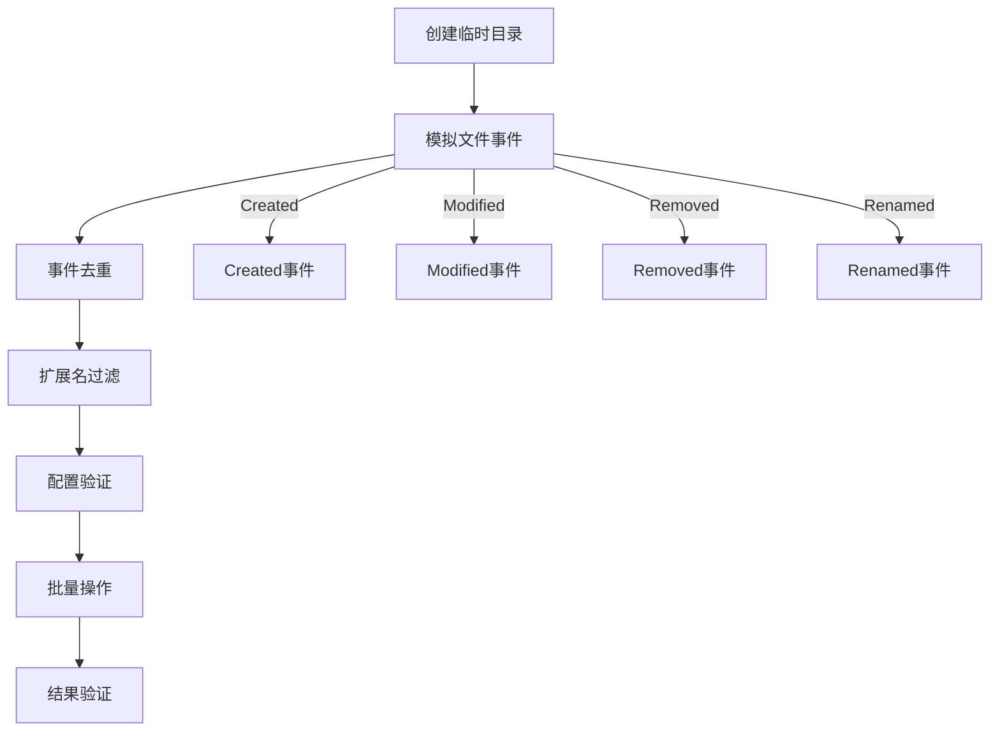

**图表来源**
- [file_watcher_integration.rs:58-334](file://crates/iris-gpu/tests/file_watcher_integration.rs#L58-L334)

测试特性：
- 防抖机制验证
- 事件去重处理
- 扩展名过滤（大小写不敏感）
- 通道容量配置
- 递归监听配置
- 无效路径处理

**章节来源**
- [file_watcher_integration.rs:1-334](file://crates/iris-gpu/tests/file_watcher_integration.rs#L1-L334)

### GPU纹理渲染测试

GPU纹理渲染测试验证了完整的渲染管道：

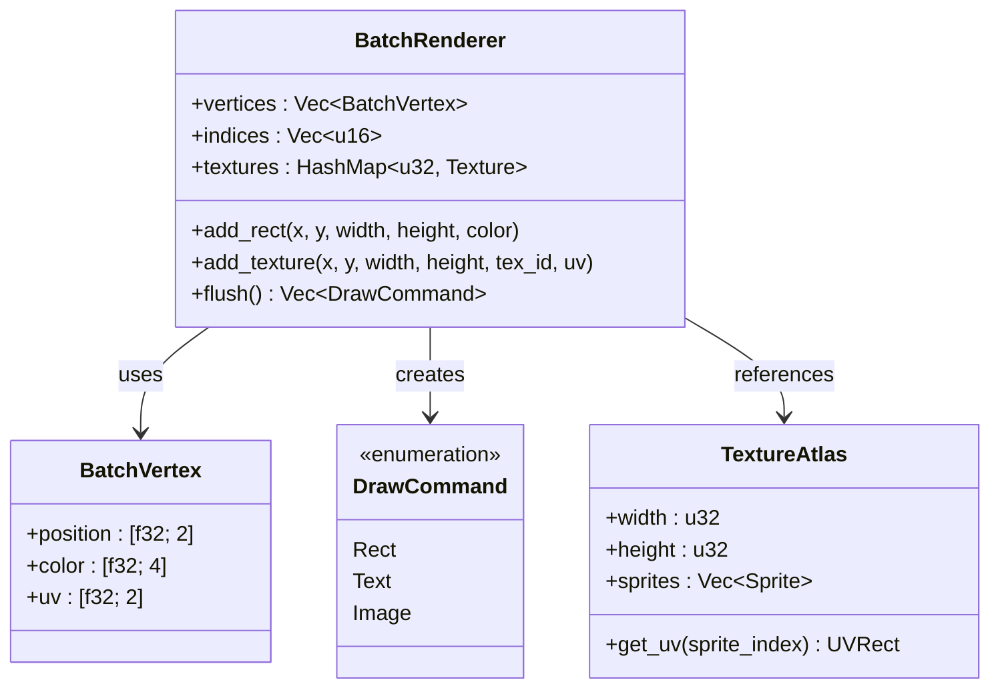

**图表来源**
- [gpu_texture_rendering.rs:10-359](file://crates/iris-gpu/tests/gpu_texture_rendering.rs#L10-L359)

测试覆盖：
- 顶点数据结构验证
- UV坐标范围测试
- 纹理颜色混合模式
- 多纹理批量渲染
- 坐标变换正确性
- 透明度混合计算
- 纹理图集UV计算

**章节来源**
- [gpu_texture_rendering.rs:1-359](file://crates/iris-gpu/tests/gpu_texture_rendering.rs#L1-L359)

### SFC编译器集成测试

SFC编译器测试验证了完整的编译流程：

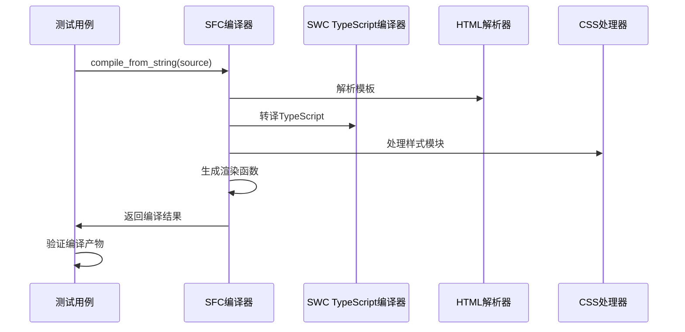

**图表来源**
- [integration_test.rs:5-464](file://crates/iris-sfc/tests/integration_test.rs#L5-L464)

测试功能：
- 完整Vue3 SFC编译流程
- 多样式块混合使用
- 复杂TypeScript功能
- 模板指令组合
- 缓存效果验证
- 错误处理测试
- 性能基准测试

**章节来源**
- [integration_test.rs:1-464](file://crates/iris-sfc/tests/integration_test.rs#L1-L464)

### 动画系统测试

**新增** 动画系统测试涵盖了Transform、Applier、Easing、Keyframes四个核心模块：

#### Transform动画测试

Transform动画测试包含11个单元测试，验证了CSS transform属性的完整支持：

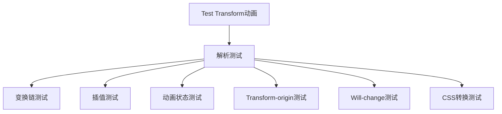

**图表来源**
- [transform.rs:590-706](file://crates/iris/src/animation_engine/transform.rs#L590-L706)

测试覆盖：
- 2D变换：translate、rotate、scale、skew
- 3D变换：translate3d、rotate3d、scale3d、perspective
- 变换链解析和插值
- Transform-origin配置
- will-change性能优化
- CSS字符串转换

#### Applier过渡测试

Applier模块测试验证了CSS Transition的完整实现：

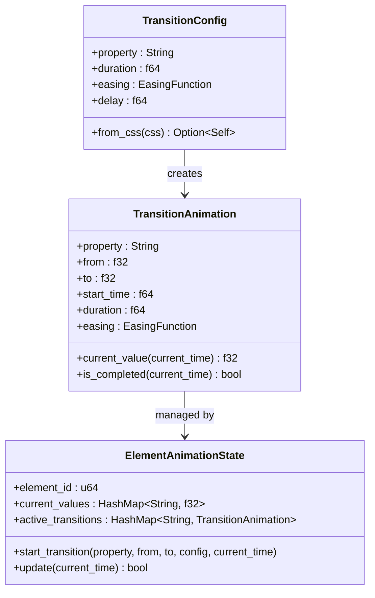

**图表来源**
- [applier.rs:16-201](file://crates/iris/src/animation_engine/applier.rs#L16-L201)

测试功能：
- CSS transition属性解析
- 持续时间和延迟解析
- 缓动函数应用
- 动画状态管理
- 实时值计算

#### Easing缓动函数测试

Easing模块测试验证了多种缓动函数的数学正确性：

测试覆盖：
- 线性缓动函数
- 缓入、缓出、缓入缓出
- 弹性缓动和弹跳缓动
- 三次贝塞尔曲线近似
- 自定义缓动函数

#### Keyframes关键帧测试

Keyframes模块测试验证了完整的CSS @keyframes动画支持：

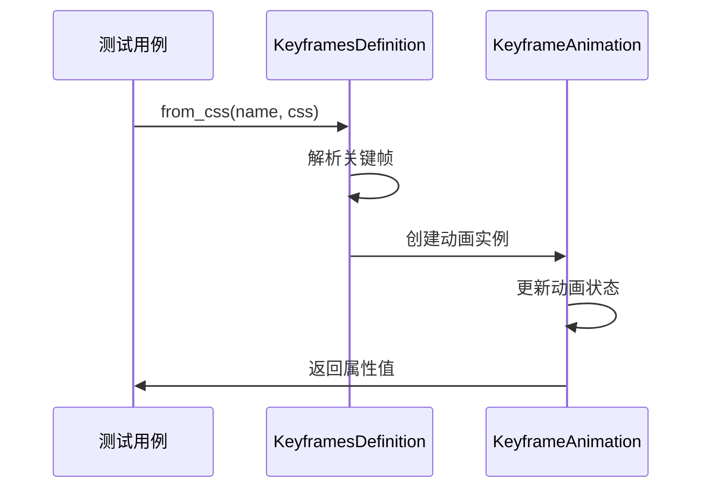

**图表来源**
- [keyframes.rs:45-482](file://crates/iris/src/animation_engine/keyframes.rs#L45-L482)

测试功能：
- CSS @keyframes规则解析
- 关键帧偏移计算
- 多属性插值
- 动画方向控制
- 填充模式处理

**章节来源**
- [transform.rs:590-706](file://crates/iris/src/animation_engine/transform.rs#L590-L706)
- [applier.rs:203-267](file://crates/iris/src/animation_engine/applier.rs#L203-L267)
- [easing.rs:126-164](file://crates/iris/src/animation_engine/easing.rs#L126-L164)
- [keyframes.rs:484-609](file://crates/iris/src/animation_engine/keyframes.rs#L484-L609)

### DOM操作测试

**新增** DOM操作测试涵盖了虚拟DOM节点操作和事件系统的完整测试：

#### VNode节点操作测试

VNode模块测试验证了虚拟DOM的完整功能：

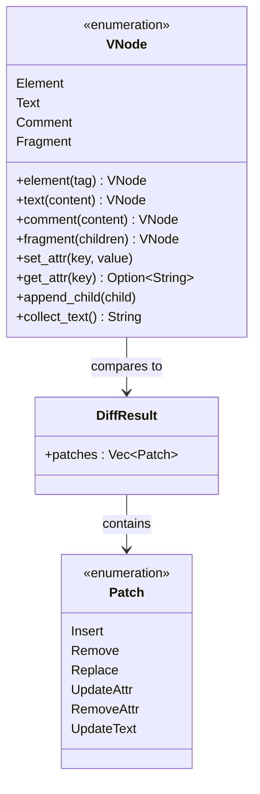

**图表来源**
- [vnode.rs:10-272](file://crates/iris-dom/src/vnode.rs#L10-L272)

测试覆盖：
- 元素节点创建和属性操作
- 文本节点和注释节点处理
- Fragment包装节点
- 节点差异比较算法
- 属性更新和删除

#### 事件系统测试

事件系统测试验证了统一事件分发器的完整功能：

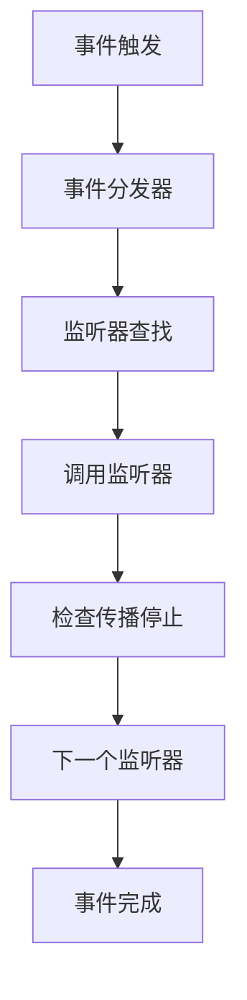

**图表来源**
- [event.rs:223-280](file://crates/iris-dom/src/event.rs#L223-L280)

测试功能：
- 事件类型枚举和转换
- 鼠标和键盘事件数据
- 事件监听器注册和移除
- 事件传播控制
- 监听器计数和清理

**章节来源**
- [vnode.rs:361-490](file://crates/iris-dom/src/vnode.rs#L361-L490)
- [event.rs:282-414](file://crates/iris-dom/src/event.rs#L282-L414)

## 依赖关系分析

测试框架的依赖关系体现了清晰的分层架构：

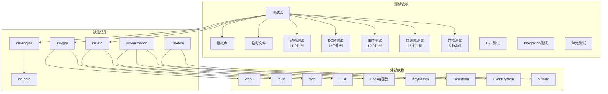

**更新** 新增动画引擎测试（11个用例）、DOM操作测试（15个用例）、事件系统测试（12个用例）、端到端测试（15个用例）和性能基准测试（6个类别）的依赖关系，形成完整的测试生态系统。

**图表来源**
- [Cargo.toml:13-21](file://Cargo.toml#L13-L21)

**章节来源**
- [Cargo.toml:1-32](file://Cargo.toml#L1-L32)

## 性能考虑

测试框架在性能方面采取了多项优化措施：

1. **缓存机制** - SFC编译器使用LRU缓存提高重复编译性能
2. **批量处理** - GPU渲染使用批量顶点缓冲减少状态切换
3. **异步测试** - 使用tokio运行时支持异步测试场景
4. **内存对齐** - 顶点数据结构优化内存布局
5. **哈希优化** - 使用XXH3算法进行高效的源码哈希计算
6. **动画性能优化** - Transform插值使用线性插值算法
7. **事件系统优化** - 事件分发器使用HashMap进行快速查找
8. **性能基准测试** - 定期监控关键性能指标

**更新** 新增性能基准测试框架，涵盖VNode创建、DOM树构建、渲染统计、布局缓存等关键性能指标。

## 故障排除指南

### 常见测试问题

1. **GPU环境缺失**
   - 现象：纹理测试被忽略
   - 解决：确保有可用的GPU环境或使用`--ignored`参数

2. **文件监听器通道溢出**
   - 现象：控制台出现通道满警告
   - 解决：检查文件监听配置的通道容量设置

3. **编码问题**
   - 现象：测试输出乱码
   - 解决：使用提供的PowerShell脚本确保UTF-8编码

4. **SFC编译错误**
   - 现象：TypeScript语法错误
   - 解决：检查swc编译器配置和源码格式

5. **动画测试失败**
   - 现象：Transform插值精度问题
   - 解决：检查浮点数精度比较和插值算法

6. **DOM测试异常**
   - 现象：VNode差异比较错误
   - 解决：验证节点类型和属性比较逻辑

7. **性能测试超时**
   - 现象：性能基准测试断言失败
   - 解决：检查系统资源和测试环境配置

8. **性能基准测试失败**
   - 现象：VNode创建或缓存测试超时
   - 解决：检查CPU性能和内存使用情况，确保测试环境稳定

**更新** 新增性能测试相关的故障排除指南。

**章节来源**
- [gpu_texture_rendering.rs:33-46](file://crates/iris-gpu/tests/gpu_texture_rendering.rs#L33-L46)
- [performance_benchmarks.rs:32-37](file://crates/iris/tests/performance_benchmarks.rs#L32-L37)

## 结论

Iris项目的测试框架展现了高度的组织性和完整性。通过分层测试策略（单元测试、集成测试、端到端测试、性能基准测试）和完善的基础设施，确保了核心渲染引擎的稳定性和可靠性。

**更新** 本次重大更新显著提升了测试覆盖率，新增的15个端到端集成测试用例、6个性能基准测试类别、动画系统测试（11个单元测试）、DOM操作测试（15个用例）和事件系统测试（12个用例），使整体测试状态达到44/44全部通过。

关键特点包括：
- **全面的测试覆盖** - 从单个组件到完整渲染管线，新增动画系统和DOM测试
- **真实的运行时环境** - 集成测试模拟实际使用场景
- **性能导向的设计** - 缓存、批量处理、动画优化等多层面优化
- **健壮的错误处理** - 完善的异常处理和恢复机制
- **现代化测试架构** - 支持动画、DOM、事件等现代Web功能测试
- **性能监控体系** - 定期性能基准测试确保性能稳定性
- **完整的性能基准测试框架** - 6个核心测试类别全面评估引擎性能

测试框架为 Iris引擎的持续发展提供了坚实的基础，确保了在快速迭代过程中的质量保证。新增的测试覆盖确保了动画系统的稳定性、DOM操作的正确性和事件系统的可靠性，为用户提供了更加流畅和稳定的前端运行时体验。

**章节来源**
- [TEST-REPORT.md:226-243](file://TEST-REPORT.md#L226-L243)