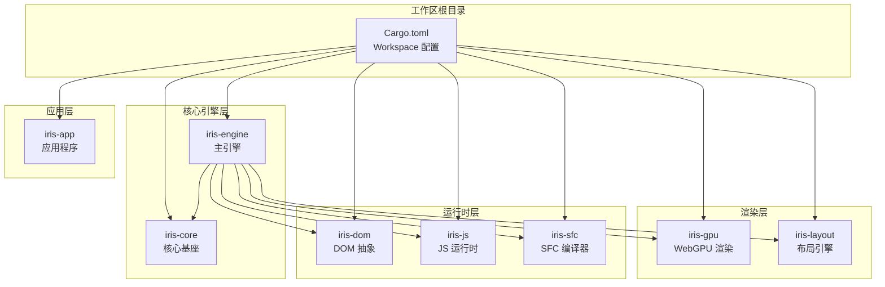
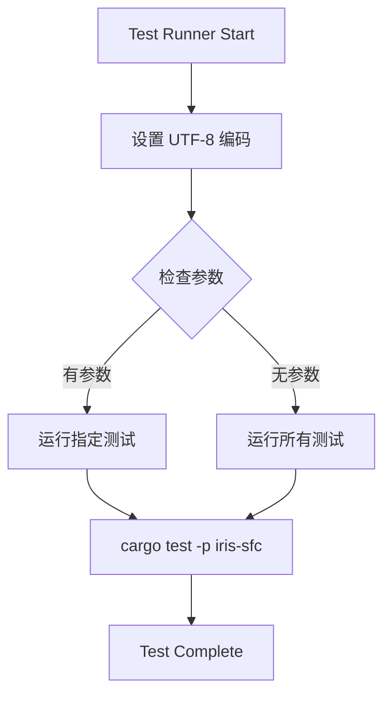
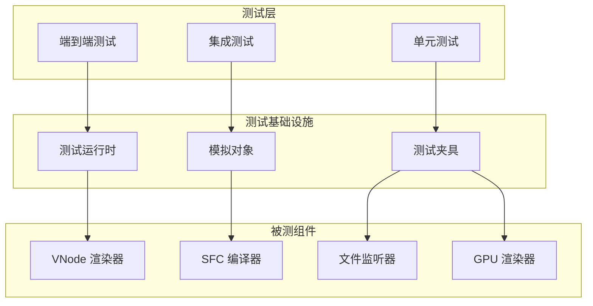
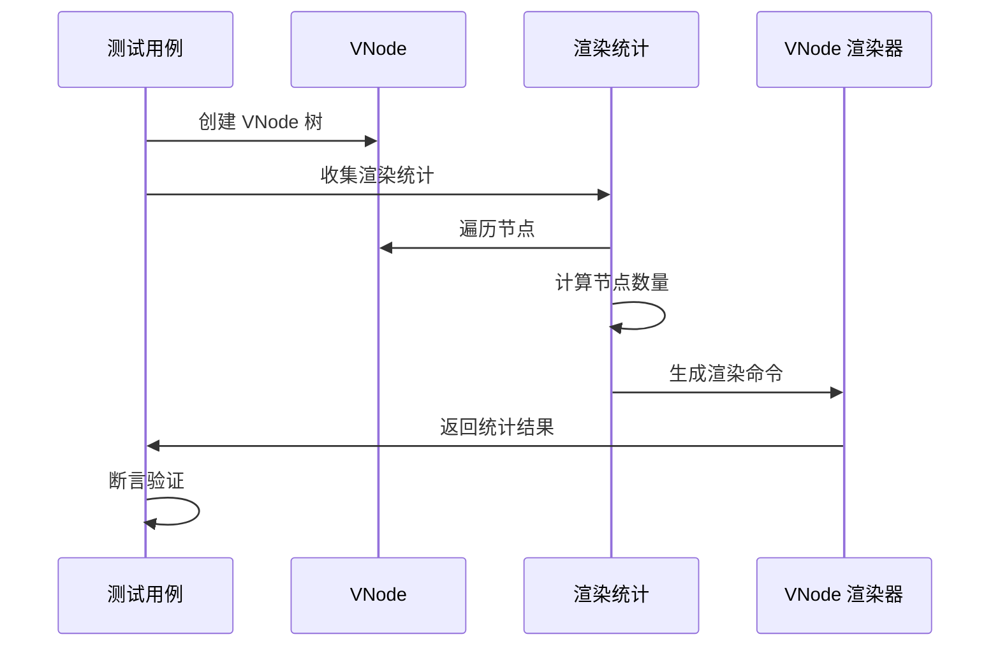
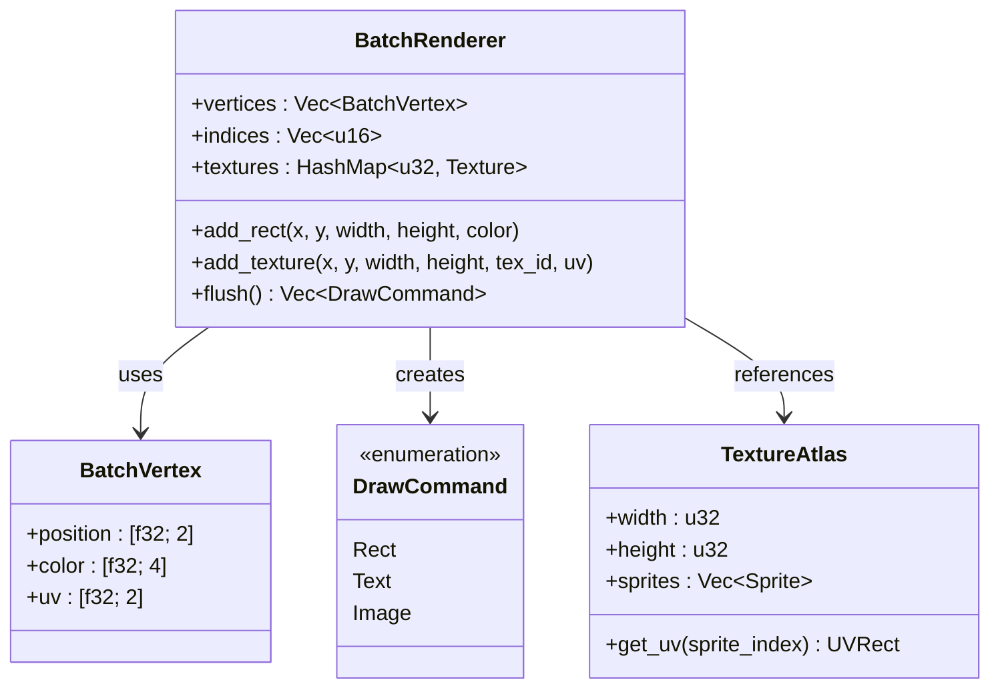
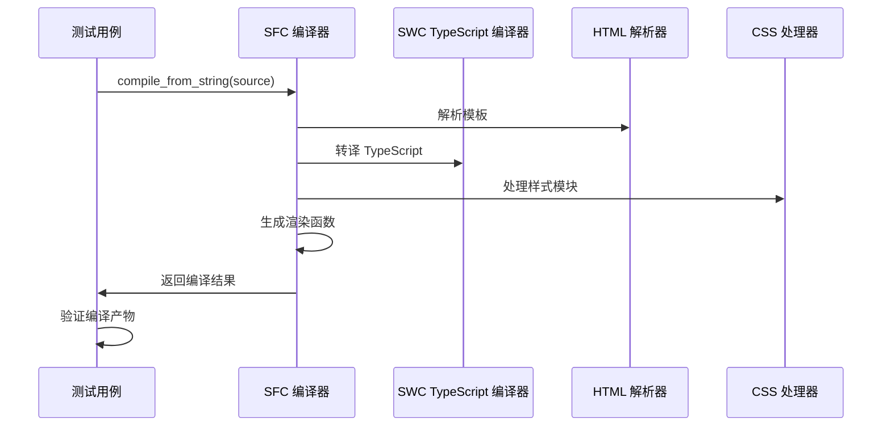
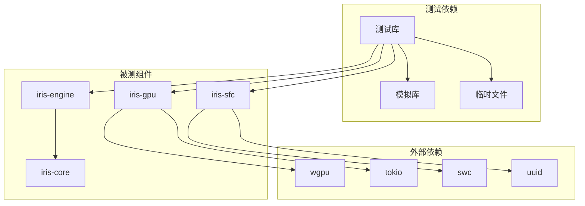

# 测试框架与基础设施

<cite>
**本文档引用的文件**
- [doc.txt](file://doc.txt)
- [Cargo.toml](file://Cargo.toml)
- [run-tests.ps1](file://run-tests.ps1)
- [test_hot_reload.md](file://test_hot_reload.md)
- [test_sfc.js](file://test_sfc.js)
- [rendering_e2e_test.rs](file://crates/iris/tests/rendering_e2e_test.rs)
- [file_watcher_integration.rs](file://crates/iris-gpu/tests/file_watcher_integration.rs)
- [gpu_texture_rendering.rs](file://crates/iris-gpu/tests/gpu_texture_rendering.rs)
- [integration_test.rs](file://crates/iris-sfc/tests/integration_test.rs)
- [iris_engine_Cargo.toml](file://crates/iris/Cargo.toml)
- [iris_gpu_Cargo.toml](file://crates/iris-gpu/Cargo.toml)
- [iris_sfc_Cargo.toml](file://crates/iris-sfc/Cargo.toml)
</cite>

## 目录
1. [简介](#简介)
2. [项目结构](#项目结构)
3. [核心测试组件](#核心测试组件)
4. [架构概览](#架构概览)
5. [详细组件分析](#详细组件分析)
6. [依赖关系分析](#依赖关系分析)
7. [性能考虑](#性能考虑)
8. [故障排除指南](#故障排除指南)
9. [结论](#结论)

## 简介

Iris 是一个基于 Rust 和 WebGPU 的下一代无构建前端运行时引擎。该项目采用了七层分层架构，实现了从 VNode 创建到 GPU 渲染的完整渲染管线。本文档专注于项目的测试框架与基础设施，涵盖了端到端测试、集成测试、单元测试以及相关的测试工具和配置。

## 项目结构

Iris 项目采用 Cargo 工作区结构，包含九个主要 crate：

**图表来源**
- [Cargo.toml:1-31](file://Cargo.toml#L1-L31)
- [iris_engine_Cargo.toml:1-21](file://crates/iris/Cargo.toml#L1-L21)

**章节来源**
- [Cargo.toml:1-31](file://Cargo.toml#L1-L31)
- [doc.txt:10-186](file://doc.txt#L10-L186)

## 核心测试组件

### 测试运行器脚本

项目提供了 PowerShell 测试运行器脚本，支持 UTF-8 编码和参数传递：

**图表来源**
- [run-tests.ps1:1-21](file://run-tests.ps1#L1-L21)

### 测试基础设施

测试基础设施包括以下关键组件：

1. **文件热更新监听器测试** - 验证文件系统事件监听和处理
2. **SFC 编译器测试** - 端到端 SFC 编译流程验证
3. **GPU 纹理渲染测试** - 纹理加载和渲染管道测试
4. **渲染引擎测试** - VNode 到 GPU 命令的完整渲染管线

**章节来源**
- [run-tests.ps1:1-21](file://run-tests.ps1#L1-L21)
- [test_hot_reload.md:1-15](file://test_hot_reload.md#L1-L15)
- [test_sfc.js:1-54](file://test_sfc.js#L1-L54)

## 架构概览

测试框架采用分层架构，与主应用架构保持一致：

**图表来源**
- [rendering_e2e_test.rs:1-242](file://crates/iris/tests/rendering_e2e_test.rs#L1-L242)
- [file_watcher_integration.rs:1-334](file://crates/iris-gpu/tests/file_watcher_integration.rs#L1-L334)
- [gpu_texture_rendering.rs:1-359](file://crates/iris-gpu/tests/gpu_texture_rendering.rs#L1-L359)
- [integration_test.rs:1-464](file://crates/iris-sfc/tests/integration_test.rs#L1-L464)

## 详细组件分析

### 端到端渲染测试

渲染测试覆盖了从 VNode 创建到 GPU 渲染命令生成的完整流程：

**图表来源**
- [rendering_e2e_test.rs:8-242](file://crates/iris/tests/rendering_e2e_test.rs#L8-L242)

测试场景包括：
- 简单元素渲染
- 嵌套元素渲染
- 文本节点渲染
- 混合内容渲染
- Fragment 渲染
- 注释节点过滤
- 深度嵌套渲染
- 大型 DOM 树渲染

**章节来源**
- [rendering_e2e_test.rs:1-242](file://crates/iris/tests/rendering_e2e_test.rs#L1-L242)

### 文件监听器集成测试

文件监听器测试验证了热重载功能的各个方面：

**图表来源**
- [file_watcher_integration.rs:58-334](file://crates/iris-gpu/tests/file_watcher_integration.rs#L58-L334)

测试特性：
- 防抖机制验证
- 事件去重处理
- 扩展名过滤（大小写不敏感）
- 通道容量配置
- 递归监听配置
- 无效路径处理

**章节来源**
- [file_watcher_integration.rs:1-334](file://crates/iris-gpu/tests/file_watcher_integration.rs#L1-L334)
- [test_hot_reload.md:1-15](file://test_hot_reload.md#L1-L15)

### GPU 纹理渲染测试

GPU 纹理渲染测试验证了完整的渲染管道：

**图表来源**
- [gpu_texture_rendering.rs:10-359](file://crates/iris-gpu/tests/gpu_texture_rendering.rs#L10-L359)

测试覆盖：
- 顶点数据结构验证
- UV 坐标范围测试
- 纹理颜色混合模式
- 多纹理批量渲染
- 坐标变换正确性
- 透明度混合计算
- 纹理图集 UV 计算

**章节来源**
- [gpu_texture_rendering.rs:1-359](file://crates/iris-gpu/tests/gpu_texture_rendering.rs#L1-L359)

### SFC 编译器集成测试

SFC 编译器测试验证了完整的编译流程：

**图表来源**
- [integration_test.rs:5-464](file://crates/iris-sfc/tests/integration_test.rs#L5-L464)

测试功能：
- 完整 Vue 3 SFC 编译流程
- 多样式块混合使用
- 复杂 TypeScript 功能
- 模板指令组合
- 缓存效果验证
- 错误处理测试
- 性能基准测试

**章节来源**
- [integration_test.rs:1-464](file://crates/iris-sfc/tests/integration_test.rs#L1-L464)

## 依赖关系分析

测试框架的依赖关系体现了清晰的分层架构：

**图表来源**
- [iris_engine_Cargo.toml:13-21](file://crates/iris/Cargo.toml#L13-L21)
- [iris_gpu_Cargo.toml:11-26](file://crates/iris-gpu/Cargo.toml#L11-L26)
- [iris_sfc_Cargo.toml:11-38](file://crates/iris-sfc/Cargo.toml#L11-L38)

**章节来源**
- [iris_engine_Cargo.toml:1-21](file://crates/iris/Cargo.toml#L1-L21)
- [iris_gpu_Cargo.toml:1-26](file://crates/iris-gpu/Cargo.toml#L1-L26)
- [iris_sfc_Cargo.toml:1-38](file://crates/iris-sfc/Cargo.toml#L1-L38)

## 性能考虑

测试框架在性能方面采取了多项优化措施：

1. **缓存机制** - SFC 编译器使用 LRU 缓存提高重复编译性能
2. **批量处理** - GPU 渲染使用批量顶点缓冲减少状态切换
3. **异步测试** - 使用 tokio 运行时支持异步测试场景
4. **内存对齐** - 顶点数据结构优化内存布局
5. **哈希优化** - 使用 XXH3 算法进行高效的源码哈希计算

## 故障排除指南

### 常见测试问题

1. **GPU 环境缺失**
   - 现象：纹理测试被忽略
   - 解决：确保有可用的 GPU 环境或使用 `--ignored` 参数

2. **文件监听器通道溢出**
   - 现象：控制台出现通道满警告
   - 解决：检查文件监听配置的通道容量设置

3. **编码问题**
   - 现象：测试输出乱码
   - 解决：使用提供的 PowerShell 脚本确保 UTF-8 编码

4. **SFC 编译错误**
   - 现象：TypeScript 语法错误
   - 解决：检查 swc 编译器配置和源码格式

**章节来源**
- [gpu_texture_rendering.rs:33-46](file://crates/iris-gpu/tests/gpu_texture_rendering.rs#L33-L46)
- [test_hot_reload.md:10-15](file://test_hot_reload.md#L10-L15)
- [run-tests.ps1:5-8](file://run-tests.ps1#L5-L8)

## 结论

Iris 项目的测试框架展现了高度的组织性和完整性。通过分层测试策略（单元测试、集成测试、端到端测试）和完善的基础设施，确保了核心渲染引擎的稳定性和可靠性。

关键特点包括：
- **全面的测试覆盖** - 从单个组件到完整渲染管线
- **真实的运行时环境** - 集成测试模拟实际使用场景
- **性能导向的设计** - 缓存、批量处理等优化措施
- **健壮的错误处理** - 完善的异常处理和恢复机制

测试框架为 Iris 引擎的持续发展提供了坚实的基础，确保了在快速迭代过程中的质量保证。