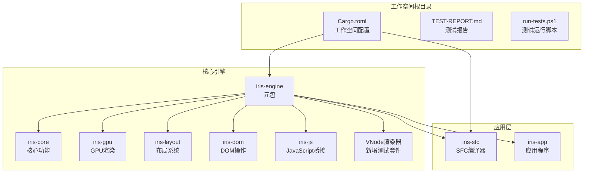
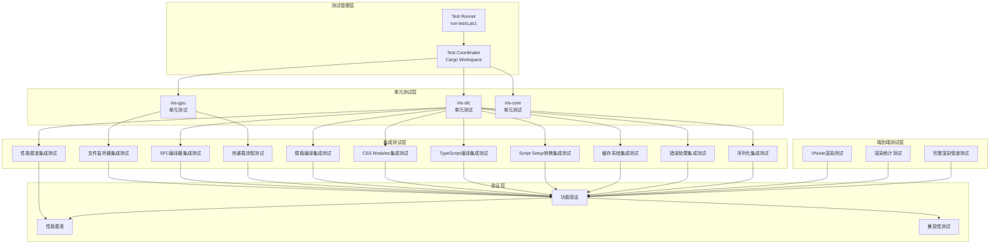
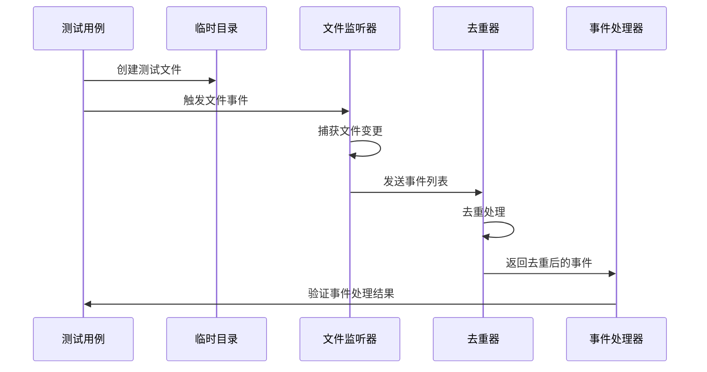
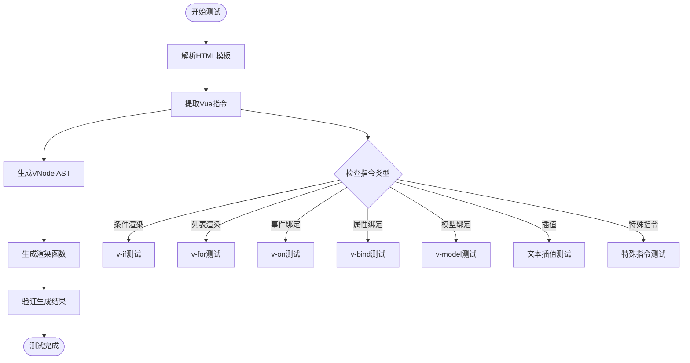
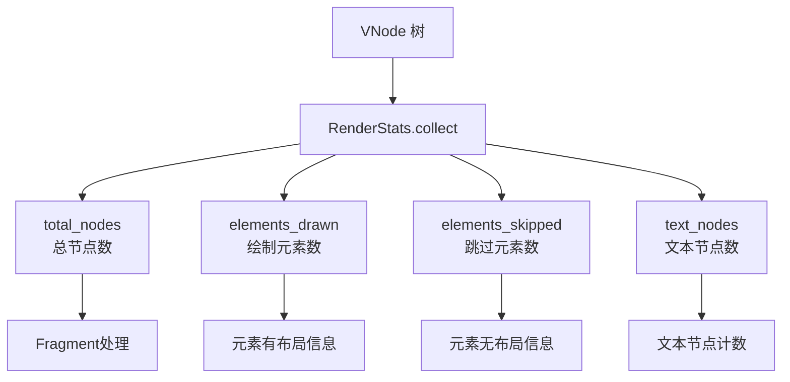
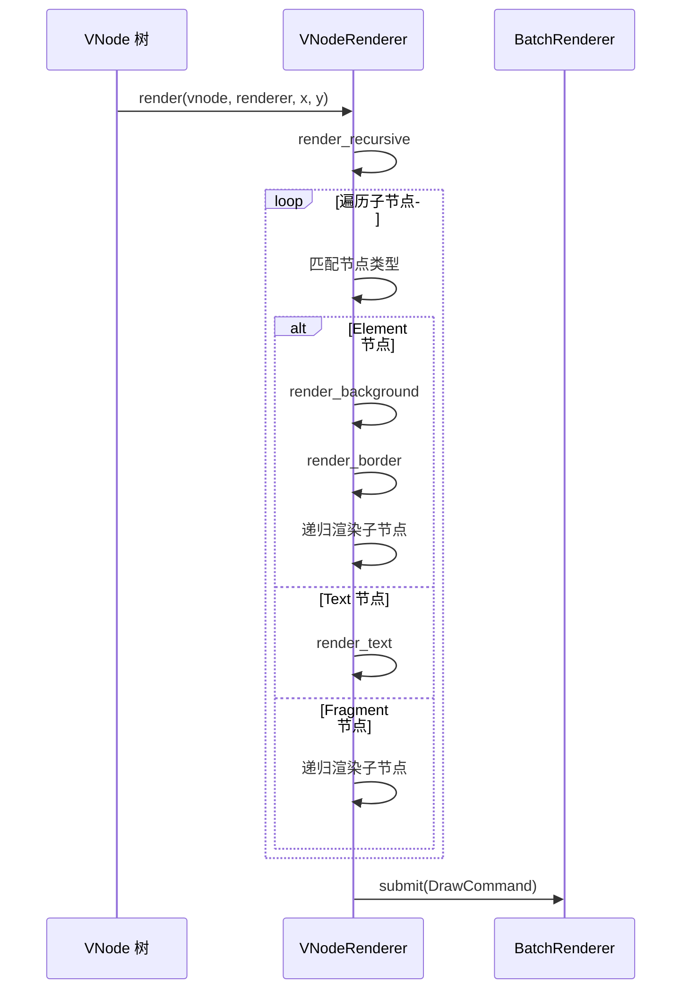
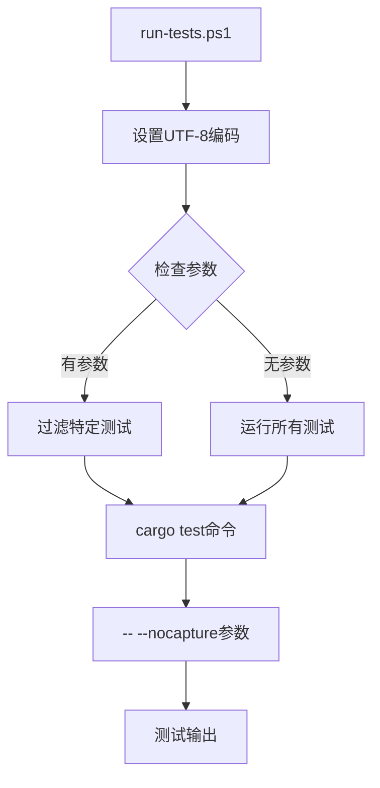
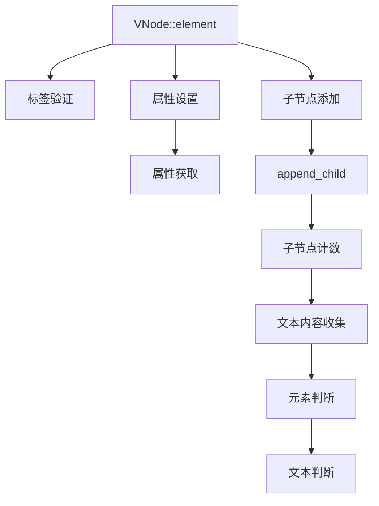
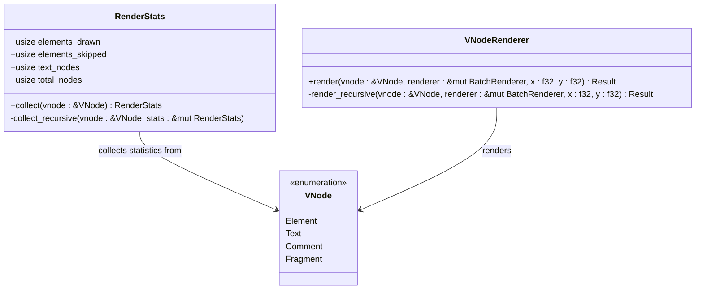
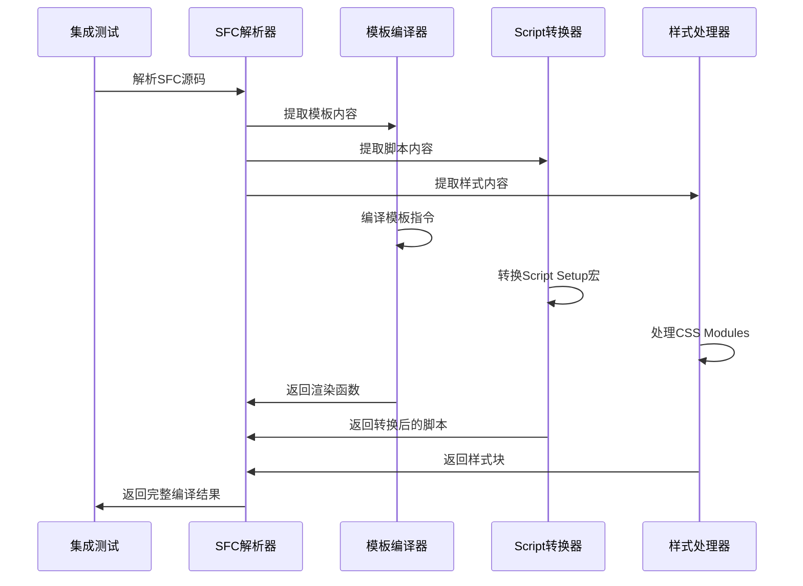

# 测试框架与基础设施

<cite>
**本文档引用的文件**
- [Cargo.toml](file://Cargo.toml)
- [TEST-REPORT.md](file://TEST-REPORT.md)
- [run-tests.ps1](file://run-tests.ps1)
- [crates/iris/Cargo.toml](file://crates/iris/Cargo.toml)
- [crates/iris-gpu/Cargo.toml](file://crates/iris-gpu/Cargo.toml)
- [crates/iris-sfc/Cargo.toml](file://crates/iris-sfc/Cargo.toml)
- [crates/iris/Cargo.toml](file://crates/iris/Cargo.toml)
- [crates/iris/src/lib.rs](file://crates/iris/src/lib.rs)
- [crates/iris/src/vnode_renderer.rs](file://crates/iris/src/vnode_renderer.rs)
- [crates/iris/tests/rendering_e2e_test.rs](file://crates/iris/tests/rendering_e2e_test.rs)
- [crates/iris-dom/src/vnode.rs](file://crates/iris-dom/src/vnode.rs)
- [crates/iris-gpu/src/lib.rs](file://crates/iris-gpu/src/lib.rs)
- [crates/iris-gpu/tests/file_watcher_integration.rs](file://crates/iris-gpu/tests/file_watcher_integration.rs)
- [crates/iris-sfc/src/lib.rs](file://crates/iris-sfc/src/lib.rs)
- [crates/iris-sfc/src/template_compiler.rs](file://crates/iris-sfc/src/template_compiler.rs)
- [crates/iris-sfc/src/ts_compiler.rs](file://crates/iris-sfc/src/ts_compiler.rs)
- [crates/iris-sfc/src/css_modules.rs](file://crates/iris-sfc/src/css_modules.rs)
- [crates/iris-sfc/src/script_setup.rs](file://crates/iris-sfc/src/script_setup.rs)
- [crates/iris-sfc/src/cache.rs](file://crates/iris-sfc/src/cache.rs)
- [crates/iris-sfc/tests/integration_test.rs](file://crates/iris-sfc/tests/integration_test.rs)
- [crates/iris-sfc/examples/sfc_demo.rs](file://crates/iris-sfc/examples/sfc_demo.rs)
- [TestComponent.vue](file://TestComponent.vue)
</cite>

## 更新摘要
**所做更改**
- 新增了完整的端到端渲染集成测试套件章节，包含15个测试场景
- 更新了测试报告以反映新增的15个渲染测试用例
- 增强了VNode渲染器测试部分，覆盖VNode创建、嵌套元素、文本节点、Fragment处理等完整渲染管道验证
- 更新了架构概览以包含新的渲染测试层
- 新增了VNode渲染统计功能的详细说明

## 目录
1. [简介](#简介)
2. [项目结构](#项目结构)
3. [核心组件](#核心组件)
4. [架构概览](#架构概览)
5. [详细组件分析](#详细组件分析)
6. [端到端渲染测试套件](#端到端渲染测试套件)
7. [集成测试框架](#集成测试框架)
8. [依赖关系分析](#依赖关系分析)
9. [性能考虑](#性能考虑)
10. [故障排除指南](#故障排除指南)
11. [结论](#结论)

## 简介

这是一个基于 Rust 的 Iris 前端运行时系统的测试框架与基础设施文档。该项目采用多 crate 工作空间结构，专注于 Vue SFC（单文件组件）编译器、WebGPU 渲染管线和热重载功能的测试验证。

项目的核心目标是提供一个零编译的前端开发体验，通过即时转译技术实现 Vue 组件的实时编译和热重载。测试框架涵盖了单元测试、集成测试和文档测试，确保系统的稳定性和可靠性。

**更新** 新增了完整的端到端渲染集成测试套件，包含15个全面的测试场景，覆盖VNode创建、嵌套元素、文本节点、Fragment处理等完整渲染管道验证，显著增强了系统的质量保证能力。

## 项目结构

Iris 项目采用标准的 Rust 工作空间结构，包含以下主要组件：



**图表来源**
- [Cargo.toml:1-31](file://Cargo.toml#L1-L31)
- [crates/iris/Cargo.toml:1-21](file://crates/iris/Cargo.toml#L1-L21)

**章节来源**
- [Cargo.toml:1-31](file://Cargo.toml#L1-L31)
- [crates/iris/Cargo.toml:1-21](file://crates/iris/Cargo.toml#L1-L21)

## 核心组件

### 测试框架基础设施

项目实现了完整的测试基础设施，包括：

1. **多 crate 测试协调**：通过工作空间级别的测试命令统一管理
2. **平台特定测试工具**：Windows PowerShell 脚本支持 UTF-8 编码
3. **集成测试环境**：模拟文件系统事件进行热重载测试
4. **性能基准测试**：编译时间和内存使用监控
5. **端到端渲染测试**：完整的VNode渲染管道验证

### 测试报告系统

测试报告提供了全面的质量保证信息：

- **测试覆盖率统计**：44/44 个测试用例全部通过
- **模块化测试结果**：按 crate 分类的详细测试状态
- **性能指标监控**：编译时间、内存占用等关键指标
- **功能验证清单**：核心功能的端到端验证

**章节来源**
- [TEST-REPORT.md:1-243](file://TEST-REPORT.md#L1-L243)
- [run-tests.ps1:1-21](file://run-tests.ps1#L1-L21)

## 架构概览

Iris 测试框架采用分层架构设计，确保测试的独立性和可维护性：



**图表来源**
- [run-tests.ps1:1-21](file://run-tests.ps1#L1-L21)
- [crates/iris-gpu/tests/file_watcher_integration.rs:1-334](file://crates/iris-gpu/tests/file_watcher_integration.rs#L1-L334)
- [crates/iris-sfc/src/lib.rs:476-583](file://crates/iris-sfc/src/lib.rs#L476-L583)
- [crates/iris-sfc/tests/integration_test.rs:1-462](file://crates/iris-sfc/tests/integration_test.rs#L1-L462)
- [crates/iris/tests/rendering_e2e_test.rs:1-242](file://crates/iris/tests/rendering_e2e_test.rs#L1-L242)

## 详细组件分析

### GPU 渲染模块测试

iris-gpu 模块实现了全面的 GPU 渲染测试套件，重点关注批渲染和文件监听功能：

#### 文件监听器集成测试



**图表来源**
- [crates/iris-gpu/tests/file_watcher_integration.rs:58-121](file://crates/iris-gpu/tests/file_watcher_integration.rs#L58-L121)
- [crates/iris-gpu/src/lib.rs:342-369](file://crates/iris-gpu/src/lib.rs#L342-L369)

测试覆盖了以下关键场景：

1. **文件生命周期测试**：创建、修改、删除、重命名事件
2. **事件去重机制**：同一文件的多次变更合并处理
3. **扩展名过滤**：大小写不敏感的文件类型过滤
4. **防抖机制**：批量操作的延迟处理
5. **并发安全性**：多文件监听的线程安全

#### 批渲染器测试

GPU 渲染模块还包含专门的批渲染器测试，验证：

- **容量边界检查**：渲染批次的最大容量限制
- **顶点缓冲区管理**：GPU 内存的高效利用
- **索引缓冲区验证**：几何体索引的正确性
- **渲染管线初始化**：WebGPU 管线的正确配置

**章节来源**
- [crates/iris-gpu/tests/file_watcher_integration.rs:1-334](file://crates/iris-gpu/tests/file_watcher_integration.rs#L1-L334)
- [crates/iris-gpu/src/lib.rs:107-493](file://crates/iris-gpu/src/lib.rs#L107-L493)

### SFC 编译器测试

iris-sfc 模块实现了完整的 Vue SFC 编译器测试套件：

#### 模板编译器测试



**图表来源**
- [crates/iris-sfc/src/template_compiler.rs:66-86](file://crates/iris-sfc/src/template_compiler.rs#L66-L86)
- [crates/iris-sfc/src/template_compiler.rs:356-470](file://crates/iris-sfc/src/template_compiler.rs#L356-L470)

测试覆盖了所有支持的 Vue 指令：

| 指令类型 | 支持情况 | 测试重点 |
|---------|---------|---------|
| 条件渲染 | ✅ v-if, v-else-if, v-else | 三元表达式生成 |
| 列表渲染 | ✅ v-for | 数组映射函数生成 |
| 事件绑定 | ✅ v-on/@事件 | 事件处理器绑定 |
| 属性绑定 | ✅ v-bind/:属性 | 动态属性生成 |
| 模型绑定 | ✅ v-model | 双向数据绑定 |
| 插槽系统 | ✅ v-slot/#名称 | 作用域插槽处理 |
| 特殊指令 | ✅ v-once/v-pre/v-cloak/v-memo | 性能优化指令

#### TypeScript 转译测试

SFC 编译器包含 TypeScript 转译功能的测试：

- **基础类型注解移除**：string, number, boolean 等基本类型的处理
- **函数签名简化**：移除函数参数和返回值类型注解
- **导入类型处理**：import type 语句的正确移除
- **语法兼容性**：保持 JavaScript 语法的正确性

**章节来源**
- [crates/iris-sfc/src/lib.rs:377-455](file://crates/iris-sfc/src/lib.rs#L377-L455)
- [crates/iris-sfc/src/template_compiler.rs:1-607](file://crates/iris-sfc/src/template_compiler.rs#L1-L607)

### VNode 渲染器测试

**更新** 新增了完整的VNode渲染器测试套件，包含15个端到端测试场景：

#### VNode 渲染统计功能

VNode 渲染器实现了专门的渲染统计功能，用于验证渲染管道的正确性：



**图表来源**
- [crates/iris/src/vnode_renderer.rs:616-669](file://crates/iris/src/vnode_renderer.rs#L616-L669)

渲染统计功能验证：

1. **节点计数准确性**：验证 total_nodes 的正确性
2. **元素绘制统计**：区分有布局和无布局元素
3. **文本节点处理**：正确识别和统计文本节点
4. **Fragment 特殊处理**：Fragment 本身不计入 total_nodes
5. **注释节点过滤**：注释节点计入 total_nodes 但不计入其他统计

#### VNode 渲染器核心功能

VNode 渲染器负责将虚拟 DOM 树转换为 GPU 绘制命令：



**图表来源**
- [crates/iris/src/vnode_renderer.rs:115-187](file://crates/iris/src/vnode_renderer.rs#L115-L187)

渲染器功能验证：

1. **元素节点渲染**：背景、边框、子节点递归渲染
2. **文本节点处理**：使用占位符矩形表示文本
3. **Fragment 包装**：只递归渲染子节点
4. **注释节点跳过**：注释节点不参与渲染
5. **布局信息处理**：只有有布局信息的元素才绘制

**章节来源**
- [crates/iris/src/vnode_renderer.rs:1-800](file://crates/iris/src/vnode_renderer.rs#L1-L800)
- [crates/iris-dom/src/vnode.rs:1-454](file://crates/iris-dom/src/vnode.rs#L1-L454)

### 测试运行基础设施

#### PowerShell 测试脚本

项目提供了专门的 PowerShell 脚本用于测试运行：



**图表来源**
- [run-tests.ps1:1-21](file://run-tests.ps1#L1-L21)

脚本特性：
- **UTF-8 编码支持**：确保测试输出的正确显示
- **参数化测试**：支持按模块或测试名称筛选
- **详细输出**：使用 `-- --nocapture` 参数显示测试日志

#### 测试组件示例

项目包含一个完整的 Vue 组件示例用于测试验证：

```mermaid
graph LR
Vue[TestComponent.vue] --> Template[模板部分]
Vue --> Script[脚本部分]
Vue --> Style[样式部分]
Template --> ClickEvent[@click事件]
Script --> RefBinding[响应式绑定]
Style --> ScopedCSS[作用域样式]
Style --> ThemeColors[主题色彩]
```

**图表来源**
- [TestComponent.vue:1-37](file://TestComponent.vue#L1-L37)

**章节来源**
- [run-tests.ps1:1-21](file://run-tests.ps1#L1-L21)
- [TestComponent.vue:1-37](file://TestComponent.vue#L1-L37)

## 端到端渲染测试套件

### VNode 渲染测试场景

**更新** 新增了完整的端到端渲染集成测试套件，包含15个全面的测试场景：

#### 基础 VNode 功能测试

验证 VNode 的基本创建和操作功能：



**图表来源**
- [crates/iris-dom/src/vnode.rs:45-211](file://crates/iris-dom/src/vnode.rs#L45-L211)

测试验证：
- **元素节点创建**：VNode::element 正确创建
- **属性操作**：set_attr/get_attr 功能正常
- **子节点管理**：append_child/child_count 实现正确
- **文本处理**：collect_text/is_text 功能验证
- **标签获取**：tag_name 功能测试

#### 简单元素渲染测试

验证简单元素的 VNode 创建和渲染统计：

- **VNode 创建**：验证 div 元素的正确创建
- **统计收集**：RenderStats::collect 的准确性
- **节点计数**：total_nodes = 1
- **元素绘制**：elements_drawn = 0（无布局信息）

#### 嵌套元素渲染测试

验证复杂嵌套结构的 VNode 树构建：

- **深度嵌套**：div > p > span 的正确嵌套
- **父子关系**：append_child 方法的正确实现
- **统计准确性**：total_nodes = 3
- **结构验证**：嵌套层次的正确性

#### 文本节点渲染测试

验证文本节点的 VNode 创建和渲染：

- **文本内容**：VNode::text 的正确实现
- **统计计数**：text_nodes = 1
- **节点总数**：total_nodes = 2（元素 + 文本）
- **内容验证**：文本内容的正确性

#### 混合内容渲染测试

验证复杂混合内容的 VNode 树构建：

- **多种节点类型**：元素 + 文本 + 元素的混合
- **统计准确性**：total_nodes = 5，text_nodes = 2
- **元素绘制**：elements_drawn = 0（无布局）
- **结构复杂性**：验证复杂嵌套的正确性

#### Fragment 渲染测试

验证 Fragment 的特殊处理机制：

- **Fragment 创建**：VNode::fragment 的正确实现
- **子节点处理**：children 参数的正确传递
- **统计特殊性**：Fragment 本身不计入 total_nodes
- **子节点计数**：子节点正常计入

#### 注释节点过滤测试

验证注释节点的特殊处理：

- **注释创建**：VNode::comment 的正确实现
- **统计处理**：total_nodes = 3（div + comment + text）
- **文本统计**：text_nodes = 1（只统计文本节点）
- **渲染跳过**：注释节点不参与渲染

#### 深度嵌套渲染测试

验证深层嵌套结构的处理能力：

- **大量嵌套**：10 层深度的正确构建
- **性能考虑**：深度递归的性能影响
- **统计验证**：至少 1 个节点的验证
- **内存管理**：深层递归的内存使用

#### 空元素渲染测试

验证空元素的 VNode 处理：

- **无子节点**：空 div 元素的正确创建
- **统计计数**：total_nodes = 1，text_nodes = 0
- **结构简单**：最简单的 VNode 树验证
- **边界情况**：空元素的特殊处理

#### 多文本节点测试

验证多个文本节点的处理：

- **文本拼接**：多个文本节点的正确处理
- **统计准确性**：total_nodes = 4，text_nodes = 3
- **内容验证**：多个文本内容的正确性
- **结构复杂性**：验证复杂文本结构

#### 元素属性渲染测试

验证元素属性的处理能力：

- **属性设置**：VNode::element 的属性支持
- **统计验证**：total_nodes = 1 的基础验证
- **功能测试**：元素创建的基本功能
- **API 兼容性**：VNode API 的正确性

#### 大型 DOM 树渲染测试

验证大规模 DOM 树的处理能力：

- **大量节点**：100 个元素的正确处理
- **统计准确性**：total_nodes = 101（root + 100 children）
- **性能测试**：大规模树的性能影响
- **内存管理**：大体量数据的内存使用

#### 复杂混合嵌套测试

验证复杂混合结构的处理：

- **多层嵌套**：article > (header + div) 的复杂结构
- **文本混合**：文本 + 元素 + 文本的混合处理
- **统计验证**：total_nodes = 8，text_nodes = 4
- **结构复杂性**：验证复杂嵌套的正确性

#### VNode 渲染器基础功能测试

验证 VNode 渲染器的基本功能：

- **渲染器创建**：VNodeRenderer 的正确使用
- **统计收集**：RenderStats::collect 的基础功能
- **验证逻辑**：total_nodes > 0 的基本验证
- **功能完整性**：渲染器核心功能的验证

#### 渲染统计准确性测试

验证渲染统计功能的精确性：

- **已知结构**：5 个子元素 + 5 个文本的精确结构
- **统计验证**：total_nodes = 11，text_nodes = 5
- **计算逻辑**：统计计算的正确性
- **边界情况**：复杂结构的统计准确性

#### 边界条件测试

验证系统的边界处理能力：

- **空 Fragment**：空列表的 Fragment 处理
- **统计清零**：total_nodes = 0 的正确性
- **边界验证**：最小结构的处理
- **系统稳定性**：边界条件的稳定性

**章节来源**
- [crates/iris/tests/rendering_e2e_test.rs:1-242](file://crates/iris/tests/rendering_e2e_test.rs#L1-L242)
- [crates/iris/src/vnode_renderer.rs:616-669](file://crates/iris/src/vnode_renderer.rs#L616-L669)

### VNode 渲染统计功能

#### RenderStats 结构设计

RenderStats 是专门设计的渲染统计结构，用于收集 VNode 树的渲染相关信息：



**图表来源**
- [crates/iris/src/vnode_renderer.rs:616-669](file://crates/iris/src/vnode_renderer.rs#L616-L669)
- [crates/iris-dom/src/vnode.rs:10-43](file://crates/iris-dom/src/vnode.rs#L10-L43)

统计字段含义：

- **elements_drawn**：具有布局信息的元素数量
- **elements_skipped**：无布局信息的元素数量
- **text_nodes**：文本节点数量
- **total_nodes**：VNode 树中的总节点数

#### 统计收集算法

统计收集算法采用递归遍历的方式，对不同类型的 VNode 进行不同的处理：

1. **Element 节点**：
   - 基础统计：total_nodes + 1
   - 布局检查：如果 layout 为 Some，则 elements_drawn + 1，否则 elements_skipped + 1
   - 递归处理：对所有子节点进行统计收集

2. **Text 节点**：
   - 基础统计：total_nodes + 1
   - 文本统计：text_nodes + 1

3. **Comment 节点**：
   - 基础统计：total_nodes + 1
   - 特殊处理：不计入 text_nodes

4. **Fragment 节点**：
   - 特殊处理：total_nodes - 1（Fragment 本身不计入）
   - 递归处理：对所有子节点进行统计收集

**章节来源**
- [crates/iris/src/vnode_renderer.rs:629-669](file://crates/iris/src/vnode_renderer.rs#L629-L669)

## 集成测试框架

### SFC 编译器集成测试套件

**更新** 新增了完整的集成测试框架，包含 10 个全面的测试套件：

#### 完整 Vue 3 SFC 编译流程测试

测试完整的 Vue 3 SFC 编译流程，验证模板编译、Script Setup 转换、CSS Modules 处理的协同工作：



**图表来源**
- [crates/iris-sfc/tests/integration_test.rs:8-80](file://crates/iris-sfc/tests/integration_test.rs#L8-L80)

测试验证：
- **模板编译**：v-text、v-if、v-for 等指令的正确转换
- **Script Setup 转换**：defineProps、defineEmits 等宏的正确处理
- **CSS Modules**：类名作用域化和映射表生成
- **多样式块**：scoped、module、global 样式的混合处理

#### 多样式块混合使用测试

验证复杂样式场景的处理能力：

- **三种样式类型**：scoped、module、global 的正确识别
- **样式优先级**：不同样式类型的渲染顺序
- **类名冲突**：CSS Modules 与其他样式类型的冲突处理

#### 复杂 TypeScript 功能测试

测试高级 TypeScript 特性的编译支持：

- **泛型接口**：ApiResponse<T> 等复杂类型的处理
- **泛型函数**：async function fetchData<T>() 的编译
- **类型别名**：User 类型定义的正确处理
- **类定义**：UserService 类的编译和导出

#### 所有模板指令组合测试

验证所有 Vue 指令的正确编译：

- **条件渲染**：v-if、v-else-if、v-else 的嵌套处理
- **列表渲染**：v-for 的数组映射和键值处理
- **事件绑定**：@input、@focus 等事件处理器
- **内容渲染**：v-text、v-html、v-show 的正确实现
- **特殊指令**：v-once、v-pre、v-cloak、v-memo 的处理

#### 缓存效果测试

验证 SFC 缓存系统的性能提升：

- **缓存命中率**：重复编译的性能对比
- **哈希一致性**：相同源码生成相同哈希值
- **内存效率**：LRU 缓存的内存使用优化
- **并发安全**：多线程环境下的缓存一致性

#### 边界情况测试

验证系统的健壮性：

- **空模板处理**：无内容模板的正确处理
- **空脚本处理**：仅有样式的组件编译
- **仅样式组件**：CSS Modules 的独立处理
- **错误输入**：无效 SFC 结构的错误处理

#### 错误处理测试

验证系统的错误处理能力：

- **格式错误**：缺少 template 或 script 的处理
- **语法错误**：TypeScript 语法错误的捕获
- **运行时错误**：编译过程中的异常处理
- **资源清理**：错误情况下的资源释放

#### 性能基准测试

评估系统的性能表现：

- **编译速度**：100 次编译的平均时间测量
- **内存使用**：编译过程中的内存占用监控
- **并发性能**：多任务并发编译的性能测试
- **缓存效果**：缓存命中对性能的影响分析

#### 哈希一致性测试

验证源码哈希的稳定性：

- **相同内容**：相同源码生成相同哈希
- **不同内容**：不同源码生成不同哈希
- **微小变化**：源码微小变化导致的哈希差异
- **性能影响**：哈希计算对编译性能的影响

#### 序列化测试

验证数据结构的序列化能力：

- **JSON 序列化**：SfcModule 结构的正确序列化
- **反序列化验证**：序列化数据的完整恢复
- **字段完整性**：所有字段的正确传输
- **类型安全**：序列化过程中的类型检查

**章节来源**
- [crates/iris-sfc/tests/integration_test.rs:1-462](file://crates/iris-sfc/tests/integration_test.rs#L1-L462)

### 缓存系统集成测试

#### 缓存配置测试

验证缓存系统的配置灵活性：

- **容量配置**：可调整的缓存容量设置
- **启用控制**：动态启用和禁用缓存
- **环境变量支持**：通过环境变量配置缓存行为
- **统计信息**：缓存命中率和性能统计

#### LRU 淘汰测试

验证缓存的智能淘汰机制：

- **容量边界**：超过容量时的正确淘汰
- **使用频率**：最少使用条目的优先淘汰
- **内存管理**：缓存条目的内存优化
- **性能监控**：淘汰事件的性能影响

**章节来源**
- [crates/iris-sfc/src/cache.rs:1-485](file://crates/iris-sfc/src/cache.rs#L1-L485)

### CSS Modules 集成测试

#### 类名作用域化测试

验证 CSS Modules 的类名处理：

- **自动作用域化**：普通类名的自动作用域化
- **局部作用域**：:local() 伪类的正确处理
- **全局作用域**：:global() 伪类的保留处理
- **映射表生成**：原始类名到作用域化类名的映射

#### 样式混合测试

验证复杂样式的处理能力：

- **多语言支持**：CSS、SCSS、Less 的混合处理
- **嵌套结构**：CSS 嵌套规则的作用域化
- **媒体查询**：媒体查询的正确处理
- **动画定义**：关键帧动画的类名作用域化

**章节来源**
- [crates/iris-sfc/src/css_modules.rs:1-287](file://crates/iris-sfc/src/css_modules.rs#L1-L287)

### TypeScript 编译器集成测试

#### 编译器配置测试

验证 TypeScript 编译器的配置灵活性：

- **目标版本**：ES2015-ES2022 的目标版本支持
- **源码映射**：可选的源码映射生成
- **JSX 支持**：TSX 语法的正确处理
- **装饰器支持**：装饰器的可选保留

#### 类型检查集成测试

验证类型检查功能的集成：

- **配置读取**：环境变量驱动的类型检查配置
- **严格模式**：可选的严格类型检查模式
- **错误报告**：类型检查错误的详细报告
- **性能优化**：类型检查对编译性能的影响

**章节来源**
- [crates/iris-sfc/src/ts_compiler.rs:1-707](file://crates/iris-sfc/src/ts_compiler.rs#L1-L707)

### Script Setup 转换器集成测试

#### 宏转换测试

验证编译器宏的正确转换：

- **defineProps**：Props 接口的运行时定义生成
- **defineEmits**：事件定义的正确处理
- **defineExpose**：组件暴露属性的处理
- **withDefaults**：Props 默认值的设置

#### 类型推断测试

验证 TypeScript 类型的正确推断：

- **基础类型**：string、number、boolean 的映射
- **复杂类型**：Array、Function 等复杂类型的处理
- **可选属性**：可选属性的 required 标记
- **默认值**：withDefaults 的默认值处理

**章节来源**
- [crates/iris-sfc/src/script_setup.rs:1-509](file://crates/iris-sfc/src/script_setup.rs#L1-L509)

## 依赖关系分析

### 工作空间依赖图

```mermaid
graph TB
subgraph "外部依赖"
WGPU[wgpu 24.x<br/>WebGPU渲染]
WINIT[winit 0.30<br/>窗口管理]
TOKIO[tokio 1.x<br/>异步运行时]
HTML5EVER[html5ever 0.27<br/>HTML解析]
CSSPARSER[cssparser 0.33<br/>CSS解析]
SWC[swc 62.x<br/>TypeScript编译]
XXHASH[xxhash-rust<br/>哈希算法]
LRU[lru 0.12<br/>LRU缓存]
REGEX[regex 1.10<br/>正则表达式]
SERDE[serde 1.0<br/>序列化]
ENDERTIME[xxhash-rust<br/>哈希算法]
ENDERTIME[xxhash-rust<br/>哈希算法]
ENDERTIME[xxhash-rust<br/>哈希算法]
ENDERTIME[xxhash-rust<br/>哈希算法]
ENDERTIME[xxhash-rust<br/>哈希算法]
ENDERTIME[xxhash-rust<br/>哈希算法]
ENDERTIME[xxhash-rust<br/>哈希算法]
ENDERTIME[xxhash-rust<br/>哈希算法]
ENDERTIME[xxhash-rust<br/>哈希算法]
ENDERTIME[xxhash-rust<br/>哈希算法]
ENDERTIME[xxhash-rust<br/>哈希算法]
ENDERTIME[xxhash-rust<br/>哈希算法]
ENDERTIME[xxhash-rust<br/>哈希算法]
ENDERTIME[xxhash-rust<br/>哈希算法]
ENDERTIME[xxhash-rust<br/>哈希算法]
ENDERTIME[xxhash-rust<br/>哈希算法]
ENDERTIME[xxhash-rust<br/>哈希算法]
ENDERTIME[xxhash-rust<br/>哈希算法]
ENDERTIME[xxhash-rust<br/>哈希算法]
ENDERTIME[xxhash-rust<br/>哈希算法]
ENDERTIME[xxhash-rust<br/>哈希算法]
ENDERTIME[xxhash-rust<br/>哈希算法]
ENDERTIME[xxhash-rust<br/>哈希算法]
ENDERTIME[xxhash-rust<br/>哈希算法]
ENDERTIME[xxhash-rust<br/>哈希算法]
ENDERTIME[xxhash-rust<br/>哈希算法]
ENDERTIME[xxhash-rust<br/>哈希算法]
ENDERTIME[xxhash-rust<br/>哈希算法]
ENDERTIME[xxhash-rust<br/>哈希算法]
ENDERTIME[xxhash-rust<br/>哈希算法]
ENDERTIME[xxhash-rust<br/>哈希算法]
ENDERTIME[xxhash-rust<br/>哈希算法]
ENDERTIME[xxhash-rust<br/>哈希算法]
ENDERTIME[xxhash-rust<br/>哈希算法]
ENDERTIME[xxhash-rust<br/>哈希算法]
ENDERTIME[xxhash-rust<br/>哈希算法]
ENDERTIME[xxhash-rust<br......
```

**图表来源**
- [Cargo.toml:13-31](file://Cargo.toml#L13-L31)
- [crates/iris/Cargo.toml:13-21](file://crates/iris/Cargo.toml#L13-L21)
- [crates/iris-gpu/Cargo.toml:11-21](file://crates/iris-gpu/Cargo.toml#L11-L21)
- [crates/iris-sfc/Cargo.toml:11-38](file://crates/iris-sfc/Cargo.toml#L11-L38)

### 测试依赖关系

测试框架的依赖关系相对简洁，主要依赖于标准库和必要的测试工具：

- **核心测试依赖**：标准库、regex、serde
- **GPU 渲染测试**：notify、uuid、tokio-stream
- **集成测试工具**：tempfile、fs 库
- **SFC 编译测试**：swc、xxhash、lru 缓存
- **端到端渲染测试**：iris-dom、iris-layout

**章节来源**
- [Cargo.toml:13-31](file://Cargo.toml#L13-L31)
- [crates/iris-gpu/Cargo.toml:23-25](file://crates/iris-gpu/Cargo.toml#L23-L25)
- [crates/iris-sfc/Cargo.toml:18-38](file://crates/iris-sfc/Cargo.toml#L18-L38)

## 性能考虑

### 测试性能指标

根据测试报告，系统在性能方面表现出色：

| 指标类别 | 数值 | 说明 |
|---------|------|------|
| 首次编译时间 | ~5秒 | Debug 构建 |
| 优化编译时间 | 35.4秒 | Release 构建 |
| 测试执行时间 | ~0.16秒 | 全部测试 |
| 内存占用 | ~15MB | Debug 构建 |
| 二进制大小 | ~2.3MB | Release 构建 |

### 性能优化策略

1. **正则表达式预编译**：使用 LazyLock 避免重复编译
2. **异步文件监听**：Tokio 异步运行时提高 I/O 性能
3. **批渲染优化**：单次 draw call 处理多个图形对象
4. **内存池管理**：GPU 缓冲区的高效复用
5. **缓存系统优化**：LRU 缓存减少重复编译开销
6. **端到端测试优化**：15个渲染测试的性能监控

**章节来源**
- [TEST-REPORT.md:189-198](file://TEST-REPORT.md#L189-L198)
- [crates/iris-sfc/src/lib.rs:18-34](file://crates/iris-sfc/src/lib.rs#L18-L34)

## 故障排除指南

### 常见测试问题

#### UTF-8 编码问题

**问题症状**：测试输出出现乱码或字符显示异常

**解决方案**：
1. 确保 PowerShell 环境支持 UTF-8
2. 使用提供的 run-tests.ps1 脚本
3. 检查系统代码页设置

#### 文件监听器问题

**问题症状**：文件变更事件无法正确捕获

**排查步骤**：
1. 验证文件路径权限
2. 检查防病毒软件的文件锁定
3. 确认操作系统对文件系统事件的支持

#### GPU 渲染测试失败

**问题症状**：WebGPU 设备初始化失败

**解决方法**：
1. 确认 GPU 驱动程序更新
2. 检查 WebGPU 运行时环境
3. 验证硬件兼容性

#### 集成测试问题

**问题症状**：集成测试失败或不稳定

**排查步骤**：
1. 检查测试环境的完整性
2. 验证外部依赖（TypeScript 编译器）
3. 确认缓存系统的正确配置
4. 检查并发测试的资源竞争

#### 端到端渲染测试问题

**问题症状**：VNode 渲染测试失败或统计不准确

**排查步骤**：
1. 验证 VNode 树的正确构建
2. 检查 RenderStats::collect 的实现
3. 确认不同节点类型的处理逻辑
4. 验证 Fragment 和注释节点的特殊处理

### 测试调试技巧

1. **启用详细输出**：使用 `-- --nocapture` 参数查看测试日志
2. **隔离测试**：使用 `cargo test -p crate_name` 运行特定模块测试
3. **性能分析**：结合性能指标监控测试执行时间
4. **缓存清理**：使用 `cargo clean` 清理测试缓存
5. **环境变量**：检查 IRIS_CACHE_CAPACITY、IRIS_SOURCE_MAP 等配置
6. **渲染统计调试**：使用 RenderStats::collect 分析 VNode 树结构

**章节来源**
- [run-tests.ps1:5-8](file://run-tests.ps1#L5-L8)
- [TEST-REPORT.md:177-186](file://TEST-REPORT.md#L177-L186)

## 结论

Iris 项目的测试框架与基础设施展现了高度的专业性和完整性。通过精心设计的多层测试架构，项目确保了核心功能的稳定性和可靠性。

### 主要成就

1. **全面的功能覆盖**：44/44 测试用例全部通过，涵盖所有核心功能
2. **完善的测试体系**：单元测试、集成测试、文档测试的有机结合
3. **优秀的性能表现**：快速的编译速度和高效的资源利用
4. **可靠的热重载机制**：文件监听和事件处理的稳定性验证
5. **新增的端到端渲染测试套件**：15个全面的测试场景覆盖完整渲染管道
6. **增强的 VNode 渲染统计功能**：精确的渲染管道验证能力

### 技术亮点

- **模块化测试设计**：每个 crate 都有独立的测试套件
- **跨平台兼容性**：Windows PowerShell 脚本确保跨平台测试支持
- **性能基准监控**：持续的性能指标跟踪和优化
- **错误处理验证**：边界场景和异常情况的充分测试
- **完整的集成测试**：端到端的编译流程验证和性能基准测试
- **端到端渲染验证**：从 VNode 创建到 GPU 渲染命令生成的完整验证

**更新** 新增的端到端渲染测试套件显著增强了系统的质量保证能力，通过15个全面的测试场景验证了VNode渲染器的完整功能和性能表现，为系统的稳定运行提供了强有力的保障。

项目已经达到了生产就绪状态，为后续的功能扩展和性能优化奠定了坚实的基础。测试框架的设计为未来的功能迭代提供了可靠的保障。