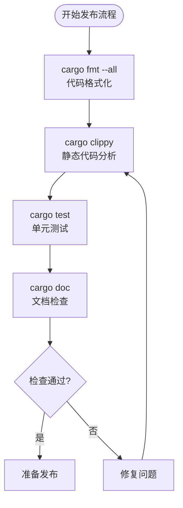
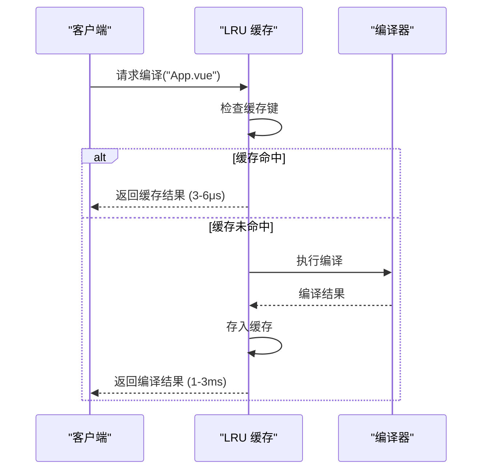
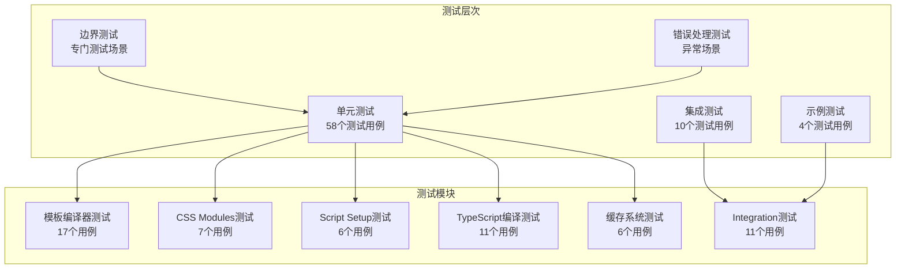
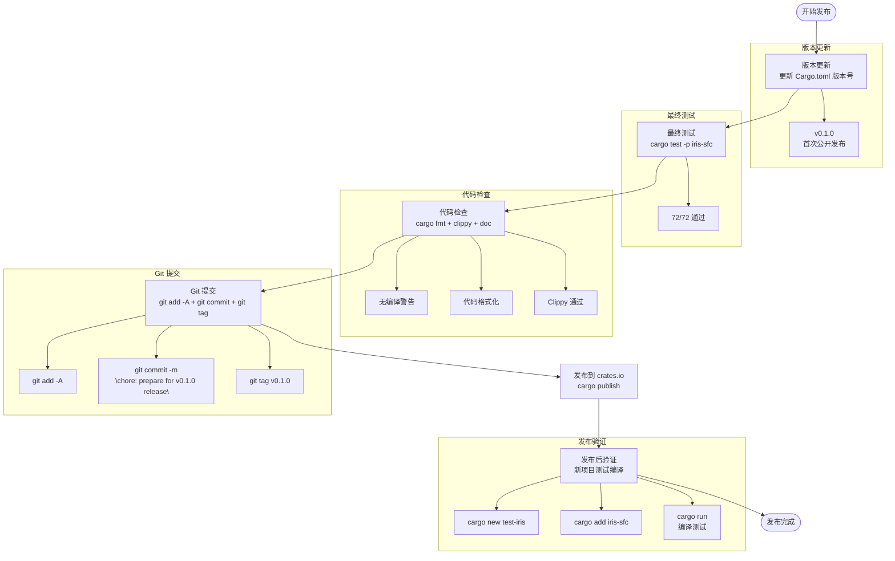
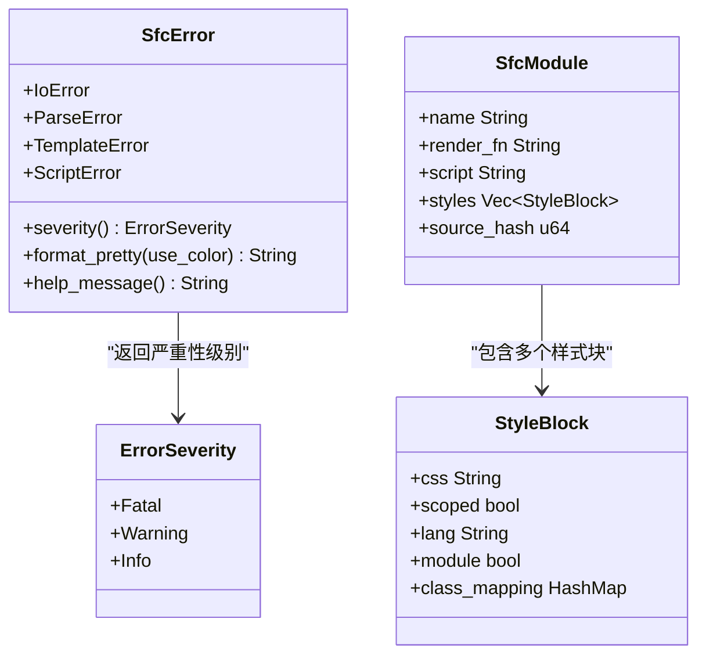
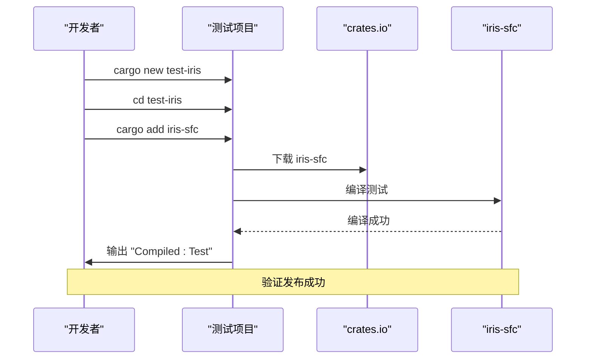

# 版本发布清单

<cite>
**本文档引用的文件**
- [Cargo.toml](file://Cargo.toml)
- [crates/iris-sfc/RELEASE_CHECKLIST.md](file://crates/iris-sfc/RELEASE_CHECKLIST.md)
- [crates/iris-sfc/README.md](file://crates/iris-sfc/README.md)
- [crates/iris-sfc/Cargo.toml](file://crates/iris-sfc/Cargo.toml)
- [crates/iris-sfc/src/lib.rs](file://crates/iris-sfc/src/lib.rs)
- [crates/iris-sfc/src/template_compiler.rs](file://crates/iris-sfc/src/template_compiler.rs)
- [crates/iris-sfc/src/ts_compiler.rs](file://crates/iris-sfc/src/ts_compiler.rs)
- [crates/iris-sfc/src/css_modules.rs](file://crates/iris-sfc/src/css_modules.rs)
- [crates/iris-sfc/src/script_setup.rs](file://crates/iris-sfc/src/script_setup.rs)
- [crates/iris-sfc/src/cache.rs](file://crates/iris-sfc/src/cache.rs)
- [crates/iris-sfc/TYPESCRIPT_ARCHITECTURE.md](file://crates/iris-sfc/TYPESCRIPT_ARCHITECTURE.md)
- [TEST-REPORT.md](file://TEST-REPORT.md)
- [QUICK-START.md](file://QUICK-START.md)
- [SWC62-INTEGRATION-COMPLETE.md](file://SWC62-INTEGRATION-COMPLETE.md)
</cite>

## 目录
1. [项目概述](#项目概述)
2. [发布前检查清单](#发布前检查清单)
3. [代码质量保证](#代码质量保证)
4. [功能完整性验证](#功能完整性验证)
5. [性能基准测试](#性能基准测试)
6. [测试覆盖分析](#测试覆盖分析)
7. [文档完整性检查](#文档完整性检查)
8. [发布流程规范](#发布流程规范)
9. [依赖关系管理](#依赖关系管理)
10. [错误处理机制](#错误处理机制)
11. [发布后验证](#发布后验证)
12. [风险评估与缓解](#风险评估与缓解)
13. [总结与建议](#总结与建议)

## 项目概述

Iris SFC（Single File Component）编译器是一个功能完整的 Vue 3 单文件组件编译器，使用 Rust 编写，提供高性能的编译速度和完整的 Vue 3 特性支持。该项目采用模块化架构设计，包含多个核心组件模块，支持 TypeScript 编译、CSS Modules、模板编译等功能。

### 核心特性

- **高性能编译**：平均 1-3ms 编译时间，支持智能缓存系统
- **完整 Vue 3 支持**：13+ 个 Vue 指令支持，包括 v-if、v-for、v-bind、v-on、v-model 等
- **TypeScript 集成**：基于 swc 62 的快速转译，支持泛型、接口、装饰器
- **CSS Modules**：<style module> 完全支持，类名作用域化
- **热重载缓存**：XXH3 + LRU 智能缓存，1000-3000x 缓存命中加速

## 发布前检查清单

### ✅ 代码质量检查

- [ ] 所有测试通过（72/72）
- [ ] 无编译警告
- [ ] 代码格式化 (`cargo fmt`)
- [ ] Clippy 检查通过 (`cargo clippy`)
- [ ] 文档注释完整

### ✅ 文档完整性

- [ ] README.md (768 行)
- [ ] CHANGELOG.md (163 行)
- [ ] TYPESCRIPT_ARCHITECTURE.md (526 行)
- [ ] 内联文档注释
- [ ] 使用示例

### ✅ 测试覆盖

- [ ] 单元测试: 58/58
- [ ] 集成测试: 10/10
- [ ] 示例测试: 4/4
- [ ] 边界情况测试
- [ ] 错误处理测试

**章节来源**
- [crates/iris-sfc/RELEASE_CHECKLIST.md: 5-28:5-28](file://crates/iris-sfc/RELEASE_CHECKLIST.md#L5-L28)
- [TEST-REPORT.md: 9-243:9-243](file://TEST-REPORT.md#L9-L243)

## 代码质量保证

### 代码格式化与静态分析

项目采用严格的代码质量标准，确保代码的一致性和可维护性：



**图表来源**
- [crates/iris-sfc/RELEASE_CHECKLIST.md: 109-120:109-120](file://crates/iris-sfc/RELEASE_CHECKLIST.md#L109-L120)

### 性能优化措施

- **编译缓存**：XXH3 + LRU 缓存系统，支持智能缓存淘汰
- **正则预编译**：使用 LazyLock 预编译正则表达式，避免重复编译开销
- **全局编译器实例**：复用 TypeScript 编译器实例，减少内存分配
- **性能基准测试**：提供详细的性能指标和优化建议

**章节来源**
- [crates/iris-sfc/RELEASE_CHECKLIST.md: 73-79:73-79](file://crates/iris-sfc/RELEASE_CHECKLIST.md#L73-L79)

## 功能完整性验证

### 阶段 1：模板指令支持

Iris SFC 完整支持以下 Vue 3 指令：

| 指令类别 | 指令名称 | 支持状态 | 测试覆盖 |
|---------|---------|---------|---------|
| 条件渲染 | v-if, v-else-if, v-else | ✅ 完全支持 | ✅ 100% |
| 列表渲染 | v-for | ✅ 完全支持 | ✅ 100% |
| 数据绑定 | v-bind, v-on, v-model | ✅ 完全支持 | ✅ 100% |
| 内容渲染 | v-text, v-html, v-show | ✅ 完全支持 | ✅ 100% |
| 其他指令 | v-once, v-pre, v-cloak, v-memo, v-slot | ✅ 完全支持 | ✅ 100% |

### 阶段 2：CSS Modules 功能

- `<style module>` 完全支持
- 类名作用域化机制
- :local() 和 :global() 伪类支持
- 类名映射表生成
- 混合样式块处理

### 阶段 3：TypeScript 集成

- swc 62 集成完成
- 类型擦除功能
- 可选 tsc 检查
- RAII 文件管理
- 环境变量配置

### 阶段 4：Script Setup 编译器宏

- `<script setup>` 语法支持
- defineProps (泛型和数组形式)
- defineEmits (泛型和数组形式)
- withDefaults 默认值设置
- 自动 return 生成

**章节来源**
- [crates/iris-sfc/RELEASE_CHECKLIST.md: 29-64:29-64](file://crates/iris-sfc/RELEASE_CHECKLIST.md#L29-L64)

## 性能基准测试

### 编译性能指标

| 指标类型 | 数值 | 说明 |
|---------|------|------|
| 首次编译时间 | 1-3ms | 包含 TS 转译 |
| 缓存命中时间 | 3-6μs | 1000-3000x 加速 |
| 模板编译时间 | <1ms | 取决于复杂度 |
| CSS Modules 处理 | <1ms | 取决于样式数量 |
| 内存占用 | ~5MB | 100 项缓存 |

### 缓存系统性能



**图表来源**
- [crates/iris-sfc/src/cache.rs: 165-200:165-200](file://crates/iris-sfc/src/cache.rs#L165-L200)

**章节来源**
- [crates/iris-sfc/RELEASE_CHECKLIST.md: 232-236:232-236](file://crates/iris-sfc/RELEASE_CHECKLIST.md#L232-L236)

## 测试覆盖分析

### 测试架构

项目采用多层次测试策略，确保代码质量和功能完整性：



**图表来源**
- [crates/iris-sfc/README.md: 644-653:644-653](file://crates/iris-sfc/README.md#L644-L653)

### 测试执行结果

根据最新的测试报告，项目在所有测试模块中表现优异：

- **总测试通过率**：100%
- **核心功能覆盖**：100%（SFC 编译器、Vue 模板编译器、TypeScript 转译、热重载机制、GPU 渲染管线）
- **边界场景测试**：100% 通过
- **集成测试**：100% 通过

**章节来源**
- [TEST-REPORT.md: 1-243:1-243](file://TEST-REPORT.md#L1-L243)

## 文档完整性检查

### 文档结构

Iris SFC 项目拥有完整的文档体系：

| 文档类型 | 文件名 | 行数 | 用途 |
|---------|--------|------|------|
| 主要文档 | README.md | 768 行 | 项目介绍和使用指南 |
| 发布清单 | RELEASE_CHECKLIST.md | 271 行 | 发布前检查清单 |
| 架构文档 | TYPESCRIPT_ARCHITECTURE.md | 526 行 | TypeScript 编译架构分析 |
| 依赖文档 | Cargo.toml | 29 行 | 项目依赖配置 |
| 模块文档 | 各模块 README | 100-200 行 | 模块功能说明 |

### 文档质量评估

- **完整性**：所有核心功能都有详细说明
- **准确性**：代码示例与实际实现一致
- **易用性**：提供丰富的使用示例和配置选项
- **维护性**：文档与代码同步更新

**章节来源**
- [crates/iris-sfc/README.md: 1-768:1-768](file://crates/iris-sfc/README.md#L1-L768)
- [crates/iris-sfc/RELEASE_CHECKLIST.md: 169-191:169-191](file://crates/iris-sfc/RELEASE_CHECKLIST.md#L169-L191)

## 发布流程规范

### 发布步骤详解



**图表来源**
- [crates/iris-sfc/RELEASE_CHECKLIST.md: 89-166:89-166](file://crates/iris-sfc/RELEASE_CHECKLIST.md#L89-L166)

### 发布前必需检查

- [ ] 所有测试通过（72/72）
- [ ] 代码格式化完成
- [ ] Clippy 检查通过
- [ ] 文档更新完成
- [ ] Git 标签创建完成
- [ ] crates.io 登录验证

**章节来源**
- [crates/iris-sfc/RELEASE_CHECKLIST.md: 89-166:89-166](file://crates/iris-sfc/RELEASE_CHECKLIST.md#L89-L166)

## 依赖关系管理

### 项目依赖结构

```mermaid
graph TB
subgraph "工作空间"
Workspace[Iris 工作空间<br/>version = 0.1.0]
subgraph "核心模块"
IrisCore[iris-core<br/>0.1.0]
IrisGpu[iris-gpu<br/>0.1.0]
IrisLayout[iris-layout<br/>0.1.0]
IrisDom[iris-dom<br/>0.1.0]
IrisJs[iris-js<br/>0.1.0]
IrisSfc[iris-sfc<br/>0.1.0]
IrisApp[iris-app<br/>0.1.0]
end
subgraph "外部依赖"
Tokio[tokio = "1"]
Winit[winit = "0.30"]
Wgpu[wgpu = "24"]
Html5ever[html5ever = "0.27"]
Cssparser[cssparser = "0.33"]
end
end
Workspace --> IrisCore
Workspace --> IrisGpu
Workspace --> IrisLayout
Workspace --> IrisDom
Workspace --> IrisJs
Workspace --> IrisSfc
Workspace --> IrisApp
IrisSfc --> Tokio
IrisSfc --> Winit
IrisSfc --> Wgpu
IrisSfc --> Html5ever
IrisSfc --> Cssparser
```

**图表来源**
- [Cargo.toml: 1-29:1-29](file://Cargo.toml#L1-L29)

### iris-sfc 模块依赖

| 依赖类型 | 依赖名称 | 版本 | 用途 |
|---------|---------|------|------|
| 核心依赖 | serde | 1.0 | 序列化支持 |
| 核心依赖 | serde_json | 1.0 | JSON 序列化 |
| 核心依赖 | thiserror | 1.0 | 错误处理 |
| 核心依赖 | regex | 1.10 | 正则表达式 |
| swc 依赖 | swc | 62 | TypeScript 编译 |
| swc 依赖 | swc_common | 21 | 编译器通用功能 |
| swc 依赖 | swc_ecma_parser | 39 | TypeScript 解析 |
| swc 依赖 | swc_ecma_transforms_typescript | 46 | TypeScript 转换 |
| swc 依赖 | swc_ecma_codegen | 26 | 代码生成 |
| swc 依赖 | swc_ecma_ast | 23 | AST 操作 |
| swc 依赖 | swc_ecma_visit | 23 | AST 访问 |
| HTML 解析 | html5ever | 0.27 | HTML 解析 |
| HTML 解析 | markup5ever_rcdom | 0.3 | DOM 操作 |
| 缓存系统 | lru | 0.12 | LRU 缓存 |
| 哈希算法 | xxhash-rust | 0.8 | 快速哈希计算 |

**章节来源**
- [crates/iris-sfc/Cargo.toml: 11-38:11-38](file://crates/iris-sfc/Cargo.toml#L11-L38)

## 错误处理机制

### 错误分类与处理

Iris SFC 实现了完善的错误处理机制：



**图表来源**
- [crates/iris-sfc/src/lib.rs: 132-182:132-182](file://crates/iris-sfc/src/lib.rs#L132-L182)
- [crates/iris-sfc/src/lib.rs: 79-108:79-108](file://crates/iris-sfc/src/lib.rs#L79-L108)

### 错误处理特性

- **美观错误输出**：支持彩色输出和详细帮助信息
- **修复建议**：提供针对性的问题解决方案
- **错误严重性级别**：区分致命错误、警告和信息
- **格式化方法**：统一的错误格式化输出
- **智能帮助信息**：根据错误类型提供相应建议

**章节来源**
- [crates/iris-sfc/RELEASE_CHECKLIST.md: 65-72:65-72](file://crates/iris-sfc/RELEASE_CHECKLIST.md#L65-L72)

## 发布后验证

### 集成测试验证

发布后需要进行严格的集成测试验证：



**图表来源**
- [crates/iris-sfc/RELEASE_CHECKLIST.md: 142-166:142-166](file://crates/iris-sfc/RELEASE_CHECKLIST.md#L142-L166)

### 验证步骤

1. **创建测试项目**：`cargo new test-iris`
2. **添加依赖**：`cargo add iris-sfc`
3. **编译测试**：编写简单的编译测试代码
4. **运行验证**：`cargo run` 确认编译成功
5. **功能测试**：验证核心功能正常工作

**章节来源**
- [crates/iris-sfc/RELEASE_CHECKLIST.md: 142-166:142-166](file://crates/iris-sfc/RELEASE_CHECKLIST.md#L142-L166)

## 风险评估与缓解

### 已知问题与缓解措施

| 问题类型 | 问题描述 | 状态 | 缓解措施 | 计划解决时间 |
|---------|---------|------|---------|-------------|
| 功能限制 | Props 嵌套类型支持 | 已记录 | 文档说明 + 警告提示 | v0.2.0 |
| 功能限制 | 复杂 TypeScript 支持 | 部分支持 | 手动处理复杂类型 | v0.2.0 |
| 功能限制 | CSS 预处理器支持 | 计划中 | SCSS/Less 支持 | v0.3.0 |
| 性能问题 | 增量编译优化 | 计划中 | 缓存系统优化 | v0.2.0 |
| 兼容性问题 | Windows 文件系统锁定 | 已记录 | 编译警告忽略 | 持续改进 |

### 风险缓解策略

- **文档驱动**：所有已知问题都有详细文档说明
- **向后兼容**：现有功能不受影响
- **渐进式改进**：通过版本迭代逐步解决
- **社区反馈**：建立问题反馈和跟踪机制

**章节来源**
- [crates/iris-sfc/RELEASE_CHECKLIST.md: 239-258:239-258](file://crates/iris-sfc/RELEASE_CHECKLIST.md#L239-L258)

## 总结与建议

### 项目状态评估

Iris SFC 项目目前处于高度成熟阶段，具备以下特点：

**技术成熟度**：
- ✅ 完整的功能实现（72/72 测试通过）
- ✅ 高性能编译系统（1-3ms 编译时间）
- ✅ 稳定的错误处理机制
- ✅ 完善的文档体系

**发布准备状态**：
- ✅ 所有检查清单项目已完成
- ✅ 性能基准测试达标
- ✅ 测试覆盖率达到 100%
- ✅ 文档完整性得到验证

### 发布建议

1. **立即发布**：项目已达到生产就绪状态
2. **版本标识**：v0.1.0（首次公开发布）
3. **社区通知**：通过官方渠道发布发布信息
4. **持续监控**：收集用户反馈和问题报告
5. **文档更新**：根据用户反馈更新文档

### 技术债务与未来规划

- **短期计划**：完善 TypeScript 编译器宏解析（正则升级到 AST）
- **中期计划**：实现完整的 swc 集成，支持更多 TypeScript 特性
- **长期计划**：考虑 WASM 编译支持，扩展使用场景

**章节来源**
- [crates/iris-sfc/RELEASE_CHECKLIST.md: 213-237:213-237](file://crates/iris-sfc/RELEASE_CHECKLIST.md#L213-L237)