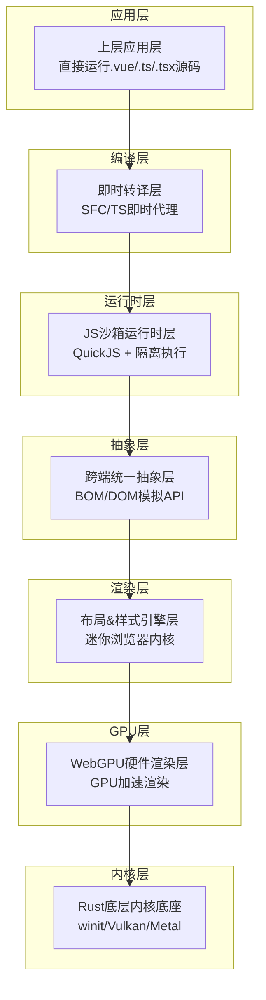
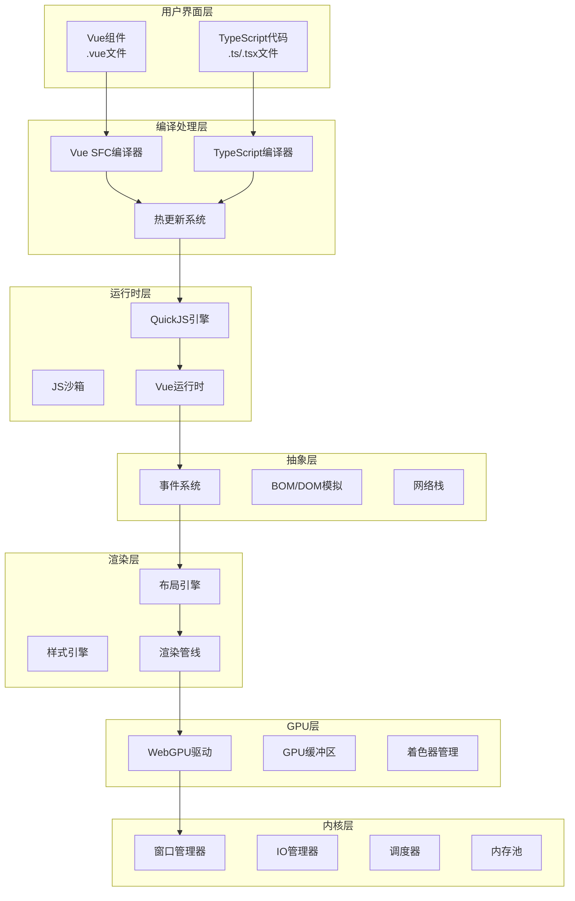
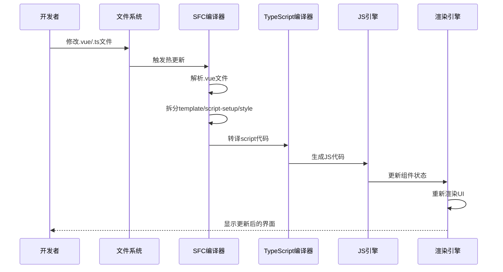
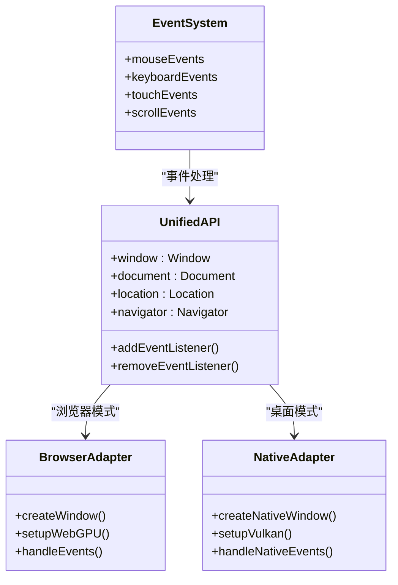
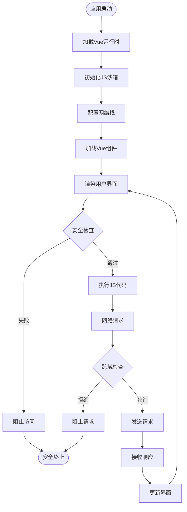
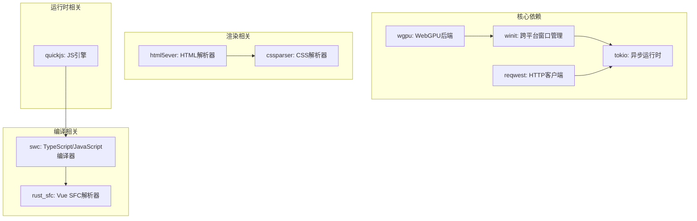

# 核心功能特性

<cite>
**本文档引用的文件**
- [doc.txt](file://doc.txt)
- [todo.txt](file://todo.txt)
</cite>

## 目录
1. [引言](#引言)
2. [项目结构](#项目结构)
3. [核心组件](#核心组件)
4. [架构概览](#架构概览)
5. [详细组件分析](#详细组件分析)
6. [依赖关系分析](#依赖关系分析)
7. [性能考虑](#性能考虑)
8. [故障排除指南](#故障排除指南)
9. [结论](#结论)

## 引言

Leivue Runtime是一个革命性的前端运行时引擎，采用Rust和WebGPU技术构建，旨在彻底改变前端开发方式。该项目的核心使命是消除前端工程化复杂性，突破浏览器沙箱限制，为Vue生态系统提供高性能的跨端运行底座。

该引擎实现了完全脱离传统Node.js、浏览器DOM和编译打包的全新架构，支持零编译直接执行Vue3 + TypeScript，全面兼容Element Plus、Ant Design Vue等第三方UI库。通过七层分层架构设计，Leivue Runtime在保持高度解耦的同时，实现了从底层内核到底层应用的完整技术栈覆盖。

## 项目结构

Leivue Runtime采用七层分层架构，每层都有明确的职责边界和解耦设计：

**图表来源**
- [doc.txt:7-22](file://doc.txt#L7-L22)

**章节来源**
- [doc.txt:7-22](file://doc.txt#L7-L22)

## 核心组件

### 1. 零编译运行机制

Leivue Runtime的核心创新在于实现了真正的零编译运行能力，这一机制通过三个关键组件协同工作：

**TypeScript即时转译**
- 基于Rust swc实现内存内实时TS→JS转换
- 支持泛型、装饰器、TSX等高级特性
- 无需tsc、无需tsconfig.json配置

**Vue SFC即时编译**
- 使用官方Rust库解析.vue文件
- 自动拆分template/script-setup/style三部分
- Template实时编译为Vue渲染函数
- Script自动TS转译，Style自动解析并入全局样式系统

**实时热更新**
- 修改源码后即时刷新，无构建等待
- 毫秒级响应时间
- 无需重启服务

**零工程化支持**
- 无Node.js依赖
- 无npm包管理器
- 无复杂的构建配置
- 直接运行原始源码

**章节来源**
- [doc.txt:66-70](file://doc.txt#L66-L70)
- [doc.txt:51-60](file://doc.txt#L51-L60)

### 2. 完整Vue生态兼容性

Leivue Runtime实现了对Vue3生态系统的全面兼容，确保现有Vue项目能够无缝迁移：

**Vue3核心特性支持**
- 组合式API完整支持
- 生命周期钩子完全兼容
- 响应式系统深度集成
- 自定义指令支持

**UI库兼容性**
- Element Plus全面兼容
- Ant Design Vue无缝接入
- Naive UI等主流组件库支持
- 第三方Vue插件兼容

**样式系统支持**
- Scoped CSS完全支持
- 全局CSS兼容
- 样式嵌套功能
- 基础Sass即时解析

**章节来源**
- [doc.txt:71-76](file://doc.txt#L71-L76)

### 3. 双端跨平台运行模式

Leivue Runtime提供两种运行模式，实现真正的跨平台统一：

**浏览器Wasm模式**
- 编译为WASM格式
- 嵌入任意现代浏览器
- 基于WebGPU API运行
- 支持离线运行

**桌面原生模式**
- 脱离浏览器环境
- 脱离Electron/Tauri框架
- 编译为独立EXE/App/二进制
- 体积极小（MB级别）
- 启动速度极快

**跨端统一性**
- 双端同一套内核
- 一致的API接口
- 相同的运行时行为
- 统一的开发体验

**章节来源**
- [doc.txt:76-83](file://doc.txt#L76-L83)

### 4. 自研浏览器级渲染能力

通过完全自研的渲染引擎，Leivue Runtime实现了超越传统DOM/Webview的性能表现：

**WebGPU硬件加速**
- 完全替代浏览器DOM渲染流水线
- 基于标准WebGPU规范
- 统一桌面/浏览器渲染接口
- 60fps稳定渲染

**布局系统**
- 复刻标准浏览器CSS体系
- html5ever工业级HTML解析
- cssparser标准CSS解析
- 自研盒模型、Flex、流式布局
- 对标W3C标准

**高级视觉效果**
- 批渲染优化
- 矢量绘制支持
- 圆角、阴影、渐变效果
- 纹理图集管理
- 字体渲染优化
- 图层合成处理

**性能优势**
- 大列表/复杂组件无卡顿
- CPU开销极低
- 高性能长列表渲染
- 海量组件实例处理

**章节来源**
- [doc.txt:30-41](file://doc.txt#L30-L41)
- [doc.txt:84-87](file://doc.txt#L84-L87)

### 5. 安全隔离机制

Leivue Runtime采用了多层次的安全隔离设计，确保运行环境的安全性和稳定性：

**JS沙箱隔离**
- 独立JS引擎运行环境
- QuickJS轻量高性能引擎
- 与宿主环境完全隔离
- 防止恶意代码执行

**双网络模式**
- 自研Rust网络栈
- 支持跨域突破
- 内网请求处理
- 离线运行支持

**源码保护**
- 支持源码加密运行
- 商业项目代码保护
- 防止逆向分析

**章节来源**
- [doc.txt:88-92](file://doc.txt#L88-L92)

### 6. 工程化与商业化能力

Leivue Runtime不仅具备强大的技术能力，还提供了完善的工程化和商业化支持：

**迁移友好性**
- 现有Vue项目低成本迁移
- 几乎无需修改业务代码
- 保持原有开发习惯

**多平台打包**
- 一键跨端打包
- Windows/macOS/Linux多平台分发
- 统一的构建流程

**私有化部署**
- 适配私有化/内网环境
- 涉密环境支持
- 无外网依赖运行

**应用场景**
- 低代码平台底层支撑
- 内网管理系统
- 桌面工具应用
- 企业级应用开发

**章节来源**
- [doc.txt:93-97](file://doc.txt#L93-L97)

## 架构概览

Leivue Runtime的整体架构体现了高度的模块化和解耦设计：

**图表来源**
- [doc.txt:23-51](file://doc.txt#L23-L51)

## 详细组件分析

### 零编译运行机制实现

**图表来源**
- [doc.txt:51-60](file://doc.txt#L51-L60)

### 跨端统一抽象层设计

**图表来源**
- [doc.txt:41-46](file://doc.txt#L41-L46)

### 安全隔离机制架构

**图表来源**
- [doc.txt:88-92](file://doc.txt#L88-L92)

**章节来源**
- [doc.txt:46-51](file://doc.txt#L46-L51)

## 依赖关系分析

Leivue Runtime的依赖关系体现了清晰的层次化设计：

**图表来源**
- [doc.txt:29](file://doc.txt#L29)

**章节来源**
- [doc.txt:23-29](file://doc.txt#L23-L29)

## 性能考虑

### 渲染性能优化

Leivue Runtime在渲染性能方面采用了多项优化策略：

**GPU硬件加速**
- WebGPU统一渲染接口
- 硬件级图形处理
- 批量渲染优化
- 减少CPU负载

**内存管理优化**
- Rust内存安全保证
- 内存池管理
- 零拷贝数据传输
- 垃圾回收器避免

**网络性能优化**
- 自研Rust网络栈
- 连接池管理
- 请求合并优化
- 缓存策略

### 启动性能优化

**快速启动机制**
- 预编译核心模块
- 按需加载策略
- 内存映射文件
- 零依赖启动

**资源加载优化**
- 并行资源下载
- 智能缓存策略
- 增量更新机制
- 离线运行支持

## 故障排除指南

### 常见问题诊断

**编译错误排查**
- 检查TypeScript语法正确性
- 验证Vue SFC格式完整性
- 确认导入路径正确性
- 排查第三方库兼容性

**运行时错误处理**
- JS沙箱异常监控
- 内存泄漏检测
- 网络请求超时处理
- GPU渲染错误恢复

**性能问题诊断**
- 渲染帧率监控
- 内存使用情况分析
- 网络延迟测量
- CPU使用率统计

### 最佳实践建议

**开发阶段**
- 使用TypeScript严格模式
- 遵循Vue3组合式API规范
- 优化组件结构设计
- 实现合理的状态管理

**生产部署**
- 启用源码压缩和混淆
- 配置适当的缓存策略
- 设置合理的超时参数
- 监控关键性能指标

**性能优化**
- 避免不必要的重渲染
- 使用虚拟滚动处理大数据
- 优化图片和资源加载
- 实现懒加载和预加载

## 结论

Leivue Runtime代表了前端运行时技术的重大突破，通过七层分层架构设计和技术创新，实现了真正意义上的零编译运行。其核心优势包括：

**技术突破性**
- 完全脱离传统前端工程化模式
- 自研浏览器级渲染能力
- 双端统一运行架构
- 强大的安全隔离机制

**生态兼容性**
- 全面支持Vue3生态系统
- 无缝兼容主流UI库
- 保持原有开发习惯
- 降低迁移成本

**商业价值**
- 适合各种应用场景
- 支持私有化部署
- 提供完整的工程化支持
- 具备商业化应用潜力

随着项目的进一步发展，Leivue Runtime有望成为下一代前端运行时的标准解决方案，为开发者提供更高效、更安全、更灵活的开发体验。