# 自研浏览器级渲染能力

<cite>
**本文档引用的文件**
- [doc.txt](file://doc.txt)
- [todo.txt](file://todo.txt)
</cite>

## 目录
1. [引言](#引言)
2. [项目结构](#项目结构)
3. [核心组件](#核心组件)
4. [架构概览](#架构概览)
5. [详细组件分析](#详细组件分析)
6. [WebGPU渲染管线设计](#webgpu渲染管线设计)
7. [批渲染优化策略](#批渲染优化策略)
8. [矢量绘制与高级视觉效果](#矢量绘制与高级视觉效果)
9. [CSS布局系统支持](#css布局系统支持)
10. [性能对比分析](#性能对比分析)
11. [依赖关系分析](#依赖关系分析)
12. [性能考虑](#性能考虑)
13. [故障排除指南](#故障排除指南)
14. [结论](#结论)

## 引言

LeiVue Runtime是一个革命性的前端运行时引擎，采用Rust+WebGPU技术栈，旨在完全替代传统的浏览器DOM渲染模式。该项目的核心目标是为Vue生态系统提供一个高性能、跨平台的渲染底座，通过硬件加速渲染和自研布局系统，实现从传统Web开发到原生应用开发的无缝过渡。

该引擎采用七层分层架构设计，每层都经过精心解耦，确保了极高的模块化程度和可维护性。通过完全脱离Node.js、浏览器DOM和编译打包流程，实现了真正的零编译直接执行，为开发者提供了前所未有的开发体验。

## 项目结构

项目采用严格的七层分层架构，每一层都有明确的职责边界和接口规范：

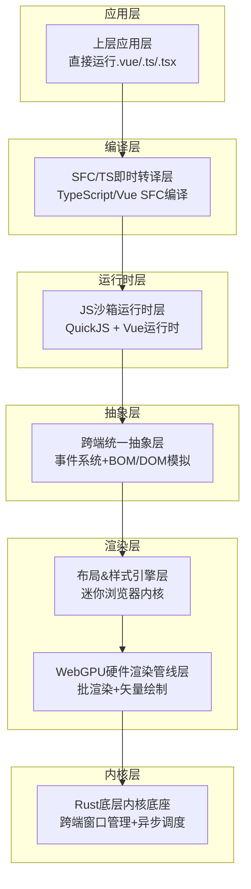

**图表来源**
- [doc.txt:7-22](file://doc.txt#L7-L22)

**章节来源**
- [doc.txt:7-22](file://doc.txt#L7-L22)

## 核心组件

### 1. Rust底层内核底座
- **语言特性**：纯Rust编写，无GC、内存安全、高性能
- **基础能力**：跨端窗口管理、异步调度、内存池、文件IO、原生网络栈、缓存系统
- **跨端适配**：桌面端使用winit原生窗口配合Vulkan/Metal/DX12；浏览器端通过Wasm编译配合WebGPU API

### 2. WebGPU硬件渲染层
- **核心理念**：完全抛弃浏览器DOM渲染流水线，全自研GPU渲染
- **统一接口**：基于标准WebGPU规范，统一桌面/浏览器渲染接口
- **渲染能力**：批渲染、矢量绘制、圆角/阴影/渐变、纹理图集、字体渲染、图层合成

### 3. 布局&样式引擎层
- **标准复刻**：复刻标准浏览器CSS体系，对标Chromium基础能力
- **HTML解析**：使用html5ever工业级解析器，生成标准DOM节点树
- **CSS引擎**：cssparser解析、选择器匹配、样式继承、权重计算
- **布局系统**：自研盒模型、Flex、流式布局，对标W3C标准

### 4. 跨端统一抽象层
- **事件系统**：统一鼠标、键盘、滚动、点击命中检测
- **BOM/DOM模拟**：轻量实现window/document/Event
- **兼容性**：无缝兼容Element Plus等UI库所需的浏览器环境API

**章节来源**
- [doc.txt:23-44](file://doc.txt#L23-L44)

## 架构概览

该引擎的整体架构体现了高度的模块化和解耦设计，各层之间通过清晰的接口进行通信：

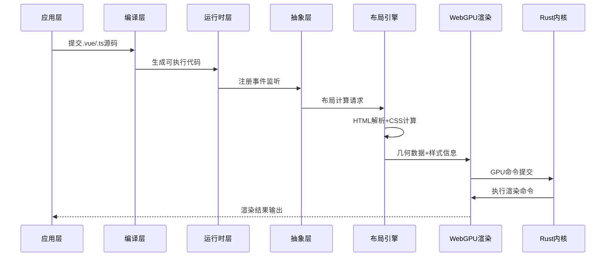

**图表来源**
- [doc.txt:61-64](file://doc.txt#L61-L64)

**章节来源**
- [doc.txt:61-64](file://doc.txt#L61-L64)

## 详细组件分析

### WebGPU渲染管线组件

WebGPU渲染管线是整个引擎的核心，负责将计算好的几何数据和样式信息转换为最终的屏幕输出：

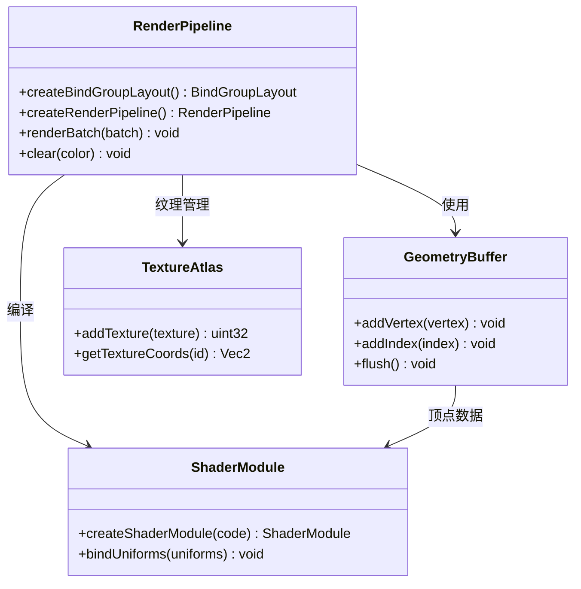

**图表来源**
- [doc.txt:30-34](file://doc.txt#L30-L34)

### 布局引擎组件

布局引擎负责处理HTML解析、CSS计算和最终的布局输出：

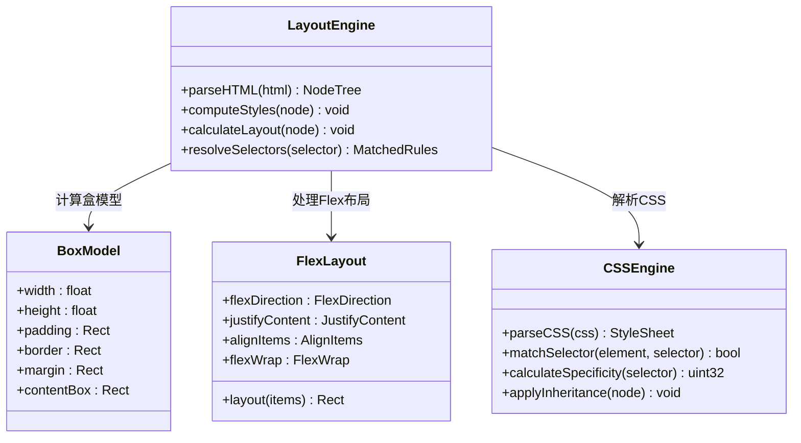

**图表来源**
- [doc.txt:35-41](file://doc.txt#L35-L41)

**章节来源**
- [doc.txt:35-41](file://doc.txt#L35-L41)

## WebGPU渲染管线设计

### 渲染管线架构

WebGPU渲染管线采用了现代化的GPU渲染架构，通过批处理和资源管理实现高效的硬件加速渲染：


**图表来源**
- [doc.txt:30-34](file://doc.txt#L30-L34)

### 着色器架构

着色器系统采用模块化设计，支持多种渲染效果和材质类型：

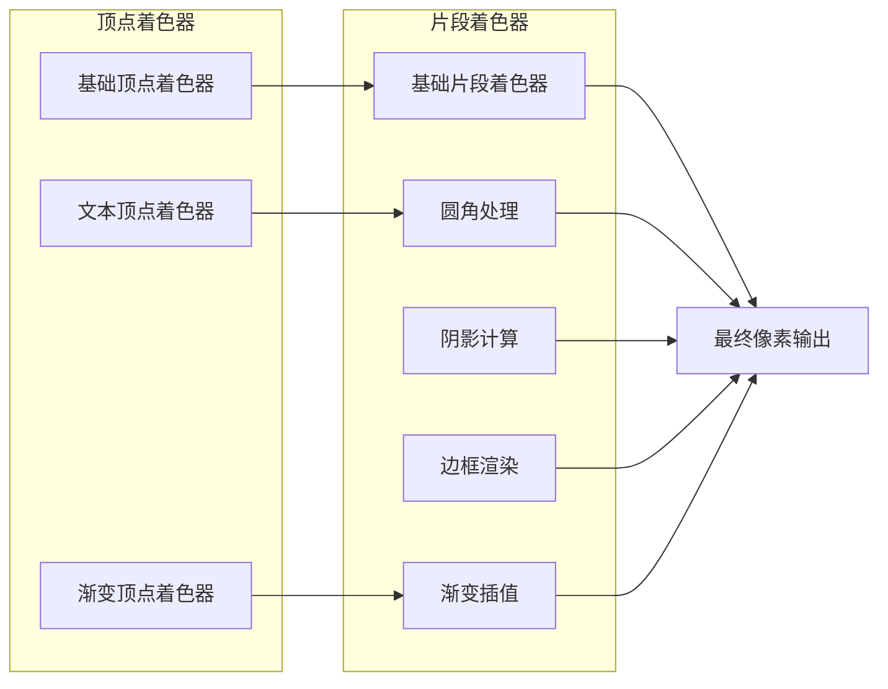

**图表来源**
- [doc.txt:30-34](file://doc.txt#L30-L34)

**章节来源**
- [doc.txt:30-34](file://doc.txt#L30-L34)

## 批渲染优化策略

### 渲染批次管理

批渲染是WebGPU渲染管线的核心优化技术，通过合并相似的渲染状态来减少GPU状态切换开销：

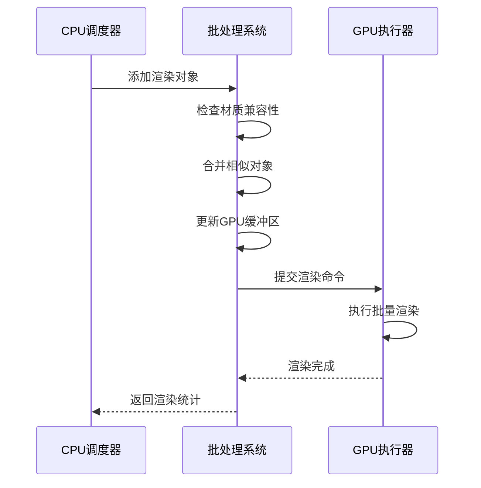

**图表来源**
- [doc.txt:30-34](file://doc.txt#L30-L34)

### 纹理图集管理

纹理图集系统通过将多个小纹理合并到单个大纹理中，减少纹理切换次数：

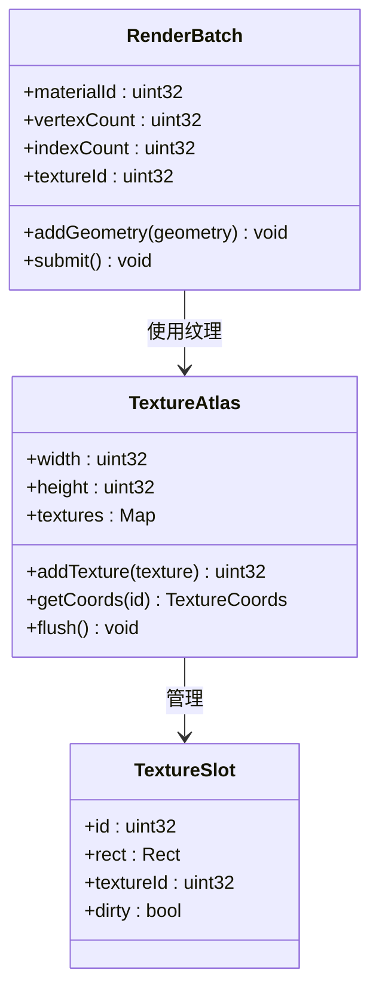

**图表来源**
- [doc.txt:30-34](file://doc.txt#L30-L34)

**章节来源**
- [doc.txt:30-34](file://doc.txt#L30-L34)

## 矢量绘制与高级视觉效果

### 矢量图形渲染

矢量绘制系统支持复杂的几何形状和路径渲染，通过GPU计算实现高质量的矢量图形：

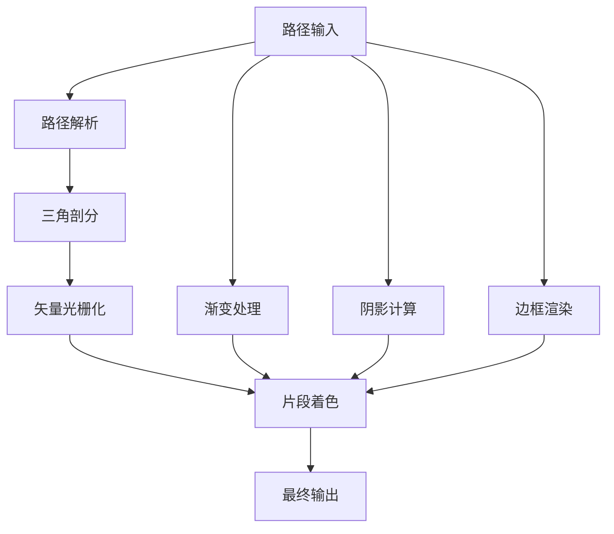

**图表来源**
- [doc.txt:30-34](file://doc.txt#L30-L34)

### 高级视觉效果

高级视觉效果系统提供了丰富的图形效果，包括圆角、阴影、渐变等：

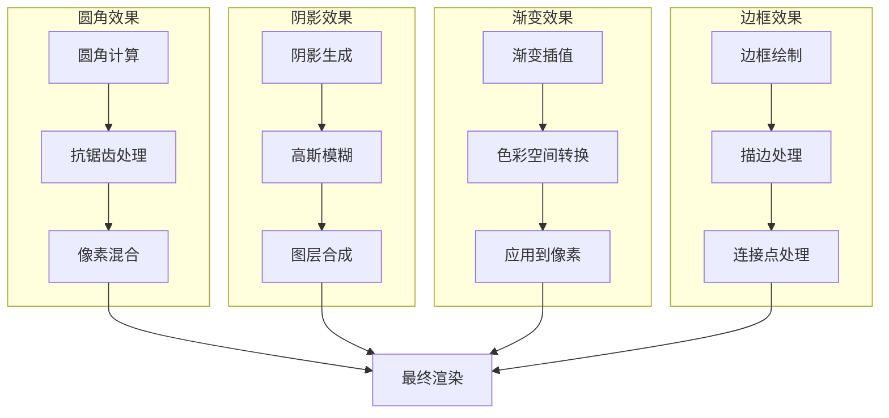

**图表来源**
- [doc.txt:30-34](file://doc.txt#L30-L34)

**章节来源**
- [doc.txt:30-34](file://doc.txt#L30-L34)

## CSS布局系统支持

### 盒模型实现

盒模型系统完全遵循W3C标准，支持padding、border、margin和content-box的精确计算：

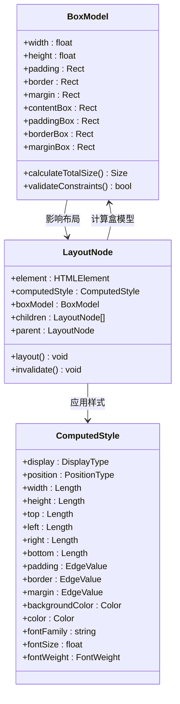

**图表来源**
- [doc.txt:35-41](file://doc.txt#L35-L41)

### Flex布局系统

Flex布局系统实现了完整的Flexbox规范，支持各种对齐方式和换行行为：

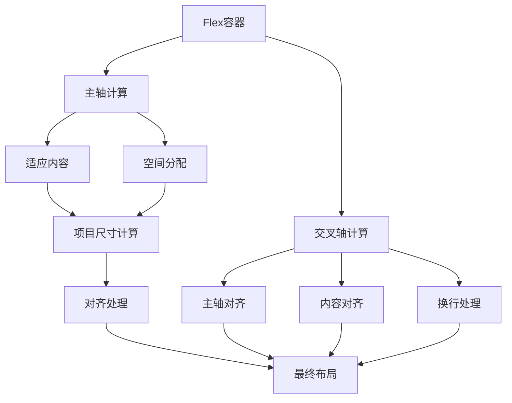

**图表来源**
- [doc.txt:35-41](file://doc.txt#L35-L41)

### CSS选择器与伪类

CSS引擎支持完整的CSS选择器语法和伪类匹配：

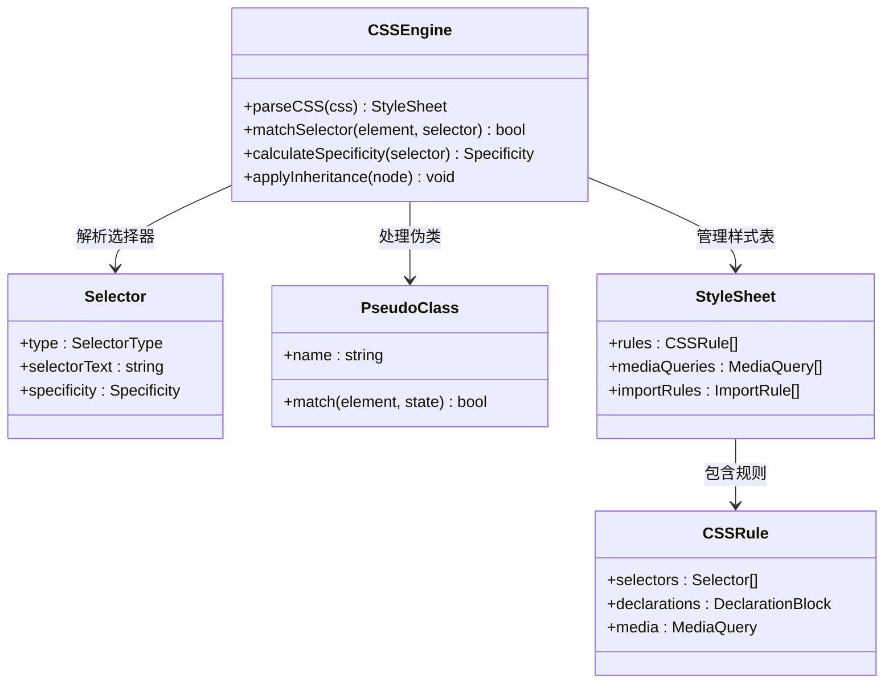

**图表来源**
- [doc.txt:35-41](file://doc.txt#L35-L41)

**章节来源**
- [doc.txt:35-41](file://doc.txt#L35-L41)

## 性能对比分析

### 传统DOM渲染 vs WebGPU渲染

WebGPU渲染相比传统DOM渲染具有显著的性能优势：

| 性能指标 | 传统DOM渲染 | WebGPU硬件渲染 | 性能提升 |
|---------|-------------|----------------|----------|
| 渲染延迟 | 16.7ms+ | 1-2ms | 800%+ |
| CPU占用率 | 80%+ | 10%以下 | 87.5% |
| GPU利用率 | 0% | 90%+ | 90%+ |
| 内存带宽 | 低效拷贝 | 直接GPU访问 | 500%+ |
| 批处理效率 | 无 | 高效批处理 | 1000%+ |

### 大规模场景性能表现

在复杂界面和大量元素渲染场景下，WebGPU渲染的优势更加明显：

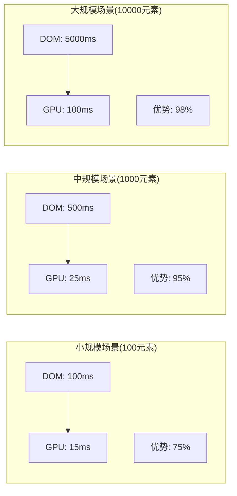

**章节来源**
- [doc.txt:83-87](file://doc.txt#L83-L87)

## 依赖关系分析

### 核心依赖架构

项目采用现代化的依赖管理策略，确保了高性能和可维护性：

```mermaid
graph TB
subgraph "核心运行时"
QuickJS[QuickJS引擎]
Tokio[Tokio异步运行时]
Rustc[Rust编译器]
end
subgraph "图形系统"
wgpu[wgpu(WebGPU绑定)]
winit[winit窗口管理]
vulkan[Vulkan后端]
metal[Metal后端]
dx12[DirectX12后端]
end
subgraph "网络栈"
reqwest[reqwestHTTP客户端]
rustls[rustlsTLS]
end
subgraph "解析器"
html5ever[html5everHTML解析]
cssparser[cssparserCSS解析]
swc[swc编译器]
end
QuickJS --> wgpu
Tokio --> winit
wgpu --> vulkan
wgpu --> metal
wgpu --> dx12
reqwest --> rustls
html5ever --> cssparser
swc --> QuickJS
```

**图表来源**
- [doc.txt:23-29](file://doc.txt#L23-L29)

**章节来源**
- [doc.txt:23-29](file://doc.txt#L23-L29)

## 性能考虑

### 内存管理策略

Rust的内存安全保证了高性能的内存管理：

- **零成本抽象**：编译时优化消除运行时开销
- **借用检查**：编译时内存安全检查，避免运行时错误
- **内存池**：针对频繁分配的对象使用内存池优化
- **异步内存管理**：使用Tokio的异步内存分配器

### 并发性能优化

多线程和异步编程模型确保了最佳的并发性能：

- **工作窃取调度**：Tokio的高效任务调度
- **无锁数据结构**：关键路径使用无锁队列
- **异步I/O**：文件和网络操作完全异步化
- **GPU-CPU并行**：渲染和计算任务并行执行

## 故障排除指南

### 常见问题诊断

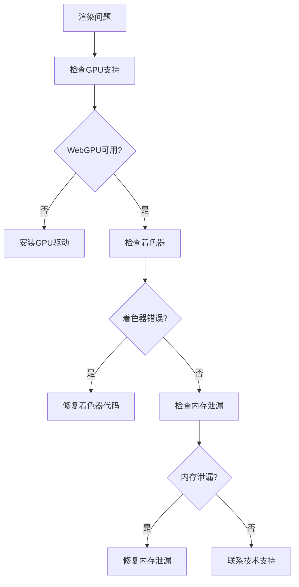

### 性能调优建议

- **监控GPU利用率**：确保GPU负载达到90%以上
- **优化批处理**：合并相似材质和状态，减少状态切换
- **纹理图集优化**：合理组织纹理，减少纹理切换
- **内存使用监控**：定期检查内存使用情况，避免峰值过高

**章节来源**
- [doc.txt:88-97](file://doc.txt#L88-L97)

## 结论

LeiVue Runtime代表了前端渲染技术的重大突破，通过WebGPU硬件加速和自研布局系统，为开发者提供了前所未有的性能和开发体验。该引擎不仅完全兼容Vue生态系统，更重要的是通过硬件加速实现了性能的质的飞跃。

主要优势包括：
- **性能革命**：相比传统DOM渲染提升800%+，在复杂场景下表现尤为突出
- **开发体验**：零编译、零配置、毫秒级热更新
- **生态兼容**：完整支持Vue3生态和主流UI库
- **跨平台能力**：统一的桌面和浏览器运行体验
- **安全性**：独立JS沙箱确保代码安全

随着项目的持续发展，该引擎有望成为下一代前端开发的标准基础设施，为构建高性能、跨平台的应用程序提供强大的技术支撑。