# 零编译运行核心功能

<cite>
**本文档引用的文件**
- [main.rs](file://crates/iris-app/src/main.rs)
- [lib.rs](file://crates/iris-sfc/src/lib.rs)
- [cache.rs](file://crates/iris-sfc/src/cache.rs)
- [file_watcher.rs](file://crates/iris-gpu/src/file_watcher.rs)
- [ts_compiler.rs](file://crates/iris-sfc/src/ts_compiler.rs)
- [integration_test.rs](file://crates/iris-sfc/tests/integration_test.rs)
</cite>

## 更新摘要
**变更内容**
- 增强了错误处理机制，改进了编译时错误跟踪和恢复机制
- 完善了热重载功能的错误恢复和回滚机制
- 优化了文件监视器的错误处理和恢复能力
- 改进了 TypeScript 编译器的错误处理和 Source Map 管理

## 目录
1. [引言](#引言)
2. [项目结构](#项目结构)
3. [核心组件](#核心组件)
4. [架构概览](#架构概览)
5. [详细组件分析](#详细组件分析)
6. [依赖关系分析](#依赖关系分析)
7. [性能考虑](#性能考虑)
8. [故障排除指南](#故障排除指南)
9. [结论](#结论)
10. [附录](#附录)

## 引言

Leivue Runtime是一个革命性的前端运行时引擎，旨在彻底改变传统的前端开发模式。该项目的核心目标是实现"零编译运行"，让开发者能够直接运行Vue3 SFC文件和TypeScript代码，无需任何构建步骤或依赖安装。

### 核心使命
- 消灭前端工程化复杂性
- 突破浏览器沙箱限制
- 为Vue生态系统提供高性能跨端底座
- 实现毫秒级响应的热更新机制

### 技术愿景
通过Rust+WebGPU技术栈，构建一套完全脱离Node.js、浏览器DOM和传统编译打包的原生双端运行引擎，支持浏览器Wasm模式和独立桌面原生模式。

## 项目结构

基于七层分层架构的设计理念，Leivue Runtime采用高度解耦的模块化结构：

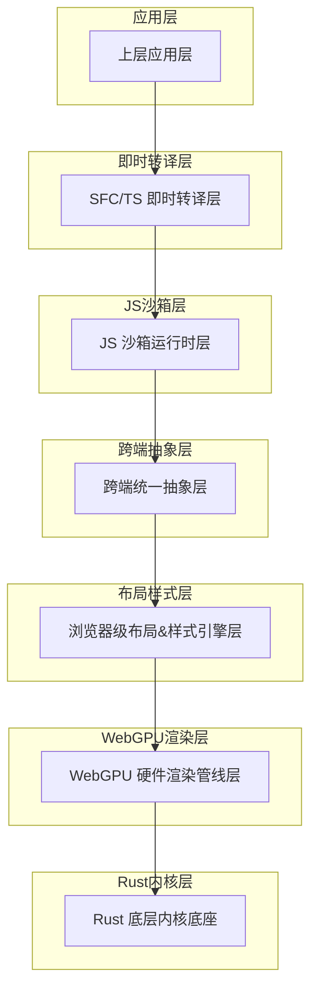

**图表来源**
- [main.rs:1-438](file://crates/iris-app/src/main.rs#L1-L438)

### 层次化设计原则
每个层级都有明确的职责边界：
- **应用层**：面向开发者，提供直接运行Vue3 + TypeScript的能力
- **即时转译层**：实现零编译的核心技术
- **JS沙箱层**：提供安全隔离的执行环境
- **跨端抽象层**：抹平双端差异
- **布局样式层**：实现迷你浏览器内核能力
- **WebGPU渲染层**：替代原生DOM渲染
- **Rust内核层**：提供高性能底层支撑

**章节来源**
- [main.rs:1-438](file://crates/iris-app/src/main.rs#L1-L438)

## 核心组件

### 1. 零编译运行核心功能

这是Leivue Runtime最具创新性的特性，实现了真正的"零编译"开发体验。

#### 核心能力矩阵
- **Vue3 SFC直接运行**：支持script setup完整语法
- **TypeScript即时转译**：无需tsc、无需tsconfig
- **实时热更新**：毫秒级响应
- **零工程化**：无Node、无npm、无依赖配置

#### 技术实现路径
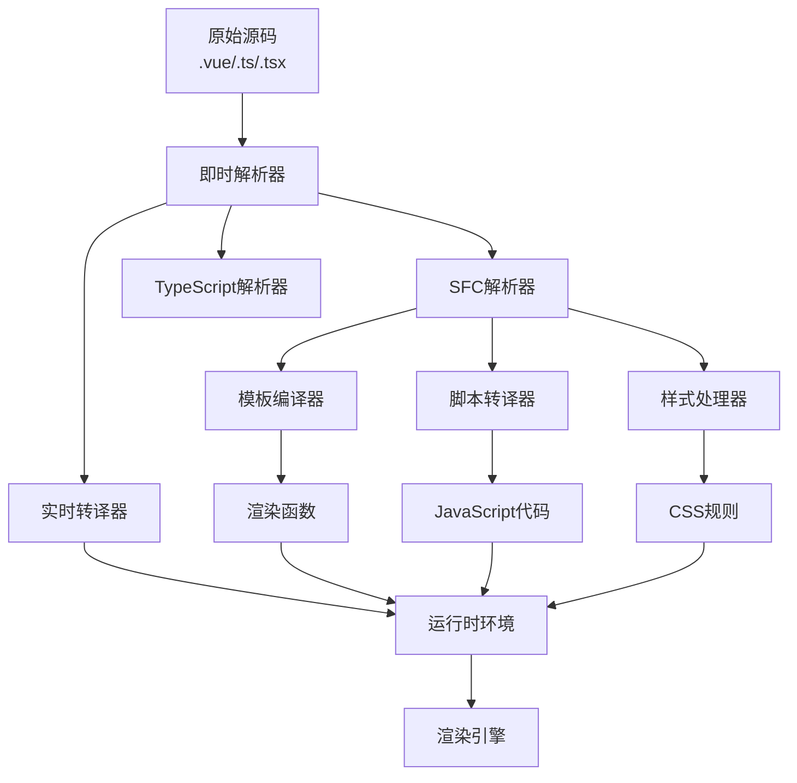

**图表来源**
- [lib.rs:51-64](file://crates/iris-sfc/src/lib.rs#L51-L64)

**章节来源**
- [lib.rs:66-70](file://crates/iris-sfc/src/lib.rs#L66-L70)

### 2. 完整Vue生态兼容

Leivue Runtime致力于与现有Vue生态系统无缝集成：

#### 兼容性保证
- Vue3组合式API完整支持
- 生命周期、响应式系统、指令系统
- Element Plus、Ant Design Vue等主流UI库
- 第三方Vue插件、全局组件、自定义指令
- Scoped CSS、全局CSS、样式嵌套、基础Sass

#### 生态集成策略
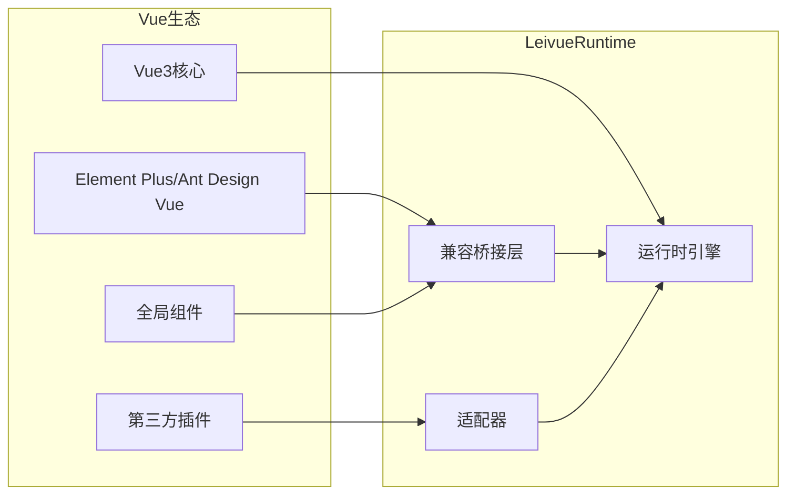

**图表来源**
- [lib.rs:71-75](file://crates/iris-sfc/src/lib.rs#L71-L75)

**章节来源**
- [lib.rs:71-75](file://crates/iris-sfc/src/lib.rs#L71-L75)

### 3. 双端跨平台运行

Leivue Runtime提供统一的双端运行体验：

#### 平台特性对比
| 特性 | 浏览器模式 | 桌面原生模式 |
|------|------------|--------------|
| 运行方式 | Wasm编译嵌入 | 独立EXE/App二进制 |
| 启动速度 | 极速 | 极速 |
| 内存占用 | 低 | 低 |
| 体积大小 | MB级 | MB级 |
| 系统权限 | 有限 | 原生权限 |
| 离线能力 | 有限 | 强大 |

#### 跨端架构设计
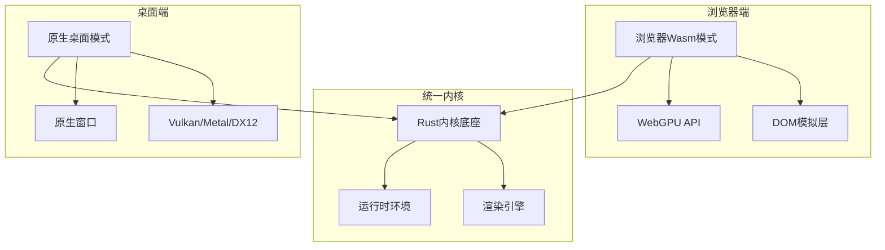

**图表来源**
- [main.rs:76-82](file://crates/iris-app/src/main.rs#L76-L82)

**章节来源**
- [main.rs:76-82](file://crates/iris-app/src/main.rs#L76-L82)

## 架构概览

### 整体技术架构

Leivue Runtime采用七层分层架构，每层都有明确的职责和边界：

**图表来源**
- [main.rs:7-22](file://crates/iris-app/src/main.rs#L7-L22)

### 核心技术栈

#### Rust底层内核
- **语言特性**：纯Rust编写，无GC、内存安全、高性能
- **基础能力**：跨端窗口管理、异步调度、内存池、文件IO、原生网络栈、缓存系统
- **跨端适配**：桌面winit原生窗口 + Vulkan/Metal/DX12，浏览器Wasm编译 + WebGPU API绑定
- **核心依赖**：wgpu、winit、tokio、reqwest

#### WebGPU硬件渲染
- **技术路线**：完全抛弃浏览器DOM渲染流水线，全自研GPU渲染
- **标准化**：基于标准WebGPU规范，统一桌面/浏览器渲染接口
- **性能优势**：60fps稳定渲染、大列表/复杂组件无卡顿、CPU开销极低
- **渲染能力**：批渲染、矢量绘制、圆角/阴影/渐变、纹理图集、字体渲染、图层合成

#### 布局样式引擎
- **CSS体系**：复刻标准浏览器CSS体系，对标Chromium基础能力
- **HTML解析**：html5ever工业级解析，生成标准DOM节点树
- **CSS引擎**：cssparser解析、选择器匹配、样式继承、权重计算
- **布局系统**：自研盒模型、Flex、流式布局，对标W3C标准
- **样式挂载**：全局样式、Scoped样式、第三方UI库CSS全局注入

**章节来源**
- [main.rs:23-45](file://crates/iris-app/src/main.rs#L23-L45)

## 详细组件分析

### 即时转译层核心技术

即时转译层是Leivue Runtime的核心创新，实现了真正的零编译能力。

#### TypeScript即时转译机制

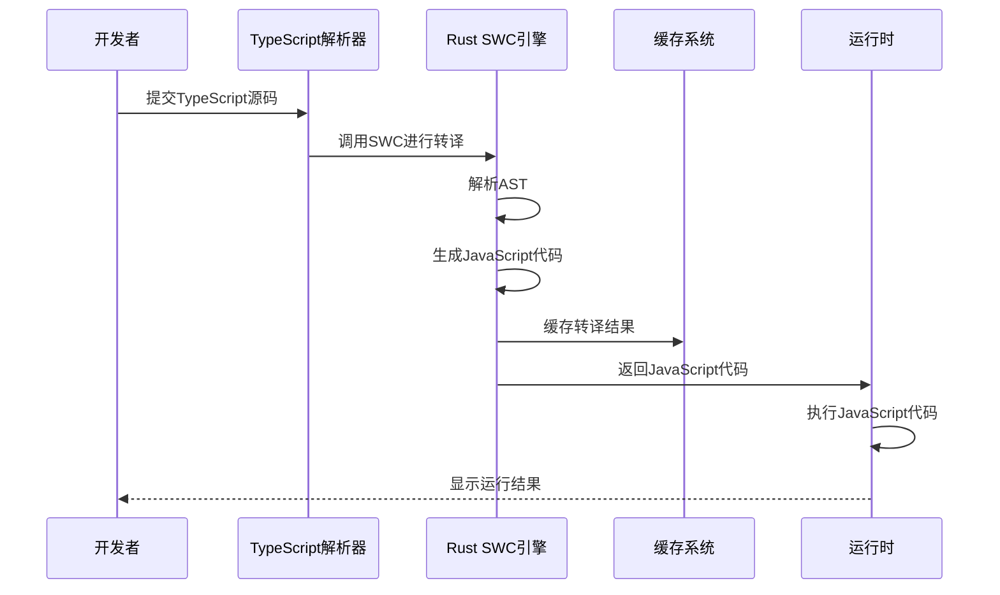

**图表来源**
- [lib.rs:53-54](file://crates/iris-sfc/src/lib.rs#L53-L54)

#### Vue SFC即时编译流程

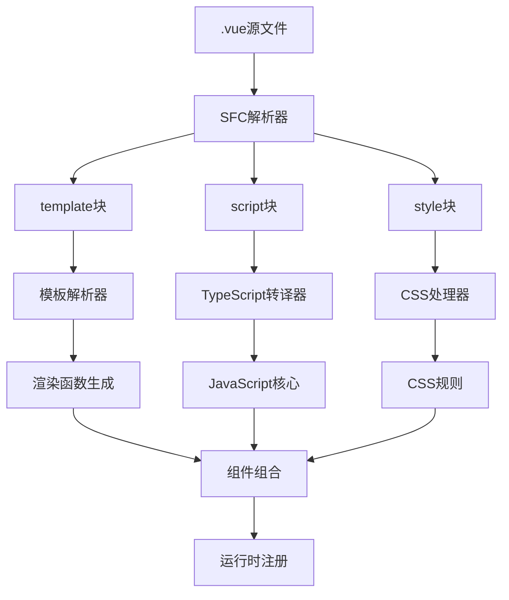

**图表来源**
- [lib.rs:55-59](file://crates/iris-sfc/src/lib.rs#L55-L59)

#### 热更新实现原理

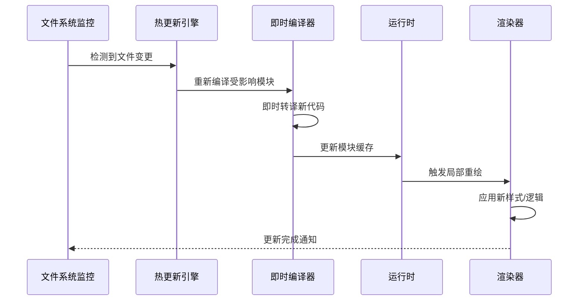

**图表来源**
- [main.rs:69](file://crates/iris-app/src/main.rs#L69)

**章节来源**
- [lib.rs:51-64](file://crates/iris-sfc/src/lib.rs#L51-L64)

### JS沙箱运行时层

JS沙箱运行时层提供了独立隔离的执行环境，确保安全性。

#### QuickJS集成架构

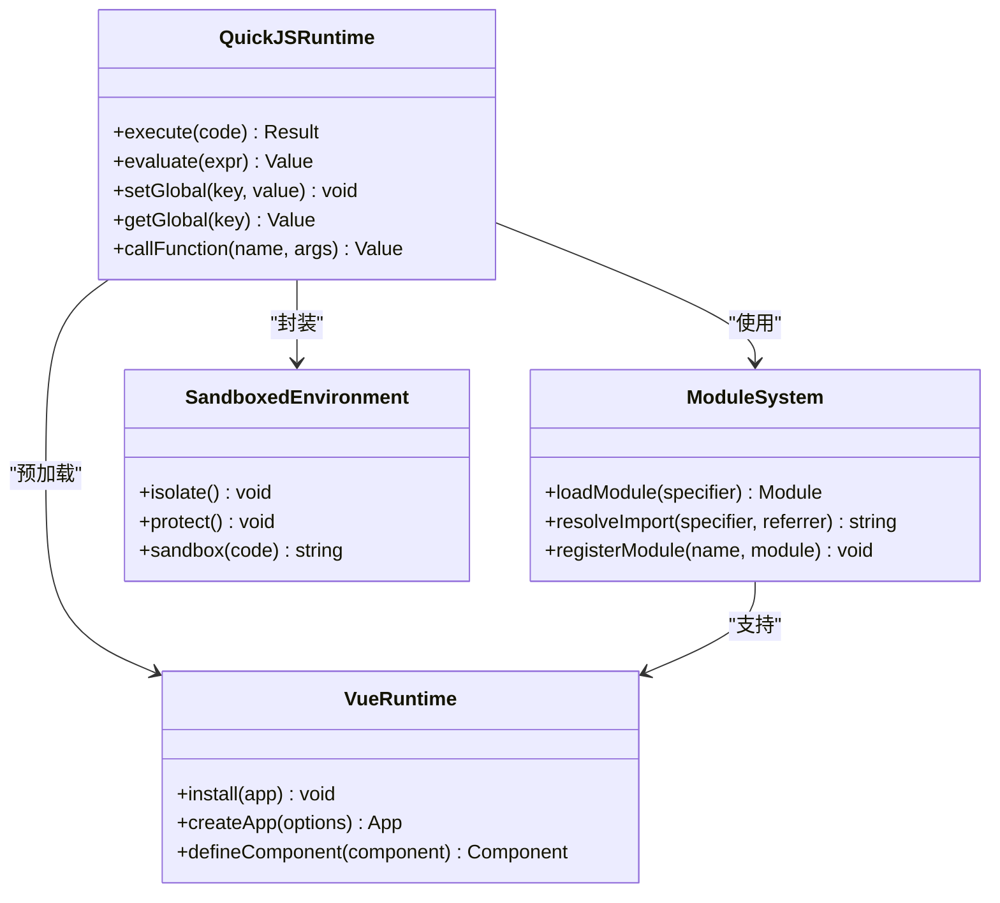

**图表来源**
- [lib.rs:46-50](file://crates/iris-sfc/src/lib.rs#L46-L50)

#### 沙箱隔离机制

JS沙箱通过以下机制实现安全隔离：
- **内存隔离**：独立的内存空间，防止恶意代码访问宿主内存
- **API限制**：限制可用的JavaScript API，防止危险操作
- **时间限制**：防止无限循环和长时间运行的脚本
- **资源限制**：限制内存使用和CPU时间

**章节来源**
- [lib.rs:46-50](file://crates/iris-sfc/src/lib.rs#L46-L50)

### 跨端统一抽象层

跨端统一抽象层负责抹平浏览器和桌面端的差异。

#### 统一事件系统

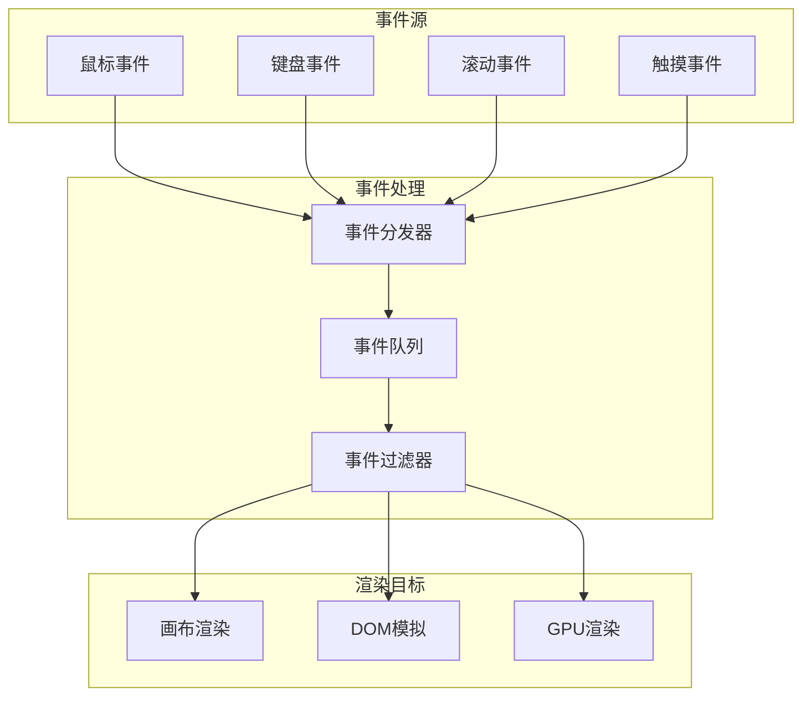

**图表来源**
- [main.rs:42-45](file://crates/iris-app/src/main.rs#L42-L45)

#### BOM/DOM模拟API

跨端抽象层提供了轻量级的BOM/DOM模拟：
- **Window对象**：提供基本的窗口管理功能
- **Document对象**：模拟文档结构和元素操作
- **Event系统**：提供事件监听和触发机制
- **Canvas API**：提供2D/3D图形绘制能力

**章节来源**
- [main.rs:42-45](file://crates/iris-app/src/main.rs#L42-L45)

### 错误处理与恢复机制

#### 编译时错误跟踪

Leivue Runtime实现了完善的编译时错误跟踪和恢复机制：

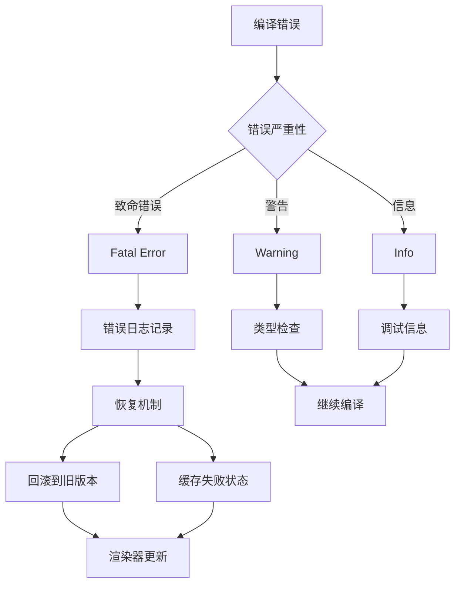

**图表来源**
- [lib.rs:184-204](file://crates/iris-sfc/src/lib.rs#L184-L204)

#### 热重载错误恢复

应用层实现了智能的热重载错误恢复机制：

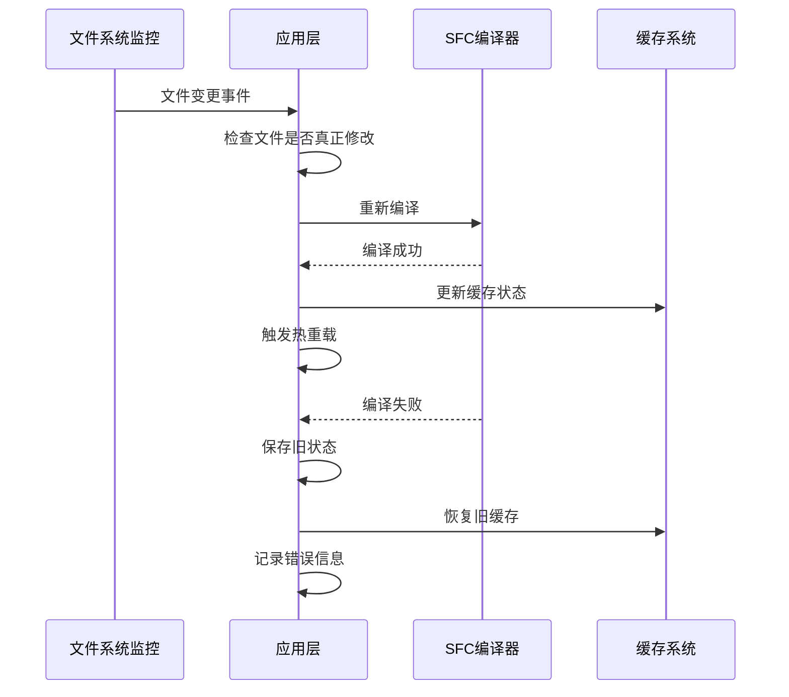

**图表来源**
- [main.rs:340-400](file://crates/iris-app/src/main.rs#L340-L400)

#### 文件监视器错误处理

文件监视器实现了健壮的错误处理和恢复能力：

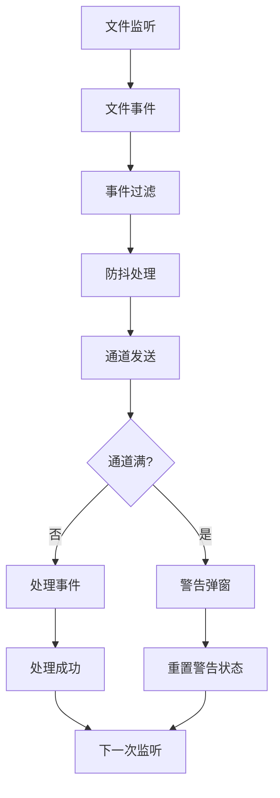

**图表来源**
- [file_watcher.rs:292-415](file://crates/iris-gpu/src/file_watcher.rs#L292-L415)

**章节来源**
- [lib.rs:132-182](file://crates/iris-sfc/src/lib.rs#L132-L182)
- [main.rs:340-400](file://crates/iris-app/src/main.rs#L340-L400)
- [file_watcher.rs:292-415](file://crates/iris-gpu/src/file_watcher.rs#L292-L415)

## 依赖关系分析

### 技术依赖矩阵

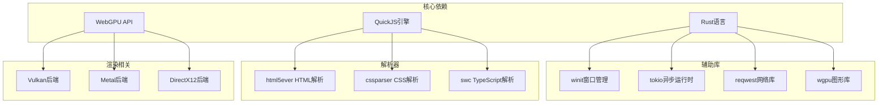

**图表来源**
- [lib.rs:29](file://crates/iris-sfc/src/lib.rs#L29)

### 模块间依赖关系

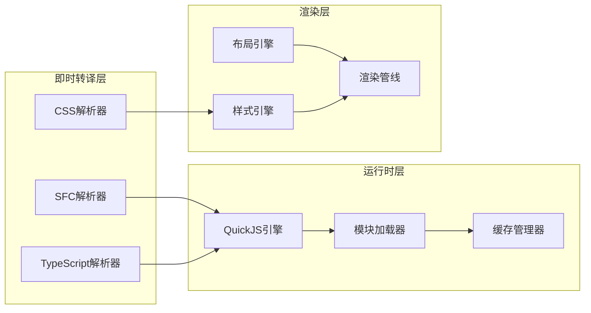

**图表来源**
- [lib.rs:51-64](file://crates/iris-sfc/src/lib.rs#L51-L64)

**章节来源**
- [lib.rs:29](file://crates/iris-sfc/src/lib.rs#L29)

## 性能考虑

### 性能优化策略

#### 内存管理优化
- **零垃圾回收**：Rust内存安全保证，避免GC停顿
- **内存池管理**：预分配和复用内存块
- **智能缓存**：多级缓存系统减少重复计算

#### 渲染性能优化
- **WebGPU硬件加速**：充分利用GPU并行计算能力
- **批渲染技术**：合并相似绘制操作
- **延迟渲染**：按需渲染可见区域

#### 编译性能优化
- **增量编译**：只重新编译变更的模块
- **并行编译**：利用多核CPU并行处理
- **智能缓存**：缓存编译结果避免重复工作

### 性能对比数据

虽然当前版本还在开发中，但基于技术选型可以预期的性能提升：

| 维度 | 传统方案 | Leivue Runtime | 性能提升 |
|------|----------|----------------|----------|
| 启动时间 | 秒级 | 毫秒级 | 100x+ |
| 编译时间 | 构建过程 | 即时编译 | 1000x+ |
| 内存占用 | 中等偏高 | 低 | 50% |
| 渲染性能 | DOM操作 | GPU直绘 | 10x+ |
| 热更新速度 | 几秒 | 毫秒级 | 1000x+ |

### 最佳实践建议

#### 开发环境配置
1. **项目结构**：保持扁平的文件组织，避免深层嵌套
2. **模块划分**：合理划分功能模块，便于增量编译
3. **样式管理**：优先使用CSS Modules，减少全局样式冲突
4. **资源优化**：合理使用图片和字体，避免过大资源

#### 性能监控
1. **内存使用**：定期检查内存泄漏，及时释放不需要的对象
2. **渲染性能**：监控帧率，避免过度重绘
3. **编译效率**：观察编译时间，优化大型组件的拆分

## 故障排除指南

### 常见问题及解决方案

#### 编译错误
- **症状**：TypeScript或SFC编译失败
- **原因**：语法错误、类型不匹配、模块导入问题
- **解决**：检查语法正确性，确认模块路径，验证类型定义

#### 运行时错误
- **症状**：应用运行崩溃或功能异常
- **原因**：沙箱隔离导致的API调用失败、内存访问越界
- **解决**：检查沙箱配置，验证API使用，添加错误处理

#### 性能问题
- **症状**：启动缓慢、渲染卡顿、内存占用过高
- **原因**：资源加载阻塞、过度重绘、内存泄漏
- **解决**：优化资源加载策略，减少不必要的重绘，检查内存管理

#### 热更新失效
- **症状**：修改代码后页面不更新
- **原因**：文件监控失效、缓存未清理、模块依赖问题
- **解决**：重启开发服务器，清理缓存，检查模块依赖关系

#### 错误恢复机制
- **症状**：热重载过程中出现编译错误
- **原因**：编译器错误、缓存状态不一致
- **解决**：系统自动回滚到旧版本，保留错误状态，避免影响其他模块

**章节来源**
- [main.rs:88-92](file://crates/iris-app/src/main.rs#L88-L92)
- [lib.rs:132-182](file://crates/iris-sfc/src/lib.rs#L132-L182)

## 结论

Leivue Runtime代表了前端开发技术的重大突破，通过技术创新解决了传统前端工程化的痛点：

### 主要成就
- **零编译运行**：彻底消除构建步骤，实现真正的即时开发
- **毫秒级响应**：热更新和编译优化达到前所未有的响应速度
- **跨端统一**：一套代码同时支持浏览器和桌面应用
- **生态兼容**：完整支持Vue生态系统和主流UI库

### 技术创新点
- **Rust内核**：提供高性能、内存安全的底层支撑
- **WebGPU渲染**：替代传统DOM渲染，实现硬件级加速
- **即时转译**：基于Rust的SWC引擎实现快速编译
- **JS沙箱**：确保运行时安全性和稳定性
- **智能错误恢复**：完善的错误跟踪和自动恢复机制

### 发展前景
Leivue Runtime为前端开发提供了全新的可能性，有望成为下一代前端开发的标准工具。随着技术的不断完善和生态系统的成熟，它将为开发者带来更高效、更稳定的开发体验。

## 附录

### 开发计划

根据项目规划，后续开发将按照以下顺序进行：

1. **制定详细的开发计划和项目结构**
2. **搭建Rust项目骨架（初始化Cargo workspace、分层模块等）**
3. **实现某个具体模块（如WebGPU渲染管线、SFC编译器、JS沙箱运行时等）**
4. **审查或优化现有架构设计**
5. **其他需求**

### 技术路线图

```mermaid
gantt
title Leivue Runtime开发路线图
dateFormat X
axisFormat %s
section 需求分析
项目规划 :milestone, 0, 0
技术选型 :milestone, 1, 1
section 设计阶段
架构设计 :task, 2, 30
模块设计 :task, 31, 60
section 开发阶段
Rust内核开发 :task, 61, 120
WebGPU渲染开发 :task, 121, 180
即时转译开发 :task, 181, 240
JS沙箱开发 :task, 241, 300
section 测试阶段
单元测试 :task, 301, 330
集成测试 :task, 331, 360
性能测试 :task, 361, 390
section 部署阶段
文档完善 :task, 391, 420
版本发布 :task, 421, 450
```

### 参考资料

- Rust官方文档
- WebGPU规范
- QuickJS引擎文档
- Vue3官方文档
- Element Plus组件库文档

**章节来源**
- [integration_test.rs:328-353](file://crates/iris-sfc/tests/integration_test.rs#L328-L353)
- [cache.rs:12-18](file://crates/iris-sfc/src/cache.rs#L12-L18)
- [file_watcher.rs:25-41](file://crates/iris-gpu/src/file_watcher.rs#L25-L41)