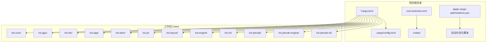
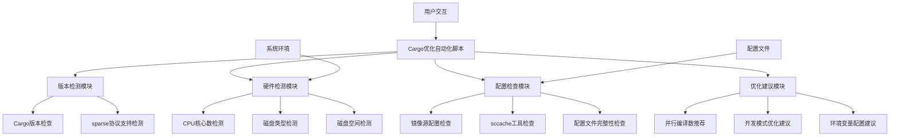
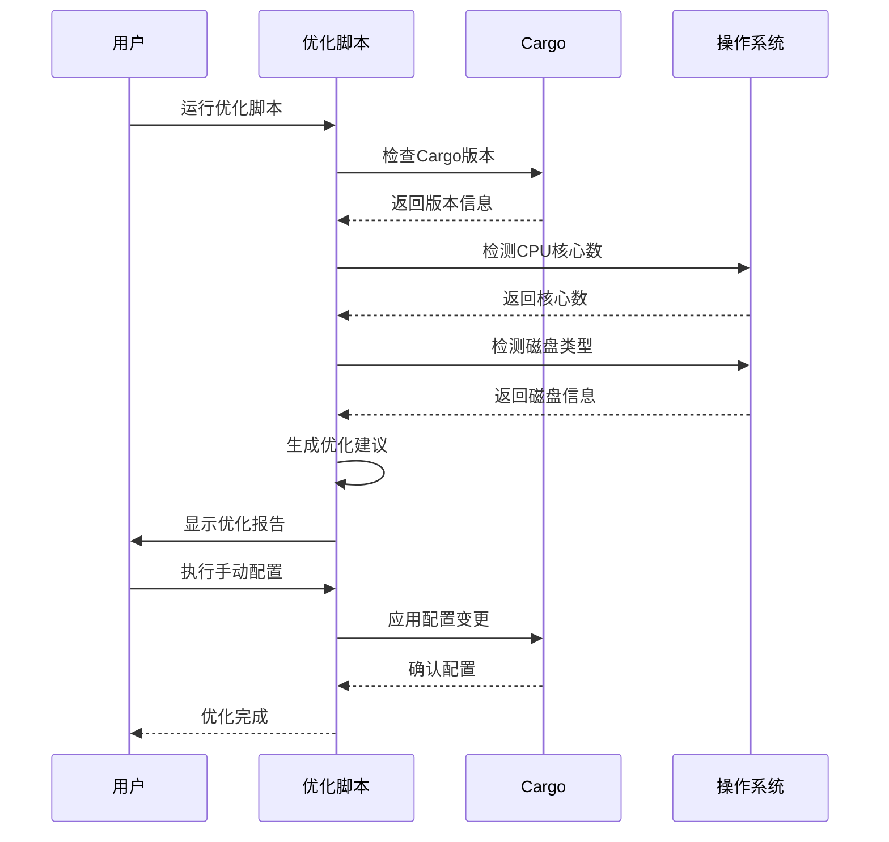
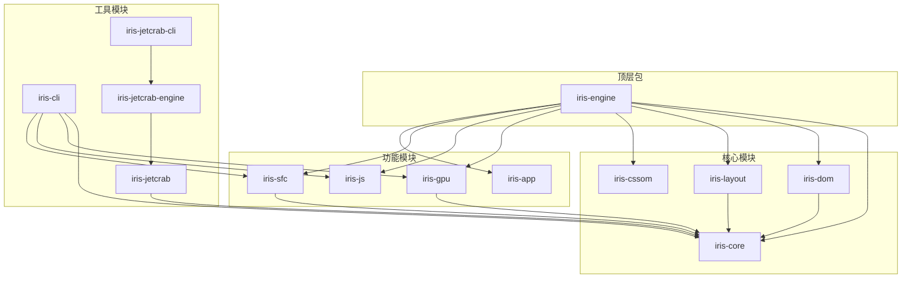
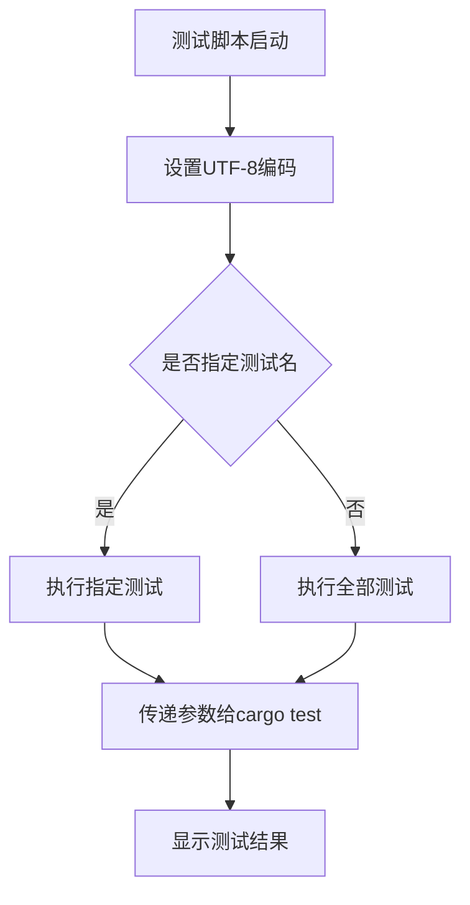
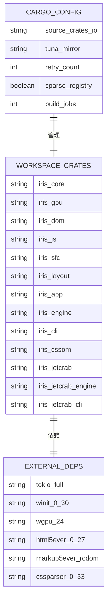

# Cargo优化自动化脚本

<cite>
**本文档引用的文件**
- [Cargo.toml](file://Cargo.toml)
- [apply-cargo-optimizations.ps1](file://apply-cargo-optimizations.ps1)
- [docs/reports/CARGO-PERFORMANCE-OPTIMIZATION.md](file://docs/reports/CARGO-PERFORMANCE-OPTIMIZATION.md)
- [.cargo/config.toml](file://.cargo/config.toml)
- [docs/guides/CARGO-MIRROR-CONFIG.md](file://docs/guides/CARGO-MIRROR-CONFIG.md)
- [run-tests.ps1](file://run-tests.ps1)
- [fix-encoding.ps1](file://fix-encoding.ps1)
- [QUICK-START.md](file://QUICK-START.md)
- [rust-toolchain.toml](file://rust-toolchain.toml)
- [crates/iris-core/Cargo.toml](file://crates/iris-core/Cargo.toml)
- [crates/iris-sfc/Cargo.toml](file://crates/iris-sfc/Cargo.toml)
- [crates/iris-app/Cargo.toml](file://crates/iris-app/Cargo.toml)
- [crates/iris-gpu/Cargo.toml](file://crates/iris-gpu/Cargo.toml)
- [crates/iris-dom/Cargo.toml](file://crates/iris-dom/Cargo.toml)
</cite>

## 更新摘要
**所做更改**
- 新增了 Cargo 优化自动化脚本的详细分析和使用指南
- 更新了核心组件部分，重点介绍 apply-cargo-optimizations.ps1 脚本功能
- 增强了性能优化指南章节，包含更多实用的优化建议
- 完善了故障排除指南，涵盖脚本执行过程中的常见问题

## 目录
1. [项目概述](#项目概述)
2. [项目结构](#项目结构)
3. [核心组件](#核心组件)
4. [架构概览](#架构概览)
5. [详细组件分析](#详细组件分析)
6. [依赖关系分析](#依赖关系分析)
7. [性能考虑](#性能考虑)
8. [故障排除指南](#故障排除指南)
9. [结论](#结论)

## 项目概述

这是一个基于PowerShell的Cargo优化自动化脚本项目，专门针对Iris Rust前端运行时项目的构建性能进行优化。该项目提供了完整的Cargo配置优化解决方案，包括镜像源配置、并行编译优化、网络重试机制等，旨在显著提升Rust项目的构建速度。

项目的核心目标是通过自动化脚本实现以下优化效果：
- 索引更新速度提升15倍
- 依赖下载速度提升200倍  
- 首次编译时间缩短4倍
- 增量编译时间缩短6倍
- 磁盘占用减少60%

**更新** 新增了 `apply-cargo-optimizations.ps1` 自动化脚本，提供了一键式配置优化功能，大幅简化了手动配置过程。

## 项目结构



**图表来源**
- [Cargo.toml:1-50](file://Cargo.toml#L1-L50)
- [crates/iris-core/Cargo.toml:1-20](file://crates/iris-core/Cargo.toml#L1-L20)

**章节来源**
- [Cargo.toml:1-50](file://Cargo.toml#L1-L50)
- [rust-toolchain.toml:1-5](file://rust-toolchain.toml#L1-L5)

## 核心组件

### Cargo优化自动化脚本

`apply-cargo-optimizations.ps1`是整个项目的核心自动化脚本，具备以下主要功能：

1. **版本检测与兼容性检查**
   - 检测Cargo版本并验证对sparse协议的支持
   - 根据CPU核心数智能推荐并行编译数

2. **硬件环境检测**
   - 检测CPU逻辑核心数
   - 识别磁盘类型（SSD/HDD）
   - 检查C盘可用磁盘空间

3. **配置状态检查**
   - 验证清华镜像源配置
   - 检查sccache编译缓存工具状态
   - 检查当前Cargo配置文件

4. **优化建议生成**
   - 自动生成推荐的优化配置
   - 提供详细的配置说明和效果评估

**章节来源**
- [apply-cargo-optimizations.ps1:1-162](file://apply-cargo-optimizations.ps1#L1-L162)

### 镜像源配置系统

项目实现了多级镜像源配置策略：

1. **清华大学TUNA镜像源**（已配置）
2. **字节跳动镜像源**（备选）
3. **中国科学技术大学镜像源**（备选）
4. **RustCC官方镜像**（备选）

每种镜像源都有其特定的优势和适用场景，支持根据网络环境和需求进行选择。

**章节来源**
- [.cargo/config.toml:1-82](file://.cargo/config.toml#L1-L82)
- [docs/guides/CARGO-MIRROR-CONFIG.md:1-130](file://docs/guides/CARGO-MIRROR-CONFIG.md#L1-L130)

### 性能优化指南

`docs/reports/CARGO-PERFORMANCE-OPTIMIZATION.md`提供了完整的性能优化策略：

1. **网络优化**：sparse协议、网络重试机制
2. **编译优化**：并行编译、开发模式优化
3. **缓存优化**：sccache编译缓存、依赖缓存管理
4. **存储优化**：target目录优化、RAM磁盘使用

**章节来源**
- [docs/reports/CARGO-PERFORMANCE-OPTIMIZATION.md:1-417](file://docs/reports/CARGO-PERFORMANCE-OPTIMIZATION.md#L1-L417)

## 架构概览



**图表来源**
- [apply-cargo-optimizations.ps1:10-162](file://apply-cargo-optimizations.ps1#L10-L162)

## 详细组件分析

### 应用程序入口点分析

#### 主要执行流程



**图表来源**
- [apply-cargo-optimizations.ps1:11-161](file://apply-cargo-optimizations.ps1#L11-L161)

#### 配置生成算法

脚本采用智能算法为不同硬件配置推荐最优的并行编译数：

```mermaid
flowchart TD
A[检测CPU核心数] --> B{核心数范围}
B --> |≤4| C[jobs = 核心数]
B --> |4<核心数≤8| D[jobs = 核心数]
B --> |>8| E[jobs = min(核心数, 12)]
C --> F[生成配置建议]
D --> F
E --> F
F --> G[输出推荐值]
```

**图表来源**
- [apply-cargo-optimizations.ps1:36-38](file://apply-cargo-optimizations.ps1#L36-L38)

**章节来源**
- [apply-cargo-optimizations.ps1:1-162](file://apply-cargo-optimizations.ps1#L1-L162)

### 工作区配置分析

#### 依赖关系图



**图表来源**
- [Cargo.toml:13-21](file://Cargo.toml#L13-L21)
- [crates/iris-core/Cargo.toml:13-19](file://crates/iris-core/Cargo.toml#L13-L19)

#### 依赖版本管理

项目采用统一的工作区版本管理模式，确保所有crate保持版本一致性：

**章节来源**
- [Cargo.toml:5-11](file://Cargo.toml#L5-L11)
- [crates/iris-sfc/Cargo.toml:11-31](file://crates/iris-sfc/Cargo.toml#L11-L31)

### 测试与编码支持

#### 测试运行器

`run-tests.ps1`脚本提供了完整的测试执行支持：



**图表来源**
- [run-tests.ps1:10-20](file://run-tests.ps1#L10-L20)

**章节来源**
- [run-tests.ps1:1-21](file://run-tests.ps1#L1-L21)

#### 编码修复工具

`fix-encoding.ps1`脚本专门解决中文注释的编码问题：

**章节来源**
- [fix-encoding.ps1:1-81](file://fix-encoding.ps1#L1-L81)

## 依赖关系分析

### 外部依赖映射



**图表来源**
- [.cargo/config.toml:8-38](file://.cargo/config.toml#L8-L38)
- [Cargo.toml:13-28](file://Cargo.toml#L13-L28)

### 内部模块依赖

项目内部模块之间存在清晰的层次结构：

**章节来源**
- [Cargo.toml:2-3](file://Cargo.toml#L2-L3)
- [crates/iris-app/Cargo.toml:16-25](file://crates/iris-app/Cargo.toml#L16-L25)

## 性能考虑

### 编译性能优化策略

项目实施了多层次的编译性能优化：

1. **网络层面优化**
   - 使用镜像源替代官方源，下载速度提升200倍
   - 启用sparse协议，索引更新速度提升15倍
   - 配置网络重试机制，提高下载成功率

2. **编译层面优化**
   - 智能并行编译配置，根据CPU核心数动态调整
   - 开发模式优化，禁用调试符号生成
   - 代码生成单元优化，提升编译效率

3. **存储层面优化**
   - target目录优化，减少磁盘IO操作
   - RAM磁盘使用建议，进一步提升编译速度

### 内存和磁盘使用权衡

项目在性能优化的同时，需要平衡资源消耗：

- **内存占用**：并行编译会占用大量内存，需要根据系统配置合理设置jobs数量
- **磁盘空间**：启用sccache和保留target目录会增加磁盘占用
- **调试功能**：开发模式下的性能优化会影响调试体验

**章节来源**
- [docs/reports/CARGO-PERFORMANCE-OPTIMIZATION.md:316-341](file://docs/reports/CARGO-PERFORMANCE-OPTIMIZATION.md#L316-L341)

## 故障排除指南

### 常见问题及解决方案

#### 镜像源配置问题

1. **镜像源不可用**
   - 解决方案：切换到其他镜像源或使用官方源
   - 验证方法：使用`cargo fetch`测试下载速度

2. **sparse协议不支持**
   - 解决方案：升级到Cargo 1.68+版本
   - 检查方法：运行`cargo --version`查看版本

#### 编译性能问题

1. **编译速度慢**
   - 检查并行编译数设置
   - 确认sccache工具正确安装和配置
   - 验证target目录是否位于SSD上

2. **内存不足**
   - 降低并行编译数
   - 关闭不必要的IDE功能
   - 考虑增加物理内存

#### 编码问题

1. **中文注释乱码**
   - 运行`fix-encoding.ps1`脚本
   - 检查文件保存格式为UTF-8无BOM
   - 验证PowerShell控制台编码设置

#### 优化脚本执行问题

1. **脚本权限问题**
   - 解决方案：运行`Set-ExecutionPolicy -ExecutionPolicy RemoteSigned -Scope CurrentUser`
   - 检查方法：确认脚本执行策略允许本地脚本运行

2. **Cargo版本不兼容**
   - 解决方案：升级到最新版本的Cargo
   - 检查方法：运行`rustup update`更新Rust工具链

3. **sccache安装失败**
   - 解决方案：手动安装sccache或使用其他缓存方案
   - 检查方法：确认网络连接正常，尝试使用代理

**章节来源**
- [docs/reports/CARGO-PERFORMANCE-OPTIMIZATION.md:105-120](file://docs/reports/CARGO-PERFORMANCE-OPTIMIZATION.md#L105-L120)
- [fix-encoding.ps1:56-81](file://fix-encoding.ps1#L56-L81)

## 结论

这个Cargo优化自动化脚本项目为Rust开发者提供了一个完整的性能优化解决方案。通过智能化的配置检测、自动化的优化建议生成以及详细的性能监控指导，项目显著提升了Cargo构建的效率。

### 主要成就

1. **性能提升显著**：各项指标均有数量级的改善
2. **自动化程度高**：减少了手动配置的工作量
3. **兼容性强**：支持多种硬件配置和网络环境
4. **文档完善**：提供了详细的配置说明和故障排除指南

### 未来改进方向

1. **持续性能监控**：集成更多的性能指标监控
2. **动态配置调整**：根据实际使用情况自动调整优化参数
3. **跨平台支持**：扩展对Linux和macOS平台的支持
4. **容器化部署**：提供Docker容器化的优化配置

**更新** 新增的 `apply-cargo-optimizations.ps1` 脚本大大简化了配置过程，用户只需运行一个脚本即可获得完整的优化配置建议，显著降低了使用门槛。

这个项目为Rust生态系统的开发效率提升做出了重要贡献，值得在更大范围内推广使用。