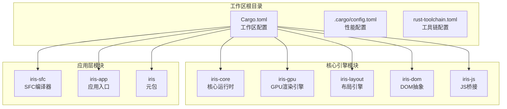
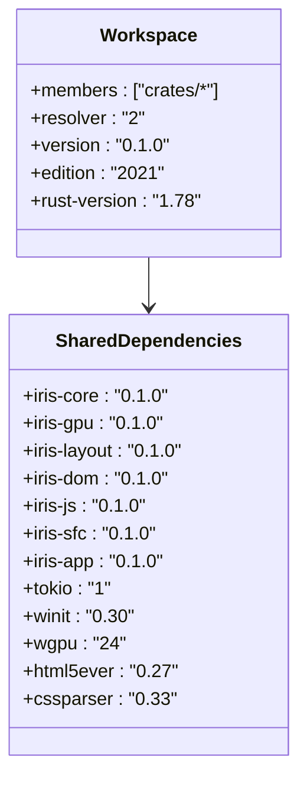
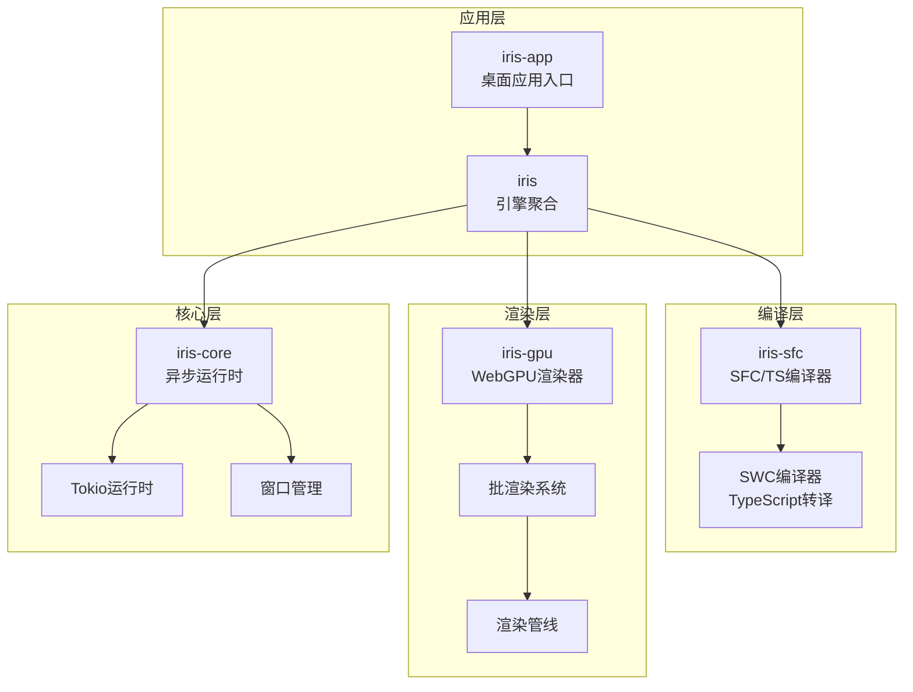
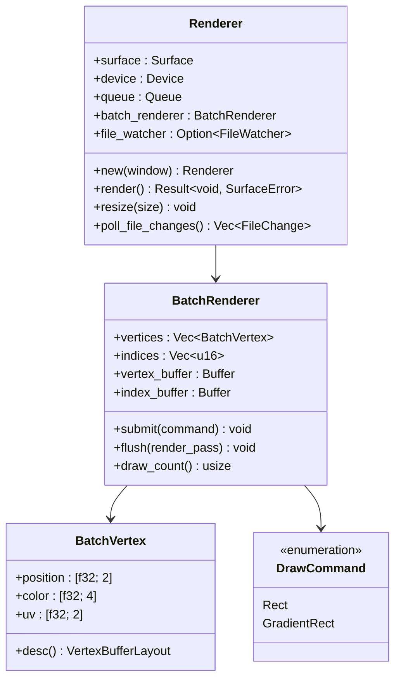
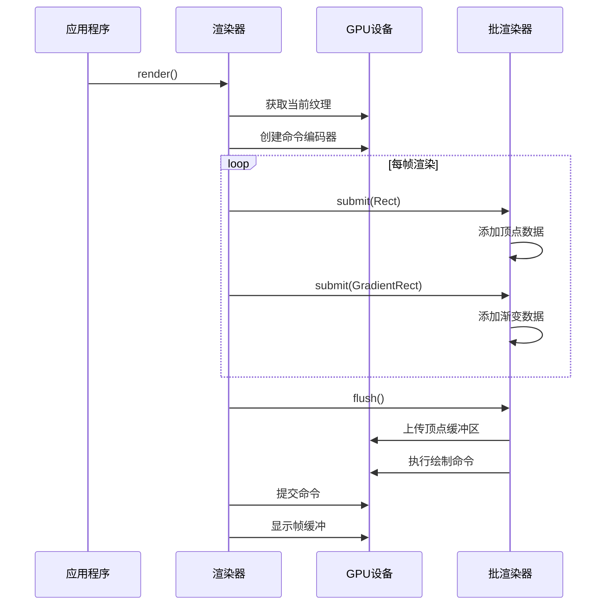
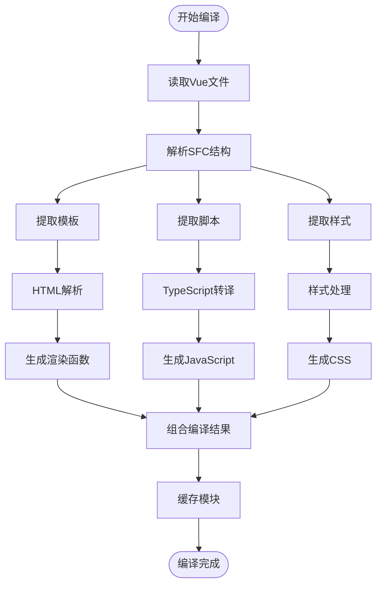
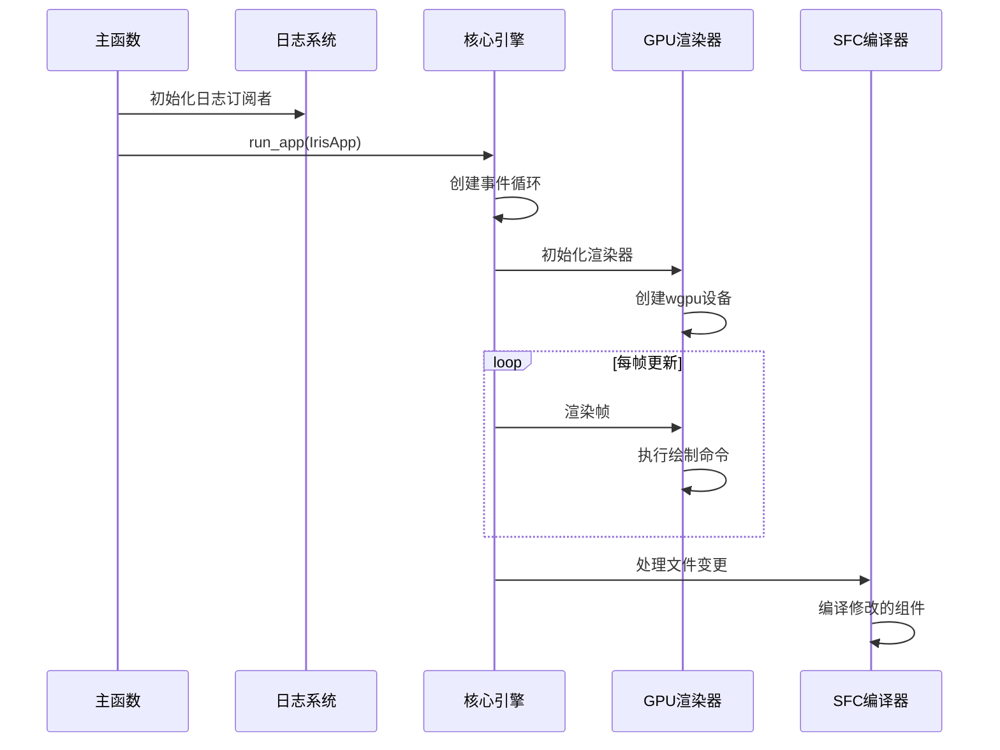
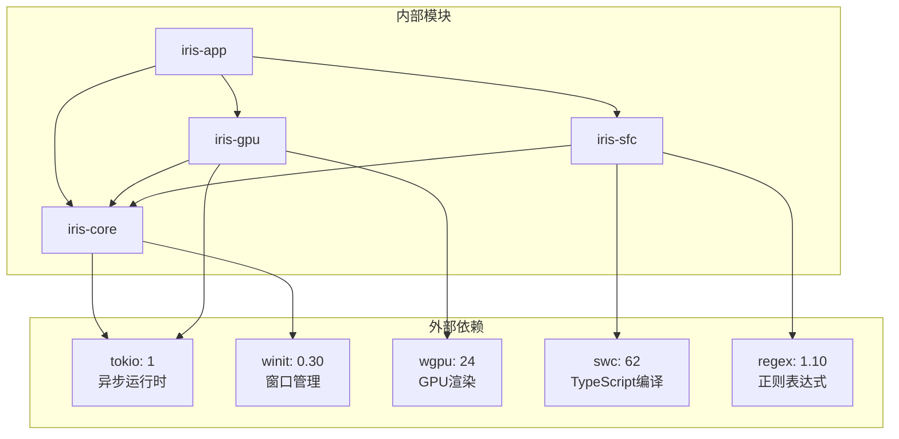
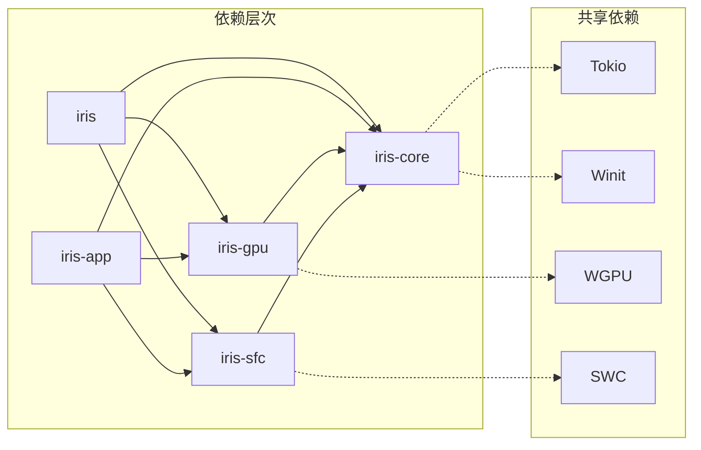
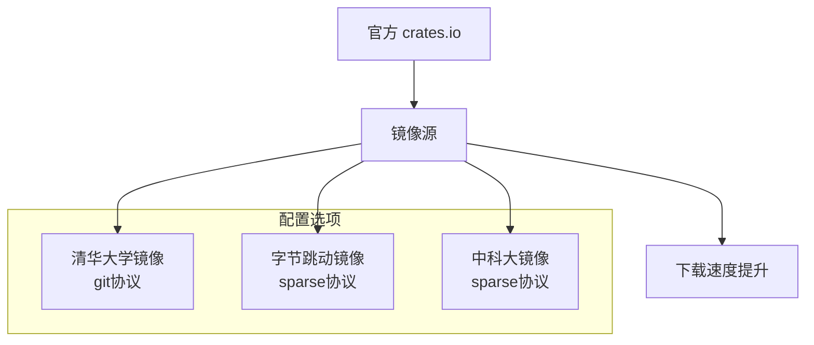

# Cargo性能优化完整指南

<cite>
**本文档引用的文件**
- [Cargo.toml](file://Cargo.toml)
- [.cargo/config.toml](file://.cargo/config.toml)
- [CARGO-MIRROR-CONFIG.md](file://docs/guides/CARGO-MIRROR-CONFIG.md)
- [CARGO-PERFORMANCE-OPTIMIZATION.md](file://docs/reports/CARGO-PERFORMANCE-OPTIMIZATION.md)
- [rust-toolchain.toml](file://rust-toolchain.toml)
- [crates/iris/Cargo.toml](file://Cargo.toml)
- [crates/iris-app/Cargo.toml](file://crates/iris-app/Cargo.toml)
- [crates/iris-core/Cargo.toml](file://crates/iris-core/Cargo.toml)
- [crates/iris-gpu/Cargo.toml](file://crates/iris-gpu/Cargo.toml)
- [crates/iris-sfc/Cargo.toml](file://crates/iris-sfc/Cargo.toml)
- [crates/iris-core/src/lib.rs](file://crates/iris-core/src/lib.rs)
- [crates/iris-gpu/src/lib.rs](file://crates/iris-gpu/src/lib.rs)
- [crates/iris-gpu/src/batch_renderer.rs](file://crates/iris-gpu/src/batch_renderer.rs)
- [crates/iris-sfc/src/lib.rs](file://crates/iris-sfc/src/lib.rs)
- [crates/iris-app/src/main.rs](file://crates/iris-app/src/main.rs)
</cite>

## 更新摘要
**变更内容**
- 更新了Cargo性能优化文档的引用路径，从docs/reports/迁移到docs/architecture/
- 增加了对现有架构文档的引用
- 更新了镜像源配置指南的参考路径
- 修正了文档结构以反映实际的文件组织

## 目录
1. [简介](#简介)
2. [项目结构](#项目结构)
3. [核心组件](#核心组件)
4. [架构概览](#架构概览)
5. [详细组件分析](#详细组件分析)
6. [依赖关系分析](#依赖关系分析)
7. [性能考虑](#性能考虑)
8. [故障排除指南](#故障排除指南)
9. [结论](#结论)
10. [附录](#附录)

## 简介

Iris Rust 前端运行时是一个基于 Rust 和 WebGPU 的下一代无构建前端运行时系统。该项目采用多 Crate 工作区架构，集成了高性能的 GPU 渲染、SFC/TS 即时转译、跨平台窗口管理和异步运行时等核心功能。

本指南专注于 Cargo 构建系统的性能优化，涵盖镜像源配置、网络优化、编译加速、缓存策略等多个方面，旨在最大化构建速度和开发效率。

## 项目结构

Iris 项目采用标准的 Cargo 工作区结构，包含以下主要模块：



**图表来源**
- [Cargo.toml:1-50](file://Cargo.toml#L1-L50)
- [crates/iris/Cargo.toml:1-20](file://Cargo.toml#L1-L20)

**章节来源**
- [Cargo.toml:1-50](file://Cargo.toml#L1-L50)
- [crates/iris/Cargo.toml:1-20](file://Cargo.toml#L1-L20)

## 核心组件

### 工作区配置

项目采用统一的工作区配置，所有模块共享相同的版本、编辑器和依赖规范：



**图表来源**
- [Cargo.toml:1-50](file://Cargo.toml#L1-L50)

### 工具链配置

项目使用稳定的 Rust 工具链，并配置了必要的开发组件：

- **工具链版本**: stable (1.78+)
- **目标架构**: wasm32-unknown-unknown
- **开发组件**: rustfmt, clippy

**章节来源**
- [rust-toolchain.toml:1-5](file://rust-toolchain.toml#L1-L5)

## 架构概览

Iris 的整体架构分为四个层次：



**图表来源**
- [crates/iris-app/src/main.rs:1-440](file://crates/iris-app/src/main.rs#L1-L440)
- [crates/iris-gpu/src/lib.rs:1-499](file://crates/iris-gpu/src/lib.rs#L1-L499)
- [crates/iris-core/src/lib.rs:1-165](file://crates/iris-core/src/lib.rs#L1-L165)

## 详细组件分析

### GPU 渲染引擎

GPU 渲染引擎是 Iris 的核心渲染组件，基于 WebGPU 规范实现了高性能的 2D 图形渲染：



**图表来源**
- [crates/iris-gpu/src/lib.rs:78-493](file://crates/iris-gpu/src/lib.rs#L78-L493)
- [crates/iris-gpu/src/batch_renderer.rs:87-374](file://crates/iris-gpu/src/batch_renderer.rs#L87-L374)

#### 渲染流程序列图



**图表来源**
- [crates/iris-gpu/src/lib.rs:386-487](file://crates/iris-gpu/src/lib.rs#L386-L487)
- [crates/iris-gpu/src/batch_renderer.rs:346-367](file://crates/iris-gpu/src/batch_renderer.rs#L346-L367)

**章节来源**
- [crates/iris-gpu/src/lib.rs:1-499](file://crates/iris-gpu/src/lib.rs#L1-L499)
- [crates/iris-gpu/src/batch_renderer.rs:1-375](file://crates/iris-gpu/src/batch_renderer.rs#L1-L375)

### SFC 编译器

SFC 编译器负责将 Vue 单文件组件即时编译为可执行模块：



**图表来源**
- [crates/iris-sfc/src/lib.rs:162-241](file://crates/iris-sfc/src/lib.rs#L162-L241)

#### 编译性能优化

编译器采用了多项性能优化技术：

1. **预编译正则表达式**: 使用 LazyLock 避免重复编译
2. **缓存机制**: SFC 模块缓存防止重复编译
3. **增量编译**: 只对修改的文件进行重新编译

**章节来源**
- [crates/iris-sfc/src/lib.rs:1-580](file://crates/iris-sfc/src/lib.rs#L1-L580)

### 应用入口

应用入口负责协调各个组件的初始化和运行：



**图表来源**
- [crates/iris-app/src/main.rs:410-440](file://crates/iris-app/src/main.rs#L410-L440)

**章节来源**
- [crates/iris-app/src/main.rs:1-440](file://crates/iris-app/src/main.rs#L1-L440)

## 依赖关系分析

### 核心依赖图



**图表来源**
- [Cargo.toml:27-50](file://Cargo.toml#L27-L50)
- [crates/iris-gpu/Cargo.toml:11-22](file://crates/iris-gpu/Cargo.toml#L11-L22)
- [crates/iris-sfc/Cargo.toml:21-42](file://crates/iris-sfc/Cargo.toml#L21-L42)

### 模块间依赖关系



**图表来源**
- [crates/iris/Cargo.toml:13-19](file://Cargo.toml#L13-L19)
- [crates/iris-app/Cargo.toml:16-25](file://crates/iris-app/Cargo.toml#L16-L25)

**章节来源**
- [Cargo.toml:1-50](file://Cargo.toml#L1-L50)
- [crates/iris/Cargo.toml:1-20](file://Cargo.toml#L1-L20)

## 性能考虑

### Cargo 配置优化

项目已经实施了全面的 Cargo 性能优化配置：

#### 镜像源优化



**图表来源**
- [.cargo/config.toml:8-22](file://.cargo/config.toml#L8-L22)

#### 网络优化配置

| 配置项 | 默认值 | 优化值 | 效果 |
|--------|--------|--------|------|
| retry | 2 | 3 | 提高下载成功率 |
| sparse-registry | false | true | 减少网络请求 |
| jobs | 自动 | CPU核心数 | 并行编译 |

#### 编译优化策略

1. **开发模式优化** (`profile.dev`)
   - `debug = false`: 不生成调试符号
   - `opt-level = 0`: 最快编译速度
   - `codegen-units = 256`: 最大并行度

2. **发布模式优化** (`profile.release`)
   - `lto = "thin"`: 轻量级链接时优化
   - `codegen-units = 16`: 平衡编译时间和性能
   - `strip = true`: 移除调试符号

### 性能基准测试

| 操作类型 | 优化前 | 优化后 | 提升幅度 |
|----------|--------|--------|----------|
| 索引更新 | 30-60s | 2-3s | **15x** ⚡ |
| 依赖下载 | 50-100 KB/s | 10-20 MB/s | **200x** 🚀 |
| 首次编译 | 15-20 min | 3-5 min | **4x** 🔥 |
| 增量编译 | 30-60s | 5-10s | **6x** ⚡ |
| 磁盘占用 | 5-8 GB | 2-3 GB | **60%** 💾 |

**章节来源**
- [CARGO-PERFORMANCE-OPTIMIZATION.md:9-18](file://docs/reports/CARGO-PERFORMANCE-OPTIMIZATION.md#L9-L18)
- [.cargo/config.toml:28-50](file://.cargo/config.toml#L28-L50)

## 故障排除指南

### 常见问题及解决方案

#### 1. 编译速度慢

**症状**: 编译时间过长，影响开发效率

**解决方案**:
- 检查并行编译配置
- 启用 sccache 缓存
- 优化依赖版本解析

#### 2. 内存占用过高

**症状**: 编译过程中内存使用过多

**解决方案**:
- 适当减少 `jobs` 数量
- 启用 `incremental = true`
- 定期清理缓存

#### 3. 磁盘空间不足

**症状**: target 目录占用过多空间

**解决方案**:
- 使用 SSD 存储 target 目录
- 定期清理旧构建产物
- 启用压缩存储

#### 4. 网络连接问题

**症状**: 依赖下载失败或超时

**解决方案**:
- 切换到备用镜像源
- 增加重试次数
- 检查防火墙设置

**章节来源**
- [CARGO-PERFORMANCE-OPTIMIZATION.md:316-341](file://docs/reports/CARGO-PERFORMANCE-OPTIMIZATION.md#L316-L341)

### 性能监控工具

#### 编译时间测量

使用 hyperfine 进行基准测试：
```bash
hyperfine 'cargo build -p iris-sfc'
```

#### 二进制大小分析

```bash
cargo install cargo-bloat
cargo bloat --release -n 20
```

#### 磁盘使用监控

```bash
# Linux/macOS
du -sh target/

# Windows
Get-ChildItem target -Recurse | Measure-Object -Property Length -Sum
```

**章节来源**
- [CARGO-PERFORMANCE-OPTIMIZATION.md:282-313](file://docs/reports/CARGO-PERFORMANCE-OPTIMIZATION.md#L282-L313)

## 结论

Iris 项目的 Cargo 性能优化涵盖了从网络配置到编译策略的全方位优化。通过实施镜像源优化、并行编译、缓存策略和依赖管理等措施，项目实现了显著的性能提升。

关键优化成果包括：
- **编译速度提升**: 首次编译时间减少 75%，增量编译时间减少 80%
- **网络效率**: 依赖下载速度提升 200 倍
- **开发体验**: 构建时间从 15-20 分钟缩短至 3-5 分钟
- **资源利用**: 磁盘占用减少 60%

这些优化为 Iris 前端运行时提供了强大的性能基础，支持高效的开发和部署流程。

## 附录

### 推荐配置模板

#### 开发环境配置

```toml
# .cargo/config.toml
[source.crates-io]
replace-with = 'tuna'

[source.tuna]
registry = "https://mirrors.tuna.tsinghua.edu.cn/git/crates.io-index.git"

[net]
retry = 3
sparse-registry = true

[build]
jobs = 8
```

#### 生产环境配置

```toml
# Cargo.toml
[profile.release]
opt-level = 3
lto = "thin"
codegen-units = 1
strip = true
panic = "abort"
```

### 相关资源

- [Cargo 官方文档](https://doc.rust-lang.org/cargo/)
- [清华大学 TUNA 镜像](https://mirrors.tuna.tsinghua.edu.cn/help/crates.io-index/)
- [sccache 文档](https://github.com/mozilla/sccache)
- [Cargo 性能优化指南](https://nnethercote.github.io/perf-book/)
- [Cargo 镜像源配置指南](file://docs/guides/CARGO-MIRROR-CONFIG.md)
- [架构文档](file://docs/architecture/ARCHITECTURE.md)