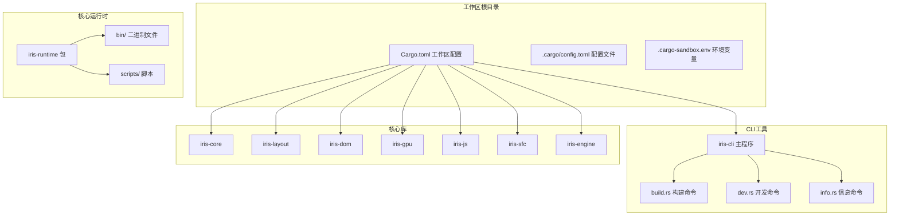
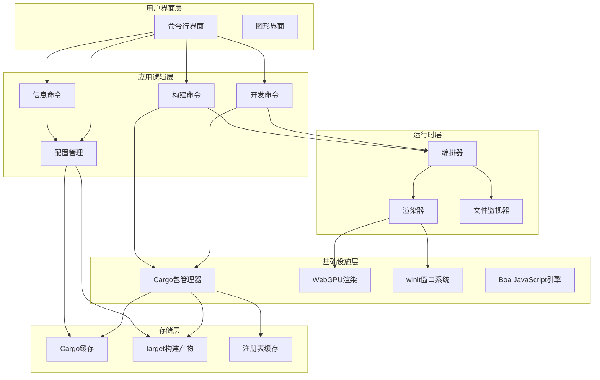
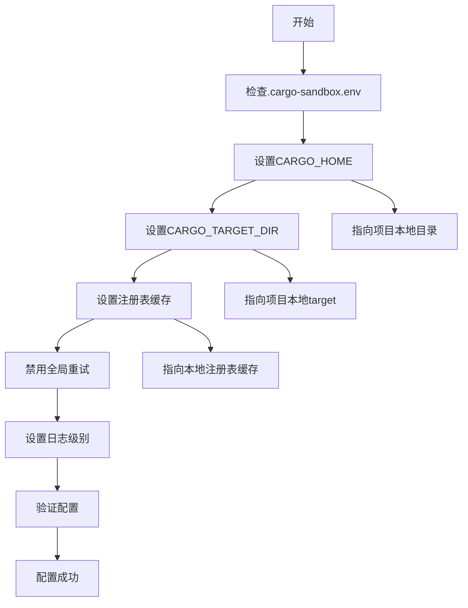
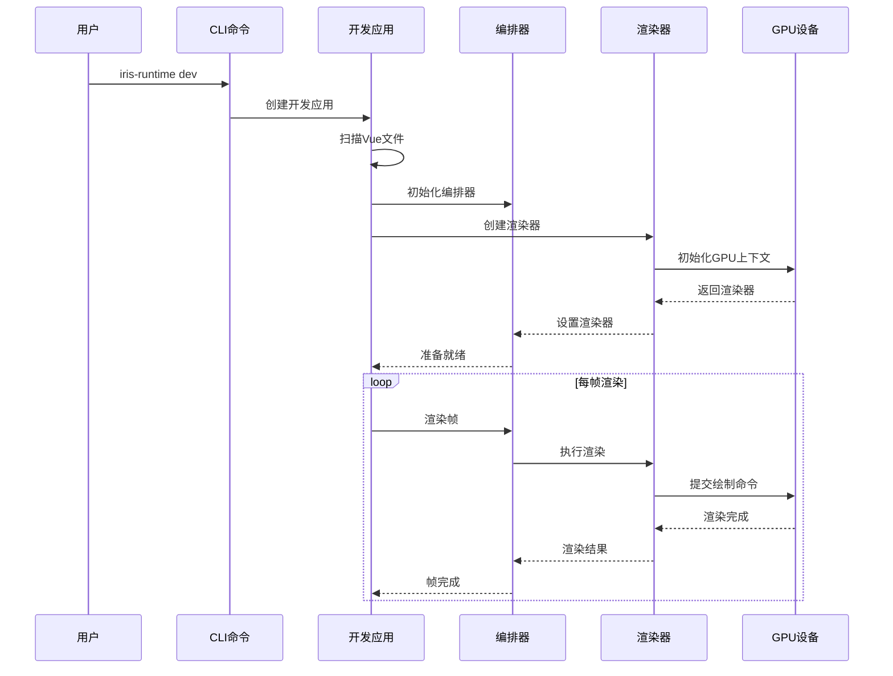
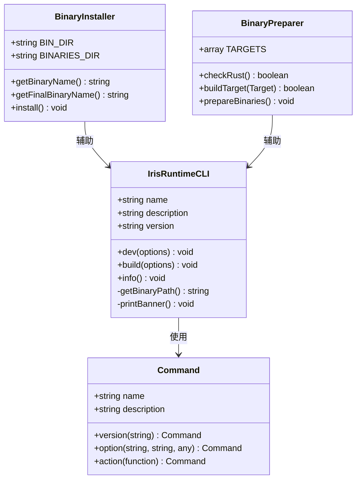
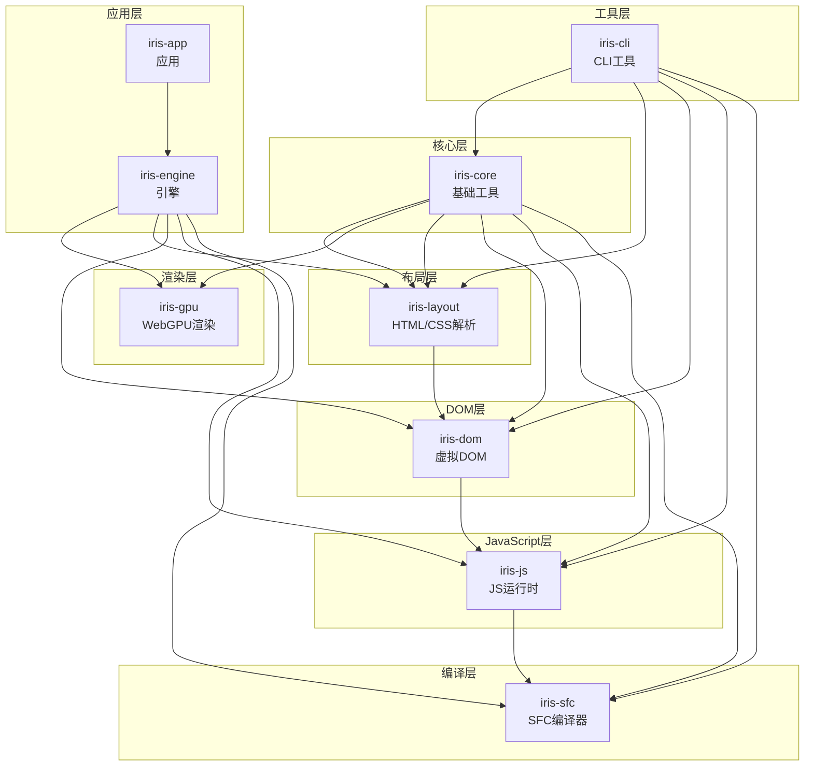

# Cargo沙箱隔离系统

<cite>
**本文档引用的文件**
- [.cargo/config.toml](file://.cargo/config.toml)
- [.cargo-sandbox.env](file://.cargo-sandbox.env)
- [docs/CARGO_SANDBOX_GUIDE.md](file://docs/CARGO_SANDBOX_GUIDE.md)
- [ARCHITECTURE.md](file://ARCHITECTURE.md)
- [Cargo.toml](file://Cargo.toml)
- [iris-runtime/package.json](file://iris-runtime/package.json)
- [iris-runtime/bin/iris-runtime.js](file://iris-runtime/bin/iris-runtime.js)
- [iris-runtime/scripts/install.js](file://iris-runtime/scripts/install.js)
- [iris-runtime/scripts/prepare-binaries.js](file://iris-runtime/scripts/prepare-binaries.js)
- [crates/iris-cli/src/main.rs](file://crates/iris-cli/src/main.rs)
- [crates/iris-cli/src/commands/dev.rs](file://crates/iris-cli/src/commands/dev.rs)
- [crates/iris-cli/src/commands/build.rs](file://crates/iris-cli/src/commands/build.rs)
- [crates/iris-cli/src/commands/info.rs](file://crates/iris-cli/src/commands/info.rs)
</cite>

## 目录
1. [简介](#简介)
2. [项目结构](#项目结构)
3. [核心组件](#核心组件)
4. [架构概览](#架构概览)
5. [详细组件分析](#详细组件分析)
6. [依赖关系分析](#依赖关系分析)
7. [性能考虑](#性能考虑)
8. [故障排除指南](#故障排除指南)
9. [结论](#结论)

## 简介

Cargo沙箱隔离系统是一个专为Rust生态系统设计的多项目并行开发解决方案。该系统通过创建独立的Cargo缓存环境，有效解决了多项目同时使用Cargo时常见的锁文件冲突、依赖版本冲突和构建产物混乱等问题。

系统采用多种隔离策略，包括项目级本地缓存、Cargo配置级别隔离、Docker容器隔离和多版本Rust工具链隔离，为不同场景提供灵活的解决方案。

## 项目结构

该项目采用多crate工作区架构，主要包含以下核心组件：



**图表来源**
- [Cargo.toml:1-34](file://Cargo.toml#L1-L34)
- [.cargo/config.toml:1-83](file://.cargo/config.toml#L1-L83)
- [.cargo-sandbox.env:1-28](file://.cargo-sandbox.env#L1-L28)

**章节来源**
- [Cargo.toml:1-34](file://Cargo.toml#L1-L34)
- [ARCHITECTURE.md:1-289](file://ARCHITECTURE.md#L1-L289)

## 核心组件

### Cargo沙箱配置系统

系统提供了四种主要的沙箱隔离方案：

#### 1. 项目级本地缓存（推荐）
- **原理**: 为每个项目创建独立的`.cargo-local`缓存目录
- **优势**: 完全隔离，互不干扰
- **适用场景**: 日常开发和多项目并行开发

#### 2. Cargo配置级别隔离
- **原理**: 在项目根目录创建`.cargo/config.toml`
- **特点**: 轻量级隔离，配置简单
- **适用场景**: 轻量级项目或临时隔离需求

#### 3. Docker容器隔离
- **原理**: 使用Docker完全隔离构建环境
- **优势**: 完全隔离，环境一致
- **适用场景**: CI/CD和生产环境

#### 4. 多版本Rust工具链隔离
- **原理**: 使用`rustup`管理多个Rust版本
- **特点**: 工具链级别的隔离
- **适用场景**: 多版本测试和兼容性验证

### 运行时系统

Iris运行时系统提供了完整的Vue 3开发体验，包含以下核心功能：

- **原生窗口渲染**: 使用winit创建原生窗口，WebGPU进行硬件加速渲染
- **热重载支持**: 实时文件监控和自动重载
- **多平台支持**: Windows、macOS、Linux全面支持
- **高性能**: 基于Rust的内存安全和零成本抽象

**章节来源**
- [docs/CARGO_SANDBOX_GUIDE.md:1-386](file://docs/CARGO_SANDBOX_GUIDE.md#L1-L386)
- [iris-runtime/package.json:1-60](file://iris-runtime/package.json#L1-L60)

## 架构概览

系统采用分层架构设计，确保各组件间的松耦合和高内聚：



**图表来源**
- [crates/iris-cli/src/main.rs:1-96](file://crates/iris-cli/src/main.rs#L1-L96)
- [crates/iris-cli/src/commands/dev.rs:1-432](file://crates/iris-cli/src/commands/dev.rs#L1-L432)
- [crates/iris-cli/src/commands/build.rs:1-308](file://crates/iris-cli/src/commands/build.rs#L1-L308)

## 详细组件分析

### Cargo沙箱隔离机制

#### 环境变量配置

系统通过环境变量实现完全的Cargo环境隔离：



**图表来源**
- [.cargo-sandbox.env:8-28](file://.cargo-sandbox.env#L8-L28)

#### 配置文件结构

Cargo配置文件采用TOML格式，提供灵活的定制选项：

| 配置类别 | 关键字 | 描述 | 默认值 |
|---------|--------|------|--------|
| 源码镜像 | `source.crates-io` | crates.io镜像源 | `replace-with = 'tuna'` |
| 网络设置 | `net.retry` | 网络重试次数 | `3` |
| 编译设置 | `build.jobs` | 并行编译任务数 | `CPU核心数` |
| 缓存设置 | `cargo` | Cargo缓存优化 | `sparse协议` |

**章节来源**
- [.cargo/config.toml:1-83](file://.cargo/config.toml#L1-L83)
- [.cargo-sandbox.env:1-28](file://.cargo-sandbox.env#L1-L28)

### CLI命令系统

#### 开发服务器命令

开发命令实现了完整的原生窗口渲染和热重载功能：



**图表来源**
- [crates/iris-cli/src/commands/dev.rs:137-171](file://crates/iris-cli/src/commands/dev.rs#L137-L171)
- [crates/iris-cli/src/commands/dev.rs:204-282](file://crates/iris-cli/src/commands/dev.rs#L204-L282)

#### 构建命令系统

构建命令提供了完整的生产环境构建流程：


**图表来源**
- [crates/iris-cli/src/commands/build.rs:35-98](file://crates/iris-cli/src/commands/build.rs#L35-L98)
- [crates/iris-cli/src/commands/build.rs:117-136](file://crates/iris-cli/src/commands/build.rs#L117-L136)

**章节来源**
- [crates/iris-cli/src/commands/dev.rs:1-432](file://crates/iris-cli/src/commands/dev.rs#L1-L432)
- [crates/iris-cli/src/commands/build.rs:1-308](file://crates/iris-cli/src/commands/build.rs#L1-L308)

### 运行时包装器系统

#### Node.js包装器

Iris运行时提供了Node.js包装器，简化了跨平台使用：



**图表来源**
- [iris-runtime/bin/iris-runtime.js:17-131](file://iris-runtime/bin/iris-runtime.js#L17-L131)
- [iris-runtime/scripts/install.js:15-94](file://iris-runtime/scripts/install.js#L15-L94)
- [iris-runtime/scripts/prepare-binaries.js:15-146](file://iris-runtime/scripts/prepare-binaries.js#L15-L146)

**章节来源**
- [iris-runtime/bin/iris-runtime.js:1-131](file://iris-runtime/bin/iris-runtime.js#L1-L131)
- [iris-runtime/scripts/install.js:1-94](file://iris-runtime/scripts/install.js#L1-L94)
- [iris-runtime/scripts/prepare-binaries.js:1-146](file://iris-runtime/scripts/prepare-binaries.js#L1-L146)

## 依赖关系分析

### 工作区依赖图

系统采用严格的单向依赖设计，确保模块间的清晰边界：



**图表来源**
- [ARCHITECTURE.md:3-44](file://ARCHITECTURE.md#L3-L44)
- [Cargo.toml:13-34](file://Cargo.toml#L13-L34)

### 依赖管理策略

系统采用工作区依赖管理模式，确保版本一致性：

| 依赖类型 | 作用域 | 版本控制 | 特性 |
|---------|--------|----------|------|
| 内部依赖 | `iris-*` | 工作区路径 | 版本同步 |
| 外部依赖 | `tokio` | `^1` | 功能特性 |
| 外部依赖 | `winit` | `0.30` | 窗口系统 |
| 外部依赖 | `wgpu` | `24` | GPU渲染 |
| 外部依赖 | `html5ever` | `0.27` | HTML解析 |
| 外部依赖 | `cssparser` | `0.33` | CSS解析 |

**章节来源**
- [Cargo.toml:13-34](file://Cargo.toml#L13-L34)
- [ARCHITECTURE.md:177-214](file://ARCHITECTURE.md#L177-L214)

## 性能考虑

### 编译性能优化

系统通过多种方式优化编译性能：

#### 1. 缓存优化
- **本地缓存**: 每个项目独立的`.cargo-local`目录
- **增量编译**: 利用Cargo的增量编译机制
- **并行编译**: 自动利用多核CPU进行并行编译

#### 2. 网络优化
- **镜像源**: 使用清华大学TUNA镜像加速下载
- **重试机制**: 网络重试配置减少下载失败
- **Sparse协议**: Rust 1.68+支持的快速协议

#### 3. 构建优化
- **目标目录**: 独立的`target`目录避免冲突
- **注册表缓存**: 本地注册表索引缓存
- **调试符号**: 可选的调试符号优化

### 运行时性能

#### GPU渲染优化
- **批处理渲染**: iris-gpu实现批处理渲染提升性能
- **脏矩形优化**: 仅渲染变化区域
- **字体图集**: 文字渲染优化

#### JavaScript执行优化
- **Boa引擎**: 高性能JavaScript引擎
- **模块系统**: ES模块系统支持
- **类型转换**: 零成本类型转换

## 故障排除指南

### 常见问题及解决方案

#### 1. 锁文件冲突
**问题症状**:
```
Blocking waiting for file lock on package cache
```

**解决方案**:
- 确保正确设置了`.cargo-sandbox.env`
- 验证`CARGO_HOME`环境变量指向项目本地目录
- 检查是否有其他进程正在使用Cargo缓存

#### 2. 依赖版本冲突
**问题症状**:
- 项目A需要`tokio 1.30`
- 项目B需要`tokio 1.35`
- 全局缓存导致冲突

**解决方案**:
- 使用项目级本地缓存隔离
- 检查每个项目的独立缓存目录
- 避免在同一时间运行多个项目

#### 3. 构建产物混乱
**问题症状**:
- 多个项目共享`target/`目录
- 增量编译缓存互相干扰

**解决方案**:
- 确保每个项目有独立的`target`目录
- 使用`cargo clean`清理构建缓存
- 检查`.gitignore`配置

#### 4. 网络请求竞争
**问题症状**:
- 多个项目同时下载依赖
- 注册表索引锁冲突

**解决方案**:
- 配置网络超时和重试
- 使用镜像源减少网络压力
- 避免同时启动多个构建进程

### 调试技巧

#### 环境变量验证
```powershell
# 验证环境变量设置
Write-Host "CARGO_HOME: $env:CARGO_HOME"
Write-Host "CARGO_TARGET_DIR: $env:CARGO_TARGET_DIR"
Write-Host "CARGO_REGISTRY_CACHE: $env:CARGO_REGISTRY_CACHE"

# 应该显示项目本地路径，而不是全局路径
```

#### 缓存清理
```powershell
# 清理本地缓存
Remove-Item .cargo-local -Recurse -Force
.\Set-CargoSandbox.ps1

# 清理构建产物
cargo clean
```

**章节来源**
- [docs/CARGO_SANDBOX_GUIDE.md:246-282](file://docs/CARGO_SANDBOX_GUIDE.md#L246-L282)

## 结论

Cargo沙箱隔离系统为Rust生态系统的多项目开发提供了完整的解决方案。通过精心设计的隔离策略和优化机制，系统有效解决了多项目并行开发中的常见问题。

### 主要优势

1. **完全隔离**: 通过独立的缓存和目标目录实现完全的环境隔离
2. **性能优化**: 多种缓存和编译优化技术提升开发效率
3. **跨平台支持**: 完整支持Windows、macOS和Linux平台
4. **灵活配置**: 多种隔离方案适应不同场景需求
5. **易于使用**: 简化的配置和自动化脚本降低使用门槛

### 适用场景

- **多项目并行开发**: 同时开发多个Rust项目而不产生冲突
- **团队协作**: 团队成员各自独立的开发环境
- **持续集成**: CI/CD流水线中的隔离构建环境
- **学习研究**: 多版本Rust和依赖的实验环境

### 未来发展

系统将继续优化以下方面：
- 更智能的缓存管理和清理策略
- 更完善的错误诊断和恢复机制
- 更丰富的隔离方案和配置选项
- 更好的性能监控和分析工具

通过持续改进和优化，Cargo沙箱隔离系统将成为Rust生态系统中多项目开发的标准解决方案。