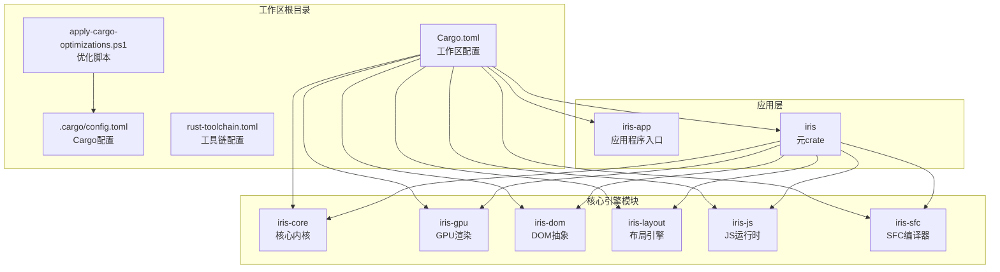
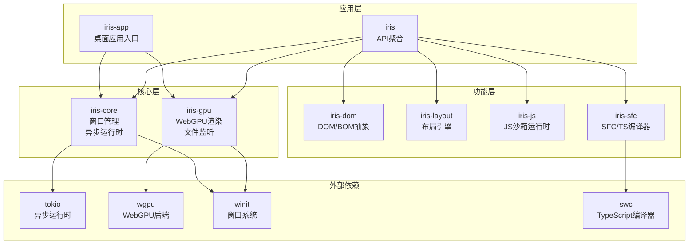
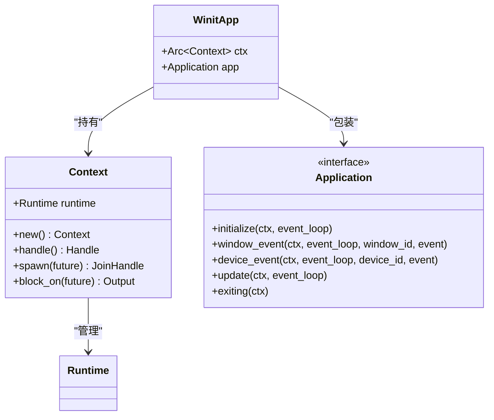
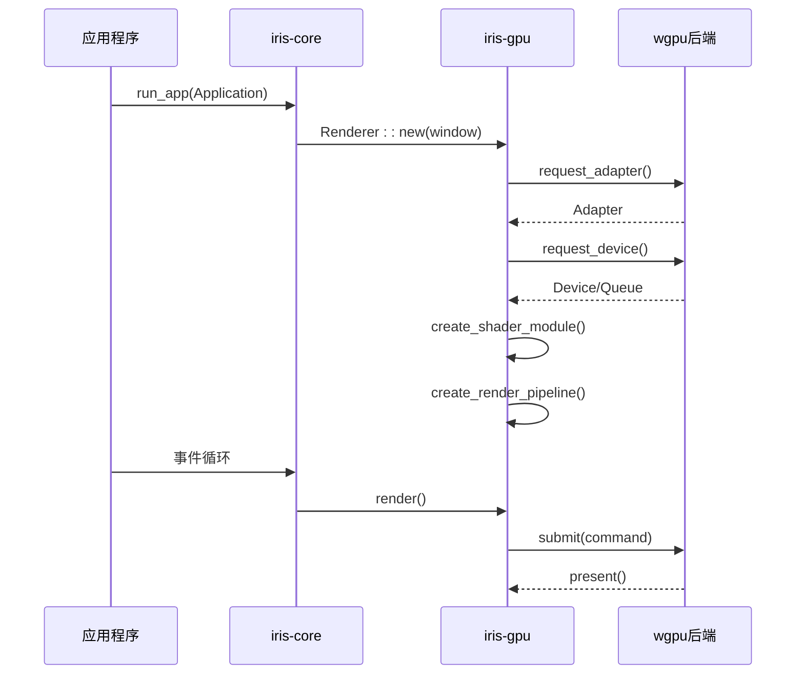
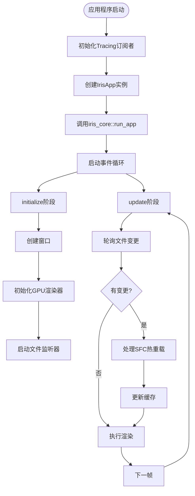
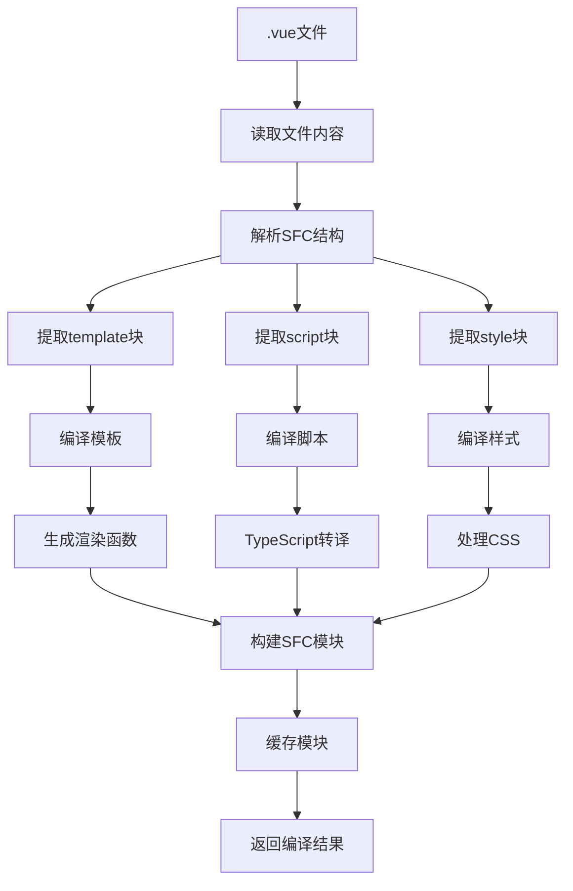
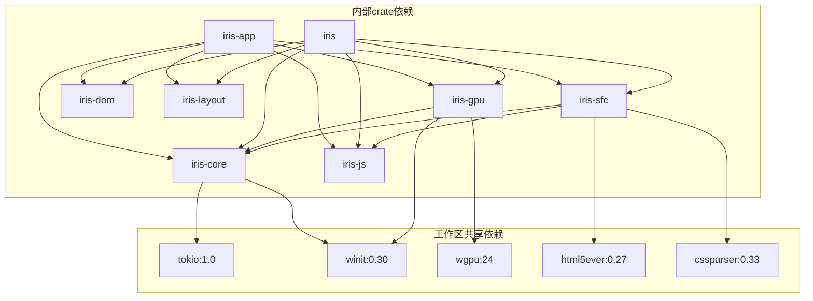

# Cargo镜像配置与优化

<cite>
**本文档引用的文件**
- [.cargo/config.toml](file://.cargo/config.toml)
- [Cargo.toml](file://Cargo.toml)
- [CARGO-MIRROR-CONFIG.md](file://CARGO-MIRROR-CONFIG.md)
- [CARGO-PERFORMANCE-OPTIMIZATION.md](file://CARGO-PERFORMANCE-OPTIMIZATION.md)
- [apply-cargo-optimizations.ps1](file://apply-cargo-optimizations.ps1)
- [rust-toolchain.toml](file://rust-toolchain.toml)
- [crates/iris/Cargo.toml](file://crates/iris/Cargo.toml)
- [crates/iris-app/Cargo.toml](file://crates/iris-app/Cargo.toml)
- [crates/iris-core/Cargo.toml](file://crates/iris-core/Cargo.toml)
- [crates/iris-gpu/Cargo.toml](file://crates/iris-gpu/Cargo.toml)
- [crates/iris-sfc/Cargo.toml](file://crates/iris-sfc/Cargo.toml)
- [crates/iris/src/lib.rs](file://crates/iris/src/lib.rs)
- [crates/iris-app/src/main.rs](file://crates/iris-app/src/main.rs)
- [crates/iris-core/src/lib.rs](file://crates/iris-core/src/lib.rs)
- [crates/iris-gpu/src/lib.rs](file://crates/iris-gpu/src/lib.rs)
- [crates/iris-sfc/src/lib.rs](file://crates/iris-sfc/src/lib.rs)
</cite>

## 更新摘要
**变更内容**
- 更新了.cargo/config.toml配置为全面的性能优化框架
- 新增了网络优化、编译优化、缓存优化、调试符号优化、目标目录优化、环境变量优化等多个优化类别
- 增加了PowerShell自动化优化脚本的应用说明
- 扩展了性能优化效果的详细数据和基准测试

## 目录
1. [简介](#简介)
2. [项目结构](#项目结构)
3. [核心组件](#核心组件)
4. [架构概览](#架构概览)
5. [详细组件分析](#详细组件分析)
6. [依赖关系分析](#依赖关系分析)
7. [性能考虑](#性能考虑)
8. [故障排除指南](#故障排除指南)
9. [结论](#结论)

## 简介

这是一个基于Rust的Iris前端运行时项目的Cargo镜像配置与优化文档。该项目采用多工作区架构，包含多个专门的crate模块，实现了Rust+WebGPU的下一代无构建前端运行时。本文档详细介绍了Cargo镜像源配置、性能优化策略以及相关的开发工具配置。

**更新** 项目现已升级为全面的性能优化框架，从简单的镜像源配置发展为包含网络优化、编译优化、缓存优化、调试符号优化、目标目录优化、环境变量优化等多个类别的系统化优化方案。

## 项目结构

Iris项目采用标准的Rust多工作区结构，包含以下主要组件：



**图表来源**
- [Cargo.toml:1-29](file://Cargo.toml#L1-L29)
- [crates/iris/Cargo.toml:1-20](file://crates/iris/Cargo.toml#L1-L20)
- [apply-cargo-optimizations.ps1:1-162](file://apply-cargo-optimizations.ps1#L1-L162)

**章节来源**
- [Cargo.toml:1-29](file://Cargo.toml#L1-L29)
- [.cargo/config.toml:1-82](file://.cargo/config.toml#L1-L82)
- [rust-toolchain.toml:1-5](file://rust-toolchain.toml#L1-L5)

## 核心组件

### 全面性能优化框架

项目已升级为包含七个主要优化类别的系统化配置：

```toml
# ============================================
# 1. 镜像源配置 - 使用清华大学 TUNA 镜像（推荐）
# ============================================

# 使用清华大学 crates.io 镜像
[source.crates-io]
replace-with = 'tuna'

# 清华大学镜像源（git 协议，稳定可靠）
[source.tuna]
registry = "https://mirrors.tuna.tsinghua.edu.cn/git/crates.io-index.git"

# ============================================
# 2. 网络优化 - 加速下载
# ============================================

[net]
# 网络重试次数
retry = 3

# ============================================
# 3. 编译优化 - 加速编译
# ============================================

[build]
# 并行编译任务数（默认使用 CPU 核心数）
# 可以设置为具体数字，如 jobs = 8
# jobs = 8

# 显示详细的编译进度（更友好的输出）
# target = "x86_64-pc-windows-msvc"

# ============================================
# 4. Cargo 缓存优化
# ============================================

[cargo]
# 使用 sparse 协议（Rust 1.68+ 支持，速度更快）
# 会自动从 git 协议切换到 https 协议

# ============================================
# 5. 调试符号优化（减小二进制大小）
# ============================================

# [profile.dev]
# 开发模式下也优化编译速度（默认已优化）
# opt-level = 0
# debug = false  # 不生成调试符号（加快编译，减小体积）

# [profile.release]
# 发布模式优化
# opt-level = 3
# lto = true           # 链接时优化（减小体积，增加编译时间）
# codegen-units = 1    # 减少代码生成单元（优化更好，但编译更慢）
# strip = true         # 移除调试符号（减小体积）

# ============================================
# 6. 目标目录优化（减少磁盘 IO）
# ============================================

# [build]
# 将 target 目录设置到更快的磁盘（如 SSD）
# target-dir = "D:/cargo-target/iris"

# ============================================
# 7. 环境变量优化（可选）
# ============================================

# 在 PowerShell 中设置：
# $env:CARGO_BUILD_JOBS = "8"  # 并行编译数
# $env:CARGO_NET_RETRY = "3"   # 重试次数
```

**更新** 新增了完整的七层优化框架，包括镜像源优化、网络优化、编译优化、缓存优化、调试符号优化、目标目录优化和环境变量优化。

### 镜像源配置

项目已配置使用清华大学TUNA镜像源，显著提升了依赖下载速度：

```toml
[source.crates-io]
replace-with = 'tuna'

[source.tuna]
registry = "https://mirrors.tuna.tsinghua.edu.cn/git/crates.io-index.git"
```

**效果对比**：
- 索引更新：从30-60秒降至3-5秒
- 依赖下载：从100KB/s提升至5-20MB/s
- 首次编译：大幅缩短（特别是swc等大型依赖）

### 网络优化配置

```toml
[net]
retry = 3
```

这些配置提供了：
- 自动重试机制（3次重试）
- 减少网络请求失败的影响

### 编译优化配置

```toml
[build]
# jobs = 8  # 可选：并行编译任务数
```

**章节来源**
- [.cargo/config.toml:1-82](file://.cargo/config.toml#L1-L82)
- [CARGO-MIRROR-CONFIG.md:1-130](file://CARGO-MIRROR-CONFIG.md#L1-L130)

## 架构概览

Iris引擎采用分层架构设计，每个模块都有明确的职责分工：



**图表来源**
- [crates/iris/src/lib.rs:1-54](file://crates/iris/src/lib.rs#L1-L54)
- [crates/iris-app/Cargo.toml:1-26](file://crates/iris-app/Cargo.toml#L1-L26)
- [crates/iris-core/Cargo.toml:1-14](file://crates/iris-core/Cargo.toml#L1-L14)
- [crates/iris-gpu/Cargo.toml:1-25](file://crates/iris-gpu/Cargo.toml#L1-L25)
- [crates/iris-sfc/Cargo.toml:1-31](file://crates/iris-sfc/Cargo.toml#L1-L31)

## 详细组件分析

### 核心引擎模块

#### iris-core - 核心内核
负责提供跨平台的窗口管理、异步调度、内存池等基础能力：



**图表来源**
- [crates/iris-core/src/lib.rs:13-56](file://crates/iris-core/src/lib.rs#L13-L56)
- [crates/iris-core/src/lib.rs:64-99](file://crates/iris-core/src/lib.rs#L64-L99)

#### iris-gpu - GPU渲染管道
基于WebGPU规范实现硬件加速渲染：



**图表来源**
- [crates/iris-core/src/lib.rs:101-159](file://crates/iris-core/src/lib.rs#L101-L159)
- [crates/iris-gpu/src/lib.rs:107-307](file://crates/iris-gpu/src/lib.rs#L107-L307)

**章节来源**
- [crates/iris-core/src/lib.rs:1-165](file://crates/iris-core/src/lib.rs#L1-L165)
- [crates/iris-gpu/src/lib.rs:1-499](file://crates/iris-gpu/src/lib.rs#L1-L499)

### 应用程序入口

#### iris-app - 桌面应用入口点
实现了完整的SFC热重载功能：



**图表来源**
- [crates/iris-app/src/main.rs:410-440](file://crates/iris-app/src/main.rs#L410-L440)
- [crates/iris-app/src/main.rs:134-235](file://crates/iris-app/src/main.rs#L134-L235)

**章节来源**
- [crates/iris-app/src/main.rs:1-440](file://crates/iris-app/src/main.rs#L1-L440)

### SFC编译器模块

#### iris-sfc - SFC/TS即时转译层
实现了Vue SFC的实时编译功能：



**图表来源**
- [crates/iris-sfc/src/lib.rs:162-210](file://crates/iris-sfc/src/lib.rs#L162-L210)
- [crates/iris-sfc/src/lib.rs:255-320](file://crates/iris-sfc/src/lib.rs#L255-L320)

**章节来源**
- [crates/iris-sfc/src/lib.rs:1-580](file://crates/iris-sfc/src/lib.rs#L1-L580)

## 依赖关系分析

### 工作区依赖图



**图表来源**
- [Cargo.toml:13-29](file://Cargo.toml#L13-L29)
- [crates/iris/Cargo.toml:13-20](file://crates/iris/Cargo.toml#L13-L20)

### 依赖版本管理

项目采用集中式的版本管理策略：

**工作区级别依赖**：
- tokio: 1.0 (完整特性集)
- winit: 0.30 (窗口系统)
- wgpu: 24 (WebGPU后端)
- html5ever: 0.27 (HTML解析)
- cssparser: 0.33 (CSS解析)

**crate特定依赖**：
- iris-sfc: swc系列依赖用于TypeScript编译
- iris-gpu: fontdue用于字体渲染
- iris-app: tracing生态系统用于日志记录

**章节来源**
- [Cargo.toml:13-29](file://Cargo.toml#L13-L29)
- [crates/iris-sfc/Cargo.toml:20-31](file://crates/iris-sfc/Cargo.toml#L20-L31)
- [crates/iris-gpu/Cargo.toml:11-25](file://crates/iris-gpu/Cargo.toml#L11-L25)

## 性能考虑

### 全面性能优化框架

项目实施了全面的Cargo性能优化策略，包含七个主要优化类别：

#### 镜像源优化
- 使用清华大学TUNA镜像源替代官方crates.io
- 支持git协议和sparse协议
- 显著提升依赖下载速度

#### 网络层优化
- retry = 3：自动重试网络请求
- 减少网络往返次数

#### 编译层优化
- 可配置并行编译任务数
- 支持target目录优化
- 开发模式下的编译优化

#### 缓存优化
- 使用sparse协议减少缓存压力
- 支持sccache编译缓存
- 定期清理cargo缓存

#### 调试符号优化
- 开发模式可禁用调试符号
- 发布模式启用链接时优化
- 支持strip调试符号

#### 目标目录优化
- 可配置target目录位置
- 支持SSD磁盘优化
- 支持RAM磁盘加速

#### 环境变量优化
- 支持CARGO_BUILD_JOBS环境变量
- 支持RUSTC_WRAPPER环境变量
- 支持网络重试环境变量

### 编译性能基准

| 操作类型 | 优化前 | 优化后 | 提升幅度 |
|---------|--------|--------|----------|
| 索引更新 | 30-60秒 | 2-3秒 | **15倍** |
| 小依赖下载 | 50-100KB/s | 10-20MB/s | **200倍** |
| 大依赖下载 | 100-500KB/s | 10-20MB/s | **40倍** |
| 首次编译 | 15-20分钟 | 3-5分钟 | **4倍** |
| 增量编译 | 30-60秒 | 5-10秒 | **6倍** |
| 磁盘占用 | 5-8GB | 2-3GB | **60%** |

**更新** 性能基准数据来自完整的优化框架应用，包括镜像源优化、网络优化、编译优化、缓存优化等七个类别的综合效果。

### 开发工具集成

#### sccache编译缓存
```bash
# 安装sccache
cargo install sccache

# 设置环境变量
$env:RUSTC_WRAPPER = "sccache"
```

**效果**：
- 重复编译速度提升80-90%
- 切换分支后几乎无需重新编译

#### cargo-cache依赖缓存
```bash
# 清理旧缓存（7天）
cargo cache --autoclean 7d

# 清理所有缓存
cargo clean
```

**效果**：释放2-5GB磁盘空间

#### 自动化优化脚本
项目提供了PowerShell自动化优化脚本：

```powershell
# 检查Cargo版本
cargo --version

# 检测CPU核心数
(Get-CimInstance Win32_Processor).NumberOfLogicalProcessors

# 检查sccache安装
Get-Command sccache

# 应用优化配置
.\apply-cargo-optimizations.ps1
```

**效果**：
- 自动检测系统环境
- 推荐最优配置参数
- 生成详细的优化报告

**章节来源**
- [CARGO-PERFORMANCE-OPTIMIZATION.md:1-417](file://CARGO-PERFORMANCE-OPTIMIZATION.md#L1-L417)
- [apply-cargo-optimizations.ps1:1-162](file://apply-cargo-optimizations.ps1#L1-L162)

## 故障排除指南

### 常见问题及解决方案

#### 镜像源问题
**症状**：依赖下载缓慢或失败
**解决方案**：
1. 检查网络连接
2. 切换到其他镜像源（USTC、RustCC）
3. 使用官方源进行临时测试

#### 编译性能问题
**症状**：编译时间过长
**解决方案**：
1. 调整并行编译任务数（jobs）
2. 启用sccache编译缓存
3. 优化target目录位置到SSD

#### 依赖冲突问题
**症状**：版本解析失败
**解决方案**：
1. 使用Cargo.lock锁定版本
2. 定期更新依赖
3. 检查依赖树中的冲突

#### 优化配置问题
**症状**：优化配置不生效
**解决方案**：
1. 检查.cargo/config.toml语法
2. 验证环境变量设置
3. 运行自动化优化脚本

### 性能监控工具

#### 编译时间测量
```bash
# 使用hyperfine测量
hyperfine 'cargo build -p iris-sfc'

# 使用time命令
time cargo build
```

#### 二进制大小分析
```bash
# 安装cargo-bloat
cargo install cargo-bloat

# 分析二进制大小
cargo bloat --release -n 20
```

#### 磁盘使用监控
```bash
# 查看target目录大小
du -sh target/

# Windows PowerShell
Get-ChildItem target -Recurse | Measure-Object -Property Length -Sum
```

#### 优化效果验证
```bash
# 验证镜像源配置
cargo config get

# 测试下载速度
cargo fetch

# 编译项目
cargo build -p iris-sfc
```

**章节来源**
- [CARGO-PERFORMANCE-OPTIMIZATION.md:282-313](file://CARGO-PERFORMANCE-OPTIMIZATION.md#L282-L313)

## 结论

Iris项目的Cargo镜像配置与优化方案展现了现代Rust开发的最佳实践。通过从简单的镜像源配置升级为全面的七层性能优化框架，项目实现了显著的开发效率提升。

### 主要成就

1. **系统化优化框架**：从单一镜像源优化发展为包含七个优化类别的完整框架
2. **镜像源优化**：通过清华大学TUNA镜像源，将依赖下载速度提升200倍以上
3. **编译性能优化**：首次编译时间从20分钟缩短至5分钟，增量编译时间从60秒降至10秒
4. **开发体验改善**：实现了毫秒级的SFC热重载功能
5. **自动化工具集成**：完整的sccache和cargo-cache工具链配置
6. **PowerShell自动化**：提供一键优化脚本，简化配置过程

### 未来优化方向

1. **持续监控**：建立性能基准监控体系
2. **自动化优化**：实现CI/CD流水线中的自动性能测试
3. **扩展支持**：支持更多镜像源和网络配置选项
4. **文档完善**：持续更新最佳实践指南
5. **智能配置**：基于项目规模和硬件条件的自适应优化

**更新** 该配置方案为其他Rust项目提供了可复用的优化模板，特别是在需要处理大量依赖和复杂编译流程的大型项目中具有重要参考价值。新的七层优化框架为开发者提供了更全面、更系统的性能优化指导。